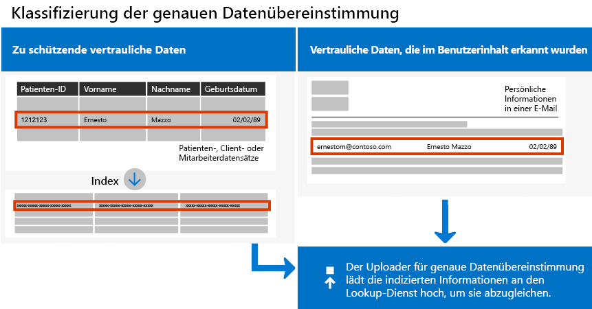

# <a name="create-custom-sensitive-information-types-with-exact-data-match-based-classification"></a><span data-ttu-id="49a02-103">Erstellen von benutzerdefinierten vertraulichen Informationstypen mit genauer Datenübereinstimmungsklassifizierung</span><span class="sxs-lookup"><span data-stu-id="49a02-103">Create custom sensitive information types with Exact Data Match based classification</span></span>

<span data-ttu-id="49a02-104">[Benutzerdefinierte Typen vertraulicher Informationen](sensitive-information-type-learn-about.md) werden verwendet, um vertrauliche Elemente zu identifizieren, sodass Sie verhindern können, dass Sie versehentlich oder in unangemessener Weise geteilt werden.</span><span class="sxs-lookup"><span data-stu-id="49a02-104">[Custom sensitive information types](sensitive-information-type-learn-about.md) are used to help identify sensitive items so that you can prevent them from being inadvertently or inappropriately shared.</span></span> <span data-ttu-id="49a02-105">Sie können einen benutzerdefinierten Typ vertraulicher Informationen folgendermaßen definieren:</span><span class="sxs-lookup"><span data-stu-id="49a02-105">You define a custom sensitive information type based on:</span></span>

- <span data-ttu-id="49a02-106">Durch Muster</span><span class="sxs-lookup"><span data-stu-id="49a02-106">patterns</span></span>
- <span data-ttu-id="49a02-107">Durch den Nachweis von Schlüsselwörtern, z. B. *Mitarbeiter*,*Badge* oder *ID*</span><span class="sxs-lookup"><span data-stu-id="49a02-107">keyword evidence such as *employee*, *badge*, or *ID*</span></span>
- <span data-ttu-id="49a02-108">Ähnliche Zeichen als Nachweis in einem bestimmten Muster</span><span class="sxs-lookup"><span data-stu-id="49a02-108">character proximity to evidence in a particular pattern</span></span>
- <span data-ttu-id="49a02-109">Konfidenzniveaus</span><span class="sxs-lookup"><span data-stu-id="49a02-109">confidence levels</span></span>

 <span data-ttu-id="49a02-110">Solche benutzerdefinierten vertraulichen Informationstypen erfüllen die geschäftlichen Anforderungen vieler Organisationen.</span><span class="sxs-lookup"><span data-stu-id="49a02-110">Such custom sensitive information types meet business needs for many organizations.</span></span>

<span data-ttu-id="49a02-111">Was aber, wenn Sie einen benutzerdefinierten vertraulichen Informationstyp nutzen möchten, der genaue Datenwerte verwendet, anstatt eines Typs, der Übereinstimmungen basierend auf generischen Mustern findet?</span><span class="sxs-lookup"><span data-stu-id="49a02-111">But what if you wanted a custom sensitive information type that uses exact data values, instead of one that found matches based on generic patterns?</span></span> <span data-ttu-id="49a02-112">Mit einer EDM-basierten Klassifizierung (Exact Data Match, genaue Datenübereinstimmung) können Sie einen benutzerdefinierten Informationstyp mit den folgenden Merkmalen erstellen:</span><span class="sxs-lookup"><span data-stu-id="49a02-112">With Exact Data Match (EDM)-based classification, you can create a custom sensitive information type that is designed to:</span></span>

- <span data-ttu-id="49a02-113">dynamisch und leicht zu aktualisieren</span><span class="sxs-lookup"><span data-stu-id="49a02-113">be dynamic and easily refreshed</span></span>
- <span data-ttu-id="49a02-114">skalierbarer</span><span class="sxs-lookup"><span data-stu-id="49a02-114">be more scalable</span></span>
- <span data-ttu-id="49a02-115">weniger falsch positive Ergebnisse</span><span class="sxs-lookup"><span data-stu-id="49a02-115">result in fewer false-positives</span></span>
- <span data-ttu-id="49a02-116">arbeitet mit strukturierten vertraulichen Daten</span><span class="sxs-lookup"><span data-stu-id="49a02-116">work with structured sensitive data</span></span>
- <span data-ttu-id="49a02-117">behandelt vertrauliche Informationen sicherer</span><span class="sxs-lookup"><span data-stu-id="49a02-117">handle sensitive information more securely</span></span>
- <span data-ttu-id="49a02-118">mit verschiedenen Microsoft Cloud Services verwendbar</span><span class="sxs-lookup"><span data-stu-id="49a02-118">be used with several Microsoft cloud services</span></span>



<span data-ttu-id="49a02-120">Die EDM-basierte Klassifikation ermöglicht es Ihnen, benutzerdefinierte vertrauliche Informationstypen zu erstellen, die sich auf genaue Werte in einer Datenbank mit vertraulichen Informationen beziehen.</span><span class="sxs-lookup"><span data-stu-id="49a02-120">EDM-based classification enables you to create custom sensitive information types that refer to exact values in a database of sensitive information.</span></span> <span data-ttu-id="49a02-121">Die Datenbank kann täglich aktualisiert werden und bis zu 100 Millionen Datenzeilen enthalten.</span><span class="sxs-lookup"><span data-stu-id="49a02-121">The database can be refreshed daily, and contain up to 100 million rows of data.</span></span> <span data-ttu-id="49a02-122">Mitarbeiter, Patienten oder Kunden kommen und gehen und Datensätze ändern sich, aber Ihre benutzerdefinierten vertraulichen Informationstypen bleiben aktuell und anwendbar.</span><span class="sxs-lookup"><span data-stu-id="49a02-122">So as employees, patients, or clients come and go, and records change, your custom sensitive information types remain current and applicable.</span></span> <span data-ttu-id="49a02-123">Darüber hinaus können Sie EDM-basierte Klassifikation mit Richtlinien verwenden, z. B. [Richtlinien zur Verhinderung von Datenverlust](data-loss-prevention-policies.md) (Data Loss Prevention, DLP) oder [Microsoft Cloud App Security-Dateirichtlinien](https://docs.microsoft.com/cloud-app-security/data-protection-policies).</span><span class="sxs-lookup"><span data-stu-id="49a02-123">And, you can use EDM-based classification with policies, such as [data loss prevention policies](data-loss-prevention-policies.md) (DLP) or [Microsoft Cloud App Security file policies](https://docs.microsoft.com/cloud-app-security/data-protection-policies).</span></span>

> [!NOTE]
> <span data-ttu-id="49a02-124">Microsoft 365 Information Protection unterstützt jetzt in der Vorschau Doppelbyte-Zeichensatz-Sprachen für:</span><span class="sxs-lookup"><span data-stu-id="49a02-124">Microsoft 365 Information Protection now  supports in preview double byte character set languages for:</span></span>
> - <span data-ttu-id="49a02-125">Chinesisch (vereinfacht)</span><span class="sxs-lookup"><span data-stu-id="49a02-125">Chinese (simplified)</span></span>
> - <span data-ttu-id="49a02-126">Chinesisch (traditionell)</span><span class="sxs-lookup"><span data-stu-id="49a02-126">Chinese (traditional)</span></span>
> - <span data-ttu-id="49a02-127">Koreanisch</span><span class="sxs-lookup"><span data-stu-id="49a02-127">Korean</span></span>
> - <span data-ttu-id="49a02-128">Japanisch</span><span class="sxs-lookup"><span data-stu-id="49a02-128">Japanese</span></span>

><span data-ttu-id="49a02-129">Diese Unterstützung ist für vertrauliche Informationstypen verfügbar.</span><span class="sxs-lookup"><span data-stu-id="49a02-129">This support is available for sensitive information types.</span></span> <span data-ttu-id="49a02-130">Mehr dazu finden Sie in den [Versionshinweisen (Vorschau) zur Unterstützung des Informationsschutzes für Doppelbyte-Zeichensätze](mip-dbcs-relnotes.md).</span><span class="sxs-lookup"><span data-stu-id="49a02-130">See, [Information protection support for double byte character sets release notes (preview)](mip-dbcs-relnotes.md) for more information.</span></span>

## <a name="required-licenses-and-permissions"></a><span data-ttu-id="49a02-131">Erforderliche Lizenzen und Berechtigungen</span><span class="sxs-lookup"><span data-stu-id="49a02-131">Required licenses and permissions</span></span>

<span data-ttu-id="49a02-132">Sie müssen ein globaler, Compliance- oder Exchange Online-Administrator sein, um die in diesem Artikel beschriebenen Aufgaben auszuführen.</span><span class="sxs-lookup"><span data-stu-id="49a02-132">You must be a global admin, compliance administrator, or Exchange Online administrator to perform the tasks described in this article.</span></span> <span data-ttu-id="49a02-133">Weitere Informationen über DLP-Berechtigungen finden Sie unter [Berechtigungen](data-loss-prevention-policies.md#permissions).</span><span class="sxs-lookup"><span data-stu-id="49a02-133">To learn more about DLP permissions, see [Permissions](data-loss-prevention-policies.md#permissions).</span></span>

<span data-ttu-id="49a02-134">Die EDM-basierte Klassifizierung ist in diesen Abonnements enthalten.</span><span class="sxs-lookup"><span data-stu-id="49a02-134">EDM-based classification is included in these subscriptions</span></span>

- <span data-ttu-id="49a02-135">Office 365 E5</span><span class="sxs-lookup"><span data-stu-id="49a02-135">Office 365 E5</span></span>
- <span data-ttu-id="49a02-136">Microsoft 365 E5</span><span class="sxs-lookup"><span data-stu-id="49a02-136">Microsoft 365 E5</span></span>
- <span data-ttu-id="49a02-137">Microsoft 365 E5 Compliance</span><span class="sxs-lookup"><span data-stu-id="49a02-137">Microsoft 365 E5 Compliance</span></span>
- <span data-ttu-id="49a02-138">Microsoft E5/ A5 Information Protection und Governance</span><span class="sxs-lookup"><span data-stu-id="49a02-138">Microsoft E5/A5 Information Protection and Governance</span></span>

## <a name="portal-links-for-your-subscription"></a><span data-ttu-id="49a02-139">Portal Links für Ihr Abonnement</span><span class="sxs-lookup"><span data-stu-id="49a02-139">Portal links for your subscription</span></span>


|<span data-ttu-id="49a02-140">Portal</span><span class="sxs-lookup"><span data-stu-id="49a02-140">Portal</span></span>  |<span data-ttu-id="49a02-141">Weltweit/GCC</span><span class="sxs-lookup"><span data-stu-id="49a02-141">World Wide/GCC</span></span>  |<span data-ttu-id="49a02-142">GCC – hoch</span><span class="sxs-lookup"><span data-stu-id="49a02-142">GCC-High</span></span>  |<span data-ttu-id="49a02-143">DOD</span><span class="sxs-lookup"><span data-stu-id="49a02-143">DOD</span></span>  |
|---------|---------|---------|---------|
|<span data-ttu-id="49a02-144">Office SCC</span><span class="sxs-lookup"><span data-stu-id="49a02-144">Office SCC</span></span>     |  <span data-ttu-id="49a02-145">protection.office.com</span><span class="sxs-lookup"><span data-stu-id="49a02-145">protection.office.com</span></span>       |<span data-ttu-id="49a02-146">scc.office365.us</span><span class="sxs-lookup"><span data-stu-id="49a02-146">scc.office365.us</span></span>         |<span data-ttu-id="49a02-147">scc.protection.apps.mil</span><span class="sxs-lookup"><span data-stu-id="49a02-147">scc.protection.apps.mil</span></span> |
|<span data-ttu-id="49a02-148">Microsoft 365 Security Center</span><span class="sxs-lookup"><span data-stu-id="49a02-148">Microsoft 365 Security center</span></span>     |<span data-ttu-id="49a02-149">security.microsoft.com</span><span class="sxs-lookup"><span data-stu-id="49a02-149">security.microsoft.com</span></span>         |<span data-ttu-id="49a02-150">security.microsoft.us</span><span class="sxs-lookup"><span data-stu-id="49a02-150">security.microsoft.us</span></span>         |<span data-ttu-id="49a02-151">security.apps.mil</span><span class="sxs-lookup"><span data-stu-id="49a02-151">security.apps.mil</span></span>|
|<span data-ttu-id="49a02-152">Microsoft 365 Compliance Center</span><span class="sxs-lookup"><span data-stu-id="49a02-152">Microsoft 365 Compliance center</span></span>     |<span data-ttu-id="49a02-153">compliance.microsoft.com</span><span class="sxs-lookup"><span data-stu-id="49a02-153">compliance.microsoft.com</span></span>         |<span data-ttu-id="49a02-154">compliance.microsoft.us</span><span class="sxs-lookup"><span data-stu-id="49a02-154">compliance.microsoft.us</span></span>         |<span data-ttu-id="49a02-155">compliance.apps.mil</span><span class="sxs-lookup"><span data-stu-id="49a02-155">compliance.apps.mil</span></span>|


## <a name="the-work-flow-at-a-glance"></a><span data-ttu-id="49a02-156">Der Workflow auf einen Blick</span><span class="sxs-lookup"><span data-stu-id="49a02-156">The work flow at a glance</span></span>

|<span data-ttu-id="49a02-157">Phase</span><span class="sxs-lookup"><span data-stu-id="49a02-157">Phase</span></span>  |<span data-ttu-id="49a02-158">Anforderungen</span><span class="sxs-lookup"><span data-stu-id="49a02-158">What's needed</span></span>  |
|---------|---------|
|[<span data-ttu-id="49a02-159">Teil 1: Einrichten der EDM-basierten Klassifizierung</span><span class="sxs-lookup"><span data-stu-id="49a02-159">Part 1: Set up EDM-based classification</span></span>](#part-1-set-up-edm-based-classification)<br/><br/><span data-ttu-id="49a02-160">(je nach Bedarf)</span><span class="sxs-lookup"><span data-stu-id="49a02-160">(As needed)</span></span><br/><span data-ttu-id="49a02-161">- [Bearbeiten des Datenbankschemas](#editing-the-schema-for-edm-based-classification)</span><span class="sxs-lookup"><span data-stu-id="49a02-161">- [Edit the database schema](#editing-the-schema-for-edm-based-classification)</span></span> <br/><span data-ttu-id="49a02-162">- [Entfernen des Schemas](#removing-the-schema-for-edm-based-classification)</span><span class="sxs-lookup"><span data-stu-id="49a02-162">- [Remove the schema](#removing-the-schema-for-edm-based-classification)</span></span> |<span data-ttu-id="49a02-163">– Lesezugriff auf vertrauliche Daten</span><span class="sxs-lookup"><span data-stu-id="49a02-163">- Read access to the sensitive data</span></span><br/><span data-ttu-id="49a02-164">– Datenbankschema im XML-Format (Beispiel)</span><span class="sxs-lookup"><span data-stu-id="49a02-164">- Database schema in XML format (example provided)</span></span><br/><span data-ttu-id="49a02-165">– Regelpaket im XML-Format (Beispiel)</span><span class="sxs-lookup"><span data-stu-id="49a02-165">- Rule package in XML format (example provided)</span></span><br/><span data-ttu-id="49a02-166">– Administratorberechtigungen für das Security & Compliance Center (mithilfe von PowerShell)</span><span class="sxs-lookup"><span data-stu-id="49a02-166">- Admin permissions to the Security & Compliance Center (using PowerShell)</span></span> |
|[<span data-ttu-id="49a02-167">Teil 2: Hashen und Hochladen vertraulicher Daten</span><span class="sxs-lookup"><span data-stu-id="49a02-167">Part 2: Hash and upload the sensitive data</span></span>](#part-2-hash-and-upload-the-sensitive-data)<br/><br/><span data-ttu-id="49a02-168">(je nach Bedarf)</span><span class="sxs-lookup"><span data-stu-id="49a02-168">(As needed)</span></span><br/>[<span data-ttu-id="49a02-169">Aktualisieren der Daten</span><span class="sxs-lookup"><span data-stu-id="49a02-169">Refresh the data</span></span>](#refreshing-your-sensitive-information-database) |<span data-ttu-id="49a02-170">– Benutzerdefinierte Sicherheitsgruppe und Benutzerkonto</span><span class="sxs-lookup"><span data-stu-id="49a02-170">- Custom security group and user account</span></span><br/><span data-ttu-id="49a02-171">– Lokaler Administratorzugriff auf den Computer mit dem EDM-Upload-Agent</span><span class="sxs-lookup"><span data-stu-id="49a02-171">- Local admin access to machine with EDM Upload Agent</span></span><br/><span data-ttu-id="49a02-172">– Lesezugriff auf vertrauliche Daten</span><span class="sxs-lookup"><span data-stu-id="49a02-172">- Read access to the sensitive data</span></span><br/><span data-ttu-id="49a02-173">– Prozess und Zeitplan für die Datenaktualisierung</span><span class="sxs-lookup"><span data-stu-id="49a02-173">- Process and schedule for refreshing the data</span></span>|
|[<span data-ttu-id="49a02-174">Teil 3: Verwenden der EDM-basierten Klassifizierung mit Ihren Microsoft Cloud Services</span><span class="sxs-lookup"><span data-stu-id="49a02-174">Part 3: Use EDM-based classification with your Microsoft cloud services</span></span>](#part-3-use-edm-based-classification-with-your-microsoft-cloud-services) |<span data-ttu-id="49a02-175">– Microsoft 365-Abonnement mit DLP</span><span class="sxs-lookup"><span data-stu-id="49a02-175">- Microsoft 365 subscription with DLP</span></span><br/><span data-ttu-id="49a02-176">– EDM-basiertes Klassifizierungsfeature aktiviert</span><span class="sxs-lookup"><span data-stu-id="49a02-176">- EDM-based classification feature enabled</span></span> |

### <a name="part-1-set-up-edm-based-classification"></a><span data-ttu-id="49a02-177">Teil 1: Einrichten der EDM-basierten Klassifizierung</span><span class="sxs-lookup"><span data-stu-id="49a02-177">Part 1: Set up EDM-based classification</span></span>

<span data-ttu-id="49a02-178">Das Einrichten und Konfigurieren der EDM-basierten Klassifizierung umfasst:</span><span class="sxs-lookup"><span data-stu-id="49a02-178">Setting up and configuring EDM-based classification involves:</span></span>

1. [<span data-ttu-id="49a02-179">Speichern vertraulicher Daten im CSV-Format</span><span class="sxs-lookup"><span data-stu-id="49a02-179">Saving sensitive data in .csv format</span></span>](#save-sensitive-data-in-csv-format)
2. [<span data-ttu-id="49a02-180">Definieren Ihres Datenbankschemas für vertrauliche Informationen</span><span class="sxs-lookup"><span data-stu-id="49a02-180">Define your sensitive information database schema</span></span>](#define-the-schema-for-your-database-of-sensitive-information)
3. [<span data-ttu-id="49a02-181">Erstellen eines Regelpakets</span><span class="sxs-lookup"><span data-stu-id="49a02-181">Create a rule package</span></span>](#set-up-a-rule-package)


#### <a name="save-sensitive-data-in-csv-format"></a><span data-ttu-id="49a02-182">Speichern vertraulicher Daten im CSV-Format</span><span class="sxs-lookup"><span data-stu-id="49a02-182">Save sensitive data in .csv format</span></span>

1. <span data-ttu-id="49a02-183">Identifizieren Sie die vertraulichen Informationen, die Sie verwenden möchten.</span><span class="sxs-lookup"><span data-stu-id="49a02-183">Identify the sensitive information you want to use.</span></span> <span data-ttu-id="49a02-184">Exportieren Sie die Daten in eine App, wie z. B. Microsoft Excel, und speichern Sie die Datei im CSV-Format.</span><span class="sxs-lookup"><span data-stu-id="49a02-184">Export the data to an app, such as Microsoft Excel, and save the file in .csv format.</span></span> <span data-ttu-id="49a02-185">Die Datendatei kann maximal Folgendes umfassen:</span><span class="sxs-lookup"><span data-stu-id="49a02-185">The data file can include a maximum of:</span></span>
      - <span data-ttu-id="49a02-186">bis zu 100 Millionen Zeilen vertraulicher Daten</span><span class="sxs-lookup"><span data-stu-id="49a02-186">Up to 100 million rows of sensitive data</span></span>
      - <span data-ttu-id="49a02-187">bis zu 32 Spalten (Felder) pro Datenquelle</span><span class="sxs-lookup"><span data-stu-id="49a02-187">Up to 32 columns (fields) per data source</span></span>
      - <span data-ttu-id="49a02-188">bis zu 5 als durchsuchbar markierte Spalten (Felder)</span><span class="sxs-lookup"><span data-stu-id="49a02-188">Up to 5 columns (fields) marked as searchable</span></span>

2. <span data-ttu-id="49a02-189">Strukturieren Sie die vertraulichen Daten in der CSV-Datei so, dass die erste Zeile die Namen der für die EDM-basierte Klassifizierung verwendeten Felder enthält.</span><span class="sxs-lookup"><span data-stu-id="49a02-189">Structure the sensitive data in the .csv file such that the first row includes the names of the fields used for EDM-based classification.</span></span> <span data-ttu-id="49a02-190">Möglicherweise gibt es in Ihrer CSV-Datei Feldnamen, wie z. B. "SSN", "Geburtsdatum", "Vorname" oder "Nachname".</span><span class="sxs-lookup"><span data-stu-id="49a02-190">In your .csv file, you might have field names, such as "ssn", "birthdate", "firstname", "lastname".</span></span> <span data-ttu-id="49a02-191">Die Namen der Spaltenüberschriften dürfen keine Leerzeichen oder Unterstriche enthalten.</span><span class="sxs-lookup"><span data-stu-id="49a02-191">The column header names can't include spaces or underscores.</span></span> <span data-ttu-id="49a02-192">Die CSV-Datei, die wir in diesem Artikel verwenden, trägt beispielsweise den Namen *PatientRecords.csv* und hat u. a. die Spalten *PatientID*, *MRN*, *LastName*, *FirstName* und *SSN*.</span><span class="sxs-lookup"><span data-stu-id="49a02-192">For example, the sample .csv file that we use in this article is named *PatientRecords.csv*, and its columns include *PatientID*, *MRN*, *LastName*, *FirstName*, *SSN*, and more.</span></span>

3. <span data-ttu-id="49a02-193">Achten Sie auf das Format der Felder für die vertraulichen Daten.</span><span class="sxs-lookup"><span data-stu-id="49a02-193">Pay attention to the format of the sensitive data fields.</span></span> <span data-ttu-id="49a02-194">Insbesondere würden Felder, deren Inhalt Kommas enthalten kann (z. B. eine Straßenadresse, die den Wert „Seattle,WA“ enthält), beim Parsen durch das EDM-Tool als zwei getrennte Felder interpretiert werden.</span><span class="sxs-lookup"><span data-stu-id="49a02-194">In particular, fields that may contain commas in their content (e.g. a street address that contains the value "Seattle,WA") would be parsed as two eparate fields when parsed by the EDM tool.</span></span> <span data-ttu-id="49a02-195">Um dies zu vermeiden, müssen Sie sicherstellen, dass solche Felder in der Tabelle mit den vertraulichen Daten von einfachen oder doppelten Anführungszeichen umgeben sind.</span><span class="sxs-lookup"><span data-stu-id="49a02-195">In order to avoid this, you need to ensure such fields are surrounded by single or double quotes in the sensitive data table.</span></span> <span data-ttu-id="49a02-196">Wenn Felder, die Kommas enthalten können, auch Leerzeichen enthalten können, müssen Sie einen benutzerdefinierten Datentyp für vertrauliche Daten erstellen, der dem entsprechenden Format entspricht (z. B. eine Zeichenfolge aus mehreren Wörtern mit Kommas und Leerzeichen darin), um sicherzustellen, dass die Zeichenfolge beim Scannen des Dokuments richtig zugeordnet wird.</span><span class="sxs-lookup"><span data-stu-id="49a02-196">If fields with commas in them may also contain spaces, you would need to create a custom Sensitive Information Type that matches the corresponding format (e.g. a multi-word string with commas and spaces in it) to ensure the string is correctly matched wjen the document is scanned.</span></span>

#### <a name="define-the-schema-for-your-database-of-sensitive-information"></a><span data-ttu-id="49a02-197">Definieren des Schemas für Ihre Datenbank mit vertraulichen Informationen</span><span class="sxs-lookup"><span data-stu-id="49a02-197">Define the schema for your database of sensitive information</span></span>

<span data-ttu-id="49a02-198">Wenn Sie es aus geschäftlichen oder technischen Gründen vorziehen, PowerShell oder die Befehlszeile nicht zu verwenden, um Ihr Schema und EDM-vertraulicher-Informationstyp-Muster (Regelpaket) zu erstellen, können Sie den [Exact Data Match Schema- und Vertraulicher Informationstyp Assistent](sit-edm-wizard.md) verwenden, um sie zu erstellen.</span><span class="sxs-lookup"><span data-stu-id="49a02-198">If for business or technical reasons, you prefer not to use PowerShell or command line to create your schema and EDM sensitive info type patter (rule package), you can use the [Exact Data Match Schema and Sensitive Information Type Wizard](sit-edm-wizard.md) to create them.</span></span> <span data-ttu-id="49a02-199">Wenn Sie mit dem Erstellen des Schemas und des EDM-vertraulicher-Informationstyp-Musters fertig sind, kehren Sie zurück, um alle Schritte abzuschließen, die erforderlich sind, um Ihren EDM-basierten vertraulicher Informationstyp für die Verwendung verfügbar zu machen.</span><span class="sxs-lookup"><span data-stu-id="49a02-199">When you are done creating the schema and EDM sensitive info type pattern, return to complete all the steps necessary to make your EDM based sensitive information type available for use.</span></span>

> [!NOTE]
> <span data-ttu-id="49a02-200">Der Assistent für die Exact Data Match Schema und vertraulicher Informationstyp ist nur für die World Wide- und GCC-Cloud verfügbar.</span><span class="sxs-lookup"><span data-stu-id="49a02-200">The Exact Data Match Schema and Sensitive Information Type Wizard is only available for the World Wide and GCC clouds only.</span></span>

1. <span data-ttu-id="49a02-201">Definieren Sie das Schema für die Datenbank mit vertraulichen Informationen im XML-Format (ähnlich wie in unserem Beispiel unten).</span><span class="sxs-lookup"><span data-stu-id="49a02-201">Define the schema for the database of sensitive information in XML format (similar to our example below).</span></span> <span data-ttu-id="49a02-202">Nennen Sie diese Schemadatei **edm.xml** und konfigurieren Sie sie so, dass es für jede Spalte in der Datenbank eine Zeile mit der folgenden Syntax gibt:</span><span class="sxs-lookup"><span data-stu-id="49a02-202">Name this schema file **edm.xml**, and configure it such that for each column in the database, there is a line that uses the syntax:</span></span> 

      <span data-ttu-id="49a02-203">`\<Field name="" searchable=""/\>`.</span><span class="sxs-lookup"><span data-stu-id="49a02-203">`\<Field name="" searchable=""/\>`.</span></span>

      - <span data-ttu-id="49a02-204">Verwenden Sie Spaltennamen für *Field name*-Werte.</span><span class="sxs-lookup"><span data-stu-id="49a02-204">Use column names for *Field name* values.</span></span>
      - <span data-ttu-id="49a02-205">Verwenden Sie *searchable="true“* für maximal 5 Felder, die durchsuchbar sein sollen.</span><span class="sxs-lookup"><span data-stu-id="49a02-205">Use *searchable="true"* for the fields that you want to be searchable up to a maximum of 5 fields.</span></span> <span data-ttu-id="49a02-206">Mindestens ein Feld muss durchsuchbar sein.</span><span class="sxs-lookup"><span data-stu-id="49a02-206">At least one field must be searchable.</span></span>

      <span data-ttu-id="49a02-207">Im folgenden Beispiel definiert die XML-Datei das Schema für eine Datenbank mit Patientendatensätzen, wobei fünf Felder als durchsuchbar angegeben werden: *PatientID*, *MRN*, *SSN*, *Phone* und *DOB*.</span><span class="sxs-lookup"><span data-stu-id="49a02-207">As an example, the following XML file defines the schema for a patient records database, with five fields specified as searchable: *PatientID*, *MRN*, *SSN*, *Phone*, and *DOB*.</span></span>

      <span data-ttu-id="49a02-208">(Sie können das Beispiel kopieren, ändern und verwenden.)</span><span class="sxs-lookup"><span data-stu-id="49a02-208">(You can copy, modify, and use our example.)</span></span>

      ```xml
      <EdmSchema xmlns="http://schemas.microsoft.com/office/2018/edm">
            <DataStore name="PatientRecords" description="Schema for patient records" version="1">
                  <Field name="PatientID" searchable="true" caseInsensitive="true" ignoredDelimiters="-,/,*,#,^" />
                  <Field name="MRN" searchable="true" />
                  <Field name="FirstName" />
                  <Field name="LastName" />
                  <Field name="SSN" searchable="true" />
                  <Field name="Phone" searchable="true" />
                  <Field name="DOB" searchable="true" />
                  <Field name="Gender" />
                  <Field name="Address" />
            </DataStore>
      </EdmSchema>
      ```

##### <a name="configurable-match-using-the-caseinsensitive-and-ignoreddelimiters-fields"></a><span data-ttu-id="49a02-209">Konfigurierbare Übereinstimmung unter Verwendung der Felder caseInsensitive und ignoredDelimiters</span><span class="sxs-lookup"><span data-stu-id="49a02-209">Configurable match using the caseInsensitive and ignoredDelimiters fields</span></span>

<span data-ttu-id="49a02-210">Das obige XML-Beispiel verwendet die Felder `caseInsensitive` und `ignoredDelimiters`.</span><span class="sxs-lookup"><span data-stu-id="49a02-210">The above XML sample makes use of the `caseInsensitive` and the `ignoredDelimiters` fields.</span></span> 

<span data-ttu-id="49a02-211">Wenn Sie das Feld \***caseInsensitive** _ in Ihre Schemadefinition aufnehmen, das auf den Wert von `true` festgelegt ist, schließt EDM ein Element nicht aus, das auf Groß- und Kleinschreibung für das `PatientID` Feld basiert.</span><span class="sxs-lookup"><span data-stu-id="49a02-211">When you include the \***caseInsensitive** _ field set to the value of `true` in your schema definition, EDM will not exclude an item based on case differences for `PatientID` field.</span></span> <span data-ttu-id="49a02-212">EDM wird also sehen, dass `PatientID` _ *FOO-1234*\* und **fOo-1234** identisch sind.</span><span class="sxs-lookup"><span data-stu-id="49a02-212">So EDM will see, `PatientID` _ *FOO-1234*\* and **fOo-1234** as being identical.</span></span>

<span data-ttu-id="49a02-213">Wenn Sie das Feld **_ignoredDelimiters_*_ mit unterstützten Zeichen einfügen, ignoriert EDM diese Zeichen im `PatientID`. EDM wird also sehen, dass`PatientID` _\* FOO-1234*\* und `PatientID` **FOO#1234** identisch sind.</span><span class="sxs-lookup"><span data-stu-id="49a02-213">When you include the **_ignoredDelimiters_*_ field with supported characters,  EDM will ignore those characters in the `PatientID`. So EDM will see, `PatientID` _\* FOO-1234*\* and `PatientID` **FOO#1234** as being identical.</span></span> <span data-ttu-id="49a02-214">Das Banner `ignoredDelimiters` unterstützt alle nicht alphanumerischen Zeichen. Hier einige Beispiele:</span><span class="sxs-lookup"><span data-stu-id="49a02-214">The `ignoredDelimiters` flag supports any non-alphanumeric character, here are some examples:</span></span>
- <span data-ttu-id="49a02-215">\.</span><span class="sxs-lookup"><span data-stu-id="49a02-215">\.</span></span>
- \-
- \/
- \_
- \*
- \^
- \#
- \!
- \?
- \[
- \]
- \{
- \}
- \\
- \~
- \; 

- <span data-ttu-id="49a02-216">Das Banner `ignoredDelimiters` ist nicht vorhanden:</span><span class="sxs-lookup"><span data-stu-id="49a02-216">The `ignoredDelimiters` flag doesn't support:</span></span>
- <span data-ttu-id="49a02-217">Zeichen 0-9</span><span class="sxs-lookup"><span data-stu-id="49a02-217">characters 0-9</span></span>
- <span data-ttu-id="49a02-218">A-Z</span><span class="sxs-lookup"><span data-stu-id="49a02-218">A-Z</span></span>
- <span data-ttu-id="49a02-219">a-z</span><span class="sxs-lookup"><span data-stu-id="49a02-219">a-z</span></span>
- \"
- \,

<span data-ttu-id="49a02-220">In diesem Beispiel, in dem beide, `caseInsensitive` und `ignoredDelimiters`, verwendet werden, sieht EDM **FOO-1234** und **fOo#1234** als identisch an und klassifiziert das Element als sensiblen Informationstyp für Patientenakten.</span><span class="sxs-lookup"><span data-stu-id="49a02-220">In this example, where both `caseInsensitive` and `ignoredDelimiters` are used, EDM would see **FOO-1234** and **fOo#1234** as  identical and classify the item as a patient record sensitive information type.</span></span> 

4. <span data-ttu-id="49a02-221">Informationen zum Herstellen der Verbindung zu Security & Compliance Center PowerShell finden Sie unter [Verbinden mit Security & Compliance Center PowerShell](https://docs.microsoft.com/powershell/exchange/connect-to-scc-powershell).</span><span class="sxs-lookup"><span data-stu-id="49a02-221">Connect to the Security & Compliance center using the procedures in [Connect to Security & Compliance Center PowerShell](https://docs.microsoft.com/powershell/exchange/connect-to-scc-powershell).</span></span>

5. <span data-ttu-id="49a02-222">Führen Sie die folgenden Cmdlets nacheinander aus, um das Datenbankschema hochzuladen:</span><span class="sxs-lookup"><span data-stu-id="49a02-222">To upload the database schema, run the following cmdlets, one at a time:</span></span>

      ```powershell
      $edmSchemaXml=Get-Content .\\edm.xml -Encoding Byte -ReadCount 0
      New-DlpEdmSchema -FileData $edmSchemaXml -Confirm:$true
      ```

      <span data-ttu-id="49a02-223">Sie werden zu folgenden Bestätigungen aufgefordert:</span><span class="sxs-lookup"><span data-stu-id="49a02-223">You will be prompted to confirm, as follows:</span></span>

      > <span data-ttu-id="49a02-224">Bestätigen</span><span class="sxs-lookup"><span data-stu-id="49a02-224">Confirm</span></span>
      >
      > <span data-ttu-id="49a02-225">Möchten Sie diese Aktion wirklich ausführen?</span><span class="sxs-lookup"><span data-stu-id="49a02-225">Are you sure you want to perform this action?</span></span>
      >
      > <span data-ttu-id="49a02-226">Das neue EDM-Schema für den Datenspeicher „patientrecords“ wird importiert.</span><span class="sxs-lookup"><span data-stu-id="49a02-226">New EDM Schema for the data store 'patientrecords' will be imported.</span></span>
      >
      > <span data-ttu-id="49a02-227">\[J\] Ja \[A\] Ja für alle \[N\] Nein \[L\] Nein für alle \[?\] Hilfe (Standard ist "J"):</span><span class="sxs-lookup"><span data-stu-id="49a02-227">\[Y\] Yes \[A\] Yes to All \[N\] No \[L\] No to All \[?\] Help (default is "Y"):</span></span>

> [!TIP]
> <span data-ttu-id="49a02-228">Wenn Sie möchten, dass Ihre Änderungen ohne Bestätigung durchgeführt werden, verwenden Sie in Schritt 5 stattdessen das folgende Cmdlet: New-DlpEdmSchema -FileData $edmSchemaXml</span><span class="sxs-lookup"><span data-stu-id="49a02-228">If you want your changes to occur without confirmation, in Step 5, use this cmdlet instead: New-DlpEdmSchema -FileData $edmSchemaXml</span></span>

> [!NOTE]
> <span data-ttu-id="49a02-229">Es kann zwischen 10–60 Minuten dauern, bis das EDMSchema durch Ergänzungen aktualisiert wird.</span><span class="sxs-lookup"><span data-stu-id="49a02-229">It can take between 10-60 minutes to update the EDMSchema with additions.</span></span> <span data-ttu-id="49a02-230">Das Update muss abgeschlossen sein, bevor Sie Schritte ausführen, die die Zusätze verwenden.</span><span class="sxs-lookup"><span data-stu-id="49a02-230">The update must complete before you execute steps that use the additions.</span></span>

#### <a name="set-up-a-rule-package"></a><span data-ttu-id="49a02-231">Einrichten eines Regelpakets</span><span class="sxs-lookup"><span data-stu-id="49a02-231">Set up a rule package</span></span>

1. <span data-ttu-id="49a02-232">Erstellen Sie ein Regelpaket im XML-Format (mit Unicode-Codierung), ähnlich wie im folgenden Beispiel.</span><span class="sxs-lookup"><span data-stu-id="49a02-232">Create a rule package in XML format (with Unicode encoding), similar to the following example.</span></span> <span data-ttu-id="49a02-233">(Sie können das Beispiel kopieren, ändern und verwenden.)</span><span class="sxs-lookup"><span data-stu-id="49a02-233">(You can copy, modify, and use our example.)</span></span>

      <span data-ttu-id="49a02-234">Vergewissern Sie sich beim Einrichten des Regelpakets, dass Sie die CSV-Datei und die **edm.xml**-Datei korrekt referenzieren.</span><span class="sxs-lookup"><span data-stu-id="49a02-234">When you set up your rule package, make sure to correctly reference your .csv file and **edm.xml** file.</span></span> <span data-ttu-id="49a02-235">Sie können das Beispiel kopieren, ändern und verwenden.</span><span class="sxs-lookup"><span data-stu-id="49a02-235">You can copy, modify, and use our example.</span></span> <span data-ttu-id="49a02-236">In dieser XML-Beispieldatei müssen die folgenden Felder so angepasst werden, dass Sie Ihren vertraulichen EDM-Typ erstellen:</span><span class="sxs-lookup"><span data-stu-id="49a02-236">In this sample xml the following fields needs to be customized to create your EDM sensitive type:</span></span>

      - <span data-ttu-id="49a02-237">**RulePack id und ExactMatch id**: Verwenden Sie [New-GUID](https://docs.microsoft.com/powershell/module/microsoft.powershell.utility/new-guid?view=powershell-6), um eine GUID zu generieren.</span><span class="sxs-lookup"><span data-stu-id="49a02-237">**RulePack id & ExactMatch id**: Use [New-GUID](https://docs.microsoft.com/powershell/module/microsoft.powershell.utility/new-guid?view=powershell-6) to generate a GUID.</span></span>

      - <span data-ttu-id="49a02-238">**Datenspeicher**: Dieses Feld gibt den zu verwendenden EDM-Nachschlage-Datenspeicher an.</span><span class="sxs-lookup"><span data-stu-id="49a02-238">**Datastore**: This field specifies EDM lookup data store to be used.</span></span> <span data-ttu-id="49a02-239">Sie geben einen Datenquellennamen eines konfigurierten EDM-Schemas an.</span><span class="sxs-lookup"><span data-stu-id="49a02-239">You provide a data source name of a configured EDM Schema.</span></span>

      - <span data-ttu-id="49a02-240">**idMatch**: Dieses Feld verweist auf das primäre Element für EDM.</span><span class="sxs-lookup"><span data-stu-id="49a02-240">**idMatch**: This field points to the primary element for EDM.</span></span>
        - <span data-ttu-id="49a02-241">Stimmt überein mit: gibt das Feld an, das in der exakten Suche verwendet werden soll.</span><span class="sxs-lookup"><span data-stu-id="49a02-241">Matches: Specifies the field to be used in exact lookup.</span></span> <span data-ttu-id="49a02-242">Sie geben den Namen eines durchsuchbaren Felds im EDM-Schema für den Datenspeicher an.</span><span class="sxs-lookup"><span data-stu-id="49a02-242">You provide a searchable field name in EDM Schema for the DataStore.</span></span>
        - <span data-ttu-id="49a02-243">Klassifizierung: Dieses Feld gibt die Übereinstimmung für den vertraulichen Typ an, der EDM-Nachschlagevorgänge auslöst.</span><span class="sxs-lookup"><span data-stu-id="49a02-243">Classification: This field specifies the sensitive type match that triggers EDM lookup.</span></span> <span data-ttu-id="49a02-244">Sie können den Namen oder die GUID einer vorhandenen integrierten oder benutzerdefinierten Klassifizierung angeben.</span><span class="sxs-lookup"><span data-stu-id="49a02-244">You can provide Name or GUID of an existing built-in or custom classification.</span></span>

      - <span data-ttu-id="49a02-245">**Übereinstimmung:** Dieses Feld verweist auf zusätzliche Nachweise, die sich in der Nähe von "idMatch" befinden.</span><span class="sxs-lookup"><span data-stu-id="49a02-245">**Match:** This field points to additional evidence found in proximity of idMatch.</span></span>
        - <span data-ttu-id="49a02-246">Stimmt überein mit: Sie geben einen Feldnamen im EDM-Schema für den Datenspeicher an.</span><span class="sxs-lookup"><span data-stu-id="49a02-246">Matches: You provide any field name in EDM Schema for DataStore.</span></span>
      - <span data-ttu-id="49a02-247">**Ressource:** In diesem Abschnitt werden der Name und die Beschreibung für den vertraulichen Typ in mehreren Sprachversionen angegeben.</span><span class="sxs-lookup"><span data-stu-id="49a02-247">**Resource:** This section specifies the name and description for sensitive type in multiple locales.</span></span>
        - <span data-ttu-id="49a02-248">idRef: Sie geben die GUID für die ExactMatch-ID an.</span><span class="sxs-lookup"><span data-stu-id="49a02-248">idRef: You provide GUID for ExactMatch ID.</span></span>
        - <span data-ttu-id="49a02-249">Name und Beschreibungen: nach Bedarf anpassen.</span><span class="sxs-lookup"><span data-stu-id="49a02-249">Name & descriptions: customize as required.</span></span>

      ```xml
      <RulePackage xmlns="http://schemas.microsoft.com/office/2018/edm">
        <RulePack id="fd098e03-1796-41a5-8ab6-198c93c62b11">
          <Version build="0" major="2" minor="0" revision="0" />
          <Publisher id="eb553734-8306-44b4-9ad5-c388ad970528" />
          <Details defaultLangCode="en-us">
            <LocalizedDetails langcode="en-us">
              <PublisherName>IP DLP</PublisherName>
              <Name>Health Care EDM Rulepack</Name>
              <Description>This rule package contains the EDM sensitive type for health care sensitive types.</Description>
            </LocalizedDetails>
          </Details>
        </RulePack>
        <Rules>
          <ExactMatch id = "E1CC861E-3FE9-4A58-82DF-4BD259EAB371" patternsProximity = "300" dataStore ="PatientRecords" recommendedConfidence = "65" >
            <Pattern confidenceLevel="65">
              <idMatch matches = "SSN" classification = "U.S. Social Security Number (SSN)" />
            </Pattern>
            <Pattern confidenceLevel="75">
              <idMatch matches = "SSN" classification = "U.S. Social Security Number (SSN)" />
              <Any minMatches ="3" maxMatches ="6">
                <match matches="PatientID" />
                <match matches="MRN"/>
                <match matches="FirstName"/>
                <match matches="LastName"/>
                <match matches="Phone"/>
                <match matches="DOB"/>
              </Any>
            </Pattern>
          </ExactMatch>
          <LocalizedStrings>
            <Resource idRef="E1CC861E-3FE9-4A58-82DF-4BD259EAB371">
              <Name default="true" langcode="en-us">Patient SSN Exact Match.</Name>
              <Description default="true" langcode="en-us">EDM Sensitive type for detecting Patient SSN.</Description>
            </Resource>
          </LocalizedStrings>
        </Rules>
      </RulePackage>
      ```

2. <span data-ttu-id="49a02-250">Laden Sie das Regelpaket hoch, indem Sie nacheinander die folgenden PowerShell-Cmdlets ausführen:</span><span class="sxs-lookup"><span data-stu-id="49a02-250">Upload the rule package by running the following PowerShell cmdlets, one at a time:</span></span>

      ```powershell
      $rulepack=Get-Content .\\rulepack.xml -Encoding Byte -ReadCount 0
      New-DlpSensitiveInformationTypeRulePackage -FileData $rulepack
      ```

<span data-ttu-id="49a02-251">Sie haben die EDM-basierte Klassifizierung nun eingerichtet.</span><span class="sxs-lookup"><span data-stu-id="49a02-251">At this point, you have set up EDM-based classification.</span></span> <span data-ttu-id="49a02-252">Der nächste Schritt ist das Hashen vertraulicher Daten, gefolgt vom Hochladen der Hashes für die Indizierung.</span><span class="sxs-lookup"><span data-stu-id="49a02-252">The next step is to hash the sensitive data, and then upload the hashes for indexing.</span></span>

<span data-ttu-id="49a02-253">Wie Sie im vorherigen Verfahren erfahren haben, wurden im PatientRecords-Schema fünf Felder als durchsuchbar definiert: *PatientID*, *MRN*, *SSN*, *Phone* und *DOB*.</span><span class="sxs-lookup"><span data-stu-id="49a02-253">Recall from the previous procedure that our PatientRecords schema defines five fields as searchable: *PatientID*, *MRN*, *SSN*, *Phone*, and *DOB*.</span></span> <span data-ttu-id="49a02-254">In unserem Beispiel für ein Regelpaket sind diese Felder enthalten, und es wird auf die Datenbankschemadatei (**edm.xml**) verwiesen, wobei ein *ExactMatch*-Element pro durchsuchbarem Feld vorhanden ist.</span><span class="sxs-lookup"><span data-stu-id="49a02-254">Our example rule package includes those fields and references the database schema file (**edm.xml**), with one *ExactMatch* item per searchable field.</span></span> <span data-ttu-id="49a02-255">Sehen Sie sich das folgende ExactMatch-Element an:</span><span class="sxs-lookup"><span data-stu-id="49a02-255">Consider the following ExactMatch item:</span></span>

```xml
<ExactMatch id = "E1CC861E-3FE9-4A58-82DF-4BD259EAB371" patternsProximity = "300" dataStore ="PatientRecords" recommendedConfidence = "65" >
      <Pattern confidenceLevel="65">
        <idMatch matches = "SSN" classification = "U.S. Social Security Number (SSN)" />
      </Pattern>
      <Pattern confidenceLevel="75">
        <idMatch matches = "SSN" classification = "U.S. Social Security Number (SSN)" />
        <Any minMatches ="3" maxMatches ="100">
          <match matches="PatientID" />
          <match matches="MRN"/>
          <match matches="FirstName"/>
          <match matches="LastName"/>
          <match matches="Phone"/>
          <match matches="DOB"/>
        </Any>
      </Pattern>
    </ExactMatch>
```

<span data-ttu-id="49a02-256">Beachten Sie in diesem Beispiel Folgendes:</span><span class="sxs-lookup"><span data-stu-id="49a02-256">In this example, note that:</span></span>

- <span data-ttu-id="49a02-257">Der dataStore-Name verweist auf die zuvor erstellte CSV-Datei: **dataStore = "PatientRecords"**.</span><span class="sxs-lookup"><span data-stu-id="49a02-257">The dataStore name references the .csv file we created earlier: **dataStore = "PatientRecords"**.</span></span>

- <span data-ttu-id="49a02-258">Der idMatch-Wert verweist auf ein durchsuchbares Feld, das in der Datenbankschema-Datei aufgelistet ist: **idMatch matches = "SSN"**.</span><span class="sxs-lookup"><span data-stu-id="49a02-258">The idMatch value references a searchable field that is listed in the database schema file: **idMatch matches = "SSN"**.</span></span>

- <span data-ttu-id="49a02-259">Der classification-Wert verweist auf einen vorhandenen oder benutzerdefinierten vertraulichen Informationstyp: **classification = "US-Sozialversicherungsnummer (SSN)"**.</span><span class="sxs-lookup"><span data-stu-id="49a02-259">The classification value references an existing or custom sensitive information type: **classification = "U.S. Social Security Number (SSN)"**.</span></span> <span data-ttu-id="49a02-260">(In diesem Fall wird der vorhandene vertrauliche Informationstyp "US-Sozialversicherungsnummer" verwendet.)</span><span class="sxs-lookup"><span data-stu-id="49a02-260">(In this case, we use the existing sensitive information type of U.S. Social Security Number.)</span></span>

> [!NOTE]
> <span data-ttu-id="49a02-261">Es kann zwischen 10–60 Minuten dauern, bis das EDMSchema durch Ergänzungen aktualisiert wird.</span><span class="sxs-lookup"><span data-stu-id="49a02-261">It can take between 10-60 minutes to update the EDMSchema with additions.</span></span> <span data-ttu-id="49a02-262">Das Update muss abgeschlossen sein, bevor Sie Schritte ausführen, die die Zusätze verwenden.</span><span class="sxs-lookup"><span data-stu-id="49a02-262">The update must complete before you execute steps that use the additions.</span></span>

#### <a name="editing-the-schema-for-edm-based-classification"></a><span data-ttu-id="49a02-263">Bearbeiten des Schemas für die EDM-basierte Klassifikation</span><span class="sxs-lookup"><span data-stu-id="49a02-263">Editing the schema for EDM-based classification</span></span>

<span data-ttu-id="49a02-264">Wenn Sie Änderungen an Ihrer **edm.xml**-Datei vornehmen und z. B. ändern möchten, welche Felder für die EDM-basierte Klassifikation verwendet werden, führen Sie die folgenden Schritte aus:</span><span class="sxs-lookup"><span data-stu-id="49a02-264">If you want to make changes to your **edm.xml** file, such as changing which fields are used for EDM-based classification, follow these steps:</span></span>

> [!TIP]
> <span data-ttu-id="49a02-265">Sie können Ihr EDM-Schema und Ihre Datendatei ändern, um die **konfigurierbare Übereinstimmung zu nutzen**.</span><span class="sxs-lookup"><span data-stu-id="49a02-265">You can change your EDM schema and data file to take advantage of **configurable match**.</span></span> <span data-ttu-id="49a02-266">Bei der Konfiguration ignoriert EDM bei der Auswertung eines Elements Groß- und Kleinschreibung und einige Trennzeichen.</span><span class="sxs-lookup"><span data-stu-id="49a02-266">When configured, EDM will ignore case differences and some delimiters when it evaluates an item.</span></span> <span data-ttu-id="49a02-267">Dies erleichtert die Definition Ihres XML-Schemas und Ihrer vertraulichen Datendateien.</span><span class="sxs-lookup"><span data-stu-id="49a02-267">This makes defining your xml schema and your sensitive data files easier.</span></span> <span data-ttu-id="49a02-268">Weitere Informationen finden Sie unter [Ändern des Schemas für exakte Datenübereinstimmungen, um konfigurierbare Übereinstimmungen zu verwenden](sit-modify-edm-schema-configurable-match.md).</span><span class="sxs-lookup"><span data-stu-id="49a02-268">To learn more see, [Modify Exact Data Match schema to use configurable match](sit-modify-edm-schema-configurable-match.md).</span></span>

1. <span data-ttu-id="49a02-269">Bearbeiten Sie Ihre **edm.mxl**-Datei. (Dies ist die Datei, die im Abschnitt [Definieren des Schemas](#define-the-schema-for-your-database-of-sensitive-information) in diesem Artikel behandelt wird).</span><span class="sxs-lookup"><span data-stu-id="49a02-269">Edit your **edm.xml** file (this is the file discussed in the [Define the schema](#define-the-schema-for-your-database-of-sensitive-information) section of this article).</span></span>

2. <span data-ttu-id="49a02-270">Informationen zum Herstellen der Verbindung zu Security & Compliance Center PowerShell finden Sie unter [Verbinden mit Security & Compliance Center PowerShell](https://docs.microsoft.com/powershell/exchange/connect-to-scc-powershell).</span><span class="sxs-lookup"><span data-stu-id="49a02-270">Connect to the Security & Compliance center using the procedures in [Connect to Security & Compliance Center PowerShell](https://docs.microsoft.com/powershell/exchange/connect-to-scc-powershell).</span></span>

3. <span data-ttu-id="49a02-271">Führen Sie die folgenden Cmdlets nacheinander aus, um Ihr Datenbankschema zu aktualisieren:</span><span class="sxs-lookup"><span data-stu-id="49a02-271">To update your database schema, run the following cmdlets, one at a time:</span></span>

      ```powershell
      $edmSchemaXml=Get-Content .\\edm.xml -Encoding Byte -ReadCount 0
      Set-DlpEdmSchema -FileData $edmSchemaXml -Confirm:$true
      ```

      <span data-ttu-id="49a02-272">Sie werden zu folgenden Bestätigungen aufgefordert:</span><span class="sxs-lookup"><span data-stu-id="49a02-272">You will be prompted to confirm, as follows:</span></span>

      > <span data-ttu-id="49a02-273">Bestätigen</span><span class="sxs-lookup"><span data-stu-id="49a02-273">Confirm</span></span>
      >
      > <span data-ttu-id="49a02-274">Möchten Sie diese Aktion wirklich ausführen?</span><span class="sxs-lookup"><span data-stu-id="49a02-274">Are you sure you want to perform this action?</span></span>
      >
      > <span data-ttu-id="49a02-275">Das EDM-Schema für den Datenspeicher „patientrecords“ wird aktualisiert.</span><span class="sxs-lookup"><span data-stu-id="49a02-275">EDM Schema for the data store 'patientrecords' will be updated.</span></span>
      >
      > <span data-ttu-id="49a02-276">\[J\] Ja \[A\] Ja für alle \[N\] Nein \[L\] Nein für alle \[?\] Hilfe (Standard ist "J"):</span><span class="sxs-lookup"><span data-stu-id="49a02-276">\[Y\] Yes \[A\] Yes to All \[N\] No \[L\] No to All \[?\] Help (default is "Y"):</span></span>

      > [!TIP]
      > <span data-ttu-id="49a02-277">Wenn Sie möchten, dass Ihre Änderungen ohne Bestätigung durchgeführt werden, verwenden Sie in Schritt 3 stattdessen das folgende Cmdlet: Set-DlpEdmSchema -FileData $edmSchemaXml</span><span class="sxs-lookup"><span data-stu-id="49a02-277">If you want your changes to occur without confirmation, in Step 3, use this cmdlet instead: Set-DlpEdmSchema -FileData $edmSchemaXml</span></span>

      > [!NOTE]
      > <span data-ttu-id="49a02-278">Es kann zwischen 10–60 Minuten dauern, bis das EDMSchema durch Ergänzungen aktualisiert wird.</span><span class="sxs-lookup"><span data-stu-id="49a02-278">It can take between 10-60 minutes to update the EDMSchema with additions.</span></span> <span data-ttu-id="49a02-279">Das Update muss abgeschlossen sein, bevor Sie Schritte ausführen, die die Zusätze verwenden.</span><span class="sxs-lookup"><span data-stu-id="49a02-279">The update must complete before you execute steps that use the additions.</span></span>

#### <a name="removing-the-schema-for-edm-based-classification"></a><span data-ttu-id="49a02-280">Entfernen des Schemas für die EDM-basierte Klassifikation</span><span class="sxs-lookup"><span data-stu-id="49a02-280">Removing the schema for EDM-based classification</span></span>

<span data-ttu-id="49a02-281">(Nach Bedarf) Wenn Sie das Schema entfernen möchten, das Sie für die EDM-basierte Klassifizierung verwenden, gehen Sie folgendermaßen vor:</span><span class="sxs-lookup"><span data-stu-id="49a02-281">(As needed) If you want to remove the schema you're using for EDM-based classification, follow these steps:</span></span>

1. <span data-ttu-id="49a02-282">Informationen zum Herstellen der Verbindung zu Security & Compliance Center PowerShell finden Sie unter [Verbinden mit Security & Compliance Center PowerShell](https://docs.microsoft.com/powershell/exchange/connect-to-scc-powershell).</span><span class="sxs-lookup"><span data-stu-id="49a02-282">Connect to the Security & Compliance center using the procedures in [Connect to Security & Compliance Center PowerShell](https://docs.microsoft.com/powershell/exchange/connect-to-scc-powershell).</span></span>

2. <span data-ttu-id="49a02-283">Führen Sie die folgenden PowerShell-Cmdlets aus, und ersetzen Sie dabei den Datenspeichernamen "patient records" durch den Namen, den Sie entfernen möchten:</span><span class="sxs-lookup"><span data-stu-id="49a02-283">Run the following PowerShell cmdlets, substituting the data store name of "patient records" with the one you want to remove:</span></span>

      ```powershell
      Remove-DlpEdmSchema -Identity patientrecords
      ```

      <span data-ttu-id="49a02-284">Sie werden zum Bestätigen aufgefordert:</span><span class="sxs-lookup"><span data-stu-id="49a02-284">You will be prompted to confirm:</span></span>

      > <span data-ttu-id="49a02-285">Bestätigen</span><span class="sxs-lookup"><span data-stu-id="49a02-285">Confirm</span></span>
      >
      > <span data-ttu-id="49a02-286">Möchten Sie diese Aktion wirklich ausführen?</span><span class="sxs-lookup"><span data-stu-id="49a02-286">Are you sure you want to perform this action?</span></span>
      >
      > <span data-ttu-id="49a02-287">Das EDM-Schema für den Datenspeicher „patientrecords“ wird entfernt.</span><span class="sxs-lookup"><span data-stu-id="49a02-287">EDM Schema for the data store 'patientrecords' will be removed.</span></span>
      >
      > <span data-ttu-id="49a02-288">\[J\] Ja \[A\] Ja für alle \[N\] Nein \[L\] Nein für alle \[?\] Hilfe (Standard ist "J"):</span><span class="sxs-lookup"><span data-stu-id="49a02-288">\[Y\] Yes \[A\] Yes to All \[N\] No \[L\] No to All \[?\] Help (default is "Y"):</span></span>

      > [!TIP]
      >  <span data-ttu-id="49a02-289">Wenn Sie möchten, dass Ihre Änderungen ohne Bestätigung durchgeführt werden, verwenden Sie in Schritt 2 stattdessen das folgende Cmdlet: Remove-DlpEdmSchema -Identity patientrecords -Confirm:$false</span><span class="sxs-lookup"><span data-stu-id="49a02-289">If you want your changes to occur without confirmation, in Step 2, use this cmdlet instead: Remove-DlpEdmSchema -Identity patientrecords -Confirm:$false</span></span>

### <a name="part-2-hash-and-upload-the-sensitive-data"></a><span data-ttu-id="49a02-290">Teil 2: Hashvorgang durchführen und vertrauliche Daten hochladen</span><span class="sxs-lookup"><span data-stu-id="49a02-290">Part 2: Hash and upload the sensitive data</span></span>

<span data-ttu-id="49a02-291">In dieser Phase richten Sie eine benutzerdefinierte Sicherheitsgruppe, ein Benutzerkonto und das Tool EDM-Upload-Agent ein.</span><span class="sxs-lookup"><span data-stu-id="49a02-291">In this phase, you set up a custom security group and user account, and set up the EDM Upload Agent tool.</span></span> <span data-ttu-id="49a02-292">Dann verwenden Sie das Tool, um für die vertraulichen Daten mit Salt-Wert einen Hashvorgang durchzuführen und sie hochzuladen.</span><span class="sxs-lookup"><span data-stu-id="49a02-292">Then, you use the tool to hash with salt value the sensitive data, and upload it.</span></span>

<span data-ttu-id="49a02-293">Der Hashvorgang und das Hochlande können mit einem einzigen Computer durchgeführt werden. Sie können aber auch den Hashvorgang vom Upload trennen, um größere Sicherheit zu gewährleisten.</span><span class="sxs-lookup"><span data-stu-id="49a02-293">The hashing and uploading can be done using one computer or you can separate the hashing step from the upload step for greater security.</span></span>

<span data-ttu-id="49a02-294">Wenn Sie den Hashvorgang und das Hochladen von einem Computer aus durchführen möchten, muss dieser eine direkte Verbindung zu Ihrem Microsoft 365-Mandanten herstellen können.</span><span class="sxs-lookup"><span data-stu-id="49a02-294">If you want to hash and upload from one computer, you need to do it from a computer that can directly connect to your Microsoft 365 tenant.</span></span> <span data-ttu-id="49a02-295">Dies setzt voraus, dass für den Hashvorgang die vertraulichen Datendateien im Klartext auf diesem Computer bereitstehen.</span><span class="sxs-lookup"><span data-stu-id="49a02-295">This requires that your clear text sensitive data files are on that computer for hashing.</span></span>

<span data-ttu-id="49a02-296">Wenn Sie Ihre vertrauliche Datendatei im Klartext nicht verfügbar machen möchten, können Sie den Hashvorgang auf einem Computer an einem sicheren Ort durchführen, und dann die Hashdatei und die Saltdatei auf einen Computer kopieren, der für das Hochladen eine direkte Verbindung mit Ihrem Microsoft 365-Mandanten herstellen kann.</span><span class="sxs-lookup"><span data-stu-id="49a02-296">If you do not want to expose your clear text sensitive data file, you can hash it on a computer in a secure location and then copy the hash file and the salt file to a computer that can directly connect to your Microsoft 365 tenant for upload.</span></span> <span data-ttu-id="49a02-297">In diesem Szenario benötigen Sie das den EDM-Upload-Agenten auf beiden Computern.</span><span class="sxs-lookup"><span data-stu-id="49a02-297">In this scenario, you will need the EDMUploadAgent on both computers.</span></span>

> [!IMPORTANT]
> <span data-ttu-id="49a02-298">Wenn Sie den Assistenten für Exact Data Match Schema und vertraulicher Informationstyp verwendet haben, um Ihre Schema- und Musterdateien zu erstellen, \**_müssen_* Sie das Schema für dieses Verfahren herunterladen.</span><span class="sxs-lookup"><span data-stu-id="49a02-298">If you used the Exact Data Match schema and sensitive information type wizard to create your schema and pattern files, you \**_must_* download the schema for this procedure.</span></span>

#### <a name="prerequisites"></a><span data-ttu-id="49a02-299">Voraussetzungen</span><span class="sxs-lookup"><span data-stu-id="49a02-299">Prerequisites</span></span>

- <span data-ttu-id="49a02-300">Ein Microsoft 365-Geschäfts-, Schul- oder Unikonto, das der **EDM-\_DataUploaders**-Sicherheitsgruppe hinzugefügt wird</span><span class="sxs-lookup"><span data-stu-id="49a02-300">a work or school account for Microsoft 365  that will be added to the **EDM\_DataUploaders** security group</span></span>
- <span data-ttu-id="49a02-301">Einen Computer mit Windows 10 oder Windows Server 2016 mit .NET Version 4.6.2, um den EDM-Upload-Agenten auszuführen</span><span class="sxs-lookup"><span data-stu-id="49a02-301">a Windows 10 or Windows Server 2016 machine with .NET version 4.6.2 for running the EDMUploadAgent</span></span>
- <span data-ttu-id="49a02-302">Ein Verzeichnis auf dem für das Hochladen verwendeten Computer für den:</span><span class="sxs-lookup"><span data-stu-id="49a02-302">a directory on your upload machine for the:</span></span>
    -  <span data-ttu-id="49a02-303">EDM-Upload-Agenten</span><span class="sxs-lookup"><span data-stu-id="49a02-303">EDMUploadAgent</span></span>
    - <span data-ttu-id="49a02-304">Ihre vertrauliche Elementdatei im CSV-Format (in unseren Beispielen **"PatientRecords.csv"**)</span><span class="sxs-lookup"><span data-stu-id="49a02-304">your sensitive item file in csv format **PatientRecords.csv** in our examples</span></span>
    -  <span data-ttu-id="49a02-305">sowie die Output-Hash- und-Saltdateien</span><span class="sxs-lookup"><span data-stu-id="49a02-305">and the output hash and salt files</span></span>
    - <span data-ttu-id="49a02-306">Den Namen des Datenspeichers aus der Datei **EDM.xml** (in diesem Beispiel `PatientRecords`)</span><span class="sxs-lookup"><span data-stu-id="49a02-306">the datastore name from the **edm.xml** file, for this example its `PatientRecords`</span></span>
- <span data-ttu-id="49a02-307">Wenn Sie den Assistenten für den [Exact Data Match Schema and vertraulicher Informationstyp](sit-edm-wizard.md) verwendet haben, \**_müssen Sie_* ihn _ herunterladen</span><span class="sxs-lookup"><span data-stu-id="49a02-307">If you used the [Exact Data Match schema and sensitive information type wizard](sit-edm-wizard.md) you \**_must_* _ download it</span></span>

#### <a name="set-up-the-security-group-and-user-account"></a><span data-ttu-id="49a02-308">Einrichten der Sicherheitsgruppe und des Benutzerkontos</span><span class="sxs-lookup"><span data-stu-id="49a02-308">Set up the security group and user account</span></span>

1. <span data-ttu-id="49a02-309">Als globaler Administrator gehen Sie zum Verwaltungszentrum über den entsprechenden [Link für Ihr Abonnement](#portal-links-for-your-subscription) und [erstellen Sie eine Sicherheitsgruppe](https://docs.microsoft.com/office365/admin/email/create-edit-or-delete-a-security-group?view=o365-worldwide) namens _\*EDM\_DataUploaders\*\*.</span><span class="sxs-lookup"><span data-stu-id="49a02-309">As a global administrator, go to the admin center using the appropriate [link for your subscription](#portal-links-for-your-subscription) and [create a security group](https://docs.microsoft.com/office365/admin/email/create-edit-or-delete-a-security-group?view=o365-worldwide) called _\*EDM\_DataUploaders\*\*.</span></span>

2. <span data-ttu-id="49a02-310">Fügen Sie einen oder mehrere Benutzer zu der **EDM\_DataUploaders**-Sicherheitsgruppe hinzu.</span><span class="sxs-lookup"><span data-stu-id="49a02-310">Add one or more users to the **EDM\_DataUploaders** security group.</span></span> <span data-ttu-id="49a02-311">(Diese Benutzer verwalten die Datenbank mit vertraulichen Informationen.)</span><span class="sxs-lookup"><span data-stu-id="49a02-311">(These users will manage the database of sensitive information.)</span></span>

#### <a name="hash-and-upload-from-one-computer"></a><span data-ttu-id="49a02-312">Hash und Upload von einem Computer</span><span class="sxs-lookup"><span data-stu-id="49a02-312">Hash and upload from one computer</span></span>

<span data-ttu-id="49a02-313">Dieser Computer muss direkten Zugriff auf Ihren Microsoft 365-Mandanten haben.</span><span class="sxs-lookup"><span data-stu-id="49a02-313">This computer must have direct access to your Microsoft 365 tenant.</span></span>

>[!NOTE]
> <span data-ttu-id="49a02-314">Bevor Sie mit diesem Verfahren beginnen, stellen Sie sicher, dass Sie Mitglied der **EDM\_DataUploaders**-Sicherheitsgruppe sind.</span><span class="sxs-lookup"><span data-stu-id="49a02-314">Before you begin this procedure, make sure that you are a member of the **EDM\_DataUploaders** security group.</span></span>

> [!TIP]
> <span data-ttu-id="49a02-315">Optional können Sie vor dem Hochladen eine Validierung für Ihre CSV-Datei ausführen, indem Sie Folgendes ausführen:</span><span class="sxs-lookup"><span data-stu-id="49a02-315">Optionally, you can run a validation against your csv file before uploading by running:</span></span>
>
>`EdmUploadAgent.exe /ValidateData /DataFile [data file] /Schema [schema file]`
>
><span data-ttu-id="49a02-316">Weitere Informationen zu allen von EdmUploadAgent.exe >unterstützten Parametern erhalten Sie</span><span class="sxs-lookup"><span data-stu-id="49a02-316">For more information on all the EdmUploadAgent.exe >supported parameters run</span></span>
>
> `EdmUploadAgent.exe /?`


#### <a name="links-to-edm-upload-agent-by-subscription-type"></a><span data-ttu-id="49a02-317">Links zum EDM-Upload-Agenten nach Abonnementtyp</span><span class="sxs-lookup"><span data-stu-id="49a02-317">Links to EDM upload agent by subscription type</span></span>

- <span data-ttu-id="49a02-318">[Handel + GCC](https://go.microsoft.com/fwlink/?linkid=2088639) – die meisten gewerblichen Kunden sollten dies verwenden</span><span class="sxs-lookup"><span data-stu-id="49a02-318">[Commercial + GCC](https://go.microsoft.com/fwlink/?linkid=2088639) - most commercial customers should use this</span></span>
- <span data-ttu-id="49a02-319">[GCC-Hoch](https://go.microsoft.com/fwlink/?linkid=2137521) – Dies ist speziell für Cloud-Abonnenten mit hoher Sicherheit in der Regierung</span><span class="sxs-lookup"><span data-stu-id="49a02-319">[GCC-High](https://go.microsoft.com/fwlink/?linkid=2137521) - This is specifically for high security government cloud subscribers</span></span>
- <span data-ttu-id="49a02-320">[DoD](https://go.microsoft.com/fwlink/?linkid=2137807) – Dies ist speziell für Cloud-Kunden des US-Verteidigungsministeriums</span><span class="sxs-lookup"><span data-stu-id="49a02-320">[DoD](https://go.microsoft.com/fwlink/?linkid=2137807) - this is specifically for United States Department of Defense cloud customers</span></span>

1. <span data-ttu-id="49a02-321">Erstellen Sie ein Arbeitsverzeichnis für das den EDM-Upload-Agenten.</span><span class="sxs-lookup"><span data-stu-id="49a02-321">Create a working directory for the EDMUploadAgent.</span></span> <span data-ttu-id="49a02-322">Das kann beispielsweise das Verzeichnis **C:\EDM\Data** sein.</span><span class="sxs-lookup"><span data-stu-id="49a02-322">For example, **C:\EDM\Data**.</span></span> <span data-ttu-id="49a02-323">Platzieren Sie dort die Datei **PatientRecords.csv"**.</span><span class="sxs-lookup"><span data-stu-id="49a02-323">Place the **PatientRecords.csv** file there.</span></span>

2. <span data-ttu-id="49a02-324">Laden Sie den für Ihr Abonnement geeigneten [EDM-Upload-Agenten](#links-to-edm-upload-agent-by-subscription-type) herunter und installieren Sie ihn in das im ersten Schritt erstellte Verzeichnis.</span><span class="sxs-lookup"><span data-stu-id="49a02-324">Download and install the appropriate [EDM Upload Agent](#links-to-edm-upload-agent-by-subscription-type) for your subscription into the directory you created in step 1.</span></span>

> [!NOTE]
> <span data-ttu-id="49a02-325">Der EDM-Upload-Agent unter den oben aufgeführten Links wurde aktualisiert, um automatisch einen Saltwert zu den Hashdaten hinzuzufügen.</span><span class="sxs-lookup"><span data-stu-id="49a02-325">The EDMUploadAgent at the above links has been updated to automatically add a salt value to the hashed data.</span></span> <span data-ttu-id="49a02-326">Alternativ können Sie auch ihren eigenen Saltwert angeben.</span><span class="sxs-lookup"><span data-stu-id="49a02-326">Alternately, you can provide your own salt value.</span></span> <span data-ttu-id="49a02-327">Sobald Sie diese Version verwendet haben, können Sie die vorherige Version des EDM-Upload-Agenten nicht mehr verwenden.</span><span class="sxs-lookup"><span data-stu-id="49a02-327">Once you have used this version, you will not be able to use the previous version of the EDMUploadAgent.</span></span>
>
> <span data-ttu-id="49a02-328">Sie können Daten mit dem EDM-Upload-Agenten nur zwei Mal pro Tag in einen bestimmten Datenspeicherort hochladen.</span><span class="sxs-lookup"><span data-stu-id="49a02-328">You can upload data with the EDMUploadAgent to any given data store only twice per day.</span></span>

> [!TIP]
> <span data-ttu-id="49a02-329">Um eine Liste der unterstützten Befehlsparameter zu erhalten, führen Sie den Agenten ohne Argumente aus.</span><span class="sxs-lookup"><span data-stu-id="49a02-329">To a get a list out of the supported command parameters, run the agent no arguments.</span></span> <span data-ttu-id="49a02-330">Zum Beispiel "EdmUploadAgent.exe".</span><span class="sxs-lookup"><span data-stu-id="49a02-330">For example 'EdmUploadAgent.exe'.</span></span>

2. <span data-ttu-id="49a02-331">Autorisieren Sie den EDM-Upload-Agenten Öffnen Sie dafür die Eingabeaufforderung (als Administrator), wechseln Sie ins Verzeichnis **C:\EDM\Data** und führen Sie dann den folgenden Befehl aus:</span><span class="sxs-lookup"><span data-stu-id="49a02-331">Authorize the EDM Upload Agent, open  Command Prompt window (as an administrator), switch to the **C:\EDM\Data** directory and then run the following command:</span></span>

   `EdmUploadAgent.exe /Authorize`

3. <span data-ttu-id="49a02-332">Melden Sie sich mit Ihrem Microsoft 365-Geschäfts-, Schul- oder Unikonto an, das der Sicherheitsgruppe „EDM_DataUploaders“hinzugefügt wurde.</span><span class="sxs-lookup"><span data-stu-id="49a02-332">Sign in with your work or school account for Microsoft 365 that was added to the EDM_DataUploaders security group.</span></span> <span data-ttu-id="49a02-333">Ihre Mandanteninformationen werden aus dem Benutzerkonto extrahiert, um die Verbindung herzustellen.</span><span class="sxs-lookup"><span data-stu-id="49a02-333">Your tenant information is extracted from the user account to make the connection.</span></span>

<span data-ttu-id="49a02-334">OPTIONAL: Wenn Sie den Assistenten für Exact Data Match Schema und vertraulicher Informationstyp verwendet haben, um Ihre Schema- und Musterdateien zu erstellen, führen Sie den folgenden Befehl in einem Eingabeaufforderungsfenster aus:</span><span class="sxs-lookup"><span data-stu-id="49a02-334">OPTIONAL: If you used the Exact Data Match schema and sensitive information type wizard to create your schema and pattern files, run the following command in a Command Prompt window:</span></span>

`EdmUploadAgent.exe /SaveSchema /DataStoreName <schema name> /OutputDir <path to output folder>`

4. <span data-ttu-id="49a02-335">Um den Hashvorgang durchzuführen die vertraulichen Daten hochzuladen, führen Sie den folgenden Befehl in der Eingabeaufforderung aus:</span><span class="sxs-lookup"><span data-stu-id="49a02-335">To hash and upload the sensitive data, run the following command in Command Prompt window:</span></span>

`EdmUploadAgent.exe /UploadData /DataStoreName [DS Name] /DataFile [data file] /HashLocation [hash file location] /Schema [Schema file]`

<span data-ttu-id="49a02-336">Beispiel: **EdmUploadAgent.exe /UploadData /DataStoreName PatientRecords /DataFile C:\Edm\Hash\PatientRecords.csv /HashLocation C:\Edm\Hash /Schema edm.xml**</span><span class="sxs-lookup"><span data-stu-id="49a02-336">Example: **EdmUploadAgent.exe /UploadData /DataStoreName PatientRecords /DataFile C:\Edm\Hash\PatientRecords.csv /HashLocation C:\Edm\Hash /Schema edm.xml**</span></span>

<span data-ttu-id="49a02-337">Dadurch wird dem Hashwert automatisch ein zufällig generierter Saltwert hinzugefügt, um die Sicherheit zu vergrößern.</span><span class="sxs-lookup"><span data-stu-id="49a02-337">This will automatically add a randomly generated salt value to the hash for greater security.</span></span> <span data-ttu-id="49a02-338">Wenn Sie optional einen eigenen Saltwert verwenden möchten, fügen Sie dem Befehl **/Salt <saltvalue>** hinzu.</span><span class="sxs-lookup"><span data-stu-id="49a02-338">Optionally, if you want to use your own salt value, add the **/Salt <saltvalue>** to the command.</span></span> <span data-ttu-id="49a02-339">Dieser Wert muss 64 Zeichen umfassen und darf nur die Zeichen a-z und die Ziffern 0-9 enthalten.</span><span class="sxs-lookup"><span data-stu-id="49a02-339">This value must be 64 characters in length and can only contain the a-z characters and 0-9 characters.</span></span>

5. <span data-ttu-id="49a02-340">Überprüfen Sie den Uploadstatus, indem Sie den folgenden Befehl ausführen:</span><span class="sxs-lookup"><span data-stu-id="49a02-340">Check the upload status by running this command:</span></span>

`EdmUploadAgent.exe /GetSession /DataStoreName \<DataStoreName\>`

<span data-ttu-id="49a02-341">Beispiel: **EdmUploadAgent.exe /GetSession /DataStoreName PatientRecords**</span><span class="sxs-lookup"><span data-stu-id="49a02-341">Example: **EdmUploadAgent.exe /GetSession /DataStoreName PatientRecords**</span></span>

<span data-ttu-id="49a02-342">Suchen Sie nach dem Status in **ProcessingInProgress**.</span><span class="sxs-lookup"><span data-stu-id="49a02-342">Look for the status to be in **ProcessingInProgress**.</span></span> <span data-ttu-id="49a02-343">Überprüfen Sie den Status alle paar Minuten, bis er sich zu **Abgeschlossen** geändert hat.</span><span class="sxs-lookup"><span data-stu-id="49a02-343">Check again every few minutes until the status changes to **Completed**.</span></span> <span data-ttu-id="49a02-344">Sobald der Status „Abgeschlossen“ angezeigt wird, können Sie die EDM-Daten verwenden.</span><span class="sxs-lookup"><span data-stu-id="49a02-344">Once the status is completed, your EDM data is ready for use.</span></span>

#### <a name="separate-hash-and-upload"></a><span data-ttu-id="49a02-345">Trennen von Hash und Upload</span><span class="sxs-lookup"><span data-stu-id="49a02-345">Separate Hash and upload</span></span>

<span data-ttu-id="49a02-346">Führen Sie den Hashvorgang auf einem Computer in einer sicheren Umgebung aus.</span><span class="sxs-lookup"><span data-stu-id="49a02-346">Perform the hash on a computer in a secure environment.</span></span>

<span data-ttu-id="49a02-347">OPTIONAL: Wenn Sie den Assistenten für Exact Data Match Schema und vertraulicher Informationstyp verwendet haben, um Ihre Schema- und Musterdateien zu erstellen, führen Sie den folgenden Befehl in einem Eingabeaufforderungsfenster aus:</span><span class="sxs-lookup"><span data-stu-id="49a02-347">OPTIONAL: If you used the Exact Data Match schema and sensitive information type wizard to create your schema and pattern files, run the following command in a Command Prompt window:</span></span>

`EdmUploadAgent.exe /SaveSchema /DataStoreName <schema name> /OutputDir <path to output folder>`

1. <span data-ttu-id="49a02-348">Führen Sie in den Eingabeaufforderungsfenstern den folgenden Befehl aus:</span><span class="sxs-lookup"><span data-stu-id="49a02-348">Run the following command in Command Prompt windows:</span></span>

`EdmUploadAgent.exe /CreateHash /DataFile [data file] /HashLocation [hash file location] /Schema [Schema file] >`

<span data-ttu-id="49a02-349">Beispiel:</span><span class="sxs-lookup"><span data-stu-id="49a02-349">For example:</span></span>

> <span data-ttu-id="49a02-350">**EdmUploadAgent.exe /CreateHash /DataFile C:\Edm\Data\PatientRecords.csv /HashLocation C:\Edm\Hash /Schema edm.xml**</span><span class="sxs-lookup"><span data-stu-id="49a02-350">**EdmUploadAgent.exe /CreateHash /DataFile C:\Edm\Data\PatientRecords.csv /HashLocation C:\Edm\Hash /Schema edm.xml**</span></span>

<span data-ttu-id="49a02-351">Dadurch wird eine Hashdatei und eine Saltdatei mit diesen Erweiterungen ausgegeben, wenn Sie die Option **/Salt <saltvalue>** nicht angegeben haben:</span><span class="sxs-lookup"><span data-stu-id="49a02-351">This will output a hashed file and a salt file with these extensions if you didn't specify the **/Salt <saltvalue>** option:</span></span>
- <span data-ttu-id="49a02-352">.EdmHash</span><span class="sxs-lookup"><span data-stu-id="49a02-352">.EdmHash</span></span>
- <span data-ttu-id="49a02-353">.EdmSalt</span><span class="sxs-lookup"><span data-stu-id="49a02-353">.EdmSalt</span></span>

2. <span data-ttu-id="49a02-354">Kopieren Sie diese Dateien auf sichere Weise auf den Computer, den Sie verwenden, um Ihre CSV-Datei mit den vertraulichen Elementen (PatientRecords) in ihren-Mandanten hochzuladen.</span><span class="sxs-lookup"><span data-stu-id="49a02-354">Copy these files in a secure fashion to the computer you will use to upload your sensitive items csv file (PatientRecords) to your tenant.</span></span>

<span data-ttu-id="49a02-355">Führen Sie zum Hochladen gehashter Daten den folgenden Befehl in der Windows-Eingabeaufforderung aus:</span><span class="sxs-lookup"><span data-stu-id="49a02-355">To upload the hashed data, run the following command in Windows Command Prompt:</span></span>

`EdmUploadAgent.exe /UploadHash /DataStoreName \<DataStoreName\> /HashFile \<HashedSourceFilePath\>`

<span data-ttu-id="49a02-356">Zum Beispiel:</span><span class="sxs-lookup"><span data-stu-id="49a02-356">For example:</span></span>

> <span data-ttu-id="49a02-357">**EdmUploadAgent.exe /UploadHash /DataStoreName PatientRecords /HashFile C:\\Edm\\Hash\\PatientRecords.EdmHash**</span><span class="sxs-lookup"><span data-stu-id="49a02-357">**EdmUploadAgent.exe /UploadHash /DataStoreName PatientRecords /HashFile C:\\Edm\\Hash\\PatientRecords.EdmHash**</span></span>


<span data-ttu-id="49a02-358">Führen Sie zur Überprüfung, ob Ihre vertraulichen Daten hochgeladen wurden, den folgenden Befehl in der Windows-Eingabeaufforderung aus:</span><span class="sxs-lookup"><span data-stu-id="49a02-358">To verify that your sensitive data has been uploaded, run the following command in Command Prompt window:</span></span>


`EdmUploadAgent.exe /GetDataStore`

<span data-ttu-id="49a02-359">Sie sehen eine Liste der Datenspeicher und wann sie zuletzt aktualisiert wurden.</span><span class="sxs-lookup"><span data-stu-id="49a02-359">You'll see a list of data stores and when they were last updated.</span></span>

<span data-ttu-id="49a02-360">Wenn Sie alle Daten sehen möchten, die in einen bestimmten Store hochgeladen wurden, führen Sie den folgenden Befehl in einer Windows-Eingabeaufforderung aus:</span><span class="sxs-lookup"><span data-stu-id="49a02-360">If you want to see all the data uploads to a particular store, run the following command in a Windows command prompt:</span></span>

`EdmUploadAgent.exe /GetSession /DataStoreName <DataStoreName>`

<span data-ttu-id="49a02-361">Fahren Sie mit dem Einrichten des Prozesses und des Zeitplans für [Aktualisieren der Datenbank für vertrauliche Informationen](#refreshing-your-sensitive-information-database) fort.</span><span class="sxs-lookup"><span data-stu-id="49a02-361">Proceed to set up your process and schedule for [Refreshing your sensitive information database](#refreshing-your-sensitive-information-database).</span></span>

<span data-ttu-id="49a02-362">Sie können nun die EDM-basierte Klassifikation mit Ihren Microsoft Cloud Services verwenden.</span><span class="sxs-lookup"><span data-stu-id="49a02-362">At this point, you are ready to use EDM-based classification with your Microsoft cloud services.</span></span> <span data-ttu-id="49a02-363">Sie können beispielsweise [eine DLP-Richtlinie mithilfe der EDM-basierten Klassifizierung](#to-create-a-dlp-policy-with-edm) einrichten.</span><span class="sxs-lookup"><span data-stu-id="49a02-363">For example, you can [set up a DLP policy using EDM-based classification](#to-create-a-dlp-policy-with-edm).</span></span>

#### <a name="refreshing-your-sensitive-information-database"></a><span data-ttu-id="49a02-364">Aktualisieren der Datenbank für vertrauliche Informationen</span><span class="sxs-lookup"><span data-stu-id="49a02-364">Refreshing your sensitive information database</span></span>

<span data-ttu-id="49a02-365">Sie können Ihre Datenbank für vertrauliche Informationen täglich aktualisieren, und das EDM-Upload-Tool kann die vertraulichen Daten neu indizieren und dann die indizierten Daten erneut hochladen.</span><span class="sxs-lookup"><span data-stu-id="49a02-365">You can refresh your sensitive information database daily, and the EDM Upload Tool can reindex the sensitive data and then reupload the indexed data.</span></span>

1. <span data-ttu-id="49a02-366">Ermitteln Sie den Vorgang und die Häufigkeit (täglich oder wöchentlich) zum Aktualisieren der Datenbank mit vertraulichen Informationen.</span><span class="sxs-lookup"><span data-stu-id="49a02-366">Determine your process and frequency (daily or weekly) for refreshing the database of sensitive information.</span></span>

2. <span data-ttu-id="49a02-367">Exportieren Sie die vertraulichen Daten erneut in eine App, wie z. B. Microsoft Excel, und speichern Sie die Datei im CSV-Format.</span><span class="sxs-lookup"><span data-stu-id="49a02-367">Re-export the sensitive data to an app, such as Microsoft Excel, and save the file in .csv format.</span></span> <span data-ttu-id="49a02-368">Behalten Sie den Dateinamen und den Speicherort bei, den Sie beim Ausführen der unter [Hashen und Hochladen vertraulicher Daten](#part-2-hash-and-upload-the-sensitive-data) beschriebenen Schritte verwendet haben.</span><span class="sxs-lookup"><span data-stu-id="49a02-368">Keep the same file name and location you used when you followed the steps described in [Hash and upload the sensitive data](#part-2-hash-and-upload-the-sensitive-data).</span></span>

      > [!NOTE]
      > <span data-ttu-id="49a02-369">Wenn es keine Änderungen an der Struktur (Feldnamen) der CSV-Datei gibt, müssen Sie auch keine an der Datenbankschemadatei vornehmen, wenn Sie die Daten aktualisieren.</span><span class="sxs-lookup"><span data-stu-id="49a02-369">If there are no changes to the structure (field names) of the .csv file, you won't need to make any changes to your database schema file when you refresh the data.</span></span> <span data-ttu-id="49a02-370">Wenn Sie jedoch Änderungen vornehmen müssen, stellen Sie sicher, dass Sie das Datenbankschema und Ihr Regelpaket entsprechend bearbeiten.</span><span class="sxs-lookup"><span data-stu-id="49a02-370">But if you must make changes, make sure to edit the database schema and your rule package accordingly.</span></span>

3. <span data-ttu-id="49a02-371">Verwenden Sie die [Aufgabenplanung](https://docs.microsoft.com/windows/desktop/TaskSchd/task-scheduler-start-page), um die Schritte 2 und 3 im Verfahren [Hashen und Hochladen vertraulicher Daten](#part-2-hash-and-upload-the-sensitive-data) zu automatisieren.</span><span class="sxs-lookup"><span data-stu-id="49a02-371">Use [Task Scheduler](https://docs.microsoft.com/windows/desktop/TaskSchd/task-scheduler-start-page) to automate steps 2 and 3 in the [Hash and upload the sensitive data](#part-2-hash-and-upload-the-sensitive-data) procedure.</span></span> <span data-ttu-id="49a02-372">Sie können Aufgaben mithilfe verschiedener Methoden planen:</span><span class="sxs-lookup"><span data-stu-id="49a02-372">You can schedule tasks using several methods:</span></span>

      | <span data-ttu-id="49a02-373">Methode</span><span class="sxs-lookup"><span data-stu-id="49a02-373">Method</span></span>             | <span data-ttu-id="49a02-374">Vorgehensweise</span><span class="sxs-lookup"><span data-stu-id="49a02-374">What to do</span></span> |
      | ---------------------- | ---------------- |
      | <span data-ttu-id="49a02-375">Windows PowerShell</span><span class="sxs-lookup"><span data-stu-id="49a02-375">Windows PowerShell</span></span>     | <span data-ttu-id="49a02-376">Siehe Dokumentation [Aufgabenplanung](https://docs.microsoft.com/powershell/module/scheduledtasks/?view=win10-ps) und [Beispiel PowerShell-Skript](#example-powershell-script-for-task-scheduler) in diesem Artikel</span><span class="sxs-lookup"><span data-stu-id="49a02-376">See the [ScheduledTasks](https://docs.microsoft.com/powershell/module/scheduledtasks/?view=win10-ps) documentation and the [example PowerShell script](#example-powershell-script-for-task-scheduler) in this article</span></span> |
      | <span data-ttu-id="49a02-377">Aufgabenplaner-API</span><span class="sxs-lookup"><span data-stu-id="49a02-377">Task Scheduler API</span></span>     | <span data-ttu-id="49a02-378">Siehe Dokumentation [Aufgabenplaner](https://docs.microsoft.com/windows/desktop/TaskSchd/using-the-task-scheduler)</span><span class="sxs-lookup"><span data-stu-id="49a02-378">See the [Task Scheduler](https://docs.microsoft.com/windows/desktop/TaskSchd/using-the-task-scheduler) documentation</span></span>                                                                                                                                                                                                                                                                                |
      | <span data-ttu-id="49a02-379">Windows-Benutzeroberfläche</span><span class="sxs-lookup"><span data-stu-id="49a02-379">Windows user interface</span></span> | <span data-ttu-id="49a02-380">Klicken Sie in Windows auf **Start** und geben Sie „Aufgabenplanung“ ein.</span><span class="sxs-lookup"><span data-stu-id="49a02-380">In Windows, click **Start**, and type Task Scheduler.</span></span> <span data-ttu-id="49a02-381">Klicken Sie dann in der Ergebnisliste mit der rechten Maustaste auf **Aufgabenplaner** und wählen Sie **Als Administrator ausführen**.</span><span class="sxs-lookup"><span data-stu-id="49a02-381">Then, in the list of results, right-click **Task Scheduler**, and choose **Run as administrator**.</span></span>                                                                                                                                                                                                                                                                           |

#### <a name="example-powershell-script-for-task-scheduler"></a><span data-ttu-id="49a02-382">„PowerShell-Beispielskript“ für „Aufgabenplanung“</span><span class="sxs-lookup"><span data-stu-id="49a02-382">Example PowerShell script for Task Scheduler</span></span>

<span data-ttu-id="49a02-383">Dieser Abschnitt enthält ein Beispiel für ein PowerShell-Skript, mit dem Sie Ihre Aufgaben zum Hashen von Daten und Hochladen gehashter Daten planen können:</span><span class="sxs-lookup"><span data-stu-id="49a02-383">This section includes an example PowerShell script you can use to schedule your tasks for hashing data and uploading the hashed data:</span></span>

##### <a name="to-schedule-hashing-and-upload-in-a-combined-step"></a><span data-ttu-id="49a02-384">So planen Sie das Hashen und Hochladen in einem kombinierten Schritt</span><span class="sxs-lookup"><span data-stu-id="49a02-384">To schedule hashing and upload in a combined step</span></span>

```powershell
param(\[string\]$dataStoreName,\[string\]$fileLocation)
\# Assuming current user is also the user context to run the task
$user = "$env:USERDOMAIN\\$env:USERNAME"
$edminstallpath = 'C:\\Program Files\\Microsoft\\EdmUploadAgent\\'
$edmuploader = $edminstallpath + 'EdmUploadAgent.exe'
$csvext = '.csv'
$schemaext = '.xml'
\# Assuming CSV file name is same as data store name
$dataFile = "$fileLocation\\$dataStoreName$csvext"
\# Assuming location to store hash file is same as the location of csv file
$hashLocation = $fileLocation
\# Assuming Schema file name is same as data store name
$schemaFile = "$fileLocation\\$dataStoreName$schemaext"
$uploadDataArgs = '/UploadData /DataStoreName ' + $dataStoreName + ' /DataFile ' + $dataFile + ' /HashLocation' + $hashLocation + ' /Schema ' + $schemaFile
\# Set up actions associated with the task
$actions = @()
$actions += New-ScheduledTaskAction -Execute $edmuploader -Argument $uploadDataArgs -WorkingDirectory $edminstallpath
\# Set up trigger for the task
$trigger = New-ScheduledTaskTrigger -Weekly -DaysOfWeek Sunday -At 2am
\# Set up task settings
$principal = New-ScheduledTaskPrincipal -UserId $user -LogonType S4U -RunLevel Highest
$settings = New-ScheduledTaskSettingsSet -RunOnlyIfNetworkAvailable -StartWhenAvailable -WakeToRun
\# Create the scheduled task
$scheduledTask = New-ScheduledTask -Action $actions -Principal $principal -Trigger $trigger -Settings $settings
\# Get credentials to run the task
$creds = Get-Credential -UserName $user -Message "Enter credentials to run the task"
$password=\[Runtime.InteropServices.Marshal\]::PtrToStringAuto(\[Runtime.InteropServices.Marshal\]::SecureStringToBSTR($creds.Password))
\# Register the scheduled task
$taskName = 'EDMUpload\_' + $dataStoreName
Register-ScheduledTask -TaskName $taskName -InputObject $scheduledTask -User $user -Password $password
```

#### <a name="to-schedule-hashing-and-upload-as-separate-steps"></a><span data-ttu-id="49a02-385">So planen Sie das Hashen und Hochladen als separate Schritte</span><span class="sxs-lookup"><span data-stu-id="49a02-385">To schedule hashing and upload as separate steps</span></span>

```powershell
param(\[string\]$dataStoreName,\[string\]$fileLocation)
\# Assuming current user is also the user context to run the task
$user = "$env:USERDOMAIN\\$env:USERNAME"
$edminstallpath = 'C:\\Program Files\\Microsoft\\EdmUploadAgent\\'
$edmuploader = $edminstallpath + 'EdmUploadAgent.exe'
$csvext = '.csv'
$edmext = '.EdmHash'
$schemaext = '.xml'
\# Assuming CSV file name is same as data store name
$dataFile = "$fileLocation\\$dataStoreName$csvext"
$hashFile = "$fileLocation\\$dataStoreName$edmext"
\# Assuming Schema file name is same as data store name
$schemaFile = "$fileLocation\\$dataStoreName$schemaext "

\# Assuming location to store hash file is same as the location of csv file
$hashLocation = $fileLocation
$createHashArgs = '/CreateHash' + ' /DataFile ' + $dataFile + ' /HashLocation ' + $hashLocation + ' /Schema ' + $schemaFile
$uploadHashArgs = '/UploadHash /DataStoreName ' + $dataStoreName + ' /HashFile ' + $hashFile
\# Set up actions associated with the task
$actions = @()
$actions += New-ScheduledTaskAction -Execute $edmuploader -Argument $createHashArgs -WorkingDirectory $edminstallpath
$actions += New-ScheduledTaskAction -Execute $edmuploader -Argument $uploadHashArgs -WorkingDirectory $edminstallpath
\# Set up trigger for the task
$trigger = New-ScheduledTaskTrigger -Weekly -DaysOfWeek Sunday -At 2am
\# Set up task settings
$principal = New-ScheduledTaskPrincipal -UserId $user -LogonType S4U -RunLevel Highest
$settings = New-ScheduledTaskSettingsSet -RunOnlyIfNetworkAvailable -StartWhenAvailable -WakeToRun
\# Create the scheduled task
$scheduledTask = New-ScheduledTask -Action $actions -Principal $principal -Trigger $trigger -Settings $settings
\# Get credentials to run the task
$creds = Get-Credential -UserName $user -Message "Enter credentials to run the task"
$password=\[Runtime.InteropServices.Marshal\]::PtrToStringAuto(\[Runtime.InteropServices.Marshal\]::SecureStringToBSTR($creds.Password))
\# Register the scheduled task
$taskName = 'EDMUpload\_' + $dataStoreName
Register-ScheduledTask -TaskName $taskName -InputObject $scheduledTask -User $user -Password $password

```

### <a name="part-3-use-edm-based-classification-with-your-microsoft-cloud-services"></a><span data-ttu-id="49a02-386">Teil 3: Verwenden der EDM-basierten Klassifizierung mit Ihren Microsoft Cloud Services</span><span class="sxs-lookup"><span data-stu-id="49a02-386">Part 3: Use EDM-based classification with your Microsoft cloud services</span></span>

<span data-ttu-id="49a02-387">Diese Speicherorte sind unterstützte Typen vertraulicher EDM-Informationen:</span><span class="sxs-lookup"><span data-stu-id="49a02-387">These locations are support EDM sensitive information types:</span></span>

- <span data-ttu-id="49a02-388">DLP für Exchange Online (E-Mail)</span><span class="sxs-lookup"><span data-stu-id="49a02-388">DLP for Exchange Online (email)</span></span>
- <span data-ttu-id="49a02-389">OneDrive for Business (Dateien)</span><span class="sxs-lookup"><span data-stu-id="49a02-389">OneDrive for Business (files)</span></span>
- <span data-ttu-id="49a02-390">Microsoft Teams (Unterhaltungen)</span><span class="sxs-lookup"><span data-stu-id="49a02-390">Microsoft Teams (conversations)</span></span>
- <span data-ttu-id="49a02-391">DLP für SharePoint (Dateien)</span><span class="sxs-lookup"><span data-stu-id="49a02-391">DLP for SharePoint (files)</span></span>
- <span data-ttu-id="49a02-392">DLP-Richtlinien für Microsoft Cloud App-Sicherheit</span><span class="sxs-lookup"><span data-stu-id="49a02-392">Microsoft Cloud App Security DLP policies</span></span>

<span data-ttu-id="49a02-393">Vertrauliche EDM-Informationstypen für die folgenden Szenarien sind derzeit in der Entwicklung, aber noch nicht verfügbar:</span><span class="sxs-lookup"><span data-stu-id="49a02-393">EDM sensitive information types for following scenarios are currently in development, but not yet available:</span></span>

- <span data-ttu-id="49a02-394">automatische Klassifizierung von Vertraulichkeits- und Aufbewahrungsbezeichnungen</span><span class="sxs-lookup"><span data-stu-id="49a02-394">Auto-classification of sensitivity labels and retention labels</span></span>

#### <a name="to-create-a-dlp-policy-with-edm"></a><span data-ttu-id="49a02-395">Erstellen einer DLP-Richtlinie mit EDM</span><span class="sxs-lookup"><span data-stu-id="49a02-395">To create a DLP policy with EDM</span></span>

1. <span data-ttu-id="49a02-396">Gehen Sie zum Security & Compliance Center, indem Sie den entsprechenden [Link für Ihr Abonnement](#portal-links-for-your-subscription) verwenden.</span><span class="sxs-lookup"><span data-stu-id="49a02-396">Go to the Security & Compliance Center using the appropriate [link for your subscription](#portal-links-for-your-subscription).</span></span>

2. <span data-ttu-id="49a02-397">Wählen Sie **Verhinderung von Datenverlust** \> **Richtlinie**.</span><span class="sxs-lookup"><span data-stu-id="49a02-397">Choose **Data loss prevention** \> **Policy**.</span></span>

3. <span data-ttu-id="49a02-398">Wählen Sie **Richtlinie erstellen** \> **Benutzerdefiniert** \> **Weiter**.</span><span class="sxs-lookup"><span data-stu-id="49a02-398">Choose **Create a policy** \> **Custom** \> **Next**.</span></span>

4. <span data-ttu-id="49a02-399">Geben Sie auf der Registerkarte **Richtlinie benennen** einen Namen und eine Beschreibung ein und wählen Sie dann **Weiter**.</span><span class="sxs-lookup"><span data-stu-id="49a02-399">On the **Name your policy** tab, specify a name and description, and then choose **Next**.</span></span>

5. <span data-ttu-id="49a02-400">Wählen Sie auf der Registerkarte **Speicherorte auswählen** **Bestimmte Speicherorte auswählen** und wählen Sie dann **Weiter**.</span><span class="sxs-lookup"><span data-stu-id="49a02-400">On the **Choose locations** tab, select **Let me choose specific locations**, and then choose **Next**.</span></span>

6. <span data-ttu-id="49a02-401">Wählen Sie in der Spalte **Status** **Exchange-E-Mail, OneDrive-Konten, Teams-Chat und Kanalnachricht** und dann **Weiter** aus.</span><span class="sxs-lookup"><span data-stu-id="49a02-401">In the **Status** column, select **Exchange email, OneDrive accounts, Teams chat and channel message** , and then choose **Next**.</span></span>

7. <span data-ttu-id="49a02-402">Wählen Sie auf der Registerkarte **Richtlinieneinstellungen** **Erweiterte Einstellungen verwenden** und dann **Weiter**.</span><span class="sxs-lookup"><span data-stu-id="49a02-402">On the **Policy settings** tab, choose **Use advanced settings**, and then choose **Next**.</span></span>

8. <span data-ttu-id="49a02-403">Wählen Sie **+ Neue Regel** aus.</span><span class="sxs-lookup"><span data-stu-id="49a02-403">Choose **+ New rule**.</span></span>

9. <span data-ttu-id="49a02-404">Geben Sie im Abschnitt **Name** einen Namen und eine Beschreibung für die Regel ein.</span><span class="sxs-lookup"><span data-stu-id="49a02-404">In the **Name** section, specify a name and description for the rule.</span></span>

10. <span data-ttu-id="49a02-405">Wählen Sie im Abschnitt **Bedingungen** in der Liste **+ Bedingung hinzufügen** **Inhalt enthält vertraulichen Typ**.</span><span class="sxs-lookup"><span data-stu-id="49a02-405">In the **Conditions** section, in the **+ Add a condition** list, choose **Content contains sensitive type**.</span></span>

      

11. <span data-ttu-id="49a02-407">Suchen Sie den vertraulichen Informationstyp, den Sie beim Einrichten Ihres Regelpakets erstellt haben, und wählen Sie dann **+ Hinzufügen**.</span><span class="sxs-lookup"><span data-stu-id="49a02-407">Search for the sensitive information type you created when you set up your rule package, and then choose **+ Add**.</span></span>  
    <span data-ttu-id="49a02-408">Wählen Sie dann **Fertig**.</span><span class="sxs-lookup"><span data-stu-id="49a02-408">Then choose **Done**.</span></span>

12. <span data-ttu-id="49a02-409">Wählen Sie Optionen für die Regel aus, wie z. B. **Benutzerbenachrichtigungen**, **Benutzeraußerkraftsetzungen**, **Schadensberichte** usw., und wählen Sie dann **Speichern**.</span><span class="sxs-lookup"><span data-stu-id="49a02-409">Finish selecting options for your rule, such as **User notifications**, **User overrides**, **Incident reports**, and so on, and then choose **Save**.</span></span>

13. <span data-ttu-id="49a02-410">Überprüfen Sie auf der Registerkarte die **Richtlinieneinstellungen**, überprüfen Sie Ihre Regeln und wählen Sie dann **Weiter**.</span><span class="sxs-lookup"><span data-stu-id="49a02-410">On the **Policy settings** tab, review your rules, and then choose **Next**.</span></span>

14. <span data-ttu-id="49a02-411">Geben Sie an, ob Sie die Richtlinie sofort aktivieren, sie testen oder deaktivieren möchten.</span><span class="sxs-lookup"><span data-stu-id="49a02-411">Specify whether to turn on the policy right away, test it out, or keep it turned off.</span></span> <span data-ttu-id="49a02-412">Wählen Sie dann **Weiter** aus.</span><span class="sxs-lookup"><span data-stu-id="49a02-412">Then choose **Next**.</span></span>

15. <span data-ttu-id="49a02-413">Überprüfen Sie auf der Registerkarte **Überprüfen Sie Ihre Einstellungen** Ihre Richtlinie.</span><span class="sxs-lookup"><span data-stu-id="49a02-413">On the **Review your settings** tab, review your policy.</span></span> <span data-ttu-id="49a02-414">Nehmen Sie alle erforderlichen Änderungen vor.</span><span class="sxs-lookup"><span data-stu-id="49a02-414">Make any needed changes.</span></span> <span data-ttu-id="49a02-415">Wenn Sie fertig sind, wählen Sie **Erstellen** aus.</span><span class="sxs-lookup"><span data-stu-id="49a02-415">When you're ready, choose **Create**.</span></span>

> [!NOTE]
> <span data-ttu-id="49a02-416">Es kann ungefähr eine Stunde dauern, bis Ihre neue DLP-Richtlinie im Rechenzentrum erscheint.</span><span class="sxs-lookup"><span data-stu-id="49a02-416">Allow approximately one hour for your new DLP policy to work its way through your data center.</span></span>

## <a name="related-articles"></a><span data-ttu-id="49a02-417">Verwandte Artikel</span><span class="sxs-lookup"><span data-stu-id="49a02-417">Related articles</span></span>

- [<span data-ttu-id="49a02-418">Entitätsdefinitionen für Typen vertraulicher Informationen</span><span class="sxs-lookup"><span data-stu-id="49a02-418">Sensitive information type-entity definitions</span></span>](sensitive-information-type-entity-definitions.md)
- [<span data-ttu-id="49a02-419">Informationen zu Typen vertraulicher Informationen</span><span class="sxs-lookup"><span data-stu-id="49a02-419">Learn about sensitive information types</span></span>](sensitive-information-type-learn-about.md)
- [<span data-ttu-id="49a02-420">Überblick über DLP-Richtlinien</span><span class="sxs-lookup"><span data-stu-id="49a02-420">Overview of DLP policies</span></span>](data-loss-prevention-policies.md)
- [<span data-ttu-id="49a02-421">Microsoft Cloud App Security</span><span class="sxs-lookup"><span data-stu-id="49a02-421">Microsoft Cloud App Security</span></span>](https://docs.microsoft.com/cloud-app-security)
- [<span data-ttu-id="49a02-422">New-DlpEdmSchema</span><span class="sxs-lookup"><span data-stu-id="49a02-422">New-DlpEdmSchema</span></span>](https://docs.microsoft.com/powershell/module/exchange/new-dlpedmschema)
- [<span data-ttu-id="49a02-423">Ändern Sie das Schema für die genaue Datenübereinstimmung, um eine konfigurierbare Übereinstimmung zu verwenden</span><span class="sxs-lookup"><span data-stu-id="49a02-423">Modify Exact Data Match schema to use configurable match</span></span>](sit-modify-edm-schema-configurable-match.md)

