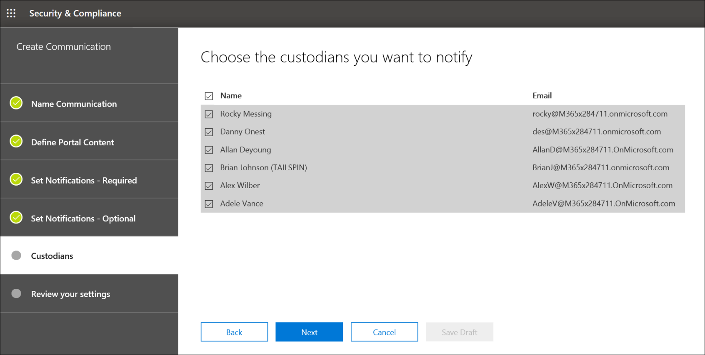

# Erstellen eines rechtlichen Aufbewahrungs Vermerks

Mithilfe der erweiterten eDiscovery-Depotbank-Kommunikation können Organisationen ihren Workflow bei der Kommunikation mit Verwaltern verwalten. Über das Kommunikationstool können Legal-Teams rechtliche Aufbewahrungs Benachrichtigungen systematisch senden, erfassen und nachverfolgen. Mit dem flexiblen Erstellungsprozess können Teams auch den Aufbewahrungs Benachrichtigungs Workflow und den Inhalt in den an Verwalter gesendeten Benachrichtigungen anpassen. 

Der Artikel beschreibt die Schritte im Aufbewahrungs Benachrichtigungs Workflow.

## Schritt 1: Angeben von Kommunikationsdetails

Der erste Schritt besteht darin, die entsprechenden Details für rechtliche Aufbewahrungs Vermerke oder andere Verwalter Kommunikationen anzugeben.

1. Wechseln Sie im Security & Compliance Center zu **eDiscovery > Advanced eDiscovery** , um die Liste der Fälle in Ihrer Organisation anzuzeigen.

2. Wählen Sie einen Fall aus, klicken Sie auf die Registerkarte **Kommunikation** , und klicken Sie dann auf **neue Kommunikation**.

3. Geben Sie auf der Seite **namens Kommunikation** die folgenden (erforderlichen) Kommunikationsdetails an.

    - **Name**: Dies ist der Name für die Kommunikation.

    - **Ausstellenden Offizier**: in der Dropdownliste wird eine Liste der Fall Mitglieder angezeigt. Jede an Verwalter gesendete Nachricht wird im Namen des angegebenen ausstellenden Versands gesendet.

4. Klicken Sie auf **Weiter**.

## Schritt 2: Definieren des Portalinhalts

Als nächstes können Sie den Inhalt des halte Vermerks erstellen und hinzufügen. Geben Sie auf der Seite **Portalinhalt definieren** im Assistenten zum **Erstellen von Kommunikation** den Inhalt des halte Vermerks an. Dieser Inhalt wird automatisch an die Bekanntmachungen für Ausstellung, erneutes ausgeben, Erinnerung und Eskalation angehängt. Darüber hinaus wird dieser Inhalt im Compliance-Portal des Depotbank angezeigt. 

So erstellen Sie den Portalinhalt:

1. Geben Sie (oder Ausschneiden und Einfügen aus einem anderen Dokument) ihren halte Vermerk im Textfeld für den Portalinhalt ein. 

2. Fügen Sie Merge-Variablen in Ihren Hinweis ein, um den Hinweis anzupassen und das Depot Compliance-Portal freizugeben.

3. Klicken Sie auf **Weiter**.

  >[!Tip]
  >Weitere Informationen zum Anpassen von Inhalt und Format der Portalinhalte finden Sie unter [Verwenden des Kommunikations-Editors](using-communications-editor.md).

## Schritt 3: Festlegen der erforderlichen Benachrichtigungen

Nachdem Sie den Inhalt des halte Vermerks definiert haben, können Sie die Workflows zum Senden und Verwalten des Benachrichtigungsprozesses einrichten. Benachrichtigungen sind e-Mail-Nachrichten, die zur Benachrichtigung und Nachverfolgung mit Verwaltern gesendet werden. Jeder der Kommunikation hinzugefügte depotverwalter erhält dieselbe Benachrichtigung. 

Um einen Aufbewahrungs Bescheid einzurichten und zu senden, müssen Sie die Benachrichtigungen über Ausstellung, erneute Ausstellung und Freigabe einschließen.

### Veröffentlichungs Benachrichtigung 

Nachdem die Kommunikation erstellt wurde, wird die **Ausstellungs Benachrichtigung** vom angegebenen ausstellenden Offizier initiiert. Die Veröffentlichungs Benachrichtigung ist die erste Mitteilung, die an die Depotbank gesendet wurde, um Sie über Ihre Aufbewahrungspflichten zu informieren. 

So erstellen Sie eine Veröffentlichungs Benachrichtigung:

1. Klicken Sie auf der **Ausgabe** Kachel auf **Bearbeiten**.

2. Fügen Sie den Feldern **CC** und **Bcc** bei Bedarf zusätzliche Fall Mitglieder oder Mitarbeiter hinzu. Wenn Sie diesen Feldern mehrere Benutzer hinzufügen möchten, trennen Sie die e-Mail-Adressen durch ein Semikolon.

3. Geben Sie den **Betreff** für den Hinweis an (erforderlich).

4. Geben Sie die Inhalte oder zusätzlichen Anweisungen an, die Sie der Depotbank bereitstellen möchten (erforderlich). Die in Schritt 2 definierten Portalinhalte werden am Ende der Veröffentlichungs Benachrichtigung hinzugefügt. 

5. Klicken Sie auf **Speichern**.

### Erneute Veröffentlichungs Benachrichtigung

Im Fall von Fortschritten müssen Verwalter möglicherweise zusätzliche oder weniger Daten aufbewahren, als zuvor angewiesen wurde. Nachdem Sie den Portalinhalt aktualisiert haben, wird die erneute Ausstellungs Benachrichtigung gesendet, und die Verwalter werden über etwaige Änderungen an Ihren Aufbewahrungspflichten benachrichtigt.

So erstellen Sie eine erneute Veröffentlichungs Benachrichtigung:

1. Klicken Sie in der Kachel neu **ausgeben** auf **Bearbeiten**.

2. Fügen Sie den Feldern **CC** und **Bcc** bei Bedarf zusätzliche Fall Mitglieder oder Mitarbeiter hinzu. Wenn Sie diesen Feldern mehrere Benutzer hinzufügen möchten, trennen Sie die e-Mail-Adressen durch ein Semikolon.

3. Geben Sie den **Betreff** für den Hinweis an (erforderlich).

4. Geben Sie die Inhalte oder zusätzlichen Anweisungen an, die Sie der Depotbank bereitstellen möchten (erforderlich). Die in Schritt 2 definierten Portalinhalte werden am Ende der erneuten Veröffentlichungs Benachrichtigung hinzugefügt.

5. Klicken Sie auf **Speichern**.

> [!NOTE]
> Wenn der Portalinhalt geändert wird (auf der Seite **Portalinhalt definieren** im Assistenten zum **Bearbeiten der Kommunikation** ), wird die erneute Veröffentlichungs Benachrichtigung automatisch an alle dem Hinweis zugewiesenen Verwalter gesendet. Nachdem die Benachrichtigung gesendet wurde, werden Verwalter aufgefordert, ihren halte Hinweis erneut zu bestätigen. Wenn Sie Erinnerungen oder Eskalations Workflows eingerichtet haben, werden diese ebenfalls neu gestartet. Weitere Informationen darüber, was andere Fall Verwaltungsereignisse für die Kommunikation auslösen, finden Sie unter [Events, die Benachrichtigungen auslösen](#events-that-trigger-notifications).

### Release-Benachrichtigung

Nachdem eine Angelegenheit behoben wurde oder wenn ein depotverwalter keine Inhalte mehr aufbewahren kann, können Sie die Depotbank aus einem Fall freigeben. Wenn der Depotbank zuvor ein Aufbewahrungs Bescheid erteilt wurde, kann die Freigabe Benachrichtigung verwendet werden, um Verwalter darauf hinzuweisen, dass Sie aus ihrer Pflicht entlassen wurden.

So erstellen Sie eine Release-Benachrichtigung: 

1. Klicken Sie auf der Kachel **Release** auf **Bearbeiten**.

2. Fügen Sie den Feldern **CC** und **Bcc** bei Bedarf zusätzliche Fall Mitglieder oder Mitarbeiter hinzu. Wenn Sie diesen Feldern mehrere Benutzer hinzufügen möchten, trennen Sie die e-Mail-Adressen durch ein Semikolon.

3. Geben Sie den **Betreff** für den Hinweis an (erforderlich).

4. Geben Sie die Inhalte oder zusätzlichen Anweisungen an, die Sie der Depotbank bereitstellen möchten (erforderlich).

5. Klicken Sie auf **Speichern** , und fahren Sie mit dem nächsten Schritt fort.

## Optional Schritt 4: Festlegen der optionalen Benachrichtigungen

Optional können Sie den Workflow für das Nachverfolgen mit nicht reagierenden Depotbanken vereinfachen, indem Sie automatische Mahnungs-und Eskalations Benachrichtigungen erstellen und planen.

### Erinnerungen

Nachdem Sie eine Aufbewahrungs Benachrichtigung gesendet haben, können Sie nicht reagierende depotverwalter nachverfolgen, indem Sie einen Erinnerungs Workflow definieren.

So planen Sie Erinnerungen:

1. Klicken Sie auf der Kachel **Erinnerung** auf **Bearbeiten**.

2. Aktivieren Sie den **Erinnerungs** Workflow, indem Sie die **Status** -Umschaltfläche (erforderlich) aktivieren.

3. Geben Sie das **Erinnerungsintervall (in Tagen)** an (erforderlich). Dies ist die Anzahl der Tage, die gewartet werden soll, bevor die Benachrichtigungen zum ersten und zur Nachverfolgung gesendet werden. Wenn Sie beispielsweise das Erinnerungsintervall auf sieben Tage festlegen, wird die erste Erinnerung sieben Tage nach der anfänglichen Aufbewahrungs Benachrichtigung gesendet. Alle nachfolgenden Erinnerungen werden auch alle sieben Tage gesendet.

4. Geben Sie die **Anzahl der Erinnerungen** an (erforderlich). Dieses Feld gibt an, wie viele Erinnerungen an nicht reagierende Verwalter gesendet werden sollen. Wenn Sie beispielsweise die Anzahl der Erinnerungen auf 3 festlegen, erhält eine Depotbank maximal drei Erinnerungen. Nachdem eine Depotbank die Aufbewahrungs Benachrichtigung bestätigt hat, werden keine Erinnerungen mehr an diesen Benutzer gesendet.

5. Geben Sie den **Betreff** für den Hinweis an (erforderlich). 

6. Geben Sie die Inhalte oder zusätzlichen Anweisungen an, die Sie der Depotbank bereitstellen möchten (erforderlich). Die in Schritt 2 definierten Portalinhalte werden am Ende der Mahnungsbenachrichtigung hinzugefügt.

7. Klicken Sie auf **Speichern** und wechseln Sie zum nächsten Schritt.

### Eskalationen

In einigen Situationen benötigen Sie möglicherweise zusätzliche Möglichkeiten, um nicht reagierende depotverwalter zu verfolgen. Wenn ein depotverwalter keine Aufbewahrungs Benachrichtigung bestätigt, nachdem er die angegebene Anzahl von Erinnerungen erhalten hat, kann das juristische Team einen Workflow angeben, um eine Eskalations Benachrichtigung automatisch an die Depotbank und deren Vorgesetzten zu senden.

So planen Sie Eskalationen:

1. Klicken Sie in der **Eskalations** Kachel auf **Bearbeiten**.

2. Aktivieren Sie den **Eskalations** Workflow, indem Sie die **Status** umschalten.

3. Geben Sie das **Eskalations Intervall (in Tagen)** an (erforderlich).

4. Geben Sie die **Anzahl der Eskalationen** an (erforderlich). Dieses Feld gibt an, wie viele Eskalationen an nicht reagierende Verwalter gesendet werden sollen. Wenn Sie beispielsweise die Anzahl der Eskalationen auf 3 festlegen, wird eine Eskalations Benachrichtigung maximal dreimal an die Depotbank und deren Manager gesendet. Nachdem eine Depotbank die Aufbewahrungs Benachrichtigung bestätigt hat, werden keine Eskalationen mehr gesendet.

5. Geben Sie den **Betreff** für den Hinweis an (erforderlich). 

6. Geben Sie die Inhalte oder zusätzlichen Anweisungen an, die Sie der Depotbank bereitstellen möchten (erforderlich). Die in Schritt 2 definierten Portalinhalte werden am Ende der Eskalations Benachrichtigung hinzugefügt.

7. Klicken Sie auf **Speichern** und wechseln Sie zum nächsten Schritt.

## Schritt 5: Zuweisen von Verwaltern zum Empfangen von Benachrichtigungen

Nachdem Sie den Inhalt für Benachrichtigungen abgeschlossen haben, wählen Sie die Verwalter aus, an die Sie Benachrichtigungen senden möchten. 

So fügen Sie Verwalter hinzu:

1. Weisen Sie der Kommunikation Verwalter zu, indem Sie auf das Kontrollkästchen neben Ihrem Namen klicken.

    Nachdem die Kommunikation erstellt wurde, wird der Benachrichtigungs Workflow automatisch auf die ausgewählten depotverwalter angewendet.

2. Klicken Sie auf **weiter** , um die Kommunikationseinstellungen und Details zu überprüfen.

>[!NOTE]
>Sie können nur Verwalter hinzufügen, die dem Fall hinzugefügt wurden, und keine weitere Benachrichtigung im Fall erhalten haben.

## Schritt 6: Überprüfen der Einstellungen

Nachdem Sie die Einstellungen überprüft und auf **senden** klicken, um die Kommunikation abzuschließen, startet das System automatisch den Kommunikations Workflow, indem der Veröffentlichungshinweis gesendet wird.

## Ereignisse, die Benachrichtigungen auslösen

In der folgenden Tabelle werden die Ereignisse im Fall Verwaltungsprozess beschrieben, die ausgelöst werden, wenn die verschiedenen Benachrichtigungstypen an Verwalter gesendet werden.

|Art der Kommunikation|Auslöser |
|:---------|:---------|
|Ausstellungs Hinweise|Die anfängliche Erstellung der Benachrichtigung. Sie können auch eine Aufbewahrungs Benachrichtigung manuell erneut senden. |
|Erneute Veröffentlichungs Benachrichtigungen|Aktualisieren der Portalinhalte auf der Seite **Portalinhalt definieren** im Assistenten zum **Bearbeiten von Kommunikation** .|
|Veröffentlichungshinweise|Die Depotbank wird aus dem Fall entlassen.|
|Erinnerungen|Das Intervall und die Anzahl der Erinnerungen, die für die Erinnerung konfiguriert sind.|
|Eskalationen|Das Intervall und die Anzahl der Erinnerungen, die für die Eskalation konfiguriert sind.|
|||
