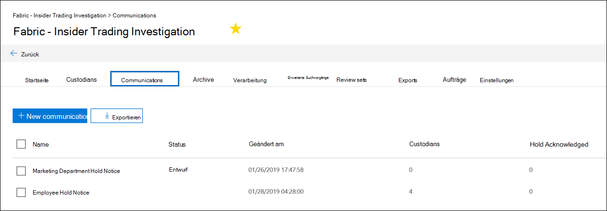

# Erstellen eines Rechtlichen Haltehinweises

Mithilfe der Erweiterten eDiscovery- Custodian-Kommunikation können Organisationen ihren Workflow um die Kommunikation mit Verwahrern verwalten. Über das Kommunikationstool können Rechtsteams Benachrichtigungen über gesetzliche Benachrichtigungen systematisch senden, sammeln und nachverfolgen. Durch den flexiblen Erstellungsprozess können Teams außerdem den Workflow für haltebenachrichtigungen und die Inhalte in den an Custodians gesendeten Benachrichtigungen anpassen.

Der Artikel beschreibt die Schritte im Workflow für haltebenachrichtigungen.

## Schritt 1: Angeben von Kommunikationsdetails

Der erste Schritt besteht in der Angabe der entsprechenden Details für Rechtliche Haltehinweise oder andere Benachrichtigungen von Verwahrern.

1. Wechseln Sie & Security & Compliance Center zu **eDiscovery > Advanced eDiscovery,** um die Liste der Fälle in Ihrer Organisation anzeigen.

2. Wählen Sie einen Fall aus, **klicken** Sie auf die Registerkarte Kommunikation, und klicken Sie dann auf **Neue Kommunikation**.

3. Geben Sie **auf der** Seite Name Communication die folgenden (erforderlichen) Kommunikationsdetails an.

    - **Name**: Dies ist der Name für die Kommunikation.

    - **Ausstellende** Beauftragte: In der Dropdownliste wird eine Liste der Fallmitglieder angezeigt. Weitere Informationen zum Hinzufügen neuer Member zu einem Fall finden Sie unter [Create an Advanced eDiscovery case](create-and-manage-advanced-ediscoveryv2-case.md#create-a-case). Jede Benachrichtigung, die an verwahrer gesendet wird, wird im Namen des angegebenen ausstellenden Beauftragten gesendet.

> [!NOTE]
> Der ausstellende Beauftragte muss über ein **aktives Postfach verfügen,** das im Dropdownmenü "Ausstellende Referenten" angezeigt werden soll.

4. Klicken Sie auf **Weiter**.

## Schritt 2: Definieren des Portalinhalts

Als Nächstes können Sie den Inhalt des Haltehinweises erstellen und hinzufügen. Geben Sie **auf der Seite Portalinhalt** definieren im **Assistenten** zum Erstellen von Kommunikation den Inhalt des Haltehinweises an. Dieser Inhalt wird automatisch an die Benachrichtigungen zur Ausstellung, erneuten Ausgabe, Erinnerung und Eskalation angefügt. Darüber hinaus wird dieser Inhalt im Complianceportal des Custodians angezeigt. 

So erstellen Sie den Portalinhalt:

1. Geben Sie (oder aus einem anderen Dokument ausschneiden und einfügen) Ihre Haltebenachrichtigung in das Textfeld für den Portalinhalt ein. 

2. Fügen Sie Zusammenführungsvariablen in Ihren Hinweis ein, um den Hinweis anzupassen und das Custodian Compliance Portal frei zu geben.

3. Klicken Sie auf **Weiter**.

  >[!Tip]
  >Weitere Informationen zum Anpassen von Inhalt und Format des Portalinhalts finden Sie unter [Use the Communications Editor](using-communications-editor.md).

## Schritt 3: Festlegen der erforderlichen Benachrichtigungen

Nachdem Sie den Inhalt des Haltehinweises definiert haben, können Sie die Workflows rund um das Senden und Verwalten des Benachrichtigungsprozesses einrichten. Benachrichtigungen sind E-Mail-Nachrichten, die gesendet werden, um Custodians zu benachrichtigen und zu verfolgen. Jeder zur Kommunikation hinzugefügte Custodian erhält dieselbe Benachrichtigung. 

Um eine Haltebenachrichtigung einrichten und senden zu können, müssen Sie Benachrichtigungen zu Ausstellungs-, Neuausstellungs- und Veröffentlichungsbenachrichtigungen enthalten.

### Benachrichtigung zur Ausstellung 

Nachdem die Kommunikation erstellt wurde, wird die **Benachrichtigung über** die Ausstellung vom angegebenen Ausstellenden Officer initiiert. Die Benachrichtigung über die Ausstellung ist die erste Kommunikation, die an den Verwahrer gesendet wird, um ihn über seine Aufbewahrungspflichten zu informieren. 

So erstellen Sie eine Ausstellungsbenachrichtigung:

1. Klicken Sie **in der Kachel** Ausstellungs auf **Bearbeiten**.

2. Fügen Sie bei Bedarf weitere Fallmitglieder oder Mitarbeiter zu den **Feldern Cc** und **Bcc** hinzu. Um diesen Feldern mehrere Benutzer hinzuzufügen, trennen Sie E-Mail-Adressen mit einem Semikolon.

3. Geben Sie den **Betreff** für den Hinweis an (erforderlich).

4. Geben Sie den Inhalt oder zusätzliche Anweisungen an, die Sie dem Verwahrer bereitstellen möchten (erforderlich). Der in Schritt 2 definierte Portalinhalt wird am Ende des Benachrichtigungshinweises hinzugefügt. 

5. Klicken Sie auf **Speichern**.

### Re-Issuance Benachrichtigung

Im Weiteren müssen Verwahrer möglicherweise zusätzliche oder weniger Daten als zuvor angewiesen beibehalten. Nachdem Sie den Portalinhalt aktualisiert haben, wird die Benachrichtigung über die erneute Ausstellung gesendet und die Verwahrer über änderungen an ihren Aufbewahrungspflichten benachrichtigt.

So erstellen Sie eine erneute Benachrichtigung:

1. Klicken Sie **in der Kachel** Neuauflage auf **Bearbeiten**.

2. Fügen Sie bei Bedarf weitere Fallmitglieder oder Mitarbeiter zu den **Feldern Cc** und **Bcc** hinzu. Um diesen Feldern mehrere Benutzer hinzuzufügen, trennen Sie E-Mail-Adressen mit einem Semikolon.

3. Geben Sie den **Betreff** für den Hinweis an (erforderlich).

4. Geben Sie den Inhalt oder zusätzliche Anweisungen an, die Sie dem Verwahrer bereitstellen möchten (erforderlich). Der in Schritt 2 definierte Portalinhalt wird am Ende des Benachrichtigungs zur erneuten Ausstellung hinzugefügt.

5. Klicken Sie auf **Speichern**.

> [!NOTE]
> Wenn der Portalinhalt geändert wird (auf der  Seite **Portalinhalt** definieren im Assistenten zum Bearbeiten der Kommunikation), wird die Erneute Benachrichtigung automatisch an alle Benachrichtigungsverwahrer gesendet, die dem Hinweis zugewiesen sind. Nachdem die Benachrichtigung gesendet wurde, werden die Verwahrer aufgefordert, ihre Haltebenachrichtigung erneut zu bestätigen. Wenn Sie Erinnerungs- oder Eskalationsworkflows eingerichtet haben, werden diese ebenfalls neu gestartet. Weitere Informationen dazu, welche anderen Fallverwaltungsereignisse die Kommunikation auslösen, finden Sie unter [Ereignisse, die Benachrichtigungen auslösen.](#events-that-trigger-notifications)

### Benachrichtigung zur Veröffentlichung

Nachdem eine Sache gelöst wurde oder ein Custodian nicht mehr dem Beibehalten von Inhalten unterliegt, können Sie den Custodian aus einem Fall los. Wenn der Custodian zuvor eine Haltebenachrichtigung erhalten hat, kann die Veröffentlichungsbenachrichtigung verwendet werden, um die Verwahrer zu warnen, dass sie von ihrer Verpflichtung losgelassen wurden.

So erstellen Sie eine Benachrichtigung zur Veröffentlichung: 

1. Klicken Sie **in der** Kachel Freigabe auf **Bearbeiten**.

2. Fügen Sie bei Bedarf weitere Fallmitglieder oder Mitarbeiter zu den **Feldern Cc** und **Bcc** hinzu. Um diesen Feldern mehrere Benutzer hinzuzufügen, trennen Sie E-Mail-Adressen mit einem Semikolon.

3. Geben Sie den **Betreff** für den Hinweis an (erforderlich).

4. Geben Sie den Inhalt oder zusätzliche Anweisungen an, die Sie dem Verwahrer bereitstellen möchten (erforderlich).

5. Klicken **Sie auf Speichern,** und fahren Sie mit dem nächsten Schritt fort.

## (Optional) Schritt 4: Festlegen der optionalen Benachrichtigungen

Optional können Sie den Workflow für die Nachhilfe mit nicht reagierenden Verwahrern vereinfachen, indem Sie automatisierte Erinnerungs- und Eskalationsbenachrichtigungen erstellen und planen.

### Erinnerungen

Nachdem Sie eine Haltebenachrichtigung gesendet haben, können Sie nicht reagierende Verwahrer durch Definieren eines Erinnerungsworkflows verfolgen.

So planen Sie Erinnerungen:

1. Klicken Sie **in der** Kachel Erinnerung auf **Bearbeiten**.

2. Aktivieren  Sie den Erinnerungsworkflow, indem Sie die **Umschalte Status** (erforderlich) aktivieren.

3. Geben Sie das **Erinnerungsintervall (in Tagen) (erforderlich)** an. Dies ist die Anzahl der Tage, die vor dem Senden der ersten und nach dem Senden von Erinnerungsbenachrichtigungen gewartet werden müssen. Wenn Sie beispielsweise das Erinnerungsintervall auf sieben Tage festlegen, wird die erste Erinnerung sieben Tage nach der ursprünglichen Benachrichtigung gesendet. Alle nachfolgenden Erinnerungen werden ebenfalls alle sieben Tage gesendet.

4. Geben Sie **die Anzahl der Erinnerungen** (erforderlich) an. Dieses Feld gibt an, wie viele Erinnerungen an nicht reagierende Verwahrer gesendet werden. Wenn Sie beispielsweise die Anzahl der Erinnerungen auf 3 festlegen, erhält ein Verwahrer maximal drei Erinnerungen. Nachdem ein Verwahrer die Haltebenachrichtigung bestätigt hat, werden Erinnerungen nicht mehr an den Benutzer gesendet.

5. Geben Sie den **Betreff** für den Hinweis an (erforderlich). 

6. Geben Sie den Inhalt oder zusätzliche Anweisungen an, die Sie dem Verwahrer bereitstellen möchten (erforderlich). Der in Schritt 2 definierte Portalinhalt wird am Ende der Erinnerungsbenachrichtigung hinzugefügt.

7. Klicken **Sie auf Speichern,** und fahren Sie mit dem nächsten Schritt fort.

### Eskalationen

In einigen Situationen benötigen Sie möglicherweise zusätzliche Möglichkeiten, um nicht reagierende Verwahrer nachzuverantworten. Wenn ein Verwalter eine Haltebenachrichtigung nach Erhalt der angegebenen Anzahl von Erinnerungen nicht bestätigt, kann das Rechtsteam einen Workflow angeben, um automatisch eine Eskalationsbenachrichtigung an den Verwalter und seinen Vorgesetzten zu senden.

So planen Sie Eskalationen:

1. Klicken Sie **in der Kachel Eskalation** auf **Bearbeiten**.

2. Aktivieren  Sie den Eskalationsworkflow, indem Sie die **Umschalte Status** aktivieren.

3. Geben Sie das **Eskalationsintervall (in Tagen) (erforderlich)** an.

4. Geben Sie **die Anzahl der Eskalationen** (erforderlich) an. Dieses Feld gibt an, wie viele Eskalationen an nicht reagierende Verwahrer gesendet werden. Wenn Sie beispielsweise die Anzahl der Eskalationen auf 3 festlegen, wird dem Verwalter und dem Vorgesetzten maximal dreimal eine Eskalationsbenachrichtigung gesendet. Nachdem ein Verwahrer die Haltebenachrichtigung bestätigt hat, werden keine Eskalationen mehr gesendet.

5. Geben Sie den **Betreff** für den Hinweis an (erforderlich). 

6. Geben Sie den Inhalt oder zusätzliche Anweisungen an, die Sie dem Verwahrer bereitstellen möchten (erforderlich). Der in Schritt 2 definierte Portalinhalt wird am Ende der Eskalationsbenachrichtigung hinzugefügt.

7. Klicken **Sie auf Speichern,** und fahren Sie mit dem nächsten Schritt fort.

## Schritt 5: Zuweisen von Verwahrern zum Empfangen von Benachrichtigungen

Nachdem Sie den Inhalt für Benachrichtigungen finalisiert haben, wählen Sie die Verwahrer aus, an die Sie Benachrichtigungen senden möchten. 

So fügen Sie Custodians hinzu:

1. Weisen Sie der Kommunikation Custodians zu, indem Sie auf das Kontrollkästchen neben ihrem Namen klicken.

    Nachdem die Kommunikation erstellt wurde, gilt der Benachrichtigungsworkflow automatisch für die ausgewählten Verwahrer.

2. Klicken **Sie auf Weiter,** um die Kommunikationseinstellungen und -details zu überprüfen.

>[!NOTE]
>Sie können nur Verwahrer hinzufügen, die dem Fall hinzugefügt wurden und innerhalb des Falls keine weitere Benachrichtigung erhalten haben.

## Schritt 6: Überprüfen der Einstellungen

Nachdem Sie die Einstellungen überprüft und **auf** Senden geklickt haben, um die Kommunikation zu vervollständigen, startet das System automatisch den Kommunikationsworkflow, indem der Ausstellungsbenachrichtigung gesendet wird.

## Ereignisse, die Benachrichtigungen auslösen

In der folgenden Tabelle werden Ereignisse im Fallverwaltungsprozess beschrieben, die ausgelöst werden, wenn die verschiedenen Arten von Benachrichtigungen an Verwahrer gesendet werden.

|Art der Kommunikation|Auslöser |
|:---------|:---------|
|Benachrichtigungen zur Ausstellung|Die anfängliche Erstellung der Benachrichtigung. Sie können eine Haltebenachrichtigung auch manuell erneut senden. |
|Erneute Ausstellung von Benachrichtigungen|Aktualisieren des Portalinhalts auf der **Seite Portalinhalt** definieren im **Assistenten zum Bearbeiten der** Kommunikation.|
|Veröffentlichungshinweise|Der Custodian wird aus dem Fall entlassen.|
|Erinnerungen|Das Intervall und die Anzahl der Erinnerungen, die für die Erinnerung konfiguriert sind.|
|Eskalationen|Das Intervall und die Anzahl der Erinnerungen, die für die Eskalation konfiguriert sind.|
|||
