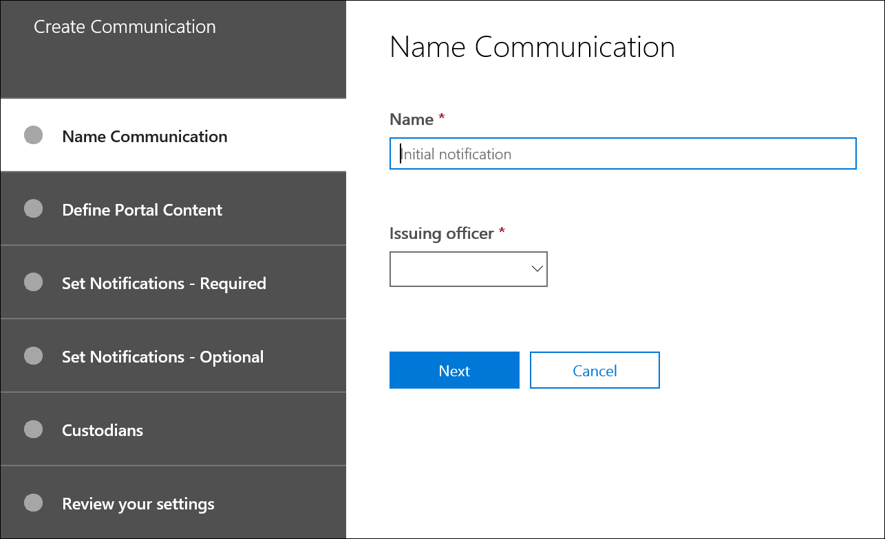

# Erstellen eines Rechtlichen HaltehinweisesCreate a legal hold notice

Mithilfe der Erweiterten eDiscovery- Custodian-Kommunikation können Organisationen ihren Workflow um die Kommunikation mit Verwahrern verwalten.Using Advanced eDiscovery custodian communications, organizations can manage their workflow around communicating with custodians. Über das Kommunikationstool können Rechtsteams Benachrichtigungen über gesetzliche Benachrichtigungen systematisch senden, sammeln und nachverfolgen.Through the Communications tool, legal teams can systematically send, collect, and track legal hold notifications. Durch den flexiblen Erstellungsprozess können Teams außerdem den Workflow für haltebenachrichtigungen und die Inhalte in den an Custodians gesendeten Benachrichtigungen anpassen.The flexible creation process also allows teams to customize the hold notification workflow and the content in the notices sent to custodians.

Der Artikel beschreibt die Schritte im Workflow für haltebenachrichtigungen.The article outlines the steps in the hold notification workflow.

## Schritt 1: Angeben von KommunikationsdetailsStep 1: Specify communication details

Der erste Schritt besteht in der Angabe der entsprechenden Details für Rechtliche Haltehinweise oder andere Benachrichtigungen von Verwahrern.The first step is to specify the appropriate details for legal hold notices or other custodian communications.

1. Wechseln Sie & Security & Compliance Center zu **eDiscovery > Advanced eDiscovery,** um die Liste der Fälle in Ihrer Organisation anzeigen.In the Security & Compliance Center, go to **eDiscovery > Advanced eDiscovery** to display the list of cases in your organization.

2. Wählen Sie einen Fall aus, **klicken** Sie auf die Registerkarte Kommunikation, und klicken Sie dann auf **Neue Kommunikation**.Select a case, click the **Communications** tab, and then click **New communication**.

3. Geben Sie **auf der** Seite Name Communication die folgenden (erforderlichen) Kommunikationsdetails an.On the **Name communication** page, specify the following (required) communication details.

    - **Name**: Dies ist der Name für die Kommunikation.**Name**: This is the name for the communication.

    - **Ausstellende** Beauftragte: In der Dropdownliste wird eine Liste der Fallmitglieder angezeigt.**Issuing officer**: The dropdown list displays a list of case members. Weitere Informationen zum Hinzufügen neuer Member zu einem Fall finden Sie unter [Create an Advanced eDiscovery case](create-and-manage-advanced-ediscoveryv2-case.md#create-a-case).For more information on how to add new members to a case, see [Create an Advanced eDiscovery case](create-and-manage-advanced-ediscoveryv2-case.md#create-a-case). Jede Benachrichtigung, die an verwahrer gesendet wird, wird im Namen des angegebenen ausstellenden Beauftragten gesendet.Each notice sent to custodians will be sent on behalf of the specified issuing officer.

> [!NOTE]
> Der ausstellende Beauftragte muss über ein **aktives Postfach verfügen,** das im Dropdownmenü "Ausstellende Referenten" angezeigt werden soll.The issuing officer must have an **active mailbox** to show up in the Issuing Officer dropdown

4. Klicken Sie auf **Weiter**.Click **Next**.

## Schritt 2: Definieren des PortalinhaltsStep 2: Define the portal content

Als Nächstes können Sie den Inhalt des Haltehinweises erstellen und hinzufügen.Next, you can create and add the content of the hold notice. Geben Sie **auf der Seite Portalinhalt** definieren im **Assistenten** zum Erstellen von Kommunikation den Inhalt des Haltehinweises an.On the **Define portal content** page in the **Create communication** wizard, specify the contents of the hold notice. Dieser Inhalt wird automatisch an die Benachrichtigungen zur Ausstellung, erneuten Ausgabe, Erinnerung und Eskalation angefügt.This content will be automatically appended to the Issuance, Re-Issue, Reminder, and Escalation notices. Darüber hinaus wird dieser Inhalt im Complianceportal des Custodians angezeigt.Additionally, this content will appear in the custodian's Compliance Portal. 

So erstellen Sie den Portalinhalt:To create the portal content:

1. Geben Sie (oder aus einem anderen Dokument ausschneiden und einfügen) Ihre Haltebenachrichtigung in das Textfeld für den Portalinhalt ein.Type (or cut and paste from another document) your hold notice in the textbox for the portal content. 

2. Fügen Sie Zusammenführungsvariablen in Ihren Hinweis ein, um den Hinweis anzupassen und das Custodian Compliance Portal frei zu geben.Insert merge variables into your notice to customize the notice and share the Custodian Compliance Portal.

3. Klicken Sie auf **Weiter**.Click **Next**.

  >[!Tip]
  >Weitere Informationen zum Anpassen von Inhalt und Format des Portalinhalts finden Sie unter [Use the Communications Editor](using-communications-editor.md).To learn more about how to can customize the content and format of the portal content, see [Use the Communications Editor](using-communications-editor.md).

## Schritt 3: Festlegen der erforderlichen BenachrichtigungenStep 3: Set the required notifications

Nachdem Sie den Inhalt des Haltehinweises definiert haben, können Sie die Workflows rund um das Senden und Verwalten des Benachrichtigungsprozesses einrichten.After you've defined the contents of the hold notice, you can set up the workflows around sending and managing the notification process. Benachrichtigungen sind E-Mail-Nachrichten, die gesendet werden, um Custodians zu benachrichtigen und zu verfolgen.Notifications are email messages that are sent to notify and follow up with custodians. Jeder zur Kommunikation hinzugefügte Custodian erhält dieselbe Benachrichtigung.Every custodian added to the communication will receive the same notification. 

Um eine Haltebenachrichtigung einrichten und senden zu können, müssen Sie Benachrichtigungen zu Ausstellungs-, Neuausstellungs- und Veröffentlichungsbenachrichtigungen enthalten.To set up and send a hold notice, you must include Issuance, Re-Issuance, and Release notifications.

### Benachrichtigung zur AusstellungIssuance notification 

Nachdem die Kommunikation erstellt wurde, wird die **Benachrichtigung über** die Ausstellung vom angegebenen Ausstellenden Officer initiiert.After the communication is created, the **Issuance Notification** is initiated by the specified Issuing Officer. Die Benachrichtigung über die Ausstellung ist die erste Kommunikation, die an den Verwahrer gesendet wird, um ihn über seine Aufbewahrungspflichten zu informieren.The Issuance notification is the first communication sent to the custodian to inform them about their preservation obligations. 

So erstellen Sie eine Ausstellungsbenachrichtigung:To create an issuance notification:

1. Klicken Sie **in der Kachel** Ausstellungs auf **Bearbeiten**.In the **Issuance** tile, click **Edit**.

2. Fügen Sie bei Bedarf weitere Fallmitglieder oder Mitarbeiter zu den **Feldern Cc** und **Bcc** hinzu.If necessary, add additional case members or staff to the **Cc** and **Bcc** fields. Um diesen Feldern mehrere Benutzer hinzuzufügen, trennen Sie E-Mail-Adressen mit einem Semikolon.To add multiple users to these fields, separate email addresses with a semi-colon.

3. Geben Sie den **Betreff** für den Hinweis an (erforderlich).Specify the **Subject** for the notice (required).

4. Geben Sie den Inhalt oder zusätzliche Anweisungen an, die Sie dem Verwahrer bereitstellen möchten (erforderlich).Specify the contents or additional instructions that you would like to provide to the custodian (required). Der in Schritt 2 definierte Portalinhalt wird am Ende des Benachrichtigungshinweises hinzugefügt.The portal content you defined in Step 2 is added to the end of the issuance notice. 

5. Klicken Sie auf **Speichern**.Click **Save**.

### Re-Issuance BenachrichtigungRe-Issuance notification

Im Weiteren müssen Verwahrer möglicherweise zusätzliche oder weniger Daten als zuvor angewiesen beibehalten.As the case progresses, custodians may be required to preserve additional or less data than was previously instructed. Nachdem Sie den Portalinhalt aktualisiert haben, wird die Benachrichtigung über die erneute Ausstellung gesendet und die Verwahrer über änderungen an ihren Aufbewahrungspflichten benachrichtigt.After you update the portal content, the re-issuance notification is sent and alerts custodians about any changes to their preservation obligations.

So erstellen Sie eine erneute Benachrichtigung:To create a re-issuance notification:

1. Klicken Sie **in der Kachel** Neuauflage auf **Bearbeiten**.In the **Reissue** tile, click **Edit**.

2. Fügen Sie bei Bedarf weitere Fallmitglieder oder Mitarbeiter zu den **Feldern Cc** und **Bcc** hinzu.If necessary, add additional case members or staff to the **Cc** and **Bcc** fields. Um diesen Feldern mehrere Benutzer hinzuzufügen, trennen Sie E-Mail-Adressen mit einem Semikolon.To add multiple users to these fields, separate email addresses with a semi-colon.

3. Geben Sie den **Betreff** für den Hinweis an (erforderlich).Specify the **Subject** for the notice (required).

4. Geben Sie den Inhalt oder zusätzliche Anweisungen an, die Sie dem Verwahrer bereitstellen möchten (erforderlich).Specify the contents or additional instructions that you would like to provide to the custodian (required). Der in Schritt 2 definierte Portalinhalt wird am Ende des Benachrichtigungs zur erneuten Ausstellung hinzugefügt.The portal content you defined in Step 2 is added to the end of the re-issuance notice.

5. Klicken Sie auf **Speichern**.Click **Save**.

> [!NOTE]
> Wenn der Portalinhalt geändert wird (auf der  Seite **Portalinhalt** definieren im Assistenten zum Bearbeiten der Kommunikation), wird die Erneute Benachrichtigung automatisch an alle Benachrichtigungsverwahrer gesendet, die dem Hinweis zugewiesen sind.If the portal content is modified (on the **Define Portal Content** page in the **Edit communication** wizard), the re-issuance notification will be automatically sent to all custodians assigned to the notice. Nachdem die Benachrichtigung gesendet wurde, werden die Verwahrer aufgefordert, ihre Haltebenachrichtigung erneut zu bestätigen.After the notification is sent, custodians will be asked to re-acknowledge their hold notice. Wenn Sie Erinnerungs- oder Eskalationsworkflows eingerichtet haben, werden diese ebenfalls neu gestartet.If you have set up any reminder or escalation workflows, these will also re-start. Weitere Informationen dazu, welche anderen Fallverwaltungsereignisse die Kommunikation auslösen, finden Sie unter [Ereignisse, die Benachrichtigungen auslösen.](#events-that-trigger-notifications)For more information about what other case management events trigger communications, see [Events that trigger notifications](#events-that-trigger-notifications).

### Benachrichtigung zur VeröffentlichungRelease notification

Nachdem eine Sache gelöst wurde oder ein Custodian nicht mehr dem Beibehalten von Inhalten unterliegt, können Sie den Custodian aus einem Fall los.After a matter is resolved or if a custodian is no longer subject to preserve content, you can release the custodian from a case. Wenn der Custodian zuvor eine Haltebenachrichtigung erhalten hat, kann die Veröffentlichungsbenachrichtigung verwendet werden, um die Verwahrer zu warnen, dass sie von ihrer Verpflichtung losgelassen wurden.If the custodian was previously issued a hold notice, the release notification can be used to alert custodians that they have been released from their obligation.

So erstellen Sie eine Benachrichtigung zur Veröffentlichung:To create a release notification: 

1. Klicken Sie **in der** Kachel Freigabe auf **Bearbeiten**.In the **Release** tile, click **Edit**.

2. Fügen Sie bei Bedarf weitere Fallmitglieder oder Mitarbeiter zu den **Feldern Cc** und **Bcc** hinzu.If necessary, add additional case members or staff to the **Cc** and **Bcc** fields. Um diesen Feldern mehrere Benutzer hinzuzufügen, trennen Sie E-Mail-Adressen mit einem Semikolon.To add multiple users to these fields, separate email addresses with a semi-colon.

3. Geben Sie den **Betreff** für den Hinweis an (erforderlich).Specify the **Subject** for the notice (required).

4. Geben Sie den Inhalt oder zusätzliche Anweisungen an, die Sie dem Verwahrer bereitstellen möchten (erforderlich).Specify the contents or additional instructions that you would like to provide to the custodian (required).

5. Klicken **Sie auf Speichern,** und fahren Sie mit dem nächsten Schritt fort.Click **Save** and go to the next step.

## (Optional) Schritt 4: Festlegen der optionalen Benachrichtigungen(Optional) Step 4: Set the optional notifications

Optional können Sie den Workflow für die Nachhilfe mit nicht reagierenden Verwahrern vereinfachen, indem Sie automatisierte Erinnerungs- und Eskalationsbenachrichtigungen erstellen und planen.Optionally, you can simplify the workflow for following up with unresponsive custodians by creating and scheduling automated reminder and escalation notifications.

### ErinnerungenReminders

Nachdem Sie eine Haltebenachrichtigung gesendet haben, können Sie nicht reagierende Verwahrer durch Definieren eines Erinnerungsworkflows verfolgen.After you have sent a hold notification, you can follow up with unresponsive custodians by defining a reminder workflow.

So planen Sie Erinnerungen:To schedule reminders:

1. Klicken Sie **in der** Kachel Erinnerung auf **Bearbeiten**.In the **Reminder** tile, click **Edit**.

2. Aktivieren  Sie den Erinnerungsworkflow, indem Sie die **Umschalte Status** (erforderlich) aktivieren.Enable the **Reminder** workflow by turning on the **Status** toggle (required).

3. Geben Sie das **Erinnerungsintervall (in Tagen) (erforderlich)** an.Specify the **Reminder interval (in days)** (required). Dies ist die Anzahl der Tage, die vor dem Senden der ersten und nach dem Senden von Erinnerungsbenachrichtigungen gewartet werden müssen.This is the number of days to wait before sending the first and follow-up reminder notifications. Wenn Sie beispielsweise das Erinnerungsintervall auf sieben Tage festlegen, wird die erste Erinnerung sieben Tage nach der ursprünglichen Benachrichtigung gesendet.For example, if you set the reminder interval to seven days, then the first reminder would be sent seven days after the hold notification was initially issued. Alle nachfolgenden Erinnerungen werden ebenfalls alle sieben Tage gesendet.All subsequent reminders would also be sent every seven days.

4. Geben Sie **die Anzahl der Erinnerungen** (erforderlich) an.Specify the **Number of reminders** (required). Dieses Feld gibt an, wie viele Erinnerungen an nicht reagierende Verwahrer gesendet werden.This field specifies how many reminders to send to unresponsive custodians. Wenn Sie beispielsweise die Anzahl der Erinnerungen auf 3 festlegen, erhält ein Verwahrer maximal drei Erinnerungen.For example, if you set the number of reminders to 3, then a custodian would receive a maximum of three reminders. Nachdem ein Verwahrer die Haltebenachrichtigung bestätigt hat, werden Erinnerungen nicht mehr an den Benutzer gesendet.After a custodian acknowledges the hold notification, reminders will no longer be sent to that user.

5. Geben Sie den **Betreff** für den Hinweis an (erforderlich).Specify the **Subject** for the notice (required). 

6. Geben Sie den Inhalt oder zusätzliche Anweisungen an, die Sie dem Verwahrer bereitstellen möchten (erforderlich).Specify the contents or additional instructions that you would like to provide to the custodian (required). Der in Schritt 2 definierte Portalinhalt wird am Ende der Erinnerungsbenachrichtigung hinzugefügt.The portal content you defined in Step 2 is added to the end of the reminder notice.

7. Klicken **Sie auf Speichern,** und fahren Sie mit dem nächsten Schritt fort.Click **Save** and go the next step.

### EskalationenEscalations

In einigen Situationen benötigen Sie möglicherweise zusätzliche Möglichkeiten, um nicht reagierende Verwahrer nachzuverantworten.In some situations, you may need additional ways to follow up with unresponsive custodians. Wenn ein Verwalter eine Haltebenachrichtigung nach Erhalt der angegebenen Anzahl von Erinnerungen nicht bestätigt, kann das Rechtsteam einen Workflow angeben, um automatisch eine Eskalationsbenachrichtigung an den Verwalter und seinen Vorgesetzten zu senden.If a custodian doesn't acknowledge a hold notification after receiving the specified number of reminders, the legal team can specify a workflow to automatically send an escalation notice to the custodian and their manager.

So planen Sie Eskalationen:To schedule escalations:

1. Klicken Sie **in der Kachel Eskalation** auf **Bearbeiten**.In the **Escalation** tile, click **Edit**.

2. Aktivieren  Sie den Eskalationsworkflow, indem Sie die **Umschalte Status** aktivieren.Enable the **Escalation** workflow by turning on the **Status** toggle.

3. Geben Sie das **Eskalationsintervall (in Tagen) (erforderlich)** an.Specify the **Escalation interval (in days)** (required).

4. Geben Sie **die Anzahl der Eskalationen** (erforderlich) an.Specify the **Number of escalations** (required). Dieses Feld gibt an, wie viele Eskalationen an nicht reagierende Verwahrer gesendet werden.This field specifies how many escalations to send to unresponsive custodians. Wenn Sie beispielsweise die Anzahl der Eskalationen auf 3 festlegen, wird dem Verwalter und dem Vorgesetzten maximal dreimal eine Eskalationsbenachrichtigung gesendet.For example, if you set the number of escalations to 3, then an escalation notice would be sent to the custodian and their manager a maximum of three times. Nachdem ein Verwahrer die Haltebenachrichtigung bestätigt hat, werden keine Eskalationen mehr gesendet.After a custodian acknowledges the hold notification, escalations will no longer be sent.

5. Geben Sie den **Betreff** für den Hinweis an (erforderlich).Specify the **Subject** for the notice (required). 

6. Geben Sie den Inhalt oder zusätzliche Anweisungen an, die Sie dem Verwahrer bereitstellen möchten (erforderlich).Specify the contents or additional instructions that you would like to provide to the custodian (required). Der in Schritt 2 definierte Portalinhalt wird am Ende der Eskalationsbenachrichtigung hinzugefügt.The portal content you defined in Step 2 is added to the end of the escalation notice.

7. Klicken **Sie auf Speichern,** und fahren Sie mit dem nächsten Schritt fort.Click **Save** and go the next step.

## Schritt 5: Zuweisen von Verwahrern zum Empfangen von BenachrichtigungenStep 5: Assign custodians to receive notifications

Nachdem Sie den Inhalt für Benachrichtigungen finalisiert haben, wählen Sie die Verwahrer aus, an die Sie Benachrichtigungen senden möchten.After you have finalized the content for notifications, select the custodians that you would like to send notifications to. 

So fügen Sie Custodians hinzu:To add custodians:

1. Weisen Sie der Kommunikation Custodians zu, indem Sie auf das Kontrollkästchen neben ihrem Namen klicken.Assign custodians to the communication by clicking the checkbox next to their name.

    Nachdem die Kommunikation erstellt wurde, gilt der Benachrichtigungsworkflow automatisch für die ausgewählten Verwahrer.After the communication is created, the notification workflow will automatically apply to the selected custodians.

2. Klicken **Sie auf Weiter,** um die Kommunikationseinstellungen und -details zu überprüfen.Click **Next** to review the communication settings and details.

>[!NOTE]
>Sie können nur Verwahrer hinzufügen, die dem Fall hinzugefügt wurden und innerhalb des Falls keine weitere Benachrichtigung erhalten haben.You can only add custodians who have been added to the case and haven't been sent another notification within the case.

## Schritt 6: Überprüfen der EinstellungenStep 6: Review settings

Nachdem Sie die Einstellungen überprüft und **auf** Senden geklickt haben, um die Kommunikation zu vervollständigen, startet das System automatisch den Kommunikationsworkflow, indem der Ausstellungsbenachrichtigung gesendet wird.After you review the settings and click **Send** to complete the communication, the system will automatically start the communication workflow by sending the issuance notice.

## Ereignisse, die Benachrichtigungen auslösenEvents that trigger notifications

In der folgenden Tabelle werden Ereignisse im Fallverwaltungsprozess beschrieben, die ausgelöst werden, wenn die verschiedenen Arten von Benachrichtigungen an Verwahrer gesendet werden.The following table describes events in the case management process that trigger when the different types of notifications are sent to custodians.

|Art der KommunikationType of communication|AuslöserTrigger |
|:---------|:---------|
|Benachrichtigungen zur AusstellungIssuance notices|Die anfängliche Erstellung der Benachrichtigung.The initial creation of the notification. Sie können eine Haltebenachrichtigung auch manuell erneut senden.You can also manually resend a hold notification. |
|Erneute Ausstellung von BenachrichtigungenRe-issuance notices|Aktualisieren des Portalinhalts auf der **Seite Portalinhalt** definieren im **Assistenten zum Bearbeiten der** Kommunikation.Updating the portal content on the **Define Portal Content** page in the **Edit communication** wizard.|
|VeröffentlichungshinweiseRelease notices|Der Custodian wird aus dem Fall entlassen.The custodian is released from the case.|
|ErinnerungenReminders|Das Intervall und die Anzahl der Erinnerungen, die für die Erinnerung konfiguriert sind.The interval and number of reminders configured for the reminder.|
|EskalationenEscalations|Das Intervall und die Anzahl der Erinnerungen, die für die Eskalation konfiguriert sind.The interval and number of reminders configured for the escalation.|
|||
