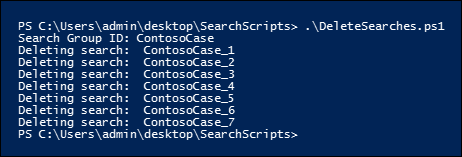

# <a name="create-report-on-and-delete-multiple-content-searches"></a><span data-ttu-id="d2dad-103">Erstellen, Ausführen von Berichten und Löschen mehrerer Inhaltssuchen</span><span class="sxs-lookup"><span data-stu-id="d2dad-103">Create, report on, and delete multiple Content Searches</span></span>

 <span data-ttu-id="d2dad-104">Das schnelle Erstellen und Melden von Ermittlungssuchen ist häufig ein wichtiger Schritt in eDiscovery und Untersuchungen, wenn Sie versuchen, mehr über die zugrunde liegenden Daten sowie den Reichhaltigen und die Qualität Ihrer Suchen zu erfahren.</span><span class="sxs-lookup"><span data-stu-id="d2dad-104">Quickly creating and reporting discovery searches is often an important step in eDiscovery and investigations when you're trying to learn about the underlying data, and the richness and quality of your searches.</span></span> <span data-ttu-id="d2dad-105">Dazu bietet das Security & Compliance Center PowerShell eine Reihe von Cmdlets, um zeitaufwändige Aufgaben für die Inhaltssuche zu automatisieren.</span><span class="sxs-lookup"><span data-stu-id="d2dad-105">To help you do this, the Security & Compliance Center PowerShell offers a set of cmdlets to automate time-consuming Content Search tasks.</span></span> <span data-ttu-id="d2dad-106">Diese Skripts bieten eine schnelle und einfache Möglichkeit, eine Reihe von Suchen zu erstellen und dann Berichte über die geschätzten Suchergebnisse auszuführen, mit deren Hilfe Sie die Menge der in Frage europäischen Daten ermitteln können.</span><span class="sxs-lookup"><span data-stu-id="d2dad-106">These scripts provide a quick and easy way to create a number of searches, and then run reports of the estimated search results that can help you determine the quantity of data in question.</span></span> <span data-ttu-id="d2dad-107">Sie können die Skripts auch verwenden, um unterschiedliche Suchversionen zu erstellen, um die ergebnisse zu vergleichen, die jeweils erstellt werden.</span><span class="sxs-lookup"><span data-stu-id="d2dad-107">You can also use the scripts to create different versions of searches to compare the results each one produces.</span></span> <span data-ttu-id="d2dad-108">Mit diesen Skripts können Sie Ihre Daten schnell und effizient identifizieren und ausmerzen.</span><span class="sxs-lookup"><span data-stu-id="d2dad-108">These scripts can help you to quickly and efficiently identify and cull your data.</span></span>

## <a name="before-you-create-a-content-search"></a><span data-ttu-id="d2dad-109">Vor dem Erstellen einer Inhaltssuche</span><span class="sxs-lookup"><span data-stu-id="d2dad-109">Before you create a Content Search</span></span>

- <span data-ttu-id="d2dad-110">Sie müssen Mitglied der Rollengruppe eDiscovery Manager im Security & Compliance Center sein, um die in diesem Thema beschriebenen Skripts ausführen zu können.</span><span class="sxs-lookup"><span data-stu-id="d2dad-110">You have to be a member of the eDiscovery Manager role group in the Security & Compliance Center to run the scripts that are described in this topic.</span></span>

- <span data-ttu-id="d2dad-111">Eine Liste der URLs für die OneDrive for #A0 in Ihrer Organisation, die Sie der #A1 in Schritt 1 hinzufügen können, finden Sie unter [Create a list of all OneDrive locations in your organization](/onedrive/list-onedrive-urls).</span><span class="sxs-lookup"><span data-stu-id="d2dad-111">To collect a list of the URLs for the OneDrive for Business sites in your organization that you can add to the CSV file in Step 1, see [Create a list of all OneDrive locations in your organization](/onedrive/list-onedrive-urls).</span></span>

- <span data-ttu-id="d2dad-112">Achten Sie darauf, alle dateien, die Sie in diesem Thema erstellen, im gleichen Ordner zu speichern.</span><span class="sxs-lookup"><span data-stu-id="d2dad-112">Be sure to save all the files that you create in this topic to the same folder.</span></span> <span data-ttu-id="d2dad-113">Dies erleichtert die Ausführung der Skripts.</span><span class="sxs-lookup"><span data-stu-id="d2dad-113">That will make it easier to run the scripts.</span></span>

- <span data-ttu-id="d2dad-114">Die Skripts enthalten eine minimale Fehlerbehandlung.</span><span class="sxs-lookup"><span data-stu-id="d2dad-114">The scripts include minimal error handling.</span></span> <span data-ttu-id="d2dad-115">Ihr Hauptzweck ist das schnelle Erstellen, Melden und Löschen mehrerer Inhaltssuchen.</span><span class="sxs-lookup"><span data-stu-id="d2dad-115">Their primary purpose is to quickly create, report on, and delete multiple Content Searches.</span></span>

- <span data-ttu-id="d2dad-p104">Die in diesem Thema bereitgestellten Beispielskripts werden in den Microsoft-Standardsupportprogrammen oder -diensten nicht unterstützt. Die Beispielskripts werden wie besehen ohne Garantie jeglicher Art bereitgestellt. Microsoft schließt weiterhin konkludent, einschließlich, aber nicht beschränkt auf implizite Garantien der Handelsüblichkeit oder Eignung für einen bestimmten Zweck aus. Alle Risiken, die aus der Nutzung oder Ausführung der Beispielskripts und Dokumentation entstehen, liegen bei Ihnen. Microsoft, seine Autoren oder an der Erstellung, Produktion oder Bereitstellung der Skripts beteiligte Personen sind in keinem Fall haftbar für entstandene Schäden (darunter entgangene Gewinne, Geschäftsunterbrechungen, Verluste von Geschäftsinformationen oder sonstige finanzielle Verluste), die aus der Nutzung oder der Nutzungsunfähigkeit der Bespielskripts oder Dokumentation entstanden sind, selbst dann nicht, wenn Microsoft über eventuelle Folgen informiert wurde.</span><span class="sxs-lookup"><span data-stu-id="d2dad-p104">The sample scripts provided in this topic aren't supported under any Microsoft standard support program or service. The sample scripts are provided AS IS without warranty of any kind. Microsoft further disclaims all implied warranties including, without limitation, any implied warranties of merchantability or of fitness for a particular purpose. The entire risk arising out of the use or performance of the sample scripts and documentation remains with you. In no event shall Microsoft, its authors, or anyone else involved in the creation, production, or delivery of the scripts be liable for any damages whatsoever (including, without limitation, damages for loss of business profits, business interruption, loss of business information, or other pecuniary loss) arising out of the use of or inability to use the sample scripts or documentation, even if Microsoft has been advised of the possibility of such damages.</span></span>

## <a name="step-1-create-a-csv-file-that-contains-information-about-the-searches-you-want-to-run"></a><span data-ttu-id="d2dad-121">Schritt 1: Erstellen einer CSV-Datei, die Informationen zu den Suchen enthält, die Sie ausführen möchten</span><span class="sxs-lookup"><span data-stu-id="d2dad-121">Step 1: Create a CSV file that contains information about the searches you want to run</span></span>

<span data-ttu-id="d2dad-122">Die in diesem Schritt erstellten CSV-Datei (Comma Separated Value) enthält eine Zeile für jeden Benutzer, der suchen möchte.</span><span class="sxs-lookup"><span data-stu-id="d2dad-122">The comma separated value (CSV) file that you create in this step contains a row for each user that want to search.</span></span> <span data-ttu-id="d2dad-123">Sie können das Exchange #A0 des Benutzers (einschließlich des Archivpostfachs, sofern aktiviert) und seine OneDrive for #A1 durchsuchen.</span><span class="sxs-lookup"><span data-stu-id="d2dad-123">You can search the user's Exchange Online mailbox (which includes the archive mailbox, if it's enabled) and their OneDrive for Business site.</span></span> <span data-ttu-id="d2dad-124">Sie können auch nur das Postfach oder die OneDrive for #A0 durchsuchen.</span><span class="sxs-lookup"><span data-stu-id="d2dad-124">Or you can search just the mailbox or the OneDrive for Business site.</span></span> <span data-ttu-id="d2dad-125">Sie können auch eine beliebige Website in Ihrer SharePoint Online-Organisation durchsuchen.</span><span class="sxs-lookup"><span data-stu-id="d2dad-125">You can also search any site in your SharePoint Online organization.</span></span> <span data-ttu-id="d2dad-126">Das Skript, das Sie in Schritt 3 ausführen, erstellt eine separate Suche für jede Zeile in der CSV-Datei.</span><span class="sxs-lookup"><span data-stu-id="d2dad-126">The script that you run in Step 3 will create a separate search for each row in the CSV file.</span></span>

1. <span data-ttu-id="d2dad-127">Kopieren Sie den folgenden Text, und fügen Sie ihn mithilfe von NotePad in eine TXT-Datei ein.</span><span class="sxs-lookup"><span data-stu-id="d2dad-127">Copy and paste the following text into a .txt file using NotePad.</span></span> <span data-ttu-id="d2dad-128">Speichern Sie diese Datei in einem Ordner auf Dem lokalen Computer.</span><span class="sxs-lookup"><span data-stu-id="d2dad-128">Save this file to a folder on your local computer.</span></span> <span data-ttu-id="d2dad-129">Sie speichern auch die anderen Skripts in diesem Ordner.</span><span class="sxs-lookup"><span data-stu-id="d2dad-129">You'll save the other scripts to this folder as well.</span></span>

   ```text
   ExchangeLocation,SharePointLocation,ContentMatchQuery,StartDate,EndDate
   sarad@contoso.onmicrosoft.com,https://contoso-my.sharepoint.com/personal/sarad_contoso_onmicrosoft_com,(lawsuit OR legal),1/1/2000,12/31/2005
   sarad@contoso.onmicrosoft.com,https://contoso-my.sharepoint.com/personal/sarad_contoso_onmicrosoft_com,(lawsuit OR legal),1/1/2006,12/31/2010
   sarad@contoso.onmicrosoft.com,https://contoso-my.sharepoint.com/personal/sarad_contoso_onmicrosoft_com,(lawsuit OR legal),1/1/2011,3/21/2016
   ,https://contoso.sharepoint.com/sites/contoso,,,3/21/2016
   ,https://contoso-my.sharepoint.com/personal/davidl_contoso_onmicrosoft_com,,1/1/2015,
   ,https://contoso-my.sharepoint.com/personal/janets_contoso_onmicrosoft_com,,1/1/2015,
   ```

   <span data-ttu-id="d2dad-130">In der ersten Zeile oder Kopfzeile der Datei werden die Parameter aufgeführt, die vom **Cmdlet New-ComplianceSearch** (im Skript in Schritt 3) zum Erstellen einer neuen Inhaltssuche verwendet werden.</span><span class="sxs-lookup"><span data-stu-id="d2dad-130">The first row, or header row, of the file lists the parameters that will be used by **New-ComplianceSearch** cmdlet (in the script in Step 3) to create a new Content Searches.</span></span> <span data-ttu-id="d2dad-131">Die einzelnen Parameternamen werden jeweils durch ein Komma getrennt.</span><span class="sxs-lookup"><span data-stu-id="d2dad-131">Each parameter name is separated by a comma.</span></span> <span data-ttu-id="d2dad-132">Stellen Sie sicher, dass in der Kopfzeile keine Leerzeichen enthalten sind.</span><span class="sxs-lookup"><span data-stu-id="d2dad-132">Make sure there aren't any spaces in the header row.</span></span> <span data-ttu-id="d2dad-133">Jede Zeile unter der Kopfzeile stellt die Parameterwerte für jede Suche dar.</span><span class="sxs-lookup"><span data-stu-id="d2dad-133">Each row under the header row represents the parameter values for each search.</span></span> <span data-ttu-id="d2dad-134">Ersetzen Sie unbedingt die Platzhalterdaten in der CSV-Datei durch Die tatsächlichen Daten.</span><span class="sxs-lookup"><span data-stu-id="d2dad-134">Be sure to replace the placeholder data in the CSV file with your actual data.</span></span>

2. <span data-ttu-id="d2dad-135">Öffnen Sie die TXT-Datei in Excel, und verwenden Sie dann die Informationen in der folgenden Tabelle, um die Datei mit Informationen für jede Suche zu bearbeiten.</span><span class="sxs-lookup"><span data-stu-id="d2dad-135">Open the .txt file in Excel, and then use the information in the following table to edit the file with information for each search.</span></span>

   ****

   |<span data-ttu-id="d2dad-136">Parameter</span><span class="sxs-lookup"><span data-stu-id="d2dad-136">Parameter</span></span>|<span data-ttu-id="d2dad-137">Beschreibung</span><span class="sxs-lookup"><span data-stu-id="d2dad-137">Description</span></span>|
   |---|---|
   |`ExchangeLocation`|<span data-ttu-id="d2dad-138">Die SMTP-Adresse des Postfachs des Benutzers.</span><span class="sxs-lookup"><span data-stu-id="d2dad-138">The SMTP address of the user's mailbox.</span></span>|
   |`SharePointLocation`|<span data-ttu-id="d2dad-139">Die URL für die OneDrive for #A0 des Benutzers oder die URL für jede Website in Ihrer Organisation.</span><span class="sxs-lookup"><span data-stu-id="d2dad-139">The URL for the user's OneDrive for Business site or the URL for any site in your organization.</span></span> <span data-ttu-id="d2dad-140">Verwenden Sie für die URL für OneDrive for #A0 das folgende Format: ` https://<your organization>-my.sharepoint.com/personal/<user alias>_<your organization>_onmicrosoft_com ` .</span><span class="sxs-lookup"><span data-stu-id="d2dad-140">For the URL for OneDrive for Business sites, use this format: ` https://<your organization>-my.sharepoint.com/personal/<user alias>_<your organization>_onmicrosoft_com `.</span></span> <span data-ttu-id="d2dad-141">Zum Beispiel: `https://contoso-my.sharepoint.com/personal/sarad_contoso_onmicrosoft_com`.</span><span class="sxs-lookup"><span data-stu-id="d2dad-141">For example,  `https://contoso-my.sharepoint.com/personal/sarad_contoso_onmicrosoft_com`.</span></span>|
   |`ContentMatchQuery`|<span data-ttu-id="d2dad-142">Die Suchabfrage für die Suche.</span><span class="sxs-lookup"><span data-stu-id="d2dad-142">The search query for the search.</span></span> <span data-ttu-id="d2dad-143">Weitere Informationen zum Erstellen einer Suchabfrage finden Sie unter [Schlüsselwortabfragen und Suchbedingungen für die Inhaltssuche](keyword-queries-and-search-conditions.md).</span><span class="sxs-lookup"><span data-stu-id="d2dad-143">For more information about creating a search query, see [Keyword queries and search conditions for Content Search](keyword-queries-and-search-conditions.md).</span></span>|
   |`StartDate`|<span data-ttu-id="d2dad-144">Bei E-Mails das Datum, an dem oder nach dem eine Nachricht von einem Empfänger empfangen oder vom Absender gesendet wurde.</span><span class="sxs-lookup"><span data-stu-id="d2dad-144">For email, the date on or after a message was received by a recipient or sent by the sender.</span></span> <span data-ttu-id="d2dad-145">Bei Dokumenten auf SharePoint- oder OneDrive for #A0 ist das Datum am oder nach der letzten Änderung eines Dokuments.</span><span class="sxs-lookup"><span data-stu-id="d2dad-145">For documents on SharePoint or OneDrive for Business sites, the date on or after a document was last modified.</span></span>|
   |`EndDate`|<span data-ttu-id="d2dad-146">Bei E-Mails das Datum am oder vor dem Senden einer Nachricht durch einen vom Benutzer gesendeten.</span><span class="sxs-lookup"><span data-stu-id="d2dad-146">For email, the date on or before a message was sent by a sent by the user.</span></span> <span data-ttu-id="d2dad-147">Für Dokumente auf SharePoint- oder OneDrive for #A0 ist das Datum am oder vor der letzten Änderung eines Dokuments.</span><span class="sxs-lookup"><span data-stu-id="d2dad-147">For documents on SharePoint or OneDrive for Business sites, the date on or before a document was last modified.</span></span>|
   |

3. <span data-ttu-id="d2dad-148">Speichern Sie die Excel-Datei als CSV-Datei in einem Ordner auf Ihrem lokalen Computer.</span><span class="sxs-lookup"><span data-stu-id="d2dad-148">Save the Excel file as a CSV file to a folder on your local computer.</span></span> <span data-ttu-id="d2dad-149">Das skript, das Sie in Schritt 3 erstellen, verwendet die Informationen in dieser CSV-Datei, um die Suchen zu erstellen.</span><span class="sxs-lookup"><span data-stu-id="d2dad-149">The script that you create in Step 3 will use the information in this CSV file to create the searches.</span></span>

## <a name="step-2-connect-to-security--compliance-center-powershell"></a><span data-ttu-id="d2dad-150">Schritt 2: Herstellen einer Verbindung mit Security & Compliance Center-PowerShell</span><span class="sxs-lookup"><span data-stu-id="d2dad-150">Step 2: Connect to Security & Compliance Center PowerShell</span></span>

<span data-ttu-id="d2dad-151">Der nächste Schritt besteht darin, eine Verbindung mit der Security & Compliance Center PowerShell für Ihre Organisation herzustellen.</span><span class="sxs-lookup"><span data-stu-id="d2dad-151">The next step is to connect to Security & Compliance Center PowerShell for your organization.</span></span> <span data-ttu-id="d2dad-152">Schrittweise Anleitungen erhalten Sie unter [Herstellen einer Verbindung mit Security & Compliance Center PowerShell](/powershell/exchange/connect-to-scc-powershell).</span><span class="sxs-lookup"><span data-stu-id="d2dad-152">For step-by-step instructions, see [Connect to Security & Compliance Center PowerShell](/powershell/exchange/connect-to-scc-powershell).</span></span>

## <a name="step-3-run-the-script-to-create-and-start-the-searches"></a><span data-ttu-id="d2dad-153">Schritt 3: Ausführen des Skripts zum Erstellen und Starten der Suche</span><span class="sxs-lookup"><span data-stu-id="d2dad-153">Step 3: Run the script to create and start the searches</span></span>

<span data-ttu-id="d2dad-154">Das Skript in diesem Schritt erstellt eine separate Inhaltssuche für jede Zeile in der CSV-Datei, die Sie in Schritt 1 erstellt haben.</span><span class="sxs-lookup"><span data-stu-id="d2dad-154">The script in this step will create a separate Content Search for each row in the CSV file that you created in Step 1.</span></span> <span data-ttu-id="d2dad-155">Wenn Sie dieses Skript ausführen, werden Sie zu zwei Werten aufgefordert:</span><span class="sxs-lookup"><span data-stu-id="d2dad-155">When you run this script, you'll be prompted for two values:</span></span>

- <span data-ttu-id="d2dad-156">**Suchgruppen-ID** – Dieser Name bietet eine einfache Möglichkeit zum Organisieren der Suchen, die aus der CSV-Datei erstellt werden.</span><span class="sxs-lookup"><span data-stu-id="d2dad-156">**Search Group ID** - This name provides an easy way to organize the searches that are created from the CSV file.</span></span> <span data-ttu-id="d2dad-157">Jede erstellte Suche wird mit der Suchgruppen-ID benannt, und dann wird eine Zahl an den Suchnamen angefügt.</span><span class="sxs-lookup"><span data-stu-id="d2dad-157">Each search that's created is named with the Search Group ID, and then a number is appended to the search name.</span></span> <span data-ttu-id="d2dad-158">Wenn Sie beispielsweise **ContosoCase** für die Suchgruppen-ID eingeben, heißt die Suche **ContosoCase_1**, **ContosoCase_2**, **ContosoCase_3** und so weiter.</span><span class="sxs-lookup"><span data-stu-id="d2dad-158">For example, if you enter **ContosoCase** for the Search Group ID, then the searches are named **ContosoCase_1**, **ContosoCase_2**, **ContosoCase_3**, and so on.</span></span> <span data-ttu-id="d2dad-159">Beachten Sie, dass bei dem von Ihnen eingebenen Namen die Zwischenschreibung beachtet wird.</span><span class="sxs-lookup"><span data-stu-id="d2dad-159">Note that the name you type is case sensitive.</span></span> <span data-ttu-id="d2dad-160">Wenn Sie die Suchgruppen-ID in Schritt 4 und Schritt 5 verwenden, müssen Sie denselben Fall wie beim Erstellen verwenden.</span><span class="sxs-lookup"><span data-stu-id="d2dad-160">When you use the Search Group ID in Step 4 and Step 5, you have to use the same case as you did when you created it.</span></span>

- <span data-ttu-id="d2dad-161">**CSV-Datei** : Der Name der CSV-Datei, die Sie in Schritt 1 erstellt haben.</span><span class="sxs-lookup"><span data-stu-id="d2dad-161">**CSV file** - The name of the CSV file that you created in Step 1.</span></span> <span data-ttu-id="d2dad-162">Achten Sie darauf, den vollständigen Dateinamen zu verwenden, schließen Sie die #A0 ein. Beispiel:  `ContosoCase.csv` .</span><span class="sxs-lookup"><span data-stu-id="d2dad-162">Be sure to include the use the full filename, include the .csv file extension; for example,  `ContosoCase.csv`.</span></span>

<span data-ttu-id="d2dad-163">So führen Sie das Skript aus</span><span class="sxs-lookup"><span data-stu-id="d2dad-163">To run the script:</span></span>

1. <span data-ttu-id="d2dad-164">Speichern Sie den folgenden Text in Windows PowerShell Skriptdatei, indem Sie das Dateinamensuffix .ps1 verwenden. Beispiel: `CreateSearches.ps1` .</span><span class="sxs-lookup"><span data-stu-id="d2dad-164">Save the following text to a Windows PowerShell script file by using a filename suffix of .ps1; for example, `CreateSearches.ps1`.</span></span> <span data-ttu-id="d2dad-165">Speichern Sie die Datei im selben Ordner, in dem Sie die anderen Dateien gespeichert haben.</span><span class="sxs-lookup"><span data-stu-id="d2dad-165">Save the file to the same folder where you saved the other files.</span></span>

   ```Powershell
   # Get the Search Group ID and the location of the CSV input file
   $searchGroup = Read-Host 'Search Group ID'
   $csvFile = Read-Host 'Source CSV file'

   # Do a quick check to make sure our group name will not collide with other searches
   $searchCounter = 1
   import-csv $csvFile |
     ForEach-Object{

     $searchName = $searchGroup +'_' + $searchCounter
     $search = Get-ComplianceSearch $searchName -EA SilentlyContinue
     if ($search)
     {
        Write-Error "The Search Group ID conflicts with existing searches.  Please choose a search group name and restart the script."
        return
     }
     $searchCounter++
   }

   $searchCounter = 1
   import-csv $csvFile |
     ForEach-Object{

     # Create the query
     $query = $_.ContentMatchQuery
     if(($_.StartDate -or $_.EndDate))
     {
          # Add the appropriate date restrictions.  NOTE: Using the Date condition property here because it works across Exchange, SharePoint, and OneDrive for Business.
          # For Exchange, the Date condition property maps to the Sent and Received dates; for SharePoint and OneDrive for Business, it maps to Created and Modified dates.
          if($query)
          {
              $query += " AND"
          }
          $query += " ("
          if($_.StartDate)
          {
              $query += "Date >= " + $_.StartDate
          }
          if($_.EndDate)
          {
              if($_.StartDate)
              {
                  $query += " AND "
              }
              $query += "Date <= " + $_.EndDate
          }
          $query += ")"
     }

     # -ExchangeLocation can't be set to an empty string, set to null if there's no location.
     $exchangeLocation = $null
     if ( $_.ExchangeLocation)
     {
           $exchangeLocation = $_.ExchangeLocation
     }

     # Create and run the search
     $searchName = $searchGroup +'_' + $searchCounter
     Write-Host "Creating and running search: " $searchName -NoNewline
     $search = New-ComplianceSearch -Name $searchName -ExchangeLocation $exchangeLocation -SharePointLocation $_.SharePointLocation -ContentMatchQuery $query

     # Start and wait for each search to complete
     Start-ComplianceSearch $search.Name
     while ((Get-ComplianceSearch $search.Name).Status -ne "Completed")
     {
        Write-Host " ." -NoNewline
        Start-Sleep -s 3
     }
     Write-Host ""

     $searchCounter++
   }
   ```

2. <span data-ttu-id="d2dad-166">Wechseln Windows PowerShell zu dem Ordner, in dem Sie das Skript im vorherigen Schritt gespeichert haben, und führen Sie dann das Skript aus. Zum Beispiel:</span><span class="sxs-lookup"><span data-stu-id="d2dad-166">In Windows PowerShell, go to the folder where you saved the script in the previous step, and then run the script; for example:</span></span>

   ```Powershell
   .\CreateSearches.ps1
   ```

3. <span data-ttu-id="d2dad-167">Geben Sie **an der Eingabeaufforderung** suchgruppen-ID einen Suchgruppennamen ein, und drücken Sie dann die **EINGABETASTE**; Beispiel:  `ContosoCase` .</span><span class="sxs-lookup"><span data-stu-id="d2dad-167">At the **Search Group ID** prompt, type a search group name, and then press **Enter**; for example,  `ContosoCase`.</span></span> <span data-ttu-id="d2dad-168">Beachten Sie, dass bei diesem Namen die Kleinschreibung beachtet wird, daher müssen Sie ihn in den folgenden Schritten auf die gleiche Weise eingeben.</span><span class="sxs-lookup"><span data-stu-id="d2dad-168">Remember that this name is case sensitive, so you'll have to type it the same way in the subsequent steps.</span></span>

4. <span data-ttu-id="d2dad-169">Geben Sie **an der Eingabeaufforderung** für die Quell-CSV-Datei den Namen der #A0 ein, einschließlich der CSV-Dateierweiterung. Beispiel:  `ContosoCase.csv` .</span><span class="sxs-lookup"><span data-stu-id="d2dad-169">At the **Source CSV file** prompt, type the name of the CSV file, including the .csv file extension; for example,  `ContosoCase.csv`.</span></span>

5. <span data-ttu-id="d2dad-170">Drücken **Sie die EINGABETASTE,** um das Skript weiter auszuführen.</span><span class="sxs-lookup"><span data-stu-id="d2dad-170">Press **Enter** to continue running the script.</span></span>

   <span data-ttu-id="d2dad-171">Das Skript zeigt den Fortschritt beim Erstellen und Ausführen der Suchen an.</span><span class="sxs-lookup"><span data-stu-id="d2dad-171">The script displays the progress of creating and running the searches.</span></span> <span data-ttu-id="d2dad-172">Wenn das Skript abgeschlossen ist, wird es an die Eingabeaufforderung zurückgegeben.</span><span class="sxs-lookup"><span data-stu-id="d2dad-172">When the script is complete, it returns to the prompt.</span></span>

   

## <a name="step-4-run-the-script-to-report-the-search-estimates"></a><span data-ttu-id="d2dad-174">Schritt 4: Ausführen des Skripts zum Melden der Suchschätzungen</span><span class="sxs-lookup"><span data-stu-id="d2dad-174">Step 4: Run the script to report the search estimates</span></span>

<span data-ttu-id="d2dad-175">Nachdem Sie die Suchen erstellt haben, führen Sie im nächsten Schritt ein Skript aus, das einen einfachen Bericht über die Anzahl der Suchtreffer für jede Suche anzeigt, die in Schritt 3 erstellt wurde.</span><span class="sxs-lookup"><span data-stu-id="d2dad-175">After you create the searches, the next step is to run a script that displays a simple report of the number of search hits for each search that was created in Step 3.</span></span> <span data-ttu-id="d2dad-176">Der Bericht enthält außerdem die Größe der Ergebnisse für jede Suche sowie die Gesamtanzahl der Treffer und die Gesamtgröße aller Suchergebnisse.</span><span class="sxs-lookup"><span data-stu-id="d2dad-176">The report also includes the size of results for each search, and the total number of hits and total size of all searches.</span></span> <span data-ttu-id="d2dad-177">Wenn Sie das Berichtsskript ausführen, werden Sie zur Suchgruppen-ID und einem CSV-Dateinamen aufgefordert, wenn Sie den Bericht in einer CSV-Datei speichern möchten.</span><span class="sxs-lookup"><span data-stu-id="d2dad-177">When you run the reporting script, you'll be prompted for the Search Group ID, and a CSV filename if you want to save the report to a CSV file.</span></span>

1. <span data-ttu-id="d2dad-178">Speichern Sie den folgenden Text in Windows PowerShell Skriptdatei, indem Sie das Dateinamensuffix .ps1 verwenden. Beispiel: `SearchReport.ps1` .</span><span class="sxs-lookup"><span data-stu-id="d2dad-178">Save the following text to a Windows PowerShell script file by using a filename suffix of .ps1; for example, `SearchReport.ps1`.</span></span> <span data-ttu-id="d2dad-179">Speichern Sie die Datei im selben Ordner, in dem Sie die anderen Dateien gespeichert haben.</span><span class="sxs-lookup"><span data-stu-id="d2dad-179">Save the file to the same folder where you saved the other files.</span></span>

   ```Powershell
   $searchGroup = Read-Host 'Search Group ID'
   $outputFile = Read-Host 'Enter a file name or file path to save the report to a .csv file. Leave blank to only display the report'
   $searches = Get-ComplianceSearch | ?{$_.Name -clike $searchGroup + "_*"}
   $allSearchStats = @()
   foreach ($partialObj in $searches)
   {
      $search = Get-ComplianceSearch $partialObj.Name
      $sizeMB = [System.Math]::Round($search.Size / 1MB, 2)
      $searchStatus = $search.Status
      if($search.Errors)
      {
          $searchStatus = "Failed"
      }elseif($search.NumFailedSources -gt 0)
      {
          $searchStatus = "Failed Sources"
      }
      $searchStats = New-Object PSObject
      Add-Member -InputObject $searchStats -MemberType NoteProperty -Name Name -Value $search.Name
      Add-Member -InputObject $searchStats -MemberType NoteProperty -Name ContentMatchQuery -Value $search.ContentMatchQuery
      Add-Member -InputObject $searchStats -MemberType NoteProperty -Name Status -Value $searchStatus
      Add-Member -InputObject $searchStats -MemberType NoteProperty -Name Items -Value $search.Items
      Add-Member -InputObject $searchStats -MemberType NoteProperty -Name "Size" -Value $search.Size
      Add-Member -InputObject $searchStats -MemberType NoteProperty -Name "Size(MB)" -Value $sizeMB
      $allSearchStats += $searchStats
   }
   # Calculate the totals
   $allItems = ($allSearchStats | Measure-Object Items -Sum).Sum
   # Convert the total size to MB and round to the nearst 100th
   $allSize = ($allSearchStats | Measure-Object 'Size' -Sum).Sum
   $allSizeMB = [System.Math]::Round($allSize  / 1MB, 2)
   # Get the total successful searches and total of all searches
   $allSuccessCount = ($allSearchStats |?{$_.Status -eq "Completed"}).Count
   $allCount = $allSearchStats.Count
   $allStatus = [string]$allSuccessCount + " of " + [string]$allCount
   # Totals Row
   $totalSearchStats = New-Object PSObject
   Add-Member -InputObject $totalSearchStats -MemberType NoteProperty -Name Name -Value "Total"
   Add-Member -InputObject $totalSearchStats -MemberType NoteProperty -Name Status -Value $allStatus
   Add-Member -InputObject $totalSearchStats -MemberType NoteProperty -Name Items -Value $allItems
   Add-Member -InputObject $totalSearchStats -MemberType NoteProperty -Name "Size(MB)" -Value $allSizeMB
   $allSearchStats += $totalSearchStats
   # Just get the columns we're interested in showing
   $allSearchStatsPrime = $allSearchStats | Select-Object Name, Status, Items, "Size(MB)", ContentMatchQuery
   # Print the results to the screen
   $allSearchStatsPrime |ft -AutoSize -Wrap
   # Save the results to a CSV file
   if ($outputFile)
   {
      $allSearchStatsPrime | Export-Csv -Path $outputFile -NoTypeInformation
   }
   ```

2. <span data-ttu-id="d2dad-180">Wechseln Windows PowerShell zu dem Ordner, in dem Sie das Skript im vorherigen Schritt gespeichert haben, und führen Sie dann das Skript aus. Zum Beispiel:</span><span class="sxs-lookup"><span data-stu-id="d2dad-180">In Windows PowerShell, go to the folder where you saved the script in the previous step, and then run the script; for example:</span></span>

   ```Powershell
   .\SearchReport.ps1
   ```

3. <span data-ttu-id="d2dad-181">Geben Sie **an der Eingabeaufforderung** suchgruppen-ID einen Suchgruppennamen ein, und drücken Sie dann die **EINGABETASTE**; beispiel:  `ContosoCase` .</span><span class="sxs-lookup"><span data-stu-id="d2dad-181">At the **Search Group ID** prompt, type a search group name, and then press **Enter**; for example  `ContosoCase`.</span></span> <span data-ttu-id="d2dad-182">Denken Sie daran, dass bei diesem Namen die Kleinschreibung beachtet wird, daher müssen Sie ihn genauso eingeben wie beim Ausführen des Skripts in Schritt 3.</span><span class="sxs-lookup"><span data-stu-id="d2dad-182">Remember that this name is case sensitive, so you'll have to type it the same way you did when you ran the script in Step 3.</span></span>

4. <span data-ttu-id="d2dad-183">Geben Sie an der Eingabeaufforderung Dateipfad, um den Bericht in einer CSV-Datei zu speichern (lassen Sie leer, um nur den Bericht **anzeigen)** einen Dateinamen des vollständigen Dateinamenpfads (einschließlich der CSV-Dateierweiterung) ein, wenn Sie den Bericht in einer CSV-Datei speichern möchten.</span><span class="sxs-lookup"><span data-stu-id="d2dad-183">At the **File path to save the report to a CSV file (leave blank to just display the report)** prompt, type a file name of complete filename path (including the .csv file extension) if you want to save the report to a CSV file.</span></span> <span data-ttu-id="d2dad-184">Name der CSV-Datei, einschließlich der CSV-Dateierweiterung.</span><span class="sxs-lookup"><span data-stu-id="d2dad-184">name of the CSV file, including the .csv file extension.</span></span> <span data-ttu-id="d2dad-185">Sie können beispielsweise eingeben, um es im aktuellen Verzeichnis zu speichern, oder Sie können eingeben, um es in einem anderen  `ContosoCaseReport.csv`  `C:\Users\admin\OneDrive for Business\ContosoCase\ContosoCaseReport.csv` Ordner zu speichern.</span><span class="sxs-lookup"><span data-stu-id="d2dad-185">For example, you could type  `ContosoCaseReport.csv` to save it to the current directory or you could type  `C:\Users\admin\OneDrive for Business\ContosoCase\ContosoCaseReport.csv` to save it to a different folder.</span></span> <span data-ttu-id="d2dad-186">Sie können die Eingabeaufforderung auch leer lassen, um den Bericht angezeigt, aber nicht in einer Datei zu speichern.</span><span class="sxs-lookup"><span data-stu-id="d2dad-186">You can also leave the prompt blank to display the report but not save it to a file.</span></span>

5. <span data-ttu-id="d2dad-187">Drücken Sie **EINGABE**.</span><span class="sxs-lookup"><span data-stu-id="d2dad-187">Press **Enter**.</span></span>

   <span data-ttu-id="d2dad-188">Das Skript zeigt den Fortschritt beim Erstellen und Ausführen der Suchen an.</span><span class="sxs-lookup"><span data-stu-id="d2dad-188">The script displays the progress of creating and running the searches.</span></span> <span data-ttu-id="d2dad-189">Wenn das Skript abgeschlossen ist, wird der Bericht angezeigt.</span><span class="sxs-lookup"><span data-stu-id="d2dad-189">When the script is complete, the report is displayed.</span></span>

   

> [!NOTE]
> <span data-ttu-id="d2dad-191">Wenn dasselbe Postfach oder dieselbe Website als Inhaltsspeicherort in mehr als einer Suche in einer Suchgruppe angegeben wird, kann die Gesamtergebnisschätzung im Bericht (sowohl für die Anzahl der Elemente als auch für die Gesamtgröße) Ergebnisse für dieselben Elemente enthalten.</span><span class="sxs-lookup"><span data-stu-id="d2dad-191">If the same mailbox or site is specified as a content location in more than one search in a search group, the total results estimate in the report (for both the number of items and the total size) might include results for the same items.</span></span> <span data-ttu-id="d2dad-192">Der Grund dafür ist, dass dieselbe E-Mail-Nachricht oder dasselbe Dokument mehr als einmal gezählt wird, wenn sie mit der Abfrage für unterschiedliche Suchabfragen in der Suchgruppe übereinstimmen.</span><span class="sxs-lookup"><span data-stu-id="d2dad-192">That's because the same email message or document will be counted more than once if it matches the query for different searches in the search group.</span></span>

## <a name="step-5-run-the-script-to-delete-the-searches"></a><span data-ttu-id="d2dad-193">Schritt 5: Ausführen des Skripts zum Löschen der Suchen</span><span class="sxs-lookup"><span data-stu-id="d2dad-193">Step 5: Run the script to delete the searches</span></span>

<span data-ttu-id="d2dad-194">Da Sie möglicherweise viele Suchen erstellen, ist es mit diesem letzten Skript einfach, die in Schritt 3 erstellten Suchen schnell zu löschen.</span><span class="sxs-lookup"><span data-stu-id="d2dad-194">Because you might be creating a lot of searches, this last script just makes it easy to quickly delete the searches you created in Step 3.</span></span> <span data-ttu-id="d2dad-195">Wie die anderen Skripts werden Sie auch in diesem Skript zur Suchgruppen-ID aufgefordert.</span><span class="sxs-lookup"><span data-stu-id="d2dad-195">Like the other scripts, this one also prompts you for the Search Group ID.</span></span> <span data-ttu-id="d2dad-196">Alle Suchen mit der Suchgruppen-ID im Suchnamen werden gelöscht, wenn Sie dieses Skript ausführen.</span><span class="sxs-lookup"><span data-stu-id="d2dad-196">All searches with the Search Group ID in the search name will be deleted when you run this script.</span></span>

1. <span data-ttu-id="d2dad-197">Speichern Sie den folgenden Text in Windows PowerShell Skriptdatei, indem Sie das Dateinamensuffix .ps1 verwenden. Beispiel: `DeleteSearches.ps1` .</span><span class="sxs-lookup"><span data-stu-id="d2dad-197">Save the following text to a Windows PowerShell script file by using a filename suffix of .ps1; for example, `DeleteSearches.ps1`.</span></span> <span data-ttu-id="d2dad-198">Speichern Sie die Datei im selben Ordner, in dem Sie die anderen Dateien gespeichert haben.</span><span class="sxs-lookup"><span data-stu-id="d2dad-198">Save the file to the same folder where you saved the other files.</span></span>

   ```Powershell
   # Delete all searches in a search group
   $searchGroup = Read-Host 'Search Group ID'
   Get-ComplianceSearch |
      ForEach-Object{
      # If the name matches the search group name pattern (case sensitive), delete the search
      if ($_.Name -cmatch $searchGroup + "_\d+")
      {
          Write-Host "Deleting search: " $_.Name
          Remove-ComplianceSearch $_.Name -Confirm:$false
      }
   }
   ```

2. <span data-ttu-id="d2dad-199">Wechseln Windows PowerShell zu dem Ordner, in dem Sie das Skript im vorherigen Schritt gespeichert haben, und führen Sie dann das Skript aus. Zum Beispiel:</span><span class="sxs-lookup"><span data-stu-id="d2dad-199">In Windows PowerShell, go to the folder where you saved the script in the previous step, and then run the script; for example:</span></span>

   ```Powershell
   .\DeleteSearches.ps1
   ```

3. <span data-ttu-id="d2dad-200">Geben Sie **an der** Eingabeaufforderung suchgruppen-ID einen Suchgruppennamen für die Suchbegriffe ein, die Sie löschen möchten, und drücken Sie dann die **EINGABETASTE**; Beispiel:  `ContosoCase` .</span><span class="sxs-lookup"><span data-stu-id="d2dad-200">At the **Search Group ID** prompt, type a search group name for the searches that you want to delete, and then press **Enter**; for example,  `ContosoCase`.</span></span> <span data-ttu-id="d2dad-201">Denken Sie daran, dass bei diesem Namen die Kleinschreibung beachtet wird, daher müssen Sie ihn genauso eingeben wie beim Ausführen des Skripts in Schritt 3.</span><span class="sxs-lookup"><span data-stu-id="d2dad-201">Remember that this name is case sensitive, so you'll have to type it the same way you did when you ran the script in Step 3.</span></span>

   <span data-ttu-id="d2dad-202">Das Skript zeigt den Namen jeder gelöschten Suche an.</span><span class="sxs-lookup"><span data-stu-id="d2dad-202">The script displays the name of each search that's deleted.</span></span>

   