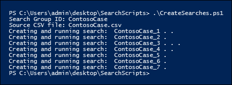
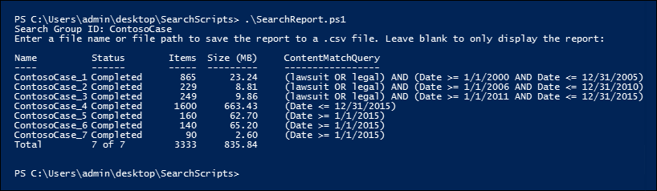

# <a name="create-report-on-and-delete-multiple-content-searches"></a>Erstellen, Ausführen von Berichten und Löschen mehrerer Inhaltssuchen

 Das schnelle Erstellen und Melden von Ermittlungssuchen ist häufig ein wichtiger Schritt in eDiscovery und Untersuchungen, wenn Sie versuchen, mehr über die zugrunde liegenden Daten sowie den Reichhaltigen und die Qualität Ihrer Suchen zu erfahren. Dazu bietet das Security & Compliance Center PowerShell eine Reihe von Cmdlets, um zeitaufwändige Aufgaben für die Inhaltssuche zu automatisieren. Diese Skripts bieten eine schnelle und einfache Möglichkeit, eine Reihe von Suchen zu erstellen und dann Berichte über die geschätzten Suchergebnisse auszuführen, mit deren Hilfe Sie die Menge der in Frage europäischen Daten ermitteln können. Sie können die Skripts auch verwenden, um unterschiedliche Suchversionen zu erstellen, um die ergebnisse zu vergleichen, die jeweils erstellt werden. Mit diesen Skripts können Sie Ihre Daten schnell und effizient identifizieren und ausmerzen.

## <a name="before-you-create-a-content-search"></a>Vor dem Erstellen einer Inhaltssuche

- Sie müssen Mitglied der Rollengruppe eDiscovery Manager im Security & Compliance Center sein, um die in diesem Thema beschriebenen Skripts ausführen zu können.

- Eine Liste der URLs für die OneDrive for #A0 in Ihrer Organisation, die Sie der #A1 in Schritt 1 hinzufügen können, finden Sie unter [Create a list of all OneDrive locations in your organization](/onedrive/list-onedrive-urls).

- Achten Sie darauf, alle dateien, die Sie in diesem Thema erstellen, im gleichen Ordner zu speichern. Dies erleichtert die Ausführung der Skripts.

- Die Skripts enthalten eine minimale Fehlerbehandlung. Ihr Hauptzweck ist das schnelle Erstellen, Melden und Löschen mehrerer Inhaltssuchen.

- Die in diesem Thema bereitgestellten Beispielskripts werden in den Microsoft-Standardsupportprogrammen oder -diensten nicht unterstützt. Die Beispielskripts werden wie besehen ohne Garantie jeglicher Art bereitgestellt. Microsoft schließt weiterhin konkludent, einschließlich, aber nicht beschränkt auf implizite Garantien der Handelsüblichkeit oder Eignung für einen bestimmten Zweck aus. Alle Risiken, die aus der Nutzung oder Ausführung der Beispielskripts und Dokumentation entstehen, liegen bei Ihnen. Microsoft, seine Autoren oder an der Erstellung, Produktion oder Bereitstellung der Skripts beteiligte Personen sind in keinem Fall haftbar für entstandene Schäden (darunter entgangene Gewinne, Geschäftsunterbrechungen, Verluste von Geschäftsinformationen oder sonstige finanzielle Verluste), die aus der Nutzung oder der Nutzungsunfähigkeit der Bespielskripts oder Dokumentation entstanden sind, selbst dann nicht, wenn Microsoft über eventuelle Folgen informiert wurde.

## <a name="step-1-create-a-csv-file-that-contains-information-about-the-searches-you-want-to-run"></a>Schritt 1: Erstellen einer CSV-Datei, die Informationen zu den Suchen enthält, die Sie ausführen möchten

Die in diesem Schritt erstellten CSV-Datei (Comma Separated Value) enthält eine Zeile für jeden Benutzer, der suchen möchte. Sie können das Exchange #A0 des Benutzers (einschließlich des Archivpostfachs, sofern aktiviert) und seine OneDrive for #A1 durchsuchen. Sie können auch nur das Postfach oder die OneDrive for #A0 durchsuchen. Sie können auch eine beliebige Website in Ihrer SharePoint Online-Organisation durchsuchen. Das Skript, das Sie in Schritt 3 ausführen, erstellt eine separate Suche für jede Zeile in der CSV-Datei.

1. Kopieren Sie den folgenden Text, und fügen Sie ihn mithilfe von NotePad in eine TXT-Datei ein. Speichern Sie diese Datei in einem Ordner auf Dem lokalen Computer. Sie speichern auch die anderen Skripts in diesem Ordner.

   ```text
   ExchangeLocation,SharePointLocation,ContentMatchQuery,StartDate,EndDate
   sarad@contoso.onmicrosoft.com,https://contoso-my.sharepoint.com/personal/sarad_contoso_onmicrosoft_com,(lawsuit OR legal),1/1/2000,12/31/2005
   sarad@contoso.onmicrosoft.com,https://contoso-my.sharepoint.com/personal/sarad_contoso_onmicrosoft_com,(lawsuit OR legal),1/1/2006,12/31/2010
   sarad@contoso.onmicrosoft.com,https://contoso-my.sharepoint.com/personal/sarad_contoso_onmicrosoft_com,(lawsuit OR legal),1/1/2011,3/21/2016
   ,https://contoso.sharepoint.com/sites/contoso,,,3/21/2016
   ,https://contoso-my.sharepoint.com/personal/davidl_contoso_onmicrosoft_com,,1/1/2015,
   ,https://contoso-my.sharepoint.com/personal/janets_contoso_onmicrosoft_com,,1/1/2015,
   ```

   In der ersten Zeile oder Kopfzeile der Datei werden die Parameter aufgeführt, die vom **Cmdlet New-ComplianceSearch** (im Skript in Schritt 3) zum Erstellen einer neuen Inhaltssuche verwendet werden. Die einzelnen Parameternamen werden jeweils durch ein Komma getrennt. Stellen Sie sicher, dass in der Kopfzeile keine Leerzeichen enthalten sind. Jede Zeile unter der Kopfzeile stellt die Parameterwerte für jede Suche dar. Ersetzen Sie unbedingt die Platzhalterdaten in der CSV-Datei durch Die tatsächlichen Daten.

2. Öffnen Sie die TXT-Datei in Excel, und verwenden Sie dann die Informationen in der folgenden Tabelle, um die Datei mit Informationen für jede Suche zu bearbeiten.

   ****

   |Parameter|Beschreibung|
   |---|---|
   |`ExchangeLocation`|Die SMTP-Adresse des Postfachs des Benutzers.|
   |`SharePointLocation`|Die URL für die OneDrive for #A0 des Benutzers oder die URL für jede Website in Ihrer Organisation. Verwenden Sie für die URL für OneDrive for #A0 das folgende Format: ` https://<your organization>-my.sharepoint.com/personal/<user alias>_<your organization>_onmicrosoft_com ` . Zum Beispiel: `https://contoso-my.sharepoint.com/personal/sarad_contoso_onmicrosoft_com`.|
   |`ContentMatchQuery`|Die Suchabfrage für die Suche. Weitere Informationen zum Erstellen einer Suchabfrage finden Sie unter [Schlüsselwortabfragen und Suchbedingungen für die Inhaltssuche](keyword-queries-and-search-conditions.md).|
   |`StartDate`|Bei E-Mails das Datum, an dem oder nach dem eine Nachricht von einem Empfänger empfangen oder vom Absender gesendet wurde. Bei Dokumenten auf SharePoint- oder OneDrive for #A0 ist das Datum am oder nach der letzten Änderung eines Dokuments.|
   |`EndDate`|Bei E-Mails das Datum am oder vor dem Senden einer Nachricht durch einen vom Benutzer gesendeten. Für Dokumente auf SharePoint- oder OneDrive for #A0 ist das Datum am oder vor der letzten Änderung eines Dokuments.|
   |

3. Speichern Sie die Excel-Datei als CSV-Datei in einem Ordner auf Ihrem lokalen Computer. Das skript, das Sie in Schritt 3 erstellen, verwendet die Informationen in dieser CSV-Datei, um die Suchen zu erstellen.

## <a name="step-2-connect-to-security--compliance-center-powershell"></a>Schritt 2: Herstellen einer Verbindung mit Security & Compliance Center-PowerShell

Der nächste Schritt besteht darin, eine Verbindung mit der Security & Compliance Center PowerShell für Ihre Organisation herzustellen. Schrittweise Anleitungen erhalten Sie unter [Herstellen einer Verbindung mit Security & Compliance Center PowerShell](/powershell/exchange/connect-to-scc-powershell).

## <a name="step-3-run-the-script-to-create-and-start-the-searches"></a>Schritt 3: Ausführen des Skripts zum Erstellen und Starten der Suche

Das Skript in diesem Schritt erstellt eine separate Inhaltssuche für jede Zeile in der CSV-Datei, die Sie in Schritt 1 erstellt haben. Wenn Sie dieses Skript ausführen, werden Sie zu zwei Werten aufgefordert:

- **Suchgruppen-ID** – Dieser Name bietet eine einfache Möglichkeit zum Organisieren der Suchen, die aus der CSV-Datei erstellt werden. Jede erstellte Suche wird mit der Suchgruppen-ID benannt, und dann wird eine Zahl an den Suchnamen angefügt. Wenn Sie beispielsweise **ContosoCase** für die Suchgruppen-ID eingeben, heißt die Suche **ContosoCase_1**, **ContosoCase_2**, **ContosoCase_3** und so weiter. Beachten Sie, dass bei dem von Ihnen eingebenen Namen die Zwischenschreibung beachtet wird. Wenn Sie die Suchgruppen-ID in Schritt 4 und Schritt 5 verwenden, müssen Sie denselben Fall wie beim Erstellen verwenden.

- **CSV-Datei** : Der Name der CSV-Datei, die Sie in Schritt 1 erstellt haben. Achten Sie darauf, den vollständigen Dateinamen zu verwenden, schließen Sie die #A0 ein. Beispiel:  `ContosoCase.csv` .

So führen Sie das Skript aus

1. Speichern Sie den folgenden Text in Windows PowerShell Skriptdatei, indem Sie das Dateinamensuffix .ps1 verwenden. Beispiel: `CreateSearches.ps1` . Speichern Sie die Datei im selben Ordner, in dem Sie die anderen Dateien gespeichert haben.

   ```Powershell
   # Get the Search Group ID and the location of the CSV input file
   $searchGroup = Read-Host 'Search Group ID'
   $csvFile = Read-Host 'Source CSV file'

   # Do a quick check to make sure our group name will not collide with other searches
   $searchCounter = 1
   import-csv $csvFile |
     ForEach-Object{

     $searchName = $searchGroup +'_' + $searchCounter
     $search = Get-ComplianceSearch $searchName -EA SilentlyContinue
     if ($search)
     {
        Write-Error "The Search Group ID conflicts with existing searches.  Please choose a search group name and restart the script."
        return
     }
     $searchCounter++
   }

   $searchCounter = 1
   import-csv $csvFile |
     ForEach-Object{

     # Create the query
     $query = $_.ContentMatchQuery
     if(($_.StartDate -or $_.EndDate))
     {
          # Add the appropriate date restrictions.  NOTE: Using the Date condition property here because it works across Exchange, SharePoint, and OneDrive for Business.
          # For Exchange, the Date condition property maps to the Sent and Received dates; for SharePoint and OneDrive for Business, it maps to Created and Modified dates.
          if($query)
          {
              $query += " AND"
          }
          $query += " ("
          if($_.StartDate)
          {
              $query += "Date >= " + $_.StartDate
          }
          if($_.EndDate)
          {
              if($_.StartDate)
              {
                  $query += " AND "
              }
              $query += "Date <= " + $_.EndDate
          }
          $query += ")"
     }

     # -ExchangeLocation can't be set to an empty string, set to null if there's no location.
     $exchangeLocation = $null
     if ( $_.ExchangeLocation)
     {
           $exchangeLocation = $_.ExchangeLocation
     }

     # Create and run the search
     $searchName = $searchGroup +'_' + $searchCounter
     Write-Host "Creating and running search: " $searchName -NoNewline
     $search = New-ComplianceSearch -Name $searchName -ExchangeLocation $exchangeLocation -SharePointLocation $_.SharePointLocation -ContentMatchQuery $query

     # Start and wait for each search to complete
     Start-ComplianceSearch $search.Name
     while ((Get-ComplianceSearch $search.Name).Status -ne "Completed")
     {
        Write-Host " ." -NoNewline
        Start-Sleep -s 3
     }
     Write-Host ""

     $searchCounter++
   }
   ```

2. Wechseln Windows PowerShell zu dem Ordner, in dem Sie das Skript im vorherigen Schritt gespeichert haben, und führen Sie dann das Skript aus. Zum Beispiel:

   ```Powershell
   .\CreateSearches.ps1
   ```

3. Geben Sie **an der Eingabeaufforderung** suchgruppen-ID einen Suchgruppennamen ein, und drücken Sie dann die **EINGABETASTE**; Beispiel:  `ContosoCase` . Beachten Sie, dass bei diesem Namen die Kleinschreibung beachtet wird, daher müssen Sie ihn in den folgenden Schritten auf die gleiche Weise eingeben.

4. Geben Sie **an der Eingabeaufforderung** für die Quell-CSV-Datei den Namen der #A0 ein, einschließlich der CSV-Dateierweiterung. Beispiel:  `ContosoCase.csv` .

5. Drücken **Sie die EINGABETASTE,** um das Skript weiter auszuführen.

   Das Skript zeigt den Fortschritt beim Erstellen und Ausführen der Suchen an. Wenn das Skript abgeschlossen ist, wird es an die Eingabeaufforderung zurückgegeben.

   

## <a name="step-4-run-the-script-to-report-the-search-estimates"></a>Schritt 4: Ausführen des Skripts zum Melden der Suchschätzungen

Nachdem Sie die Suchen erstellt haben, führen Sie im nächsten Schritt ein Skript aus, das einen einfachen Bericht über die Anzahl der Suchtreffer für jede Suche anzeigt, die in Schritt 3 erstellt wurde. Der Bericht enthält außerdem die Größe der Ergebnisse für jede Suche sowie die Gesamtanzahl der Treffer und die Gesamtgröße aller Suchergebnisse. Wenn Sie das Berichtsskript ausführen, werden Sie zur Suchgruppen-ID und einem CSV-Dateinamen aufgefordert, wenn Sie den Bericht in einer CSV-Datei speichern möchten.

1. Speichern Sie den folgenden Text in Windows PowerShell Skriptdatei, indem Sie das Dateinamensuffix .ps1 verwenden. Beispiel: `SearchReport.ps1` . Speichern Sie die Datei im selben Ordner, in dem Sie die anderen Dateien gespeichert haben.

   ```Powershell
   $searchGroup = Read-Host 'Search Group ID'
   $outputFile = Read-Host 'Enter a file name or file path to save the report to a .csv file. Leave blank to only display the report'
   $searches = Get-ComplianceSearch | ?{$_.Name -clike $searchGroup + "_*"}
   $allSearchStats = @()
   foreach ($partialObj in $searches)
   {
      $search = Get-ComplianceSearch $partialObj.Name
      $sizeMB = [System.Math]::Round($search.Size / 1MB, 2)
      $searchStatus = $search.Status
      if($search.Errors)
      {
          $searchStatus = "Failed"
      }elseif($search.NumFailedSources -gt 0)
      {
          $searchStatus = "Failed Sources"
      }
      $searchStats = New-Object PSObject
      Add-Member -InputObject $searchStats -MemberType NoteProperty -Name Name -Value $search.Name
      Add-Member -InputObject $searchStats -MemberType NoteProperty -Name ContentMatchQuery -Value $search.ContentMatchQuery
      Add-Member -InputObject $searchStats -MemberType NoteProperty -Name Status -Value $searchStatus
      Add-Member -InputObject $searchStats -MemberType NoteProperty -Name Items -Value $search.Items
      Add-Member -InputObject $searchStats -MemberType NoteProperty -Name "Size" -Value $search.Size
      Add-Member -InputObject $searchStats -MemberType NoteProperty -Name "Size(MB)" -Value $sizeMB
      $allSearchStats += $searchStats
   }
   # Calculate the totals
   $allItems = ($allSearchStats | Measure-Object Items -Sum).Sum
   # Convert the total size to MB and round to the nearst 100th
   $allSize = ($allSearchStats | Measure-Object 'Size' -Sum).Sum
   $allSizeMB = [System.Math]::Round($allSize  / 1MB, 2)
   # Get the total successful searches and total of all searches
   $allSuccessCount = ($allSearchStats |?{$_.Status -eq "Completed"}).Count
   $allCount = $allSearchStats.Count
   $allStatus = [string]$allSuccessCount + " of " + [string]$allCount
   # Totals Row
   $totalSearchStats = New-Object PSObject
   Add-Member -InputObject $totalSearchStats -MemberType NoteProperty -Name Name -Value "Total"
   Add-Member -InputObject $totalSearchStats -MemberType NoteProperty -Name Status -Value $allStatus
   Add-Member -InputObject $totalSearchStats -MemberType NoteProperty -Name Items -Value $allItems
   Add-Member -InputObject $totalSearchStats -MemberType NoteProperty -Name "Size(MB)" -Value $allSizeMB
   $allSearchStats += $totalSearchStats
   # Just get the columns we're interested in showing
   $allSearchStatsPrime = $allSearchStats | Select-Object Name, Status, Items, "Size(MB)", ContentMatchQuery
   # Print the results to the screen
   $allSearchStatsPrime |ft -AutoSize -Wrap
   # Save the results to a CSV file
   if ($outputFile)
   {
      $allSearchStatsPrime | Export-Csv -Path $outputFile -NoTypeInformation
   }
   ```

2. Wechseln Windows PowerShell zu dem Ordner, in dem Sie das Skript im vorherigen Schritt gespeichert haben, und führen Sie dann das Skript aus. Zum Beispiel:

   ```Powershell
   .\SearchReport.ps1
   ```

3. Geben Sie **an der Eingabeaufforderung** suchgruppen-ID einen Suchgruppennamen ein, und drücken Sie dann die **EINGABETASTE**; beispiel:  `ContosoCase` . Denken Sie daran, dass bei diesem Namen die Kleinschreibung beachtet wird, daher müssen Sie ihn genauso eingeben wie beim Ausführen des Skripts in Schritt 3.

4. Geben Sie an der Eingabeaufforderung Dateipfad, um den Bericht in einer CSV-Datei zu speichern (lassen Sie leer, um nur den Bericht **anzeigen)** einen Dateinamen des vollständigen Dateinamenpfads (einschließlich der CSV-Dateierweiterung) ein, wenn Sie den Bericht in einer CSV-Datei speichern möchten. Name der CSV-Datei, einschließlich der CSV-Dateierweiterung. Sie können beispielsweise eingeben, um es im aktuellen Verzeichnis zu speichern, oder Sie können eingeben, um es in einem anderen  `ContosoCaseReport.csv`  `C:\Users\admin\OneDrive for Business\ContosoCase\ContosoCaseReport.csv` Ordner zu speichern. Sie können die Eingabeaufforderung auch leer lassen, um den Bericht angezeigt, aber nicht in einer Datei zu speichern.

5. Drücken Sie **EINGABE**.

   Das Skript zeigt den Fortschritt beim Erstellen und Ausführen der Suchen an. Wenn das Skript abgeschlossen ist, wird der Bericht angezeigt.

   

> [!NOTE]
> Wenn dasselbe Postfach oder dieselbe Website als Inhaltsspeicherort in mehr als einer Suche in einer Suchgruppe angegeben wird, kann die Gesamtergebnisschätzung im Bericht (sowohl für die Anzahl der Elemente als auch für die Gesamtgröße) Ergebnisse für dieselben Elemente enthalten. Der Grund dafür ist, dass dieselbe E-Mail-Nachricht oder dasselbe Dokument mehr als einmal gezählt wird, wenn sie mit der Abfrage für unterschiedliche Suchabfragen in der Suchgruppe übereinstimmen.

## <a name="step-5-run-the-script-to-delete-the-searches"></a>Schritt 5: Ausführen des Skripts zum Löschen der Suchen

Da Sie möglicherweise viele Suchen erstellen, ist es mit diesem letzten Skript einfach, die in Schritt 3 erstellten Suchen schnell zu löschen. Wie die anderen Skripts werden Sie auch in diesem Skript zur Suchgruppen-ID aufgefordert. Alle Suchen mit der Suchgruppen-ID im Suchnamen werden gelöscht, wenn Sie dieses Skript ausführen.

1. Speichern Sie den folgenden Text in Windows PowerShell Skriptdatei, indem Sie das Dateinamensuffix .ps1 verwenden. Beispiel: `DeleteSearches.ps1` . Speichern Sie die Datei im selben Ordner, in dem Sie die anderen Dateien gespeichert haben.

   ```Powershell
   # Delete all searches in a search group
   $searchGroup = Read-Host 'Search Group ID'
   Get-ComplianceSearch |
      ForEach-Object{
      # If the name matches the search group name pattern (case sensitive), delete the search
      if ($_.Name -cmatch $searchGroup + "_\d+")
      {
          Write-Host "Deleting search: " $_.Name
          Remove-ComplianceSearch $_.Name -Confirm:$false
      }
   }
   ```

2. Wechseln Windows PowerShell zu dem Ordner, in dem Sie das Skript im vorherigen Schritt gespeichert haben, und führen Sie dann das Skript aus. Zum Beispiel:

   ```Powershell
   .\DeleteSearches.ps1
   ```

3. Geben Sie **an der** Eingabeaufforderung suchgruppen-ID einen Suchgruppennamen für die Suchbegriffe ein, die Sie löschen möchten, und drücken Sie dann die **EINGABETASTE**; Beispiel:  `ContosoCase` . Denken Sie daran, dass bei diesem Namen die Kleinschreibung beachtet wird, daher müssen Sie ihn genauso eingeben wie beim Ausführen des Skripts in Schritt 3.

   Das Skript zeigt den Namen jeder gelöschten Suche an.

   