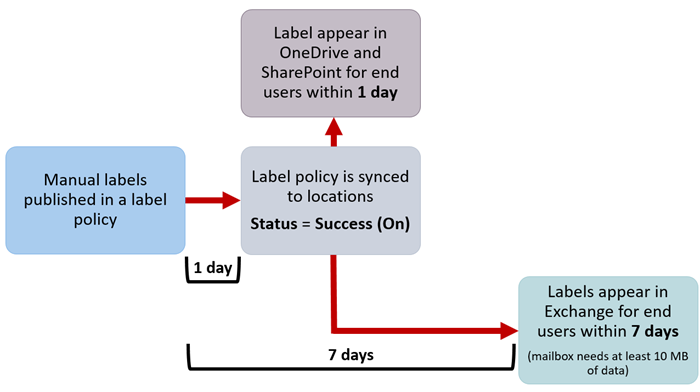

# <a name="create-publish-and-auto-apply-retention-labels"></a>Erstellen, Veröffentlichen und automatisches Anwenden von Aufbewahrungsbezeichnungen

>*[Microsoft 365-Lizenzierungsleitfaden für Sicherheit und Compliance](https://aka.ms/ComplianceSD).*

Verwenden Sie die folgenden Informationen, um [Aufbewahrungsbezeichnungen](labels.md) zu erstellen und diese dann automatisch auf Dokumente und E-Mails anzuwenden, oder um sie zu veröffentlichen, damit sie von den Benutzern manuell angewendet werden können.

Aufbewahrungsbezeichnungen helfen Ihnen bei der Aufbewahrung wichtiger Elemente und bei der Löschung alles anderen. Sie werden auch als Teil einer [Datensatzverwaltungslösung](records-management.md) für Ihre Microsoft 365-Daten verwendet, um ein Element als Datensatz zu deklarieren.

Wo Sie Ihre Aufbewahrungsbezeichnungen erstellen und konfigurieren, hängt davon ab, ob Sie die Datensatzverwaltung verwenden oder nicht. Es werden Anweisungen für beide Szenarios bereitgestellt.

## <a name="before-you-begin"></a>Bevor Sie beginnen

Die Mitglieder Ihres Complianceteams, die Aufbewahrungsbezeichnungen erstellen sollen, benötigen Berechtigungen für das Security &amp; Compliance Center. Standardmäßig hat Ihr Mandantenadministrator Zugriff auf diesen Speicherort und kann anderen Personen den Zugriff auf das Security &amp; Compliance Center gewähren, ohne ihnen alle Berechtigungen eines Mandantenadministrators zu geben. Zu diesem Zweck wird empfohlen, dass Sie zur Seite **Berechtigungen** des Security &amp; Compliance Centers gehen, die Rollengruppe **Compliance-Administrator** bearbeiten und dieser Rollengruppe Mitglieder hinzufügen. 
  
Weitere Informationen finden Sie unter [Freigeben des Benutzerzugriffs auf das Office 365 Security &amp; Compliance Center](../security/office-365-security/grant-access-to-the-security-and-compliance-center.md).
  
Diese Berechtigungen sind nur erforderlich, um Aufbewahrungsbezeichnungen und eine Aufbewahrungsrichtlinie zu erstellen und anzuwenden. Für die Durchsetzung von Richtlinien ist kein Zugriff auf Inhalte erforderlich.

## <a name="create-and-configure-retention-labels"></a>Erstellen und Konfigurieren von Aufbewahrungsbezeichnungen

1. Navigieren Sie im [Microsoft 365 Compliance Center](https://compliance.microsoft.com/) zu einem der folgenden Orte:
    
    - Wenn Sie die Datensatzverwaltung verwenden:
        - **Lösungen** > **Datensatzverwaltung** >  Registerkarte **Dateiplan** > **+ Bezeichnung erstellen** > **Aufbewahrungsbezeichnung**
        
    - Wenn Sie die Datensatzverwaltung nicht verwenden:
       - **Lösungen** > **Informationsgovernance** >  Registerkarte **Bezeichnungen** > + **Bezeichnung erstellen**
    
    Sehen Sie nicht sofort die gewünschte Option? Wählen Sie zuerst **Alle anzeigen** aus. 

2. Folgen Sie den Anweisungen des Assistenten. Wenn Sie die Datensatzverwaltung verwenden:
    
    - Informationen zu den Dateiplanbeschreibungen finden Sie unter [Übersicht über den Dateiplan-Manager.](file-plan-manager.md)
    
    - Wenn Sie mithilfe der Aufbewahrungsbezeichnung Inhalt als Datensatz deklarieren möchten, aktivieren Sie das Kontrollkästchen **Bezeichnung zum Klassifizieren von Inhalt als Datensatz verwenden**.

3. Wiederholen Sie diese Schritte, um weitere Bezeichnungen zu erstellen.

Um eine vorhandene Bezeichnung zu bearbeiten, markieren Sie sie, und wählen Sie dann **Bezeichnung bearbeiten** aus. Damit wird derselbe Assistent gestartet, der es Ihnen ermöglicht, die Beschreibungen und Einstellungen für Bezeichnungen in Schritt 2 zu ändern.

## <a name="publish-retention-labels-by-creating-a-retention-label-policy"></a>Veröffentlichen von Aufbewahrungsbezeichnungen durch die Erstellung einer Aufbewahrungsbezeichnungsrichtlinie

Veröffentlichen Sie Aufbewahrungsbezeichnungen, damit sie von Benutzern manuell angewendet werden können.

1. Navigieren Sie im [Microsoft 365 Compliance Center](https://compliance.microsoft.com/) zu einem der folgenden Orte:
    
    - Wenn Sie die Datensatzverwaltung verwenden:
        - **Lösungen** > **Datensatzverwaltung** > > Registerkarte **Bezeichnungsrichtlinien** > **Bezeichnungen veröffentlichen**
    
    - Wenn Sie die Datensatzverwaltung nicht verwenden:
        - **Lösungen** > **Informationsgovernance** >  Registerkarte **Bezeichnungsrichtlinien** > **Bezeichnungen veröffentlichen**
    
    Sehen Sie nicht sofort die gewünschte Option? Wählen Sie zuerst **Alle anzeigen** aus. 

2. Folgen Sie den Anweisungen des Assistenten.
    
    Informationen zum Konfigurieren der Speicherorte finden Sie im Abschnitt [Aufbewahrungsbezeichnungen und -speicherorte](#retention-labels-and-locations) auf dieser Seite. 

## <a name="auto-apply-a-retention-label"></a>Aufbewahrungsbezeichnungen automatisch anwenden

Richten Sie eine Aufbewahrungsbezeichnung so ein, dass sie basierend auf den von Ihnen festgelegten Bedingungen automatisch angewendet wird.

1. Navigieren Sie im [Microsoft 365 Compliance Center](https://compliance.microsoft.com/) zu einem der folgenden Orte:
    
    - Wenn Sie die Datensatzverwaltung verwenden: **Informationsgovernance**:
        - **Lösungen** > **Datensatzverwaltung** >  Registerkarte **Bezeichnungsrichtlinien** > **Bezeichnung automatisch anwenden**
    
    - Wenn Sie die Datensatzverwaltung nicht verwenden:
        - **Lösungen** > **Informationgovernance** >  Registerkarte **Bezeichnungsrichtlinien** > **Bezeichnung automatisch anwenden**
    
    Sehen Sie nicht sofort die gewünschte Option? Wählen Sie zuerst **Alle anzeigen** aus. 

2. Folgen Sie den Anweisungen des Assistenten.
    
    Informationen zum Konfigurieren der Bedingungen, die zur automatischen Anwendung der Aufbewahrungsbezeichnung führen, finden Sie im Abschnitt [Konfigurieren der Bedingungen für automatisch angewendete Aufbewahrungsbezeichnungen](#configuring-conditions-for-auto-apply-retention-labels) auf dieser Seite.
    
    Informationen zum Konfigurieren der Speicherorte finden Sie im nächsten Abschnitt auf dieser Seite, [Aufbewahrungsbezeichnungen und -speicherorte](#retention-labels-and-locations).

## <a name="retention-labels-and-locations"></a>Aufbewahrungsbezeichnungen und -speicherorte

Verschiedene Arten von Aufbewahrungsbezeichnungen können an verschiedenen Speicherorten veröffentlicht werden, je nach Funktion der Aufbewahrungsbezeichnung.
  
|**Wenn für die Aufbewahrungsbezeichnung Folgendes gilt:**|**So kann die Bezeichnungsrichtlinie angewendet werden auf...**|
|:-----|:-----|
|für Endbenutzer veröffentlicht  <br/> |Gruppen in Exchange, SharePoint, OneDrive, Office 365  <br/> |
|basierend auf Typen vertraulicher Informationen automatisch angewendet  <br/> |Exchange (nur alle Postfächer), SharePoint, OneDrive  <br/> |
|basieren auf einer Abfrage automatisch angewendet  <br/> |Gruppen in Exchange, SharePoint, OneDrive, Office 365  <br/> |
   
In Exchange werden automatisch angewendete Bezeichnungen (sowohl für Abfragen als auch für vertrauliche Informationstypen) nur auf neu gesendete Nachrichten (in Übertragung begriffene Daten) angewendet, und nicht auf alle Elemente, die sich derzeit im Postfach befinden (ruhende Daten). Außerdem können automatisch angewendete Aufbewahrungsbezeichnungen für vertrauliche Informationstypen nur auf alle Postfächer angewendet werden; Sie können keine bestimmten Postfächer dafür auswählen.
  
Öffentliche Ordner in Exchange und Skype unterstützen keine Aufbewahrungsbezeichnungen.


## <a name="configuring-conditions-for-auto-apply-retention-labels"></a>Konfigurieren der Bedingungen für automatisch angewendete Aufbewahrungsbezeichnungen

Aufbewahrungsbezeichnungen können automatisch auf Inhalte angewendet werden, wenn diese folgende Bedingungen erfüllen:
  
- [Der Inhalt enthält bestimmte vertrauliche Informationen.](#auto-apply-labels-to-content-with-specific-types-of-sensitive-information)
    
- [Der Inhalt enthält bestimmte Stichwörter, die einer von Ihnen erstellten Abfrage entsprechen.](#auto-apply-labels-to-content-with-keywords-or-searchable-properties)

- [Eine Übereinstimmung für trainierbare Klassifizierungen](#auto-apply-labels-to-content-by-using-trainable-classifiers)
    


Es kann bis zu sieben Tage dauern, bis die automatisch angewendeten Aufbewahrungsbezeichnungen für alle Inhalte, die den von Ihnen konfigurierten Bedingungen entsprechen, wirksam werden.

### <a name="auto-apply-labels-to-content-with-specific-types-of-sensitive-information"></a>Automatisches Anwenden von Bezeichnungen auf Inhalte mit bestimmten Typen von vertraulichen Informationen

Wenn Sie automatisch angewendete Aufbewahrungsbezeichnungen für vertrauliche Informationen erstellen, wird dieselbe Liste von Richtlinienvorlagen wie beim Erstellen einer DLP-Richtlinie (Data Loss Prevention, Verhinderung von Datenverlust) angezeigt. Jede Richtlinienvorlage ist für die Suche nach bestimmten Typen vertraulicher Informationen vorkonfiguriert. Die hier wiedergegebene Vorlage sucht beispielsweise nach US-amerikanischen Steuernummern für Privatpersonen (ITIN), Sozialversicherungsnummern (SSN) und Reisepassnummern. Weitere Informationen zu DLP finden Sie unter [Übersicht über Richtlinien zur Verhinderung von Datenverlust](data-loss-prevention-policies.md).
  

  
Nach der Auswahl einer Richtlinienvorlage können Sie alle Arten von vertraulichen Informationen hinzufügen oder entfernen, und Sie können die Instanzenanzahl ändern und die Genauigkeit abgleichen. Im hier gezeigten Beispiel wird eine Aufbewahrungsbezeichnung nur dann automatisch angewendet, wenn Folgendes zutrifft:
  
- Der Inhalt besteht aus 1 bis 9 Instanzen einer der drei folgenden Typen von vertraulichen Informationen. Sie können den **max**-Wert löschen, sodass er sich in **any** ändert.
    
- Der Typ der vertraulichen Informationen, der erkannt wird, hat eine Übereinstimmungsgenauigkeit (oder Vertrauensstufe) von mindestens 75. Viele Typen vertraulicher Informationen werden mit mehreren Mustern definiert, wobei ein Muster mit einer höheren Übereinstimmungsgenauigkeit mehr Nachweise (z. B. Stichwörter, Datumsangaben oder Adressen) erfordert, während ein Muster mit einer niedrigeren Übereinstimmungsgenauigkeit weniger Nachweise erfordert. Einfach ausgedrückt: Je niedriger die **min**-Übereinstimmungsgenauigkeit, desto einfacher ist es für den Inhalt, die Bedingung zu erfüllen. 
    
Weitere Informationen zu diesen Optionen finden Sie unter [Optimieren von Regeln, um die Übereinstimmung zu vereinfachen oder zu erschweren](data-loss-prevention-policies.md#tuning-rules-to-make-them-easier-or-harder-to-match).
    

  
### <a name="auto-apply-labels-to-content-with-keywords-or-searchable-properties"></a>Automatisches Anwenden von Bezeichnungen auf Inhalte mit Stichwörtern oder durchsuchbare Eigenschaften

Sie können automatische Bezeichnungen auf Inhalte anwenden, die bestimmte Kriterien erfüllen. Die derzeit verfügbaren Bedingungen unterstützen das Anwenden einer Bezeichnung auf Inhalte, die bestimmte Wörter, Ausdrücke oder durchsuchbare Eigenschaften enthalten. Sie können Ihre Abfrage mithilfe von Suchoperatoren wie UND, ODER und NICHT verfeinern.

Weitere Informationen zur Abfragesyntax finden Sie unter:

- [Syntaxreferenz für die Keyword Query Language (KQL)](https://docs.microsoft.com/sharepoint/dev/general-development/keyword-query-language-kql-syntax-reference)

Abfragebasierte Bezeichnungen verwenden den Suchindex zum Identifizieren von Inhalten. Weitere Informationen zu gültigen durchsuchbaren Eigenschaften finden Sie unter:

- [Stichwortabfragen und Suchbedingungen für die Inhaltssuche](keyword-queries-and-search-conditions.md)
- [Übersicht über durchforstete und verwaltete Eigenschaften in SharePoint Server](https://docs.microsoft.com/SharePoint/technical-reference/crawled-and-managed-properties-overview)

Beispiele für Abfragen:

- Exchange
    - Betreff: „Vierteljährliche Finanzdaten“
    - recipients:garthf<!--nolink-->@contoso.com
- SharePoint und OneDrive
    - contenttype:contract
    - site:https<!--nolink-->://contoso.sharepoint.com/sites/teams/procurement AND contenttype:contract


### <a name="auto-apply-labels-to-content-by-using-trainable-classifiers"></a>Automatisches Anwenden von Bezeichnungen auf Inhalte mithilfe von trainierbare Klassifizierungen

Wenn Sie die Option für eine trainierbare Klassifizierung auswählen, können Sie eine der integrierten Klassifizierungen oder eine benutzerdefinierte Klassifizierung auswählen. Zu den integrierten Klassifizierungen gehören **Lebensläufe**, **Quellcode**, **Gezielte Belästigung**, **Vulgäre Ausdrücke** und **Drohungen**:


Wenn Sie eine Bezeichnung mithilfe dieser Option automatisch anwenden möchten, müssen SharePoint Online-Websites und -Postfächer mindestens 10 MB Daten umfassen.

Weitere Informationen zu trainierbaren Klassifizierungen finden Sie unter [Erste Schritte mit trainierbaren Klassifizierungen (Vorschau)](classifier-getting-started-with.md).

Eine Beispielkonfiguration finden Sie unter [Vorbereiten und Verwenden einer eingebauten Klassifizierung](classifier-using-a-ready-to-use-classifier.md#how-to-verify-that-a-built-in-classifier-will-meet-your-needs).

## <a name="how-long-it-takes-for-retention-labels-to-take-effect"></a>Wie lange es dauert, bis Aufbewahrungsbezeichnungen wirksam werden

Wenn Sie Aufbewahrungsbezeichnungen veröffentlichen oder automatisch anwenden, werden sie nicht sofort wirksam:
  
1. Zuerst muss die Bezeichnungsrichtlinie aus dem Admin Center mit den Standorten der Richtlinie synchronisiert werden.
    
2. Dann dauert es u. U. etwas, bis der jeweilige Ort den Endbenutzern veröffentlichte Aufbewahrungsbezeichnungen zur Verfügung stellt oder Bezeichnungen automatisch auf Inhalte angewendet werden. Die jeweilige Dauer ist vom Ort und der Art der Aufbewahrungsbezeichnung abhängig.
    
### <a name="published-retention-labels"></a>Veröffentlichte Aufbewahrungsbezeichnungen

Wenn Sie Aufbewahrungsbezeichnungen auf SharePoint oder OneDrive veröffentlichen, kann es bis zu einem Tag dauern, bevor diese Aufbewahrungsbezeichnungen den Endbenutzern angezeigt werden. Darüber hinaus kann es, wenn Sie Aufbewahrungsbezeichnungen auf Exchange veröffentlichen, bis zu sieben Tage dauern, bevor sie den Endbenutzern zur Verfügung stehen. Außerdem muss das Postfach mindestens 10 MB Daten enthalten.
  

  
### <a name="auto-apply-retention-labels"></a>Automatisch angewendete Aufbewahrungsbezeichnungen

Wenn Sie Aufbewahrungsbezeichnungen automatisch auf Inhalte anwenden, die bestimmte Bedingungen erfüllen, kann es bis zu sieben Tage dauern, bevor die Aufbewahrungsbezeichnungen auf alle vorhandenen Inhalte angewendet werden, die diesen Kriterien entsprechen.
  

  
### <a name="how-to-check-on-the-status-of-retention-labels-published-to-exchange"></a>So überprüfen Sie den Status der in Exchange veröffentlichten Aufbewahrungsbezeichnungen

In Exchange Online werden Aufbewahrungsbezeichnungen Endbenutzern anhand eines Prozesses bereitgestellt, die alle sieben Tage ausgeführt wird. Mit PowerShell können Sie sehen, wann dieser Prozess zuletzt ausgeführt wurde, und so ermitteln, wann er erneut ausgeführt wird.
  
1. [Stellen Sie eine Verbindung mit Exchange Online PowerShell her](https://go.microsoft.com/fwlink/?linkid=799773).
    
2. Führen Sie die folgenden Befehle aus:
    
   ```powershell
   $logProps = Export-MailboxDiagnosticLogs <user> -ExtendedProperties
   ```

   ```powershell
   $xmlprops = [xml]($logProps.MailboxLog)
   ```

   ```powershell
   $xmlprops.Properties.MailboxTable.Property | ? {$_.Name -like "ELC*"}
   ```

In den Ergebnissen zeigt die Eigenschaft `ELCLastSuccessTimeStamp` (UTC), wann das System zuletzt Ihr Postfach verarbeitet hat. Wenn dies seit dem Zeitpunkt der Richtlinienerstellung nicht geschehen ist, werden die Bezeichnungen nicht angezeigt. Um die Verarbeitung zu erzwingen, führen Sie `Start-ManagedFolderAssistant -Identity <user>` aus.
    
Wenn die Bezeichnungen nicht in Outlook im Web angezeigt werden und Sie denken, dass sie angezeigt werden sollten, müssen Sie den Cache des Browsers leeren (STRG + F5).
    

## <a name="updating-retention-labels-and-their-policies"></a>Aktualisieren von Aufbewahrungsbezeichnungen und der entsprechenden Richtlinien

Wenn Sie eine Aufbewahrungsbezeichnung, eine Aufbewahrungbezeichnungsrichtlinie oder eine Richtlinie für die automatische Anwendung bearbeiten, und diese Aufbewahrungsbezeichnung bereits auf Inhalte angewendet wird, werden die aktualisierten Einstellungen automatisch zusätzlich auf diese Inhalte sowie auf neu bezeichnete Inhalte angewendet.

## <a name="find-the-powershell-cmdlets-for-retention-labels"></a>Die PowerShell-Cmdlets für Aufbewahrungsbezeichnungen finden

So verwenden Sie die Cmdlets für Aufbewahrungsbezeichnungen:
  
1. [Herstellen einer Verbindung mit Office 365 Security & Compliance Center PowerShell](https://docs.microsoft.com/powershell/exchange/office-365-scc/connect-to-scc-powershell/connect-to-scc-powershell)
    
2. Verwenden Sie die folgenden Office 365 Security & Compliance Center-Cmdlets:
    
    - [Get-ComplianceTag](https://docs.microsoft.com/powershell/module/exchange/get-compliancetag)
    
    - [New-ComplianceTag](https://docs.microsoft.com/powershell/module/exchange/new-compliancetag)
    
    - [Remove-ComplianceTag](https://docs.microsoft.com/powershell/module/exchange/remove-compliancetag)
    
    - [Set-ComplianceTag](https://docs.microsoft.com/powershell/module/exchange/set-compliancetag)
    
    - [Enable-ComplianceTagStorage](https://docs.microsoft.com/powershell/module/exchange/enable-compliancetagstorage)
    
    - [Get-ComplianceTagStorage](https://docs.microsoft.com/powershell/module/exchange/get-compliancetagstorage)
    
    - [Get-RetentionCompliancePolicy](https://docs.microsoft.com/powershell/module/exchange/get-retentioncompliancepolicy)
    
    - [New-RetentionCompliancePolicy](https://docs.microsoft.com/powershell/module/exchange/new-retentioncompliancepolicy)
    
    - [Remove-RetentionCompliancePolicy](https://docs.microsoft.com/powershell/module/exchange/remove-retentioncompliancepolicy)
    
    - [Set-RetentionCompliancePolicy](https://docs.microsoft.com/powershell/module/exchange/set-retentioncompliancepolicy)
    
    - [Get-RetentionComplianceRule](https://docs.microsoft.com/powershell/module/exchange/get-retentioncompliancerule)
    
    - [New-RetentionComplianceRule](https://docs.microsoft.com/powershell/module/exchange/new-retentioncompliancerule)
    
    - [Remove-RetentionComplianceRule](https://docs.microsoft.com/powershell/module/exchange/remove-retentioncompliancerule)
    
    - [Set-RetentionComplianceRule](https://docs.microsoft.com/powershell/module/exchange/set-retentioncompliancerule)
