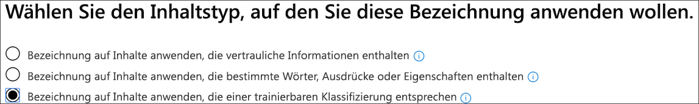

# <a name="create-publish-and-auto-apply-retention-labels"></a><span data-ttu-id="f0ef5-103">Erstellen, Veröffentlichen und automatisches Anwenden von Aufbewahrungsbezeichnungen</span><span class="sxs-lookup"><span data-stu-id="f0ef5-103">Create, publish, and auto-apply retention labels</span></span>

><span data-ttu-id="f0ef5-104">*[Microsoft 365-Lizenzierungsleitfaden für Sicherheit und Compliance](https://aka.ms/ComplianceSD).*</span><span class="sxs-lookup"><span data-stu-id="f0ef5-104">*[Microsoft 365 licensing guidance for security & compliance](https://aka.ms/ComplianceSD).*</span></span>

<span data-ttu-id="f0ef5-105">Verwenden Sie die folgenden Informationen, um [Aufbewahrungsbezeichnungen](labels.md) zu erstellen und diese dann automatisch auf Dokumente und E-Mails anzuwenden, oder um sie zu veröffentlichen, damit sie von den Benutzern manuell angewendet werden können.</span><span class="sxs-lookup"><span data-stu-id="f0ef5-105">Use the following information to help you create [retention labels](labels.md), and then automatically apply them to documents and emails, or publish them so that users can manually apply them.</span></span>

<span data-ttu-id="f0ef5-106">Aufbewahrungsbezeichnungen helfen Ihnen bei der Aufbewahrung wichtiger Elemente und bei der Löschung alles anderen.</span><span class="sxs-lookup"><span data-stu-id="f0ef5-106">Retention labels help you retain what you need and delete what you don't.</span></span> <span data-ttu-id="f0ef5-107">Sie werden auch als Teil einer [Datensatzverwaltungslösung](records-management.md) für Ihre Microsoft 365-Daten verwendet, um ein Element als Datensatz zu deklarieren.</span><span class="sxs-lookup"><span data-stu-id="f0ef5-107">They are also used to declare an item as a record as part of a [records management](records-management.md) solution for your Microsoft 365 data.</span></span>

<span data-ttu-id="f0ef5-108">Wo Sie Ihre Aufbewahrungsbezeichnungen erstellen und konfigurieren, hängt davon ab, ob Sie die Datensatzverwaltung verwenden oder nicht.</span><span class="sxs-lookup"><span data-stu-id="f0ef5-108">Where you create and configure your retention labels depend on whether you're using records management or not.</span></span> <span data-ttu-id="f0ef5-109">Es werden Anweisungen für beide Szenarios bereitgestellt.</span><span class="sxs-lookup"><span data-stu-id="f0ef5-109">Instructions are provided for both scenarios.</span></span>

## <a name="before-you-begin"></a><span data-ttu-id="f0ef5-110">Bevor Sie beginnen</span><span class="sxs-lookup"><span data-stu-id="f0ef5-110">Before you begin</span></span>

<span data-ttu-id="f0ef5-111">Die Mitglieder Ihres Complianceteams, die Aufbewahrungsbezeichnungen erstellen sollen, benötigen Berechtigungen für das Security &amp; Compliance Center.</span><span class="sxs-lookup"><span data-stu-id="f0ef5-111">Members of your compliance team who will create retention labels need permissions to the Security &amp; Compliance Center.</span></span> <span data-ttu-id="f0ef5-112">Standardmäßig hat Ihr Mandantenadministrator Zugriff auf diesen Speicherort und kann anderen Personen den Zugriff auf das Security &amp; Compliance Center gewähren, ohne ihnen alle Berechtigungen eines Mandantenadministrators zu geben. Zu diesem Zweck wird empfohlen, dass Sie zur Seite **Berechtigungen** des Security &amp; Compliance Centers gehen, die Rollengruppe **Compliance-Administrator** bearbeiten und dieser Rollengruppe Mitglieder hinzufügen.</span><span class="sxs-lookup"><span data-stu-id="f0ef5-112">By default, your tenant admin has access to this location and can give compliance officers and other people access to the Security &amp; Compliance Center, without giving them all of the permissions of a tenant admin. To do this, we recommend that you go to the **Permissions** page of the Security &amp; Compliance Center, edit the **Compliance Administrator** role group, and add members to that role group.</span></span> 
  
<span data-ttu-id="f0ef5-113">Weitere Informationen finden Sie unter [Freigeben des Benutzerzugriffs auf das Office 365 Security &amp; Compliance Center](../security/office-365-security/grant-access-to-the-security-and-compliance-center.md).</span><span class="sxs-lookup"><span data-stu-id="f0ef5-113">For more information, see [Give users access to the Office 365 Security &amp; Compliance Center](../security/office-365-security/grant-access-to-the-security-and-compliance-center.md).</span></span>
  
<span data-ttu-id="f0ef5-p104">Diese Berechtigungen sind nur erforderlich, um Aufbewahrungsbezeichnungen und eine Aufbewahrungsrichtlinie zu erstellen und anzuwenden. Für die Durchsetzung von Richtlinien ist kein Zugriff auf Inhalte erforderlich.</span><span class="sxs-lookup"><span data-stu-id="f0ef5-p104">These permissions are required only to create and apply retention labels and a label policy. Policy enforcement does not require access to the content.</span></span>

## <a name="create-and-configure-retention-labels"></a><span data-ttu-id="f0ef5-116">Erstellen und Konfigurieren von Aufbewahrungsbezeichnungen</span><span class="sxs-lookup"><span data-stu-id="f0ef5-116">Create and configure retention labels</span></span>

1. <span data-ttu-id="f0ef5-117">Navigieren Sie im [Microsoft 365 Compliance Center](https://compliance.microsoft.com/) zu einem der folgenden Orte:</span><span class="sxs-lookup"><span data-stu-id="f0ef5-117">In the [Microsoft 365 compliance center](https://compliance.microsoft.com/), navigate to one of the following locations:</span></span>
    
    - <span data-ttu-id="f0ef5-118">Wenn Sie die Datensatzverwaltung verwenden:</span><span class="sxs-lookup"><span data-stu-id="f0ef5-118">If you are using records management:</span></span>
        - <span data-ttu-id="f0ef5-119">**Lösungen** > **Datensatzverwaltung** >  Registerkarte **Dateiplan** > **+ Bezeichnung erstellen** > **Aufbewahrungsbezeichnung**</span><span class="sxs-lookup"><span data-stu-id="f0ef5-119">**Solutions** > **Records management** > **File plan** tab > **+ Create a label** > **Retention label**</span></span>
        
    - <span data-ttu-id="f0ef5-120">Wenn Sie die Datensatzverwaltung nicht verwenden:</span><span class="sxs-lookup"><span data-stu-id="f0ef5-120">If you are not using records management:</span></span>
       - <span data-ttu-id="f0ef5-121">**Lösungen** > **Informationsgovernance** >  Registerkarte **Bezeichnungen** > + **Bezeichnung erstellen**</span><span class="sxs-lookup"><span data-stu-id="f0ef5-121">**Solutions** > **Information governance** > **Labels** tab > + **Create a label**</span></span>
    
    <span data-ttu-id="f0ef5-122">Sehen Sie nicht sofort die gewünschte Option?</span><span class="sxs-lookup"><span data-stu-id="f0ef5-122">Don't immediately see your option?</span></span> <span data-ttu-id="f0ef5-123">Wählen Sie zuerst **Alle anzeigen** aus.</span><span class="sxs-lookup"><span data-stu-id="f0ef5-123">First select **Show all**.</span></span> 

2. <span data-ttu-id="f0ef5-124">Folgen Sie den Anweisungen des Assistenten.</span><span class="sxs-lookup"><span data-stu-id="f0ef5-124">Follow the prompts in the wizard.</span></span> <span data-ttu-id="f0ef5-125">Wenn Sie die Datensatzverwaltung verwenden:</span><span class="sxs-lookup"><span data-stu-id="f0ef5-125">If you are using records management:</span></span>
    
    - <span data-ttu-id="f0ef5-126">Informationen zu den Dateiplanbeschreibungen finden Sie unter [Verwenden des Dateiplans zum Verwalten von Aufbewahrungsbezeichnungen](file-plan-manager.md).</span><span class="sxs-lookup"><span data-stu-id="f0ef5-126">For information about the file plan descriptors, see [Use file plan to manage retention labels](file-plan-manager.md)</span></span>
    
    - <span data-ttu-id="f0ef5-127">Wenn Sie mithilfe der Aufbewahrungsbezeichnung Inhalt als Datensatz deklarieren möchten, aktivieren Sie das Kontrollkästchen **Bezeichnung zum Klassifizieren von Inhalt als Datensatz verwenden**.</span><span class="sxs-lookup"><span data-stu-id="f0ef5-127">To use the retention label to declare content as a record, enable the checkbox **Use label to classify content as a "Record"**.</span></span>

3. <span data-ttu-id="f0ef5-128">Wiederholen Sie diese Schritte, um weitere Bezeichnungen zu erstellen.</span><span class="sxs-lookup"><span data-stu-id="f0ef5-128">Repeat these steps to create more labels.</span></span>

<span data-ttu-id="f0ef5-129">Wenn Sie eine vorhandene Bezeichnung bearbeiten möchten, wählen Sie sie aus, und wählen Sie dann **Bezeichnung bearbeiten** aus, um den gleichen Assistenten zu starten, mit dem Sie die Beschreibungen der Bezeichnung und alle [zutreffenden Einstellungen](#updating-retention-labels-and-their-policies) aus Schritt 2 ändern können.</span><span class="sxs-lookup"><span data-stu-id="f0ef5-129">To edit an existing label, select it, and then select **Edit label** to start the same wizard that lets you change the label descriptions and any [eligible settings](#updating-retention-labels-and-their-policies) from step 2.</span></span> <span data-ttu-id="f0ef5-130">Wählen Sie alternativ eine der verfügbaren **Bearbeitungsoptionen** aus, um direkt zur entsprechenden Seite zu wechseln und die Aktualisierung vorzunehmen.</span><span class="sxs-lookup"><span data-stu-id="f0ef5-130">Alternatively, select any of the available **Edit** options to go directly to the relevant page to make your update.</span></span>

## <a name="publish-retention-labels-by-creating-a-retention-label-policy"></a><span data-ttu-id="f0ef5-131">Veröffentlichen von Aufbewahrungsbezeichnungen durch die Erstellung einer Aufbewahrungsbezeichnungsrichtlinie</span><span class="sxs-lookup"><span data-stu-id="f0ef5-131">Publish retention labels by creating a retention label policy</span></span>

<span data-ttu-id="f0ef5-132">Veröffentlichen Sie Aufbewahrungsbezeichnungen, damit sie von Benutzern manuell angewendet werden können.</span><span class="sxs-lookup"><span data-stu-id="f0ef5-132">Publish retention labels so that they can be manually applied by users.</span></span>

1. <span data-ttu-id="f0ef5-133">Navigieren Sie im [Microsoft 365 Compliance Center](https://compliance.microsoft.com/) zu einem der folgenden Orte:</span><span class="sxs-lookup"><span data-stu-id="f0ef5-133">In the [Microsoft 365 compliance center](https://compliance.microsoft.com/), navigate to one of the following locations:</span></span>
    
    - <span data-ttu-id="f0ef5-134">Wenn Sie die Datensatzverwaltung verwenden:</span><span class="sxs-lookup"><span data-stu-id="f0ef5-134">If you are using records management:</span></span>
        - <span data-ttu-id="f0ef5-135">**Lösungen** > **Datensatzverwaltung** > > Registerkarte **Bezeichnungsrichtlinien** > **Bezeichnungen veröffentlichen**</span><span class="sxs-lookup"><span data-stu-id="f0ef5-135">**Solutions** > **Records management** > > **Label policies** tab > **Publish labels**</span></span>
    
    - <span data-ttu-id="f0ef5-136">Wenn Sie die Datensatzverwaltung nicht verwenden:</span><span class="sxs-lookup"><span data-stu-id="f0ef5-136">If you are not using records management:</span></span>
        - <span data-ttu-id="f0ef5-137">**Lösungen** > **Informationsgovernance** >  Registerkarte **Bezeichnungsrichtlinien** > **Bezeichnungen veröffentlichen**</span><span class="sxs-lookup"><span data-stu-id="f0ef5-137">**Solutions** > **Information governance** > **Label policies** tab > **Publish labels**</span></span>
    
    <span data-ttu-id="f0ef5-138">Sehen Sie nicht sofort die gewünschte Option?</span><span class="sxs-lookup"><span data-stu-id="f0ef5-138">Don't immediately see your option?</span></span> <span data-ttu-id="f0ef5-139">Wählen Sie zuerst **Alle anzeigen** aus.</span><span class="sxs-lookup"><span data-stu-id="f0ef5-139">First select **Show all**.</span></span> 

2. <span data-ttu-id="f0ef5-140">Folgen Sie den Anweisungen des Assistenten.</span><span class="sxs-lookup"><span data-stu-id="f0ef5-140">Follow the prompts in the wizard.</span></span>
    
    <span data-ttu-id="f0ef5-141">Informationen über die von Aufbewahrungsbezeichnungen unterstützten Speicherorte finden Sie im Abschnitt [Aufbewahrungsbezeichnungen und -speicherorte](labels.md#retention-label-policies-and-locations).</span><span class="sxs-lookup"><span data-stu-id="f0ef5-141">For information about the locations supported by retention labels, see the [Retention labels and locations](labels.md#retention-label-policies-and-locations) section.</span></span> 

<span data-ttu-id="f0ef5-142">Wenn Sie eine vorhandene Aufbewahrungsbezeichnungsrichtlinie bearbeiten möchten, wählen Sie sie aus, und wählen Sie dann **Richtlinie bearbeiten** aus, um den gleichen Assistenten zu starten, mit dem Sie die Richtlinienbeschreibung und alle [zutreffenden Einstellungen](#updating-retention-labels-and-their-policies) aus Schritt 2 ändern können.</span><span class="sxs-lookup"><span data-stu-id="f0ef5-142">To edit an existing retention label policy, select it, and then select **Edit policy** to start the same wizard that lets you change the policy description and any [eligible settings](#updating-retention-labels-and-their-policies) from step 2.</span></span> <span data-ttu-id="f0ef5-143">Wählen Sie alternativ eine der verfügbaren **Bearbeitungsoptionen** aus, um direkt zur entsprechenden Seite zu wechseln und die Aktualisierung vorzunehmen.</span><span class="sxs-lookup"><span data-stu-id="f0ef5-143">Alternatively, select any of the available **Edit** options to go directly to the relevant page to make your update.</span></span>

## <a name="auto-apply-a-retention-label"></a><span data-ttu-id="f0ef5-144">Aufbewahrungsbezeichnungen automatisch anwenden</span><span class="sxs-lookup"><span data-stu-id="f0ef5-144">Auto-apply a retention label</span></span>

<span data-ttu-id="f0ef5-145">Richten Sie eine Aufbewahrungsbezeichnung so ein, dass sie basierend auf den von Ihnen festgelegten Bedingungen automatisch angewendet wird.</span><span class="sxs-lookup"><span data-stu-id="f0ef5-145">Auto-apply a retention label, based on the conditions that you specify.</span></span>

1. <span data-ttu-id="f0ef5-146">Navigieren Sie im [Microsoft 365 Compliance Center](https://compliance.microsoft.com/) zu einem der folgenden Orte:</span><span class="sxs-lookup"><span data-stu-id="f0ef5-146">In the [Microsoft 365 compliance center](https://compliance.microsoft.com/), navigate to one of the following locations:</span></span>
    
    - <span data-ttu-id="f0ef5-147">Wenn Sie die Datensatzverwaltung verwenden: **Informationsgovernance**:</span><span class="sxs-lookup"><span data-stu-id="f0ef5-147">If you are using records management: **Information governance**:</span></span>
        - <span data-ttu-id="f0ef5-148">**Lösungen** > **Datensatzverwaltung** >  Registerkarte **Bezeichnungsrichtlinien** > **Bezeichnung automatisch anwenden**</span><span class="sxs-lookup"><span data-stu-id="f0ef5-148">**Solutions** > **Records management** > **Label policies** tab > **Auto-apply label**</span></span>
    
    - <span data-ttu-id="f0ef5-149">Wenn Sie die Datensatzverwaltung nicht verwenden:</span><span class="sxs-lookup"><span data-stu-id="f0ef5-149">If you are not using records management:</span></span>
        - <span data-ttu-id="f0ef5-150">**Lösungen** > **Informationgovernance** >  Registerkarte **Bezeichnungsrichtlinien** > **Bezeichnung automatisch anwenden**</span><span class="sxs-lookup"><span data-stu-id="f0ef5-150">**Solutions** > **Information governance** > **Label policies** tab > **Auto-apply label**</span></span>
    
    <span data-ttu-id="f0ef5-151">Sehen Sie nicht sofort die gewünschte Option?</span><span class="sxs-lookup"><span data-stu-id="f0ef5-151">Don't immediately see your option?</span></span> <span data-ttu-id="f0ef5-152">Wählen Sie zuerst **Alle anzeigen** aus.</span><span class="sxs-lookup"><span data-stu-id="f0ef5-152">First select **Show all**.</span></span> 

2. <span data-ttu-id="f0ef5-153">Folgen Sie den Anweisungen des Assistenten.</span><span class="sxs-lookup"><span data-stu-id="f0ef5-153">Follow the prompts in the wizard.</span></span>
    
    <span data-ttu-id="f0ef5-154">Informationen zum Konfigurieren der Bedingungen, die zur automatischen Anwendung der Aufbewahrungsbezeichnung führen, finden Sie im Abschnitt [Konfigurieren der Bedingungen für automatisch angewendete Aufbewahrungsbezeichnungen](#configuring-conditions-for-auto-apply-retention-labels) auf dieser Seite.</span><span class="sxs-lookup"><span data-stu-id="f0ef5-154">For information about configuring the conditions that automatically apply the retention label, see the [Configuring conditions for auto-apply retention labels](#configuring-conditions-for-auto-apply-retention-labels) section on this page.</span></span>
    
    <span data-ttu-id="f0ef5-155">Informationen über die von Aufbewahrungsbezeichnungen unterstützten Speicherorte finden Sie im Abschnitt [Aufbewahrungsbezeichnungen und -speicherorte](labels.md#retention-label-policies-and-locations).</span><span class="sxs-lookup"><span data-stu-id="f0ef5-155">For information about the locations supported by retention labels, see the [Retention labels and locations](labels.md#retention-label-policies-and-locations) section.</span></span>

<span data-ttu-id="f0ef5-156">Wenn Sie eine vorhandene Richtlinie zum automatischen Anwenden von Bezeichnungen bearbeiten möchten, wählen Sie sie aus, und wählen Sie dann **Richtlinie bearbeiten** aus, um den gleichen Assistenten zu starten, mit dem Sie die Richtlinienbeschreibung und alle [zutreffenden Einstellungen](#updating-retention-labels-and-their-policies) aus Schritt 2 ändern können.</span><span class="sxs-lookup"><span data-stu-id="f0ef5-156">To edit an existing auto-apply label policy, select it, and then select **Edit policy** to start the same wizard that lets you change the policy description and any [eligible settings](#updating-retention-labels-and-their-policies) from step 2.</span></span> <span data-ttu-id="f0ef5-157">Wählen Sie alternativ eine der verfügbaren **Bearbeitungsoptionen** aus, um direkt zur entsprechenden Seite zu wechseln und die Aktualisierung vorzunehmen.</span><span class="sxs-lookup"><span data-stu-id="f0ef5-157">Alternatively, select any of the available **Edit** options to go directly to the relevant page to make your update.</span></span>


## <a name="configuring-conditions-for-auto-apply-retention-labels"></a><span data-ttu-id="f0ef5-158">Konfigurieren der Bedingungen für automatisch angewendete Aufbewahrungsbezeichnungen</span><span class="sxs-lookup"><span data-stu-id="f0ef5-158">Configuring conditions for auto-apply retention labels</span></span>

<span data-ttu-id="f0ef5-159">Aufbewahrungsbezeichnungen können automatisch auf Inhalte angewendet werden, wenn diese folgende Bedingungen erfüllen:</span><span class="sxs-lookup"><span data-stu-id="f0ef5-159">You can apply retention labels to content automatically when that content contains:</span></span>
  
- [<span data-ttu-id="f0ef5-160">Der Inhalt enthält bestimmte vertrauliche Informationen.</span><span class="sxs-lookup"><span data-stu-id="f0ef5-160">Specific types of sensitive information</span></span>](#auto-apply-labels-to-content-with-specific-types-of-sensitive-information)
    
- [<span data-ttu-id="f0ef5-161">Der Inhalt enthält bestimmte Stichwörter, die einer von Ihnen erstellten Abfrage entsprechen.</span><span class="sxs-lookup"><span data-stu-id="f0ef5-161">Specific keywords that match a query you create</span></span>](#auto-apply-labels-to-content-with-keywords-or-searchable-properties)

- [<span data-ttu-id="f0ef5-162">Eine Übereinstimmung für trainierbare Klassifizierungen</span><span class="sxs-lookup"><span data-stu-id="f0ef5-162">A match for trainable classifiers</span></span>](#auto-apply-labels-to-content-by-using-trainable-classifiers)
    


<span data-ttu-id="f0ef5-164">Es kann bis zu sieben Tage dauern, bis die automatisch angewendeten Aufbewahrungsbezeichnungen für alle Inhalte, die den von Ihnen konfigurierten Bedingungen entsprechen, wirksam werden.</span><span class="sxs-lookup"><span data-stu-id="f0ef5-164">It can take up to seven days for auto-apply retention labels to be applied to all content that matches the conditions you've configured.</span></span>

### <a name="auto-apply-labels-to-content-with-specific-types-of-sensitive-information"></a><span data-ttu-id="f0ef5-165">Automatisches Anwenden von Bezeichnungen auf Inhalte mit bestimmten Typen von vertraulichen Informationen</span><span class="sxs-lookup"><span data-stu-id="f0ef5-165">Auto-apply labels to content with specific types of sensitive information</span></span>

<span data-ttu-id="f0ef5-166">Wenn Sie automatisch angewendete Aufbewahrungsbezeichnungen für vertrauliche Informationen erstellen, wird dieselbe Liste von Richtlinienvorlagen wie beim Erstellen einer DLP-Richtlinie (Data Loss Prevention, Verhinderung von Datenverlust) angezeigt.</span><span class="sxs-lookup"><span data-stu-id="f0ef5-166">When you create auto-apply retention labels for sensitive information, you see the same list of policy templates as when you create a data loss prevention (DLP) policy.</span></span> <span data-ttu-id="f0ef5-167">Jede Richtlinienvorlage ist für die Suche nach bestimmten Typen vertraulicher Informationen vorkonfiguriert.</span><span class="sxs-lookup"><span data-stu-id="f0ef5-167">Each policy template is preconfigured to look for specific types of sensitive information.</span></span> <span data-ttu-id="f0ef5-168">Die hier wiedergegebene Vorlage sucht beispielsweise nach US-amerikanischen Steuernummern für Privatpersonen (ITIN), Sozialversicherungsnummern (SSN) und Reisepassnummern.</span><span class="sxs-lookup"><span data-stu-id="f0ef5-168">For example, the template shown here looks for U.S. ITIN, SSN, and passport numbers.</span></span> <span data-ttu-id="f0ef5-169">Weitere Informationen zu DLP finden Sie unter [Übersicht über Richtlinien zur Verhinderung von Datenverlust](data-loss-prevention-policies.md).</span><span class="sxs-lookup"><span data-stu-id="f0ef5-169">To learn more about DLP, see [Overview of data loss prevention policies](data-loss-prevention-policies.md).</span></span>
  

  
<span data-ttu-id="f0ef5-p113">Nach der Auswahl einer Richtlinienvorlage können Sie alle Arten von vertraulichen Informationen hinzufügen oder entfernen, und Sie können die Instanzenanzahl ändern und die Genauigkeit abgleichen. Im hier gezeigten Beispiel wird eine Aufbewahrungsbezeichnung nur dann automatisch angewendet, wenn Folgendes zutrifft:</span><span class="sxs-lookup"><span data-stu-id="f0ef5-p113">After you select a policy template, you can add or remove any types of sensitive information, and you can change the instance count and match accuracy. In the example shown here, a retention label will be auto-applied only when:</span></span>
  
- <span data-ttu-id="f0ef5-p114">Der Inhalt besteht aus 1 bis 9 Instanzen einer der drei folgenden Typen von vertraulichen Informationen. Sie können den **max**-Wert löschen, sodass er sich in **any** ändert.</span><span class="sxs-lookup"><span data-stu-id="f0ef5-p114">The content contains between 1 and 9 instances of any of these three sensitive information types. You can delete the **max** value so that it changes to **any**.</span></span>
    
- <span data-ttu-id="f0ef5-p115">Der Typ der vertraulichen Informationen, der erkannt wird, hat eine Übereinstimmungsgenauigkeit (oder Vertrauensstufe) von mindestens 75. Viele Typen vertraulicher Informationen werden mit mehreren Mustern definiert, wobei ein Muster mit einer höheren Übereinstimmungsgenauigkeit mehr Nachweise (z. B. Stichwörter, Datumsangaben oder Adressen) erfordert, während ein Muster mit einer niedrigeren Übereinstimmungsgenauigkeit weniger Nachweise erfordert. Einfach ausgedrückt: Je niedriger die **min**-Übereinstimmungsgenauigkeit, desto einfacher ist es für den Inhalt, die Bedingung zu erfüllen.</span><span class="sxs-lookup"><span data-stu-id="f0ef5-p115">The type of sensitive information that's detected has a match accuracy (or confidence level) of at least 75. Many sensitive information types are defined with multiple patterns, where a pattern with a higher match accuracy requires more evidence to be found (such as keywords, dates, or addresses), while a pattern with a lower match accuracy requires less evidence. Simply put, the lower the **min** match accuracy, the easier it is for content to match the condition.</span></span> 
    
<span data-ttu-id="f0ef5-178">Weitere Informationen zu diesen Optionen finden Sie unter [Optimieren von Regeln, um die Übereinstimmung zu vereinfachen oder zu erschweren](data-loss-prevention-policies.md#tuning-rules-to-make-them-easier-or-harder-to-match).</span><span class="sxs-lookup"><span data-stu-id="f0ef5-178">For more information on these options, see [Tuning rules to make them easier or harder to match](data-loss-prevention-policies.md#tuning-rules-to-make-them-easier-or-harder-to-match).</span></span>
    

  
### <a name="auto-apply-labels-to-content-with-keywords-or-searchable-properties"></a><span data-ttu-id="f0ef5-180">Automatisches Anwenden von Bezeichnungen auf Inhalte mit Stichwörtern oder durchsuchbare Eigenschaften</span><span class="sxs-lookup"><span data-stu-id="f0ef5-180">Auto-apply labels to content with keywords or searchable properties</span></span>

<span data-ttu-id="f0ef5-p116">Sie können automatische Bezeichnungen auf Inhalte anwenden, die bestimmte Kriterien erfüllen. Die derzeit verfügbaren Bedingungen unterstützen das Anwenden einer Bezeichnung auf Inhalte, die bestimmte Wörter, Ausdrücke oder durchsuchbare Eigenschaften enthalten. Sie können Ihre Abfrage mithilfe von Suchoperatoren wie UND, ODER und NICHT verfeinern.</span><span class="sxs-lookup"><span data-stu-id="f0ef5-p116">You can auto-apply labels to content that satisfies certain conditions. The conditions now available support applying a label to content that contains specific words, phrases, or values of searchable properties. You can refine your query by using search operators like AND, OR, and NOT.</span></span>

<span data-ttu-id="f0ef5-184">Weitere Informationen zur Abfragesyntax finden Sie unter:</span><span class="sxs-lookup"><span data-stu-id="f0ef5-184">For more information on query syntax, see:</span></span>

- [<span data-ttu-id="f0ef5-185">Syntaxreferenz für die Keyword Query Language (KQL)</span><span class="sxs-lookup"><span data-stu-id="f0ef5-185">Keyword Query Language (KQL) syntax reference</span></span>](https://docs.microsoft.com/sharepoint/dev/general-development/keyword-query-language-kql-syntax-reference)

<span data-ttu-id="f0ef5-p117">Abfragebasierte Bezeichnungen verwenden den Suchindex zum Identifizieren von Inhalten. Weitere Informationen zu gültigen durchsuchbaren Eigenschaften finden Sie unter:</span><span class="sxs-lookup"><span data-stu-id="f0ef5-p117">Query-based labels use the search index to identify content. For more information on valid searchable properties, see:</span></span>

- [<span data-ttu-id="f0ef5-188">Stichwortabfragen und Suchbedingungen für die Inhaltssuche</span><span class="sxs-lookup"><span data-stu-id="f0ef5-188">Keyword queries and search conditions for Content Search</span></span>](keyword-queries-and-search-conditions.md)
- [<span data-ttu-id="f0ef5-189">Übersicht über durchforstete und verwaltete Eigenschaften in SharePoint Server</span><span class="sxs-lookup"><span data-stu-id="f0ef5-189">Overview of crawled and managed properties in SharePoint Server</span></span>](https://docs.microsoft.com/SharePoint/technical-reference/crawled-and-managed-properties-overview)

<span data-ttu-id="f0ef5-190">Beispiele für Abfragen:</span><span class="sxs-lookup"><span data-stu-id="f0ef5-190">Examples queries:</span></span>

- <span data-ttu-id="f0ef5-191">Exchange</span><span class="sxs-lookup"><span data-stu-id="f0ef5-191">Exchange</span></span>
    - <span data-ttu-id="f0ef5-192">Betreff: „Vierteljährliche Finanzdaten“</span><span class="sxs-lookup"><span data-stu-id="f0ef5-192">subject:"Quarterly Financials"</span></span>
    - <span data-ttu-id="f0ef5-193">recipients:garthf</span><span class="sxs-lookup"><span data-stu-id="f0ef5-193">recipients:garthf</span></span><!--nolink--><span data-ttu-id="f0ef5-194">@contoso.com</span><span class="sxs-lookup"><span data-stu-id="f0ef5-194">@contoso.com</span></span>
- <span data-ttu-id="f0ef5-195">SharePoint und OneDrive</span><span class="sxs-lookup"><span data-stu-id="f0ef5-195">SharePoint and OneDrive</span></span>
    - <span data-ttu-id="f0ef5-196">contenttype:contract</span><span class="sxs-lookup"><span data-stu-id="f0ef5-196">contenttype:contract</span></span>
    - <span data-ttu-id="f0ef5-197">site:https</span><span class="sxs-lookup"><span data-stu-id="f0ef5-197">site:https</span></span><!--nolink--><span data-ttu-id="f0ef5-198">://contoso.sharepoint.com/sites/teams/procurement AND contenttype:contract</span><span class="sxs-lookup"><span data-stu-id="f0ef5-198">://contoso.sharepoint.com/sites/teams/procurement AND contenttype:contract</span></span>


### <a name="auto-apply-labels-to-content-by-using-trainable-classifiers"></a><span data-ttu-id="f0ef5-200">Automatisches Anwenden von Bezeichnungen auf Inhalte mithilfe von trainierbare Klassifizierungen</span><span class="sxs-lookup"><span data-stu-id="f0ef5-200">Auto-apply labels to content by using trainable classifiers</span></span>

<span data-ttu-id="f0ef5-201">Wenn Sie die Option für eine trainierbare Klassifizierung auswählen, können Sie eine der integrierten Klassifizierungen oder eine benutzerdefinierte Klassifizierung auswählen.</span><span class="sxs-lookup"><span data-stu-id="f0ef5-201">When you choose the option for a trainable classifier, you can select one of the built-in classifiers, or a custom classifier.</span></span> <span data-ttu-id="f0ef5-202">Zu den integrierten Klassifizierungen gehören **Lebensläufe**, **Quellcode**, **Gezielte Belästigung**, **Vulgäre Ausdrücke** und **Drohungen**:</span><span class="sxs-lookup"><span data-stu-id="f0ef5-202">The built-in classifiers include **Resumes**, **SourceCode**, **Targeted Harassment**, **Profanity**, and **Threat**:</span></span>


<span data-ttu-id="f0ef5-204">Wenn Sie eine Bezeichnung mithilfe dieser Option automatisch anwenden möchten, müssen SharePoint Online-Websites und -Postfächer mindestens 10 MB Daten umfassen.</span><span class="sxs-lookup"><span data-stu-id="f0ef5-204">To automatically apply a label by using this option, SharePoint Online sites and mailboxes must have at least 10 MB of data.</span></span>

<span data-ttu-id="f0ef5-205">Weitere Informationen zu trainierbaren Klassifizierungen finden Sie unter [Erste Schritte mit trainierbaren Klassifizierungen (Vorschau)](classifier-getting-started-with.md).</span><span class="sxs-lookup"><span data-stu-id="f0ef5-205">For more information about trainable classifiers, see [Getting started with trainable classifiers (preview)](classifier-getting-started-with.md).</span></span>

<span data-ttu-id="f0ef5-206">Eine Beispielkonfiguration finden Sie unter [Vorbereiten und Verwenden einer eingebauten Klassifizierung](classifier-using-a-ready-to-use-classifier.md#how-to-verify-that-a-built-in-classifier-will-meet-your-needs).</span><span class="sxs-lookup"><span data-stu-id="f0ef5-206">For an example configuration, see [How to prepare for and use a built-in classifier](classifier-using-a-ready-to-use-classifier.md#how-to-verify-that-a-built-in-classifier-will-meet-your-needs).</span></span>

## <a name="how-long-it-takes-for-retention-labels-to-take-effect"></a><span data-ttu-id="f0ef5-207">Wie lange es dauert, bis Aufbewahrungsbezeichnungen wirksam werden</span><span class="sxs-lookup"><span data-stu-id="f0ef5-207">How long it takes for retention labels to take effect</span></span>

<span data-ttu-id="f0ef5-208">Wenn Sie Aufbewahrungsbezeichnungen veröffentlichen oder automatisch anwenden, werden sie nicht sofort wirksam:</span><span class="sxs-lookup"><span data-stu-id="f0ef5-208">When you publish or auto-apply retention labels, they don't take effect immediately:</span></span>
  
1. <span data-ttu-id="f0ef5-209">Zuerst muss die Bezeichnungsrichtlinie aus dem Admin Center mit den Standorten der Richtlinie synchronisiert werden.</span><span class="sxs-lookup"><span data-stu-id="f0ef5-209">First the label policy needs to be synced from the admin center to the locations in the policy.</span></span>
    
2. <span data-ttu-id="f0ef5-210">Dann dauert es u. U. etwas, bis der jeweilige Ort den Endbenutzern veröffentlichte Aufbewahrungsbezeichnungen zur Verfügung stellt oder Bezeichnungen automatisch auf Inhalte angewendet werden.</span><span class="sxs-lookup"><span data-stu-id="f0ef5-210">Then the location might require time to make published retention labels available to end users or time to auto-apply labels to content.</span></span> <span data-ttu-id="f0ef5-211">Die jeweilige Dauer ist vom Ort und der Art der Aufbewahrungsbezeichnung abhängig.</span><span class="sxs-lookup"><span data-stu-id="f0ef5-211">How long this takes depends on the location and type of retention label.</span></span>
    
### <a name="published-retention-labels"></a><span data-ttu-id="f0ef5-212">Veröffentlichte Aufbewahrungsbezeichnungen</span><span class="sxs-lookup"><span data-stu-id="f0ef5-212">Published retention labels</span></span>

<span data-ttu-id="f0ef5-p120">Wenn Sie Aufbewahrungsbezeichnungen auf SharePoint oder OneDrive veröffentlichen, kann es bis zu einem Tag dauern, bevor diese Aufbewahrungsbezeichnungen den Endbenutzern angezeigt werden. Darüber hinaus kann es, wenn Sie Aufbewahrungsbezeichnungen auf Exchange veröffentlichen, bis zu sieben Tage dauern, bevor sie den Endbenutzern zur Verfügung stehen. Außerdem muss das Postfach mindestens 10 MB Daten enthalten.</span><span class="sxs-lookup"><span data-stu-id="f0ef5-p120">If you publish retention labels to SharePoint or OneDrive, it can take one day for those retention labels to appear for end users. In addition, if you publish retention labels to Exchange, it can take 7 days for those retention labels to appear for end users, and the mailbox needs to contain at least 10 MB of data.</span></span>
  

  
### <a name="auto-apply-retention-labels"></a><span data-ttu-id="f0ef5-216">Automatisch angewendete Aufbewahrungsbezeichnungen</span><span class="sxs-lookup"><span data-stu-id="f0ef5-216">Auto-apply retention labels</span></span>

<span data-ttu-id="f0ef5-217">Wenn Sie Aufbewahrungsbezeichnungen automatisch auf Inhalte anwenden, die bestimmte Bedingungen erfüllen, kann es bis zu sieben Tage dauern, bevor die Aufbewahrungsbezeichnungen auf alle vorhandenen Inhalte angewendet werden, die diesen Kriterien entsprechen.</span><span class="sxs-lookup"><span data-stu-id="f0ef5-217">If you auto-apply retention labels to content matching specific conditions, it can take seven days for the retention labels to be applied to all existing content that matches the conditions.</span></span>
  

  
### <a name="how-to-check-on-the-status-of-retention-labels-published-to-exchange"></a><span data-ttu-id="f0ef5-219">So überprüfen Sie den Status der in Exchange veröffentlichten Aufbewahrungsbezeichnungen</span><span class="sxs-lookup"><span data-stu-id="f0ef5-219">How to check on the status of retention labels published to Exchange</span></span>

<span data-ttu-id="f0ef5-220">In Exchange Online werden Aufbewahrungsbezeichnungen für Endbenutzer über einen Prozess bereitgestellt, der alle sieben Tage ausgeführt wird.</span><span class="sxs-lookup"><span data-stu-id="f0ef5-220">In Exchange Online, retention labels are made available to end users by a process that runs every seven days.</span></span> <span data-ttu-id="f0ef5-221">Wenn Sie Powershell verwenden, können Sie sehen, wenn der Prozess zuletzt ausgeführt wurde und damit ermitteln, wann er erneut ausgeführt wird.</span><span class="sxs-lookup"><span data-stu-id="f0ef5-221">By using Powershell, you can see when this process last ran and therefore identify when it will run again.</span></span>
  
1. <span data-ttu-id="f0ef5-222">[Stellen Sie eine Verbindung mit Exchange Online PowerShell her](https://go.microsoft.com/fwlink/?linkid=799773).</span><span class="sxs-lookup"><span data-stu-id="f0ef5-222">[Connect to Exchange Online PowerShell](https://go.microsoft.com/fwlink/?linkid=799773).</span></span>
    
2. <span data-ttu-id="f0ef5-223">Führen Sie die folgenden Befehle aus:</span><span class="sxs-lookup"><span data-stu-id="f0ef5-223">Run these commands.</span></span>
    
   ```powershell
   $logProps = Export-MailboxDiagnosticLogs <user> -ExtendedProperties
   ```

   ```powershell
   $xmlprops = [xml]($logProps.MailboxLog)
   ```

   ```powershell
   $xmlprops.Properties.MailboxTable.Property | ? {$_.Name -like "ELC*"}
   ```

<span data-ttu-id="f0ef5-224">In den Ergebnissen zeigt die Eigenschaft `ELCLastSuccessTimeStamp` (UTC), wann das System zuletzt Ihr Postfach verarbeitet hat.</span><span class="sxs-lookup"><span data-stu-id="f0ef5-224">In the results, the `ELCLastSuccessTimeStamp` (UTC) property shows when the system last processed your mailbox.</span></span> <span data-ttu-id="f0ef5-225">Wenn dies seit dem Zeitpunkt der Richtlinienerstellung nicht geschehen ist, werden die Bezeichnungen nicht angezeigt.</span><span class="sxs-lookup"><span data-stu-id="f0ef5-225">If it has not happened since the time you created the policy, the labels are not going to appear.</span></span> <span data-ttu-id="f0ef5-226">Um die Verarbeitung zu erzwingen, führen Sie `Start-ManagedFolderAssistant -Identity <user>` aus.</span><span class="sxs-lookup"><span data-stu-id="f0ef5-226">To force processing, run  `Start-ManagedFolderAssistant -Identity <user>`.</span></span>
    
<span data-ttu-id="f0ef5-227">Wenn die Bezeichnungen nicht in Outlook im Web angezeigt werden und Sie denken, dass sie angezeigt werden sollten, müssen Sie den Cache des Browsers leeren (STRG + F5).</span><span class="sxs-lookup"><span data-stu-id="f0ef5-227">If labels aren't appearing in Outlook on the web and you think they should be, make sure to clear the cache in your browser (CTRL+F5).</span></span>
    

## <a name="updating-retention-labels-and-their-policies"></a><span data-ttu-id="f0ef5-228">Aktualisieren von Aufbewahrungsbezeichnungen und der entsprechenden Richtlinien</span><span class="sxs-lookup"><span data-stu-id="f0ef5-228">Updating retention labels and their policies</span></span>

<span data-ttu-id="f0ef5-229">Wenn Sie eine Aufbewahrungsbezeichnung, eine Aufbewahrungsbezeichnungsrichtlinie oder eine Richtlinie für die automatische Anwendung bearbeiten, und diese Aufbewahrungsbezeichnung oder -richtlinie bereits auf Inhalte angewendet wird, werden die aktualisierten Einstellungen automatisch zusätzlich auf diese Inhalte sowie auf neu identifizierte Inhalte angewendet.</span><span class="sxs-lookup"><span data-stu-id="f0ef5-229">When you edit a retention label, retention label policy, or auto-apply policy, and the retention label or policy is already applied to content, your updated settings will automatically be applied to this content in addition to content that's newly identified.</span></span>

<span data-ttu-id="f0ef5-230">Einige Einstellungen können nicht geändert werden, nachdem die Bezeichnung oder Richtlinie erstellt und gespeichert wurde. Dazu gehören:</span><span class="sxs-lookup"><span data-stu-id="f0ef5-230">Some settings can't be changed after the label or policy is created and saved, which include:</span></span>
- <span data-ttu-id="f0ef5-231">Die Aufbewahrungseinstellungen außer dem Aufbewahrungszeitraum, es sei denn, Sie haben die Bezeichnung so konfiguriert, dass der Inhalt basierend auf dem Zeitpunkt der Erstellung beibehalten oder gelöscht wird.</span><span class="sxs-lookup"><span data-stu-id="f0ef5-231">The retention settings except the retention period, unless you've configured the label to retain or delete the content based on when it was created.</span></span>
- <span data-ttu-id="f0ef5-232">Die Option zum Klassifizieren als Datensatz.</span><span class="sxs-lookup"><span data-stu-id="f0ef5-232">The option to classify as a record.</span></span>

## <a name="find-the-powershell-cmdlets-for-retention-labels"></a><span data-ttu-id="f0ef5-233">Die PowerShell-Cmdlets für Aufbewahrungsbezeichnungen finden</span><span class="sxs-lookup"><span data-stu-id="f0ef5-233">Find the PowerShell cmdlets for retention labels</span></span>

<span data-ttu-id="f0ef5-234">So verwenden Sie die Cmdlets für Aufbewahrungsbezeichnungen:</span><span class="sxs-lookup"><span data-stu-id="f0ef5-234">To use the retention label cmdlets:</span></span>
  
1. [<span data-ttu-id="f0ef5-235">Herstellen einer Verbindung mit Office 365 Security & Compliance Center PowerShell</span><span class="sxs-lookup"><span data-stu-id="f0ef5-235">Connect to the Office 365 Security & Compliance Center Powershell</span></span>](https://docs.microsoft.com/powershell/exchange/office-365-scc/connect-to-scc-powershell/connect-to-scc-powershell)
    
2. <span data-ttu-id="f0ef5-236">Verwenden Sie die folgenden Office 365 Security & Compliance Center-Cmdlets:</span><span class="sxs-lookup"><span data-stu-id="f0ef5-236">Use these Office 365 Security & Compliance Center cmdlets:</span></span>
    
    - [<span data-ttu-id="f0ef5-237">Get-ComplianceTag</span><span class="sxs-lookup"><span data-stu-id="f0ef5-237">Get-ComplianceTag</span></span>](https://docs.microsoft.com/powershell/module/exchange/get-compliancetag)
    
    - [<span data-ttu-id="f0ef5-238">New-ComplianceTag</span><span class="sxs-lookup"><span data-stu-id="f0ef5-238">New-ComplianceTag</span></span>](https://docs.microsoft.com/powershell/module/exchange/new-compliancetag)
    
    - [<span data-ttu-id="f0ef5-239">Remove-ComplianceTag</span><span class="sxs-lookup"><span data-stu-id="f0ef5-239">Remove-ComplianceTag</span></span>](https://docs.microsoft.com/powershell/module/exchange/remove-compliancetag)
    
    - [<span data-ttu-id="f0ef5-240">Set-ComplianceTag</span><span class="sxs-lookup"><span data-stu-id="f0ef5-240">Set-ComplianceTag</span></span>](https://docs.microsoft.com/powershell/module/exchange/set-compliancetag)
    
    - [<span data-ttu-id="f0ef5-241">Enable-ComplianceTagStorage</span><span class="sxs-lookup"><span data-stu-id="f0ef5-241">Enable-ComplianceTagStorage</span></span>](https://docs.microsoft.com/powershell/module/exchange/enable-compliancetagstorage)
    
    - [<span data-ttu-id="f0ef5-242">Get-ComplianceTagStorage</span><span class="sxs-lookup"><span data-stu-id="f0ef5-242">Get-ComplianceTagStorage</span></span>](https://docs.microsoft.com/powershell/module/exchange/get-compliancetagstorage)
    
    - [<span data-ttu-id="f0ef5-243">Get-RetentionCompliancePolicy</span><span class="sxs-lookup"><span data-stu-id="f0ef5-243">Get-RetentionCompliancePolicy</span></span>](https://docs.microsoft.com/powershell/module/exchange/get-retentioncompliancepolicy)
    
    - [<span data-ttu-id="f0ef5-244">New-RetentionCompliancePolicy</span><span class="sxs-lookup"><span data-stu-id="f0ef5-244">New-RetentionCompliancePolicy</span></span>](https://docs.microsoft.com/powershell/module/exchange/new-retentioncompliancepolicy)
    
    - [<span data-ttu-id="f0ef5-245">Remove-RetentionCompliancePolicy</span><span class="sxs-lookup"><span data-stu-id="f0ef5-245">Remove-RetentionCompliancePolicy</span></span>](https://docs.microsoft.com/powershell/module/exchange/remove-retentioncompliancepolicy)
    
    - [<span data-ttu-id="f0ef5-246">Set-RetentionCompliancePolicy</span><span class="sxs-lookup"><span data-stu-id="f0ef5-246">Set-RetentionCompliancePolicy</span></span>](https://docs.microsoft.com/powershell/module/exchange/set-retentioncompliancepolicy)
    
    - [<span data-ttu-id="f0ef5-247">Get-RetentionComplianceRule</span><span class="sxs-lookup"><span data-stu-id="f0ef5-247">Get-RetentionComplianceRule</span></span>](https://docs.microsoft.com/powershell/module/exchange/get-retentioncompliancerule)
    
    - [<span data-ttu-id="f0ef5-248">New-RetentionComplianceRule</span><span class="sxs-lookup"><span data-stu-id="f0ef5-248">New-RetentionComplianceRule</span></span>](https://docs.microsoft.com/powershell/module/exchange/new-retentioncompliancerule)
    
    - [<span data-ttu-id="f0ef5-249">Remove-RetentionComplianceRule</span><span class="sxs-lookup"><span data-stu-id="f0ef5-249">Remove-RetentionComplianceRule</span></span>](https://docs.microsoft.com/powershell/module/exchange/remove-retentioncompliancerule)
    
    - [<span data-ttu-id="f0ef5-250">Set-RetentionComplianceRule</span><span class="sxs-lookup"><span data-stu-id="f0ef5-250">Set-RetentionComplianceRule</span></span>](https://docs.microsoft.com/powershell/module/exchange/set-retentioncompliancerule)
