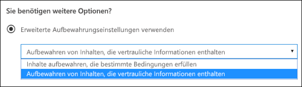
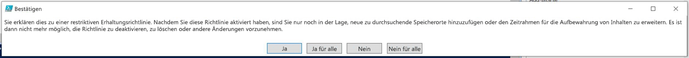

# <a name="create-and-configure-retention-policies"></a><span data-ttu-id="e8a03-103">Erstellen und Konfigurieren von Aufbewahrungsrichtlinien</span><span class="sxs-lookup"><span data-stu-id="e8a03-103">Create and configure retention policies</span></span>

><span data-ttu-id="e8a03-104">*[Microsoft 365-Lizenzierungsleitfaden für Sicherheit und Compliance](https://aka.ms/ComplianceSD).*</span><span class="sxs-lookup"><span data-stu-id="e8a03-104">*[Microsoft 365 licensing guidance for security & compliance](https://aka.ms/ComplianceSD).*</span></span>

<span data-ttu-id="e8a03-105">Mithilfe einer Aufbewahrungsrichtlinie können Sie proaktiv entscheiden, ob Inhalte aufbewahrt, gelöscht oder beides, also aufbewahrt und dann gelöscht werden sollen.</span><span class="sxs-lookup"><span data-stu-id="e8a03-105">Use a retention policy to decide proactively whether to retain content, delete content, or both - retain and then delete the content.</span></span> 

<span data-ttu-id="e8a03-106">Mit einer Aufbewahrungsrichtlinie können Sie dies sehr effizient erledigen, indem Sie identische Aufbewahrungseinstellungen für Inhalte nach Speicherort, auf Website- oder Postfachebene zuweisen.</span><span class="sxs-lookup"><span data-stu-id="e8a03-106">A retention policy lets you do this very efficiently by assigning the same retention settings for content by location, at a site or mailbox level.</span></span> <span data-ttu-id="e8a03-107">Wenn Sie nicht sicher sind, ob Sie eine Aufbewahrungsrichtlinie oder eine Aufbewahrungsbezeichnung verwenden, lesen Sie [Aufbewahrungsrichtlinien und Aufbewahrungsbeschriftungen](retention.md#retention-policies-and-retention-labels).</span><span class="sxs-lookup"><span data-stu-id="e8a03-107">If you're not sure whether to use a retention policy or a retention label, see [Retention policies and retention labels](retention.md#retention-policies-and-retention-labels).</span></span>

<span data-ttu-id="e8a03-108">Näheres über Aufbewahrungsrichtlinien und wie sie funktionieren erfahren Sie unter [Informationen zu Aufbewahrungsrichtlinien](retention.md).</span><span class="sxs-lookup"><span data-stu-id="e8a03-108">For more information about retention policies and how retention works, see [Learn about retention](retention.md).</span></span>

## <a name="before-you-begin"></a><span data-ttu-id="e8a03-109">Bevor Sie beginnen</span><span class="sxs-lookup"><span data-stu-id="e8a03-109">Before you begin</span></span>

<span data-ttu-id="e8a03-110">Der globale Administrator Ihrer Organisation verfügt über umfassende Berechtigungen zum Erstellen und Bearbeiten von Aufbewahrungsrichtlinien.</span><span class="sxs-lookup"><span data-stu-id="e8a03-110">The global admin for your organization has full permissions to create and edit retention policies.</span></span> <span data-ttu-id="e8a03-111">Wenn Sie sich nicht als globaler Administrator anmelden, lesen Sie [Notwendige Berechtigungen zum Erstellen und Verwalten von Aufbewahrungsrichtlinien und Aufbewahrungsbezeichnungen](get-started-with-retention.md#permissions-required-to-create-and-manage-retention-policies-and-retention-labels).</span><span class="sxs-lookup"><span data-stu-id="e8a03-111">If you aren't signing in as a global admin, see [Permissions required to create and manage retention policies and retention labels](get-started-with-retention.md#permissions-required-to-create-and-manage-retention-policies-and-retention-labels).</span></span>

## <a name="create-and-configure-a-retention-policy"></a><span data-ttu-id="e8a03-112">Erstellen und Konfigurieren einer Aufbewahrungsrichtlinie</span><span class="sxs-lookup"><span data-stu-id="e8a03-112">Create and configure a retention policy</span></span>

<span data-ttu-id="e8a03-113">Obwohl eine Aufbewahrungsrichtlinie mehrere Speicherorte unterstützt, können Sie keine einzelne Aufbewahrungsrichtlinie erstellen, die alle unterstützten Speicherorte umfasst:</span><span class="sxs-lookup"><span data-stu-id="e8a03-113">Although a retention policy can support multiple locations, you can't create a single retention policy that includes all the supported locations:</span></span>
- <span data-ttu-id="e8a03-114">Exchange-E-Mail</span><span class="sxs-lookup"><span data-stu-id="e8a03-114">Exchange email</span></span>
- <span data-ttu-id="e8a03-115">SharePoint-Website</span><span class="sxs-lookup"><span data-stu-id="e8a03-115">SharePoint site</span></span>
- <span data-ttu-id="e8a03-116">OneDrive-Konten</span><span class="sxs-lookup"><span data-stu-id="e8a03-116">OneDrive accounts</span></span>
- <span data-ttu-id="e8a03-117">Microsoft 365-Gruppen</span><span class="sxs-lookup"><span data-stu-id="e8a03-117">Microsoft 365 groups</span></span>
- <span data-ttu-id="e8a03-118">Skype for Business</span><span class="sxs-lookup"><span data-stu-id="e8a03-118">Skype for Business</span></span>
- <span data-ttu-id="e8a03-119">Öffentliche Exchange-Ordner</span><span class="sxs-lookup"><span data-stu-id="e8a03-119">Exchange public folders</span></span>
- <span data-ttu-id="e8a03-120">Teams-Kanalnachrichten</span><span class="sxs-lookup"><span data-stu-id="e8a03-120">Teams channel messages</span></span>
- <span data-ttu-id="e8a03-121">Teams-Chats</span><span class="sxs-lookup"><span data-stu-id="e8a03-121">Teams chats</span></span>

<span data-ttu-id="e8a03-122">Wenn Sie beim Erstellen einer Aufbewahrungsrichtlinie einen der Teams-Speicherorte auswählen, werden die anderen Speicherorte automatisch ausgeschlossen.</span><span class="sxs-lookup"><span data-stu-id="e8a03-122">When you select either of the Teams locations when you create a retention policy, the other locations are automatically excluded.</span></span> <span data-ttu-id="e8a03-123">Die folgenden Anweisungen sind daher davon abhängig, ob Sie die Teams-Speicherorte einschließen müssen:</span><span class="sxs-lookup"><span data-stu-id="e8a03-123">Therefore, the instructions to follow depend on whether you need to include the Teams locations:</span></span>

- [<span data-ttu-id="e8a03-124">Anweisungen für eine Aufbewahrungsrichtlinie für Teams-Speicherorte</span><span class="sxs-lookup"><span data-stu-id="e8a03-124">Instructions for a retention policy for Teams locations</span></span>](#retention-policy-for-teams-locations)
- [<span data-ttu-id="e8a03-125">Anweisungen für eine Aufbewahrungsrichtlinie für andere Speicherorte als Teams</span><span class="sxs-lookup"><span data-stu-id="e8a03-125">Instructions for a retention policy for locations other than Teams</span></span>](#retention-policy-for-locations-other-than-teams)

<span data-ttu-id="e8a03-126">Wenn Sie über mehr als eine Aufbewahrungsrichtlinie verfügen und außerdem Aufbewahrungsbezeichnungen verwenden, lesen Sie [Grundsätze der Aufbewahrung, oder was hat Vorrang?](retention.md#the-principles-of-retention-or-what-takes-precedence), um das Ergebnis zu verstehen, wenn mehrere Aufbewahrungseinstellungen für dieselben Inhalte gelten.</span><span class="sxs-lookup"><span data-stu-id="e8a03-126">When you have more than one retention policy, and when you also use retention labels, see [The principles of retention, or what takes precedence?](retention.md#the-principles-of-retention-or-what-takes-precedence) to understand the outcome when multiple retention settings apply to the same content.</span></span>

### <a name="retention-policy-for-teams-locations"></a><span data-ttu-id="e8a03-127">Aufbewahrungsrichtlinie für Teams-Speicherorte</span><span class="sxs-lookup"><span data-stu-id="e8a03-127">Retention policy for Teams locations</span></span>

1. <span data-ttu-id="e8a03-128">Wählen Sie im [Microsoft 365 Compliance Center](https://compliance.microsoft.com/) die Option **Richtlinien** > **Aufbewahrung** aus.</span><span class="sxs-lookup"><span data-stu-id="e8a03-128">From the [Microsoft 365 compliance center](https://compliance.microsoft.com/), select **Policies** > **Retention**.</span></span>

2. <span data-ttu-id="e8a03-129">Wählen Sie **Neue Aufbewahrungsrichtlinie**, um eine neue Aufbewahrungsrichtlinie zu erstellen.</span><span class="sxs-lookup"><span data-stu-id="e8a03-129">Select **New retention policy** to create a new retention policy.</span></span>

3. <span data-ttu-id="e8a03-130">Geben Sie auf der Assistentenseite **Entscheiden, ob Inhalte beibehalten werden, gelöscht werden oder beides** die Konfigurationsoptionen für das Beibehalten und Löschen von Inhalten an.</span><span class="sxs-lookup"><span data-stu-id="e8a03-130">For **Decide if you want to retain content, delete it, or both** page of the wizard, specify the configuration options for retaining and deleting content.</span></span> 
    
    <span data-ttu-id="e8a03-131">Sie können eine Aufbewahrungsrichtlinie erstellen, die Inhalte nur aufbewahrt, ohne sie zu löschen, die sie aufbewahrt und nach einem festgelegten Zeitraum löscht, oder Inhalte nur nach einem bestimmten Zeitraum löscht.</span><span class="sxs-lookup"><span data-stu-id="e8a03-131">You can create a retention policy that just retains content without deleting, retains and then deletes after a specified period of time, or just deletes content after a specified period of time.</span></span> <span data-ttu-id="e8a03-132">Weitere Informationen finden Sie unter [Einstellungen für die Aufbewahrung und Löschung von Inhalten](#settings-for-retaining-and-deleting-content) auf dieser Seite.</span><span class="sxs-lookup"><span data-stu-id="e8a03-132">For more information, see [Settings for retaining and deleting content](#settings-for-retaining-and-deleting-content) on this page.</span></span>
    
    <span data-ttu-id="e8a03-133">Wählen Sie nicht **Erweiterte Aufbewahrungseinstellungen verwenden** aus, da diese Option nicht für Teams-Speicherorte unterstützt wird.</span><span class="sxs-lookup"><span data-stu-id="e8a03-133">Do not select **Use advanced retention settings** because this option isn't supported for Teams locations.</span></span> 

4. <span data-ttu-id="e8a03-134">Wählen Sie auf der Seite **Speicherorte auswählen** **Bestimmte Speicherorte auswählen** aus.</span><span class="sxs-lookup"><span data-stu-id="e8a03-134">For the **Choose locations** page, select **Let me choose specific locations**.</span></span> <span data-ttu-id="e8a03-135">Aktivieren Sie dann eine oder beide Speicherorte für Teams: **Teams-Kanalnachrichten** und **Teams-Chats**.</span><span class="sxs-lookup"><span data-stu-id="e8a03-135">Then toggle on one or both of the locations for Teams: **Teams channel message** and **Teams chats**.</span></span>
     
    <span data-ttu-id="e8a03-136">Bei **Teams-Kanalnachrichten** sind Nachrichten von Standardkanälen, jedoch nicht von [privaten Kanälen](https://docs.microsoft.com/microsoftteams/private-channels) eingeschlossen.</span><span class="sxs-lookup"><span data-stu-id="e8a03-136">For **Teams channel messages**, message from standard channels but not [private channels](https://docs.microsoft.com/microsoftteams/private-channels) are included.</span></span> <span data-ttu-id="e8a03-137">Zurzeit werden private Kanäle von Aufbewahrungsrichtlinien nicht unterstützt.</span><span class="sxs-lookup"><span data-stu-id="e8a03-137">Currently, private channels aren't supported by retention policies.</span></span>
    
    <span data-ttu-id="e8a03-138">Standardmäßig sind alle Teams ausgewählt. Sie können dies jedoch verfeinern, indem Sie angeben, welche Teams eingeschlossen oder ausgeschlossen werden.</span><span class="sxs-lookup"><span data-stu-id="e8a03-138">By default, all teams are selected, but you can refine this by specifying teams to be included, or teams to be excluded.</span></span>

5. <span data-ttu-id="e8a03-139">Schließen Sie den Assistenten ab, damit Ihre Einstellungen gespeichert werden.</span><span class="sxs-lookup"><span data-stu-id="e8a03-139">Complete the wizard to save your settings.</span></span>

<span data-ttu-id="e8a03-140">Weitere Informationen zu Aufbewahrungsrichtlinien für Teams finden Sie unter [Aufbewahrungsrichtlinien in Microsoft Teams](https://docs.microsoft.com/microsoftteams/retention-policies) in der Teams-Dokumentation.</span><span class="sxs-lookup"><span data-stu-id="e8a03-140">For more information about retention policies for Teams, see [Retention policies in Microsoft Teams](https://docs.microsoft.com/microsoftteams/retention-policies) from the Teams documentation.</span></span>

#### <a name="additional-retention-policy-needed-to-support-teams"></a><span data-ttu-id="e8a03-141">Weitere für die Unterstützung von Teams benötigte Aufbewahrungsrichtlinie</span><span class="sxs-lookup"><span data-stu-id="e8a03-141">Additional retention policy needed to support Teams</span></span>

<span data-ttu-id="e8a03-142">Teams bietet mehr als nur Chats und Kanalnachrichten.</span><span class="sxs-lookup"><span data-stu-id="e8a03-142">Teams is more than just chats and channel messages.</span></span> <span data-ttu-id="e8a03-143">Wenn Sie Teams verwenden, die aus einer Microsoft 365-Gruppe (früher Office 365-Gruppe) erstellt wurden, sollten Sie zusätzlich eine Aufbewahrungsrichtlinie konfigurieren, die diese Microsoft 365-Gruppe einschließt, indem Sie den Speicherort **Office 365-Gruppen** verwenden.</span><span class="sxs-lookup"><span data-stu-id="e8a03-143">If you have teams that were created from a Microsoft 365 group (formerly Office 365 group), you should additionally configure a retention policy that includes that Microsoft 365 group by using the **Office 365 groups** location.</span></span> <span data-ttu-id="e8a03-144">Diese Aufbewahrungsrichtlinie gilt für Inhalte in Postfach, Website und Dateien der Gruppe.</span><span class="sxs-lookup"><span data-stu-id="e8a03-144">This retention policy applies to content in the group's mailbox, site, and files.</span></span>

<span data-ttu-id="e8a03-145">Wenn Sie Teamwebsites haben, die mit keiner Microsoft 365-Gruppe verbunden sind, benötigen Sie eine Aufbewahrungsrichtlinie, die die Speicherorte **SharePoint-Websites** oder **OneDrive-Konten** einschließt, um Dateien in Teams aufzubewahren und zu löschen:</span><span class="sxs-lookup"><span data-stu-id="e8a03-145">If you have team sites that aren't connected to a Microsoft 365 group, you need a retention policy that includes the **SharePoint sites** or **OneDrive accounts** locations to retain and delete files in Teams:</span></span>

- <span data-ttu-id="e8a03-146">In einem Chat freigegebene Dateien werden im OneDrive-Konto des Benutzers gespeichert, der sie freigegeben hat.</span><span class="sxs-lookup"><span data-stu-id="e8a03-146">Files that are shared in chat are stored in the OneDrive account of the user who shared the file.</span></span> 

- <span data-ttu-id="e8a03-147">In Kanäle hochgeladene Dateien werden auf der SharePoint-Website für das Team gespeichert.</span><span class="sxs-lookup"><span data-stu-id="e8a03-147">Files that are uploaded to channels are stored in the SharePoint site for the team.</span></span>

> [!TIP]
> <span data-ttu-id="e8a03-148">Sie können eine Aufbewahrungsrichtlinie nur auf die Dateien eines bestimmten Teams anwenden, wenn dieses mit keiner Microsoft 365-Gruppe verbunden ist, indem Sie die SharePoint-Website für das Team und die OneDrive-Konten der Benutzer im Team auswählen.</span><span class="sxs-lookup"><span data-stu-id="e8a03-148">You can apply a retention policy to the files of just a specific team when it's not connected to a Microsoft 365 group by selecting the SharePoint site for the team, and the OneDrive accounts of users in the Team.</span></span>

<span data-ttu-id="e8a03-149">Es kann vorkommen, dass eine Aufbewahrungsrichtlinie, die auf Microsoft 365-Gruppen, SharePoint-Websites oder OneDrive-Konten angewendet wird, eine Datei löscht, die in einer Teams Chat- oder Kanalnachricht erwähnt wird, bevor diese Nachrichten gelöscht werden.</span><span class="sxs-lookup"><span data-stu-id="e8a03-149">It's possible that a retention policy that's applied to Microsoft 365 groups, SharePoint sites, or OneDrive accounts could delete a file that's referenced in a Teams chat or channel message before those messages get deleted.</span></span> <span data-ttu-id="e8a03-150">In diesem Szenario wird die Datei in der Microsoft Teams-Nachricht weiterhin angezeigt, aber wenn Benutzer die Datei auswählen, wird der Fehler "Datei nicht gefunden" angezeigt.</span><span class="sxs-lookup"><span data-stu-id="e8a03-150">In this scenario, the file still displays in the Teams message, but when users select the file, they get a "File not found" error.</span></span> <span data-ttu-id="e8a03-151">Dieses Verhalten gilt nicht für Aufbewahrungsrichtlinien. Dies kann auch passieren, wenn ein Benutzer eine Datei aus SharePoint oder OneDrive manuell löscht.</span><span class="sxs-lookup"><span data-stu-id="e8a03-151">This behavior isn't specific to retention policies and could also happen if a user manually deletes a file from SharePoint or OneDrive.</span></span>


### <a name="retention-policy-for-locations-other-than-teams"></a><span data-ttu-id="e8a03-152">Aufbewahrungsrichtlinie für andere Speicherorte als Teams</span><span class="sxs-lookup"><span data-stu-id="e8a03-152">Retention policy for locations other than Teams</span></span>

1. <span data-ttu-id="e8a03-153">Wählen Sie im [Microsoft 365 Compliance Center](https://compliance.microsoft.com/) die Option **Richtlinien** > **Aufbewahrung** aus.</span><span class="sxs-lookup"><span data-stu-id="e8a03-153">From the [Microsoft 365 compliance center](https://compliance.microsoft.com/), select **Policies** > **Retention**.</span></span>

2. <span data-ttu-id="e8a03-154">Wählen Sie **Neue Aufbewahrungsrichtlinie**, um eine neue Aufbewahrungsrichtlinie zu erstellen.</span><span class="sxs-lookup"><span data-stu-id="e8a03-154">Select **New retention policy** to create a new retention policy.</span></span>

3. <span data-ttu-id="e8a03-155">Geben Sie auf der Assistentenseite **Entscheiden, ob Inhalte beibehalten werden, gelöscht werden oder beides** die Konfigurationsoptionen für das Beibehalten und Löschen von Inhalten an.</span><span class="sxs-lookup"><span data-stu-id="e8a03-155">For **Decide if you want to retain content, delete it, or both** page of the wizard, specify the configuration options for retaining and deleting content.</span></span> 
    
    <span data-ttu-id="e8a03-156">Sie können eine Aufbewahrungsrichtlinie erstellen, die Inhalte nur aufbewahrt, ohne sie zu löschen, die sie aufbewahrt und nach einem festgelegten Zeitraum löscht, oder Inhalte nur nach einem bestimmten Zeitraum löscht.</span><span class="sxs-lookup"><span data-stu-id="e8a03-156">You can create a retention policy that just retains content without deleting, retains and then deletes after a specified period of time, or just deletes content after a specified period of time.</span></span> <span data-ttu-id="e8a03-157">Weitere Informationen finden Sie unter [Einstellungen für die Aufbewahrung und Löschung von Inhalten](#settings-for-retaining-and-deleting-content) auf dieser Seite.</span><span class="sxs-lookup"><span data-stu-id="e8a03-157">For more information, see [Settings for retaining and deleting content](#settings-for-retaining-and-deleting-content) on this page.</span></span>
    
    <span data-ttu-id="e8a03-158">Wählen Sie dann aus, ob die Aufbewahrungsrichtlinie auf alle Inhalte oder nur auf solche angewendet werden soll, die bestimmte Bedingungen erfüllen.</span><span class="sxs-lookup"><span data-stu-id="e8a03-158">Then, decide whether the retention policy should apply to all content, or content that meets specific conditions.</span></span> <span data-ttu-id="e8a03-159">Weitere Informationen zu diesen erweiterten Aufbewahrungseinstellungen finden Sie unter [Erweiterte Einstellungen zum Ermitteln von Inhalten, die bestimmte Bedingungen erfüllen](#advanced-settings-to-identify-content-that-meets-specific-conditions) auf dieser Seite.</span><span class="sxs-lookup"><span data-stu-id="e8a03-159">For more information about these advanced retention settings, see [Advanced settings to identify content that meets specific conditions](#advanced-settings-to-identify-content-that-meets-specific-conditions) on this page.</span></span> 

4. <span data-ttu-id="e8a03-160">Wählen Sie auf der Seite **Speicherorte wählen** aus, ob die Aufbewahrungsrichtlinie auf alle unterstützten Speicherorte in Ihrer Organisation angewendet werden soll, oder ob Sie die Speicherorte angeben möchten.</span><span class="sxs-lookup"><span data-stu-id="e8a03-160">For the **Choose locations** page, select whether the retention policy should apply to all supported locations across your organization, or you want to specify the locations.</span></span> <span data-ttu-id="e8a03-161">Wenn Sie bestimmte Speicherorte auswählen, können Sie auch angeben, welche eingeschlossen und welche ausgeschlossen werden sollen.</span><span class="sxs-lookup"><span data-stu-id="e8a03-161">If you choose specific locations, you can also specify includes and excludes.</span></span> 
    
    <span data-ttu-id="e8a03-162">Weitere Informationen zur Wahl zwischen einer Aufbewahrungsrichtlinie für die gesamte Organisation oder für bestimmte Speicherorte finden Sie unter [Anwenden einer Aufbewahrungsrichtlinie auf eine gesamte Organisation oder bestimmte Speicherorte](#applying-a-retention-policy-to-an-entire-organization-or-specific-locations) auf dieser Seite.</span><span class="sxs-lookup"><span data-stu-id="e8a03-162">For more information about choosing between a retention policy for the organization or for specific locations, see [Applying a retention policy to an entire organization or specific locations](#applying-a-retention-policy-to-an-entire-organization-or-specific-locations) on this page.</span></span>
    
    <span data-ttu-id="e8a03-163">Spezifische Informationen zu Speicherorten:</span><span class="sxs-lookup"><span data-stu-id="e8a03-163">Information specific to locations:</span></span>
    - [<span data-ttu-id="e8a03-164">Exchange-E-Mail und öffentliche Exchange-Ordner</span><span class="sxs-lookup"><span data-stu-id="e8a03-164">Exchange email and Exchange public folders</span></span>](#configuration-information-for-exchange-email-and-exchange-public-folders)
    - [<span data-ttu-id="e8a03-165">SharePoint-Websites und OneDrive-Konten</span><span class="sxs-lookup"><span data-stu-id="e8a03-165">SharePoint sites and OneDrive accounts</span></span>](#configuration-information-for-sharepoint-sites-and-onedrive-accounts)
    - [<span data-ttu-id="e8a03-166">Office 365-Gruppen</span><span class="sxs-lookup"><span data-stu-id="e8a03-166">Office 365 groups</span></span>](#configuration-information-for-microsoft-365-groups)
    - [<span data-ttu-id="e8a03-167">Skype for Business</span><span class="sxs-lookup"><span data-stu-id="e8a03-167">Skype for Business</span></span>](#configuration-information-for-skype-for-business)

5. <span data-ttu-id="e8a03-168">Schließen Sie den Assistenten ab, damit Ihre Einstellungen gespeichert werden.</span><span class="sxs-lookup"><span data-stu-id="e8a03-168">Complete the wizard to save your settings.</span></span>


#### <a name="configuration-information-for-exchange-email-and-exchange-public-folders"></a><span data-ttu-id="e8a03-169">Konfigurationsinformationen für Exchange-E-Mail und öffentliche Exchange-Ordner</span><span class="sxs-lookup"><span data-stu-id="e8a03-169">Configuration information for Exchange email and Exchange public folders</span></span>

<span data-ttu-id="e8a03-170">Der Speicherort von **Exchange-E-Mail** unterstützt die Aufbewahrung von E-Mail-, Kalender- und anderen Postfachelementen der Benutzer, indem die Aufbewahrungseinstellungen auf Postfachebene angewendet werden.</span><span class="sxs-lookup"><span data-stu-id="e8a03-170">The **Exchange email** location supports retention for users' email, calendar, and other mailbox items, by applying retention settings at the level of a mailbox.</span></span>

<span data-ttu-id="e8a03-171">Folgende E-Mail-Elemente werden einbezogen: E-Mail-Nachrichten (einschließlich Entwürfe) mit beliebigen Anlagen, Aufgaben und Kalendereinträge, wenn sie ein Enddatum haben, sowie Notizen.</span><span class="sxs-lookup"><span data-stu-id="e8a03-171">The following mail items are included: Mail messages (includes drafts) with any attachments, tasks and calendar items when they have an end date, and notes.</span></span> <span data-ttu-id="e8a03-172">Kontakte und alle Aufgaben und Kalenderelemente, die kein Enddatum aufweisen, werden nicht einbezogen.</span><span class="sxs-lookup"><span data-stu-id="e8a03-172">Contacts, and any tasks and calendar items that don't have an end date are not included.</span></span> <span data-ttu-id="e8a03-173">Andere in einem Postfach gespeicherte Elemente, z. B. gespeicherte Skype- und Teams-Nachrichten, werden mit diesem Speicherort nicht einbezogen.</span><span class="sxs-lookup"><span data-stu-id="e8a03-173">Other items stored in a mailbox, such as Skype and Teams saved messages, aren't included with this location.</span></span> <span data-ttu-id="e8a03-174">Diese Elemente haben eigene Aufbewahrungsorte.</span><span class="sxs-lookup"><span data-stu-id="e8a03-174">These items have their own retention locations.</span></span>

<span data-ttu-id="e8a03-175">Obwohl eine Microsoft 365-Gruppe über ein Exchange-Postfach verfügt, bezieht eine Aufbewahrungsrichtlinie, die den gesamten **Exchange-E-Mail-Speicherort** umfasst, keine Inhalte in Microsoft 365-Gruppenpostfächern mit ein.</span><span class="sxs-lookup"><span data-stu-id="e8a03-175">Even though a Microsoft 365 group has an Exchange mailbox, a retention policy that includes the entire **Exchange email** location won't include content in Microsoft 365 group mailboxes.</span></span> <span data-ttu-id="e8a03-176">Wenn Sie Inhalte in diesen Postfächern beibehalten möchten, wählen Sie den **Office 365-Gruppen**-Speicherort aus.</span><span class="sxs-lookup"><span data-stu-id="e8a03-176">To retain content in these mailboxes, select the **Office 365 groups** location.</span></span>

<span data-ttu-id="e8a03-177">Der Speicherort von **öffentlichen Exchange-Ordnern** wendet die Aufbewahrungseinstellungen auf alle öffentlichen Ordner an und kann nicht auf der Ordner- oder Postfachebene angewendet werden.</span><span class="sxs-lookup"><span data-stu-id="e8a03-177">The **Exchange public folders** location applies retention settings to all public folders and can't be applied at the folder or mailbox level.</span></span>

#### <a name="configuration-information-for-sharepoint-sites-and-onedrive-accounts"></a><span data-ttu-id="e8a03-178">Konfigurationsinformationen für SharePoint-Websites und OneDrive-Konten</span><span class="sxs-lookup"><span data-stu-id="e8a03-178">Configuration information for SharePoint sites and OneDrive accounts</span></span>

<span data-ttu-id="e8a03-179">Wenn Sie den Speicherort Ihrer **SharePoint-Websites** auswählen, kann Ihre Aufbewahrungsrichtlinie Inhalte auf SharePoint-Kommunikationswebsites, auf Teamwebsites, die nicht über Office 365-Gruppen verbunden sind, und auf klassischen Websites beibehalten und löschen.</span><span class="sxs-lookup"><span data-stu-id="e8a03-179">When you choose the **SharePoint sites** location, the retention policy can retain and delete documents in SharePoint communication sites, team sites that aren't connected by Office 365 groups, and classic sites.</span></span> <span data-ttu-id="e8a03-180">Teamwebsites, die über Office 365-Gruppen verbunden sind, werden bei dieser Option nicht unterstützt. Verwenden Sie stattdessen die **Office 365-Gruppen**-Speicherorte, die sich auf das Postfach der Gruppe, deren Website und Dateien auswirken.</span><span class="sxs-lookup"><span data-stu-id="e8a03-180">Team sites connected by Office 365 groups aren't supported with this option and instead, use the **Office 365 groups** location that applies to content in the group's mailbox, site, and files.</span></span>

<span data-ttu-id="e8a03-181">Obwohl die Aufbewahrungsrichtlinie auf Websiteebene angewendet wird, werden Aufbewahrungseinstellungen nur auf Dokumente angewendet.</span><span class="sxs-lookup"><span data-stu-id="e8a03-181">Although the retention policy is applied at the site level, only documents have retention settings applied to them.</span></span> <span data-ttu-id="e8a03-182">Aufbewahrungseinstellungen gelten nicht für Organisationsstrukturen, die Bibliotheken, Listen und Ordner innerhalb der Website umfassen.</span><span class="sxs-lookup"><span data-stu-id="e8a03-182">Retention settings do not apply to the organizing structures that include libraries, lists, and folders within the site.</span></span> 

<span data-ttu-id="e8a03-183">Wenn Sie Ihre Speicherorte für SharePoint-Websites oder OneDrive-Konten angeben, benötigen Sie keine Berechtigungen für den Zugriff auf die Websites und es erfolgt keine Validierung, wenn Sie die URL auf der Seite **Speicherorte bearbeiten** angeben.</span><span class="sxs-lookup"><span data-stu-id="e8a03-183">When you specify your locations for SharePoint sites or OneDrive accounts, you don't need permissions to access the sites and no validation is done at the time you specify the URL on the **Edit locations** page.</span></span> <span data-ttu-id="e8a03-184">Die SharePoint-Websites müssen jedoch indiziert werden, und die von Ihnen angegebenen Websites werden vom Assistenten dahingehend überprüft, ob sie existieren.</span><span class="sxs-lookup"><span data-stu-id="e8a03-184">However, the SharePoint sites must be indexed and the sites that you specify are checked that they exist at the end of the wizard.</span></span>

<span data-ttu-id="e8a03-185">Wenn die Überprüfung fehlschlägt, wird eine Meldung angezeigt, die besagt, dass die Überprüfung für die eingegebene URL fehlgeschlagen ist. Der Assistent erstellt die Aufbewahrungsrichtlinie erst, wenn die Überprüfung erfolgreich war.</span><span class="sxs-lookup"><span data-stu-id="e8a03-185">If this check fails, you see a message that validation failed for the URL you entered, and the wizard won't create the retention policy until the validation check passes.</span></span> <span data-ttu-id="e8a03-186">Wenn diese Meldung angezeigt wird, wechseln Sie zurück in den Assistenten, um die URL zu ändern oder die Website aus der Aufbewahrungsrichtlinie zu entfernen.</span><span class="sxs-lookup"><span data-stu-id="e8a03-186">If you see this message, go back in the wizard to change the URL or remove the site from the retention policy.</span></span>

<span data-ttu-id="e8a03-187">Wenn Sie einzelne OneDrive-Konten angeben möchten, die ein- oder ausgeschlossen werden sollen, hat die URL das folgende Format: `https://<tenant name>-my.sharepoint.com/personal/<user_name>_<tenant name>_com`</span><span class="sxs-lookup"><span data-stu-id="e8a03-187">To specify individual OneDrive accounts to include or exclude, the URL has the following format: `https://<tenant name>-my.sharepoint.com/personal/<user_name>_<tenant name>_com`</span></span>

<span data-ttu-id="e8a03-188">Beispielsweise bei einem Benutzer im Mandanten „Contoso“, der den Benutzernamen „rsimone“ hat: `https://contoso-my.sharepoint.com/personal/rsimone_contoso_onmicrosoft_com`</span><span class="sxs-lookup"><span data-stu-id="e8a03-188">For example, for a user in the contoso tenant that has a user name of "rsimone": `https://contoso-my.sharepoint.com/personal/rsimone_contoso_onmicrosoft_com`</span></span>

<span data-ttu-id="e8a03-189">Informationen zum Überprüfen der Syntax für Ihren Mandanten und zum Identifizieren von URLs für Benutzer finden Sie unter [Abrufen einer Liste aller Benutzer OneDrive-URLs in Ihrer Organisation](https://docs.microsoft.com/onedrive/list-onedrive-urls).</span><span class="sxs-lookup"><span data-stu-id="e8a03-189">To verify the syntax for your tenant and identify URLs for users, see [Get a list of all user OneDrive URLs in your organization](https://docs.microsoft.com/onedrive/list-onedrive-urls).</span></span>

### <a name="configuration-information-for-microsoft-365-groups"></a><span data-ttu-id="e8a03-190">Konfigurationsinformationen für Microsoft 365-Gruppen</span><span class="sxs-lookup"><span data-stu-id="e8a03-190">Configuration information for Microsoft 365 groups</span></span>

<span data-ttu-id="e8a03-191">Wenn Sie Inhalte für eine Microsoft 365-Gruppe (vormals Office 365-Gruppe) aufbewahren oder löschen möchten, verwenden Sie den **Office 365-Gruppen**-Speicherort.</span><span class="sxs-lookup"><span data-stu-id="e8a03-191">To retain or delete content for a Microsoft 365 group (formerly Office 365 group), use the **Office 365 groups** location.</span></span> <span data-ttu-id="e8a03-192">Obwohl eine Microsoft 365-Gruppe über ein Exchange-Postfach verfügt, bezieht eine Aufbewahrungsrichtlinie, die den gesamten **Exchange-E-Mail-Speicherort** umfasst, keine Inhalte in Microsoft 365-Gruppenpostfächern mit ein.</span><span class="sxs-lookup"><span data-stu-id="e8a03-192">Even though a Microsoft 365 group has an Exchange mailbox, a retention policy that includes the entire **Exchange email** location won't include content in Microsoft 365 group mailboxes.</span></span> <span data-ttu-id="e8a03-193">Obwohl der **Exchange-E-Mail-Speicherort** zunächst die Angabe eines Gruppenpostfachs zum Einschließen oder Ausschließen zulässt, erhalten Sie beim Versuch, die Aufbewahrungsrichtlinie zu speichern, die Fehlermeldung, dass "RemoteGroupMailbox" keine gültige Auswahl für den Exchange-Speicherort ist.</span><span class="sxs-lookup"><span data-stu-id="e8a03-193">In addition, although the **Exchange email** location initially allows you to specify a group mailbox to be included or excluded, when you try to save the retention policy, you receive an error that "RemoteGroupMailbox" is not a valid selection for the Exchange location.</span></span>

<span data-ttu-id="e8a03-194">Eine auf eine Microsoft 365-Gruppe angewandte Aufbewahrungsrichtlinie umfasst das Gruppenpostfach und die Teams-Website, wenn eine Teams-Website bei der Erstellung der Gruppe ausgewählt oder später der Gruppe hinzugefügt wurde.</span><span class="sxs-lookup"><span data-stu-id="e8a03-194">A retention policy applied to a Microsoft 365 group includes the group mailbox and teams site, if a teams site was selected at the time the group was created or later added to the group.</span></span> <span data-ttu-id="e8a03-195">Dateien, die auf der Teams-Website gespeichert sind, werden mit diesem Standort abgedeckt. Nicht jedoch Teams-Chats oder Nachrichten im Teams-Channel, die ihre eigenen Standorte für Aufbewahrungsrichtlinien haben.</span><span class="sxs-lookup"><span data-stu-id="e8a03-195">Files stored in the teams site are covered with this location, but not Teams chats or Teams channel messages that have their own retention policy locations.</span></span>

### <a name="configuration-information-for-skype-for-business"></a><span data-ttu-id="e8a03-196">Konfigurationsinformationen für Skype for Business</span><span class="sxs-lookup"><span data-stu-id="e8a03-196">Configuration information for Skype for Business</span></span>

<span data-ttu-id="e8a03-197">Im Gegensatz zu Exchange-E-Mails kann der Status des Skype-Speicherorts nicht einfach aktiviert werden, um alle Benutzer einzuschließen. Wenn Sie diesen Speicherort jedoch aktivieren, können Sie anschließend manuell die Benutzer auswählen, deren Unterhaltungen Sie aufbewahren möchten:</span><span class="sxs-lookup"><span data-stu-id="e8a03-197">Unlike Exchange email, you can't toggle the status of the Skype location on to include all users, but when you turn on that location, you then manually choose the users whose conversations you want to retain:</span></span>


  
<span data-ttu-id="e8a03-199">Bei Auswahl von **Benutzer auswählen** können Sie schnell alle Benutzer hinzufügen, indem Sie in der Spaltenüberschrift das Feld **Name** auswählen.</span><span class="sxs-lookup"><span data-stu-id="e8a03-199">When you select **Choose users**, you can quickly include all users by selecting the **Name** box in the column header.</span></span> <span data-ttu-id="e8a03-200">Es ist jedoch wichtig zu wissen, dass jeder Benutzer als ein bestimmtes eingeschlossenes Element in der Richtlinie zählt.</span><span class="sxs-lookup"><span data-stu-id="e8a03-200">However, it's important to understand that each user counts as a specific inclusion in the policy.</span></span> <span data-ttu-id="e8a03-201">Wenn Sie also mehr als 1.000 Benutzer einschließen, gelten die im vorherigen Abschnitt angegebenen Grenzwerte.</span><span class="sxs-lookup"><span data-stu-id="e8a03-201">Therefore, if you include over 1,000 users, the limits noted in the previous section apply.</span></span> <span data-ttu-id="e8a03-202">Wenn hier alle Skype-Benutzer ausgewählt werden, entspricht dies nicht dem standardmäßigen Einschließen aller Skype-Benutzer mithilfe einer organisationsübergreifenden Richtlinie.</span><span class="sxs-lookup"><span data-stu-id="e8a03-202">Selecting all Skype users here is not the same as if an org-wide policy were able to include all Skype users by default.</span></span> 
  

  
<span data-ttu-id="e8a03-p121">Beachten Sie, dass **Aufgezeichnete Unterhaltungen**, ein Ordner in Outlook, ein Feature ist, das nichts mit Skype-Archivierung zu tun hat. **Aufgezeichnete Unterhaltungen** kann vom Endbenutzer deaktiviert werden, Archivierung für Skype erfolgt jedoch durch das Speichern einer Kopie von Skype-Verbindungen in einem ausgeblendeten Ordner, auf den der Benutzer nicht zugreifen kann, der aber für eDiscovery verfügbar ist.</span><span class="sxs-lookup"><span data-stu-id="e8a03-p121">Note that **Conversation History**, a folder in Outlook, is a feature that has nothing to do with Skype archiving. **Conversation History** can be turned off by the end user, but archiving for Skype is done by storing a copy of Skype conversations in a hidden folder that is inaccessible to the user but available to eDiscovery.</span></span>


## <a name="settings-for-retaining-and-deleting-content"></a><span data-ttu-id="e8a03-206">Einstellungen für die Aufbewahrung und Löschung von Inhalten</span><span class="sxs-lookup"><span data-stu-id="e8a03-206">Settings for retaining and deleting content</span></span>

<span data-ttu-id="e8a03-207">Wenn Sie die Einstellungen für die Aufbewahrung und Löschung von Inhalten in Ihrer Aufbewahrungsrichtlinie festlegen, wird für Ihre Aufbewahrungsrichtlinie eine der folgenden Konfigurationen für einen bestimmten Zeitraum gelten:</span><span class="sxs-lookup"><span data-stu-id="e8a03-207">By choosing the settings for retaining and deleting content in your retention policy, your retention policy will have one of the following configurations for a specified period of time:</span></span>

- <span data-ttu-id="e8a03-208">Nur aufbewahren</span><span class="sxs-lookup"><span data-stu-id="e8a03-208">Retain-only</span></span>
- <span data-ttu-id="e8a03-209">Aufbewahren und löschen</span><span class="sxs-lookup"><span data-stu-id="e8a03-209">Retain and then delete</span></span>
- <span data-ttu-id="e8a03-210">Nur löschen</span><span class="sxs-lookup"><span data-stu-id="e8a03-210">Delete-only</span></span>

### <a name="retaining-content-for-a-specific-period-of-time"></a><span data-ttu-id="e8a03-211">Aufbewahren von Inhalten für einen bestimmten Zeitraum</span><span class="sxs-lookup"><span data-stu-id="e8a03-211">Retaining content for a specific period of time</span></span>

<span data-ttu-id="e8a03-212">Beim Konfigurieren einer Aufbewahrungsrichtlinie können Sie festlegen, ob Inhalte zeitlich unbegrenzt oder für eine bestimmte Anzahl von Tagen, Monaten oder Jahren aufbewahrt werden sollen.</span><span class="sxs-lookup"><span data-stu-id="e8a03-212">When you configure a retention policy, you choose to retain content indefinitely or for a specific number of days, months, or years.</span></span> <span data-ttu-id="e8a03-213">Die Dauer der Aufbewahrung von Inhalten wird anhand des Alters der Inhalte und nicht anhand des Anwendungsdatums der Aufbewahrungsrichtlinie berechnet.</span><span class="sxs-lookup"><span data-stu-id="e8a03-213">The duration for how long content is retained is calculated from the age of the content, not from when the retention policy is applied.</span></span> <span data-ttu-id="e8a03-214">Sie können auswählen, ob das Alter auf dem Erstellungsdatum des Inhalts oder (bei OneDrive und SharePoint) auf dem Datum der letzten Änderung basiert.</span><span class="sxs-lookup"><span data-stu-id="e8a03-214">You can choose whether the age is based on when the content was created or (for OneDrive and SharePoint) when it was last modified.</span></span>

<span data-ttu-id="e8a03-215">Beispiele:</span><span class="sxs-lookup"><span data-stu-id="e8a03-215">Examples:</span></span>
  
- <span data-ttu-id="e8a03-216">SharePoint: Wenn Inhalte einer Websitesammlung sieben Jahre lang nach der letzten Änderung aufbewahrt werden sollen, und ein Dokument in dieser Websitesammlung seit sechs Jahren nicht geändert wurde, wird es nur noch ein weiteres Jahr aufbewahrt, sofern es in diesem Zeitraum nicht geändert wird.</span><span class="sxs-lookup"><span data-stu-id="e8a03-216">SharePoint: If you want to retain content in a site collection for seven years since it was last modified, and a document in that site collection hasn't been modified in six years, the document will be retained for only another year if it's not modified.</span></span> <span data-ttu-id="e8a03-217">Falls das Dokument wieder geändert wird, wird das Alter des Dokuments ab dem neuen Datum der letzten Änderung berechnet und weitere sieben Jahre lang aufbewahrt.</span><span class="sxs-lookup"><span data-stu-id="e8a03-217">If the document is edited again, the age of the document is calculated from the new last modified date, and it will be retained for another seven years.</span></span>
  
- <span data-ttu-id="e8a03-218">Exchange: Wenn Inhalte in einem Postfach für sieben Jahre aufbewahrt werden sollen und eine Nachricht vor sechs Jahren gesendet wurde, wird sie nur noch ein Jahr aufbewahrt.</span><span class="sxs-lookup"><span data-stu-id="e8a03-218">Exchange: If you want to retain content in a mailbox for seven years, and a message was sent six years ago, the message will be retained for only one year.</span></span> <span data-ttu-id="e8a03-219">Bei Exchange-Inhalten basiert das Alter auf dem Empfangsdatum für eingehende E-Mails oder dem Sendedatum für ausgehende E-Mails.</span><span class="sxs-lookup"><span data-stu-id="e8a03-219">For Exchange content, the age is based on the date received for incoming email, or the date sent for outgoing email.</span></span> <span data-ttu-id="e8a03-220">Die Aufbewahrung von Inhalten basierend auf der letzten Änderung gilt nur für Websiteinhalte in OneDrive und SharePoint.</span><span class="sxs-lookup"><span data-stu-id="e8a03-220">Retaining content based on when it was last modified applies only to site content in OneDrive and SharePoint.</span></span>
  
<span data-ttu-id="e8a03-221">Am Ende des Aufbewahrungszeitraums können Sie wählen, ob der Inhalt dauerhaft gelöscht werden soll:</span><span class="sxs-lookup"><span data-stu-id="e8a03-221">At the end of the retention period, you choose whether you want the content to be permanently deleted:</span></span>
  

  
### <a name="deleting-content-thats-older-than-a-specific-age"></a><span data-ttu-id="e8a03-223">Löschen von Inhalten, die ein bestimmtes Alter überschritten haben</span><span class="sxs-lookup"><span data-stu-id="e8a03-223">Deleting content that's older than a specific age</span></span>

<span data-ttu-id="e8a03-224">Eine Aufbewahrungsrichtlinie kann Inhalte sowohl aufbewahren und dann löschen, oder alte Inhalte löschen, ohne sie aufzubewahren.</span><span class="sxs-lookup"><span data-stu-id="e8a03-224">A retention policy can both retain and then delete content, or delete old content without retaining it.</span></span>
  
<span data-ttu-id="e8a03-225">Wenn Ihre Aufbewahrungsrichtlinie Inhalte löscht, ist es wichtig, zu wissen, dass der für eine Aufbewahrungsrichtlinie festgelegte Zeitraum jedes Mal berechnet wird, wenn der betreffende Inhalt erstellt oder geändert wird.</span><span class="sxs-lookup"><span data-stu-id="e8a03-225">If your retention policy deletes content, it's important to understand that the time period specified for a retention policy is calculated from the time when the content was created or modified, not the time since the policy was assigned.</span></span>
  

  
<span data-ttu-id="e8a03-227">Nehmen Sie beispielsweise an, dass Sie eine Aufbewahrungsrichtlinie erstellen, mit der Inhalte nach drei Jahren gelöscht werden. Dann weisen Sie diese Richtlinie allen OneDrive-Konten zu, die viele Inhalte enthalten, die vor vier oder fünf Jahren erstellt wurden.</span><span class="sxs-lookup"><span data-stu-id="e8a03-227">For example, suppose that you create a retention policy that deletes content after three years, and then assign that policy to all OneDrive accounts, which contain a lot of content that was created four or five years ago.</span></span> <span data-ttu-id="e8a03-228">In diesem Fall werden viele Inhalte unmittelbar nach dem ersten Zuweisen der Aufbewahrungsrichtlinie gelöscht.</span><span class="sxs-lookup"><span data-stu-id="e8a03-228">In this case, a lot of content will be deleted soon after assigning the retention policy for the first time.</span></span> <span data-ttu-id="e8a03-229">Deshalb ist es wichtig zu wissen, dass eine Aufbewahrungsrichtlinie, mit der Inhalte gelöscht werden, eine erhebliche Auswirkung auf Ihre Inhalte haben kann.</span><span class="sxs-lookup"><span data-stu-id="e8a03-229">For this reason, it's important to understand that a retention policy that deletes content can have a considerable impact on your content.</span></span> 
  
<span data-ttu-id="e8a03-p126">Daher sollten Sie vor dem erstmaligen Zuweisen einer Richtlinie zu einer Websitesammlung zunächst das Alter des vorhandenen Inhalts und die möglichen Auswirkungen der Richtlinie auf diesen Inhalt bedenken. Sie können außerdem vor dem Zuweisen die Benutzer über die neue Richtlinie informieren, um ihnen Zeit zur Auswertung der möglichen Auswirkungen zu geben. Beachten Sie, dass folgende Warnung erscheint, wenn Sie die Einstellungen für Ihre Aufbewahrungsrichtlinie prüfen, bevor Sie sie erstellen.</span><span class="sxs-lookup"><span data-stu-id="e8a03-p126">Therefore, before you assign a retention policy to a site collection for the first time, you should first consider the age of the existing content and how the policy may impact that content. You may also want to communicate the new policy to your users before assigning it, to give them time to assess the possible impact. Note this warning that appears when you review the settings for your retention policy just before creating it.</span></span>
  

  
## <a name="advanced-settings-to-identify-content-that-meets-specific-conditions"></a><span data-ttu-id="e8a03-234">Erweiterte Einstellungen zum Ermitteln von Inhalten, die bestimmte Bedingungen erfüllen</span><span class="sxs-lookup"><span data-stu-id="e8a03-234">Advanced settings to identify content that meets specific conditions</span></span>

<span data-ttu-id="e8a03-235">Eine Aufbewahrungsrichtlinie kann für alle Inhalte an den von ihr abgedeckten Speicherorten gelten, oder Sie können auswählen, eine Aufbewahrungsrichtlinie nur auf Inhalte anzuwenden, die bestimmte Stichwörter oder [bestimmte Arten von vertraulichen Informationen](what-the-sensitive-information-types-look-for.md) enthalten.</span><span class="sxs-lookup"><span data-stu-id="e8a03-235">A retention policy can apply to all content in the locations that it includes, or you can choose to apply a retention policy only to content that contains specific keywords or [specific types of sensitive information](what-the-sensitive-information-types-look-for.md).</span></span>
  

  
### <a name="identify-content-that-contains-specific-keywords"></a><span data-ttu-id="e8a03-237">Ermitteln von Inhalten, die bestimmte Stichwörter enthalten</span><span class="sxs-lookup"><span data-stu-id="e8a03-237">Identify content that contains specific keywords</span></span>

<span data-ttu-id="e8a03-238">Sie können eine Aufbewahrungsrichtlinie auch nur auf Inhalte anwenden, die bestimmte Bedingungen erfüllen, und dann Aufbewahrungsaktionen nur für diese Inhalte festlegen.</span><span class="sxs-lookup"><span data-stu-id="e8a03-238">You can apply a retention policy only to content that meets specific conditions, and then take retention actions on just that content.</span></span> <span data-ttu-id="e8a03-239">Zu den verfügbaren Bedingungen zählt das Anwenden einer Aufbewahrungsrichtlinie auf Inhalte, die bestimmte Wörter oder Ausdrücke enthalten.</span><span class="sxs-lookup"><span data-stu-id="e8a03-239">The conditions available support applying a retention policy to content that contains specific words or phrases.</span></span> <span data-ttu-id="e8a03-240">Sie können Ihre Abfrage mithilfe von Suchoperatoren wie UND, ODER und NICHT verfeinern.</span><span class="sxs-lookup"><span data-stu-id="e8a03-240">You can refine your query by using search operators like AND, OR, and NOT.</span></span> <span data-ttu-id="e8a03-241">Weitere Informationen zu diesen Operatoren finden Sie unter [Stichwortabfragen und Suchbedingungen für Inhaltssuchen](keyword-queries-and-search-conditions.md).</span><span class="sxs-lookup"><span data-stu-id="e8a03-241">For more information about these operators, see [Keyword queries and search conditions for Content Search](keyword-queries-and-search-conditions.md).</span></span>

<span data-ttu-id="e8a03-242">Die abfragebasierte Aufbewahrung verwendet den Suchindex, um Inhalte zu identifizieren.</span><span class="sxs-lookup"><span data-stu-id="e8a03-242">Query-based retention uses the search index to identify content.</span></span>
  

  
### <a name="identify-content-that-contains-sensitive-information"></a><span data-ttu-id="e8a03-244">Ermitteln von Inhalten, die vertrauliche Informationen enthalten</span><span class="sxs-lookup"><span data-stu-id="e8a03-244">Identify content that contains sensitive information</span></span>

<span data-ttu-id="e8a03-p128">Sie können eine Aufbewahrungsrichtlinie auch nur auf Inhalte anwenden, die [bestimmte Arten von vertraulichen Informationen](what-the-sensitive-information-types-look-for.md) enthalten. Sie können z. B. eindeutige Aufbewahrungsanforderungen nur auf Inhalte, die personenbezogene Informationen wie Kennungsnummern für Steuerzahler, Sozialversicherungsnummern oder Reisepassnummern enthalten, anwenden.</span><span class="sxs-lookup"><span data-stu-id="e8a03-p128">You can also apply a retention policy only to content that contains [specific types of sensitive information](what-the-sensitive-information-types-look-for.md). For example, you can choose to apply unique retention requirements only to content that contains personal information, such as taxpayer identification numbers, social security numbers, or passport numbers.</span></span>
  

  
<span data-ttu-id="e8a03-248">Hinweise:</span><span class="sxs-lookup"><span data-stu-id="e8a03-248">Notes:</span></span>
  
- <span data-ttu-id="e8a03-249">Die erweiterte Aufbewahrung für vertrauliche Informationen gilt nicht für öffentliche Exchange-Ordner oder Skype for Business, da diese Speicherorte keine vertraulichen Informationstypen unterstützen.</span><span class="sxs-lookup"><span data-stu-id="e8a03-249">Advanced retention for sensitive information doesn't apply to Exchange public folders or Skype for Business because those locations don't support sensitive information types.</span></span>
    
- <span data-ttu-id="e8a03-250">In Exchange Online werden E-Mail-Flussregeln (auch als Transportregeln bezeichnet) zum Identifizieren vertraulicher Informationen verwendet. Dies funktioniert also nur bei Nachrichten während der Übertragung, jedoch nicht für alle Elemente, die bereits in einem Postfach gespeichert sind.</span><span class="sxs-lookup"><span data-stu-id="e8a03-250">Exchange Online uses mail flow rules (also known as transport rules) to identify sensitive information, so this works only on messages in transit—not on all items already stored in a mailbox.</span></span> <span data-ttu-id="e8a03-251">Für Exchange Online bedeutet dies, dass mit einer Aufbewahrungsrichtlinie nur für Nachrichten, die **nach** der Richtlinienaktivierung für das Postfach empfangen werden, vertrauliche Informationen identifiziert und Aufbewahrungsaktionen ausgeführt werden können.</span><span class="sxs-lookup"><span data-stu-id="e8a03-251">For Exchange Online, this means that a retention policy can identify sensitive information and take retention actions only on messages that are received **after** the policy is applied to the mailbox.</span></span> <span data-ttu-id="e8a03-252">Für die im vorherigen Abschnitt beschriebene abfragebasierte Aufbewahrung gilt diese Einschränkung nicht, da dabei zum Identifizieren von Inhalten der Suchindex verwendet wird.</span><span class="sxs-lookup"><span data-stu-id="e8a03-252">Query-based retention described in the previous section doesn't have this limitation because it uses the search index to identify content.</span></span> 
    
## <a name="applying-a-retention-policy-to-an-entire-organization-or-specific-locations"></a><span data-ttu-id="e8a03-253">Anwenden einer Aufbewahrungsrichtlinie auf eine gesamte Organisation oder bestimmte Speicherorte</span><span class="sxs-lookup"><span data-stu-id="e8a03-253">Applying a retention policy to an entire organization or specific locations</span></span>

<span data-ttu-id="e8a03-254">Sie können eine Aufbewahrungsrichtlinie ganz einfach auf eine gesamte Organisation, ganze Speicherorte oder nur auf bestimmte Speicherorte oder Benutzer anwenden.</span><span class="sxs-lookup"><span data-stu-id="e8a03-254">You can easily apply a retention policy to an entire organization, entire locations, or only to specific locations or users.</span></span>
  
### <a name="org-wide-policy"></a><span data-ttu-id="e8a03-255">Organisationsweite Richtlinie</span><span class="sxs-lookup"><span data-stu-id="e8a03-255">Org-wide policy</span></span>

<span data-ttu-id="e8a03-256">Eines der leistungsstärksten Features einer Aufbewahrungsrichtlinie ist, dass sie auf alle Speicherorte in Microsoft 365 angewendet werden kann, einschließlich:</span><span class="sxs-lookup"><span data-stu-id="e8a03-256">One of the most powerful features of a retention policy is that it can apply to locations across Microsoft 365, including:</span></span>
  
- <span data-ttu-id="e8a03-257">Exchange-E-Mail</span><span class="sxs-lookup"><span data-stu-id="e8a03-257">Exchange email</span></span>
    
- <span data-ttu-id="e8a03-258">SharePoint-Websitesammlungen</span><span class="sxs-lookup"><span data-stu-id="e8a03-258">SharePoint site collections</span></span>
    
- <span data-ttu-id="e8a03-259">OneDrive-Konten</span><span class="sxs-lookup"><span data-stu-id="e8a03-259">OneDrive accounts</span></span>
    
- <span data-ttu-id="e8a03-260">Microsoft 365-Gruppen</span><span class="sxs-lookup"><span data-stu-id="e8a03-260">Microsoft 365 groups</span></span>
    
- <span data-ttu-id="e8a03-261">Öffentliche Exchange-Ordner</span><span class="sxs-lookup"><span data-stu-id="e8a03-261">Exchange public folders</span></span>
    


<span data-ttu-id="e8a03-263">Weitere wichtige Features einer organisationsweiten Aufbewahrungsrichtlinie sind:</span><span class="sxs-lookup"><span data-stu-id="e8a03-263">Other important features of an org-wide retention policy include:</span></span>
  
- <span data-ttu-id="e8a03-264">Es gibt keine Beschränkung für die Anzahl der Postfächer oder Websites, die in der Richtlinie enthalten sein können.</span><span class="sxs-lookup"><span data-stu-id="e8a03-264">There is no limit to the number of mailboxes or sites the policy can include.</span></span>
    
- <span data-ttu-id="e8a03-265">Bei Exchange erben alle neuen Postfächer, die nach der Anwendung der Richtlinie erstellt werden, die Richtlinie automatisch.</span><span class="sxs-lookup"><span data-stu-id="e8a03-265">For Exchange, any new mailbox created after the policy is applied will automatically inherit the policy.</span></span>
  
### <a name="a-policy-that-applies-to-entire-locations"></a><span data-ttu-id="e8a03-266">Eine Richtlinie, die für ganze Speicherorte gilt</span><span class="sxs-lookup"><span data-stu-id="e8a03-266">A policy that applies to entire locations</span></span>

<span data-ttu-id="e8a03-267">Beim Auswählen von Speicherorten können Sie einen ganzen Speicherort (z. B. Exchange-E-Mail- oder OneDrive-Konten) problemlos ein- oder ausschließen.</span><span class="sxs-lookup"><span data-stu-id="e8a03-267">When you choose locations, you can easily include or exclude an entire location, such as Exchange email or OneDrive accounts.</span></span> <span data-ttu-id="e8a03-268">Hierzu müssen Sie den **Status** des entsprechenden Speicherorts aktivieren oder deaktivieren.</span><span class="sxs-lookup"><span data-stu-id="e8a03-268">To do so, toggle the **Status** of that location on or off.</span></span> 
  
<span data-ttu-id="e8a03-269">Wie für eine organisationsweite Richtlinie gilt auch für eine auf eine beliebige Kombination ganzer Speicherorte angewendete Richtlinie, dass es keine Beschränkung für die Anzahl der Postfächer oder Websites gibt, die diese Richtlinie umfassen kann.</span><span class="sxs-lookup"><span data-stu-id="e8a03-269">Like an org-wide policy, if a policy applies to any combination of entire locations, there is no limit to the number of mailboxes or sites the policy can include.</span></span> 

<span data-ttu-id="e8a03-270">Wenn eine Richtlinie beispielsweise alle Exchange-E-Mails und alle SharePoint-Websites umfasst, werden alle Websites und Postfächer einbezogen, ganz gleich, wie viele es sind.</span><span class="sxs-lookup"><span data-stu-id="e8a03-270">For example, if a policy includes all Exchange email and all SharePoint sites, all sites and mailboxes will be included, no matter how many.</span></span> <span data-ttu-id="e8a03-271">Bei Exchange erben alle neuen Postfächer, die nach der Anwendung der Richtlinie erstellt werden, die Richtlinie automatisch.</span><span class="sxs-lookup"><span data-stu-id="e8a03-271">And for Exchange, any new mailbox created after the policy is applied will automatically inherit the policy.</span></span>

### <a name="a-policy-with-specific-inclusions-or-exclusions"></a><span data-ttu-id="e8a03-272">Richtlinien, die bestimmte Elemente einschließen oder ausschließen</span><span class="sxs-lookup"><span data-stu-id="e8a03-272">A policy with specific inclusions or exclusions</span></span>

<span data-ttu-id="e8a03-273">Sie können eine Aufbewahrungsrichtlinie auch nur auf bestimmte Benutzer, bestimmte Microsoft 365-Gruppen oder bestimmte Websites anwenden.</span><span class="sxs-lookup"><span data-stu-id="e8a03-273">You can also apply a retention policy to specific users, specific Microsoft 365 groups, or specific sites.</span></span> <span data-ttu-id="e8a03-274">Aktivieren Sie hierzu den **Status** des entsprechenden Speicherorts, und verwenden Sie dann die Links, um bestimmte Benutzer, Microsoft 365-Gruppen oder Websites ein- oder auszuschließen.</span><span class="sxs-lookup"><span data-stu-id="e8a03-274">To do so, toggle the **Status** of that location on, and then use the links to include or exclude specific users, Microsoft 365 groups, or sites.</span></span> 
  
<span data-ttu-id="e8a03-275">Allerdings gibt es bei der Verwendung dieser Konfiguration einige Einschränkungen, wenn Ihre Aufbewahrungsrichtlinie mehr als 1.000 bestimmte Speicherorte einschließt oder ausschließt:</span><span class="sxs-lookup"><span data-stu-id="e8a03-275">However, using this configuration, there are some limits when your retention policy includes or excludes over 1,000 specific locations:</span></span>
  
- <span data-ttu-id="e8a03-276">Maximale Anzahl für die Aufbewahrungsrichtlinie:</span><span class="sxs-lookup"><span data-stu-id="e8a03-276">Maximum numbers for the retention policy:</span></span>
    - <span data-ttu-id="e8a03-277">1.000 Postfächer</span><span class="sxs-lookup"><span data-stu-id="e8a03-277">1,000 mailboxes</span></span>
    - <span data-ttu-id="e8a03-278">1.000 Microsoft 365-Gruppen</span><span class="sxs-lookup"><span data-stu-id="e8a03-278">1,000 Microsoft 365 groups</span></span>
    - <span data-ttu-id="e8a03-279">1.000 Benutzer für private Teams-Chats</span><span class="sxs-lookup"><span data-stu-id="e8a03-279">1,000 users for Teams private chats</span></span>
    - <span data-ttu-id="e8a03-280">100 Websites (OneDrive oder SharePoint)</span><span class="sxs-lookup"><span data-stu-id="e8a03-280">100 sites (OneDrive or SharePoint)</span></span>

<span data-ttu-id="e8a03-281">Für einen Mandanten wird eine maximale Anzahl von 10.000 Richtlinien unterstützt.</span><span class="sxs-lookup"><span data-stu-id="e8a03-281">There is a maximum number of policies that are supported for a tenant: 10,000.</span></span> <span data-ttu-id="e8a03-282">Hierzu zählen Aufbewahrungsrichtlinien, Aufbewahrungsbezeichnungsrichtlinien und automatisch angewendete Aufbewahrungsrichtlinien.</span><span class="sxs-lookup"><span data-stu-id="e8a03-282">These items include retention policies, retention label policies, and auto-apply retention policies.</span></span>

<span data-ttu-id="e8a03-283">Sollten Ihre Aufbewahrungsrichtlinien voraussichtlich von diesen Beschränkungen betroffen sein, wählen Sie die Konfigurationsoptionen aus, die für ganze Speicherorte gelten, oder verwenden Sie eine organisationsweite Richtlinie.</span><span class="sxs-lookup"><span data-stu-id="e8a03-283">If your retention policies are likely to be subject to these limitations, choose the configuration options that apply to entire locations, or use an org-wide policy.</span></span>

> [!WARNING]
> <span data-ttu-id="e8a03-284">Wenn Sie Einschlüsse konfigurieren und dann den letzten entfernen, wird die Konfiguration für den Speicherort auf **Alle** zurückgesetzt.</span><span class="sxs-lookup"><span data-stu-id="e8a03-284">If you configure includes and then remove the last one, the configuration reverts to **All** for the location.</span></span>  <span data-ttu-id="e8a03-285">Vergewissern Sie sich, dass dies die von Ihnen beabsichtigte Konfiguration ist, bevor Sie die Richtlinie speichern.</span><span class="sxs-lookup"><span data-stu-id="e8a03-285">Make sure this is the configuration that you intend before you save the policy.</span></span>
> 
> <span data-ttu-id="e8a03-286">Wenn Sie beispielsweise eine einzelne SharePoint-Website für den Einschluss in Ihre Aufbewahrungsrichtlinie angeben, die für das Löschen von Daten konfiguriert ist, und dann die einzelne Website entfernen, unterliegen standardmäßig alle SharePoint-Websites der Aufbewahrungsrichtlinie, die Daten endgültig löscht.</span><span class="sxs-lookup"><span data-stu-id="e8a03-286">For example, if you specify one SharePoint site to include in your retention policy that's configured to delete data, and then remove the single site, by default all SharePoint sites will then be subject to the retention policy that permanently deletes data.</span></span> <span data-ttu-id="e8a03-287">Gleiches gilt für Einschlüsse für Exchange-Empfänger, OneDrive-Konten, Teams Chat-Benutzer usw.</span><span class="sxs-lookup"><span data-stu-id="e8a03-287">The same applies to includes for Exchange recipients, OneDrive accounts, Teams chat users etc.</span></span>
> 
> <span data-ttu-id="e8a03-288">In diesem Szenario können Sie den Speicherort deaktivieren, wenn Sie nicht möchten, dass die Einstellung **Alle** für den Speicherort der Aufbewahrungsrichtlinie unterliegt.</span><span class="sxs-lookup"><span data-stu-id="e8a03-288">In this scenario, toggle the location off if you don't want the **All** setting for the location to be subject to the retention policy.</span></span> <span data-ttu-id="e8a03-289">Alternativ können Sie Ausschlüsse angeben, die von der Richtlinie ausgenommen werden sollen.</span><span class="sxs-lookup"><span data-stu-id="e8a03-289">Alternatively, specify excludes to be exempt from the policy.</span></span>

## <a name="updating-retention-policies"></a><span data-ttu-id="e8a03-290">Aktualisieren von Aufbewahrungsrichtlinien</span><span class="sxs-lookup"><span data-stu-id="e8a03-290">Updating retention policies</span></span>

<span data-ttu-id="e8a03-291">Wenn Sie eine Aufbewahrungsrichtlinie bearbeiten und Inhalte bereits den ursprünglichen Einstellungen in Ihrer Aufbewahrungsrichtlinie unterliegen, werden die aktualisierten Einstellungen automatisch zusätzlich auf diese sowie auf neu ermittelte Inhalte angewendet.</span><span class="sxs-lookup"><span data-stu-id="e8a03-291">If you edit a retention policy and content is already subject to the original settings in your retention policy, your updated settings will be automatically applied to this content in addition to content that's newly identified.</span></span>

<span data-ttu-id="e8a03-292">Diese Aktualisierung erfolgt normalerweise ziemlich schnell, kann aber mehrere Tage dauern.</span><span class="sxs-lookup"><span data-stu-id="e8a03-292">Usually this update is fairly quick but can take several days.</span></span> <span data-ttu-id="e8a03-293">Wenn die Richtlinienreplikation auf Ihre Microsoft 365-Speicherorte abgeschlossen ist, ändert sich der Status der Aufbewahrungsrichtlinie im Microsoft 365 Compliance Center von **Ein (ausstehend)** zu **Ein (erfolgreich)**.</span><span class="sxs-lookup"><span data-stu-id="e8a03-293">When the policy replication across your Microsoft 365 locations is complete, you'll see the status of the retention policy in the Microsoft 365 compliance center change from **On (Pending)** to **On (Success)**.</span></span>

## <a name="lock-a-retention-policy-by-using-powershell"></a><span data-ttu-id="e8a03-294">Sperren einer Aufbewahrungsrichtlinie mit PowerShell</span><span class="sxs-lookup"><span data-stu-id="e8a03-294">Lock a retention policy by using PowerShell</span></span>

<span data-ttu-id="e8a03-295">Sie müssen PowerShell verwenden, wenn Sie eine [Aufbewahrungssperre](retention.md#use-preservation-lock-to-comply-with-regulatory-requirements) zur Einhaltung gesetzlicher Vorschriften benötigen.</span><span class="sxs-lookup"><span data-stu-id="e8a03-295">You must use PowerShell if you need to use [Preservation Lock](retention.md#use-preservation-lock-to-comply-with-regulatory-requirements) to comply with regulatory requirements.</span></span> <span data-ttu-id="e8a03-296">Weil Administratoren nach dem Anwenden einer Aufbewahrungssperre eine Aufbewahrungsrichtlinie nicht deaktivieren oder löschen können, kann dieses Feature in der Benutzeroberfläche nicht aktiviert werden, um eine unbeabsichtigte Konfiguration zu verhindern.</span><span class="sxs-lookup"><span data-stu-id="e8a03-296">Because administrators can't disable or delete a retention policy after a preservation lock is applied, enabling this feature is not available in the UI to safeguard against accidental configuration.</span></span>

<span data-ttu-id="e8a03-297">Alle Aufbewahrungsrichtlinien mit beliebiger Konfiguration unterstützen die Aufbewahrungssperre.</span><span class="sxs-lookup"><span data-stu-id="e8a03-297">All retention policies with any configuration support Preservation Lock.</span></span> <span data-ttu-id="e8a03-298">Wenn Sie aber die folgenden PowerShell-Befehle verwenden, werden Sie feststellen, dass der Parameter **Workload** immer **Exchange, SharePoint, OneDriveForBusines, Skype, ModernGroup** statt der in der Richtlinie konfigurierten tatsächlichen Arbeitslasten anzeigt.</span><span class="sxs-lookup"><span data-stu-id="e8a03-298">However, when you use the PowerShell commands that follow, you'll notice that the **Workload** parameter always displays **Exchange, SharePoint, OneDriveForBusines, Skype, ModernGroup** rather than reflect the actual workloads configured in the policy.</span></span> <span data-ttu-id="e8a03-299">Dies ist lediglich ein Anzeigeproblem.</span><span class="sxs-lookup"><span data-stu-id="e8a03-299">This is a display issue only.</span></span>

1. <span data-ttu-id="e8a03-300">[Stellen Sie eine Verbindung mit der Security & Compliance Center PowerShell her](https://docs.microsoft.com/powershell/exchange/office-365-scc/connect-to-scc-powershell/connect-to-scc-powershell).</span><span class="sxs-lookup"><span data-stu-id="e8a03-300">[Connect to Security & Compliance Center PowerShell](https://docs.microsoft.com/powershell/exchange/office-365-scc/connect-to-scc-powershell/connect-to-scc-powershell).</span></span>

2. <span data-ttu-id="e8a03-301">Führen Sie zum Anzeigen einer Liste Ihrer Aufbewahrungsrichtlinien und zum Suchen nach dem Namen der Richtlinie, die Sie sperren möchten, den Befehl [Get-RetentionCompliancePolicy](https://powershell/module/exchange/get-retentioncompliancepolicy) aus.</span><span class="sxs-lookup"><span data-stu-id="e8a03-301">List your retention policies and find the name of the policy that you want to lock by running [Get-RetentionCompliancePolicy](https://powershell/module/exchange/get-retentioncompliancepolicy).</span></span> <span data-ttu-id="e8a03-302">Zum Beispiel:</span><span class="sxs-lookup"><span data-stu-id="e8a03-302">For example:</span></span>
    
   
    
3. <span data-ttu-id="e8a03-304">Wenn Sie eine Aufbewahrungssperre auf eine Aufbewahrungsrichtlinie anwenden möchten, führen Sie das Cmdlet [Set-RetentionCompliancePolicy]( ) mit dem Namen der Aufbewahrungsrichtlinie aus, und legen Sie den Parameter *RestrictiveRetention* auf „true“ fest:</span><span class="sxs-lookup"><span data-stu-id="e8a03-304">To place a Preservation Lock on a retention policy, run the [Set-RetentionCompliancePolicy]( ) cmdlet with the name of the retention policy, and the *RestrictiveRetention* parameter set to true:</span></span>
    
    ```powershell
    Set-RetentionCompliancePolicy -Identity "<Name of Policy>" –RestrictiveRetention $true
    ```
    
    <span data-ttu-id="e8a03-305">Zum Beispiel:</span><span class="sxs-lookup"><span data-stu-id="e8a03-305">For example:</span></span>
    
    
    
     <span data-ttu-id="e8a03-307">Wenn Sie dazu aufgefordert werden, lesen und bestätigen Sie die Einschränkungen, die in dieser Konfiguration enthalten sind, indem Sie **J** eingeben:</span><span class="sxs-lookup"><span data-stu-id="e8a03-307">When prompted, read and acknowledge the restrictions that come with this configuration by entering **Y**:</span></span>
    
   

<span data-ttu-id="e8a03-309">Eine Aufbewahrungssperre wird jetzt zur Aufbewahrungsrichtlinie hinzugefügt.</span><span class="sxs-lookup"><span data-stu-id="e8a03-309">A Preservation Lock is now placed on the retention policy.</span></span> <span data-ttu-id="e8a03-310">Führen Sie `Get-RetentionCompliancePolicy` zur Bestätigung erneut aus, geben Sie aber den Namen der Aufbewahrungsrichtlinie an, und zeigen Sie die Richtlinienparameter an:</span><span class="sxs-lookup"><span data-stu-id="e8a03-310">To confirm, run `Get-RetentionCompliancePolicy` again, but specify the retention policy name and display the policy parameters:</span></span>

```powershell
Get-RetentionCompliancePolicy -Identity "<Name of Policy>" |Fl
```

<span data-ttu-id="e8a03-311">Sie sollten sehen, dass **RestrictiveRetention** auf **True** festgelegt wurde.</span><span class="sxs-lookup"><span data-stu-id="e8a03-311">You should see **RestrictiveRetention** is set to **True**.</span></span> <span data-ttu-id="e8a03-312">Zum Beispiel:</span><span class="sxs-lookup"><span data-stu-id="e8a03-312">For example:</span></span>


  

