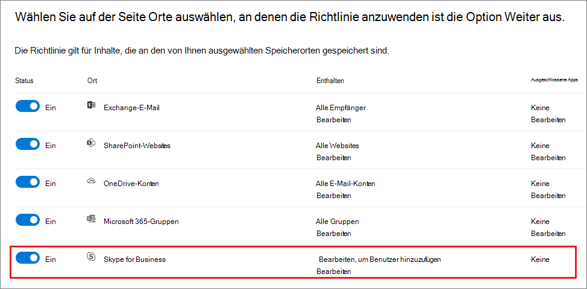
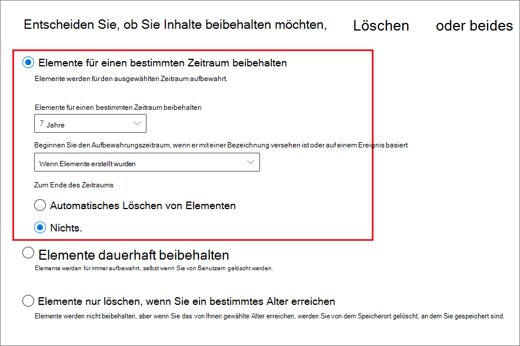

# Erstellen und Konfigurieren von Aufbewahrungsrichtlinien

>*[Microsoft 365-Lizenzierungsleitfaden für Sicherheit und Compliance](/office365/servicedescriptions/microsoft-365-service-descriptions/microsoft-365-tenantlevel-services-licensing-guidance/microsoft-365-security-compliance-licensing-guidance).*

Verwenden Sie eine Aufbewahrungsrichtlinie zum Verwalten der Daten für Ihre Organisation, indem Sie proaktiv entscheiden, ob Inhalte beibehalten, gelöscht oder aber beibehalten und dann gelöscht werden sollen.

Mithilfe einer Aufbewahrungsrichtlinie können Sie dies sehr effizient erledigen, indem Sie auf Containerebene dieselben Aufbewahrungseinstellungen zuweisen, die vom Inhalt in diesem Container automatisch geerbt werden sollen. Dies sind beispielsweise alle Elemente auf SharePoint-Websites, alle E-Mail-Nachrichten in den Exchange-Postfächern von Benutzern und alle Kanalnachrichten für Teams, die bei Microsoft Teams verwendet werden. Wenn Sie nicht sicher sind, ob Sie eine Aufbewahrungsrichtlinie auf Containerebene oder eine Aufbewahrungsbezeichnung auf Elementebene verwenden sollten, lesen Sie [Aufbewahrungsrichtlinien und Aufbewahrungsbezeichnungen](retention.md#retention-policies-and-retention-labels).

Weitere Informationen zu Aufbewahrungsrichtlinien und zur Funktionsweise der Aufbewahrung in Microsoft 365 finden Sie unter [Informationen zu Aufbewahrungsrichtlinien und Aufbewahrungsbezeichnungen](retention.md).

> [!NOTE]
> Die Informationen auf dieser Seite richten sich an Complianceadministratoren. Wenn Sie kein Administrator sind und verstehen möchten, wie Aufbewahrungsrichtlinien für die von Ihnen verwendeten Apps konfiguriert wurden, wenden Sie sich an Ihren Helpdesk, Ihre IT-Abteilung oder Ihren Administrator. Wenn in Teams-Chats und Kanalnachrichten Meldungen zu Aufbewahrungsrichtlinien angezeigt werden, ist es für Sie möglicherweise hilfreich, [Teams-Nachrichten zu Aufbewahrungsrichtlinien](https://support.microsoft.com/office/teams-messages-about-retention-policies-c151fa2f-1558-4cf9-8e51-854e925b483b) zu lesen.

## Bevor Sie beginnen

Der globale Administrator Ihrer Organisation verfügt über umfassende Berechtigungen zum Erstellen und Bearbeiten von Aufbewahrungsrichtlinien. Wenn Sie sich nicht als globaler Administrator anmelden, lesen Sie [Notwendige Berechtigungen zum Erstellen und Verwalten von Aufbewahrungsrichtlinien und Aufbewahrungsbezeichnungen](get-started-with-retention.md#permissions-required-to-create-and-manage-retention-policies-and-retention-labels).

## Erstellen und Konfigurieren einer Aufbewahrungsrichtlinie

Obwohl eine Aufbewahrungsrichtlinie mehrere Dienste unterstützen kann, die darin als „Speicherorte“ identifiziert werden, können Sie nicht eine einzelne Aufbewahrungsrichtlinie erstellen, die alle unterstützten Speicherorte enthält:

- Exchange-E-Mail
- SharePoint-Website
- OneDrive-Konten
- Microsoft 365-Gruppen
- Skype for Business
- Öffentliche Exchange-Ordner
- Teams-Kanalnachrichten
- Teams-Chats
- Nachrichten in der Yammer-Community
- Benutzernachrichten in Yammer

Wenn Sie beim Erstellen einer Aufbewahrungsrichtlinie die Teams- oder Yammer-Speicherorte auswählen, werden die anderen Speicherorte automatisch ausgeschlossen. Dies bedeutet: Die zu befolgenden Anweisungen sind davon abhängig, ob Sie die Teams- oder die Yammer-Speicherorte einbeziehen müssen:

- [Anweisungen für eine Aufbewahrungsrichtlinie für Teams-Speicherorte](#retention-policy-for-teams-locations)
- [Anweisungen für eine Aufbewahrungsrichtlinie für Yammer-Speicherorte](#retention-policy-for-yammer-locations)
- [Anweisungen für eine Aufbewahrungsrichtlinie für andere Speicherorte als Teams und Yammer ](#retention-policy-for-locations-other-than-teams-and-yammer)

Wenn Sie über mehr als eine Aufbewahrungsrichtlinie verfügen und außerdem Aufbewahrungsbezeichnungen verwenden, lesen Sie [Grundsätze der Aufbewahrung, oder was hat Vorrang?](retention.md#the-principles-of-retention-or-what-takes-precedence), um das Ergebnis zu verstehen, wenn mehrere Aufbewahrungseinstellungen für dieselben Inhalte gelten.

### Aufbewahrungsrichtlinie für Teams-Speicherorte

1. Wählen Sie im [Microsoft 365 Compliance Center](https://compliance.microsoft.com/) die Option **Richtlinien** > **Aufbewahrung** aus.

2. Wählen Sie **Neue Aufbewahrungsrichtlinie** aus, um den Assistenten zum Erstellen einer Aufbewahrungsrichtlinie zu starten, und benennen Sie die neue Aufbewahrungsrichtlinie.

3. Wählen Sie für die Seite **Speicherorte für die Anwendung der Richtlinie auswählen** einen oder beide Speicherorte für Teams aus: **Teams Kanalnachricht** und **Teams Chats**.

   Bei **Teams-Kanalnachrichten** sind Nachrichten von Standardkanälen, jedoch nicht von [privaten Kanälen](/microsoftteams/private-channels) eingeschlossen. Zurzeit werden private Kanäle von Aufbewahrungsrichtlinien nicht unterstützt.

   Standardmäßig sind [alle Teams und alle Benutzer ausgewählt](#a-policy-that-applies-to-entire-locations), aber Sie können dies verfeinern, indem Sie die Optionen [**Auswählen** und **Ausschließen** auswählen](#a-policy-with-specific-inclusions-or-exclusions). Beachten Sie vor dem Ändern der Standardeinstellungen die folgenden Auswirkungen auf eine Aufbewahrungsrichtlinie, die Nachrichten löscht, wenn diese für das Aus- oder Einschließen konfiguriert sind:
    
    - Für Gruppenchats, da eine Kopie der Nachrichten im Postfach jedes Benutzers gespeichert wird, der am Chat beteiligt ist. Kopien von Nachrichten von Benutzern, auf die die Richtlinie nicht zutrifft, werden weiterhin in eDiscovery-Ergebnissen angezeigt.
    - Benutzern, auf die die Richtlinie nicht zutrifft, werden die gelöschten Nachrichten in deren Teams-Suchergebnissen angezeigt. Jedoch wird aufgrund der dauerhaften Löschung in der dem Benutzer zugewiesenen Richtlinie, der Inhalt der Nachricht nicht angezeigt.

4. Geben Sie auf der Assistentenseite **Entscheiden, ob Inhalte beibehalten werden, gelöscht werden oder beides** die Konfigurationsoptionen für das Beibehalten und Löschen von Inhalten an.

   Sie können eine Aufbewahrungsrichtlinie erstellen, die Inhalte nur aufbewahrt, ohne sie zu löschen, die sie aufbewahrt und nach einem festgelegten Zeitraum löscht, oder Inhalte nur nach einem bestimmten Zeitraum löscht. Weitere Informationen finden Sie unter [Einstellungen für die Aufbewahrung und Löschung von Inhalten](#settings-for-retaining-and-deleting-content) auf dieser Seite.

5. Schließen Sie den Assistenten ab, damit Ihre Einstellungen gespeichert werden.

Eine Anleitung, wann Sie Aufbewahrungsrichtlinien für Teams verwenden und die Endbenutzererfahrung verstehen, finden Sie unter [Aufbewahrungsrichtlinien für Microsoft Teams Verwalten](/microsoftteams/retention-policies) in der Teams-Dokumentation.

Technische Details zur Funktionsweise der Aufbewahrung für Teams, einschließlich Informationen dazu, welche Elemente von Nachrichten bei der Aufbewahrung unterstützt werden sowie Informationen zum Timing mitsamt Anwendungsbeispielen, finden Sie unter [Informationen zur Aufbewahrung für Microsoft Teams](retention-policies-teams.md).

#### Bekannte Probleme mit der Konfiguration

- Sie können zwar die Option auswählen, den Aufbewahrungszeitraum zu starten, wenn Elemente zuletzt geändert wurden, aber es wird immer der Wert **Wenn Elemente erstellt wurden** verwendet. Für bearbeitete Nachrichten wird eine Kopie der ursprünglichen Nachricht mit ihrem ursprünglichen Zeitstempel gespeichert, um zu erkennen, wann diese Nachricht vor der Bearbeitung erstellt wurde. Die Nachricht hat nach der Bearbeitung einen neueren Zeitstempel.

- Wenn Sie die Option **Teams auswählen** für den Speicherort **Microsoft Teams-Kanalnachrichten** auswählen, werden möglicherweise Microsoft 365-Gruppen angezeigt, die nicht auch Teams sind. Wählen Sie diese Gruppen nicht aus.

- Wenn Sie den Speicherort **Benutzer für Teams-Chats auswählen** auswählen, werden möglicherweise Gäste und Nicht Postfachbenutzer angezeigt. Aufbewahrungsrichtlinien sind nicht auf diese Benutzer ausgerichtet, deshalb sollten Sie sie nicht auswählen.

#### Weitere für die Unterstützung von Teams benötigte Aufbewahrungsrichtlinie

Teams bietet mehr als nur Chats und Kanalnachrichten. Wenn Sie Teams haben, die aus einer Microsoft 365-Gruppe (früher „Office 365-Gruppe“) erstellt wurden, sollten Sie zusätzlich eine Aufbewahrungsrichtlinie konfigurieren, die diese Microsoft 365-Gruppe einschließt. Verwenden Sie dazu den Speicherort **Microsoft 365-Gruppen**. Diese Aufbewahrungsrichtlinie gilt für Inhalte in Postfach, Website und Dateien der Gruppe.

Wenn Sie Teamwebsites haben, die mit keiner Microsoft 365-Gruppe verbunden sind, benötigen Sie eine Aufbewahrungsrichtlinie, die die Speicherorte **SharePoint-Websites** oder **OneDrive-Konten** einschließt, um Dateien in Teams aufzubewahren und zu löschen:

- In einem Chat freigegebene Dateien werden im OneDrive-Konto des Benutzers gespeichert, der sie freigegeben hat.

- In Kanäle hochgeladene Dateien werden auf der SharePoint-Website für das Team gespeichert.

> [!TIP]
> Sie können eine Aufbewahrungsrichtlinie nur auf die Dateien eines bestimmten Teams anwenden, wenn dieses mit keiner Microsoft 365-Gruppe verbunden ist, indem Sie die SharePoint-Website für das Team und die OneDrive-Konten der Benutzer im Team auswählen.

Es kann vorkommen, dass eine Aufbewahrungsrichtlinie, die auf Microsoft 365-Gruppen, SharePoint-Websites oder OneDrive-Konten angewendet wird, eine Datei löscht, die in einer Teams Chat- oder Kanalnachricht erwähnt wird, bevor diese Nachrichten gelöscht werden. In diesem Szenario wird die Datei in der Microsoft Teams-Nachricht weiterhin angezeigt, aber wenn Benutzer die Datei auswählen, wird der Fehler "Datei nicht gefunden" angezeigt. Dieses Verhalten gilt nicht für Aufbewahrungsrichtlinien. Dies kann auch passieren, wenn ein Benutzer eine Datei aus SharePoint oder OneDrive manuell löscht.

### Aufbewahrungsrichtlinie für Yammer-Speicherorte

> [!NOTE]
> Die Aufbewahrungsrichtlinien für Yammer werden in Kürze eingeführt. Wenn Sie die neuen Speicherorte für Yammer noch nicht sehen, versuchen Sie es in ein paar Wochen noch einmal.
>
> Um diese Funktion nutzen zu können, muss Ihr Yammer-Netzwerk im [nativen Modus](/yammer/configure-your-yammer-network/overview-native-mode) und nicht im Hybridmodus arbeiten.

1. Wählen Sie im [Microsoft 365 Compliance Center](https://compliance.microsoft.com/) die Option **Richtlinien** > **Aufbewahrung** aus.

2. Wählen Sie **Neue Aufbewahrungsrichtlinie**, um eine neue Aufbewahrungsrichtlinie zu erstellen.

3. Geben Sie auf der Assistentenseite **Entscheiden, ob Inhalte beibehalten werden, gelöscht werden oder beides** die Konfigurationsoptionen für das Beibehalten und Löschen von Inhalten an. 
    
    Sie können eine Aufbewahrungsrichtlinie erstellen, die Inhalte nur aufbewahrt, ohne sie zu löschen, die sie aufbewahrt und nach einem festgelegten Zeitraum löscht, oder Inhalte nur nach einem bestimmten Zeitraum löscht. Weitere Informationen finden Sie unter [Einstellungen für die Aufbewahrung und Löschung von Inhalten](#settings-for-retaining-and-deleting-content) auf dieser Seite.
    
    Wählen Sie nicht **Erweiterte Aufbewahrungseinstellungen verwenden**, da diese Option für Yammer-Speicherorte nicht unterstützt wird. 

4. Wählen Sie auf der Seite **Speicherorte auswählen** die Option **Bestimmte Standorte auswählen**. Aktivieren Sie dann einen oder beide Speicherorte für Yammer: **Yammer-Communitynachricht** und **Benutzernachrichten in Yammer**.
    
    Standardmäßig sind alle Communitys und Benutzer ausgewählt, aber Sie können dies verfeinern, indem Sie Communitys und Benutzer angeben, die ein- oder -ausgeschlossen werden sollen.
    
    Für Benutzernachrichten in Yammer: 
    - Wenn Sie den Standard auf **Alle** belassen, werden Azure B2B-Gastbenutzer nicht berücksichtigt. 
    - Durch Wählen von **Benutzer auswählen** können Sie eine Aufbewahrungsrichtlinie auf externe Benutzer anwenden, wenn Sie deren Konto kennen.

5. Schließen Sie den Assistenten ab, um Ihre Einstellungen zu speichern.

Weitere Informationen darüber, wie die Aufbewahrungsrichtlinien bei Yammer funktionieren, finden Sie unter [Informationen zur Aufbewahrung bei Yammer](retention-policies-yammer.md).

#### Zusätzliche Aufbewahrungsrichtlinien zur Unterstützung von Yammer erforderlich

Yammer ist mehr als nur Communitynachrichten und private Nachrichten. Konfigurieren Sie zum Aufbewahren und Löschen von E-Mail-Nachrichten für Ihr Yammer-Netzwerk eine zusätzliche Aufbewahrungsrichtlinie, die alle für Yammer verwendeten Microsoft 365-Gruppen umfasst. Verwenden Sie dazu den Speicherort **Microsoft 365-Gruppen**. 

Um Dateien, die in Yammer gespeichert sind, aufzubewahren und zu löschen, benötigen Sie eine Aufbewahrungsrichtlinie, die die **SharePoint-Websites** oder die Speicherorte der **OneDrive-Konten** umfasst:

- Dateien, die in privaten Nachrichten gemeinsam genutzt werden, werden im OneDrive-Konto des Benutzers gespeichert, der die Datei freigegeben hat. 

- Dateien, die in Communitys hochgeladen werden, werden auf der SharePoint-Website für die Yammer-Community gespeichert.

Es ist möglich, dass eine Aufbewahrungsrichtlinie, die auf SharePoint-Websites oder OneDrive-Konten angewendet wird, eine Datei löschen kann, auf die in einer Yammer-Nachricht verwiesen wird, bevor diese Nachrichten gelöscht werden. In diesem Szenario wird die Datei immer noch in der Yammer-Meldung angezeigt, aber wenn Benutzer die Datei auswählen, erhalten sie die Fehlermeldung „Datei nicht gefunden“. Dieses Verhalten gilt nicht spezifisch für Aufbewahrungsrichtlinien und kann auch auftreten, wenn ein Benutzer eine Datei manuell aus SharePoint oder OneDrive löscht.

### Aufbewahrungsrichtlinie für andere Speicherorte als Teams oder Yammer

Verwenden Sie die folgenden Anweisungen für Aufbewahrungsrichtlinien, die für alle diese Dienste gelten:

- Exchange: E-Mail und öffentliche Ordner
- SharePoint: Websites
- OneDrive: Konten
- Microsoft 365-Gruppen
- Skype for Business

1. Wählen Sie im [Microsoft 365 Compliance Center](https://compliance.microsoft.com/) die Option **Richtlinien** > **Aufbewahrung** aus.

2. Wählen Sie **Neue Aufbewahrungsrichtlinie** aus, um den Assistenten zum Erstellen einer Aufbewahrungsrichtlinie zu starten, und benennen Sie die neue Aufbewahrungsrichtlinie.

3. Auf der Seite **Speicherorte auswählen** können Sie jeden Speicherort mit Ausnahme der Speicherorte für Teams ein- oder ausschalten. Sie können die Richtlinie für jeden Speicherort bei der Standardeinstellung belassen, um [die Richtlinie auf den gesamten Speicherort anzuwenden ](#a-policy-that-applies-to-entire-locations), oder [Ein- und Ausschlüsse angeben](#a-policy-with-specific-inclusions-or-exclusions).

    Spezifische Informationen zu Speicherorten:
    - [Exchange-E-Mail und öffentliche Exchange-Ordner](#configuration-information-for-exchange-email-and-exchange-public-folders)
    - [SharePoint-Websites und OneDrive-Konten](#configuration-information-for-sharepoint-sites-and-onedrive-accounts)
    - [Microsoft 365-Gruppen](#configuration-information-for-microsoft-365-groups)
    - [Skype for Business](#configuration-information-for-skype-for-business)

4. Geben Sie auf der Assistentenseite **Entscheiden, ob Inhalte beibehalten werden, gelöscht werden oder beides** die Konfigurationsoptionen für das Beibehalten und Löschen von Inhalten an.

    Sie können eine Aufbewahrungsrichtlinie erstellen, die Inhalte nur aufbewahrt, ohne sie zu löschen, die sie aufbewahrt und nach einem festgelegten Zeitraum löscht, oder Inhalte nur nach einem bestimmten Zeitraum löscht. Weitere Informationen finden Sie unter [Einstellungen für die Aufbewahrung und Löschung von Inhalten](#settings-for-retaining-and-deleting-content) auf dieser Seite.

5. Schließen Sie den Assistenten ab, damit Ihre Einstellungen gespeichert werden.

#### Konfigurationsinformationen für Exchange-E-Mail und öffentliche Exchange-Ordner

Der Speicherort von **Exchange-E-Mail** unterstützt die Aufbewahrung von E-Mail-, Kalender- und anderen Postfachelementen der Benutzer, indem die Aufbewahrungseinstellungen auf Postfachebene angewendet werden.

Ausführliche Informationen zu den Elementen, die beim Konfigurieren von Aufbewahrungseinstellungen für Exchange enthalten und ausgeschlossen werden, finden Sie unter [Lieferumfang für Aufbewahrung und Löschung](retention-policies-exchange.md#whats-included-for-retention-and-deletion).

Obwohl eine Microsoft 365-Gruppe über ein Exchange-Postfach verfügt, bezieht eine Aufbewahrungsrichtlinie, die den gesamten **Exchange-E-Mail-Speicherort** umfasst, keine Inhalte in Microsoft 365-Gruppenpostfächern mit ein. Wenn Sie Inhalte in diesen Postfächern aufbewahren möchten, wählen Sie den Speicherort **Microsoft 365-Gruppen** aus.

Der Speicherort von **öffentlichen Exchange-Ordnern** wendet die Aufbewahrungseinstellungen auf alle öffentlichen Ordner an und kann nicht auf der Ordner- oder Postfachebene angewendet werden.

#### Konfigurationsinformationen für SharePoint-Websites und OneDrive-Konten

Wenn Sie den Speicherort **SharePoint-Websites** auswählen, kann Ihre Aufbewahrungsrichtlinie Dokumente auf SharePoint-Kommunikationswebsites, auf Teamwebsites, die nicht über Microsoft 365-Gruppen verbunden sind, und auf klassischen Websites aufbewahren und löschen. Teamwebsites, die über Microsoft 365-Gruppen verbunden sind, werden bei dieser Option nicht unterstützt. Verwenden Sie stattdessen den Speicherort **Office 365-Gruppen**, der für Inhalte im Postfach der Gruppe, deren Website und Dateien gilt.

Obwohl die Aufbewahrungsrichtlinie auf Websiteebene angewendet wird, werden Aufbewahrungseinstellungen nur auf Dokumente angewendet. Ausführliche Informationen zu den Elementen, die beim Konfigurieren von Aufbewahrungseinstellungen für SharePoint und OneDrive enthalten und ausgeschlossen werden, finden Sie unter [Lieferumfang für Aufbewahrung und Löschung](retention-policies-sharepoint.md#whats-included-for-retention-and-deletion). 

Wenn Sie Ihre Speicherorte für SharePoint-Websites oder OneDrive-Konten angeben, benötigen Sie keine Berechtigungen für den Zugriff auf die Websites und es erfolgt keine Validierung, wenn Sie die URL auf der Seite **Speicherorte bearbeiten** angeben. Die von Ihnen angegebenen SharePoint-Websites werden jedoch vom Assistenten dahingehend überprüft, ob sie existieren. Wenn die Überprüfung fehlschlägt, wird eine Meldung angezeigt, die besagt, dass die Überprüfung für die eingegebene URL fehlgeschlagen ist. Der Assistent erstellt die Aufbewahrungsrichtlinie erst, wenn die Überprüfung erfolgreich war. Wenn diese Meldung angezeigt wird, wechseln Sie zurück in den Assistenten, um die URL zu ändern oder die Website aus der Aufbewahrungsrichtlinie zu entfernen.

Wenn Sie einzelne OneDrive-Konten angeben möchten, die ein- oder ausgeschlossen werden sollen, hat die URL das folgende Format: `https://<tenant name>-my.sharepoint.com/personal/<user_name>_<tenant name>_com`

Beispielsweise bei einem Benutzer im Mandanten „Contoso“, der den Benutzernamen „rsimone“ hat: `https://contoso-my.sharepoint.com/personal/rsimone_contoso_onmicrosoft_com`

Informationen zum Überprüfen der Syntax für Ihren Mandanten und zum Identifizieren von URLs für Benutzer finden Sie unter [Abrufen einer Liste aller Benutzer OneDrive-URLs in Ihrer Organisation](/onedrive/list-onedrive-urls).

### Konfigurationsinformationen für Microsoft 365-Gruppen

Wenn Sie Inhalte für eine Microsoft 365-Gruppe (früher „Office 365-Gruppe“) aufbewahren oder löschen möchten, verwenden Sie den Speicherort **Microsoft 365-Gruppen**. Obwohl eine Microsoft 365-Gruppe über ein Exchange-Postfach verfügt, bezieht eine Aufbewahrungsrichtlinie, die den gesamten **Exchange-E-Mail-Speicherort** umfasst, keine Inhalte in Microsoft 365-Gruppenpostfächern mit ein. Obwohl der **Exchange-E-Mail-Speicherort** zunächst die Angabe eines Gruppenpostfachs zum Einschließen oder Ausschließen zulässt, erhalten Sie beim Versuch, die Aufbewahrungsrichtlinie zu speichern, die Fehlermeldung, dass „RemoteGroupMailbox“ keine gültige Auswahl für den Exchange-Speicherort ist.

Eine auf eine Microsoft 365-Gruppe angewendete Aufbewahrungsrichtlinie umfasst standardmäßig das Gruppenpostfach und die SharePoint-Teamwebsite. Dateien, die auf der SharePoint-Teamwebsite gespeichert sind, werden mit diesem Standort abgedeckt. Nicht jedoch Teams-Chats oder Nachrichten im Teams-Channel, die ihre eigenen Standorte für Aufbewahrungsrichtlinien haben.

Wenn Sie den Standardwert ändern möchten, weil die Aufbewahrungsrichtlinie entweder nur für Microsoft 365-Postfächer oder nur für die verbundenen SharePoint-Teamwebsites gelten soll, verwenden Sie das PowerShell-Cmdlet [Set-RetentionCompliancePolicy](/powershell/module/exchange/set-retentioncompliancepolicy) mit dem Parameter *Applications* mit einem der folgenden Werte:

- `Group:Exchange` nur für Microsoft 365-Postfächer, die mit der Gruppe verbunden sind.
- `Group:SharePoint` nur für SharePoint-Websites, die mit der Gruppe verbunden sind.

Um zum Standardwert für das Postfach und die SharePoint-Website für die ausgewählten Microsoft 365-Gruppen zurückzukehren, geben Sie `Group:Exchange,SharePoint` ein.

### Konfigurationsinformationen für Skype for Business

Im Gegensatz zu anderen Speicherorten können Sie den Status des Skype-Speicherorts nicht so festlegen, dass alle Benutzer automatisch eingeschlossen sind. Wenn Sie diesen Speicherort aktivieren, müssen Sie stattdessen die Option **Bearbeiten** auswählen, um manuell die Benutzer auszuwählen, deren Unterhaltungen Sie beibehalten möchten:

Nachdem Sie die Option **Bearbeiten** ausgewählt haben, können Sie im Bereich **Skype for Business** schnell alle Benutzer einbeziehen, indem Sie das ausgeblendete Kästchen vor der Spalte **Name** aktivieren. Es ist jedoch wichtig zu wissen, dass jeder Benutzer in der Richtlinie als ein einzelnes eingeschlossenes Element zählt. Wenn Sie also 1.000-Benutzer hinzufügen, indem Sie dieses Kontrollkästchen aktivieren, entspricht das dem manuellen Auswählen von 1.000 einzuschließenden Benutzern. Dies ist die maximale unterstützte Anzahl von Skype for Business-Benutzern.

Achtung: **Aufgezeichnete Unterhaltungen**, ein Ordner in Outlook, ist eine Funktion, die nichts mit der Skype-Archivierung zu tun hat. Die Option **Aufgezeichnete Unterhaltungen** kann vom Endbenutzer deaktiviert werden, die Archivierung für Skype erfolgt jedoch durch das Speichern einer Kopie von Skype-Unterhaltungen in einem ausgeblendeten Ordner, auf den die Benutzer nicht zugreifen können, der aber für eDiscovery verfügbar ist.

## Einstellungen für die Aufbewahrung und Löschung von Inhalten

Wenn Sie die Einstellungen für die Aufbewahrung und Löschung von Inhalten in Ihrer Aufbewahrungsrichtlinie festlegen, wird für Ihre Aufbewahrungsrichtlinie eine der folgenden Konfigurationen für einen bestimmten Zeitraum gelten:

- Nur aufbewahren

    Wählen Sie für diese Konfiguration **Elemente für einen bestimmten Zeitraum aufbewahren** und **Am Ende des Aufbewahrungszeitraums: Nichts unternehmen**. Oder wählen Sie **Elemente für immer aufbewahren** aus.

- Aufbewahren und dann löschen

    Wählen Sie für diese Konfiguration **Elemente für einen bestimmten Zeitraum aufbewahren** und **Am Ende des Aufbewahrungszeitraums: Elemente automatisch löschen**.

- Nur löschen

    Wählen Sie für diese Konfiguration **Elemente erst löschen, wenn sie ein bestimmtes Alter erreichen** aus.

### Aufbewahren von Inhalten für einen bestimmten Zeitraum

Beim Konfigurieren einer Aufbewahrungsrichtlinie können Sie festlegen, ob Elemente für eine bestimmte Anzahl von Tagen, Monaten oder Jahren aufbewahrt werden sollen. Alternativ können Sie die Elemente für immer aufbewahren.

Beim Konfigurieren einer Aufbewahrungsrichtlinie können Sie festlegen, ob Inhalte zeitlich unbegrenzt oder für eine bestimmte Anzahl von Tagen, Monaten oder Jahren aufbewahrt werden sollen. Der Aufbewahrungszeitraum wird anhand des Alters der Inhalte und nicht anhand des Anwendungsdatums der Aufbewahrungsrichtlinie berechnet.

Als Beginn des Aufbewahrungszeitraums können Sie auch auswählen, wann der Inhalt erstellt wurde oder – nur unterstützt für Dateien und SharePoint, OneDrive und Microsoft 365-Gruppen – wann der Inhalt zuletzt geändert wurde.

Beispiele:

- SharePoint: Wenn Sie Elemente in einer Websitesammlung nach der letzten Änderung ihres Inhalts während sieben Jahren aufbewahren möchten und ein Dokument in dieser Websitesammlung seit sechs Jahren nicht mehr geändert wurde, wird dieses Dokument nur ein weiteres Jahr aufbewahrt, wenn es nicht geändert wird. Wenn das Dokument nun erneut bearbeitet wird, dann wird das Alter des Dokuments ab dem neuen Datum der letzten Änderung berechnet und für weitere sieben Jahre aufbewahrt.

- Exchange: Wenn Sie Elemente in einem Postfach während sieben Jahren aufbewahren möchten und eine Nachricht vor sechs Jahren gesendet wurde, wird die Nachricht nur noch ein Jahr lang aufbewahrt. Bei Exchange-Elementen basiert das Alter auf dem Eingangsdatum für eingehende E-Mails oder dem Sendedatum für ausgehenden E-Mails. Das Aufbewahren von Elementen basierend auf dem Zeitpunkt der letzten Änderung gilt nur für Websiteinhalte in OneDrive und SharePoint.

Am Ende des Aufbewahrungszeitraums können Sie wählen, ob der Inhalt dauerhaft gelöscht werden soll:

### Löschen von Inhalten, die ein bestimmtes Alter überschritten haben

Eine Aufbewahrungsrichtlinie kann Elemente sowohl aufbewahren und dann löschen, oder alte Elemente löschen, ohne sie aufzubewahren.

In beiden Fällen ist es wichtig zu wissen, dass wenn Ihre Aufbewahrungsrichtlinie Elemente löscht, der für eine Aufbewahrungsrichtlinie festgelegte Zeitraum jedes Mal ab dem Zeitpunkt berechnet wird, als das betreffende Element erstellt oder geändert wurde und nicht ab dem Zeitpunkt, als die die Richtlinie zugewiesen wurde.

Bevor Sie also eine Aufbewahrungsrichtlinie zum ersten Mal zuweisen, insbesondere wenn diese Richtlinie Elemente löscht, sollten Sie zunächst das Alter des vorhandenen Inhalts und die möglichen Auswirkungen der Richtlinie auf diesen Inhalt berücksichtigen. Sie sollten Ihre Benutzer auch über die neue Richtlinie informieren, bevor Sie diese zuweisen, um so den Benutzern Zeit für die Beurteilung möglicher Auswirkungen zu geben.

### Eine Richtlinie, die für ganze Speicherorte gilt

Wenn Sie Speicherorte auswählen – mit Ausnahme von Skype for Business – lautet die Standardeinstellung **Alle**, wenn der Status des Speicherorts auf **An** gesetzt ist.

Wenn eine Aufbewahrungsrichtlinie auf eine beliebige Kombination ganzer Speicherorte zutrifft, gibt es keine Beschränkung für die Anzahl der Empfänger, Websites, Konton, Gruppen, etc., die diese Richtlinie umfassen kann.

Wenn eine Richtlinie beispielsweise alle Exchange-E-Mails und alle SharePoint-Websites enthält, werden alle Websites und Empfänger eingeschlossen, unabhängig von der Anzahl. Bei Exchange erbt jedes neue Postfach, das nach dem Anwenden der Richtlinie erstellt wird, automatisch die Richtlinie.

### Richtlinien, die bestimmte Elemente einschließen oder ausschließen

Beachten Sie Folgendes: Wenn Sie die optionale Konfiguration verwenden, um Ihre Aufbewahrungseinstellungen auf bestimmte Benutzer, bestimmte Microsoft 365-Gruppen oder bestimmte Websites auszudehnen, gibt es einige Einschränkungen pro Richtlinie, die zu beachten sind. Weitere Informationen finden Sie unter [Einschränkungen für Aufbewahrungsrichtlinien und Aufbewahrungsbezeichnungsrichtlinien](retention-limits.md). 

Wenn Sie die optionale Konfiguration für den Bereich der Aufbewahrungseinstellungen verwenden möchten, stellen Sie sicher, dass der **Status** dieses Speicherorts **Ein** ist, und verwenden Sie dann die Links, um bestimmte Benutzer, Microsoft 365-Gruppen oder-Websites ein- oder auszuschließen.

> [!WARNING]
> Wenn Sie Einschlüsse konfigurieren und dann den letzten entfernen, wird die Konfiguration für den Speicherort auf **Alle** zurückgesetzt.  Vergewissern Sie sich, dass dies die von Ihnen beabsichtigte Konfiguration ist, bevor Sie die Richtlinie speichern.
>
> Wenn Sie beispielsweise eine einzelne SharePoint-Website für den Einschluss in Ihre Aufbewahrungsrichtlinie angeben, die für das Löschen von Daten konfiguriert ist, und dann die einzelne Website entfernen, unterliegen standardmäßig alle SharePoint-Websites der Aufbewahrungsrichtlinie, die Daten endgültig löscht. Gleiches gilt für Einschlüsse für Exchange-Empfänger, OneDrive-Konten, Teams Chat-Benutzer usw.
>
> In diesem Szenario können Sie den Speicherort deaktivieren, wenn Sie nicht möchten, dass die Einstellung **Alle** für den Speicherort der Aufbewahrungsrichtlinie unterliegt. Alternativ können Sie Ausschlüsse angeben, die von der Richtlinie ausgenommen werden sollen.

## Aktualisieren von Aufbewahrungsrichtlinien

Einige Einstellungen können nicht geändert werden, nachdem eine Aufbewahrungsrichtlinie erstellt und gespeichert wurde. Dazu gehören:
- Den Namen der Aufbewahrungsrichtlinie und die Aufbewahrungseinstellungen mit Ausnahme des Aufbewahrungszeitraums und des Beginns des Aufbewahrungszeitraums.

Wenn Sie eine Aufbewahrungsrichtlinie bearbeiten und Elemente bereits den ursprünglichen Einstellungen in Ihrer Aufbewahrungsrichtlinie unterliegen, werden die aktualisierten Einstellungen automatisch zusätzlich auf diese sowie auf neu ermittelte Elemente angewendet.

Diese Aktualisierung erfolgt normalerweise ziemlich schnell, kann aber mehrere Tage dauern. Wenn die Richtlinienreplikation auf Ihre Microsoft 365-Speicherorte abgeschlossen ist, ändert sich der Status der Aufbewahrungsrichtlinie im Microsoft 365 Compliance Center von **Ein (ausstehend)** zu **Ein (erfolgreich)**.

## Sperren der Richtlinie, um Änderungen vorzubeugen

Wenn Sie sicherstellen müssen, das niemand die Richtlinie deaktivieren, löschen oder weniger restriktiv machen kann, lesen Sie [Verwenden der Erhaltungssperre zum Einschränken von Änderungen an Aufbewahrungsrichtlinien und Aufbewahrungsbezeichnungsrichtlinien](retention-preservation-lock.md).
