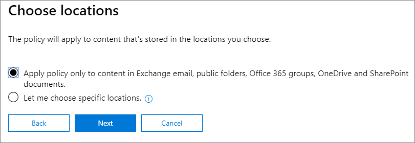

# <a name="create-and-configure-retention-policies"></a>Erstellen und Konfigurieren von Aufbewahrungsrichtlinien

>*[Microsoft 365-Lizenzierungsleitfaden für Sicherheit und Compliance](https://aka.ms/ComplianceSD).*

Mithilfe einer Aufbewahrungsrichtlinie können Sie proaktiv entscheiden, ob Inhalte aufbewahrt, gelöscht oder beides, also aufbewahrt und dann gelöscht werden sollen. 

Näheres zur Funktionsweise von Aufbewahrungsrichtlinien erfahren Sie unter [Informationen zu Aufbewahrungsrichtlinien](retention-policies.md).

## <a name="before-you-begin"></a>Bevor Sie beginnen

Die Mitglieder Ihres Complianceteams, die Aufbewahrungsrichtlinien erstellen und verwalten sollen, benötigen Berechtigungen für das [Microsoft 365 Compliance Center](https://compliance.microsoft.com/). Standardmäßig hat der Mandantenadministrator (Globaler Administrator) Zugriff auf diese Ressource und kann anderen Personen den Zugriff darauf gewähren, ohne ihnen alle Berechtigungen eines Mandantenadministrators zu geben. Um Berechtigungen für diese eingeschränkte Administration zu erteilen, empfehlen wir, Benutzer zur Administrator-Rollengruppe „**Compliance Administrator**“ hinzuzufügen. Anweisungen finden Sie unter [Benutzern den Zugriff auf das Security & Compliance Center gewähren](https://docs.microsoft.com/microsoft-365/security/office-365-security/grant-access-to-the-security-and-compliance-center).

Diese Berechtigungen sind nur erforderlich, um eine Aufbewahrungsrichtlinie zu erstellen und anzuwenden. Die Person, die die Aufbewahrungsrichtlinie konfiguriert, benötigt keinen Zugriff auf die Inhalte.

## <a name="create-and-configure-a-retention-policy"></a>Erstellen und Konfigurieren einer Aufbewahrungsrichtlinie

1. Wählen Sie im [Microsoft 365 Compliance Center](https://compliance.microsoft.com/) die Option **Richtlinien** > **Aufbewahrung** aus.

2. Wählen Sie **Neue Aufbewahrungsrichtlinie** aus, oder bearbeiten Sie eine bestehende Aufbewahrungsrichtlinie.

3. Spezifizieren Sie unter **Einstellungen** zuerst die Konfigurationsoptionen für das Aufbewahren und Löschen von Inhalten. Sie können eine Aufbewahrungsrichtlinie erstellen, die Inhalte nur aufbewahrt, ohne sie zu löschen, die sie aufbewahrt und nach einem festgelegten Zeitraum löscht, oder Inhalte nur nach einem bestimmten Zeitraum löscht. Weitere Informationen finden Sie unter [Einstellungen für die Aufbewahrung und Löschung von Inhalten](#settings-for-retaining-and-deleting-content) auf dieser Seite:
    
    Wählen Sie dann aus, ob die Aufbewahrungsrichtlinie auf alle Inhalte oder nur auf solche angewendet werden soll, die bestimmte Bedingungen erfüllen. Weitere Informationen zu diesen erweiterten Aufbewahrungseinstellungen finden Sie unter [Erweiterte Einstellungen zum Ermitteln von Inhalten, die bestimmte Bedingungen erfüllen](#advanced-settings-to-identify-content-that-meets-specific-conditions) auf dieser Seite. 

4. Wählen Sie auf der Seite **Speicherorte wählen** aus, ob die Aufbewahrungsrichtlinie auf alle unterstützten Speicherorte in Ihrer Organisation angewendet werden soll, oder ob Sie die Speicherorte angeben möchten. Wenn Sie bestimmte Speicherorte auswählen, können Sie auch angeben, welche eingeschlossen und welche ausgeschlossen werden sollen. 
    
    Für Microsoft Teams: 
    - Sie müssen die Option zur Auswahl bestimmter Speicherorte auswählen, wenn Microsoft Teams-Kanalnachrichten oder -Chats gelöscht oder aufbewahrt werden sollen. Wenn Sie eine dieser Optionen als Speicherorte auswählen, werden die anderen Speicherorte automatisch ausgeschlossen, da eine Aufbewahrungsrichtlinie, die diese Microsoft Teams-Daten umfasst, keine anderen Speicherorte einschließen kann. 
    - Beachten Sie, dass im Falle von **Microsoft Teams-Kanalnachrichten** Nachrichten von Standardkanälen, jedoch nicht von [privaten Kanälen](https://docs.microsoft.com/microsoftteams/private-channels) eingeschlossen sind. Zurzeit werden private Kanäle von Aufbewahrungsrichtlinien nicht unterstützt.
    
    Weitere Informationen zur Wahl zwischen einer Aufbewahrungsrichtlinie für die gesamte Organisation oder für bestimmte Speicherorte finden Sie unter [Anwenden einer Aufbewahrungsrichtlinie auf eine gesamte Organisation oder bestimmte Speicherorte](#applying-a-retention-policy-to-an-entire-organization-or-specific-locations) auf dieser Seite.
    
    Spezifische Informationen zu **Office 365-Gruppen** und **Skype for Business** finden Sie in den folgenden Abschnitten [Konfigurationsinformationen für Microsoft 365-Gruppen](#configuration-information-for-microsoft-365-groups) und [Konfigurationsinformationen für Skype for Business](#configuration-information-for-skype-for-business).

5. Schließen Sie den Assistenten ab, damit Ihre Einstellungen gespeichert werden.

Wenn Sie über mehr als eine Aufbewahrungsrichtlinie verfügen, lesen Sie [Die Grundsätzen der Aufbewahrung, oder was hat Vorrang?](retention-policies.md#the-principles-of-retention-or-what-takes-precedence).

### <a name="configuration-information-for-microsoft-365-groups"></a>Konfigurationsinformationen für Microsoft 365-Gruppen

Wenn Sie Inhalte für eine Microsoft 365-Gruppe (vormals Office 365-Gruppe) aufbewahren oder löschen möchten, wählen Sie beim Auswählen der Speicherorte für Ihre Aufbewahrungsrichtlinie **Office 365-Gruppen** aus. Obwohl eine Microsoft 365-Gruppe über ein Exchange-Postfach verfügt, bezieht eine Aufbewahrungsrichtlinie, die den gesamten **Exchange-E-Mail-Speicherort** umfasst, keine Inhalte in Microsoft 365-Gruppenpostfächern mit ein. Obwohl der **Exchange-E-Mail-Speicherort** zunächst die Angabe eines Gruppenpostfachs zum Einschließen oder Ausschließen zulässt, erhalten Sie beim Versuch, die Aufbewahrungsrichtlinie zu speichern, die Fehlermeldung, dass "RemoteGroupMailbox" keine gültige Auswahl für den Exchange-Speicherort ist.

Eine auf eine Microsoft 365-Gruppe angewendete Aufbewahrungsrichtlinie umfasst sowohl das Gruppenpostfach als auch die Website. Eine auf eine Microsoft 365-Gruppe angewendete Aufbewahrungsrichtlinie schützt die Ressourcen, die von einer Microsoft 365-Gruppe erstellt wurden. Dazu gehört auch Microsoft Teams.

### <a name="configuration-information-for-skype-for-business"></a>Konfigurationsinformationen für Skype for Business

Im Gegensatz zu Exchange-E-Mails kann der Status des Skype-Speicherorts nicht einfach aktiviert werden, um alle Benutzer einzuschließen. Wenn Sie diesen Speicherort jedoch aktivieren, können Sie anschließend manuell die Benutzer auswählen, deren Unterhaltungen Sie aufbewahren möchten:


  
Bei Auswahl von **Benutzer auswählen** können Sie schnell alle Benutzer hinzufügen, indem Sie in der Spaltenüberschrift das Feld **Name** auswählen. Es ist jedoch wichtig zu wissen, dass jeder Benutzer als ein bestimmtes eingeschlossenes Element in der Richtlinie zählt. Wenn Sie also mehr als 1.000 Benutzer einschließen, gelten die im vorherigen Abschnitt angegebenen Grenzwerte. Wenn hier alle Skype-Benutzer ausgewählt werden, entspricht dies nicht dem standardmäßigen Einschließen aller Skype-Benutzer mithilfe einer organisationsübergreifenden Richtlinie. 
  

  
Note that **Conversation History**, a folder in Outlook, is a feature that has nothing to do with Skype archiving. **Conversation History** can be turned off by the end user, but archiving for Skype is done by storing a copy of Skype conversations in a hidden folder that is inaccessible to the user but available to eDiscovery.


## <a name="settings-for-retaining-and-deleting-content"></a>Einstellungen für die Aufbewahrung und Löschung von Inhalten

Wenn Sie die Einstellungen für die Aufbewahrung und Löschung von Inhalten in Ihrer Aufbewahrungsrichtlinie festlegen, wird für Ihre Aufbewahrungsrichtlinie eine der folgenden Konfigurationen für einen bestimmten Zeitraum gelten:

- Nur aufbewahren
- Aufbewahren und löschen
- Nur löschen

### <a name="retaining-content-for-a-specific-period-of-time"></a>Aufbewahren von Inhalten für einen bestimmten Zeitraum

Beim Konfigurieren einer Aufbewahrungsrichtlinie können Sie festlegen, ob Inhalte zeitlich unbegrenzt oder für eine bestimmte Anzahl von Tagen, Monaten oder Jahren aufbewahrt werden sollen. Die Dauer der Aufbewahrung von Inhalten wird anhand des Alters der Inhalte und nicht anhand des Anwendungsdatums der Aufbewahrungsrichtlinie berechnet. Sie können auswählen, ob das Alter auf dem Erstellungsdatum des Inhalts oder (bei OneDrive und SharePoint) auf dem Datum der letzten Änderung basiert.

Beispiele:
  
- SharePoint: Wenn Inhalte einer Websitesammlung sieben Jahre lang nach der letzten Änderung aufbewahrt werden sollen, und ein Dokument in dieser Websitesammlung seit sechs Jahren nicht geändert wurde, wird es nur noch ein weiteres Jahr aufbewahrt, sofern es in diesem Zeitraum nicht geändert wird. Falls das Dokument wieder geändert wird, wird das Alter des Dokuments ab dem neuen Datum der letzten Änderung berechnet und weitere sieben Jahre lang aufbewahrt.
  
- Exchange: Wenn Inhalte in einem Postfach für sieben Jahre aufbewahrt werden sollen und eine Nachricht vor sechs Jahren gesendet wurde, wird sie nur noch ein Jahr aufbewahrt. Bei Exchange-Inhalten basiert das Alter auf dem Empfangsdatum für eingehende E-Mails oder dem Sendedatum für ausgehende E-Mails. Die Aufbewahrung von Inhalten basierend auf der letzten Änderung gilt nur für Websiteinhalte in OneDrive und SharePoint.
  
Am Ende des Aufbewahrungszeitraums können Sie wählen, ob der Inhalt dauerhaft gelöscht werden soll:
  

  
### <a name="deleting-content-thats-older-than-a-specific-age"></a>Löschen von Inhalten, die ein bestimmtes Alter überschritten haben

Eine Aufbewahrungsrichtlinie kann Inhalte sowohl aufbewahren und dann löschen, oder alte Inhalte löschen, ohne sie aufzubewahren.
  
Wenn Ihre Aufbewahrungsrichtlinie Inhalte löscht, ist es wichtig, zu wissen, dass der für eine Aufbewahrungsrichtlinie festgelegte Zeitraum jedes Mal berechnet wird, wenn der betreffende Inhalt erstellt oder geändert wird.
  

  
Nehmen Sie beispielsweise an, dass Sie eine Aufbewahrungsrichtlinie erstellen, mit der Inhalte nach drei Jahren gelöscht werden. Dann weisen Sie diese Richtlinie allen OneDrive-Konten zu, die viele Inhalte enthalten, die vor vier oder fünf Jahren erstellt wurden. In diesem Fall werden viele Inhalte unmittelbar nach dem ersten Zuweisen der Aufbewahrungsrichtlinie gelöscht. Deshalb ist es wichtig zu wissen, dass eine Aufbewahrungsrichtlinie, mit der Inhalte gelöscht werden, eine erhebliche Auswirkung auf Ihre Inhalte haben kann. 
  
Therefore, before you assign a retention policy to a site collection for the first time, you should first consider the age of the existing content and how the policy may impact that content. You may also want to communicate the new policy to your users before assigning it, to give them time to assess the possible impact. Note this warning that appears when you review the settings for your retention policy just before creating it.
  

  
## <a name="advanced-settings-to-identify-content-that-meets-specific-conditions"></a>Erweiterte Einstellungen zum Ermitteln von Inhalten, die bestimmte Bedingungen erfüllen

Eine Aufbewahrungsrichtlinie kann für alle Inhalte an den von ihr abgedeckten Speicherorten gelten, oder Sie können auswählen, eine Aufbewahrungsrichtlinie nur auf Inhalte anzuwenden, die bestimmte Stichwörter oder [bestimmte Arten von vertraulichen Informationen](what-the-sensitive-information-types-look-for.md) enthalten.
  

  
### <a name="identify-content-that-contains-specific-keywords"></a>Ermitteln von Inhalten, die bestimmte Stichwörter enthalten

Sie können eine Aufbewahrungsrichtlinie auch nur auf Inhalte anwenden, die bestimmte Bedingungen erfüllen, und dann Aufbewahrungsaktionen nur für diese Inhalte festlegen. Zu den verfügbaren Bedingungen zählt das Anwenden einer Aufbewahrungsrichtlinie auf Inhalte, die bestimmte Wörter oder Ausdrücke enthalten. Sie können Ihre Abfrage mithilfe von Suchoperatoren wie UND, ODER und NICHT verfeinern. Weitere Informationen zu diesen Operatoren finden Sie unter [Stichwortabfragen und Suchbedingungen für Inhaltssuchen](keyword-queries-and-search-conditions.md).
  
Unterstützung für das Hinzufügen durchsuchbarer Eigenschaften (z. B. **Betreff:**) wird in Kürze verfügbar sein.
  
Die abfragebasierte Aufbewahrung verwendet den Suchindex, um Inhalte zu identifizieren.
  

  
### <a name="identify-content-that-contains-sensitive-information"></a>Ermitteln von Inhalten, die vertrauliche Informationen enthalten

You can also apply a retention policy only to content that contains [specific types of sensitive information](what-the-sensitive-information-types-look-for.md). For example, you can choose to apply unique retention requirements only to content that contains personal information, such as taxpayer identification numbers, social security numbers, or passport numbers.
  

  
Hinweise:
  
- Die erweiterte Aufbewahrung für vertrauliche Informationen gilt nicht für öffentliche Exchange-Ordner oder Skype for Business, da diese Speicherorte keine vertraulichen Informationstypen unterstützen.
    
- In Exchange Online werden E-Mail-Flussregeln (auch als Transportregeln bezeichnet) zum Identifizieren vertraulicher Informationen verwendet. Dies funktioniert also nur bei Nachrichten während der Übertragung, jedoch nicht für alle Elemente, die bereits in einem Postfach gespeichert sind. Für Exchange Online bedeutet dies, dass mit einer Aufbewahrungsrichtlinie nur für Nachrichten, die **nach** der Richtlinienaktivierung für das Postfach empfangen werden, vertrauliche Informationen identifiziert und Aufbewahrungsaktionen ausgeführt werden können. Für die im vorherigen Abschnitt beschriebene abfragebasierte Aufbewahrung gilt diese Einschränkung nicht, da dabei zum Identifizieren von Inhalten der Suchindex verwendet wird. 
    
## <a name="applying-a-retention-policy-to-an-entire-organization-or-specific-locations"></a>Anwenden einer Aufbewahrungsrichtlinie auf eine gesamte Organisation oder bestimmte Speicherorte

Sie können eine Aufbewahrungsrichtlinie ganz einfach auf eine gesamte Organisation, ganze Speicherorte oder nur auf bestimmte Speicherorte oder Benutzer anwenden.
  
### <a name="org-wide-policy"></a>Organisationsweite Richtlinie

Eines der leistungsstärksten Features einer Aufbewahrungsrichtlinie ist, dass sie auf alle Speicherorte in Microsoft 365 angewendet werden kann, einschließlich:
  
- Exchange-E-Mail
    
- SharePoint-Websitesammlungen
    
- OneDrive-Konten
    
- Microsoft 365-Gruppen (gilt für Inhalte in Postfach und zugehöriger Website der Gruppe)
    
- Öffentliche Exchange-Ordner
    



Weitere wichtige Features einer organisationsweiten Aufbewahrungsrichtlinie sind:
  
- Es gibt keine Beschränkung für die Anzahl der Postfächer oder Websites, die in der Richtlinie enthalten sein können.
    
- Bei Exchange erben alle neuen Postfächer, die nach der Anwendung der Richtlinie erstellt werden, die Richtlinie automatisch.
  
### <a name="a-policy-that-applies-to-entire-locations"></a>Eine Richtlinie, die für ganze Speicherorte gilt

Beim Auswählen von Speicherorten können Sie einen ganzen Speicherort (z. B. Exchange-E-Mail- oder OneDrive-Konten) problemlos ein- oder ausschließen. Hierzu müssen Sie den **Status** des entsprechenden Speicherorts aktivieren oder deaktivieren. 
  
Wie für eine organisationsweite Richtlinie gilt auch für eine auf eine beliebige Kombination ganzer Speicherorte angewendete Richtlinie, dass es keine Beschränkung für die Anzahl der Postfächer oder Websites gibt, die diese Richtlinie umfassen kann. 

Wenn eine Richtlinie beispielsweise alle Exchange-E-Mails und alle SharePoint-Websites umfasst, werden alle Websites und Postfächer einbezogen, ganz gleich, wie viele es sind. Bei Exchange erben alle neuen Postfächer, die nach der Anwendung der Richtlinie erstellt werden, die Richtlinie automatisch.

### <a name="a-policy-with-specific-inclusions-or-exclusions"></a>Richtlinien, die bestimmte Elemente einschließen oder ausschließen

Sie können eine Aufbewahrungsrichtlinie auch nur auf bestimmte Benutzer, bestimmte Microsoft 365-Gruppen oder bestimmte Websites anwenden. Aktivieren Sie hierzu den **Status** des entsprechenden Speicherorts, und verwenden Sie dann die Links, um bestimmte Benutzer, Microsoft 365-Gruppen oder Websites ein- oder auszuschließen. 
  
Allerdings gibt es bei der Verwendung dieser Konfiguration einige Einschränkungen, wenn Ihre Aufbewahrungsrichtlinie mehr als 1.000 bestimmte Speicherorte einschließt oder ausschließt:
  
- Maximale Anzahl für die Aufbewahrungsrichtlinie:
    - 1.000 Postfächer
    - 1.000 Microsoft 365-Gruppen
    - 1.000 Benutzer für private Teams-Chats
    - 100 Websites (OneDrive oder SharePoint)

Für einen Mandanten wird eine maximale Anzahl von 10.000 Richtlinien unterstützt. Hierzu zählen Aufbewahrungsrichtlinien, Aufbewahrungsbezeichnungsrichtlinien und automatisch angewendete Aufbewahrungsrichtlinien.

Sollten Ihre Aufbewahrungsrichtlinien voraussichtlich von diesen Beschränkungen betroffen sein, wählen Sie die Konfigurationsoptionen aus, die für ganze Speicherorte gelten, oder verwenden Sie eine organisationsweite Richtlinie.

## <a name="updating-retention-policies"></a>Aktualisieren von Aufbewahrungsrichtlinien

Wenn Sie eine Aufbewahrungsrichtlinie bearbeiten und Inhalte bereits den ursprünglichen Einstellungen in Ihrer Aufbewahrungsrichtlinie unterliegen, werden die aktualisierten Einstellungen automatisch zusätzlich auf diese sowie auf neu ermittelte Inhalte angewendet.

Diese Aktualisierung erfolgt normalerweise ziemlich schnell, kann aber mehrere Tage dauern. Wenn die Richtlinienreplikation auf Ihre Microsoft 365-Speicherorte abgeschlossen ist, ändert sich der Status der Aufbewahrungsrichtlinie im Microsoft 365 Compliance Center von **Ein (ausstehend)** zu **Ein (erfolgreich)**.

## <a name="find-the-powershell-cmdlets-for-retention-policies"></a>Die PowerShell-Cmdlets für Aufbewahrungsrichtlinien finden

So verwenden Sie die Cmdlets für Aufbewahrungsrichtlinien
  
1. [Herstellen einer Verbindung mit der Office 365 Security & Compliance Center PowerShell](https://docs.microsoft.com/powershell/exchange/office-365-scc/connect-to-scc-powershell/connect-to-scc-powershell)
    
2. Verwenden Sie die folgenden Office 365 Security & Compliance Center-Cmdlets:
    
    - [Get-RetentionCompliancePolicy](https://docs.microsoft.com/powershell/module/exchange/get-retentioncompliancepolicy)
    
    - [New-RetentionCompliancePolicy](https://docs.microsoft.com/powershell/module/exchange/new-retentioncompliancepolicy)
    
    - [Remove-RetentionCompliancePolicy](https://docs.microsoft.com/powershell/module/exchange/remove-retentioncompliancepolicy)
    
    - [Set-RetentionCompliancePolicy](https://docs.microsoft.com/powershell/module/exchange/set-retentioncompliancepolicy)
    
    - [Get-RetentionComplianceRule](https://docs.microsoft.com/powershell/module/exchange/get-retentioncompliancerule)
    
    - [New-RetentionComplianceRule](https://docs.microsoft.com/powershell/module/exchange/new-retentioncompliancerule)
    
    - [Remove-RetentionComplianceRule](https://docs.microsoft.com/powershell/module/exchange/remove-retentioncompliancerule)
    
    - [Set-RetentionComplianceRule](https://docs.microsoft.com/powershell/module/exchange/set-retentioncompliancerule)


## <a name="lock-a-retention-policy-by-using-powershell"></a>Sperren einer Aufbewahrungsrichtlinie mit PowerShell

Sie müssen PowerShell verwenden, wenn Sie eine [Aufbewahrungssperre](retention-policies.md#use-preservation-lock-to-comply-with-regulatory-requirements) zur Einhaltung gesetzlicher Vorschriften benötigen.

1. [Stellen Sie eine Verbindung mit Office 365 Security & Compliance Center PowerShell her](https://docs.microsoft.com/powershell/exchange/office-365-scc/connect-to-scc-powershell/connect-to-scc-powershell?view=exchange-ps).

2. Führen Sie zum Anzeigen einer Liste Ihrer Aufbewahrungsrichtlinien und zum Suchen nach dem Namen der Richtlinie, die Sie sperren möchten, den Befehl `Get-RetentionCompliancePolicy` aus.
    
   
    
3. Um eine Aufbewahrungssperre zu einer Aufbewahrungsrichtlinie hinzuzufügen, führen Sie den Befehl `Set-RetentionCompliancePolicy` aus, und legen Sie dabei den `RestrictiveRetention`-Parameter auf „true“ fest. Zum Beispiel:

   ```powershell
   Set-RetentionCompliancePolicy -Identity "<Name of Policy>" – RestrictiveRetention $true
   ```
   
   
    
   Nachdem Sie das Cmdlet ausgeführt haben, wählen Sie **Ja für alle** aus:
    
   

Eine Aufbewahrungssperre wird jetzt zur Aufbewahrungsrichtlinie hinzugefügt. Wenn Sie `Get-RetentionCompliancePolicy`ausführen, legen Sie den Parameter `RestrictiveRetention`auf "true" fest. Zum Beispiel:

```powershell
Get-RetentionCompliancePolicy -Identity "<Name of Policy>" |Fl
```


  

