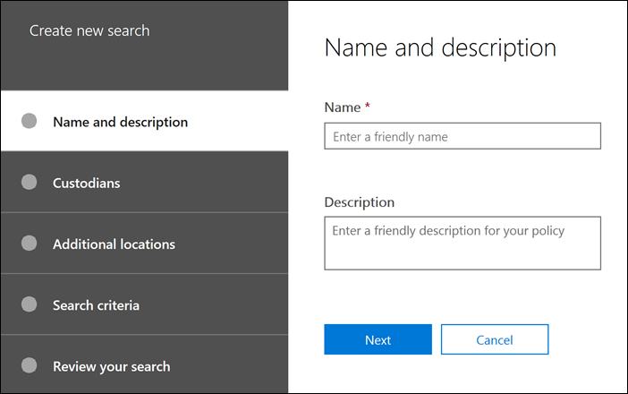

# Erstellen einer Suche

Auf der Registerkarte **Suchen** in Ihrem Fall können Sie eine neue Suche erstellen, indem Sie auf **neue Suche** klicken und dem Assistenten folgen.

## Benennen Sie die Suche, und geben Sie Ihr eine Beschreibung.

Jede Suche mit einem Fall sollte einen eindeutigen Namen haben. Optional können Sie eine Beschreibung für Ihre Suche angeben. 

## Auswählen der zu durchsuchenden Depotstellen und Freiheits Orte

Wählen Sie Depot inhaltsspeicherorte für die Suche aus, indem Sie die depotverwalter angeben, die Sie dem Fall hinzugefügt haben. Wenn Sie eine Depotbank auswählen, führen Sie die Suche anhand aller Datenquellen aus, die der Depotbank zugeordnet sind. Sie haben auch die Möglichkeit, die Suche für jede Depotbank auf ausgewählte Datenquellen einzuschränken. Weitere Informationen zum Hinzufügen von Depotstellen und Verwalten Ihrer Datenquellen finden Sie unter [Arbeiten mit](managing-custodians.md)Betreuern.

## Auswählen von Speicherorten ohne Freiheitsentzug

In einigen Fällen möchten Sie möglicherweise Datenquellen durchsuchen, die keiner Depotbank zugeordnet sind. In diesem Fall können Sie die Speicherorte angeben, die Sie durchsuchen möchten, oder alle inhaltsspeicherorte nach einem bestimmten Office 365 Dienst durchsuchen (beispielsweisedurch Suchen aller Exchange-Postfächer oder aller SharePoint-Websites und OneDrive-Konten).

## Definieren der Suchabfrage und Bedingungen

Sie können die Stichwörter-Abfrage und alle Bedingungen für die Suche definieren, indem Sie die vordefinierten Bedingungs Karten verwenden oder KQL (Keyword Query Language) verwenden. Weitere Informationen finden Sie unter [Erstellen von Suchabfragen](building-search-queries.md).
