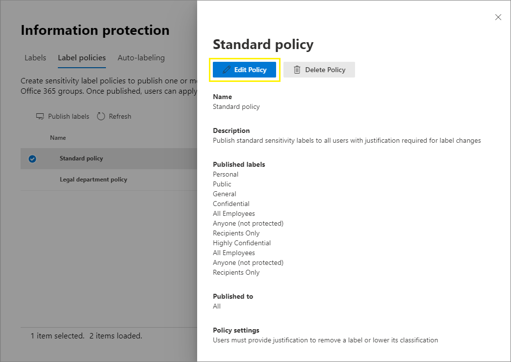

# <a name="create-and-configure-sensitivity-labels-and-their-policies"></a>Erstellen und Konfigurieren von Vertraulichkeitsbezeichnungen und deren Richtlinien

>*[Microsoft 365-Lizenzierungsleitfaden für Sicherheit und Compliance](https://aka.ms/ComplianceSD).*

Alle Microsoft Information Protection-Lösungen (gelegentlich als MIP abgekürzt) werden mithilfe von [Vertraulichkeitsbezeichnungen](sensitivity-labels.md) implementiert. Um diese Bezeichnungen zu erstellen und zu veröffentlichen, navigieren Sie zu Ihrem Admin Center für Bezeichnungen, z. B. zum [Microsoft 365 Compliance Center](https://compliance.microsoft.com/). Sie können auch das Microsoft 365 Security Center oder das Security & Compliance Center verwenden.

Erstellen und konfigurieren Sie zunächst die Vertraulichkeitsbezeichnungen, die Sie für Apps und andere Dienste zur Verfügung stellen möchten, zum Beispiel die Bezeichnungen, die Benutzer in Office-Apps sehen und anwenden sollen. 

Erstellen Sie dann eine oder mehrere Bezeichnungsrichtlinien mit den von Ihnen konfigurierten Bezeichnungen und Richtlinieneinstellungen. Es ist die Bezeichnungsrichtlinie, die die Bezeichnungen und Einstellungen für die von Ihnen ausgewählten Benutzer und Standorte veröffentlicht.

## <a name="before-you-begin"></a>Bevor Sie beginnen

Der globale Administrator für Ihre Organisation verfügt über vollständige Berechtigungen zum Erstellen und Verwalten aller Aspekte von Vertraulichkeitsbezeichnungen. Wenn Sie sich nicht als globaler Administrator anmelden, lesen Sie [Zum Erstellen und Verwalten von Vertraulichkeitsbezeichnungen erforderliche Berechtigungen](get-started-with-sensitivity-labels.md#permissions-required-to-create-and-manage-sensitivity-labels).

## <a name="create-and-configure-sensitivity-labels"></a>Erstellen und Konfigurieren von Vertraulichkeitsbezeichnungen

1. Navigieren Sie in Ihrem Admin Center für Bezeichnungen zu Vertraulichkeitsbezeichnungen:
    
    - Microsoft 365 Compliance Center: 
        - **Lösungen** > **Informationsschutz**
        
        Wenn diese Option nicht sofort angezeigt wird, wählen Sie zunächst **Alle anzeigen** aus. 
    
    - Microsoft 365 Security Center: 
        - **Klassifizierung** > **Vertraulichkeitsbezeichnungen**
    
    - Security & Compliance Center:
        - **Klassifizierung** > **Vertraulichkeitsbezeichnungen**

2. Wählen Sie auf der Seite **Bezeichnungen** die Option **+ Bezeichnung erstellen** aus, um den Assistenten für neue Vertraulichkeitsbezeichnungen zu starten. 
    
    Öffnen Sie z. B. im Microsoft 365 Compliance Center:
    
    
    
    > [!NOTE]
    > Hinweis: Standardmäßig verfügen Mandanten über keine Bezeichnungen, und Sie müssen sie erstellen. Die Bezeichnungen im Beispielbild zeigen Standardbezeichnungen, die [aus Azure Information Protection migriert wurden](https://docs.microsoft.com/azure/information-protection/configure-policy-migrate-labels).

3. Auf der Seite **Bereich für diese Bezeichnung festlegen** bestimmen die ausgewählten Optionen, welchen Bereich die Bezeichnung für die von Ihnen konfigurierten Einstellungen umfasst, und wo die veröffentlichten Bezeichnungen sichtbar sind:
    
    
    
    - Wenn Sie **Dateien und E-Mails** ausgewählt haben, können Sie in diesem Assistenten Einstellungen für Apps konfigurieren, die Vertraulichkeitsbezeichnungen unterstützen, darunter Office Word und Outlook. Wenn Sie diese Option nicht ausgewählt haben, zeigt der Assistent die erste Seite dieser Einstellungen zwar an, diese können aber nicht konfiguriert werden. Außerdem können die Bezeichnungen nicht von Benutzern in diesen Apps ausgewählt werden.
    
    - Wenn Sie **Gruppen und Websites** ausgewählt haben, können Sie in diesem Assistenten Einstellungen konfigurieren, die für Microsoft 365-Gruppen sowie Seiten für Teams und SharePoint gelten. Wenn Sie diese Option nicht ausgewählt haben, zeigt der Assistent die erste Seite dieser Einstellungen zwar an, diese können aber nicht konfiguriert werden. Außerdem können die Bezeichnungen nicht von Benutzern in diesen Gruppen und auf diesen Seiten ausgewählt werden.
    
    Weitere Informationen über den Umfang der Ressourcen in **Azure Purview (Vorschau)** finden Sie unter [Automatische Beschriftung Ihrer Inhalte in Azure Purview](https://docs.microsoft.com/azure/purview/create-sensitivity-label).

4. Folgen Sie für die Bezeichnungseinstellungen den Eingabeaufforderungen im Assistenten.
    
    Weitere Informationen zu den Bezeichnungseinstellungen finden Sie unter [Wirkung von Vertraulichkeitsbezeichnungen](sensitivity-labels.md#what-sensitivity-labels-can-do) in den Übersichtsinformationen sowie im Assistenten in der Hilfe zu den einzelnen Einstellungen.

5. Wiederholen Sie diese Schritte, um weitere Bezeichnungen zu erstellen. Wenn Sie jedoch eine Unterbezeichnung erstellen möchten, wählen Sie zuerst die übergeordnete Bezeichnung sowie **...** für **Weitere Aktionen** und dann **Unterbezeichnung hinzufügen** aus.

6. Wenn Sie alle benötigten Bezeichnungen erstellt haben, bringen Sie sie bei Bedarf durch Verschieben nach oben oder unten in die gewünschte Reihenfolge. Wenn Sie die Reihenfolge der Bezeichnungen ändern möchten, wählen Sie **...** für **Weitere Aktionen** und dann **Nach oben** oder **Nach unten** aus. Weitere Informationen hierzu finden Sie unter [Priorität der Bezeichnungen (Reihenfolge wesentlich)](sensitivity-labels.md#label-priority-order-matters) aus den Übersichtsinformationen.

Um eine vorhandene Bezeichnung zu bearbeiten, markieren Sie sie, und wählen Sie dann die Schaltfläche **Bezeichnung bearbeiten** aus:


Über diese Schaltfläche wird der Assistent **Vertraulichkeitsbezeichnung bearbeiten** gestartet, mit dem Sie alle Bezeichnungseinstellungen in Schritt 4 ändern können.

Löschen Sie eine Bezeichnung nur dann, wenn Sie die Auswirkungen für die Benutzer verstehen. Weitere Informationen finden Sie im Abschnitt [Entfernen und Löschen von Bezeichnungen](#removing-and-deleting-labels). 

> [!NOTE]
> Wenn Sie eine Bezeichnung bearbeiten, die bereits mit einer Bezeichnungsrichtlinie veröffentlicht wurde, sind nach Abschluss des Assistenten keine zusätzlichen Schritte erforderlich. Sie brauchen sie beispielsweise keiner neuen Bezeichnungsrichtlinie hinzufügen, um die Änderungen für dieselben Benutzer verfügbar zu machen. Es kann jedoch bis zu 24 Stunden dauern, bis die Änderungen für alle Apps und Dienste repliziert wurden.

Solange Sie Ihre Bezeichnungen noch nicht veröffentlicht haben, stehen sie in Apps oder für Services nicht zur Verfügung. Um die Bezeichnungen zu veröffentlichen, müssen sie [zu einer Bezeichnungsrichtlinie hinzugefügt](#publish-sensitivity-labels-by-creating-a-label-policy) werden.

> [!IMPORTANT]
> Wählen Sie auf dieser Registerkarte **Bezeichnungen** nicht die Registerkarte **Bezeichnungen veröffentlichen** (oder die Schaltfläche **Bezeichnungen veröffentlichen**, wenn Sie eine Bezeichnung bearbeiten) aus, es sei denn, Sie müssen eine neue Bezeichnungsrichtlinie erstellen. Sie benötigen mehrere Bezeichnungsrichtlinien nur dann, wenn Benutzer unterschiedliche Bezeichnungen oder unterschiedliche Richtlinieneinstellungen benötigen. Bemühen Sie sich um möglichst wenige Bezeichnungsrichtlinien – es ist nicht ungewöhnlich, nur eine einzige Bezeichnungsrichtlinie für die Organisation zu haben.

### <a name="additional-label-settings-with-security--compliance-center-powershell"></a>Zusätzliche Bezeichnungseinstellungen mit Security & Compliance Center PowerShell

Zusätzliche Bezeichnungseinstellungen sind mit dem Cmdlet [Set-Label](https://docs.microsoft.com/powershell/module/exchange/set-label) von [Security & Compliance Center PowerShell](https://docs.microsoft.com/powershell/exchange/scc-powershell) verfügbar.

Beispiel:

- Verwenden Sie den Parameter *LocaleSettings* für multinationale Bereitstellungen, damit Benutzer den Bezeichnungsnamen und die QuickInfo in der jeweiligen lokalen Sprache sehen. Der [folgende Abschnitt](#example-configuration-to-configure-a-sensitivity-label-for-different-languages) enthält eine Beispielkonfiguration, für die der Bezeichnungsname und der QuickInfo-Text für Französisch, Italienisch und Deutsch festgelegt sind.

- Legen Sie nur für den Azure Information Protection-Client für einheitliche Bezeichnungen [erweiterte Einstellungen](https://docs.microsoft.com/azure/information-protection/rms-client/clientv2-admin-guide-customizations) fest, die das Festlegen einer Bezeichnungsfarbe und das Anwenden einer benutzerdefinierten Eigenschaft beim Anwenden einer Bezeichnung umfassen. Die vollständige Liste finden Sie unter [Verfügbare erweiterte Einstellungen für Bezeichnungen](https://docs.microsoft.com/azure/information-protection/rms-client/clientv2-admin-guide-customizations#available-advanced-settings-for-labels) im Administratorhandbuch für diesen Client.

#### <a name="example-configuration-to-configure-a-sensitivity-label-for-different-languages"></a>Beispielkonfiguration zur Konfiguration einer Vertraulichkeitsbezeichnung für verschiedene Sprachen

Das folgende Beispiel zeigt die PowerShell-Konfiguration für eine Bezeichnung mit dem Namen "Öffentlich" mit Platzhaltertext für die QuickInfo. In diesem Beispiel sind der Bezeichnungsname und der QuickInfo-Text für Französisch, Italienisch und Deutsch konfiguriert.

Als Ergebnis dieser Konfiguration sehen Benutzer, die Office-Apps mit einer dieser Anzeigesprachen verwenden, ihre Bezeichnungsnamen und QuickInfos in derselben Sprache. Entsprechend gilt: Wenn Sie den Azure Information Protection-Client für einheitliche Bezeichnungen installiert haben, um Dateien über den Datei-Explorer Bezeichnungen zuzuweisen, werden Bezeichnungsnamen und QuickInfos für Benutzer mit diesen Sprachversionen von Windows bei Verwendung der Rechtsklick-Aktionen zum Zuweisen von Bezeichnungen in deren lokaler Sprache angezeigt.

Für die zu unterstützenden Sprachen verwenden Sie die Office [Sprachen-IDs](https://docs.microsoft.com/deployoffice/office2016/language-identifiers-and-optionstate-id-values-in-office-2016#language-identifiers) (auch als Sprach-Tags bezeichnet), und geben Sie Ihre eigene Übersetzung für den Bezeichnungsnamen und die QuickInfo an.

Bevor Sie die Befehle in PowerShell ausführen, müssen Sie zunächst [eine Verbindung zu Security & Compliance Center PowerShell herstellen](https://docs.microsoft.com/powershell/exchange/connect-to-scc-powershell).


```powershell
$Languages = @("fr-fr","it-it","de-de")
$DisplayNames=@("Publique","Publico","Oeffentlich")
$Tooltips = @("Texte Français","Testo italiano","Deutscher text")
$label = "Public"
$DisplayNameLocaleSettings = [PSCustomObject]@{LocaleKey='DisplayName';
Settings=@(
@{key=$Languages[0];Value=$DisplayNames[0];}
@{key=$Languages[1];Value=$DisplayNames[1];}
@{key=$Languages[2];Value=$DisplayNames[2];})}
$TooltipLocaleSettings = [PSCustomObject]@{LocaleKey='Tooltip';
Settings=@(
@{key=$Languages[0];Value=$Tooltips[0];}
@{key=$Languages[1];Value=$Tooltips[1];}
@{key=$Languages[2];Value=$Tooltips[2];})}
Set-Label -Identity $Label -LocaleSettings (ConvertTo-Json $DisplayNameLocaleSettings -Depth 3 -Compress),(ConvertTo-Json $TooltipLocaleSettings -Depth 3 -Compress)
```

## <a name="publish-sensitivity-labels-by-creating-a-label-policy"></a>Veröffentlichen von Vertraulichkeitsbezeichnungen durch Erstellen einer Bezeichnungsrichtlinie

1. Navigieren Sie in Ihrem Admin Center für Bezeichnungen zu Vertraulichkeitsbezeichnungen:
    
    - Microsoft 365 Compliance Center: 
        - **Lösungen** > **Informationsschutz**
        
        Wenn diese Option nicht sofort angezeigt wird, wählen Sie zunächst **Alle anzeigen** aus. 
    
    - Microsoft 365 Security Center: 
        - **Klassifizierung** > **Vertraulichkeitsbezeichnungen**
    
    - Security & Compliance Center:
        - **Klassifizierung** > **Vertraulichkeitsbezeichnungen**

2. Wählen Sie die Registerkarte **Bezeichnungsrichtlinien** und dann **Bezeichnungen veröffentlichen** aus, um den Assistenten zum Erstellen von Richtlinien zu starten:
    
    Öffnen Sie z. B. im Microsoft 365 Compliance Center:
        
    
    
    > [!NOTE]
    > Hinweis: Standardmäßig verfügen Mandanten über keine Bezeichnungsrichtlinien, und Sie müssen sie erstellen. 

3. Wählen Sie im Assistenten **Zu veröffentlichende Vertraulichkeitsbezeichnungen auswählen** aus. Wählen Sie die Bezeichnungen, die Sie in Apps und Diensten zur Verfügung stellen möchten, und dann **Hinzufügen** aus.
    
    > [!IMPORTANT]
    > Wenn Sie eine Unterbezeichnung auswählen, stellen Sie sicher, dass Sie auch deren übergeordnete Bezeichnung auswählen.
    
4. Überprüfen Sie die ausgewählten Bezeichnungen, und wählen Sie **Bearbeiten** aus, wenn Sie Änderungen vornehmen möchten. Anderenfalls klicken Sie auf **Weiter**.

5. Folgen Sie den Eingabeaufforderungen, um die Richtlinieneinstellungen zu konfigurieren.
    
    Die Richtlinieneinstellungen, die Sie sehen, entspricht dem von Ihnen festgelegten Bereich der Bezeichnungen. Wenn Sie beispielsweise Bezeichnungen ausgewählt haben, denen nur der Bereich **Dateien und E-Mails** zugewiesen ist, sehen Sie die Richtlinieneinstellungen **Diese Bezeichnung standardmäßig auf Gruppen und Websites anwenden** und **Benutzer auffordern, ihren Gruppen und Websites eine Bezeichnung zuzuweisen** nicht.
    
    Weitere Informationen zu diesen Einstellungen finden Sie unter [Wirkung von Bezeichnungsrichtlinien](sensitivity-labels.md#what-label-policies-can-do) in den Übersichtsinformationen sowie im Assistenten in der Hilfe zu den einzelnen Einstellungen.
    
    Für Bezeichnungen, die für **Azure Purview-Ressourcen (Vorschau)** konfiguriert wurden, gilt: Diese Bezeichnungen sind mit keinen Richtlinieneinstellungen verknüpft.

7. Wiederholen Sie diese Schritte, wenn Sie für verschiedene Benutzer oder Bereiche unterschiedliche Richtlinieneinstellungen benötigen. Sie möchten z. B. zusätzliche Bezeichnungen für eine Gruppe von Benutzern oder eine andere Standardbezeichnung für eine Untergruppe von Benutzern festlegen. Oder Sie haben Bezeichnungen so konfiguriert, dass ihnen unterschiedliche Bereiche zugewiesen sind.

8. Wenn Sie mehrere Bezeichnungsrichtlinie erstellen, die zu einem Konflikt für einen Benutzer führen könnten, überprüfen Sie die Reihenfolge der Richtlinien und verschieben Sie einzelne Richtlinien gegebenenfalls nach oben oder unten. Wenn Sie die Reihenfolge der Bezeichnungsrichtlinien ändern möchten, wählen Sie **...** für **Weitere Aktionen** und dann **Nach oben** oder **Nach unten** aus. Weitere Informationen hierzu finden Sie unter [Priorität der Bezeichnungsrichtlinien (Reihenfolge wesentlich)](sensitivity-labels.md#label-policy-priority-order-matters) aus den Übersichtsinformationen.

Nach Abschluss des Assistenten wird die Bezeichnungsrichtlinie automatisch veröffentlicht. Um Änderungen an einer veröffentlichten Richtlinie vorzunehmen, bearbeiten Sie diese einfach. Es gibt keine spezielle Aktion zum Veröffentlichen oder Wiederveröffentlichen, die Sie auswählen können.

Um eine vorhandene Bezeichnungsrichtlinie zu bearbeiten, markieren Sie sie, und wählen Sie dann die Schaltfläche **Richtlinie bearbeiten** aus: 



Über diese Schaltfläche wird der Assistent **Richtlinie erstellen** gestartet, mit dem Sie die Bezeichnungen und die Bezeichnungseinstellungen bearbeiten können. Wenn Sie den Assistenten abschließen, werden alle Änderungen automatisch für die ausgewählten Benutzer und Dienste repliziert.

Wenn Sie integrierte Bezeichnungen für Windows, macOS, iOS und Android verwenden, sehen die Benutzer die neuen Bezeichnungen innerhalb von vier Stunden in ihren Office-Apps und innerhalb einer Stunde in Office im Web. Es kann jedoch bis zu 24 Stunden dauern, bis die Änderungen für alle Apps und Dienste repliziert wurden.

### <a name="additional-label-policy-settings-with-security--compliance-center-powershell"></a>Zusätzliche Bezeichnungsrichtlinieneinstellungen mit Security & Compliance Center PowerShell

Zusätzliche Bezeichnungsrichtlinieneinstellungen sind mit dem Cmdlet [Set-LabelPolicy](https://docs.microsoft.com/powershell/module/exchange/set-labelpolicy) von [Security & Compliance Center PowerShell](https://docs.microsoft.com/powershell/exchange/scc-powershell) verfügbar.

Nur für den Azure Information Protection-Client für einheitliche Bezeichnungen können Sie [erweiterte Einstellungen](https://docs.microsoft.com/azure/information-protection/rms-client/clientv2-admin-guide-customizations) festlegen, die das Festlegen einer anderen Standardbezeichnung für Outlook und das Implementieren von Popupmeldungen in Outlook zum Warnen, Rechtfertigen oder Blockieren des Versendens von E-Mails umfassen. Die vollständige Liste finden Sie unter [Verfügbare erweiterte Einstellungen für Bezeichnungsrichtlinien](https://docs.microsoft.com/azure/information-protection/rms-client/clientv2-admin-guide-customizations#available-advanced-settings-for-label-policies) im Administratorhandbuch für diesen Client.

## <a name="use-powershell-for-sensitivity-labels-and-their-policies"></a>Verwenden von PowerShell für Vertraulichkeitsbezeichnungen und deren Richtlinien

Sie können jetzt [Security & Compliance Center PowerShell](https://docs.microsoft.com/powershell/exchange/scc-powershell) verwenden, um alle Einstellungen zu erstellen und zu konfigurieren, die in Ihrem Admin Center für Bezeichnungen angezeigt werden. Das bedeutet, dass Sie PowerShell nicht nur für Einstellungen verwenden können, die in den Admin Centers für Bezeichnungen nicht verfügbar sind, sondern dass Sie jetzt auch die Erstellung und Verwaltung von Vertraulichkeitsbezeichnungen und Richtlinien für Vertraulichkeitsbezeichnungen vollständig per Skript durchführen können. 

In der folgenden Dokumentation finden Sie die unterstützten Parameter und Werte:

- [New-Label](https://docs.microsoft.com/powershell/module/exchange/new-label)
- [New-LabelPolicy](https://docs.microsoft.com/powershell/module/exchange/new-labelpolicy)
- [Set-Label](https://docs.microsoft.com/powershell/module/exchange/set-label)
- [Set-LabelPolicy](https://docs.microsoft.com/powershell/module/exchange/set-labelpolicy)

Sie können auch [Remove-Label](https://docs.microsoft.com/powershell/module/exchange/remove-label) und [Remove-LabelPolicy](https://docs.microsoft.com/powershell/module/exchange/remove-labelpolicy) verwenden, wenn Sie das Löschen von Vertraulichkeitsbezeichnungen oder Richtlinien für Vertraulichkeitsbezeichnungen per Skript durchführen müssen. Bevor Sie jedoch Vertraulichkeitsbezeichnungen löschen, sollten Sie den folgenden Abschnitt lesen.

## <a name="removing-and-deleting-labels"></a>Entfernen und Löschen von Bezeichnungen

In einer Produktionsumgebung ist es unwahrscheinlich, dass Sie Vertraulichkeitsbezeichnungen aus einer Bezeichnungsrichtlinie entfernen oder diese löschen müssen. Es ist wahrscheinlicher, dass Sie möglicherweise eine oder beide Aktionen während einer anfänglichen Testphase ausführen müssen. Sie sollten genau darüber Bescheid wissen, was geschieht, wenn Sie eine dieser Aktionen ausführen.

Das Entfernen einer Bezeichnung aus einer Bezeichnungsrichtlinie ist weniger riskant als das Löschen, und Sie können sie bei Bedarf später jederzeit wieder zu einer Bezeichnungsrichtlinie hinzufügen:

- Wenn Sie eine Bezeichnung aus einer Bezeichnungsrichtlinie entfernen, sodass die Bezeichnung nicht mehr für die ursprünglich angegebenen Benutzer veröffentlicht wird, wird diesen Benutzern nach dem nächsten Aktualisieren der Bezeichnungsrichtlinie in ihrer Office-App nicht mehr die Option zum Auswählen dieser Bezeichnung angezeigt. Wenn die Bezeichnung jedoch auf Dokumente oder E-Mails angewendet wurde, wird sie nicht von diesen Inhalten entfernt. Jede Verschlüsselung, die von der Bezeichnung angewendet wurde, bleibt erhalten, und die zugrundeliegende Schutzvorlage bleibt veröffentlicht. 

- Im Falle von Bezeichnungen, die entfernt wurden, aber zuvor auf Inhalte angewendet wurden, wird der angewendete Bezeichnungsname weiterhin in der Statusleiste von Benutzern angezeigt, die die integrierte Bezeichnungsfunktion für Word, Excel und PowerPoint verwenden. In ähnlicher Weise wird der Name von Bezeichnungen, die auf SharePoint-Websites angewendet wurden, weiterhin in der Spalte **Vertraulichkeit** angezeigt.

Anders verhält es sich beim Löschen einer Bezeichnung:

- Wenn die Bezeichnung Verschlüsselung angewendet hat, wird die zugrundeliegende Schutzvorlage archiviert, sodass zuvor geschützte Inhalte weiterhin geöffnet werden können. Aufgrund dieser Archivierung von Schutzvorlagen können Sie keine neue Bezeichnung mit dem gleichen Namen erstellen. Obwohl es möglich ist, eine Schutzvorlage mithilfe von [PowerShell-](https://docs.microsoft.com/powershell/module/aipservice/remove-aipservicetemplate) zu löschen, tun Sie dies nur, wenn Sie sicher sind, dass Sie keine mit der archivierten Vorlage verschlüsselten Inhalte öffnen müssen.

- Bei Desktop-Apps: Die Bezeichnungsinformationen in den Metadaten bleiben erhalten, aber da eine Bezeichnungs-ID- und -Namenszuordnung nicht mehr möglich ist, wird der angewendete Bezeichnungsname nicht angezeigt (z. B. in der Statusleiste), sodass Benutzer davon ausgehen werden, dass der Inhalt nicht gekennzeichnet ist. Wenn die Bezeichnung Verschlüsselung angewendet hat, bleibt die Verschlüsselung aufrecht, und beim Öffnen des Inhalts werden weiterhin der Name und die Beschreibung der nun archivierten Schutzvorlage angezeigt.

- Für Office im Web: Der Bezeichnungsnamen wird nicht in der Statusleiste oder in der Spalte **Vertraulichkeit** angezeigt. Die Bezeichnungsinformationen in den Metadaten bleiben nur erhalten, wenn die Bezeichnung keine Verschlüsselung angewendet hat. Wenn die Bezeichnung Verschlüsselung angewendet hat und Sie [Vertraulichkeitsbezeichnungen für SharePoint und OneDrive](sensitivity-labels-sharepoint-onedrive-files.md)aktiviert haben, werden die Bezeichnungsinformationen in den Metadaten entfernt und die Verschlüsselung wird aufgehoben. 

Wenn Sie eine Vertraulichkeitsbezeichnung aus einer Bezeichnungsrichtlinie entfernen oder eine Vertraulichkeitsbezeichnung löschen, kann es bis zu einer Stunde dauern, bis diese Änderungen für alle Benutzer und Dienste repliziert wurden.

## <a name="next-steps"></a>Nächste Schritte

Informationen zum Konfigurieren und Verwenden Ihrer Vertraulichkeitsbezeichnungen für bestimmte Szenarien finden Sie in den folgenden Artikeln:

- [Einschränken des Zugriffs auf Inhalte mithilfe der Verschlüsselung in Vertraulichkeitsbezeichnungen](encryption-sensitivity-labels.md)

- [Automatisches Anwenden einer Vertraulichkeitsbezeichnung auf Inhalte](apply-sensitivity-label-automatically.md)

- [Verwenden von Vertraulichkeitsbezeichnungen für Teams, Gruppen und Websites](sensitivity-labels-teams-groups-sites.md)

- [Aktivieren von Vertraulichkeitsbezeichnungen für Office-Dateien in SharePoint und OneDrive](sensitivity-labels-sharepoint-onedrive-files.md)

Um zu überwachen, wie Ihre Bezeichnungen verwendet werden, lesen Sie [Erste Schritte mit Datenklassifizierung](data-classification-overview.md).
