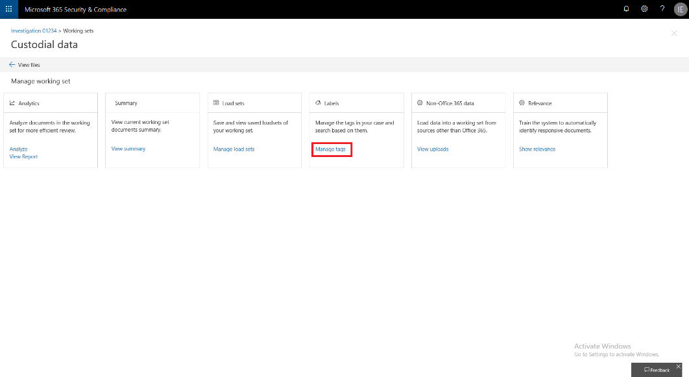
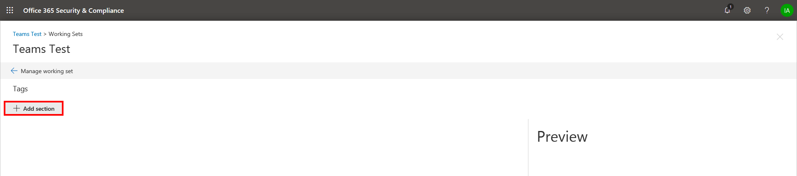

# Erstellen von Taggruppen

Bevor Sie oder andere Personen Dokumente in einem Überprüfungssatz markieren können, müssen die Tags erstellt werden. Dazu können Sie Taggruppen erstellen, die untergeordnete Tags enthalten. Tags werden im Taggingbereich angezeigt, wenn Dokumente in einem Überprüfungssatz überprüft werden.

So erstellen Sie eine Taggruppe:

1.  Klicken Sie in einem Überprüfungssatz auf **Überprüfungssatz verwalten.**

    

2.  Klicken Sie **in der** Kachel Tags auf **Tags verwalten.**

    

Sobald sie sich innerhalb der Tagverwaltung befindet, können Tags erstellt werden, um die Anforderungen Ihres Falls zu erfüllen. Sie können mit dem Erstellen einer Taggruppe beginnen.

1.  Klicken Sie **auf Abschnitt Hinzufügen**.

    

    Der Vorschaubildschirm wird beim Speichern aktualisiert, sodass Sie eine Vorschau des Tagbereichs anzeigen können, ohne den Tagverwaltungsbildschirm schließen zu müssen und zum Arbeitssatz zurück wechseln zu müssen.

2. Geben Sie einen Titel und eine optionale Beschreibung ein. 

3. Klicken Sie zum Erstellen eines Tags in dieser Gruppe auf die Ellipsen in der neuen Taggruppe, um Tags in diesem neuen Abschnitt zu erstellen.
    
    

   - **Optionstags** zwingen Benutzer dazu, ein Tag aus einer Gruppe von Tags auszuwählen.
   
   - **Mit Kontrollkästchentags** können Benutzer eine beliebige Kombination von Tags auswählen. |

## Geschachtelte Tags

Klicken Sie zum Schachteln von Tags auf die Ellipsen neben einem Tag, und wählen Sie dann ein neues hinzuzufügende Tag aus.

