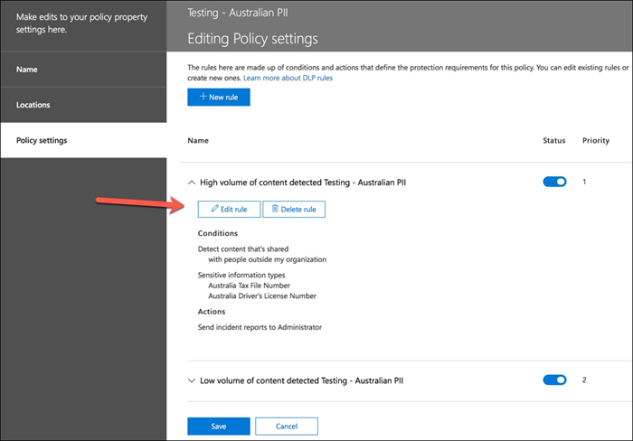
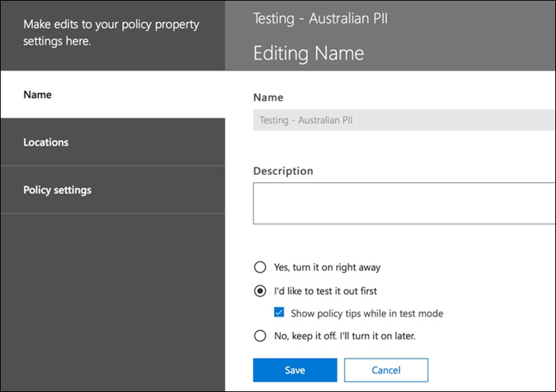
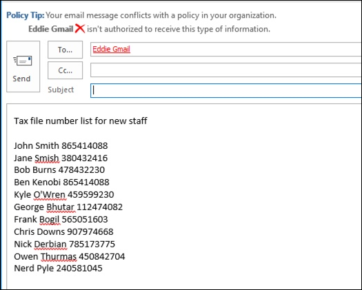

# Erstellen, Testen und Optimieren einer DLP-Richtlinie

Die Verhinderung von Datenverlust (Data Loss Prevention, DLP) hilft Ihnen, die unbeabsichtigte oder versehentliche Freigabe vertraulicher Informationen zu verhindern.

DLP untersucht E-Mail-Nachrichten und -Dateien auf vertrauliche Informationen, z. B. eine Kreditkartennummer. Mithilfe von DLP können Sie vertrauliche Informationen identifizieren und die folgenden Aktionen vorsehen:

- Protokollieren des Ereignisses zu Überwachungszwecken
- Anzeigen einer Warnung für den Endbenutzer, der die E-Mail-Nachricht senden oder die Datei freigeben möchte
- Aktives Blockieren der E-Mail-Nachricht oder der Dateifreigabe

## Berechtigungen

Mitglieder des Kompatibilitätsteams, die DLP-Richtlinien erstellen, benötigen Berechtigungen zum Zugreifen auf das Compliance Center. Standardmäßig hat Ihr Mandantenadministrator Zugriff darauf, compliance officers und anderen Personen Zugriff zu geben. Führen Sie die folgenden Schritte aus:
  
1. Erstellen Sie eine Gruppe in Microsoft 365, und fügen Sie dieser Compliance Officers hinzu.
    
2. Erstellen Sie eine Rollengruppe auf der Seite **Berechtigungen** des Security &amp; Compliance Center. 

3. Verwenden Sie beim Erstellen der Rollengruppe den Abschnitt Rollen **auswählen,** um der Rollengruppe die folgende Rolle **hinzuzufügen: DLP Compliance Management**.
    
4. Verwenden Sie den Abschnitt **Mitglieder auswählen**, um die zuvor erstellte Microsoft 365-Gruppe der Rollengruppe hinzuzufügen.

Verwenden Sie die **Rolle View-Only DLP Compliance Management,** um Rollengruppen mit Nur-Ansicht-Berechtigungen für die DLP-Richtlinien und DLP-Berichte zu erstellen.

Weitere Informationen finden Sie unter [Gewähren des Zugriffs auf das Office 365 Compliance Center](../security/defender-365-security/grant-access-to-the-security-and-compliance-center.md).
  
Diese Berechtigungen sind erforderlich, um eine DLP-Richtlinie zu erstellen und anzuwenden, ohne Richtlinien zu erzwingen.

## Wie vertrauliche Informationen durch DLP erkannt werden

DLP findet vertrauliche Informationen durch einen Musterabgleich mit regulären Ausdrücken (RegEx) in Kombination mit anderen Indikatoren, z. B. der Nähe bestimmter Schlüsselwörter zu den übereinstimmenden Mustern. Beispielsweise hat eine VISA-Kreditkartennummer 16 Ziffern. Diese Ziffern können jedoch auf unterschiedliche Weise geschrieben werden, z. B. 1111-1111-1111-1111, 1111 1111 1111 1111 oder 11111111111.

Jede 16-stellige Zeichenfolge ist nicht unbedingt eine Kreditkartennummer, es kann sich um eine Ticketnummer aus einem Helpdesksystem oder eine Seriennummer eines Hardwareteils handelt. Um eine Kreditkartennummer von einer harmlosen 16-stelligen Zeichenfolge zu unterscheiden wird eine Berechnung (Prüfsumme) durchgeführt, um zu überprüfen, ob die Zahlen dem bekannten Muster eines der verschiedenen Kreditkartenanbieter entsprechen.

Wenn DLP Schlüsselwörter wie "VISA" oder "AMEX" findet, also nahe Datumswerte, die das Ablaufdatum der Kreditkarte sein können, verwendet DLP diese Daten auch, um zu entscheiden, ob es sich bei der Zeichenfolge um eine Kreditkartennummer handelt oder nicht.

Anders ausgedrückt: DLP ist intelligent genug, um den Unterschied zwischen diesen beiden Textzeichenfolgen in einer E-Mail zu erkennen:

- "Können Sie mir einen neuen Laptop bestellen. Verwenden Sie meine VISA-Nummer 1111-1111-1111-1111, ablaufen Sie 22.11., und senden Sie mir das geschätzte Zustellungsdatum, wenn Sie es haben."
- "Meine Laptop serial number is 2222-2222-2222-2222 and it was purchased on 11/2010. Ist mein Reisevisum übrigens noch genehmigt?"

Weitere Informationen finden Sie [unter Entitätsdefinitionen für vertrauliche Informationen,](sensitive-information-type-entity-definitions.md) in der erläutert wird, wie die einzelnen Informationstypen erkannt werden.

## Erste Schritte mit DLP (Verhinderung von Datenverlust)

Wenn die Risiken von Datenverlust nicht ganz offensichtlich sind, ist es schwierig, herauszufinden, wo genau Sie mit der Implementierung von DLP beginnen sollten. Glücklicherweise können DLP-Richtlinien im "Testmodus" ausgeführt werden, sodass Sie ihre Effektivität und Genauigkeit messen können, bevor Sie sie aktivieren.

DLP-Richtlinien für Exchange Online können über das Exchange Admin Center verwaltet werden. Sie können DLP-Richtlinien für alle Arbeitsvorgänge aber auch über das Security & Compliance Center konfigurieren, weshalb ich dies für Demonstrationen in diesem Artikel verwenden werde. Im Security & Compliance Center finden Sie die DLP-Richtlinien unter Richtlinie zur Verhinderung **von**  >  **Datenverlust.** Wählen **Sie Zu startende Richtlinie** erstellen aus.

Microsoft 365 bietet eine Reihe von [DLP-Richtlinienvorlagen,](what-the-dlp-policy-templates-include.md) die Sie zum Erstellen von Richtlinien verwenden können. Nehmen wir an, Sie sind Inhaber eines australischen Unternehmens. Sie können die Vorlagen nach Australien filtern und Finanz-, Medizin- und Gesundheitsschutz sowie Datenschutz auswählen.

Für diese Demonstration wähle ich australische personenbezogene Informationen (PII) aus, welche Informationstypen wie die australische Steuernummer (TFN) sowie die Führerscheinnummer umfassen.

Weisen Sie Ihrer neuen DLP-Richtlinie einen Namen zu. Der Standardname entspricht der DLP-Richtlinienvorlage, Sie sollten jedoch einen aussagekräftigeren Namen auswählen, da mehrere Richtlinien aus derselben Vorlage erstellt werden können.

Wählen Sie die Orte aus, auf die die Richtlinie angewendet werden soll. DLP-Richtlinien können auf Exchange Online, SharePoint Online und OneDrive for Business angewendet werden. Ich werde diese Richtlinie so konfigurieren, dass sie für alle Orte gilt.

Übernehmen Sie im **ersten Einstellungen** nur die Standardwerte. Sie können DLP-Richtlinien anpassen, aber die Standardwerte sind ein feiner Anfangsort.

Nachdem Sie auf Weiter** geklickt haben, erhalten Sie eine zusätzliche Einstellungen mit weiteren Anpassungsoptionen.  Bei einer Richtlinie, die Sie nur testen möchten, können Sie hier einige Anpassungen vornehmen.

- Ich habe die Richtlinientipps vorläufig deaktiviert. Dies ist sinnvoll, wenn Sie nur einen Test durchführen und den Benutzern noch nichts anzeigen möchten. Richtlinientipps zeigen Benutzern Warnungen an, wenn sie dabei sind, gegen eine DLP-Richtlinie zu verstoßen. So wird einem Outlook-Benutzer beispielsweise eine Warnung angezeigt, dass die von ihm angefügte Datei Kreditkartennummern enthält und seine E-Mail deshalb abgelehnt werden wird. Richtlinientipps sollen Richtlinienverletzungen verhindern, bevor diese stattfinden.
- Außerdem habe ich die Anzahl der Instanzen von 10 auf 1 gesenkt, damit diese Richtlinie jede Freigabe von australischen PII-Daten erkennt, und nicht nur die Massenfreigabe der Daten.
- Ich habe zudem einen weiteren Empfänger zur E-Mail-Adresse für Vorfallsberichte hinzugefügt.

Als Letztes habe ich diese Richtlinie so konfiguriert, dass sie zunächst nur im Testmodus ausgeführt wird. Beachten Sie, dass es hier auch eine Option zum Deaktivieren von Richtlinientipps im Testmodus gibt. Auf diese Weise können die Tipps in der Richtlinie aktiviert werden, und Sie können dann entscheiden, ob Sie sie während des Tests anzeigen oder deaktivieren möchten.

Klicken Sie auf der abschließenden Überprüfungsseite auf **Erstellen**, um die Erstellung der Richtlinie abzuschließen.

## Testen einer DLP-Richtlinie

Ihre neue DLP-Richtlinie wird innerhalb ungefähr einer Stunde wirksam. Sie können warten, bis sie durch normale Benutzeraktivitäten ausgelöst wird, oder die Auslösung selbst herbeiführen. Zuvor habe ich mit Entitätsdefinitionen vom Typ "Vertrauliche [Informationen" verknüpft,](sensitive-information-type-entity-definitions.md)die Ihnen Informationen zum Auslösen von DLP-Übereinstimmungen bieten.

Die DLP-Richtlinie, die ich für diesen Artikel erstellt habe, wird beispielsweise australische Steuernummern (TFN) erkennen. Gemäß der Dokumentation basiert der Abgleich auf den folgenden Kriterien:

 
Um die TFN-Erkennung auf ziemlich unverblümte Weise zu veranschaulichen, wird eine E-Mail mit den Wörtern "Steuerdateinummer" und einer 9-stelligen Zeichenfolge in unmittelbarer Nähe ohne Probleme durchgesegelt. Der Grund dafür, dass die DLP-Richtlinie nicht ausgelöst wird, besteht darin, dass die 9-stellige Zeichenfolge die Prüfsumme übergeben muss, die angibt, dass es sich um eine gültige TFN und nicht nur um eine harmlose Zahlenfolge handelt.

Im Vergleich dazu löst eine E-Mail mit den Wörtern "Steuerdateinummer" und einem gültigen TFN, der die Prüfsumme übergibt, die Richtlinie aus. Die TFN, die ich hier verwende, wurde übrigens über eine Website erstellt, die gültige, aber nicht echte TFNs generiert. Solche Websites sind sehr hilfreich, da einer der häufigsten Fehler beim Testen einer DLP-Richtlinie darin besteht, eine gefälschte Zahl zu verwenden, die ungültig ist und deshalb die Prüfsumme nicht zurückgibt (weshalb die Richtlinie auch nicht ausgelöst wird).

Die E-Mail-Berichte zu Vorfällen enthalten den Typ der vertraulichen Informationen, die erkannt wurden, die Anzahl der gefundenen Instanzen und das Konfidenzniveau der Erkennung.

Wenn Sie die DLP-Richtlinie im Testmodus beibehalten und die E-Mailberichte analysieren, können Sie ein Gefühl für die Genauigkeit der DLP-Richtlinie entwickeln und sehen, wie effektiv sie ist, wenn sie durchgesetzt wird. Zusätzlich zu den Vorfallberichten können Sie die [DLP-Berichte](view-the-dlp-reports.md) verwenden, um eine aggregierte Darstellung der Richtlinienübereinstimmungen im gesamten Mandanten anzuzeigen.

## Optimieren einer DLP-Richtlinie

Die Richtlinientreffer könnten Sie dazu veranlassen, einige Anpassungen im Hinblick auf das Verhalten der Richtlinie vorzunehmen. Als einfaches Beispiel: Sie könnten feststellen, dass eine TFN in einer E-Mail kein Problem darstellt (ich denke, dass sie es weiterhin ist, aber sehen wir für dieses Beispiel davon ab), dass jedoch zwei oder mehr Instanzen problematisch sind. Mehrere Instanzen könnten ein riskantes Szenario darstellen, z. B. das eines Mitarbeiters, der einen CSV-Export aus der Mitarbeiter-Datenbank an eine Drittpartei wie etwa einen externen Buchhaltungsdienst per E-Mail sendet. Das ist definitiv etwas, das erkannt und blockiert werden sollte.

Im Security & Compliance Center können Sie das Verhalten einer vorhandenen Richtlinie anpassen.

 
Sie können die Standorteinstellungen so anpassen, dass die Richtlinie nur auf bestimmte Workloads oder auf bestimmte Websites und Konten angewendet wird.

Sie können auch die Richtlinieneinstellungen anpassen und die Regeln so bearbeiten, dass sie Ihren Anforderungen besser entsprechen.

Wenn Sie eine Regel in einer DLP-Richtlinie bearbeiten, können Sie Folgendes ändern:

- Die Bedingungen, einschließlich des Typs und der Anzahl der Instanzen vertraulicher Informationen, durch die die Regel ausgelöst wird.
- Die dann ausgeführten Aktionen wie z. B. das Einschränken des Zugriffs auf die Inhalte.
- Benutzerbenachrichtigungen; dabei handelt es sich um Richtlinientipps, die dem Benutzer in dessen E-Mail-Client oder im Webbrowser angezeigt werden.
- Benutzeraußerkraftsetzungen, mit denen bestimmt wird, ob die Benutzer trotzdem mit dem Versenden der E-Mail oder der Dateifreigabe fortfahren können.
- Vorfallberichte, um Administratoren zu benachrichtigen.

Für diese Demonstration habe ich der Richtlinie Benutzerbenachrichtigungen hinzugefügt (seien Sie vorsichtig, wenn Sie dies ohne ausreichende Benutzerschulung tun), und Benutzern gestattet, die Richtlinie mit einer geschäftlichen Begründung außer Kraft zu setzen, oder indem sie sie als falsch positiv kennzeichnen. Sie können den Text der E-Mail und der Richtlinientipps auch anpassen, wenn Sie z. B. weitere Informationen über die Richtlinien Ihrer Organisation hinzufügen oder die Benutzer auffordern möchten, sich bei Fragen an den Support zu wenden.

Die Richtlinie enthält zwei Regeln für die Behandlung von großen und geringen Mengen, deshalb sollten Sie beide hinsichtlich der gewünschten Aktionen bearbeiten. Dies bietet die Möglichkeit, Fälle abhängig von ihren Merkmalen zu behandeln. Sie könnten z. B. Außerkraftsetzungen für Verstöße im Hinblick auf geringe Mengen zulassen, für Verstöße hinsichtlich großer Mengen hingegen nicht zulassen.

Wenn Sie den Zugriff auf Inhalte, die gegen die Richtlinie verstoßen, blockieren oder einschränken möchten, müssen Sie dazu eine Aktion für die Regel konfigurieren.

Nachdem ich diese Änderungen an den Richtlinieneinstellungen gespeichert habe, muss ich zur Hauptseite "Einstellungen" für die Richtlinie zurückkehren und die Option aktivieren, dass Richtlinientipps für Benutzer angezeigt werden sollen, während sich die Richtlinie im Testmodus befindet. Dies ist eine effektive Möglichkeit, um Ihre Endbenutzer mit DLP-Richtlinien vertraut zu machen, und eignet sich zur Benutzerschulung, ohne zu viele falsch positive Ergebnisse zu riskieren, die sich negativ auf die Mitarbeiterproduktivität auswirken könnten.

Serverseitig (oder cloudseitig) wird die Änderung aufgrund verschiedener Verarbeitungsintervalle möglicherweise nicht sofort wirksam. Wenn Sie eine DLP-Richtlinienänderung vornehmen, durch die neue Richtlinien Tipps für einen Benutzer angezeigt werden, werden diese Änderungen möglicherweise nicht sofort im Benutzer-Outlook-Client wirksam werden, da dieser alle 24 Stunden überprüft, ob es neue Richtlinienänderungen gibt. Wenn Sie die Dinge für den Test beschleunigen möchten, können Sie diesen Registry-Fix verwenden, um den [letzten Downloadzeitstempel aus dem PolicyNudges-Schlüssel zu löschen](https://support.microsoft.com/en-au/help/2823261/changes-to-a-data-loss-prevention-policy-don-t-take-effect-in-outlook?__hstc=18650278.46377037dc0a82baa8a30f0ef07a7b2f.1538687978676.1538693509953.1540315763430.3&__hssc=18650278.1.1540315763430&__hsfp=3446956451). Outlook wird die neuesten Richtlinieninformationen herunterladen, wenn Sie das Programm das nächste Mal starten und mit dem Verfassen einer E-Mail-Nachricht beginnen.

Wenn Richtlinientipps aktiviert sind, werden dem Benutzer diese Tipps in Outlook angezeigt, und er kann Ihnen etwaige falsch positive Fälle melden.

## Untersuchen von falsch positiven Ergebnissen

DLP-Richtlinienvorlagen sind nicht von vornherein perfekt. Es kann vorkommen, dass einige falsch positive Ergebnisse in Ihrer Umgebung auftreten. Deshalb ist es so wichtig, dass Sie eine DLP-Bereitstellung erleichtern, indem Sie sich die Zeit nehmen, Ihre Richtlinien adäquat zu testen und zu optimieren.

Hier sehen Sie ein Beispiel für ein falsch positives Ergebnis. Diese E-Mail ist harmlos. Der Benutzer teilt jemandem lediglich seine Mobiltelefonnummer mit und schließt die eigene E-Mail-Signatur mit ein. 

 
Dem Benutzer wird jedoch ein Richtlinientipp angezeigt mit der Warnung, dass die E-Mail vertrauliche Informationen enthält, nämlich eine australische Führerscheinnummer.

Der Benutzer kann die falsch positiven Informationen melden, und der Administrator kann überprüfen, warum es dazu gekommen ist. Im E-Mail-Bericht zu dem Vorfall wird die E-Mail als falsch positives Ereignis gekennzeichnet.

Dieser Führerscheinfall ist ein gutes Beispiel, das wir uns näher anschauen sollten. Der Grund für dieses falsch positive Ergebnis ist, dass der Typ "Australischer Führerschein" von einer neunstelligen Zeichenfolge ausgelöst wird (auch von einer Zeichenfolge, die Teil einer 10-stelligen Zeichenfolge ist), innerhalb von 300 Zeichen Nähe zu den Schlüsselwörtern "sydney nsw" (keine Groß-/Kleinschreibung). Hier wird sie also durch die Telefonnummer und die E-Mail-Signatur ausgelöst, nur weil der Benutzer zufällig in Sydney ist.

Eine besteht darin, den Informationstyp "australischer Führerschein" aus der Richtlinie zu entfernen. Sie ist darin enthalten, weil sie Teil der DLP-Richtlinienvorlage ist, wir sind jedoch nicht gezwungen, sie zu verwenden. Wenn Sie nur an Steuernummern und nicht an Führerscheinnummern interessiert sind, können Sie diesen Informationstyp einfach entfernen. So können Sie ihn beispielsweise aus der Regel zu geringen Mengen in der Richtlinie entfernen, ihn in der Regel zu großen Mengen hingegen belassen, sodass Listen mehrerer Führerscheinnummern weiterhin erkannt werden.

 
Eine andere Option besteht darin, einfach die Instanzenanzahl zu erhöhen, sodass eine geringe Anzahl von Führerscheinnummern nur dann erkannt wird, wenn mehrere Instanzen vorkommen.

Zusätzlich zum Ändern der Instanzenanzahl können Sie auch die Übereinstimmungsgenauigkeit (oder Konfidenzniveau) anpassen. Wenn Ihr Typ vertraulicher Informationen mehrere Muster aufweist, können Sie die Übereinstimmungsgenauigkeit in Ihrer Regel so anpassen, dass Letztere nur auf bestimmte Muster ausgerichtet ist. Um falsch positive Ergebnisse zu vermeiden, können Sie beispielsweise die Übereinstimmungsgenauigkeit Ihrer Regel so festlegen, dass sie nur dem Muster mit dem höchsten Konfidenzniveau entspricht. Die Berechnung des Konfidenzniveaus ist eine etwas komplexe Angelegenheit (und es zu erklären würde den Rahmen dieses Beitrags sprengen). Hier finden Sie eine gute Erläuterung, [wie Sie das Konfidenzniveau einsetzen können, um Ihre Regeln zu optimieren](data-loss-prevention-policies.md#match-accuracy).

Wenn Sie noch ein wenig weiter fortgeschritten sein möchten, können Sie einen beliebigen vertraulichen Informationstyp anpassen – beispielsweise können Sie "Sydney NSW" aus der Liste der Schlüsselwörter für die Australische Führerscheinnummer [entfernen,](sensitive-information-type-entity-definitions.md#australia-drivers-license-number)um das oben ausgelöste falsch positive Ergebnis zu beseitigen. Informationen dazu mithilfe von XML und PowerShell finden Sie unter Anpassen eines integrierten typs für vertrauliche [Informationen](customize-a-built-in-sensitive-information-type.md).

## Aktivieren einer DLP-Richtlinie

Wenn Ihre DLP-Richtlinie vertrauliche Informationstypen genau und effektiv zu Ihrer Zufriedenheit erkennt und Ihre Endbenutzer ausreichend auf den Umgang mit den Richtlinien vorbereitet sind, können Sie die Richtlinie aktivieren.

 
Wenn Sie darauf warten, dass die Richtlinie wirksam wird, [stellen Sie eine Verbindung mit dem Security & Compliance Center PowerShell](/powershell/exchange/connect-to-scc-powershell) her, und führen Sie das [Get-DlpCompliancePolicy-Cmdlet](/powershell/module/exchange/get-dlpcompliancepolicy) aus, um den DistributionStatus anzuzeigen.

Nachdem Sie die DLP-Richtlinie aktiviert haben, sollten Sie einige eigene abschließende Tests durchführen, um sicherzustellen, dass die erwarteten Richtlinienaktionen auftreten. Wenn Sie Dinge wie Kreditkartendaten testen möchten, finden Sie auf spezifischen Websites Informationen dazu, wie Sie Beispiel-Kreditkarten- oder andere persönliche Informationen generieren können, die die Prüfsummen zurückgeben und Ihre Richtlinien auslösen werden.

Richtlinien, die Benutzern Außerkraftsetzungen gestatten, bieten diese Option im Rahmen des Richtlinientipps.

Richtlinien, die den Zugriff auf Inhalte einschränken, zeigen dem Benutzer die entsprechende Warnung als Teil des Richtlinientipps an und verhindern, dass sie die E-Mail versenden.

## Zusammenfassung

Richtlinien zur Verhinderung von Datenverlust sind für Organisationen aller Art hilfreich. Das Testen einiger DLP-Richtlinien ist aufgrund der Kontrolle, die Sie über Dinge wie Richtlinientipps, Außerkraftsetzungen durch Endbenutzer und Vorfallberichte, eine Übungsmöglichkeit mit geringem Risiko. Sie können in aller Ruhe einige DLP-Richtlinien testen, um zu sehen, welche Art von Verstößen bereits in Ihrer Organisation vorkommen, und dann Richtlinien mit niedrigen falsch positiven Ergebnisraten erstellen, Ihre Benutzer darin schulen, was erlaubt und was nicht zulässig ist, und schließlich Ihre DLP-Richtlinien in der Organisation bereitstellen.