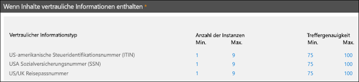

# Benutzerdefinierten Typen vertraulicher Informationen

Microsoft 365 enthält viele einsatzbereite integrierte Typen vertraulicher Informationen, die Sie in Ihrer Organisation nutzen können, wie zum Beispiel zur [Verhinderung vor Datenverlust](data-loss-prevention-policies.md) (DLP) oder mit [Microsoft Cloud App Security](https://docs.microsoft.com/cloud-app-security). Integrierte Typen vertraulicher Informationen helfen beim Erkennen und Schützen von Kreditkartennummern, Bankverbindungsnummern, Reisepassnummern und mehr, basierend auf Mustern, die durch einen regulären Ausdruck (RegEx) oder eine Funktion definiert sind. Weitere Informationen finden Sie unter [Wonach die Typen vertraulicher Informationen suchen](what-the-sensitive-information-types-look-for.md).

Was aber ist, wenn Sie eine andere Art Typ vertraulicher Informationen identifizieren und schützen müssen, zum Beispiel für Mitarbeiter-IDs oder Projektnummern, die ein für Ihre Organisation spezifisches Format verwendet? Hierfür können Sie einen benutzerdefinierten Typ vertraulicher Informationen erstellen.

Die grundlegenden Bestandteile eines benutzerdefinierten Typs für vertrauliche Informationen sind wie folgt:

- **Primäres Muster**: Mitarbeiter-ID-Nummer, Projektnummern usw. Dieses wird in der Regel durch einen regulären Ausdruck (RegEx) gekennzeichnet, kann aber auch eine Liste von Schlüsselwörtern sein.

- **Additional evidence**: Suppose you're looking for a nine-digit employee ID number. Not all nine-digit numbers are employee ID numbers, so you can look for additional text: keywords like "employee", "badge", "ID", or other text patterns based on additional regular expressions. This supporting evidence (also known as _supporting_ or _corroborative_ evidence) increases the likelihood that nine-digit number found in content is really an employee ID number.

- **Character proximity**: It makes sense that the closer the primary pattern and the supporting evidence are to each other, the more likely the detected content is going to be what you're looking for. You can specify the character distance between the primary pattern and the supporting evidence (also known as the _proximity window_) as shown in the following diagram:

    

- **Confidence level**: The more supporting evidence you have, the higher the likelihood that a match contains the sensitive information you're looking for. You can assign higher levels of confidence for matches that are detected by using more evidence.

  When satisfied, a pattern returns a count and confidence level, which you can use in the conditions in your DLP policies. When you add a condition for detecting a sensitive information type to a DLP policy, you can edit the count and confidence level as shown in the following diagram:

    

## Benutzerdefinierte Typen vertraulicher Informationen erstellen

Zum Erstellen von benutzerdefinierten Typen für vertrauliche Informationen im Security & Compliance Center stehen Ihnen mehrere Optionen zur Verfügung:

- **Verwenden von EDM** (NEU!) Erstellen Sie benutzerdefinierte Typen vertraulicher Informationen, basierend auf der Klassifizierung der genauen Datenübereinstimmung (EDM). Mit dieser Methode können Sie anhand einer sicheren Datenbank, die sie regelmäßig aktualisieren können, einen dynamischen Typ vertraulicher Informationen erstellen. Mehr Informationen unter[Erstellen eines benutzerdefinierten Typs vertraulicher Informationen mit genauer Datenübereinstimmungsklassifizierung](create-custom-sensitive-information-types-with-exact-data-match-based-classification.md).

- **Verwenden von PowerShell** Erstellen Sie benutzerdefinierte Typen vertraulicher Informationen mit PowerShell. Diese Methode ist zwar komplexer als die Verwendung der Benutzeroberfläche, Sie haben aber mehr Konfigurationsoptionen. Mehr Informationen unter [Erstellen eines benutzerdefinierten Typs vertraulicher Informationen in Security & Compliance Center PowerShell](create-a-custom-sensitive-information-type-in-scc-powershell.md).

- **Verwenden der Benutzeroberfläche** Erstellen Sie benutzerdefinierte Typen vertraulicher Informationen mit der Benutzeroberfläche des Security & Compliance Centers. Mit dieser Methode können Sie reguläre Ausdrücke, Schlüsselwörter und Schlüsselwörterbücher verwenden. Weitere Informationen finden Sie unter [Erstellen eines benutzerdefinierten Typs vertraulicher Informationen](create-a-custom-sensitive-information-type.md).

