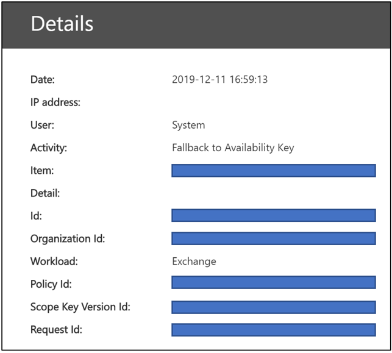

# Erfahren Sie mehr über den Verfügbarkeitsschlüssel für Kundenschlüssel

Der Verfügbarkeitsschlüssel ist ein Stammschlüssel, der automatisch generiert und bereitgestellt wird, wenn Sie eine Datenverschlüsselungsrichtlinie erstellen. Microsoft 365 speichert und schützt den Verfügbarkeitsschlüssel. Der Verfügbarkeitsschlüssel ist funktional wie die beiden Stammschlüssel, die Sie für die Dienstverschlüsselung mit Customer Key bereitstellen. Der Verfügbarkeitsschlüssel umschließt die Schlüssel um eine Ebene weiter unten in der Schlüsselhierarchie. Im Gegensatz zu den Schlüsseln, die Sie in Azure Key Vault bereitstellen und verwalten, können Sie nicht direkt auf den Verfügbarkeitsschlüssel zugreifen. Microsoft 365 automatisierte Dienste den Verfügbarkeitsschlüssel programmgesteuert verwalten. Diese Dienste initiieren automatisierte Vorgänge, die niemals direkten Zugriff auf den Verfügbarkeitsschlüssel erfordern.

Der Hauptzweck des Verfügbarkeitsschlüssels besteht darin, die Wiederherstellungsfunktion nach dem unerwarteten Verlust der von Ihnen verwalteten Stammschlüssel bereitzustellen. Der Verlust kann auf eine fehlgeleitete Verwaltung oder eine böswillige Aktion zurückgeführt werden. Wenn Sie die Kontrolle über Ihre Stammschlüssel verlieren, wenden Sie sich an den Microsoft-Support, und Microsoft unterstützt Sie bei der Wiederherstellung mithilfe des Verfügbarkeitsschlüssels. Sie verwenden den Verfügbarkeitsschlüssel, um zu einer neuen Datenverschlüsselungsrichtlinie mit neuen Stammschlüsseln zu migrieren, die Sie bereitstellen.

Storage und Kontrolle des Verfügbarkeitsschlüssels unterscheiden sich absichtlich aus drei Gründen von azure Key Vault-Schlüsseln:

- Der Verfügbarkeitsschlüssel bietet eine Wiederherstellungsfunktion , "Break-Glass", wenn die Kontrolle über beide Azure Key Vault-Schlüssel verloren geht.
- Die Trennung von logischen Steuerelementen und sicheren Speicherorten bietet eine tiefgehende Verteidigung und schützt vor dem Verlust aller Schlüssel und Ihrer Daten durch einen einzelnen Angriff oder Fehlerpunkt.
- Der Verfügbarkeitsschlüssel bietet eine Hochverfügbarkeitsfunktion, wenn Microsoft 365-Dienste aufgrund vorübergehender Fehler keine in Azure Key Vault gehosteten Schlüssel erreichen können. Diese Regel gilt nur für Exchange Online und Skype for Business Dienstverschlüsselung. SharePoint Online-, OneDrive for Business- und Teams-Dateien verwenden niemals den Verfügbarkeitsschlüssel, es sei denn, Sie weisen Microsoft explizit an, den Wiederherstellungsprozess zu initiieren.

Wenn Sie die Verantwortung zum Schutz Ihrer Daten teilen, indem Sie eine Vielzahl von Schutzmechanismen und Prozessen für die Schlüsselverwaltung verwenden, verringert dies letztendlich das Risiko, dass alle Schlüssel (und damit Ihre Daten) dauerhaft verloren gehen oder zerstört werden. Microsoft bietet Ihnen die alleinige Autorität über die Deaktivierung oder Vernichtung des Verfügbarkeitsschlüssels, wenn Sie den Dienst verlassen. Kein Microsoft-Mitarbeiter hat Zugriff auf den Verfügbarkeitsschlüssel: Er kann nur über einen Microsoft 365-Dienstcode aufgerufen werden.

Weitere Informationen zum Sichern von Schlüsseln finden Sie im [Microsoft Trust Center.](https://www.microsoft.com/trustcenter/Privacy/govt-requests-for-data)
  
## Verwendung von Verfügbarkeitsschlüsseln

Der Verfügbarkeitsschlüssel bietet Wiederherstellungsfunktionen für Szenarien, in denen ein externer Böswilliger oder böswilliger Insider die Kontrolle über Ihren Schlüsseltresor stiehlt oder wenn versehentliche Fehlverwaltung zu einem Verlust von Stammschlüsseln führt. Diese Wiederherstellungsfunktion gilt für alle Microsoft 365 Dienste, die mit Customer Key kompatibel sind. Einzelne Dienste verwenden den Verfügbarkeitsschlüssel unterschiedlich. Microsoft 365 verwendet den Verfügbarkeitsschlüssel nur auf die unten beschriebene Weise.

### verwendung von Exchange Online und Skype for Business

Zusätzlich zur Wiederherstellungsfunktion verwenden Exchange Online und Skype for Business den Verfügbarkeitsschlüssel, um die Datenverfügbarkeit während vorübergehender oder zeitweiliger Betriebsprobleme im Zusammenhang mit dem Dienst, der auf Stammschlüssel zugreift, sicherzustellen. Wenn der Dienst aufgrund vorübergehender Fehler keinen Ihrer Kundenschlüssel in Azure Key Vault erreichen kann, verwendet der Dienst automatisch den Verfügbarkeitsschlüssel. Der Dienst wechselt NIE direkt zum Verfügbarkeitsschlüssel.

Automatisierte Systeme in Exchange Online und Skype for Business können den Verfügbarkeitsschlüssel während vorübergehender Fehler verwenden, um automatisierte Back-End-Dienste wie Virenschutz, E-Discovery, Verhinderung von Datenverlust, Postfachverschiebung und Datenindizierung zu unterstützen.

### SharePoint Online-, OneDrive for Business- und Teams-Dateien verwendet

Für SharePoint Online-, OneDrive for Business- und Teams-Dateien wird der Verfügbarkeitsschlüssel NIEMALS außerhalb der Wiederherstellungsfunktion verwendet, und Kunden müssen Microsoft explizit anweisen, die Verwendung des Verfügbarkeitsschlüssels während eines Wiederherstellungsszenarios zu initiieren. Automatisierte Dienstvorgänge basieren ausschließlich auf Ihren Kundenschlüsseln im Azure Key Vault. Ausführliche Informationen zur Funktionsweise der Schlüsselhierarchie für diese Dienste finden Sie unter [Wie SharePoint Online-, OneDrive for Business- und Teams-Dateien den Verfügbarkeitsschlüssel verwenden.](#how-sharepoint-online-onedrive-for-business-and-teams-files-use-the-availability-key)

## Sicherheit des Verfügbarkeitsschlüssels

Microsoft teilt die Verantwortung für den Datenschutz mit Ihnen, indem der Verfügbarkeitsschlüssel instanziiert wird und umfassende Maßnahmen zum Schutz ergriffen werden. Microsoft macht kunden keine direkte Kontrolle über den Verfügbarkeitsschlüssel verfügbar. Sie können beispielsweise nur die Schlüssel, die Sie besitzen, in Azure Key Vault rollen (drehen). Weitere Informationen finden Sie unter [Rollieren oder Drehen eines Kundenschlüssels oder eines Verfügbarkeitsschlüssels.](customer-key-availability-key-roll.md)

### Geheime Verfügbarkeitsschlüsselspeicher

Microsoft schützt Verfügbarkeitsschlüssel in zugriffsgesteuerten, internen geheimen Stores wie dem kundenorientierten Azure Key Vault. Wir implementieren Zugriffssteuerungen, um zu verhindern, dass Microsoft-Administratoren direkt auf die darin enthaltenen geheimen Schlüssel zugreifen. Geheime Store Vorgänge, einschließlich Schlüsselrotation und -löschung, erfolgen über automatisierte Befehle, die niemals direkten Zugriff auf den Verfügbarkeitsschlüssel erfordern. Verwaltungsvorgänge für geheime Speicher sind auf bestimmte Techniker beschränkt und erfordern eine Berechtigungseskalation über ein internes Tool, Lockbox. Die Berechtigungseskalation erfordert die Genehmigung und Begründung des Vorgesetzten, bevor sie gewährt wird. Lockbox stellt sicher, dass der Zugriff mit automatischer Zugriffssperrung nach Ablauf der Zeit gebunden ist, oder Techniker melden sich ab.

**Exchange Online und Skype for Business** Verfügbarkeitsschlüssel werden in einem Exchange Online geheimen Active Directory-Speicher gespeichert. Verfügbarkeitsschlüssel werden sicher in mandantenspezifischen Containern innerhalb des Active Directory-Domänencontrollers gespeichert. Dieser sichere Speicherort ist vom SharePoint Online-, OneDrive for Business- und Teams geheimen Dateispeicher getrennt und isoliert.

**SharePoint Verfügbarkeitsschlüssel für Online-, OneDrive for Business- und Teams Dateien** werden in einem internen geheimen Speicher gespeichert, der vom Serviceteam verwaltet wird. Dieser gesicherte, geheime Speicherdienst verfügt über Front-End-Server mit Anwendungsendpunkten und einem SQL-Datenbank als Back-End. Verfügbarkeitsschlüssel werden im SQL-Datenbank gespeichert und von Verschlüsselungsschlüsseln für geheime Speicher umschlossen (verschlüsselt), die eine Kombination aus AES-256 und HMAC verwenden, um den ruhenden Verfügbarkeitsschlüssel zu verschlüsseln. Die Verschlüsselungsschlüssel für den geheimen Speicher werden in einer logisch isolierten Komponente desselben SQL-Datenbank gespeichert und mit RSA-2048-Schlüsseln verschlüsselt, die in Zertifikaten enthalten sind, die von der Microsoft-Zertifizierungsstelle verwaltet werden. Diese Zertifikate werden auf den Front-End-Servern des geheimen Speichers gespeichert, die Vorgänge für die Datenbank ausführen.

### Tiefenschutz

Microsoft verwendet eine umfassende Verteidigungsstrategie, um zu verhindern, dass böswillige Akteure die Vertraulichkeit, Integrität oder Verfügbarkeit von in der Microsoft-Cloud gespeicherten Kundendaten beeinträchtigen. Im Rahmen der übergeordneten Sicherheitsstrategie werden spezifische präventive und erkennungsbezogene Kontrollen implementiert, um den geheimen Speicher und den Verfügbarkeitsschlüssel zu schützen.

Microsoft 365 wurde entwickelt, um einen Missbrauch des Verfügbarkeitsschlüssels zu verhindern. Die Anwendungsebene ist die einzige Methode, mit der Schlüssel, einschließlich des Verfügbarkeitsschlüssels, zum Verschlüsseln und Entschlüsseln von Daten verwendet werden können. Nur Microsoft 365 Dienstcode kann die Schlüsselhierarchie für Verschlüsselungs- und Entschlüsselungsaktivitäten interpretieren und durchlaufen. Zwischen den Speicherorten von Kundenschlüsseln, Verfügbarkeitsschlüsseln, anderen hierarchischen Schlüsseln und Kundendaten besteht eine logische Isolation. Diese Isolation verringert das Risiko einer Datenexposition für den Fall, dass ein oder mehrere Speicherorte kompromittiert werden. Jede Ebene in der Hierarchie verfügt über integrierte 24 x 7-Angriffserkennungsfunktionen, um gespeicherte Daten und geheime Schlüssel zu schützen.

Zugriffssteuerungen werden implementiert, um nicht autorisierten Zugriff auf interne Systeme zu verhindern, einschließlich der Verfügbarkeit geheimer Schlüsselspeicher. Microsoft-Techniker haben keinen direkten Zugriff auf die Geheimen Verfügbarkeitsschlüsselspeicher. Weitere Informationen zu Zugriffssteuerungen finden Sie [unter "Administrative Zugriffssteuerungen" in Microsoft 365.](/compliance/office-365-administrative-access-controls-overview)

Technische Kontrollen verhindern, dass sich Microsoft-Mitarbeiter bei Dienstkonten mit hoher Berechtigung anmelden, die andernfalls von Angreifern verwendet werden können, um Microsoft-Dienste zu imitieren. Diese Steuerelemente verhindern beispielsweise die interaktive Anmeldung.

Sicherheitsprotokollierungs- und Überwachungskontrollen sind ein weiterer schutzeinschwacher Schutz, der das Risiko für Microsoft-Dienste und Ihre Daten verringert. Microsoft-Serviceteams haben aktive Überwachungslösungen bereitgestellt, die Warnungen und Überwachungsprotokolle generieren. Alle Serviceteams laden ihre Protokolle in ein zentrales Repository hoch, in dem die Protokolle aggregiert und verarbeitet werden. Interne Tools überprüfen Datensätze automatisch, um zu bestätigen, dass Dienste in einem optimalen, ausfallsicheren und sicheren Zustand funktionieren. Ungewöhnliche Aktivitäten werden zur weiteren Überprüfung gekennzeichnet.

Jedes Protokollereignis, das auf einen potenziellen Verstoß gegen die Microsoft-Sicherheitsrichtlinie hinweist, wird den Microsoft-Sicherheitsteams sofort zur Kenntnis gebracht. Microsoft 365 Sicherheit hat Warnungen konfiguriert, um versuchten Zugriff auf geheime Verfügbarkeitsschlüsselspeicher zu erkennen. Warnungen werden auch generiert, wenn Microsoft-Mitarbeiter versuchen, sich bei Dienstkonten interaktiv zu anmelden, was verboten und durch Zugriffssteuerungen geschützt ist. Microsoft 365 Sicherheit erkennt und warnt auch bei Abweichungen des Microsoft 365 Diensts von normalen Basisvorgängen. Übestäter, die versuchen, Microsoft 365 Dienste zu missbrauchen, würden Warnungen auslösen, die zu einer Benachrichtigung des Angreifers aus der Microsoft-Cloudumgebung führten.

## Verwenden des Verfügbarkeitsschlüssels zum Wiederherstellen nach Schlüsselverlust

Wenn Sie die Kontrolle über Ihre Kundenschlüssel verlieren, bietet Ihnen der Verfügbarkeitsschlüssel die Möglichkeit, Ihre Daten wiederherzustellen und erneut zu verschlüsseln.

### Wiederherstellungsverfahren für Exchange Online und Skype for Business

Wenn Sie die Kontrolle über Ihre Kundenschlüssel verlieren, bietet Ihnen der Verfügbarkeitsschlüssel die Möglichkeit, Ihre Daten wiederherzustellen und Ihre betroffenen Microsoft 365 Ressourcen wieder online zu schalten. Der Verfügbarkeitsschlüssel schützt Ihre Daten während der Wiederherstellung weiterhin. Auf hoher Ebene müssen Sie eine neue DEP erstellen und betroffene Ressourcen in die neue Richtlinie verschieben, um den Schlüsselverlust vollständig zu beheben.

Um Ihre Daten mit neuen Kundenschlüsseln zu verschlüsseln, erstellen Sie neue Schlüssel in Azure Key Vault, erstellen Sie eine neue Datenverschlüsselungsrichtlinie mithilfe der neuen Kundenschlüssel, und weisen Sie die neue Datenverschlüsselungsrichtlinie den Postfächern zu, die derzeit mit der vorherigen Datenverschlüsselungsrichtlinie verschlüsselt sind, für die die Schlüssel verloren gegangen oder kompromittiert wurden.

Dieser Erneute Verschlüsselungsprozess kann bis zu 72 Stunden dauern. Dies ist die Standarddauer, wenn Sie eine DeP ändern.
  
### Wiederherstellungsverfahren für SharePoint Online-, OneDrive for Business- und Teams dateien

Für SharePoint Online-, OneDrive for Business- und Teams dateien wird der Verfügbarkeitsschlüssel NIEMALS außerhalb der Wiederherstellungsfunktion verwendet. Sie müssen Microsoft explizit anweisen, die Verwendung des Verfügbarkeitsschlüssels während eines Wiederherstellungsszenarios zu initiieren. Um den Wiederherstellungsprozess zu initiieren, wenden Sie sich an Microsoft, um den Verfügbarkeitsschlüssel zu aktivieren. Nach der Aktivierung wird der Verfügbarkeitsschlüssel automatisch verwendet, um Ihre Daten zu entschlüsseln, sodass Sie die Daten mit einer neu erstellten DATENverschlüsselungsrichtlinie (DEP) verschlüsseln können, die neuen Kundenschlüsseln zugeordnet ist.  

Dieser Vorgang ist proportional zur Anzahl der Websites in Ihrer Organisation. Nachdem Sie Microsoft aufgerufen haben, um den Verfügbarkeitsschlüssel zu verwenden, sollten Sie innerhalb von ca. vier Stunden vollständig online sein.

## Verwenden des Verfügbarkeitsschlüssels durch Exchange Online und Skype for Business

Wenn Sie eine Datenverschlüsselungsrichtlinie (DEP) mit Customer Key erstellen, generiert Microsoft 365 einen Datenverschlüsselungsrichtlinienschlüssel (DATA Encryption Policy Key, DEP-Schlüssel), der diesem DEP zugeordnet ist. Der Dienst verschlüsselt den DEP-Schlüssel dreimal: einmal mit jedem Kundenschlüssel und einmal mit dem Verfügbarkeitsschlüssel. Es werden nur die verschlüsselten Versionen des DEP-Schlüssels gespeichert, und ein DEP-Schlüssel kann nur mit den Kundenschlüsseln oder dem Verfügbarkeitsschlüssel entschlüsselt werden. Der DEP-Schlüssel wird dann zum Verschlüsseln von Postfachschlüsseln verwendet, die einzelne Postfächer verschlüsseln.
  
Microsoft 365 folgt diesem Prozess, um Daten zu entschlüsseln und bereitzustellen, wenn Kunden den Dienst verwenden:
  
1. Entschlüsseln Sie den DEP-Schlüssel mithilfe des Kundenschlüssels.

2. Verwenden Sie den entschlüsselten DEP-Schlüssel, um einen Postfachschlüssel zu entschlüsseln.

3. Verwenden Sie den entschlüsselten Postfachschlüssel, um das Postfach selbst zu entschlüsseln, sodass Sie auf die Daten innerhalb des Postfachs zugreifen können.

## So verwenden SharePoint Online-, OneDrive for Business- und Teams dateien den Verfügbarkeitsschlüssel

Die Architektur und Implementierung von SharePoint Online und OneDrive for Business für Kundenschlüssel und Verfügbarkeitsschlüssel unterscheiden sich von Exchange Online und Skype for Business.
  
Wenn eine Organisation zu vom Kunden verwalteten Schlüsseln wechselt, erstellt Microsoft 365 einen organisationsspezifischen Zwischenschlüssel (TIK). Microsoft 365 verschlüsselt die TIK zweimal, einmal mit jedem Kundenschlüssel, und speichert die beiden verschlüsselten Versionen der TIK. Es werden nur die verschlüsselten Versionen der TIK gespeichert, und eine TIK kann nur mit den Kundenschlüsseln entschlüsselt werden. Die TIK wird dann zum Verschlüsseln von Websiteschlüsseln verwendet, die dann zum Verschlüsseln von BLOB-Schlüsseln (auch als Dateiabschnittsschlüssel bezeichnet) verwendet werden. Je nach Dateigröße kann der Dienst eine Datei in mehrere Dateiblöcke mit jeweils einem eindeutigen Schlüssel aufteilen. Die Blobs (Dateiblöcke) selbst werden mit den Blobschlüsseln verschlüsselt und im Microsoft Azure Blobspeicherdienst gespeichert.
  
Microsoft 365 folgt diesem Prozess, um Kundendateien zu entschlüsseln und bereitzustellen, wenn Kunden den Dienst verwenden:

1. Entschlüsseln Sie die TIK mithilfe des Kundenschlüssels.

2. Verwenden Sie die entschlüsselte TIK, um einen Websiteschlüssel zu entschlüsseln.

3. Verwenden Sie den entschlüsselten Websiteschlüssel, um einen BLOB-Schlüssel zu entschlüsseln.

4. Verwenden Sie den entschlüsselten BLOB-Schlüssel, um das Blob zu entschlüsseln.

Microsoft 365 entschlüsselt eine TIK, indem sie zwei Entschlüsselungsanforderungen an Azure Key Vault mit einem geringen Offset ausgibt. Der erste, der fertig gestellt wird, liefert das Ergebnis, wodurch die andere Anforderung abgebrochen wird.
  
Wenn Sie den Zugriff auf Ihre Kundenschlüssel verlieren, verschlüsselt Microsoft 365 auch die TIK mit einem Verfügbarkeitsschlüssel und speichert diese zusammen mit den TIKs, die mit jedem Kundenschlüssel verschlüsselt sind. Die mit dem Verfügbarkeitsschlüssel verschlüsselte TIK wird nur verwendet, wenn der Kunde Microsoft aufruft, um den Wiederherstellungspfad einzugeben, wenn er den Zugriff auf seine Schlüssel verloren hat( böswillig oder versehentlich).
  
Aus Gründen der Verfügbarkeit und Skalierung werden entschlüsselte TIKs in einem zeitlich begrenzten Speichercache zwischengespeichert. Zwei Stunden, bevor ein TIK-Cache ablaufen soll, versucht Microsoft 365, die einzelnen TIK-Elemente zu entschlüsseln. Durch das Entschlüsseln der TIKs wird die Lebensdauer des Caches verlängert. Wenn die TIK-Entschlüsselung für einen erheblichen Zeitraum fehlschlägt, generiert Microsoft 365 eine Warnung, um die Technik vor dem Ablauf des Caches zu benachrichtigen. Nur wenn der Kunde Microsoft aufruft, wird Microsoft 365 den Wiederherstellungsvorgang initiieren, der die Entschlüsselung der TIK mit dem im geheimen Microsoft-Speicher gespeicherten Verfügbarkeitsschlüssel und das erneute Onboarding des Mandanten mithilfe der entschlüsselten TIK und eines neuen Satzes von vom Kunden bereitgestellten Azure Key Vault-Schlüsseln umfasst.
  
Ab heute ist Customer Key an der Verschlüsselungs- und Entschlüsselungskette von SharePoint Online-Dateidaten beteiligt, die im Azure Blob Store gespeichert sind, jedoch nicht SharePoint Online-Listenelemente oder Metadaten, die im SQL-Datenbank gespeichert sind. Microsoft 365 verwendet nicht den Verfügbarkeitsschlüssel für Exchange Online-, Skype for Business-, SharePoint Online-, OneDrive for Business- und Teams dateien außer dem oben beschriebenen Fall, der vom Kunden initiiert wird. Der menschliche Zugriff auf Kundendaten wird durch Kunden-Lockbox geschützt.

## Trigger für Verfügbarkeitsschlüssel

Microsoft 365 löst den Verfügbarkeitsschlüssel nur unter bestimmten Umständen aus. Diese Umstände unterscheiden sich je nach Dienst.

### Trigger für Exchange Online und Skype for Business
  
1. Microsoft 365 liest den DeP, dem das Postfach zugewiesen ist, um den Speicherort der beiden Kundenschlüssel in Azure Key Vault zu ermitteln.

2. Microsoft 365 wählt zufällig einen der beiden Kundenschlüssel aus dem Dep aus und sendet eine Anforderung an Azure Key Vault, den DEP-Schlüssel mithilfe des Kundenschlüssels zu entpacken.

3. Wenn die Anforderung zum Entpacken des DEP-Schlüssels mithilfe des Kundenschlüssels fehlschlägt, sendet Microsoft 365 eine zweite Anforderung an Azure Key Vault, wobei dieses Mal angewiesen wird, den alternativen (zweiten) Kundenschlüssel zu verwenden.

4. Wenn die zweite Anforderung zum Entpacken des DEP-Schlüssels mithilfe des Kundenschlüssels fehlschlägt, überprüft Microsoft 365 die Ergebnisse beider Anforderungen.

    - Wenn die Untersuchung feststellt, dass die Anforderungen fehlgeschlagen sind, wird ein SystemFEHLER zurückgegeben:

       - Microsoft 365 löst den Verfügbarkeitsschlüssel aus, um den DEP-Schlüssel zu entschlüsseln.

       - Microsoft 365 verwendet dann den DEP-Schlüssel, um den Postfachschlüssel zu entschlüsseln und die Benutzeranforderung abzuschließen. 

       - In diesem Fall kann Azure Key Vault aufgrund eines vorübergehenden FEHLERs nicht reagieren oder nicht erreichbar sein.

    - Wenn die Prüfung feststellt, dass bei der Rückgabe von ACCESS DENIED für die Anforderungen ein Fehler aufgetreten ist:

       - Dies bedeutet, dass absichtliche, unbeabsichtigte oder böswillige Maßnahmen ergriffen wurden, um die Kundenschlüssel nicht verfügbar zu machen (z. B. während des Datenlöschvorgangs im Rahmen des Verlassens des Diensts).

       - In diesem Fall wird der Verfügbarkeitsschlüssel nur für Systemaktionen und nicht für Benutzeraktionen verwendet, die Benutzeranforderung schlägt fehl, und der Benutzer erhält eine Fehlermeldung.

> [!IMPORTANT]
> Microsoft 365 Dienstcode verfügt immer über ein gültiges Anmeldetoken, um Kundendaten zur Bereitstellung von Mehrwert-Clouddiensten zu verwenden. Daher kann er bis zum Löschen des Verfügbarkeitsschlüssels als Fallback für Aktionen verwendet werden, die von Exchange Online und Skype for Business initiiert wurden, z. B. die Erstellung von Suchindex oder das Verschieben von Postfächern. Dies gilt sowohl für vorübergehende FEHLER als auch für ACCESS DENIED-Anforderungen an Azure Key Vault.

### Trigger für SharePoint Online-, OneDrive for Business- und Teams dateien

Für SharePoint Online-, OneDrive for Business- und Teams-Dateien wird der Verfügbarkeitsschlüssel NIEMALS außerhalb der Wiederherstellungsfunktion verwendet, und Kunden müssen Microsoft explizit anweisen, die Verwendung des Verfügbarkeitsschlüssels während eines Wiederherstellungsszenarios zu initiieren.

## Überwachungsprotokolle und verfügbarkeitsschlüssel

Automatisierte Systeme in Microsoft 365 alle Daten verarbeiten, während sie durch das System fließen, um Clouddienste bereitzustellen, z. B. Antivirensoftware, E-Discovery, Verhinderung von Datenverlust und Datenindizierung. Microsoft 365 generiert keine vom Kunden sichtbaren Protokolle für diese Aktivität. Darüber hinaus greifen Microsoft-Mitarbeiter im Rahmen dieses normalen Systembetriebs nicht auf Ihre Daten zu.

### Exchange Online und Skype for Business Verfügbarkeitsschlüsselprotokollierung

Wenn Exchange Online und Skype for Business auf den Verfügbarkeitsschlüssel zur Bereitstellung von Diensten zugreifen, veröffentlicht Microsoft 365 vom Security & Compliance Center aus sichtbare Protokolle, auf die der Kunde zugreifen kann. Jedes Mal, wenn der Dienst den Verfügbarkeitsschlüssel verwendet, wird ein Überwachungsprotokolleintrag für den Verfügbarkeitsschlüsselvorgang generiert. Ein neuer Datensatztyp namens "Customer Key Service Encryption" mit dem Aktivitätstyp "Fallback to Availability Key" ermöglicht Administratoren das Filtern von Suchergebnissen im [einheitlichen Überwachungsprotokoll,](./search-the-audit-log-in-security-and-compliance.md) um Verfügbarkeitsschlüsseldatensätze anzuzeigen.

Protokolleinträge umfassen Attribute wie Datum, Uhrzeit, Aktivität, Organisations-ID und Datenverschlüsselungsrichtlinien-ID. Der Datensatz ist als Teil der einheitlichen Überwachungsprotokolle verfügbar und kann über die Registerkarte "Überwachungsprotokollsuche im Security & Compliance Center" abgerufen werden.

Exchange Online und Skype for Business Verfügbarkeitsschlüsseldatensätze verwenden das [allgemeine Schema](/office/office-365-management-api/office-365-management-activity-api-schema#common-schema) Office 365 Verwaltungsaktivität mit hinzugefügten benutzerdefinierten Parametern: Richtlinien-ID, Bereichsschlüsselversions-ID und Anforderungs-ID.

### SharePoint Protokollierung von Verfügbarkeitsschlüsseln für Online-, OneDrive for Business- und Teams-Dateien

Die Protokollierung von Verfügbarkeitsschlüsseln ist für diese Dienste noch nicht verfügbar. Bei SharePoint Online-, OneDrive for Business- und Teams-Dateien wird der Verfügbarkeitsschlüssel nur von Microsoft aktiviert, wenn Sie von Ihnen angewiesen werden, um wiederherstellungsbedingt. Daher kennen Sie bereits jedes Ereignis, in dem der Verfügbarkeitsschlüssel für diese Dienste verwendet wird.

## Verfügbarkeitsschlüssel in der Kundenschlüsselhierarchie
  
Microsoft 365 verwendet den Verfügbarkeitsschlüssel, um die Schlüsselebene weiter unten in der Schlüsselhierarchie einzuschließen, die für die Customer Key-Dienstverschlüsselung eingerichtet wurde. Zwischen Diensten gibt es unterschiedliche Schlüsselhierarchien. Schlüsselalgorithmen unterscheiden sich auch zwischen Verfügbarkeitsschlüsseln und anderen Schlüsseln in der Hierarchie jedes anwendbaren Diensts. Die von den verschiedenen Diensten verwendeten Verfügbarkeitsschlüsselalgorithmen sind wie folgt:

- Die Verfügbarkeitsschlüssel Exchange Online und Skype for Business verwenden AES-256.

- Die Verfügbarkeitsschlüssel für SharePoint Online-, OneDrive for Business- und Teams-Dateien verwenden RSA-2048.

### Verschlüsselungschiffren zum Verschlüsseln von Schlüsseln für Exchange Online und Skype for Business

### Verschlüsselungschiffren zum Verschlüsseln von Schlüsseln für SharePoint Online und OneDrive for Business

## Verwandte Artikel

- [Dienstverschlüsselung mit Kundenschlüssel](customer-key-overview.md)

- [Einrichten des Kundenschlüssels](customer-key-set-up.md)

- [Verwalten des Kundenschlüssels](customer-key-manage.md)

- [Rollen oder Drehen eines Kundenschlüssels oder eines Verfügbarkeitsschlüssels](customer-key-availability-key-roll.md)