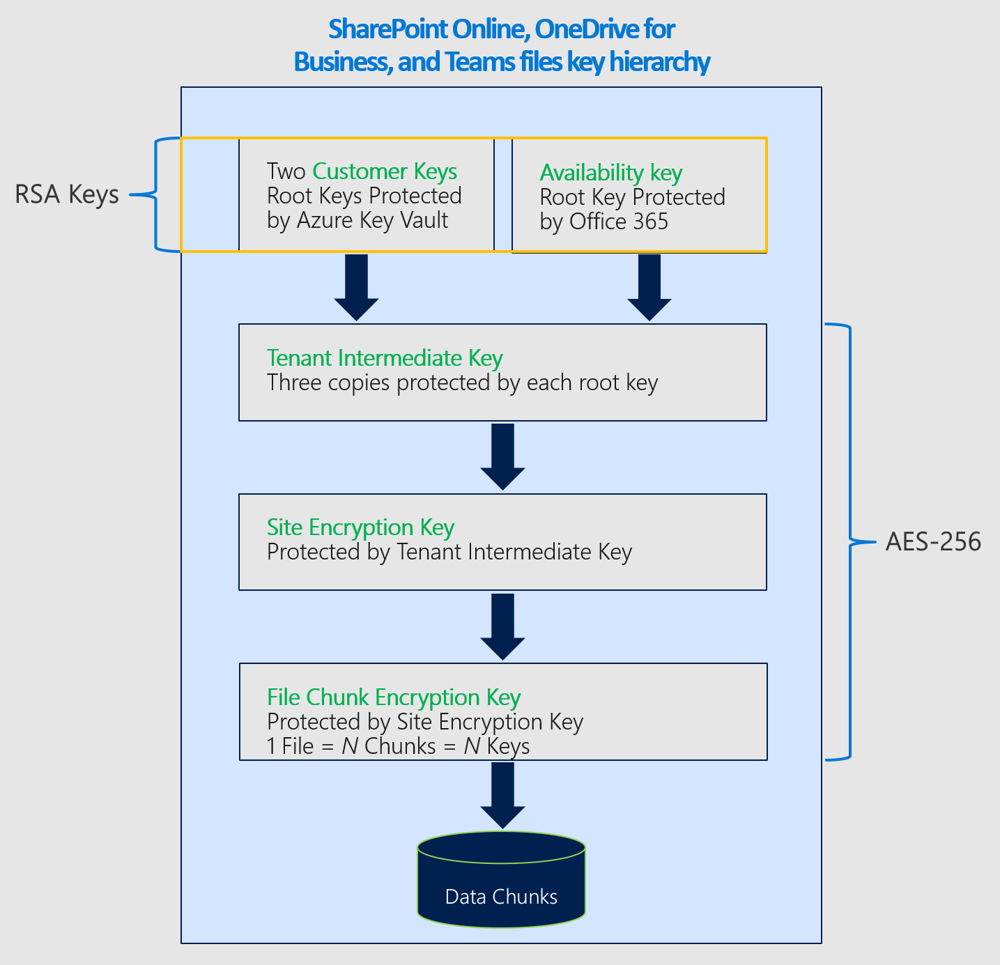

# Dienstverschlüsselung mit Kundenschlüssel

Microsoft 365 bietet eine grundlegende Verschlüsselung auf Volumeebene, die über BitLocker und Distributed Key Manager (DKM) aktiviert ist. Microsoft 365 bietet eine zusätzliche Verschlüsselungsebene für Ihre Inhalte. Dieser Inhalt enthält Daten aus Exchange Online, Skype for Business, SharePoint Online, OneDrive for Business und Microsoft Teams.

## Zusammenarbeit von Dienstverschlüsselung, BitLocker und Kundenschlüsseln

Ihre Daten werden immer im ruhen im dienst Microsoft 365 mit BitLocker und DKM verschlüsselt. Weitere Informationen finden Sie unter [How Exchange Online secures your email secrets](exchange-online-secures-email-secrets.md). Customer Key bietet zusätzlichen Schutz vor der Anzeige von Daten durch nicht autorisierte Systeme oder Mitarbeiter und ergänzt BitLocker Datenträgerverschlüsselung in Microsoft Rechenzentren. Die Dienstverschlüsselung soll nicht verhindern, dass Microsoft-Mitarbeiter auf Ihre Daten zugreifen. Stattdessen hilft Ihnen der Customer Key bei der Erfüllung gesetzlicher oder Complianceverpflichtungen für die Steuerung von Stammschlüsseln. Sie autorisieren Microsoft 365 ausdrücklich, Ihre Verschlüsselungsschlüssel zu verwenden, um mehrwertige Clouddienste wie eDiscovery, Anti-Malware, Antispam, Suchindizierung und so weiter zur Verfügung zu stellen.

Der Kundenschlüssel baut auf der Dienstverschlüsselung auf und ermöglicht ihnen die Bereitstellung und Steuerung von Verschlüsselungsschlüsseln. Microsoft 365 verwendet dann diese Schlüssel, um Ihre Ruhedaten zu verschlüsseln, wie in den [Onlinedienstbedingungen (OST) beschrieben.](https://www.microsoft.com/licensing/product-licensing/products.aspx) Customer Key hilft Ihnen bei der Einhaltung von Complianceverpflichtungen, da Sie die Verschlüsselungsschlüssel steuern, die Microsoft 365 zum Verschlüsseln und Entschlüsseln von Daten verwendet werden.
  
Customer Key verbessert die Fähigkeit Ihrer Organisation, die Anforderungen der Complianceanforderungen zu erfüllen, die wichtige Vereinbarungen mit dem Clouddienstanbieter angeben. Mit dem Kundenschlüssel stellen Sie die Stammverschlüsselungsschlüssel für Ihre Microsoft 365 ruhen auf Anwendungsebene zur Verfügung und steuern sie. Dies hat zur Folge, dass Sie die Kontrolle über die Schlüssel Ihrer Organisation ausüben.

## Customer Key mit Hybridbereitstellungen

Der Kundenschlüssel verschlüsselt nur ruhende Daten in der Cloud. Der Kundenschlüssel funktioniert nicht, um Ihre lokalen Postfächer und Dateien zu schützen. Sie können Ihre lokalen Daten mithilfe einer anderen Methode verschlüsseln, z. B. BitLocker.

## Informationen zu Datenverschlüsselungsrichtlinien

Eine Datenverschlüsselungsrichtlinie (Data Encryption Policy, DEP) definiert die Verschlüsselungshierarchie. Diese Hierarchie wird vom Dienst verwendet, um Daten mit jedem verwalteten Schlüssel und dem verfügbarkeitsschlüssel zu verschlüsseln, der von Microsoft geschützt ist. Sie erstellen DEPs mithilfe von PowerShell-Cmdlets und weisen diese DEPs dann zum Verschlüsseln von Anwendungsdaten zu. Es gibt drei Typen von DEPs, die von Microsoft 365 Customer Key unterstützt werden. Jeder Richtlinientyp verwendet unterschiedliche Cmdlets und bietet Eine Abdeckung für einen anderen Datentyp. Zu den DEPs, die Sie definieren können, gehören:

**DEP für mehrere Microsoft 365 Arbeitsauslastungen** Diese DEPs verschlüsseln Daten über mehrere M365-Workloads für alle Benutzer innerhalb des Mandanten. Zu diesen Arbeitsauslastungen gehören:

- Teams Chatnachrichten (1:1-Chats, Gruppenchats, Besprechungschats und Kanalunterhaltungen)
- Teams (Bilder, Codeausschnitte, Videonachrichten, Audionachrichten, Wiki-Bilder)
- Teams von Anruf- und Besprechungsaufzeichnungen, die im Teams gespeichert sind
- Teams Chatbenachrichtigungen
- Teams von Cortana
- Teams Statusmeldungen
- Benutzer- und Signalinformationen für Exchange Online
- Exchange Online Postfächer, die nicht bereits von Postfach-DEPs verschlüsselt wurden
- #A0 (EDM)-Daten – (Datendateischemas, Regelpakete und die zum Hashen der vertraulichen Daten verwendeten Salts).
  Für EDM (EDM) und Microsoft Teams verschlüsselt die DEP mit mehreren Arbeitsauslastungen neue Daten ab dem Zeitpunkt, zu dem Sie die DEP dem Mandanten zuweisen. Für Exchange Online werden mit dem Kundenschlüssel alle vorhandenen und neuen Daten verschlüsselt.

DePs mit mehreren Arbeitsauslastungen verschlüsseln die folgenden Datentypen nicht. Stattdessen verwendet Microsoft 365 andere Verschlüsselungstypen, um diese Daten zu schützen.

- SharePoint und OneDrive for Business Daten.
- Microsoft Teams dateien und einige Teams Anruf- und Besprechungsaufzeichnungen, die in OneDrive for Business und SharePoint Online gespeichert sind, werden mithilfe der SharePoint Online-DEP verschlüsselt.
- Andere Microsoft 365, z. B. Yammer und Planner, die derzeit nicht vom Kundenschlüssel unterstützt werden.
- Teams Liveereignisse und Fragen&A in Liveereignissen. Für Teams ist dieses Szenario das einzige Szenario, das nicht mithilfe von DEP mit mehreren Arbeitsauslastungen durch den Kundenschlüssel verschlüsselt wird.

Sie können mehrere DEPs pro Mandant erstellen, aber immer nur eine DEP zuweisen. Wenn Sie die DEP zuweisen, beginnt die Verschlüsselung automatisch, dauert jedoch je nach Größe Ihres Mandanten einige Zeit.

**DEPs für Exchange Online Postfächer** Postfachdeps bieten eine präzisere Kontrolle über einzelne Postfächer innerhalb Exchange Online. Verwenden Sie Postfach-DEPs zum Verschlüsseln von Daten, die in EXO-Postfächern unterschiedlicher Art gespeichert sind, z. B. UserMailbox, MailUser, Group, PublicFolder und Shared Mailboxes. Sie können über bis zu 50 aktive DEPs pro Mandant verfügen und diese DEPs einzelnen Postfächern zuweisen. Sie können mehreren Postfächern eine DEP zuweisen.

Standardmäßig werden Ihre Postfächer mit von Microsoft verwalteten Schlüsseln verschlüsselt. Wenn Sie einem Postfach eine Kundenschlüssel-DEP zuweisen:

- Wenn das Postfach mithilfe einer DEP mit mehreren Arbeitsauslastungen verschlüsselt wird, wird das Postfach mit der neuen Postfach-DEP erneut vom Dienst umgepackt, solange ein Benutzer oder ein Systemvorgang auf die Postfachdaten zutritt.

- Wenn das Postfach bereits mit von Microsoft verwalteten Schlüsseln verschlüsselt ist, wird das Postfach mit der neuen Postfach-DEP erneut umgepackt, solange ein Benutzer oder ein Systemvorgang auf die Postfachdaten zutritt.

- Wenn das Postfach noch nicht mithilfe der Standardverschlüsselung verschlüsselt ist, markiert der Dienst das Postfach für eine Verschieben. Die Verschlüsselung erfolgt nach Abschluss des Verschiebens. Postfachbewegungen werden basierend auf prioritäten für alle Benutzer Microsoft 365. Weitere Informationen finden Sie unter [Move requests in the Microsoft 365 service](/exchange/mailbox-migration/office-365-migration-best-practices#move-requests-in-the-office-365-service). Wenn die Postfächer nicht innerhalb der angegebenen Zeit verschlüsselt werden, wenden Sie sich an Microsoft.

Später können Sie entweder die DEP aktualisieren oder dem Postfach eine andere DEP zuweisen, wie unter [Manage Customer Key for Office 365](customer-key-manage.md). Jedes Postfach muss über entsprechende Lizenzen verfügen, um einer DEP zugewiesen zu werden. Weitere Informationen zur Lizenzierung finden Sie unter [Before you set up Customer Key](customer-key-set-up.md#before-you-set-up-customer-key).

DEPs können einem freigegebenen Postfach, einem Postfach für öffentliche Ordner und Microsoft 365 Gruppenpostfächern für Mandanten zugewiesen werden, die die Lizenzierungsanforderung für Benutzerpostfächer erfüllen. Sie benötigen keine separaten Lizenzen für nicht benutzerspezifische Postfächer zum Zuweisen von Customer Key DEP.

Für Kundenschlüssel-DEPs, die Sie einzelnen Postfächern zuweisen, können Sie anfordern, dass Microsoft bestimmte DEPs bereinigen soll, wenn Sie den Dienst verlassen. Weitere Informationen zum Datenbereinigungsprozess und zum Widerruf von Schlüsseln finden Sie unter [Revoke your keys and start the data purge path process](customer-key-manage.md#revoke-your-keys-and-start-the-data-purge-path-process).

Wenn Sie den Zugriff auf Ihre Schlüssel im Rahmen des Verlassens des Diensts widerrufen, wird der Verfügbarkeitsschlüssel gelöscht, was zu einer kryptografischen Löschung Ihrer Daten führt. Das Kryptografielöschen verringert das Risiko der Datenkonformität, was für die Erfüllung von Sicherheits- und Complianceverpflichtungen wichtig ist.

**DEP für SharePoint Online und OneDrive for Business** Diese DEP wird zum Verschlüsseln von Inhalten verwendet, die in SPO und OneDrive for Business gespeichert sind, einschließlich Microsoft Teams in SPO gespeicherten Dateien. Wenn Sie das Multi-Geo-Feature verwenden, können Sie eine DEP pro Geo für Ihre Organisation erstellen. Wenn Sie das Multi-Geo-Feature nicht verwenden, können Sie nur eine DEP pro Mandant erstellen. Weitere Informationen finden Sie unter [Einrichten des Kundenschlüssels](customer-key-set-up.md).

### Verschlüsselungschiffren, die vom Kundenschlüssel verwendet werden

Customer Key verwendet verschiedene Verschlüsselungschiffren zum Verschlüsseln von Schlüsseln, wie in den folgenden Abbildungen dargestellt.

Die Schlüsselhierarchie, die für DEPs verwendet wird, die Daten für mehrere Microsoft 365 verschlüsseln, ähnelt der Hierarchie, die für DEPs für einzelne Exchange Online verwendet wird. Der einzige Unterschied besteht im Ersetzen des Postfachschlüssels durch den entsprechenden Microsoft 365 Workload Key.

#### Verschlüsselungschiffren zum Verschlüsseln von Schlüsseln für Exchange Online und Skype for Business

#### Verschlüsselungschiffren zum Verschlüsseln von Schlüsseln für SharePoint Online-, OneDrive for Business- und Teams Dateien

## Verwandte Artikel

- [Einrichten des Kundenschlüssels](customer-key-set-up.md)

- [Verwalten des Kundenschlüssels](customer-key-manage.md)

- [Rollen oder Drehen eines Kundenschlüssels oder eines Verfügbarkeitsschlüssels](customer-key-availability-key-roll.md)

- [Informationen zum Verfügbarkeitsschlüssel](customer-key-availability-key-understand.md)

- [Customer Lockbox](customer-lockbox-requests.md)

- [Dienstverschlüsselung](office-365-service-encryption.md)