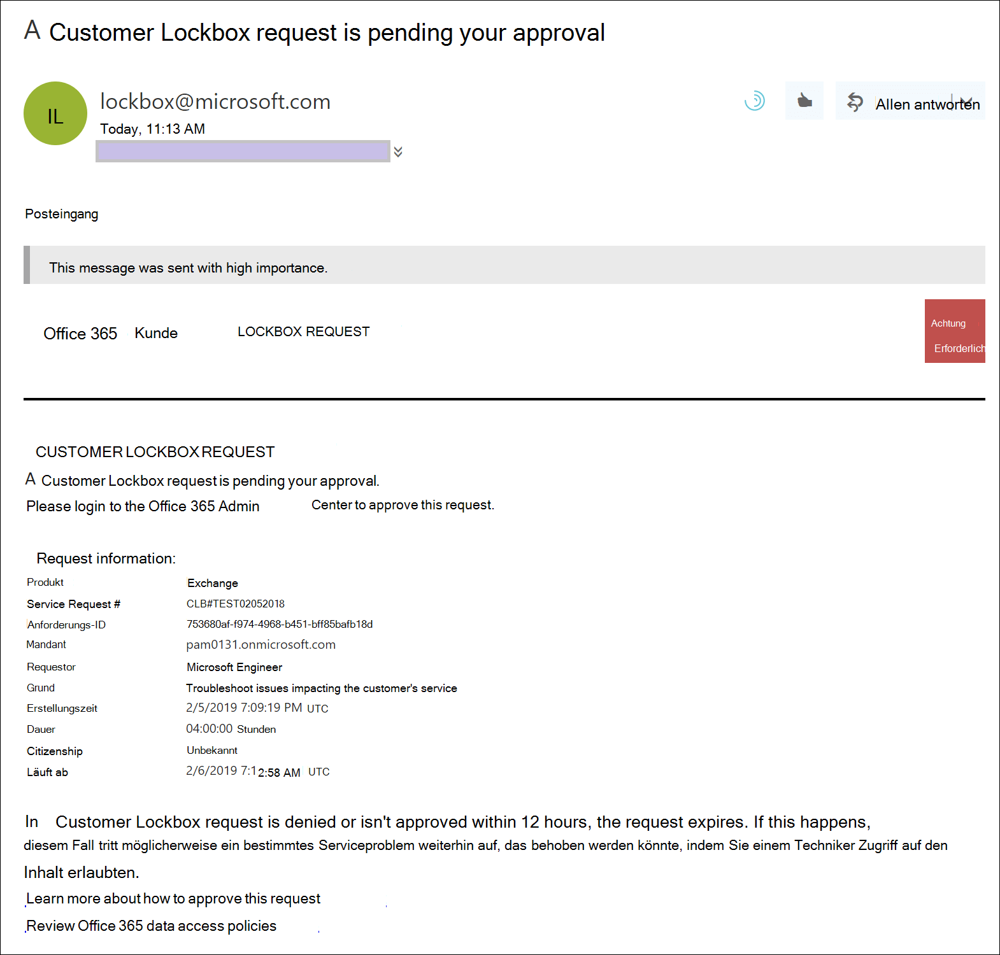
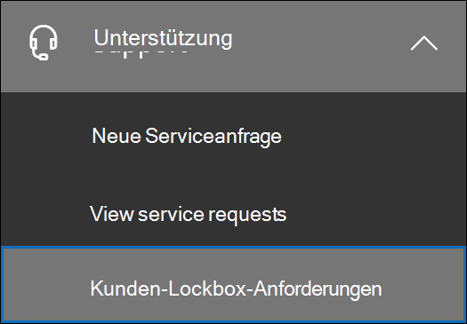
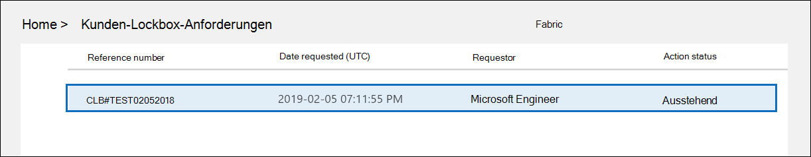
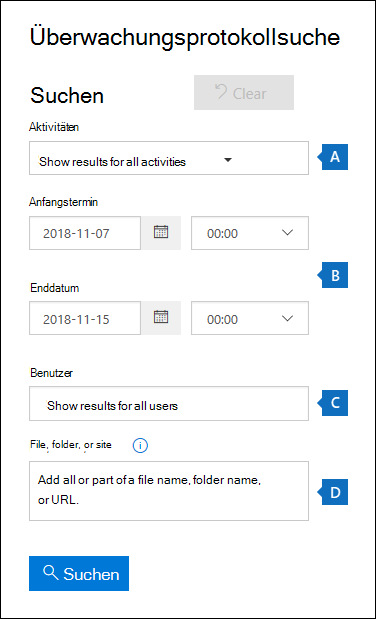
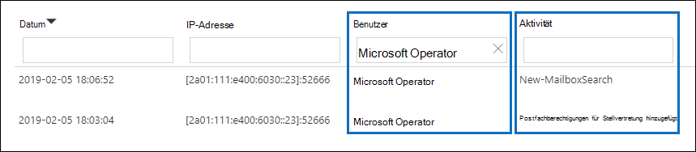
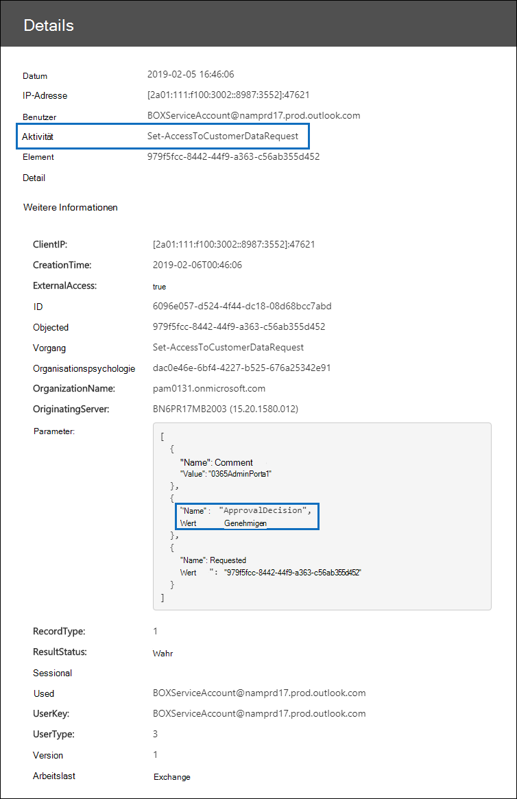

# Customer Lockbox in Office 365

Dieser Artikel enthält Bereitstellungs- und Konfigurationsanleitungen für Customer Lockbox. Customer Lockbox unterstützt Anforderungen für den Zugriff auf Daten in Exchange Online, SharePoint Online und OneDrive for Business. Um Support für andere Dienste zu empfehlen, senden Sie bitte eine Anforderung an [Office 365 UserVoice](https://office365.uservoice.com/).

Informationen zu den Optionen für die Lizenzierung Ihrer Benutzer, um von Microsoft 365-Complianceangeboten zu profitieren, einschließlich dieses, ab dem 1. April 2020 finden Sie im Microsoft 365-Lizenzierungsleitfaden zur Sicherheit [& Compliance](/office365/servicedescriptions/microsoft-365-service-descriptions/microsoft-365-tenantlevel-services-licensing-guidance/microsoft-365-security-compliance-licensing-guidance).

Customer Lockbox stellt sicher, dass Microsoft ohne Ihre ausdrückliche Genehmigung nicht auf Ihre Inhalte zugreifen kann, um einen Dienstvorgang durchzuführen. Customer Lockbox führt Sie in den Genehmigungsworkflow für Anforderungen für den Zugriff auf Ihre Inhalte.

Gelegentlich helfen Microsoft-Techniker bei der Problembehandlung und Behebung von problemen, die vom Kunden im Supportprozess gemeldet wurden. In der Regel werden Probleme durch umfangreiche Telemetrie- und Debuggingtools behoben, die Microsoft für seine Dienste installiert hat. In einigen Fällen muss jedoch ein Microsoft-Techniker auf Kundeninhalte zugreifen, um die Ursache zu ermitteln und das Problem zu beheben. Kunden-Lockbox setzt voraus, dass der Techniker den Zugriff vom Kunden als letzten Schritt im Genehmigungsworkflow anfordert. Dies gibt Organisationen die Möglichkeit, diese Anforderungen zu genehmigen oder zu verweigern und dem Kunden die Direktzugriffskontrolle zu ermöglichen.

### Übersichtsvideo zu Customer Lockbox

> [!VIDEO https://www.microsoft.com/videoplayer/embed/8fecf10b-1f03-4849-8b67-76d3d2a43f26?autoplay=false]

## Kunden-Lockbox – Genehmigungsvorgang

Die folgenden Schritte beschreiben den typischen Workflow, wenn ein Microsoft-Techniker eine Kunden-Lockbox-Anforderung initiiert:

1. Bei einer Person in einer Organisation wird ein Problem mit ihrem postfach Microsoft 365.

2. Nachdem der Benutzer das Problem behoben hat, es aber nicht beheben kann, wird eine Supportanfrage beim Microsoft Support geöffnet.

3. Ein Microsoft-Supporttechniker überprüft die Dienstanforderung und ermittelt, dass auf den Mandanten der Organisation zugegriffen werden muss, um das Problem in diesem Exchange Online.

4. Der Microsoft-Supporttechniker meldet sich beim Customer Lockbox-Anforderungstool an und stellt eine Datenzugriffsanforderung, die den Mandantennamen der Organisation, die Dienstanforderungsnummer und die geschätzte Zeit enthält, zu der der Techniker Zugriff auf die Daten benötigt.

5. Nachdem die Anforderung von einem Microsoft-Support-Mitarbeiter genehmigt wurde, sendet die Kunden-Lockbox der für die Genehmigung zuständigen Person in der Organisation eine E-Mail-Benachrichtigung über die ausstehende Zugriffsanforderung von Microsoft.

    

   Jeder Benutzer, dem die Administratorrolle ["Customer Lockbox](/office365/admin/add-users/about-admin-roles) access approver admin" in Microsoft 365 Admin Center zugewiesen ist, kann Kunden-Lockbox-Anforderungen genehmigen.

6. Die genehmigende Benutzerin meldet sich beim Microsoft 365 Admin Center an und genehmigt die Anforderung. Mit diesem Schritt wird die Erstellung eines Überwachungseintrags ausgelöst, der über eine Suche innerhalb des Überwachungsprotokolls auffindbar ist. Weitere Informationen finden Sie unter [Auditing Customer Lockbox requests](#auditing-customer-lockbox-requests).

   Wenn der Kunde die Anforderung ablehnt oder die Anforderung nicht innerhalb von 12 Stunden genehmigt, läuft die Anforderung ab, und dem Microsoft-Techniker wird kein Zugriff gewährt.

   > [!IMPORTANT]
   > Microsoft enthält keine Links in E-Mail-Benachrichtigungen zum Sperren von Kunden, für die Sie sich bei der Office 365.

7. Nachdem die genehmigende Person der Organisation die Anforderung genehmigt hat, erhält der Microsoft-Techniker die entsprechende Genehmigungsnachricht, meldet sich beim Mandanten in Exchange Online an und behebt das Problem des Kunden. Microsoft-Techniker haben die angeforderte Dauer, um das Problem zu beheben, nach dem der Zugriff automatisch widerrufen wird.

> [!NOTE]
> Sämtliche von einem Microsoft-Techniker ausgeführten Aktionen werden im Überwachungsprotokoll protokolliert. Sie können nach diesen Überwachungseinträgen suchen und sie überprüfen.

## Aktivieren oder Deaktivieren von Kunden-Lockbox-Anforderungen

Sie können die Steuerelemente für die Kunden-Lockbox im Microsoft 365 Admin Center aktivieren. Wenn Sie "Customer Lockbox" aktivieren, muss Microsoft die Genehmigung Ihrer Organisation erhalten, bevor sie auf die Inhalte Ihres Mandanten zugreifen kann.

1. Wechseln Sie mit einem Arbeits- oder Schulkonto, dem entweder der globale Administrator oder die Rolle der genehmigenden Benutzerrolle **"Customer Lockbox Access"** zugewiesen ist, zu und melden Sie [https://admin.microsoft.com](https://admin.microsoft.com) sich an.

2. Wählen **Einstellungen > Org Einstellungen** aus.

3. Wählen **Sie Sicherheit & Datenschutz**  >  **Kunden-Lockbox** bearbeiten aus, und verschieben Sie dann den Umschalter auf Ein oder  >   **Aus,**  um das Feature ein- oder auszuschalten.

    

## Genehmigen oder Ablehnen einer Kunden-Lockbox-Anforderung

1. Wechseln Sie mit einem Arbeits- oder Schulkonto, dem entweder der globale Administrator oder die Rolle der genehmigenden Benutzerrolle **"Customer Lockbox Access"** zugewiesen ist, zu und melden Sie [https://admin.microsoft.com](https://admin.microsoft.com) sich an.

2. Wählen **Sie Support > Kunden-Lockbox-Anforderungen aus.**

    

    Eine Liste der Kunden-Lockbox-Anforderungen wird angezeigt.

    

3. Wählen Sie eine Kunden-Lockbox-Anforderung aus, und wählen Sie dann **Genehmigen** oder **Verweigern aus.**

    

    Eine Bestätigungsmeldung zur Genehmigung der Kunden-Lockbox-Anforderung wird angezeigt.

    

> [!NOTE]
> Verwenden Sie das Set-AccessToCustomerDataRequest-Cmdlet zum Genehmigen, Ablehnen oder Abbrechen von Microsoft 365-Kunden-Lockbox-Anfragen, die den Zugriff auf Ihre Daten durch Microsoft-Supporttechniker steuern. Weitere Informationen finden Sie unter [Set-AccessToCustomerDataRequest](/powershell/module/exchange/set-accesstocustomerdatarequest).

## Überwachung von Kunden-Lockbox-Anforderungen

Überwachungsdatensätze, die den Kunden-Lockbox-Anforderungen entsprechen, werden im Überwachungsprotokoll protokolliert. Sie können auf diese Protokolle mithilfe des [Überwachungsprotokollsuchtools](search-the-audit-log-in-security-and-compliance.md) im Security & Compliance Center zugreifen. Aktionen im Zusammenhang mit dem Akzeptieren oder Verweigern einer Kunden-Lockbox-Anforderung und Aktionen von Microsoft-Technikern (wenn Zugriffsanforderungen genehmigt werden) werden ebenfalls im Überwachungsprotokoll protokolliert. Sie können nach diesen Überwachungseinträgen suchen und sie überprüfen.

### Durchsuchen des Überwachungsprotokolls nach Aktivitäten im Zusammenhang mit Kunden-Lockbox-Anforderungen

Bevor Sie das Überwachungsprotokoll verwenden können, um Kunden-Lockboxanforderungen nachzuverfolgen, müssen Sie einige Schritte ausführen, um die Überwachungsprotokollierung einzurichten. Weitere Informationen finden Sie unter [Durchsuchen des Überwachungsprotokolls im Security & Compliance Center](/office365/securitycompliance/search-the-audit-log-in-security-and-compliance#before-you-begin). Nachdem Sie das Setup abgeschlossen haben, verwenden Sie die folgenden Schritte, um eine Überwachungsprotokollsuchabfrage zu erstellen, um Überwachungsdatensätze im Zusammenhang mit Customer Lockbox zurückzukehren:

1. Wechseln Sie zu [https://protection.office.com](https://protection.office.com).
  
2. Melden Sie sich mit Ihrem Geschäfts-, Schul- oder Unikonto an.

3. Wählen Sie im linken Bereich des Security & Compliance Center die Option **Suchen &**  >  **Überwachungsprotokollsuche aus.**

    Die **Seite Überwachungsprotokollsuche** wird angezeigt.

    
  
4. Konfigurieren Sie die folgenden Suchkriterien: 

    1. **Aktivitäten** : Lassen Sie dieses Feld leer, sodass die Suche Überwachungsdatensätze für alle Aktivitäten zurückgibt. Dies ist erforderlich, um Alle Überwachungsdatensätze im Zusammenhang mit Kunden-Lockbox-Anforderungen und entsprechenden Aktivitäten von Microsoft-Technikern zurücksennen.

    1. **Startdatum** und **Enddatum** : Wählen Sie einen Datums- und Uhrzeitbereich aus, um die Ereignisse zu anzeigen, die innerhalb dieses Zeitraums aufgetreten sind.

    1. **Benutzer** : Lassen Sie dieses Feld leer.

    1. **Datei, Ordner oder Website** : Lassen Sie dieses Feld leer.

5. Klicken Sie auf **Suchen**, um die Suche anhand der Suchkriterien auszuführen. 

    Die Suchergebnisse werden geladen und nach einigen Momenten unter **Ergebnisse** auf der Seite **Überwachungsprotokollsuche** angezeigt.

6. Klicken **Sie auf der** Suchergebnissetseite auf Ergebnisse filtern, und führen Sie eine der folgenden Schritte aus:

   - Geben Sie Set-AccessToCustomerDataRequest in das Feld unter der Spalte Aktivität  ein, um Überwachungsdatensätze im Zusammenhang mit einer genehmigenden Benutzerin in Ihrer Organisation zu anzeigen, die eine Kunden-Lockbox-Anforderung genehmigt oder verweigert: Geben Sie in das Feld unter der Spalte Aktivität den Wert **Set-AccessToCustomerDataRequest ein.**

   - So zeigen Sie Überwachungsdatensätze im Zusammenhang mit einem Microsoft-Techniker an, der Aktionen als Reaktion auf eine genehmigte Kunden-Lockbox-Anforderung ausführen soll: Geben Sie in das Feld unter der Spalte **Benutzer** **den Microsoft Operator ein.** In **der Spalte Aktivität** wird die vom Techniker ausgeführte Aktion angezeigt.

      

7. Klicken Sie in der Liste der Ergebnisse auf einen Überwachungsdatensatz, um ihn anzeigen zu können.

### Überwachungsdatensatz für eine Kunden-Lockbox-Zugriffsanforderung

Wenn eine Person in Ihrer Organisation eine Kunden-Lockbox-Anforderung genehmigt oder verweigert, wird ein Überwachungsdatensatz im Überwachungsprotokoll protokolliert. Dieser Datensatz enthält folgende Informationen.

| Überwachungsdatensatz-Eigenschaft| Beschreibung|
|:---------- |:----------|
| Datum       | Das Datum und die Uhrzeit, zu der die Kunden-Lockbox-Anforderung genehmigt oder abgelehnt wurde.
| IP-Adresse | Die IP-Adresse des Computers, den die genehmigende Person zur Genehmigung oder Ablehnung einer Anforderung verwendet hat. |
| Benutzer       | Das Dienstkonto BOXServiceAccount@ \[ \] .prod.outlook.com.            |
| Aktivität   | Set-AccessToCustomerDataRequest; Hierbei handelt es sich um die Überwachungsaktivität, die protokolliert wird, wenn eine Kunden-Lockbox-Anforderung genehmigt oder abgelehnt wird.                                |
| Element       | Die Guid der Kunden-Lockbox-Anforderung                             |

Der folgende Screenshot zeigt ein Beispiel für einen Überwachungsprotokolldatensatz, der einer genehmigten Kunden-Lockbox-Anforderung entspricht. Wenn eine Kunden-Lockbox-Anforderung verweigert wurde, würde der Wert des **Parameters ApprovalDecision** **Deny sein.**

> [!TIP]
> Klicken Sie auf Weitere Informationen, um detailliertere Informationen in einem Überwachungsdatensatz **anzeigen zu können.**

### Überwachungsdatensatz für eine Aktion, die von einem Microsoft-Techniker ausgeführt wird

Die Aktionen, die von einem Microsoft-Techniker nach der Genehmigung einer Kunden-Lockbox-Anforderung durchgeführt werden (und die zum Zugriff auf Kundeninhalte führen können), werden im Überwachungsprotokoll protokolliert. Diese Datensätze enthalten die folgenden Informationen.

| Überwachungsdatensatz-Eigenschaft| Beschreibung|
|:---------- |:----------|
| Datum       | Datum, zu dem die Aktion ausgeführt wurde. Beachten Sie, dass die Uhrzeit, zu der diese Aktion durchgeführt wurde, innerhalb von 4 Stunden nach der Genehmigung der Kunden-Lockbox-Anforderung liegt.              |
| IP-Adresse | Die IP-Adresse des Computers, den der Microsoft-Techniker verwendet hat. |
| Benutzer       | Microsoft-Operator; dieser Wert gibt an, dass dieser Datensatz mit einer Kunden-Lockbox-Anforderung verknüpft ist.                                  |
| Aktivität   | Name der vom Microsoft-Techniker ausgeführten Aktivität.|
| Element       | \<empty\>                                             |

## Häufig gestellte Fragen

#### Für Microsoft 365 Dienstleistungen gilt Customer Lockbox?

Customer Lockbox wird derzeit in Exchange Online, SharePoint Online und OneDrive for Business.

#### Ist Customer Lockbox für alle Kunden verfügbar?

Customer Lockbox ist in den Microsoft 365- oder Office 365 E5-Abonnements enthalten und kann anderen Plänen mit einem Informationsschutz- und Compliance- oder einem Advanced Compliance-Add-On-Abonnement hinzugefügt werden. Weitere Informationen [finden Sie unter Pläne](https://products.office.com/business/office-365-enterprise-e5-business-software) und Preise.

#### Was sind Kundeninhalte?

Kundeninhalte sind die Daten, die von Benutzern von Microsoft 365 und Anwendungen erstellt werden. Beispiele für Kundeninhalte:

- E-Mail-Nachrichtentext oder -Anlagen

- SharePoint-Websiteinhalte

- Informationen im Textkörper einer SharePoint-Datei

- Skype for Business des Präsentationsdateitexts

- Chatnachrichten oder VoIP-Unterhaltungen

- Kundengenerierte BLOB- oder strukturierte Speicherdaten (z. B. SQL-Container)

- Sicherheitsinformationen des Kunden (z. B. Zertifikate, Verschlüsselungsschlüssel und Kennwörter)

- Rückschlüsse und alle nachfolgenden Rückschlüsse, wenn Kundeninhalte erhalten bleiben

Weitere Informationen zu Kundeninhalten in Office 365 finden Sie im [Office 365 Trust Center](https://products.office.com/business/office-365-trust-center-privacy/).

#### Wer wird benachrichtigt, wenn eine Anforderung zum Zugriff auf meine Inhalte besteht?

Globale Administratoren und alle Personen, denen die Administratorrolle "Customer Lockbox Access Approver" zugewiesen ist, werden benachrichtigt. Dies sind auch dieselben Benutzer, die Kunden-Lockbox-Anforderungen genehmigen können.

#### Wer können diese Anforderungen in meiner Organisation genehmigen oder ablehnen?

Globale Administratoren und alle Personen, denen die Administratorrolle "Benutzer-Lockbox-Zugriff" zugewiesen ist, können Kunden-Lockbox-Anforderungen genehmigen. Kunden steuern diese Rollenzuweisungen in ihren Organisationen.

#### Wie melde ich mich für Customer Lockbox an?

Ein globaler Administrator kann Customer Lockbox im Microsoft 365 oder Microsoft 365 konfigurieren.

#### Was kann der Techniker tun, wenn ich eine Kunden-Lockbox-Anforderung stimme und wie weiß ich, was der Microsoft-Techniker getan hat?

Nachdem Sie eine Kunden-Lockbox-Anforderung genehmigt haben, gewährte der Microsoft-Techniker diese erforderlichen Berechtigungen für den Zugriff auf Kundeninhalte mithilfe von vorab genehmigten Cmdlets. Aktionen, die von Microsoft-Technikern als Reaktion auf Kunden-Lockbox-Anforderungen ergriffen werden, werden protokolliert und im Überwachungsprotokoll im Security & Compliance Center zugänglich.

#### Wo kann ich wissen, dass Microsoft den Genehmigungsprozess verfolgt?

Sie können die E-Mail-Genehmigungsbenachrichtigungen, die an Administratoren und genehmigende Benutzer in Ihrer Organisation gesendet werden, mit dem Kunden-Lockbox-Anforderungsverlauf im Microsoft 365 verweisen.

Customer Lockbox ist im neuesten [SOC 1 SSAE 16-Überwachungsbericht enthalten.](https://servicetrust.microsoft.com/ViewPage/MSComplianceGuide?command=Download&downloadType=Document&downloadId=91592749-e86a-43ac-801e-121382614681&docTab=4ce99610-c9c0-11e7-8c2c-f908a777fa4d_SOC%20%2F%20SSAE%2016%20Reports) Weitere Informationen finden Sie im Microsoft [Service Trust Portal](https://servicetrust.microsoft.com/ViewPage/MSComplianceGuide?command=Download&downloadType=Document&downloadId=91592749-e86a-43ac-801e-121382614681&docTab=4ce99610-c9c0-11e7-8c2c-f908a777fa4d_SOC%20%2F%20SSAE%2016%20Reports).

#### Kann Microsoft die Liste der Genehmiger für meinen Mandanten ändern? Wenn nicht, wie wird dies verhindert?

Nur ein globaler Administrator in Ihrer Organisation kann angeben, wer Kunden-Lockbox-Anforderungen genehmigen kann. Das bedeutet, dass nur die Mitglieder der globalen Administratorgruppe in Azure Active Directory angeben können, wer die Anforderung genehmigen kann. Die Mitgliedschaft in der globalen Administratorgruppe in Azure Active Directory wird nur von Ihrer Organisation verwaltet.

#### Was passiert, wenn ich weitere Informationen zu einer Inhaltszugriffsanforderung benötigt, um sie zu genehmigen?

Jede Kunden-Lockbox-Anforderung enthält eine Microsoft 365 Dienstanforderungsnummer. Sie können sich an den Microsoft-Support wenden und auf diese Dienstnummer verweisen, um weitere Informationen zur Anforderung zu erhalten.

#### Wie lange sind die Berechtigungen gültig, wenn eine Kunden-Lockbox-Anforderung genehmigt wird?

Zurzeit beträgt die maximale Zeitspanne der Zugriffsberechtigungen für den Microsoft-Techniker 4 Stunden. Der Microsoft-Techniker kann auch einen kürzeren Zeitraum anfordern.

#### Wie kann ich einen Verlauf aller Kunden-Lockbox-Anforderungen erhalten?

Alle Kunden-Lockbox-Anforderungen werden im Microsoft 365 angezeigt.

#### Wie korreliert ich die Inhaltszugriffsanforderungen mit den zugehörigen Überwachungsprotokollen?

Der Compliance Center-Aktivitätsfeed enthält Protokollaktivitäten von Customer Lockbox. Kunden können die Aktivitäten des Kunden-Lockbox-Protokolls aus dem Aktivitätsfeed mit der empfangenen E-Mail-Anforderung querverweisen.

#### Was geschieht, wenn ein Kunde nicht auf eine Kunden-Lockbox-Anforderung antwortet?

Kunden-Lockbox-Anfragen haben eine Standarddauer von 12 Stunden. Wenn Sie nicht innerhalb von 12 Stunden auf eine Anforderung antworten, läuft die Anforderung ab.

#### Was macht Microsoft, wenn ein Kunde eine Kunden-Lockbox-Anforderung ablehnt?

Wenn ein Kunde eine Kunden-Lockbox-Anforderung ablehnt, erfolgt kein Zugriff auf Kundeninhalte. Wenn für einen Benutzer in Ihrer Organisation weiterhin ein Dienstproblem auftritt, bei dem Microsoft auf Kundeninhalte zugreifen muss, um das Problem zu beheben, bleibt das Dienstproblem möglicherweise bestehen, und Microsoft informiert den Benutzer darüber.

#### Schützt Customer Lockbox vor Datenanforderungen von Strafverfolgungsbehörden oder anderen Dritten?

Nein. Microsoft nimmt Anfragen von Drittanbietern nach Kundendaten ernst. Als Clouddienstanbieter setzt sich Microsoft immer für den Datenschutz von Kundendaten ein. Für den Fall, dass wir eine Vorladung erhalten, versucht Microsoft immer, den Drittanbieter an den Kunden weiterzuleiten, um die Informationen zu erhalten. (Lesen Sie Den Blog von Brad Smith: [Schützen von Kundendaten vor Staatlichem Schnüffeln](https://blogs.microsoft.com/blog/2013/12/04/protecting-customer-data-from-government-snooping/)). Wir veröffentlichen regelmäßig [detaillierte Informationen zu](https://www.microsoft.com/corporate-responsibility/lerr) den Von Microsoft erhaltenen Strafverfolgungsanforderungen.

Weitere Informationen finden Sie im [Microsoft Trust Center](https://www.microsoft.com/trustcenter/default.aspx) zu Datenanforderungen von Drittanbietern und im Abschnitt "Offenlegung von Kundendaten" in den [Onlinedienstbedingungen.](https://www.microsoft.com/Licensing/product-licensing/products.aspx)

#### Wie stellt Microsoft sicher, dass ein Mitglied seiner Mitarbeiter keinen ständigen Zugriff auf Kundeninhalte in Office 365 hat?

Microsoft implementiert umfassende vorbeugende Maßnahmen über Zugriffssteuerungssysteme und Detektivmaßnahmen, um Versuche zur Umgehung dieser Zugriffssteuerungssysteme zu identifizieren und zu umgehen. Microsoft 365 funktioniert mit den Prinzipien der geringsten Rechte und des Just-in-Time-Zugriffs. Daher haben keine Microsoft-Mitarbeiter die Berechtigung, fortlaufend auf Kundeninhalte zu zugreifen. Wenn die Berechtigung erteilt wird, gilt sie für eine begrenzte Dauer. 

Microsoft 365 verwendet ein Zugriffssteuerungssystem namens *Lockbox,* um Anforderungen an Berechtigungen zu verarbeiten, mit deren Rahmen betriebs- und verwaltungstechnische Funktionen innerhalb des Diensts ausführen können. Ein Operator muss mithilfe von Lockbox Zugriff auf Kundeninhalte anfordern, was dann erfordert, dass eine zweite Person maßnahmen gegen die Anforderung (z. B. genehmigen) ergreifen muss, bevor der Zugriff gewährt wird. Diese zweite Person kann nicht der Anantrager sein und muss für die Genehmigung des Zugriffs auf Kundeninhalte bestimmt werden. Nur wenn die Anforderung genehmigt wird, erhält der Operator temporären Zugriff auf Kundeninhalte. Nach Ablauf des Erhöhungszeitraums widerruft Lockbox den Zugriff.

Weitere Informationen zu allgemeinen [Sicherheitspraktiken](https://www.microsoft.com/licensing/product-licensing/products) von Microsoft finden Sie in den Nutzungsbedingungen für Onlinedienste.

#### Unter welchen Umständen benötigen Microsoft-Techniker Zugriff auf meine Inhalte?

Das gängigste Szenario, in dem Microsoft-Techniker auf Kundeninhalte zugreifen müssen, ist, wenn der Kunde eine Supportanfrage stellt, die Zugriff zur Problembehandlung erfordert. Ein Grundprinzip der Microsoft 365 ist, dass der Dienst ohne Microsoft-Zugriff auf Kundeninhalte funktioniert. Fast alle von Microsoft ausgeführten Dienstvorgänge sind vollständig automatisiert, und die menschliche Beteiligung wird stark gesteuert und von Kundeninhalten abstrahiert. Das Ziel für Microsoft 365 ist der Zugriff auf Kundeninhalte zur Unterstützung des Diensts erst, wenn der Kunde eine bestimmte Anforderung für microsoft access genehmigt.

#### Ich habe bereits gedacht, dass meine Daten mit der Microsoft Cloud sicher sind. Warum brauche ich also Customer Lockbox?

Customer Lockbox bietet eine zusätzliche Steuerungsebene, indem Kunden die Möglichkeit erhalten, explizite Zugriffsautorisierung für Dienstvorgänge zu erhalten. Durch den Nachweis, dass Verfahren für die explizite Datenzugriffsautorisierung durchgeführt werden, hilft Customer Lockbox Kunden auch, bestimmte Complianceverpflichtungen wie HIPAA und FEDRAMP zu erfüllen.