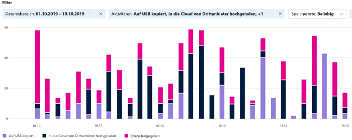
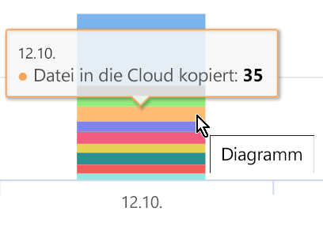
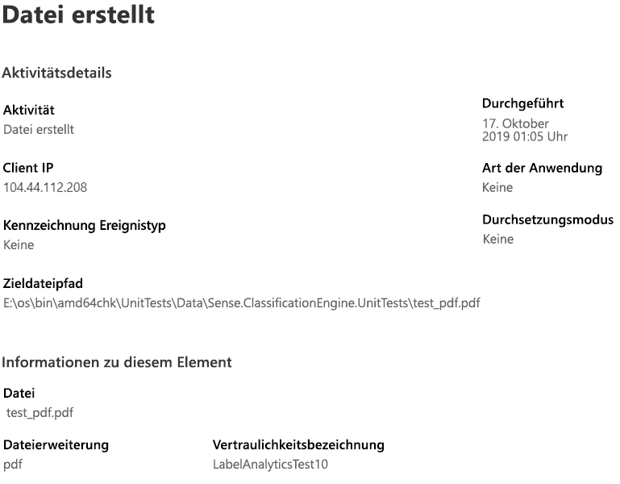

# Anzeigen von Aktivitäten mit beschrifteten Inhalten (Vorschau)View activity on your labeled content (preview)

Auf den Registerkarten „Übersicht über die Datenklassifizierung“ und „Inhalts-Explorer“ erfahren Sie, welche Inhalte gefunden und beschriftet wurden und wo sich diese Inhalte befinden.The data classification overview and content explorer tabs give you visibility into what content has been discovered and labeled, and where that content is. Der Aktivitäten-Explorer rundet diese Funktionalitäten ab, indem Sie überwachen können, was mit Ihren beschrifteten Inhalten geschieht.Activity explorer rounds out this suite of functionality by allowing you to monitor what's being done with your labeled content. Der Aktivitäten-Explorer bietet eine Verlaufsanzeige.Activity explorer provides a historical view.

Sie können die Daten filtern nach:You can filter the data by:

- Zeitraum:Date range
- AktivitätstypActivity type
- Speicherortlocation
- Benutzeruser
- VertraulichkeitsbezeichnungFor sensitivity label usage:
- AufbewahrungsbezeichnungRetention Label

Sie können die Daten in einer Liste oder in einem Balkendiagramm anzeigen.You can view the data either as a list or a bar graph.

## AktivitätstypActivity type

Microsoft 365 überwacht und berichtet über 12 Arten von Aktivitäten in SharePoint Online, OneDrive und Endpunkten.Microsoft 365 monitors and reports on 12 types of activities across SharePoint Online, OneDrive and endpoints. Endpunkte sind Benutzergeräte mit Windows 10.Endpoints are user devices running Windows 10.

- Datei erstelltFile is created
- Datei geändertFile modified
- Datei umbenanntFile renamed
- Datei in die Cloud kopiertFile copied to cloud
- Zugriff auf Datei durch eine nicht zulässige AppFile accessed by unallowed app
- Datei gedrucktFile printed
- Datei auf Wechselmedien kopiertFile copied to removable media
- Datei auf die Netzwerkfreigabe kopiertFile copied to network share
- Datei gelesenFile read
- Datei in die Zwischenablage kopiertfile copied to clipboard
- Bezeichnung angewendetLabel protection is applied
- Bezeichnung geändert (aktualisiert, heruntergestuft oder entfernt)Label changed (upgraded, downgraded, or removed)

Wenn Sie wissen, welche Aktionen mit Ihren vertraulichen beschrifteten Inhalten durchgeführt werden, können Sie feststellen, ob die von Ihnen bereits eingerichteten Steuerelemente, z. B. [Richtlinien zur Verhinderung von Datenverlust](data-loss-prevention-policies.md), wirksam sind oder nicht.The value of understanding what actions are being taken with your sensitive labeled content is that you can see if the controls that you have already put into place, such as [data loss prevention policies](data-loss-prevention-policies.md) are effective or not. Wenn dies nicht der Fall ist oder Sie etwas Unerwartetes entdecken, z. B. eine große Anzahl von Elementen, die mit `highly confidential` beschriftet sind und auf `general` herabgestuft werden, können Sie die verschiedenen Richtlinien verwalten und neue Aktionen ausführen, um das unerwünschte Verhalten einzuschränken.If not, or if you discover something unexpected, such as a large number of items that are labeled `highly confidential` and are downgraded `general`, you can manage your various policies and take new actions to restrict the undesired behavior.

Sobald Ihre Filter festgelegt sind, haben Sie folgende Möglichkeiten:Once your filters are set, you can:

- Zeigen Sie mit der Maus auf ein Segment des Balkendiagramms, um die Anzahl der Elemente anzuzeigen, die in diese Kategorie fallen hover over a segment of the bar chart to see the number of items that fall into that category 
- Exportieren von DatenThe variable to export  the data to.
- Wählen Sie ein beliebiges Element in der Liste aus und zeigen Sie die Details der Aktion im Flyout an.select any given item from the list and view the details of the action in the fly-out

## Siehe auchSee also
- [VertraulichkeitsbezeichnungenSensitivity labels](sensitivity-labels.md)
- [AufbewahrungsbezeichnungenRetention labels](labels.md)
- [Wonach die Typen von vertraulichen Informationen suchenWhat the sensitive information types look for](what-the-sensitive-information-types-look-for.md)
- [Übersicht über AufbewahrungsrichtlinienOverview of retention policies](retention-policies.md)