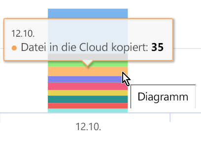
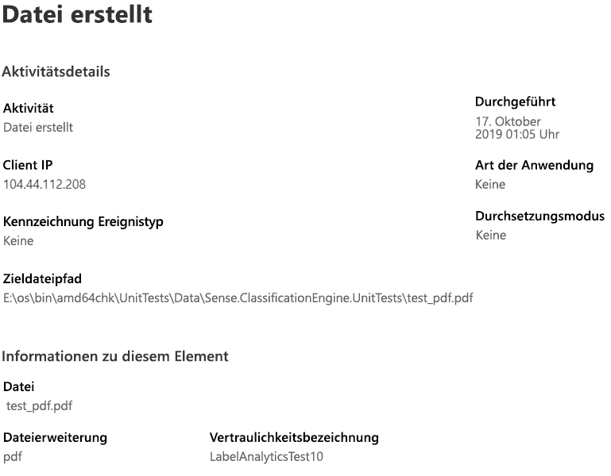

# Anzeigen von Aktivitäten mit beschrifteten Inhalten (Vorschau)

Auf den Registerkarten „Übersicht über die Datenklassifizierung“ und „Inhalts-Explorer“ erfahren Sie, welche Inhalte gefunden und beschriftet wurden und wo sich diese Inhalte befinden. Der Aktivitäten-Explorer rundet diese Funktionalitäten ab, indem Sie überwachen können, was mit Ihren beschrifteten Inhalten geschieht. Der Aktivitäten-Explorer bietet eine Verlaufsanzeige.

Sie können die Daten filtern nach:

- Zeitraum:
- Aktivitätstyp
- Speicherort
- Benutzer
- Vertraulichkeitsbezeichnung
- Aufbewahrungsbezeichnung

Sie können die Daten in einer Liste oder in einem Balkendiagramm anzeigen.

## Voraussetzungen

Jedem Konto, das auf den Aktivitäten-Explorer zugreift und diesen verwendet, muss eine Lizenz aus einem dieser Abonnements zugewiesen sein:

- Microsoft 365 (E5)
- Office 365 (E5)
- Advanced Compliance (E5)-Add-on
- Advanced Threat Intelligence (E5)-Add-on

## Aktivitätstyp

Microsoft 365 überwacht und berichtet über 12 Arten von Aktivitäten in SharePoint Online, OneDrive und Endpunkten. Endpunkte sind Benutzergeräte mit Windows 10.

- Datei erstellt
- Datei geändert
- Datei umbenannt
- Datei in die Cloud kopiert
- Zugriff auf Datei durch eine nicht zulässige App
- Datei gedruckt
- Datei auf Wechselmedien kopiert
- Datei auf die Netzwerkfreigabe kopiert
- Datei gelesen
- Datei in die Zwischenablage kopiert
- Bezeichnung angewendet
- Bezeichnung geändert (aktualisiert, heruntergestuft oder entfernt)

Wenn Sie wissen, welche Aktionen mit Ihren vertraulichen beschrifteten Inhalten durchgeführt werden, können Sie feststellen, ob die von Ihnen bereits eingerichteten Steuerelemente, z. B. [Richtlinien zur Verhinderung von Datenverlust](data-loss-prevention-policies.md), wirksam sind oder nicht. Wenn dies nicht der Fall ist oder Sie etwas Unerwartetes entdecken, z. B. eine große Anzahl von Elementen, die mit `highly confidential` beschriftet sind und auf `general` herabgestuft werden, können Sie die verschiedenen Richtlinien verwalten und neue Aktionen ausführen, um das unerwünschte Verhalten einzuschränken.

Sobald Ihre Filter festgelegt sind, haben Sie folgende Möglichkeiten:

- Zeigen Sie mit der Maus auf ein Segment des Balkendiagramms, um die Anzahl der Elemente anzuzeigen, die in diese Kategorie fallen 
- Exportieren von Daten
- Wählen Sie ein beliebiges Element in der Liste aus und zeigen Sie die Details der Aktion im Flyout an.

## Siehe auch
- [Vertraulichkeitsbezeichnungen](sensitivity-labels.md)
- [Aufbewahrungsbezeichnungen](labels.md)
- [Wonach die Typen von vertraulichen Informationen suchen](what-the-sensitive-information-types-look-for.md)
- [Übersicht über Aufbewahrungsrichtlinien](retention-policies.md)
