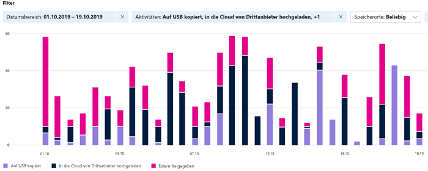

# Erste Schritte mit dem Aktivitäten-ExplorerGet started with activity explorer

Die  Datenklassifizierungsübersicht und die Registerkarten des [Inhalts-Explorers](data-classification-content-explorer.md) bieten Ihnen Einen Überblick darüber, welche Inhalte erkannt und gekennzeichnet wurden und wo sich dieser Inhalt befindet.The [data classification overview](data-classification-overview.md) and [content explorer](data-classification-content-explorer.md) tabs give you visibility into what content has been discovered and labeled, and where that content is. Der Aktivitäten-Explorer rundet diese Funktionalitäten ab, indem Sie überwachen können, was mit Ihren beschrifteten Inhalten geschieht.Activity explorer rounds out this suite of functionality by allowing you to monitor what's being done with your labeled content. Der Aktivitäts-Explorer bietet eine verlaufshistorische Ansicht der Aktivitäten in Ihren beschriftet inhalten.Activity explorer provides a historical view of activities on your labeled content. Die Aktivitätsinformationen werden aus Microsoft 365 einheitlichen Überwachungsprotokollen gesammelt, transformiert und in der Benutzeroberfläche des Aktivitäts-Explorers verfügbar gemacht.The activity information is collected from the Microsoft 365 unified audit logs, transformed and made available in the Activity explorer UI. 

Es stehen über 30 verschiedene Filter zur Verfügung, einschließlich:There are over 30 different filters available for use, some are:

- Zeitraum:date range
- Aktivitätstypactivity type
- Speicherortlocation
- Benutzeruser
- Vertraulichkeitsbezeichnungsensitivity label
- Aufbewahrungsbezeichnungretention label
- Dateipfadfile path
- DLP-RichtlinieDLP policy

## VoraussetzungenPrerequisites

Jedem Konto, das auf die Datenklassifizierung zugreift und sie verwendet, muss eine Lizenz aus einem dieser Abonnements zugewiesen sein:Every account that accesses and uses data classification must have a license assigned to it from one of these subscriptions:

- Microsoft 365 (E5)Microsoft 365 (E5)
- Office 365 (E5)Office 365 (E5)
- Advanced Compliance (E5)-Add-onAdvanced Compliance (E5) add-on
- Advanced Threat Intelligence (E5)-Add-onAdvanced Threat Intelligence (E5) add-on
- Microsoft 365 E5/A5 Info Protection & GovernanceMicrosoft 365 E5/A5 Info Protection & Governance
- Microsoft 365 E5/A5 ComplianceMicrosoft 365 E5/A5 Compliance

### BerechtigungenPermissions

 Um Zugriff auf die Registerkarte Aktivitäts-Explorer zu erhalten, muss einem Konto explizit die Mitgliedschaft in einer dieser Rollengruppen zugewiesen oder der Rolle explizit erteilt werden.In order to get access to the activity explorer tab, an account must be explicitly assigned membership in any one of these role groups or explicitly granted the role.

<!--
> [!IMPORTANT]
> Access to Activity explorer via the Security reader or Device Management role groups or other has been removed-->

**Microsoft 365-Rollengruppen****Microsoft 365 role groups**

- Globaler AdministratorGlobal administrator
- Compliance-AdministratorCompliance administrator
- SicherheitsadministratorSecurity administrator
- CompliancedatenadministratorCompliance data administrator

**Microsoft 365 Rollen****Microsoft 365 roles**

- Compliance-AdministratorCompliance administrator
- SicherheitsadministratorSecurity administrator

## AktivitätstypenActivity types

Der Aktivitäts-Explorer sammelt Aktivitätsinformationen aus den Überwachungsprotokollen für mehrere Quellen von Aktivitäten.Activity explorer gathers activity information from the audit logs on multiple sources of activities. Ausführlichere Informationen dazu, welche Bezeichnungsaktivität es in den Aktivitäts-Explorer ermöglicht, finden Sie unter [Bezeichnungsereignisse, die im Aktivitäts-Explorer verfügbar sind.](data-classification-activity-explorer-available-events.md)For more detailed information on what labeling activity makes it to Activity explorer, see [Labeling events available in Activity explorer](data-classification-activity-explorer-available-events.md).

**Vertraulichkeitsbezeichnungsaktivitäten** und Aufbewahrungsbezeichnungsaktivitäten aus Office systemeigenen Anwendungen, Azure Information Protection-Add-Ins, SharePoint Online, Exchange Online (nur Vertraulichkeitsbezeichnungen) und OneDrive. **Sensitivity label activities** and **Retention labeling activities** from Office native applications, Azure Information Protection add-in, SharePoint Online, Exchange Online (sensitivity labels only) and OneDrive. Einige Beispiele:Some examples are:

- Bezeichnung angewendetlabel applied
- Bezeichnung geändert (aktualisiert, heruntergestuft oder entfernt)label changed (upgraded, downgraded, or removed)
- Simulation der automatischen Bezeichnungauto-labeling simulation
- Datei lesenfile read 

**Azure Information Protection (AIP)-Scanner und AIP-Clients****Azure Information Protection (AIP) scanner and AIP clients**

- Angewendeter Schutzprotection applied
- Schutz geändertprotection changed
- Schutz entferntprotection removed
- Ermittelte Dateienfiles discovered 

Der Aktivitäts-Explorer sammelt außerdem **Ereignisse** aus Exchange Online, SharePoint Online, OneDrive, Teams Chat und Kanal (Vorschau), lokalen SharePoint-Ordnern und Bibliotheken sowie lokalen Dateifreigaben und Windows 10-Geräten über **DLP (Endpoint Data Loss Prevention).**Activity explorer also gathers **DLP policy matches** events from Exchange Online, SharePoint Online, OneDrive, Teams Chat and Channel (preview), on-premises SharePoint folders and libraries, and on-premises file shares, and Windows 10 devices via **Endpoint data loss prevention (DLP)**. Einige Beispielereignisse von Windows 10 sind Datei:Some examples events from Windows 10 devices are file:

- Löschvorgängedeletions
- creationscreations
- in die Zwischenablage kopiertcopied to clipboard
- geändertmodified
- Lesenread
- gedrucktprinted
- umbenanntrenamed
- in die Netzwerkfreigabe kopiertcopied to network share
- Zugriff durch nicht zugelassene Appaccessed by unallowed app 

Der Wert des Verständnisses, welche Aktionen mit Ihren vertraulich gekennzeichneten Inhalten ergriffen werden, ist, dass Sie sehen können, ob die steuerelemente, die Sie bereits ergriffen haben, z. B. verhinderung von Datenverlusten wirksam sind oder nicht. The value of understanding what actions are being taken with your sensitive labeled content is that you can see if the controls that you have already put into place, such as [data loss prevention](dlp-learn-about-dlp.md) are effective or not. Wenn dies nicht der Fall ist oder Sie etwas Unerwartetes entdecken, z. B. eine große Anzahl von Elementen, die mit `highly confidential` beschriftet sind und auf `general` herabgestuft werden, können Sie die verschiedenen Richtlinien verwalten und neue Aktionen ausführen, um das unerwünschte Verhalten einzuschränken.If not, or if you discover something unexpected, such as a large number of items that are labeled `highly confidential` and are downgraded `general`, you can manage your various policies and take new actions to restrict the undesired behavior.

> [!NOTE]
> Der Aktivitäts-Explorer überwacht derzeit keine Aufbewahrungsaktivitäten für Exchange Online.Activity explorer doesn't currently monitor retention activities for Exchange Online.

## Siehe auchSee also

- [Weitere Informationen zu VertraulichkeitsbezeichnungenLearn about sensitivity labels](sensitivity-labels.md)
- [Weitere Informationen zu Aufbewahrungsrichtlinien und AufbewahrungsbezeichnungenLearn about retention policies and retention labels](retention.md)
- [Informationen zu Typen vertraulicher InformationenLearn about sensitive information types](sensitive-information-type-learn-about.md)
- [Informationen zur DatenklassifizierungLearn about data classification](data-classification-overview.md)
