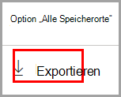
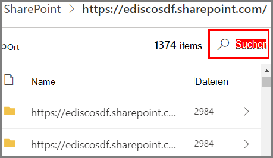

# Erste Schritte mit dem Inhalts-Explorer

Mit dem Inhalts-Explorers zur Datenklassifizierung können Sie die Elemente, die auf der Übersichtsseite zusammengefasst wurden, systemintern anzeigen.

## Voraussetzungen

Jedem Konto, das auf die Datenklassifizierung zugreift und sie verwendet, muss eine Lizenz aus einem dieser Abonnements zugewiesen sein:

- Microsoft 365 (E5)
- Office 365 (E5)
- Advanced Compliance (E5)-Add-on
- Advanced Threat Intelligence (E5)-Add-on
- Microsoft 365 E5/A5 Info Protection & Governance
- Microsoft 365 E5/A5 Compliance

### Berechtigungen

Um Zugriff auf die Registerkarte „Inhalts-Explorer“ zu erhalten, muss einem Konto die Mitgliedschaft in einer dieser Rollen oder Rollengruppen zugewiesen werden. 

Mithilfe einer [DLP-Richtlinie](data-loss-prevention-policies.md) können vertrauliche Informationen geschützt werden, die als **vertraulicher Informationstyp** definiert sind. Microsoft 365 umfasst [Definitionen für viele gängige Typen vertraulicher Informationen](sensitive-information-type-entity-definitions.md) in vielen verschiedenen Regionen, die für Sie verfügbar sind. Beispielsweise Kreditkartennummern, Bankkontonummern, Personalausweisnummern und Windows Live ID-Dienstnummern.

**Microsoft 365-Rollengruppen**

- Globaler Administrator
- Compliance-Administrator
- Sicherheitsadministrator
- Compliancedatenadministrator

> [!IMPORTANT]
> Die Mitgliedschaft in diesen Rollengruppen erlaubt Ihnen nicht, die Liste der Elemente im Inhalts-Explorer oder den Inhalt der Elemente im Inhalts-Explorer anzuzeigen.

### Erforderliche Berechtigungen für den Zugriff auf Elemente im Inhalts-Explorer

Der Zugriff auf den Inhalts-Explorer ist hochgradig eingeschränkt, da Sie damit den Inhalt überprüfter Dateien lesen können.

> [!IMPORTANT]
> Diese Berechtigungen ersetzen die Berechtigungen, die den Elementen lokal zugewiesen sind, was die Anzeige des Inhalts ermöglicht. 

Es gibt zwei Rollen, die den Zugriff auf den Inhalts-Explorer gewähren:

- **Inhalts Explorer-Listenanzeige**: Durch die Mitgliedschaft in dieser Rollengruppe können Sie jedes Element und dessen Speicherort in der Listenansicht anzeigen. Die Rolle `data classification list viewer` wurde dieser Rollengruppe bereits zugewiesen.

- **Inhalts-Explorer-Inhaltsanzeige**: Durch die Mitgliedschaft in dieser Rollengruppe können Sie die Inhalte aller Elemente in der Liste anzeigen. Die Rolle `data classification content viewer` wurde dieser Rollengruppe bereits zugewiesen.

Das Konto, das Sie für den Zugriff auf den Inhalts-Explorer verwenden, muss einer oder beiden Rollengruppen angehören. Hierbei handelt es sich um unabhängige Rollengruppen, die nicht kumulativ sind. Wenn Sie beispielsweise einem Konto die Möglichkeit geben möchten, nur die Elemente und deren Speicherorte anzuzeigen, erteilen Sie Inhalts-Explorer-Listenanzeige-Rechte. Wenn Sie möchten, dass dasselbe Konto auch in der Lage ist, die Inhalte der Elemente in der Liste anzuzeigen, erteilen Sie zusätzlich Inhalts-Explorer-Inhaltsanzeige-Rechte.

Sie können auch eine oder beide Rollen einer benutzerdefinierten Rollengruppe zuweisen, um den Zugriff auf den Inhalts-Explorer anzupassen.

Ein globaler Administrator, ein Compliance-Administrator oder ein Datenadministrator kann die erforderliche Rollengruppenmitgliedschaft Inhalts-Explorer-Listenanzeige und Inhalts-Explorer-Inhaltsanzeige zuweisen.

## Inhalts-Explorer

Der Inhalts-Explorer zeigt eine aktuelle Momentaufnahme der Elemente mit einer Vertraulichkeitsbezeichnung, einer Aufbewahrungsbezeichnung oder von Elementen, die in Ihrer Organisation als vertraulicher Informationstyp klassifiziert wurden.

### Typen vertraulicher Informationen

Mithilfe einer [DLP-Richtlinie](data-loss-prevention-policies.md) können vertrauliche Informationen geschützt werden, die als **vertraulicher Informationstyp** definiert sind. Microsoft 365 umfasst [Definitionen für viele gängige Typen vertraulicher Informationen](sensitive-information-type-entity-definitions.md) aus vielen verschiedenen Regionen, die für Sie verfügbar sind. Beispielsweise Kreditkartennummern, Bankkontonummern, Personalausweisnummern und Windows Live ID-Dienstnummern.

> [!NOTE]
> Der Inhalts-Explorer sucht derzeit nicht nach vertraulichen Informationstypen in Exchange Online.

### Vertraulichkeitsbezeichnungen

Eine [Vertraulichkeitsbezeichnung](sensitivity-labels.md) ist einfach ein Tag, das den Wert des Elements für Ihre Organisation angibt. Sie kann manuell oder automatisch angewendet werden. Sobald sie angewendet wurde, wird sie in das Dokument eingebettet und mit diesem überall hin weitergebenen. Eine Vertraulichkeitsbezeichnung aktiviert verschiedene Schutzmaßnahmen, z. B. ein obligatorisches Wasserzeichen oder die Verschlüsselung.

Vertraulichkeitsbezeichnungen müssen für Dateien in SharePoint und OneDrive aktiviert sein, damit die entsprechenden Daten in der Datenklassifizierungsseite eingeblendet werden können. Weitere Informationen finden Sie unter [Aktivieren von Vertraulichkeitsbezeichnungen für Office-Dateien in Microsoft Office SharePoint Online und OneDrive](sensitivity-labels-sharepoint-onedrive-files.md).

### Aufbewahrungsbezeichnungen

Mithilfe einer [Aufbewahrungbezeichnung](retention.md) können Sie festlegen, wie lange ein entsprechend gekennzeichnetes Element aufbewahrt wird, und welche Schritte vor dem Löschen ausgeführt werden müssen. Aufbewahrungbezeichnungen können manuell oder automatisch über Richtlinien angewendet werden. Sie können Ihre Organisation dabei unterstützen, rechtliche und behördliche Vorschriften einzuhalten.

### Verwendung des Inhalts-Explorers

1. Öffnen Sie **Microsoft 365 Compliance Center**  > **Datenklassifizierung** > **Inhalts-Explorer**.
2. Wenn Sie den Namen der Bezeichnung oder den Typ vertraulicher Informationen kennen, können Sie ihn in das Filterfeld eingeben.
3. Alternativ können Sie auch nach dem Element suchen, indem Sie den Beschriftungstyp erweitern und die Bezeichnung in der Liste auswählen.
4. Wählen Sie unter **Alle Standorte** einen Standort aus, und gliedern Sie die Ordnerstruktur bis zu dem Element weiter auf.
5. Doppelklicken Sie, um das Element systemintern im Inhalts-Explorer zu öffnen.

### Exportieren
Das Steuerelement **Exportieren** erstellt eine .csv-Datei, die eine Auflistung dessen enthält, was im Bereich **Alle Speicherorte** angezeigt wird.

### Suchen

Wenn Sie einen Speicherort, z. B. einen Exchange-Ordner oder eine SharePoint- oder OneDrive-Website, aufschlüsseln, wird das **Suchtool** angezeigt.

Der Bereich des Suchtools richtet sich danach, was im Bereich **Alle Speicherorte** angezeigt wird und wonach Sie suchen können, variiert je nach ausgewähltem Speicherort. 

Wenn **Exchange** der ausgewählte Speicherort ist, können Sie die vollständige E-Mail-Adresse des Postfachs durchsuchen, z. B. `user@domainname.com`.

Wenn entweder **SharePoint** oder **OneDrive** als Speicherort ausgewählt ist, wird das Suchtool angezeigt, wenn Sie nach Website-Namen, Ordnern und Dateien suchen. 

> [!NOTE]
> **OneDrive** Wir haben uns Ihr wertvolles Feedback zur OneDrive-Integration während unseres Vorschauprogramms angehört. Basierend auf diesem Feedback wird die OneDrive-Funktionalität in der Vorschau verbleiben, bis alle Fixes vorhanden sind. Abhängig von Ihrem Mandanten sehen einige Kunden OneDrive möglicherweise nicht als Speicherort. Wir wissen Ihre anhaltende Unterstützung diesbezüglich zu schätzen.

Sie können nach folgendem suchen:

|Wert|Beispiel  |
|---------|---------|
|vollständiger Websitename    |`https://contoso.onmicrosoft.com/sites/sitename`    |
|Stammordner-Name – ruft alle Unterordner ab    | `/sites`        |
|Dateiname    |    `RES_Resume_1234.txt`     |
|Text am Anfang des Dateinamens| `RES`|
|Text nach einem Unterstrich ( _ ) im Dateinamen|`Resume` oder `1234`| 
|Dateierweiterung|`txt`|

## Siehe auch

- [Weitere Informationen zu Vertraulichkeitsbezeichnungen](sensitivity-labels.md)
- [Weitere Informationen zu Aufbewahrungsrichtlinien und Aufbewahrungsbezeichnungen](retention.md)
- [Entitätsdefinitionen für Typen vertraulicher Informationstypen.md](sensitive-information-type-entity-definitions.md)
- [Übersicht über die Verhinderung von Datenverlust](data-loss-prevention-policies.md)
