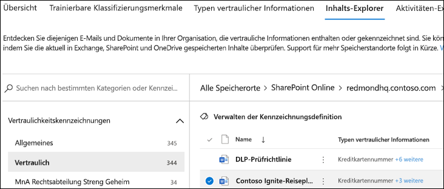

# Verwenden des Daten Inhalts-Explorers zur Datenklassifizierung (Vorschau)

Mit dem Inhalts-Explorers zur Datenklassifizierung können Sie die Elemente, die auf der Übersichtsseite zusammengefasst wurden, systemintern anzeigen.

## Inhalts-Explorer

Der Inhalts-Explorer zeigt eine aktuelle Momentaufnahme der Elemente mit einer Vertraulichkeitsbezeichnung, einer Aufbewahrungsbezeichnung oder von Elementen, die in Ihrer Organisation als vertraulicher Informationstyp klassifiziert wurden.

### Typen vertraulicher Informationen

Mithilfe einer [DLP-Richtlinie](data-loss-prevention-policies.md) können vertrauliche Informationen geschützt werden, die als **vertraulicher Informationstyp** definiert sind. Microsoft 365 umfasst [Definitionen für viele gängige Typen vertraulicher Informationen](what-the-sensitive-information-types-look-for.md) in vielen verschiedenen Regionen, die für Sie verfügbar sind. Beispielsweise Kreditkartennummern, Bankkontonummern, Personalausweisnummern und Windows Live ID-Dienstnummern.

### Vertraulichkeitsbezeichnungen

Eine [Vertraulichkeitsbezeichnung](sensitivity-labels.md) ist einfach ein Tag, das den Wert des Elements für Ihre Organisation angibt. Sie kann manuell oder automatisch angewendet werden. Sobald sie angewendet wurde, wird sie in das Dokument eingebettet und mit diesem überall hin weitergebenen. Eine Vertraulichkeitsbezeichnung aktiviert verschiedene Schutzmaßnahmen, z. B. ein obligatorisches Wasserzeichen oder die Verschlüsselung. Mit aktiviertem Endpunktschutz können Sie sogar verhindern, dass ein Element die Kontrolle Ihrer Organisation verlässt.

### Aufbewahrungsbezeichnungen

Mithilfe einer [Aufbewahrungbezeichnung](labels.md) können Sie festlegen, wie lange ein entsprechend gekennzeichnetes Element aufbewahrt wird, und welche Schritte vor dem Löschen ausgeführt werden müssen. Aufbewahrungbezeichnungen können manuell oder automatisch über Richtlinien angewendet werden. Sie können Ihre Organisation dabei unterstützen, rechtliche und behördliche Vorschriften einzuhalten.

### Berechtigungen

Es gibt zwei Rollen, die den Zugriff auf den Inhalts-Explorer gewähren:

- **Inhalts Explorer-Listenanzeige**: Mit der Mitgliedschaft in dieser Rolle können Sie jedes Element und dessen Position anzeigen.

- **Inhalts-Explorer-Inhaltsanzeige**: Mit der Mitgliedschaft in dieser Rolle können Sie die Inhalte aller Elemente in der Liste anzeigen.

Das Konto, das Sie für den Zugriff auf den Inhalts-Explorer verwenden, muss eine oder beide Rollen aufweisen. Hierbei handelt es sich um unabhängige Rollen, die nicht kumulativ sind. Wenn Sie beispielsweise einem Konto die Möglichkeit geben möchten, nur die Elemente und deren Speicherorte anzuzeigen, erteilen Sie Inhalts-Explorer-Listenanzeige-Rechte. Wenn Sie möchten, dass dasselbe Konto auch in der Lage ist, die Inhalte der Elemente in der Liste anzuzeigen, erteilen Sie zusätzlich Inhalts-Explorer-Inhaltsanzeige-Rechte.

### Verwendung des Inhalts-Explorers

1. Öffnen Sie **Microsoft 365 Compliance Center**  > **Datenklassifizierung** > **Inhalts-Explorer**.
2. Wenn Sie den Namen der Bezeichnung oder den Typ vertraulicher Informationen kennen, können Sie ihn in das Suchfeld eingeben.
3. Alternativ können Sie auch nach dem Element suchen, indem Sie den Beschriftungstyp erweitern und die Bezeichnung in der Liste auswählen. Nachfolgend wird ein Element aus dem Bereich der Aufbewahrungsbezeichnung der Liste angezeigt.
4. Wählen Sie unter **Alle Standorte** einen Standort aus, und gliedern Sie die Ordnerstruktur bis zu dem Element weiter auf.
5. Doppelklicken Sie, um das Element systemintern im Inhalts-Explorer zu öffnen.

## Siehe auch

- [Vertraulichkeitsbezeichnungen](sensitivity-labels.md)
- [Aufbewahrungsbezeichnungen](labels.md)
- [Wonach die Typen von vertraulichen Informationen suchen](what-the-sensitive-information-types-look-for.md)
- [Übersicht über Aufbewahrungsrichtlinien](retention-policies.md)
- [Verhinderung von Datenverlust – Übersicht](data-loss-prevention-policies.md)
