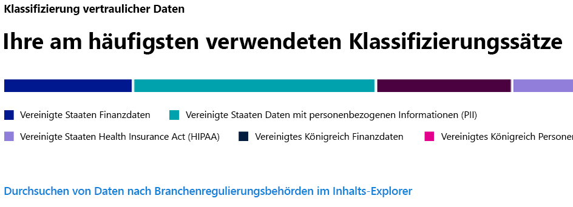
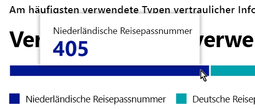
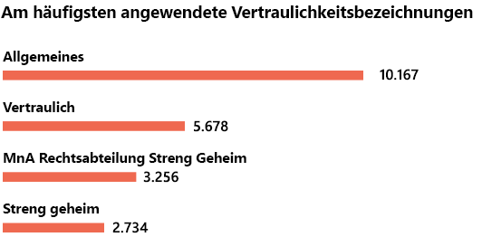
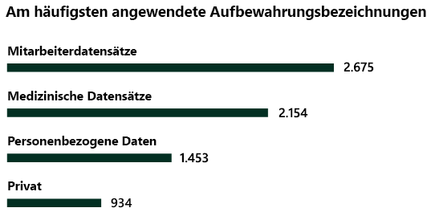

# Kennen Sie Ihre Daten – Überblick über die Datenklassifizierung

Als Microsoft 365-Administrator oder Compliance-Administrator können Sie Inhalte in Ihrer Organisation auswerten und diese dann markieren, um zu steuern, wohin diese sich bewegen, sie zu schützen, unabhängig davon, an welchem Ort sie sich befinden, und sicherstellen, dass sie gemäß den Anforderungen Ihrer Organisation beibehalten oder gelöscht werden. Dies erfolgt über die Anwendung von [Vertraulichkeitsbezeichnungen](sensitivity-labels.md), [Aufbewahrungsbezeichnungen](retention.md#retention-labels) und der Klassifizierung von Typen vertraulicher Informationen. Es gibt verschiedene Möglichkeiten für die Ermittlung, die Auswertung und die Kennzeichnung, das Endergebnis ist aber immer, dass Sie möglicherweise eine sehr große Anzahl von Dokumenten und E-Mails haben, die mit einer oder beiden Bezeichnungen gekennzeichnet und klassifiziert werden. Nachdem Sie Ihre Aufbewahrungsbezeichnungen und Vertraulichkeitsbezeichnungen angewendet haben, können Sie überprüfen, wie die Bezeichnungen mandantenübergreifend verwendet und wofür diese Elemente eingesetzt werden. Auf der Datenklassifizierungsseite erhalten Sie einen Einblick darin. Insbesondere wird Folgendes erläutert:

- Die Anzahl von Elementen, die als vertraulicher Informationstyp klassifiziert wurden und was diese Klassifizierungen sind.
- Die am häufigsten angewendeten Vertraulichkeitsbezeichnungen in Microsoft 365 und Azure Information Protection.
- Die am häufigsten angewendeten Aufbewahrungsbezeichnungen.
- Eine Zusammenfassung von Aktivitäten, die Benutzer für Ihre vertraulichen Inhalten ausführen.
- Die Speicherorte Ihrer vertraulichen und aufbewahrten Daten.

Diese Merkmale können Sie auch auf der Datenklassifizierungsseite verwalten:
- [trainierbare Klassifizierungsmerkmale](classifier-getting-started-with.md)
- [Typen vertraulicher Informationen](what-the-sensitive-information-types-look-for.md)

Sie finden die Datenklassifizierung im **Microsoft 365 Compliance Center** oder unter **Microsoft 365 Security Center** > **Klassifizierung** > **Datenklassifizierung**.

Machen Sie eine Videotour durch unsere Datenklassifizierungsmerkmale.

> [!VIDEO https://www.microsoft.com/videoplayer/embed/RE4vx8x]

Die Datenklassifizierung scannt Ihre vertraulichen Inhalte und bezeichneten Inhalte, bevor Sie Richtlinien erstellen. Dies wird als **Zero Change Management** bezeichnet. Auf diese Weise können Sie die Auswirkungen aller Aufbewahrungs- und Vertraulichkeitsbezeichnungen in Ihrer Umgebung sehen und damit beginnen, Ihre Anforderungen im Zusammenhang mit Schutz- und Governancerichtlinien zu überdenken.

## Voraussetzungen

Jedem Konto, das auf die Datenklassifizierung zugreift und sie verwendet, muss eine Lizenz aus einem dieser Abonnements zugewiesen sein:

- Microsoft 365 (E5)
- Office 365 (E5)
- Advanced Compliance (E5)-Add-on
- Advanced Threat Intelligence (E5)-Add-on

### Berechtigungen

 Um Zugriff auf die Datenklassifizierungsseite zu erhalten, muss einem Konto die Mitgliedschaft in einer dieser Rollen oder Rollengruppen zugewiesen werden.

**Microsoft 365-Rollengruppen**

- Globaler Administrator
- Compliance-Administrator
- Sicherheitsadministrator
- Compliancedatenadministrator

## Typen vertraulicher Informationen, die in Ihren Inhalten am häufigsten verwendet werden

Microsoft 365 enthält viele Definitionen von Typen vertraulicher Informationen, beispielsweise ein Element, das eine Sozialversicherungsnummer oder eine Kreditkartennummer enthält. Weitere Informationen zu vertraulichen Informationstypen finden Sie unter [Entitätsdefinitionen für Typen vertraulicher Informationen](sensitive-information-type-entity-definitions.md).

Auf der Karte mit den Typen vertraulicher Informationen werden die am häufigsten verwendeten Typen vertraulicher Informationen angezeigt, die in Ihrer Organisation gefunden und gekennzeichnet wurden.

Wenn Sie wissen möchten, wie viele Elemente in einer bestimmten Klassifizierungskategorie vorhanden sind, bewegen Sie den Mauszeiger über den Balken der jeweiligen Kategorie.

> [!NOTE]
> Wenn auf der Karte die Meldung angezeigt wird, dass keine Daten mit vertraulichen Informationen gefunden wurden, bedeutet das, dass in Ihrer Organisation keine Elemente vorhanden sind, die als Typ vertraulicher Informationen klassifiziert wurden oder dass keine Elemente durchsucht wurden. Informationen zu den ersten Schritten mit Bezeichnungen finden Sie unter:
>- [Erste Schritte mit Vertraulichkeitsbezeichnungen](get-started-with-sensitivity-labels.md)
>- [Erste Schritte zu Aufbewahrungsrichtlinien und Aufbewahrungsbezeichnungen](get-started-with-retention.md)
>- [Entitätsdefinitionen für Typen vertraulicher Informationen](sensitive-information-type-entity-definitions.md)

## Die am häufigsten auf Inhalte angewendeten Vertraulichkeitsbezeichnungen

Wenn Sie eine Vertraulichkeitsbezeichnung auf ein Element über Microsoft 365 oder Azure Information Protection (AIP) anwenden, geschehen die folgenden beiden Dinge:

- Eine Kennzeichnung, die den Wert des Elements für Ihre Organisation angibt, wird in das Dokument eingebettet und begleitet es überall hin.
- Das Vorhandensein der Kennzeichnung ermöglicht verschiedene Schutzmaßnahmen, z. B. ein obligatorisches Wasserzeichen oder die Verschlüsselung. Mit aktiviertem Endpunktschutz können Sie sogar verhindern, dass ein Element die Kontrolle Ihrer Organisation verlässt.

Weitere Informationen zu den Vertraulichkeitsbezeichnungen finden Sie unter [Weitere Informationen zu Vertraulichkeitsbezeichnungen](sensitivity-labels.md)

Vertraulichkeitsbezeichnungen müssen für Dateien in SharePoint und OneDrive aktiviert sein, damit die entsprechenden Daten in der Datenklassifizierungsseite eingeblendet werden können. Weitere Informationen finden Sie unter [Aktivieren von Vertraulichkeitsbezeichnungen für Office-Dateien in SharePoint und OneDrive](sensitivity-labels-sharepoint-onedrive-files.md).

Auf der Karte mit der Vertraulichkeitsbezeichnung wird die Anzahl von Elementen (E-Mail oder Dokument) nach Vertraulichkeitsgrad angezeigt.

> [!NOTE]
> Wenn Sie keine Vertraulichkeitsbezeichnungen erstellt oder veröffentlicht haben oder keine Vertraulichkeitsbezeichnung auf Inhalte angewendet wurde, wird auf dieser Karte die Meldung angezeigt, dass keine Vertraulichkeitsbezeichnungen gefunden wurden. Informationen zu den ersten Schritten mit Bezeichnungen finden Sie unter:
>- [Vertraulichkeitsbezeichnungen](sensitivity-labels.md) oder für AIP [Konfigurieren der Azure Information Protection-Richtlinie](https://docs.microsoft.com/azure/information-protection/configure-policy)

## Die am häufigsten auf Inhalte angewendeten Aufbewahrungsbezeichnungen

Aufbewahrungsbezeichnungen werden verwendet, um die Bereitstellung von Inhalten in Ihrer Organisation zu verwalten. Nach Anwendung können sie verwendet werden, um zu steuern, wie lange ein Dokument vor dem Löschen aufbewahrt wird, ob es vor dem Löschen überprüft werden sollte, wann der Aufbewahrungszeitraum abläuft oder ob es als Datensatz markiert werden sollte, der nie gelöscht werden kann. Weitere Informationen finden Sie unter [Informationen zu Aufbewahrungsrichtlinien und Aufbewahrungsbezeichnungen](retention.md).

Die Karte mit den am häufigsten angewendeten Aufbewahrungsbezeichnungen zeigt, wie viele Elemente eine bestimmte Aufbewahrungsbezeichnung aufweisen.

> [!NOTE]
> Wenn auf dieser Karte die Meldung angezeigt wird, dass keine Aufbewahrungsbezeichnungen gefunden wurden, bedeutet dies, dass Sie keine Aufbewahrungsbezeichnungen erstellt oder veröffentlicht haben oder keine Aufbewahrungsbezeichnung auf Inhalte angewendet wurde. Informationen zu den ersten Schritten mit Aufbewahrungsbezeichnungen finden Sie unter:
>- [Erste Schritte zu Aufbewahrungsrichtlinien und Aufbewahrungsbezeichnungen](get-started-with-retention.md)

## Am häufigsten erkannte Aktivitäten

Diese Karte bietet eine schnelle Übersicht über die am häufigsten verwendeten Aktionen, die Benutzer auf Elemente mit Vertraulichkeitsbezeichnungen anwenden. Sie können den [Aktivitäts-Explorer](data-classification-activity-explorer.md) verwenden, um acht verschiedene Aktivitäten anzuzeigen, die von Microsoft 365 im Zusammenhang mit beschrifteten Inhalten und Inhalten, die sich auf Windows 10-Endpunkten befinden, nachverfolgt werden.

> [!NOTE]
> Wenn auf dieser Karte die Meldung angezeigt wird, dass keine Aktivität erkannt wurde, bedeutet dies, dass keine Aktivität in den Dateien zu verzeichnen war oder dass die Überprüfung durch Benutzer und Administratoren nicht aktiviert ist. Weitere Informationen zur Aktivierung der Überwachungsprotokolle finden Sie unter:
>- [Durchsuchen des Überwachungsprotokolls im Security & Compliance Center](search-the-audit-log-in-security-and-compliance.md)

## Daten mit Vertraulichkeits- und Aufbewahrungsbezeichnung nach Ort

Der Zweck der Berichterstellung über die Datenklassifizierung besteht darin, Transparenz für eine Vielzahl von Elementen bezüglich Bezeichnung und Ort zu schaffen. Auf diesen Karten erfahren Sie, wie viele beschriftete Elemente in Exchange, SharePoint und OneDrive usw. vorhanden sind.

> [!NOTE]
> Wenn auf dieser Karte die Meldung angezeigt wird, dass keine Standorte gefunden wurden, bedeutet dies, dass Sie keine Vertraulichkeitsbezeichnungen erstellt oder veröffentlicht haben oder keine Aufbewahrungsbezeichnung auf Inhalte angewendet wurde. Informationen zu den ersten Schritten mit Vertraulichkeitsbezeichnungen finden Sie unter:
>- [Vertraulichkeitsbezeichnungen](sensitivity-labels.md)

## Siehe auch

- [Anzeige von Bezeichnungsaktivitäten](data-classification-activity-explorer.md)
- [Anzeigen von Inhalt mit Bezeichnungen](data-classification-content-explorer.md)
- [Weitere Informationen zu Vertraulichkeitsbezeichnungen](sensitivity-labels.md)
- [Weitere Informationen zu Aufbewahrungsrichtlinien und Aufbewahrungsbezeichnungen](retention.md)
- [Entitätsdefinitionen für Typen vertraulicher Informationen](sensitive-information-type-entity-definitions.md)
- [Erste Schritte mit trainierbaren Klassifizierern (Vorschau)](classifier-getting-started-with.md)
