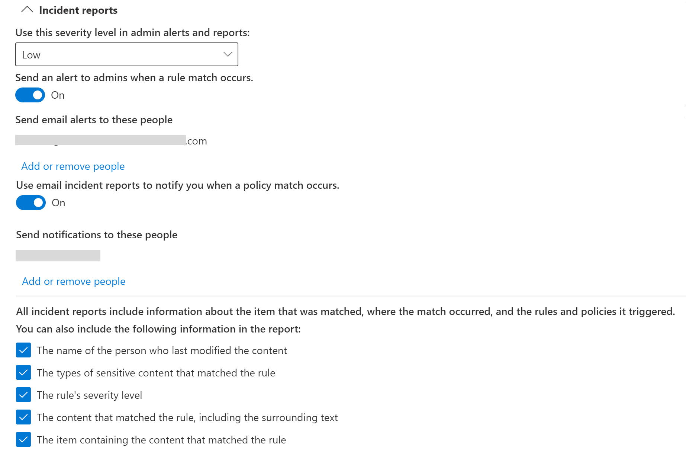

# Referenz zur Verhinderung von Datenverlust
 
> [!IMPORTANT]
> Dieses Referenzthema ist nicht mehr die Hauptressource für Microsoft 365 Verhinderung von Datenverlust (Data Loss Prevention, DLP). Der DLP-Inhaltssatz wird aktualisiert und neu strukturiert. Die in diesem Artikel behandelten Themen werden zu neuen, aktualisierten Artikeln geändert. Weitere Informationen zu DLP finden Sie [unter Learn about data loss prevention](dlp-learn-about-dlp.md).

<!-- this topic needs to be split into smaller, more coherent ones. It is confusing as it is. -->
<!-- move this note to a more appropriate place, no topic should start with a note -->
> [!NOTE]
> Kürzlich wurden Funktionen zur Verhinderung von Datenverlust zu den Microsoft Teams-Chat- und Kanalnachrichten für Benutzer hinzugefügt, die für Office 365 Advanced Compliance lizensiert sind. Sie sind als eigenständige Option verfügbar und in Office 365 E5 und Microsoft 365 E5 Compliance enthalten. Weitere Informationen zu den Lizenzierungsanforderungen finden Sie unter [Microsoft 365-Dienste auf Mandantenebene – Leitfaden zur Lizenzierung](/office365/servicedescriptions/microsoft-365-service-descriptions/microsoft-365-tenantlevel-services-licensing-guidance).

<!-- MOVED TO LEARN ABOUT To comply with business standards and industry regulations, organizations must protect sensitive information and prevent its inadvertent disclosure. Sensitive information can include financial data or personally identifiable information (PII) such as credit card numbers, social security numbers, or health records. With a data loss prevention (DLP) policy in the Office 365 Security &amp; Compliance Center, you can identify, monitor, and automatically protect sensitive information across Office 365.
  
With a DLP policy, you can:
  
- **Identify sensitive information across many locations, such as Exchange Online, SharePoint Online, OneDrive for Business, and Microsoft Teams.**
    
    For example, you can identify any document containing a credit card number that's stored in any OneDrive for Business site, or you can monitor just the OneDrive sites of specific people.
    
- **Prevent the accidental sharing of sensitive information**. 
    
    For example, you can identify any document or email containing a health record that's shared with people outside your organization, and then automatically block access to that document or block the email from being sent.
    
- **Monitor and protect sensitive information in the desktop versions of Excel, PowerPoint, and Word.**
    
    Just like in Exchange Online, SharePoint Online, and OneDrive for Business, these Office desktop programs include the same capabilities to identify sensitive information and apply DLP policies. DLP provides continuous monitoring when people share content in these Office programs.
    
- **Help users learn how to stay compliant without interrupting their workflow.**
    
    You can educate your users about DLP policies and help them remain compliant without blocking their work. For example, if a user tries to share a document containing sensitive information, a DLP policy can both send them an email notification and show them a policy tip in the context of the document library that allows them to override the policy if they have a business justification. The same policy tips also appear in Outlook on the web, Outlook, Excel, PowerPoint, and Word.
    
- **View DLP alerts and reports showing content that matches your organization’s DLP policies.**
    
    To view alerts and metadata related to your DLP policies you can use the [DLP Alerts Management Dashboard](dlp-configure-view-alerts-policies.md). You can also view policy match reports to assess how your organization is complying with a DLP policy. If a DLP policy allows users to override a policy tip and report a false positive, you can also view what users have reported

-->    
## Erstellen und Verwalten von DLP-Richtlinien

DLP-Richtlinien werden auf der DLP-Seite im Microsoft 365 Compliance Center erstellt und verwaltet.
  

  
<!-- MOVED TO LEARN ABOUT ## What a DLP policy contains

A DLP policy contains a few basic things:
  
- Where to protect the content: **locations** such as Exchange Online, SharePoint Online, and OneDrive for Business sites, as well as Microsoft Teams chat and channel messages. 
    
- When and how to protect the content by enforcing **rules** comprised of: 
    
  - **Conditions** the content must match before the rule is enforced. For example, a rule might be configured to look only for content containing Social Security numbers that's been shared with people outside your organization. 
    
  - **Actions** that you want the rule to take automatically when content matching the conditions is found. For example, a rule might be configured to block access to a document and send both the user and compliance officer an email notification. -->
    
Sie können eine Regel verwenden, um eine bestimmte Schutzanforderung zu erfüllen, und dann in einer DLP-Richtlinie allgemeine Schutzanforderungen in Gruppen zusammenfassen, z. B. alle zur Einhaltung einer bestimmten Vorschrift erforderlichen Regeln.
  
Angenommen, Sie verfügen über eine DLP-Richtlinie zur Erkennung von Informationen, die dem Health Insurance-Portability and Accountability Act (HIPAA) unterliegen. Mithilfe dieser DLP-Richtlinie können HIPAA-Daten („Was“) auf allen SharePoint Online- und OneDrive for Business-Websites („Wo“) geschützt werden, denn diese sucht nach allen Dokumenten mit diesen vertraulichen Informationen, die für Personen außerhalb Ihrer Organisation („Bedingungen“) freigeben sind, sperrt dann den Zugriff auf die Dokumente und sendet eine Benachrichtigung („Aktionen“). Diese Anforderungen sind als einzelne Regeln gespeichert und in einer DLP-Richtlinie zusammengefasst, um die Verwaltung und die Berichterstellung zu vereinfachen.
  

  
<!-- MOVED TO LEARN ABOUT ### Locations

DLP policies are applied to sensitive items across Microsoft 365 locations and can be further scoped as detailed in this table.

|Location | Include/exclude by|
|---------|---------|
|Exchange email| distribution groups|
|SharePoint sites |sites |
|OneDrive accounts |accounts |
|Teams chat and channel messages |accounts |
|Windows 10 devices |user or group |
|Microsoft Cloud App Security |instance |
 -->

Wenn Sie sich dazu entscheiden, bestimmte Verteilergruppen in Exchange einzubeziehen, wird die DLP-Richtlinie nur auf Mitglieder dieser Gruppe beschränkt. Ebenso wenn Sie eine Verteilergruppe ausschließen, werden auch alle Mitglieder dieser Verteilergruppe aus der Richtlinienauswertung ausgeschlossen. Sie können eine Richtlinie auf die Mitglieder von Verteilerlisten, dynamischen Verteilergruppen und Sicherheitsgruppen beschränken. Eine DLP-Richtlinie darf nicht mehr als 50 solche Einschlüsse und Ausschlüsse enthalten.

Wenn Sie festlegen, dass bestimmte SharePoint-Websites berücksichtigt oder ausgeschlossen werden sollen, beachten Sie, dass eine DLP-Richtlinie höchstens 100 solcher Ein- und Ausschlüsse enthalten kann. Diese Grenzwerte bestehen zwar, sie können jedoch durch das Anwenden einer organisationsweiten oder einer für ganze Speicherorte geltenden Richtlinie übergangen werden.

Wenn Sie festlegen, dass bestimmte OneDrive-Konten oder -Gruppen berücksichtigt oder ausgeschlossen werden sollen, beachten Sie, dass eine DLP-Richtlinie höchstens 100 Benutzerkonten bzw. 50 Gruppen als Ein- oder Ausschlüsse enthalten kann.

> [!NOTE]
> OneDrive for Business-Richtlinienbegrenzung mit Konten oder Gruppen befindet sich in der öffentlichen Vorschau. In dieser Phase können Sie Benutzerkonten und Gruppen als Teil einer DLP-Richtlinie entweder ein- oder ausschließen. Ein- und Ausschlüsse als Teil derselben Richtlinie werden nicht unterstützt.
  
### Regeln

> [!NOTE]
> Wenn keine Warnung konfiguriert wurde, ist das Standardverhalten einer DLP-Richtlinie, dass sie nicht warnt oder ausgelöst wird. Dies gilt nur für Standardinformationstypen. Bei benutzerdefinierten Informationstypen warnt das System auch dann, wenn in der Richtlinie keine Aktion definiert wurde.

Mithilfe von Regeln werden Ihre geschäftlichen Anforderungen in Bezug auf die Informationen Ihrer Organisation erzwungen. Eine Richtlinie enthält eine oder mehrere Regeln, und jede Regel besteht aus Bedingungen und Aktionen. Wenn die Bedingungen der einzelnen Regeln erfüllt sind, werden automatisch die entsprechenden Aktionen ausgeführt. Regeln werden der Reihe nach ausgeführt, wobei in jeder Richtlinie mit der Regel mit der höchsten Priorität begonnen wird.
  
Eine Regel bietet auch Optionen, um Benutzer (mit Richtlinientipps und E-Mail-Benachrichtigungen) und Administratoren (mit E-Mail-Schadensberichten) darüber zu informieren, dass Inhalte der Regel entsprechen.
  
Nachfolgend eine Liste der Komponenten einer Regel mit entsprechenden Erläuterungen.
  

  
#### Bedingungen

Mithilfe von Bedingungen werden die Arten von Informationen, nach denen Sie suchen, und der Zeitpunkt der Ausführung einer Aktion bestimmt. Deswegen sind sie so wichtig. So können Sie etwa festlegen, dass Inhalte mit Reisepassnummern ignoriert werden, es sei denn, ein Inhalt enthält mehr als zehn Reisepassnummern und ist für Personen außerhalb Ihrer Organisation freigegeben.
  
Bedingungen konzentrieren sich auf den **Inhalt**, z. B. die Arten von vertraulichen Informationen, nach denen Sie suchen, und auch auf den **Kontext**, z. B. für wen das Dokument freigegeben ist. Sie können Bedingungen verwenden, um für unterschiedliche Risikostufen unterschiedliche Aktionen festzulegen. So können beispielsweise intern freigegebene vertrauliche Inhalte einer niedrigeren Risikostufe angehören und somit weniger Aktionen erfordern als vertrauliche Inhalte, die für Personen außerhalb Ihrer Organisation freigegeben sind. 
  

  
Mit den derzeit verfügbaren Bedingungen können Sie ermitteln, ob:
  
- Der Inhalt eine Art vertraulicher Information enthält.
    
- Der Inhalt eine Bezeichnung enthält. Weitere Informationen finden Sie weiter unten im Abschnitt [Verwenden einer Aufbewahrungsbezeichnung als Bedingung in einer DLP-Richtlinie](#using-a-retention-label-as-a-condition-in-a-dlp-policy).
    
- Inhalte werden an Personen außerhalb oder innerhalb der Organisation weitergeleitet.

  > [!NOTE]
  > Benutzer, die keine Gastkonten im Active Directory- oder Azure Active Directory-Mandanten einer Hostorganisation besitzen, werden als Personen innerhalb der Organisation betrachtet.
    
#### Arten von vertraulichen Informationen

Mithilfe einer DLP-Richtlinie können vertrauliche Informationen geschützt werden, die als **vertraulicher Informationstyp** definiert sind. Microsoft 365 enthält Definitionen für viele gängige Typen vertraulicher Informationen aus den verschiedensten Bereichen, die Sie direkt verwenden können, z. B. Kreditkartennummer, Bankkontonummer, Personalausweisnummer und Reisepassnummer. 
  

  
Wenn eine DLP-Richtlinie nach einem vertraulichen Informationstyp wie z. B. einer Kreditkartennummer sucht, wird nicht einfach nach einer 16-stelligen Zahl gesucht. Jede Art vertraulicher Informationen wird durch eine Kombination der folgenden Elemente definiert und anhand dieser ermittelt:
  
- Schlüsselwörter.
    
- Interne Funktionen zur Überprüfung von Prüfsummen oder der Zusammensetzung.
    
- Auswertung regulärer Ausdrücke zum Auffinden übereinstimmender Muster.
    
- Andere Inhaltsuntersuchungsmethoden.
    
Dadurch erzielt die DLP-Erkennung einen hohen Grad an Zuverlässigkeit, und die Anzahl falsch positiver Ergebnisse, welche Mitarbeiter beim Arbeiten behindern können, wird verringert.
  
#### Aktionen

Wenn ein Inhalt mit einer Bedingung in einer Regel übereinstimmt, können Sie Aktionen anwenden, um den Inhalt automatisch zu schützen.
  

  
Mit den nun verfügbaren Aktionen können Sie:
  
- **Einschränken des Zugriffs auf die Inhalte** – Je nach Bedarf können Sie den Zugriff auf Inhalte auf drei Arten einschränken:

  1. Einschränken des Zugriffs auf Inhalte für alle.
  2. Einschränken des Zugriffs auf Inhalte für Personen außerhalb der Organisation.
  3. Einschränken des Zugriffs auf "Jeder mit dem Link".

  Für Websiteinhalt bedeutet dies, dass Berechtigungen für ein Dokument für alle Personen mit Ausnahme des primären Websitesammlungsadministrators, des Dokumentbesitzers und der Person, die zuletzt Änderungen am Dokument vorgenommen hat, eingeschränkt sind. Diese Personen können die vertraulichen Informationen aus dem Dokument entfernen oder andere Abhilfemaßnahmen ergreifen. Wenn das Dokument den Anforderungen entspricht, werden die ursprünglichen Berechtigungen automatisch wiederhergestellt. Wenn der Zugriff auf ein Dokument gesperrt ist, wird dieses Dokument in der Bibliothek auf der Website mit einem speziellen Richtlinientipp-Symbol angezeigt. 
    
  
  
  Im Fall von E-Mail-Inhalten blockiert diese Aktion das Senden der Nachricht. Abhängig von der Konfiguration der DLP-Regel erhält der Absender einen Unzustellbarkeitsbericht (wenn die Regel eine Benachrichtigung verwendet), oder es wird ein Richtlinientipp angezeigt bzw. eine E-Mail-Benachrichtigung gesendet.
    
  
  
#### Benutzerbenachrichtigungen und Benutzeraußerkraftsetzungen

Sie können Benutzerbenachrichtigungen und Benutzeraußerkraftsetzungen einsetzen, um Ihre Benutzer in Bezug auf DLP-Richtlinien zu schulen und sie dabei unterstützen, Bestimmungen kontinuierlich einzuhalten, ohne sie von ihrer Arbeit abzuhalten. Wenn Benutzer beispielsweise versuchen, ein Dokument mit vertraulichen Informationen freizugeben, kann ihnen über eine DLP-Richtlinie eine E-Mailbenachrichtigung gesendet und ein Richtlinientipp im Kontext der Dokumentbibliothek angezeigt werden, die es ihnen ermöglichen, die Richtlinie außer Kraft zu setzen, wenn sie dies geschäftlich begründen können.
  

  
Die E-Mail kann die Person, die den Inhalt gesendet, freigegeben oder zuletzt geändert hat, bzw. bei Websiteinhalten den primären Websitesammlungsadministrator und Dokumentbesitzer benachrichtigen. Darüber hinaus können Sie beliebige weitere Empfänger zur Benachrichtigungs-E-Mail hinzufügen oder entfernen.
  
Zusätzlich zum Senden einer E-Mail-Benachrichtigung wird eine Benutzerbenachrichtigung mit einem Richtlinientipp angezeigt:
  
- In Outlook und Outlook im Web.
    
- Für das Dokument auf einer SharePoint- oder OneDrive for Business-Website.
    
- In Excel, PowerPoint und Word, wenn das Dokument auf einer Website gespeichert ist, die in einer DLP-Richtlinie enthalten ist.
    
In der E-Mail-Benachrichtigung und dem Richtlinientipp wird erläutert, warum ein Inhalt mit einer DLP-Richtlinie in Konflikt steht. Bei entsprechender Auswahl können Benutzer über die E-Mail-Benachrichtigung und den Richtlinientipp eine Regel außer Kraft setzen, indem sie ein falsch positives Ergebnis melden oder eine geschäftliche Begründung angeben. Auf diese Weise können Sie Ihre Benutzer über Ihre DLP-Richtlinien unterrichten und diese erzwingen, ohne dass die Benutzer ihre Arbeit unterbrechen müssen. Informationen über Außerkraftsetzungen und falsch positive Ergebnisse werden für die Berichtserstellung auch protokolliert (siehe nachfolgenden Abschnitt zu DLP-Berichten) und in die Schadensberichte (nächster Abschnitt) aufgenommen, sodass der Compliance Officer diese Informationen regelmäßig einsehen kann.
  
So sieht ein Richtlinientipp in einem OneDrive for Business-Konto aus.
  

 Weitere Informationen zu Benachrichtigungen der Benutzer und Richtlinientipps in den DLP-Richtlinien finden Sie in [Verwenden von Benachrichtigungen und Richtlinientipps](use-notifications-and-policy-tips.md).

#### Warnungen und Vorfallsberichte

Bei einer Übereinstimmung mit einer Regel können Sie eine E-Mail-Warnung mit Details zur Warnung an Ihren Compliance Officer (oder an beliebige andere Personen) senden. Diese E-Mail-Warnung enthält einen Link zum [Verwaltungsdashboard für DLP-Warnungen](dlp-configure-view-alerts-policies.md), zu dem der Compliance Officer zum Anzeigen der Details zu den Warnungen und Ereignissen wechseln kann. Das Dashboard enthält Details zu dem Ereignis, durch das die Warnung ausgelöst wurde, sowie zur entsprechenden DLP-Richtlinie und den erkannten vertraulichen Inhalten.

Darüber hinaus können Sie auch einen Vorfallsbericht mit Details zum Ereignis senden. Dieser Bericht enthält Informationen zum Element, für das eine Übereinstimmung gefunden wurde, zum Inhalt, der mit der Regel übereinstimmte, und zum Namen der Person, die den Inhalt zuletzt geändert hat. Bei E-Mail-Nachrichten wird dem Bericht außerdem die ursprüngliche Nachricht, die einer DLP-Richtlinie entspricht, als Anlage beigefügt.

> [!div class="mx-imgBorder"]
> 

DLP überprüft E-Mails anders als Elemente in SharePoint Online oder OneDrive for Business. In SharePoint Online und OneDrive for Business überprüft DLP vorhandene sowie neue Elemente und generiert bei jeder gefundenen Übereinstimmung eine Warnung und einen Vorfallsbericht. In Exchange Online überprüft DLP nur neue E-Mail-Nachrichten und generiert einen Bericht, wenn eine Richtlinienübereinstimmung vorliegt. DLP überprüft oder vergleicht ***nicht*** zuvor vorhandene E-Mail-Elemente, die in einem Postfach oder Archiv gespeichert sind.
  
## Gruppieren und logische Operatoren

Häufig enthält eine DLP-Richtlinie eine recht klare Anforderung, z. B. alle Inhalte zu identifizieren, die eine deutsche Sozialversicherungsnummer enthalten. Möglicherweise muss Ihre DLP-Richtlinie in anderen Szenarien jedoch weniger exakt definierte Daten identifizieren.
  
Wenn beispielsweise Inhalte identifiziert werden sollen, die dem Health Insurance Act (HIPAA) der USA unterliegen, muss nach folgenden Inhalten gesucht werden:
  
- Inhalte, die bestimmte Arten von vertraulichen Informationen enthalten, z. B. eine deutsche  Sozialversicherungsnummer oder eine DEA-Nummer (Drug Enforcement Agency, Drogenvollzugsbehörde).
    
    UND
    
- Inhalte, die schwieriger zu erkennen sind, z. B. Schriftstücke über die Pflege eines Patienten oder mit Beschreibungen der geleisteten medizinischen Dienste. Zum Identifizieren dieser Inhalte müssen passende Schlüsselwörter aus sehr umfangreichen Listen verwendet werden, z. B. der Internationalen Klassifikation von Krankheiten (ICD-9-CM oder ICD-10-CM).
    
Solche lose definierten Daten lassen sich leicht mithilfe von Gruppierung und logischen Operatoren (UND, ODER) identifizieren. Wenn Sie eine DLP-Richtlinie erstellen, können Sie:
  
- Typen vertraulicher Informationen gruppieren
    
- Den logischen Operator zwischen den Typen vertraulicher Informationen innerhalb einer Gruppe und zwischen den Gruppen auswählen.
    
### Auswählen des Operators innerhalb einer Gruppe

Mit einem Operator innerhalb einer Gruppe wählen Sie aus, ob eine oder alle Bedingungen in dieser Gruppe erfüllt sein müssen, damit der Inhalt der Regel entspricht.
  

  
### Hinzufügen einer Gruppe

Sie können eine Gruppe, die eigene Bedingungen und einen eigenen Operator innerhalb dieser Gruppe aufweisen kann, schnell und einfach hinzufügen.
  

  
### Auswählen des Operators zwischen Gruppen

Mit einem Operator zwischen Gruppen wählen Sie aus, ob die Bedingungen in einer Gruppe oder die Bedingungen in allen Gruppen erfüllt sein müssen, damit der Inhalt der Regel entspricht.
  
Die integrierte **U.S. HIPAA**-Richtlinie enthält beispielsweise eine Regel mit einem **UND**-Operator zwischen den Gruppen, damit Inhalte identifiziert werden, die Folgendes enthalten: 
  
- aus der Gruppe **PII-Bezeichner** (mindestens eine Sozialversicherungsnummer **ODER** eine DEA-Nummer) 
    
    **UND**
    
- aus der Gruppe **Medizinische Begriffe** (mindestens ein ICD-9-CM-Schlüsselwort **ODER** ein ICD-10-CM-Schlüsselwort) 
    

  
## Die Priorität, mit der Regeln verarbeitet werden

Wenn Sie in einer Richtlinie Regeln erstellen, wird jeder Regel eine Priorität in der Reihenfolge ihrer Erstellung zugewiesen, was bedeutet, dass die zuerst erstellte Regel oberste Priorität, die danach erstellte Regel die zweite Priorität usw. erhält.

> [!div class="mx-imgBorder"]
> 
  
Nachdem Sie mehr als eine DLP-Richtlinie eingerichtet haben, können Sie die Priorität einer oder mehrerer Richtlinien ändern. Wählen Sie dazu eine Richtlinie aus, wählen Sie **Richtlinie bearbeiten** aus, und verwenden Sie die **Prioritätsliste**, um deren Priorität anzugeben.

> [!div class="mx-imgBorder"]
> 

Wenn Inhalte anhand von Regeln ausgewertet werden, werden diese Regeln in der Reihenfolge ihrer Priorität verarbeitet. Wenn ein Inhalt mehreren Regeln entspricht, werden die Regeln in der Reihenfolge ihrer Priorität verarbeitet, und die jeweils restriktivste Aktion wird durchgeführt. Wenn ein Inhalt beispielsweise allen folgenden Regeln entspricht, wird Regel 3 angewandt, da sie die höchste Priorität hat und die restriktivste Regel ist:
  
- Regel 1: Benutzer nur benachrichtigen
    
- Regel 2: Benutzer benachrichtigen, Zugriff beschränken und Benutzeraußerkraftsetzung zulassen
    
- Regel 3: Benutzer benachrichtigen, Zugriff beschränken und keine Benutzeraußerkraftsetzung zulassen
    
- Regel 4: Benutzer nur benachrichtigen
    
- Regel 5: Zugriff beschränken
    
- Regel 6: Benutzer benachrichtigen, Zugriff beschränken und keine Benutzeraußerkraftsetzung zulassen
    
Beachten Sie, dass in diesem Beispiel Übereinstimmungen für alle Regeln in den Überwachungsprotokollen aufgezeichnet und in den DLP-Berichten angezeigt werden, obwohl nur die restriktivste Regel angewandt wird.
  
Beachten Sie Folgendes in Bezug auf Richtlinientipps:
  
- Nur der Richtlinientipp zu der Regel, die die höchste Priorität aufweist und die am restriktivsten ist, wird angezeigt. So hat beispielsweise der Richtlinientipp zu einer Regel, die Zugriff auf Inhalte blockiert, Vorrang gegenüber dem Richtlinientipp zu einer Regel, die einfach nur eine Benachrichtigung sendet. Dadurch wird verhindert, dass Benutzern eine umfangreiche Liste von Richtlinientipps angezeigt wird.
    
- Wenn die Richtlinientipps in der restriktivsten Regel Benutzern erlauben, die Regel außer Kraft zu setzen, werden dadurch auch alle anderen Regeln überschrieben, die für den Inhalt gelten.
    
## Optimieren von Regeln, um Übereinstimmungen zu vereinfachen oder zu erschweren

Nachdem man eine DLP-Richtlinie erstellt und aktiviert hat, ergeben sich manchmal die folgenden Probleme:
  
- Zu viele Inhalte, bei denen es sich **nicht** um vertrauliche Informationen handelt, entsprechen der Regel. Anders ausgedrückt, es gibt zu viele falsch positive Ergebnisse. 
    
- Zu wenig Inhalte, die vertrauliche Informationen **sind**, entsprechen den Regeln. Anders ausgedrückt, die Schutzaktionen werden bei diesen vertraulichen Informationen nicht umgesetzt. 
    
Um diese Probleme zu beheben, können Sie Ihre Regeln verbessern, indem Sie die Anzahl der Instanzen und die Übereinstimmungsgenauigkeit anpassen, um die Übereinstimmung von Inhalten mit den Regeln zu erschweren oder zu vereinfachen. Jeder Typ vertraulicher Informationen, der in einer Regel verwendet wird, verfügt sowohl über eine Instanzenanzahl als auch über eine Übereinstimmungsgenauigkeit.
  
### Instanzenanzahl

Die Instanzenanzahl gibt einfach nur an, wie oft ein bestimmter Typ vertraulicher Informationen vorkommen muss, damit ein Inhalt der Regel entspricht. So entspricht beispielsweise ein Inhalt der Regel unten, wenn darin zwischen 1 und 9 eindeutige US-amerikanische oder britische Passnummern erkannt wurden.

> [!NOTE]
> Bei der Anzahl der Instanzen werden nur **einmalig vorkommende** Übereinstimmungen für vertrauliche Informationstypen und Stichwörter gezählt. Wenn in einer E-Mail-Nachricht beispielsweise 10 mal die gleiche Kreditkartennummer vorkommt, zählen diese 10 Vorkommen als eine einzige Kreditkartennummerinstanz.
  
Die Optimierung von Regeln mithilfe der Instanzenanzahl ist einfach:
  
- Damit für die Regel einfacher Übereinstimmungen gefunden werden können, verringern Sie die Werte für die **min**-Anzahl und/oder erhöhen Sie die **max**-Anzahl. Sie können **max** auch auf **beliebig** festlegen, indem Sie den numerischen Wert löschen. 
    
- Um die Übereinstimmung mit der Regel zu erschweren, erhöhen Sie den Wert für die **Mindestanzahl**. 
    
Normalerweise verwenden Sie in einer Regel mit einer geringeren Instanzenanzahl (beispielsweise 1-9) weniger restriktive Aktionen wie das Senden von Benachrichtigungen an Benutzer. In einer Regel mit einer höheren Instanzenanzahl (beispielsweise 10-beliebig) verwenden Sie restriktivere Aktionen wie das Einschränken des Zugriffs auf Inhalte, ohne Benutzeraußerkraftsetzung zuzulassen.
  

  
### Treffergenauigkeit

Wie vorstehend beschrieben wird jeder Typ vertraulicher Informationen durch eine Kombination unterschiedlicher Arten von Beweisen definiert und ermittelt. Im Allgemeinen wird ein Typ vertraulicher Informationen durch mehrere solche Kombinationen, den so genannten Mustern, definiert. Ein Muster, das weniger Beweise erfordert, verfügt über eine geringere Übereinstimmungsgenauigkeit (oder Vertrauensstufe), während ein Muster, das mehr Beweise erfordert, über eine höhere Übereinstimmungsgenauigkeit (oder Vertrauensstufe) verfügt. Wenn Sie mehr über die tatsächlichen Muster und Vertrauensstufen, die von jedem Typ vertraulicher Informationen verwendet werden, wissen möchten, lesen Sie [Entitätsdefinitionen für Typen vertraulicher Informationstypen](sensitive-information-type-entity-definitions.md).
  
So wird der Typ vertraulicher Informationen mit Namen Kreditkartennummer durch zwei Muster definiert:
  
- Ein Muster mit einer Vertrauensstufe von 65 %, das Folgendes voraussetzt:
    
  - Eine Nummer im Format einer Kreditkartennummer
    
  - Eine Nummer, die die Prüfsumme übergibt
    
- Ein Muster mit einer Vertrauensstufe von 85 %, das Folgendes voraussetzt:
    
  - Eine Nummer im Format einer Kreditkartennummer
    
  - Eine Nummer, die die Prüfsumme übergibt
    
  - Ein Stichwort oder ein Ablaufdatum im korrekten Format
    
Sie können diese Vertrauensstufen (oder die Übereinstimmungsgenauigkeit) in Ihren Regeln verwenden. Normalerweise verwenden Sie in einer Regel mit einer geringeren Übereinstimmungsgenauigkeit weniger restriktive Aktionen wie das Senden von Benachrichtigungen an Benutzer. In einer Regel mit höherer Übereinstimmungsgenauigkeit verwenden Sie restriktivere Aktionen wie das Einschränken des Zugriffs auf Inhalte, ohne Benutzeraußerkraftsetzung zuzulassen.
  
Es ist wichtig zu verstehen, dass nur eine einzige Vertrauensstufe zurückgegeben wird, wenn in einem Inhalt ein bestimmter Typ vertraulicher Informationen wie eine Kreditkartennummer erkannt wird:
  
- Wenn alle Übereinstimmungen einem einzigen Muster entsprechen, wird die Vertrauensstufe für dieses Muster zurückgegeben.
    
- Wenn es Übereinstimmungen für mehr als ein Muster gibt (wenn es beispielsweise Übereinstimmungen mit zwei unterschiedlichen Vertrauensstufen gibt), wird eine Vertrauensstufe zurückgegeben, die höher als die der einzelnen Muster ist. Das ist der schwierige Teil. Wenn es bei einer Kreditkarte beispielsweise Übereinstimmungen für die 65 %igen und die 85 %igen Muster gibt, ist die Vertrauensstufe, die für diesen Typ vertraulicher Informationen höher als 90 %, da mehr Beweise mehr Vertrauen bedeuten.
    
Wenn Sie also zwei sich gegenseitig ausschließende Regeln für Kreditkarten erstellen möchten, eine für die 65 %ige Übereinstimmungsgenauigkeit und eine für die 85 %ige Übereinstimmungsgenauigkeit, sehen die Bereiche für die Übereinstimmungsgenauigkeit folgendermaßen aus: Mit der ersten Regel werden nur Übereinstimmungen mit dem 65 %igen Muster erfasst. Mit der zweiten Regel werden Übereinstimmungen mit **mindestens einer** 85 %igen Übereinstimmung erfasst, und sie **kann potenziell** auch weitere, niedrigere Vertrauensübereinstimmungen erfassen. 
  

  
Aus diesen Gründen lautet die Anleitung zum Erstellen von Regeln mit unterschiedlichen Übereinstimmungsgenauigkeiten wie folgt:
  
- Für die niedrigste Vertrauensstufe wird normalerweise derselbe Wert für **min** und **max** (und kein Bereich) verwendet. 
    
- Bei der höchsten Vertrauensstufe handelt es sich normalerweise um einen Bereich, der von direkt über der niedrigeren Vertrauensstufe bis 100 reicht.
    
- Alle dazwischen liegenden Vertrauensstufen rangieren normalerweise von direkt über der niedrigeren Vertrauensstufe bis direkt unterhalb der höheren Vertrauensstufe.
    
## Verwenden einer Aufbewahrungsbezeichnung als Bedingung in einer DLP-Richtlinie

Wenn Sie eine zuvor erstellte und veröffentlichte [Aufbewahrungsbezeichnung](retention.md#retention-labels) als Bedingung in einer DLP-Richtlinie verwenden, müssen Sie Folgendes beachten:

- Die Aufbewahrungsbezeichnung muss vor der Verwendung als Bedingung in einer DLP-Richtlinie erstellt und veröffentlicht werden.
- Die Synchronisierung veröffentlichter Aufbewahrungsbezeichnungen kann ein bis sieben Tage dauern. Weitere Informationen zu Aufbewahrungsbezeichnungen, die in einer Aufbewahrungsrichtlinie veröffentlicht sind, finden Sie unter [Wann Aufbewahrungsbezeichnungen zur Verfügung stehen](create-apply-retention-labels.md#when-retention-labels-become-available-to-apply) und zu automatisch veröffentlichten Aufbewahrungsbezeichnungen unter [Wie lange dauert es, bis Aufbewahrungsbezeichnungen übernommen werden](apply-retention-labels-automatically.md#how-long-it-takes-for-retention-labels-to-take-effect).
- Die Verwendung einer Aufbewahrungsbezeichnung in einer Richtlinie **wird nur für Elemente in SharePoint und OneDrive** unterstützt.

  

  Vielleicht möchten Sie in einer DLP-Richtlinie eine Aufbewahrungsbezeichnung verwenden, weil Elemente vorliegen, die unter Aufbewahrung und Disposition stehen, und Sie auch andere Kontrollelemente anwenden möchten wie z. B.:

  - Sie haben eine Aufbewahrungsbezeichnung namens **Steuerjahr 2018** veröffentlicht, durch deren Anwendung auf Steuerdokumente von 2018, die in SharePoint gespeichert sind, diese für 10 Jahre aufbewahrt und dann freigegeben werden. Sie möchten außerdem nicht, dass diese Elemente außerhalb Ihrer Organisation freigegeben werden, wofür Sie mit einer DLP-Richtlinie sorgen können.

  > [!IMPORTANT]
  > Wenn Sie eine Aufbewahrungsbezeichnung als Bedingung in einer DLP-Richtlinie angeben und zudem Exchange und/oder Microsoft Teams als Speicherort verwenden, wird die folgende Fehlermeldung angezeigt: **"Der Schutz von mit Bezeichnungen versehenen Inhalten in E-Mail- und Teams-Nachrichten wird nicht unterstützt. Entfernen Sie die Bezeichnung unten, oder deaktivieren Sie Exchange und Microsoft Teams als Speicherort."** Der Grund dafür ist, dass der Exchange-Transport die Bezeichnungsmetadaten beim Senden und Zustellen von Nachrichten nicht ausgewertet. 

### Verwenden einer Vertraulichkeitsbezeichnung als Bedingung in einer DLP-Richtlinie

Vertraulichkeitsbezeichnung als Bedingung in DLP-Richtlinien befindet sich derzeit in der Vorschau. [Weitere Informationen](./dlp-sensitivity-label-as-condition.md).
  
### Die Beziehung dieses Features zu anderen Features

Auf Inhalte mit vertraulichen Informationen können verschiedene Features angewendet werden:
  
- Sowohl eine [Aufbewahrungsbezeichnung als auch eine Aufbewahrungsrichtlinie](retention.md) kann Aktionen zur **Aufbewahrung** für diese Inhalte erzwingen. 
    
- Mit einer DLP-Richtlinie können Aktionen zum **Schutz** dieser Inhalte erzwungen werden. Und bevor diese Aktionen erzwungen werden, kann eine DLP-Richtlinie vorsehen, dass zusätzlich zum Inhalt mit einer Bezeichnung noch andere Bedingungen erfüllt werden müssen. 
    

  
Beachten Sie, dass eine DLP-Richtlinie eine umfangreichere Erkennungsfunktionalität aufweist als eine Bezeichnung oder Aufbewahrungsrichtlinie, die vertraulichen Informationen zugewiesen ist. Eine DLP-Richtlinie kann Schutzaktionen für Inhalte mit vertraulichen Informationen erzwingen. Wenn die vertraulichen Informationen aus dem Inhalt entfernt werden, erfolgt nach der nächsten Untersuchung des Inhalts die Aufhebung dieser Schutzaktionen. Wenn hingegen eine Aufbewahrungsrichtlinie oder Bezeichnung auf Inhalt mit vertraulichen Informationen angewendet wird, handelt es sich um eine einmalige Aktion, die nicht rückgängig gemacht wird, selbst wenn die vertraulichen Informationen entfernt wurden.
  
Durch Verwenden einer Bezeichnung als Bedingung in Ihrer DLP-Richtlinie können Sie für Inhalte mit dieser Bezeichnung sowohl Aufbewahrungs- als auch Schutzaktionen erzwingen. Sie können sich Inhalte mit einer Bezeichnung exakt wie Inhalte mit vertraulichen Informationen vorstellen. Sowohl eine Bezeichnung als auch der vertrauliche Informationstyp sind Eigenschaften zum Klassifizieren von Inhalten, damit Sie Aktionen für diese erzwingen können.
  

  
## Die einfachen Einstellungen im Vergleich zu den erweiterten Einstellungen

Beim Erstellen einer DLP-Richtlinie können Sie zwischen einfachen und erweiterten Einstellungen auswählen:
  
- **Einfache Einstellungen** machen es leicht, die am häufigsten verwendeten Typen von DLP-Richtlinien zu erstellen, ohne Regeln mit dem Regel-Editor erstellen oder ändern zu müssen. 
    
- **Erweiterte Einstellungen** sehen die Verwendung des Regel-Editors vor, um Ihnen die vollständige Kontrolle über jede Einstellung für Ihre DLP-Richtlinie zu geben. 
    
Keine Sorge, hinter den Kulissen funktionieren die einfachen Einstellungen und die erweiterten Einstellungen genau gleich. Beide erzwingen aus Bedingungen und Aktionen bestehende Regeln, nur dass der Regel-Editor bei den einfachen Einstellungen nicht angezeigt wird. Dies ist eine schnelle Möglichkeit zum Erstellen einer DLP-Richtlinie.
  
### Einfache Einstellungen

Das bei Weitem häufigste DLP-Szenario ist das Erstellen einer Richtlinie, mit der Sie Inhalte mit vertraulichen Informationen vor der Freigabe für Personen außerhalb Ihrer Organisation schützen und eine automatische Abhilfemaßnahme erstellen, indem Sie z. B. den Zugriff auf den Inhalt einschränken, Endbenutzern oder Administratoren Benachrichtigungen senden und das Ereignis für eine spätere Untersuchung überwachen. Personen verwenden DLP, um zu verhindern, dass vertrauliche Informationen versehentlich veröffentlicht werden.
  
Um dieses Ziel einfacher zu erreichen, können Sie beim Erstellen einer DLP-Richtlinie **Einfache Einstellungen verwenden** auswählen. Diese Einstellungen bieten alles, was Sie benötigen, um die am häufigsten verwendeten DLP-Richtlinien zu implementieren, ohne in den Regel-Editor wechseln zu müssen.
  

  
### Erweiterte Einstellungen

Wenn Sie speziellere DLP-Richtlinien erstellen müssen, können Sie **Erweiterte Einstellungen verwenden** auswählen.
  
Die erweiterten Einstellungen präsentieren Ihnen den Regel-Editor, mit dem Sie die vollständige Kontrolle über alle verfügbaren Optionen haben, einschließlich Anzahl der Instanzen und Übereinstimmungsgenauigkeit (Vertrauensstufe) für jede Regel.
  
Um schnell zu einem bestimmten Abschnitt zu springen, klicken Sie auf der oberen Navigationsleiste des Regel-Editors auf ein Element, um unten zum betreffenden Abschnitt zu wechseln.
  

  
## DLP-Richtlinienvorlagen

Der erste Schritt beim Erstellen einer DLP-Richtlinie besteht in der Auswahl der zu schützenden Informationen. Wenn Sie mit einer DLP-Richtlinienvorlage beginnen, müssen Sie nicht alle Regeln von Grund auf neu erstellen und sich überlegen, welche Arten von Informationen standardmäßig einbezogen werden sollen. Anschließend können Sie diese Anforderungen ergänzen oder ändern, um die Regel an die spezifischen Anforderungen Ihrer Organisation anzupassen.
  
Mithilfe einer vorkonfigurierten DLP-Richtlinienvorlage können spezifische Arten von vertraulichen Informationen ermittelt werden, wie z. B. HIPAA-Daten, PCI-DSS-Daten, Gramm-Leach-Bliley Act-Daten oder sogar standortspezifisch personenbezogene Informationen (PII). Damit Sie allgemeine Typen vertraulicher Informationen schnell ausfindig machen und schützen können, weisen die in Microsoft 365 enthaltenen Richtlinienvorlagen bereits die gängigsten Typen vertraulicher Informationen auf, sodass Sie schnell einen Einstieg finden.
  

  
Ihre Organisation weist aber möglicherweise ihre ganz eigenen speziellen Anforderungen auf. In diesem Fall können Sie eine DLP-Richtlinie auch von Grund auf neu erstellen, indem Sie die Option **Benutzerdefinierte Richtlinie** auswählen. Eine benutzerdefinierte Richtlinie ist leer und enthält keine vordefinierten Regeln. 
  
## Allmähliches Bereitstellen von DLP-Richtlinien im Testmodus

Beim Erstellen von DLP-Richtlinien sollten Sie eine schrittweise Einführung in Erwägung ziehen, um ihre Auswirkungen zu bewerten und ihre Wirksamkeit zu testen, bevor Sie sie in umfassendem Maße erzwingen. Sie möchten beispielsweise nicht, dass eine neue DLP-Richtlinie versehentlich den Zugriff auf Tausende von Dokumenten sperrt, die von den Benutzern für ihre Arbeit benötigt werden.
  
Wenn Sie DLP-Richtlinien erstellen, die potenziell weitreichende Auswirkungen haben können, empfehlen wir, in der folgenden Reihenfolge vorzugehen:
  
1. **Beginnen Sie im Testmodus ohne Richtlinientipps**, und werten Sie die Auswirkungen dann anhand der DLP-Berichte aus. Sie können DLP-Berichte verwenden, um Anzahl, Ort, Typ und Schwere von Richtlinienübereinstimmungen anzuzeigen. Basierend auf den Ergebnissen können Sie die Regeln bei Bedarf anpassen. Im Testmodus haben DLP-Richtlinien keinen Einfluss auf die Produktivität der Mitarbeiter in Ihrer Organisation. 
    
2. **Fahren Sie im Testmodus mit Benachrichtigungen und Richtlinientipps fort**, sodass Sie die Benutzer über die Einhaltungsrichtlinien in Kenntnis setzen und auf die Anwendung der Regeln vorbereiten können. In dieser Phase können Sie die Benutzer auch bitte, Sie über falsche Positivmeldungen zu benachrichtigen, damit Sie die Regeln noch besser abstimmen können. 
    
3. **Beginnen Sie mit der vollständigen Durchsetzung der Richtlinien**, sodass die Aktionen in den Regeln angewendet werden und der Inhalt geschützt ist. Überwachen Sie weiterhin die DLP-Berichte und alle Schadensberichte oder Benachrichtigungen, um sicherzustellen, dass die von Ihnen gewünschten Ergebnisse erzielt werden. 

    

    Sie können eine DLP-Richtlinie jederzeit deaktivieren. Dies wirkt sich auf alle Regeln in der Richtlinie aus. Jede Regel kann aber auch einzeln deaktiviert werden, indem ihr Status im Regel-Editor geändert wird.

    

    Sie können auch die Priorität mehrerer Regeln in einer Richtlinie ändern. Öffnen Sie dazu eine Richtlinie zur Bearbeitung. Klicken Sie in einer Zeile für eine Regel auf die drei Auslassungspunkte (**...**), und wählen Sie dann eine Option aus, z. B. **Nach unten** oder **Nach ganz unten**.

    > [!div class="mx-imgBorder"]
    > 
  
## DLP-Berichte

Nachdem Sie DLP-Richtlinien erstellt und aktiviert haben, müssen Sie sicherstellen, dass sie wie gewünscht funktionieren und Sie bei der Richtlinieneinhaltung unterstützen. Den DLP-Berichten können Sie schnell die Anzahl der DLP-Richtlinien- und -Regelübereinstimmungen sowie die Anzahl von falsch positiven Ergebnissen und Außerkraftsetzungen entnehmen. Sie können die Übereinstimmungen in einem Bericht nach Speicherort und Zeitrahmen filtern und sogar auf eine bestimmte Richtlinie, Regel oder Aktion eingrenzen.
  
DLP-Berichte bieten Ihnen geschäftliche Einblicke und ermöglichen Ihnen Folgendes:
  
- Sie können sich auf bestimmte Zeiträume konzentrieren und so mehr über die Gründe für Spitzen und Trends erfahren.
    
- Sie können die Geschäftsprozesse ermitteln, die gegen die Einhaltungsrichtlinien Ihrer Organisation verstoßen.
    
- Sie können die geschäftlichen Auswirkungen der DLP-Richtlinien besser nachvollziehen.
    
Darüber hinaus können Sie die DLP-Berichte verwenden, um Ihre DLP-Richtlinien optimieren, wenn sie ausgeführt werden.
  

  
## Funktionsweise von DLP-Richtlinien

DLP erkennt vertrauliche Informationen mithilfe einer eingehenden Inhaltsanalyse (nicht nur einer einfachen Textprüfung). Bei dieser eingehenden Inhaltsanalyse werden Schlüsselwortübereinstimmung, Wörterbuchübereinstimmungen, die Auswertung regulärer Ausdrücke, interne Funktionen sowie weitere Inhaltsuntersuchungsmethoden herangezogen, um Inhalte zu erkennen, welche die DLP-Richtlinien erfüllen. Möglicherweise gilt nur ein kleiner Prozentsatz Ihrer Daten als vertraulich. Eine DLP-Richtlinie kann nur diese Daten bestimmen, überwachen und automatisch schützen, ohne Personen zu behindern, die mit den restlichen Inhalten arbeiten.
  
### Richtlinien werden synchronisiert

Nach der Erstellung einer DLP-Richtlinie im Security &amp; Compliance Center wird diese in einem zentralen Richtlinienspeicher abgelegt und dann mit den verschiedenen Inhaltsquellen synchronisiert, einschließlich:
  
- Exchange Online und von dort aus mit Outlook im Web und Outlook.
    
- OneDrive for Business-Websites.
    
- SharePoint Online-Websites.
    
- Office-Desktopprogrammen (Excel, PowerPoint und Word).

- Microsoft Teams-Kanälen und Chatnachrichten.
    
Nachdem die Richtlinie mit den richtigen Speicherorten synchronisiert wurde, werden Inhalte ausgewertet und Aktionen erzwungen.
<!-- what is the time delay for first deployment of a policy and what is the sync schedule? -->
  
### Richtlinienauswertung in OneDrive for Business- und SharePoint Online-Websites

Die Dokumente auf Ihren SharePoint Online- und OneDrive for Business-Websites ändern sich ständig: Sie werden erstellt, bearbeitet, freigegeben und vieles mehr. Dies hat zur Folge, dass Dokumente jederzeit mit einer DLP-Richtlinie in Konflikt geraten oder richtlinienkonform werden können. So kann beispielsweise eine Person ein Dokument, das keine vertraulichen Informationen enthält, auf die Teamwebsite hochladen und eine andere Person zu einem späteren Zeitpunkt das Dokument bearbeiten und diesem vertrauliche Informationen hinzufügen.
  
Aus diesem Grund überprüfen DLP-Richtlinien Dokumente häufig im Hintergrund auf Richtlinienübereinstimmungen. Sie können sich dies als asynchrone Richtlinienauswertung vorstellen.<!-- what is the frequency? looks like it is tied to the search crawl schedule -->
  
#### Funktionsweise
 
Während Dokumente auf Websites hinzugefügt oder geändert werden, werden die Inhalte vom Suchmodul überprüft, wodurch eine spätere Suche danach ermöglicht wird. Währenddessen wird der Inhalt auch auf vertrauliche Informationen und eine etwaige Freigabe überprüft. Alle gefundenen vertraulichen Informationen werden sicher im Suchindex gespeichert. Auf diesen kann nur das Complianceteam, nicht der normale Benutzer zugreifen. Jede aktivierte DLP-Richtlinie wird im Hintergrund (asynchron) ausgeführt. Dabei werden Suchergebnisse regelmäßig auf Inhalte überprüft, die mit einer Richtlinie übereinstimmen, und es werden Aktionen angewendet, um diese Inhalte vor einer versehentlichen Veröffentlichung zu schützen.
  

  
<!-- conflict with a DLP policy is bad wording --> Dokumente können jedoch nicht nur mit einer DLP-Richtlinie in Konflikt stehen, sondern es können auch Änderungen vorgenommen werden, die dazu führen, dass sie nun einer DLP-Richtlinie entsprechen. Wenn eine Person zum Beispiel einem Dokument Kreditkartennummern hinzufügt, kann dies dazu führen, dass die DLP-Richtlinie den Zugriff auf das Dokument automatisch sperrt. Wenn die Person jedoch später die vertraulichen Informationen entfernt, wird die Aktion (in diesem Fall die Sperre) automatisch entfernt, wenn das Dokument das nächste Mal anhand der Richtlinie ausgewertet wird.
  
Eine DLP wertet alle Inhalte aus, die indiziert werden können. Weitere Informationen zu den Dateitypen, die standardmäßig durchforstet werden, finden Sie unter [Standardmäßig durchforstete Dateinamenerweiterungen und analysierte Dateitypen in SharePoint Server](/SharePoint/technical-reference/default-crawled-file-name-extensions-and-parsed-file-types).

> [!NOTE]
> Um zu verhindern, dass Dokumente freigegeben werden, bevor DLP-Richtlinien sie analysieren können, kann die Freigabe neuer Dateien in SharePoint blockiert werden, bis der Inhalt indiziert wurde. Ausführliche Informationen finden Sie unter [Neue Dateien standardmäßig als vertraulich kennzeichnen](/sharepoint/sensitive-by-default). 
  
### Richtlinienauswertung in Exchange, Outlook und Outlook im Web

Wenn Sie eine DLP-Richtlinie erstellen, die Exchange Online als Speicherort umfasst, wird diese Richtlinie von Office 365 Security &amp; Compliance Center mit Exchange Online und dann von Exchange Online mit Outlook im Web und Outlook synchronisiert.
  
Beim Verfassen einer Nachricht in Outlook können Richtlinientipps für den Benutzer angezeigt werden, während die erstellten Inhalte anhand der DLP-Richtlinien ausgewertet werden. Und nach dem Senden einer Nachricht wird diese im Rahmen des normalen E-Mail-Flusses anhand der DLP-Richtlinien sowie der im Exchange Admin Center erstellten Exchange-Nachrichtenflussregeln (auch als Transportregeln bezeichnet) und DLP-Richtlinien ausgewertet. DLP-Richtlinien überprüfen die Nachricht und alle Anlagen.
  
### Richtlinienauswertung in den Office-Desktopprogrammen

<!-- same capability to identify sensitive information line conflates sensitive information types and such -->
Excel, PowerPoint und Word enthalten dieselben Funktionen wie SharePoint Online und OneDrive for Business, um vertrauliche Informationen zu identifizieren und DLP-Richtlinien anzuwenden. Diese Office-Programme synchronisieren ihre DLP-Richtlinien direkt über den zentralen Richtlinienspeicher und bewerten dann kontinuierlich Inhalte anhand der DLP-Richtlinien, wenn Benutzer mit Dokumenten arbeiten, die von einem in einer DLP-Richtlinie enthaltenen Ort geöffnet werden.
  
Die DLP-Richtlinienauswertung in Office wirkt sich nicht auf die Leistung der Programme oder die Produktivität der Mitarbeiter aus, die mit solchen Inhalten arbeiten. Wenn ein großes Dokument bearbeitet wird oder der Computer eines Benutzers ausgelastet ist, kann es möglicherweise einige Sekunden dauern, bis ein Richtlinientipp angezeigt wird.

### Richtlinienauswertung in Microsoft Teams
 <!--what do you mean that it's synched to user accounts?  I thought DLP policies were applied to locations not users like sensitivity labels are  -->

Wenn Sie eine DLP-Richtlinie erstellen, die Microsoft Teams als Speicherort umfasst, wird diese Richtlinie von Office 365 Security &amp; Compliance Center mit Benutzerkonten sowie mit Microsoft Teams-Kanälen und -Chatnachrichten synchronisiert. Je nachdem, wie eine DLP-Richtlinie konfiguriert ist, kann bei dem Versuch, vertrauliche Informationen in einer Microsoft Teams-Chat- oder Kanalnachricht freizugeben, die entsprechende Nachricht blockiert oder widerrufen werden. Außerdem können Dokumente, die vertrauliche Informationen enthalten und für Gäste (externe Benutzer) freigegeben wurden, von diesen Benutzern nicht geöffnet werden. Weitere Informationen finden Sie unter [Verhinderung von Datenverlust und Microsoft Teams](dlp-microsoft-teams.md).
 
## Berechtigungen

Mitglieder des Complianceteams, die DLP-Richtlinien erstellen, benötigen Berechtigungen zum Zugreifen auf das Security &amp; Compliance Center. Standardmäßig verfügt der Mandantenadministrator über Zugriff auf diesen Ort und kann den Compliance Officers und anderen Personen den Zugriff auf das Security &amp; Compliance Center gewähren, ohne ihnen alle Berechtigungen eines Mandantenadministrators zuzuweisen. Hierfür empfehlen wir, folgendermaßen vorzugehen:
  
1. Erstellen Sie eine Gruppe in Microsoft 365, und fügen Sie dieser Compliance Officers hinzu.
    
2. Erstellen Sie eine Rollengruppe auf der Seite **Berechtigungen** des Security &amp; Compliance Center. 

3. Verwenden Sie beim Erstellen der Rollengruppe den Abschnitt **Rollen auswählen**, um die folgende Rolle zur Rollengruppe hinzuzufügen: **DLP-Complianceverwaltung**.
    
4. Verwenden Sie den Abschnitt **Mitglieder auswählen**, um die zuvor erstellte Microsoft 365-Gruppe der Rollengruppe hinzuzufügen.

Sie können auch eine Rollengruppe mit Nur-Lese-Rechten für die DLP-Richtlinien und DLP-Berichte erstellen, indem Sie die Rolle **DLP-Complianceverwaltung mit Leserechten**.

Weitere Informationen finden Sie unter [Gewähren des Zugriffs auf das Office 365 Compliance Center](../security/office-365-security/grant-access-to-the-security-and-compliance-center.md).
  
Diese Berechtigungen sind nur erforderlich, um eine DLP-Richtlinie zu erstellen und anzuwenden. Für die Durchsetzung von Richtlinien ist kein Zugriff auf Inhalte erforderlich.
  
## Finden der DLP-Cmdlets

Zur Verwendung der meisten Cmdlets für das Security &amp; Compliance Center müssen Sie folgende Aktionen ausführen:
  
1. [Stellen Sie eine Verbindung zum Office 365 Security &amp; Compliance Center mithilfe von Remote-PowerShell her](/powershell/exchange/connect-to-scc-powershell).
    
2. Verwenden Sie eines dieser [policy-and-compliance-dlp-Cmdlets](/powershell/module/exchange/export-dlppolicycollection).
    
DLP-Berichte müssen jedoch Daten aus allen Microsoft 365-Komponenten (einschließlich Exchange Online) abrufen. Aus diesem Grund sind die **Cmdlets für die DLP-Berichte in Exchange Online PowerShell und nicht in Security &amp; Compliance Center Powershell** verfügbar. Zur Verwendung der Cmdlets für die DLP-Berichte müssen Sie daher folgende Aktionen ausführen:
  
1. [Stellen Sie eine Verbindung mit Exchange Online mithilfe der Remote-PowerShell her](/powershell/exchange/connect-to-exchange-online-powershell).
    
2. Verwenden Sie eines dieser Cmdlets für die DLP-Berichte:
    
    - [Get-DlpDetectionsReport](/powershell/module/exchange/Get-DlpDetectionsReport)

    - [Get-DlpDetailReport](/powershell/module/exchange/Get-DlpDetailReport)
    
## Weitere Informationen

- [Erstellen einer DLP-Richtlinie aus einer Vorlage](create-a-dlp-policy-from-a-template.md)
    
- [Senden von Benachrichtigungen und Anzeigen von Richtlinientipps für DLP-Richtlinien](use-notifications-and-policy-tips.md)
    
- [Erstellen einer DLP-Richtlinie zum Schützen von Dokumenten mit FCI- oder anderen Eigenschaften](protect-documents-that-have-fci-or-other-properties.md)
    
- [Bestandteile von DLP-Richtlinienvorlagen](what-the-dlp-policy-templates-include.md)
    
- [Entitätsdefinitionen für Typen vertraulicher Informationen](sensitive-information-type-entity-definitions.md)
    
- [Wonach die DLP-Funktionen suchen](what-the-dlp-functions-look-for.md)
    
- [Erstellen eines benutzerdefinierten vertraulichen Informationstyps](create-a-custom-sensitive-information-type.md)
