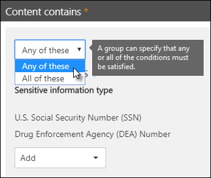
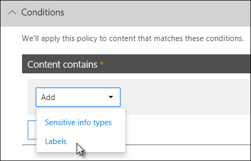

# Verhinderung von Datenverlust – ÜbersichtOverview of data loss prevention
<!-- this topic needs to be split into smaller, more coherent ones. It is confusing as it is. -->
<!-- move this note to a more appropriate place, no topic should start with a note -->
> [!NOTE]
> Kürzlich wurden Funktionen zur Verhinderung von Datenverlust zu den Microsoft Teams-Chat- und Kanalnachrichten für Benutzer hinzugefügt, die für Office 365 Advanced Compliance lizensiert sind. Sie sind als eigenständige Option verfügbar und in Office 365 E5 und Microsoft 365 E5 Compliance enthalten.Data loss prevention capabilities were recently added to Microsoft Teams chat and channel messages for users licensed for Office 365 Advanced Compliance, which is available as a standalone option and is included in Office 365 E5 and Microsoft 365 E5 Compliance. Weitere Informationen zu den Lizenzierungsanforderungen finden Sie unter [Microsoft 365-Dienste auf Mandantenebene – Leitfaden zur Lizenzierung](https://docs.microsoft.com/office365/servicedescriptions/microsoft-365-service-descriptions/microsoft-365-tenantlevel-services-licensing-guidance).To learn more about licensing requirements, see [Microsoft 365 Tenant-Level Services Licensing Guidance](https://docs.microsoft.com/office365/servicedescriptions/microsoft-365-service-descriptions/microsoft-365-tenantlevel-services-licensing-guidance).

Um Geschäftsstandards und branchenspezifische Vorschriften einzuhalten, müssen Organisationen vertrauliche Informationen schützen und verhindern, dass sie versehentlich offengelegt werden.To comply with business standards and industry regulations, organizations must protect sensitive information and prevent its inadvertent disclosure. Vertrauliche Informationen können Finanzdaten oder personenbezogene Informationen (PII) wie Kreditkartennummern, Sozialversicherungsnummern oder Gesundheitsakten umfassen.Sensitive information can include financial data or personally identifiable information (PII) such as credit card numbers, social security numbers, or health records. Mithilfe einer Richtlinie zur Verhinderung von Datenverlust (Data Loss Prevention, DLP) im Office 365 Security &amp; Compliance Center können Sie vertrauliche Informationen in Office 365 identifizieren, überwachen und automatisch schützen.With a data loss prevention (DLP) policy in the Office 365 Security &amp; Compliance Center, you can identify, monitor, and automatically protect sensitive information across Office 365.
  
Eine DLP-Richtlinie bietet Ihnen folgende Möglichkeiten:With a DLP policy, you can:
  
- **Identifizieren vertraulicher Informationen an vielen Orten, zum Beispiel Exchange Online, SharePoint Online, OneDrive for Business und Microsoft Teams****Identify sensitive information across many locations, such as Exchange Online, SharePoint Online, OneDrive for Business, and Microsoft Teams.**
    
    Beispielsweise können Sie alle Dokumente ermitteln, die eine Kreditkartennummer enthalten und auf einer OneDrive for Business-Website gespeichert sind. Sie können auch nur die OneDrive-Websites bestimmter Personen überwachen.For example, you can identify any document containing a credit card number that's stored in any OneDrive for Business site, or you can monitor just the OneDrive sites of specific people.
    
- **Verhindern der versehentlichen Freigabe von vertraulichen Informationen****Prevent the accidental sharing of sensitive information**. 
    
    Sie können z. B. alle Dokumente oder E-Mails identifizieren, die einen Gesundheitsdatensatz enthalten und für Personen außerhalb Ihrer Organisation freigegeben werden, und den Zugriff auf diese Dokumente bzw. das Senden der E-Mails dann automatisch blockieren.For example, you can identify any document or email containing a health record that's shared with people outside your organization, and then automatically block access to that document or block the email from being sent.
    
- **Überwachen und Schützen von vertraulichen Informationen in den Desktopversionen von Excel, PowerPoint und Word****Monitor and protect sensitive information in the desktop versions of Excel, PowerPoint, and Word.**
    
    Diese Office-Desktopprogramme enthalten die gleichen Funktionen wie Exchange Online, SharePoint Online und OneDrive for Business, um vertrauliche Informationen zu identifizieren und DLP-Richtlinien anzuwenden.Just like in Exchange Online, SharePoint Online, and OneDrive for Business, these Office desktop programs include the same capabilities to identify sensitive information and apply DLP policies. DLP bietet eine ständige Überwachung, wenn Personen Inhalte in diesen Office-Programmen freigeben.DLP provides continuous monitoring when people share content in these Office programs.
    
- **Gewährleisten der Compliance durch die Benutzer ohne Unterbrechung ihres Arbeitsflusses****Help users learn how to stay compliant without interrupting their workflow.**
    
    Sie können Ihre Benutzer in Bezug auf DLP-Richtlinien schulen und sie dabei unterstützen, Bestimmungen kontinuierlich einzuhalten, ohne sie von ihrer Arbeit abzuhalten.You can educate your users about DLP policies and help them remain compliant without blocking their work. Wenn Benutzer beispielsweise versuchen, ein Dokument mit vertraulichen Informationen freizugeben, kann ihnen über eine DLP-Richtlinie eine E-Mailbenachrichtigung gesendet und ein Richtlinientipp im Kontext der Dokumentbibliothek angezeigt werden, die es ihnen ermöglichen, die Richtlinie außer Kraft zu setzen, wenn sie dies geschäftlich begründen können.For example, if a user tries to share a document containing sensitive information, a DLP policy can both send them an email notification and show them a policy tip in the context of the document library that allows them to override the policy if they have a business justification. Die selben Richtlinientipps werden auch in Outlook im Web, Outlook, Excel, PowerPoint und Word angezeigt.The same policy tips also appear in Outlook on the web, Outlook, Excel, PowerPoint, and Word.
    
- **Anzeigen von DLP-Berichten mit Inhalten, die mit den DLP-Richtlinien Ihrer Organisation übereinstimmen****View DLP reports showing content that matches your organization's DLP policies.**
    
    Um die Einhaltung einer DLP-Richtlinie durch Ihre Organisation zu bewerten, können Sie anzeigen, wie viele Übereinstimmungen jede Richtlinie und Regel über einen bestimmten Zeitraum erzielt.To assess how your organization is complying with a DLP policy, you can see how many matches each policy and rule has over time. Wenn eine DLP-Richtlinie es Benutzern ermöglicht, einen Richtlinientipp außer Kraft zu setzen und als falsch positives Ergebnis zu melden, können Sie auch anzeigen, welche Benutzer diese Meldung vorgenommen haben.If a DLP policy allows users to override a policy tip and report a false positive, you can also view what users have reported.
    
DLP-Richtlinien können Sie auf der Seite zur Verhinderung von Datenverlust im Office 365 Security &amp; Compliance Center erstellen und verwalten.You create and manage DLP policies on the Data loss prevention page in the Office 365 Security &amp; Compliance Center.
  

  
## Inhalt einer DLP-RichtlinieWhat a DLP policy contains

Eine DLP-Richtlinie enthält einige grundlegende Punkte:A DLP policy contains a few basic things:
  
- Wo sollen Inhalte geschützt werden: **An Orten** wie zum Beispiel Exchange Online-, SharePoint Online- und OneDrive for Business-Websites sowie Microsoft Teams-Chat- und -Kanalnachrichten.Where to protect the content: **locations** such as Exchange Online, SharePoint Online, and OneDrive for Business sites, as well as Microsoft Teams chat and channel messages. 
    
- Wann und wie Inhalte durch das Erzwingen von **Regeln** zu schützen sind, wobei Regeln aus folgenden Elementen bestehen:When and how to protect the content by enforcing **rules** comprised of: 
    
  - **Bedingungen**, denen der Inhalt entsprechen muss, bevor die Richtlinie angewandt wird.**Conditions** the content must match before the rule is enforced. So kann eine Regel zum Beispiel vorsehen, dass nur nach Inhalten mit Sozialversicherungsnummern gesucht wird, die an Personen außerhalb der Organisation weitergeleitet wurden.For example, a rule might be configured to look only for content containing Social Security numbers that's been shared with people outside your organization. 
    
  - **Aktionen**, die von der Regel automatisch ausgeführt werden sollen, wenn Inhalte gefunden werden, die den Bedingungen entsprechen.**Actions** that you want the rule to take automatically when content matching the conditions is found. So kann beispielsweise eine Regel vorsehen, dass der Zugriff auf ein Dokument blockiert und sowohl der Benutzer als auch der Compliance Officer eine E-Mail-Benachrichtigung erhalten.For example, a rule might be configured to block access to a document and send both the user and compliance officer an email notification. 
    
Sie können eine Regel verwenden, um eine bestimmte Schutzanforderung zu erfüllen, und dann in einer DLP-Richtlinie allgemeine Schutzanforderungen in Gruppen zusammenfassen, z. B. alle zur Einhaltung einer bestimmten Vorschrift erforderlichen Regeln.You can use a rule to meet a specific protection requirement, and then use a DLP policy to group together common protection requirements, such as all of the rules needed to comply with a specific regulation.
  
Angenommen, Sie verfügen über eine DLP-Richtlinie zur Erkennung von Informationen, die dem Health Insurance-Portability and Accountability Act (HIPAA) unterliegen.For example, you might have a DLP policy that helps you detect the presence of information subject to the Health Insurance Portability and Accountability Act (HIPAA). Mithilfe dieser DLP-Richtlinie können HIPAA-Daten („Was“) auf allen SharePoint Online- und OneDrive for Business-Websites („Wo“) geschützt werden, denn diese sucht nach allen Dokumenten mit diesen vertraulichen Informationen, die für Personen außerhalb Ihrer Organisation („Bedingungen“) freigeben sind, sperrt dann den Zugriff auf die Dokumente und sendet eine Benachrichtigung („Aktionen“).This DLP policy could help protect HIPAA data (the what) across all SharePoint Online sites and all OneDrive for Business sites (the where) by finding any document containing this sensitive information that's shared with people outside your organization (the conditions) and then blocking access to the document and sending a notification (the actions). Diese Anforderungen sind als einzelne Regeln gespeichert und in einer DLP-Richtlinie zusammengefasst, um die Verwaltung und die Berichterstellung zu vereinfachen.These requirements are stored as individual rules and grouped together as a DLP policy to simplify management and reporting.
  

  
### OrteLocations

Eine DLP-Richtlinie kann vertrauliche Informationen überall in Office 365 finden und schützen, egal, ob diese sich in Exchange Online, SharePoint Online, OneDrive for Business oder Microsoft Teams befinden.A DLP policy can find and protect sensitive information across Office 365, whether that information is located in Exchange Online, SharePoint Online, OneDrive for Business, or Microsoft Teams. Sie können festlegen, dass Inhalte in Exchange-E-Mails, in Microsoft Teams-Chats und Kanalnachrichten sowie in allen SharePoint- oder OneDrive-Bibliotheken geschützt werden sollen, oder bestimmte Orte für eine Richtlinie auswählen.You can choose to protect content in Exchange email, Microsoft Teams chats and channel messages, and all SharePoint or OneDrive libraries, or select specific locations for a policy.
  

 Wenn Sie sich dazu entscheiden, bestimmte Verteilergruppen in Exchange einzubeziehen, wird die DLP-Richtlinie nur auf Mitglieder dieser Gruppe beschränkt.If you choose to include specific distribution groups in Exchange, the DLP policy will be scoped only to the members of that group. Ebenso wenn Sie eine Verteilergruppe ausschließen, werden auch alle Mitglieder dieser Verteilergruppe aus der Richtlinienauswertung ausgeschlossen.Similarly excluding a distribution group will exclude all the members of that distribution group from policy evaluation. Sie können eine Richtlinie auf die Mitglieder von Verteilerlisten, dynamischen Verteilergruppen und Sicherheitsgruppen beschränken.You can choose to scope a policy to the members of distribution lists, dynamic distribution groups, and security groups. Eine DLP-Richtlinie darf nicht mehr als 50 solche Einschlüsse und Ausschlüsse enthalten.A DLP policy can contain no more than 50 such inclusions and exclusions.

Wenn Sie festlegen, dass bestimmte SharePoint-Websites oder OneDrive-Konten berücksichtigt oder ausgeschlossen werden sollen, beachten Sie, dass eine DLP-Richtlinie höchstens 100 solcher Einschlüsse und Ausschlüsse enthalten kann.If you choose to include or exclude specific SharePoint sites or OneDrive accounts, a DLP policy can contain no more than 100 such inclusions and exclusions. Diese Grenzwerte bestehen zwar, sie können jedoch durch das Anwenden einer organisationsweiten oder einer für ganze Speicherorte geltenden Richtlinie übergangen werden.Although this limit exists, you can exceed this limit by applying either an org-wide policy or a policy that applies to entire locations.
  
### RegelnRules

Mithilfe von Regeln werden Ihre geschäftlichen Anforderungen in Bezug auf die Informationen Ihrer Organisation erzwungen.Rules are what enforce your business requirements on your organization's content. Eine Richtlinie enthält eine oder mehrere Regeln, und jede Regel besteht aus Bedingungen und Aktionen.A policy contains one or more rules, and each rule consists of conditions and actions. Wenn die Bedingungen der einzelnen Regeln erfüllt sind, werden automatisch die entsprechenden Aktionen ausgeführt.For each rule, when the conditions are met, the actions are taken automatically. Regeln werden der Reihe nach ausgeführt, wobei in jeder Richtlinie mit der Regel mit der höchsten Priorität begonnen wird.Rules are executed sequentially, starting with the highest-priority rule in each policy.
  
Eine Regel bietet auch Optionen, um Benutzer (mit Richtlinientipps und E-Mail-Benachrichtigungen) und Administratoren (mit E-Mail-Schadensberichten) darüber zu informieren, dass Inhalte der Regel entsprechen.A rule also provides options to notify users (with policy tips and email notifications) and admins (with email incident reports) that content has matched the rule.
  
Nachfolgend eine Liste der Komponenten einer Regel mit entsprechenden Erläuterungen.Here are the components of a rule, each explained below.
  

  
#### BedingungenConditions

Mithilfe von Bedingungen werden die Arten von Informationen, nach denen Sie suchen, und der Zeitpunkt der Ausführung einer Aktion bestimmt. Deswegen sind sie so wichtig.Conditions are important because they determine what types of information you're looking for, and when to take an action. So können Sie etwa festlegen, dass Inhalte mit Reisepassnummern ignoriert werden, es sei denn, ein Inhalt enthält mehr als zehn Reisepassnummern und ist für Personen außerhalb Ihrer Organisation freigegeben.For example, you might choose to ignore content containing passport numbers unless the content contains more than 10 such numbers and is shared with people outside your organization.
  
Bedingungen konzentrieren sich auf den **Inhalt**, z. B. die Arten von vertraulichen Informationen, nach denen Sie suchen, und auch auf den **Kontext**, z. B. für wen das Dokument freigegeben ist.Conditions focus on the **content**, such as what types of sensitive information you're looking for, and also on the **context**, such as who the document is shared with. Sie können Bedingungen verwenden, um für unterschiedliche Risikostufen unterschiedliche Aktionen festzulegen.You can use conditions to assign different actions to different risk levels. So können beispielsweise intern freigegebene vertrauliche Inhalte einer niedrigeren Risikostufe angehören und somit weniger Aktionen erfordern als vertrauliche Inhalte, die für Personen außerhalb Ihrer Organisation freigegeben sind.For example, sensitive content shared internally might be lower risk and require fewer actions than sensitive content shared with people outside the organization. 
  

  
Mit den derzeit verfügbaren Bedingungen können Sie ermitteln, ob:The conditions now available can determine if:
  
- Der Inhalt eine Art vertraulicher Information enthält.Content contains a type of sensitive information.
    
- Der Inhalt eine Bezeichnung enthält.Content contains a label. Weitere Informationen finden Sie weiter unten im Abschnitt [Verwenden einer Bezeichnung als Bedingung in einer DLP-Richtlinie](#using-a-label-as-a-condition-in-a-dlp-policy).For more information, see the below section [Using a label as a condition in a DLP policy](#using-a-label-as-a-condition-in-a-dlp-policy).
    
- Inhalte werden an Personen außerhalb oder innerhalb der Organisation weitergeleitet.Content is shared with people outside or inside your organization.

> [!NOTE]
> Benutzer, die keine Gastkonten im Active Directory- oder Azure Active Directory-Mandanten einer Hostorganisation besitzen, werden als Personen innerhalb der Organisation betrachtet.Users who have non-guest accounts in a host organization's Active Directory or Azure Active Directory tenant are considered as people inside the organization.
    
#### Arten von vertraulichen InformationenTypes of sensitive information

Mithilfe einer DLP-Richtlinie können vertrauliche Informationen geschützt werden, die als **vertraulicher Informationstyp** definiert sind.A DLP policy can help protect sensitive information, which is defined as a **sensitive information type**. Office 365 enthält Definitionen für viele gängige Typen vertraulicher Informationen aus den verschiedensten Bereichen, die Sie direkt verwenden können, z. B. Kreditkartennummer, Bankkontonummer, National-ID-Nummer und Reisepassnummer.Office 365 includes definitions for many common sensitive information types across many different regions that are ready for you to use, such as a credit card number, bank account numbers, national ID numbers, and passport numbers. 
  

  
Wenn eine DLP-Richtlinie nach einem vertraulichen Informationstyp wie z. B. einer Kreditkartennummer sucht, wird nicht einfach nach einer 16-stelligen Zahl gesucht.When a DLP policy looks for a sensitive information type such as a credit card number, it doesn't simply look for a 16-digit number. Jede Art vertraulicher Informationen wird durch eine Kombination der folgenden Elemente definiert und anhand dieser ermittelt:Each sensitive information type is defined and detected by using a combination of:
  
- SchlüsselwörterKeywords
    
- Interne Funktionen zur Überprüfung von Prüfsummen oder der ZusammensetzungInternal functions to validate checksums or composition
    
- Auswertung regulärer Ausdrücke zum Auffinden übereinstimmender MusterEvaluation of regular expressions to find pattern matches
    
- Andere InhaltsuntersuchungsmethodenOther content examination
    
Dadurch erzielt die DLP-Erkennung einen hohen Grad an Zuverlässigkeit, und die Anzahl falsch positiver Ergebnisse, welche Mitarbeiter beim Arbeiten behindern können, wird verringert.This helps DLP detection achieve a high degree of accuracy while reducing the number of false positives that can interrupt peoples' work.
  
#### AktionenActions

Wenn ein Inhalt mit einer Bedingung in einer Regel übereinstimmt, können Sie Aktionen anwenden, um den Inhalt automatisch zu schützen.When content matches a condition in a rule, you can apply actions to automatically protect the content.
  

  
Mit den nun verfügbaren Aktionen können Sie:With the actions now available, you can:
  
- **Den Zugriff auf Inhalte einschränken** Für Seiteninhalte bedeutet dies, dass Berechtigungen für ein Dokument für alle Personen mit Ausnahme des primären Websitesammlungsadministrators, des Dokumentbesitzers und der Person, die zuletzt Änderungen am Dokument vorgenommen hat, eingeschränkt sind.**Restrict access to the content** For site content, this means that permissions for the document are restricted for everyone except the primary site collection administrator, document owner, and person who last modified the document. Diese Personen können die vertraulichen Informationen aus dem Dokument entfernen oder andere Abhilfemaßnahmen ergreifen.These people can remove the sensitive information from the document or take other remedial action. Wenn das Dokument den Anforderungen entspricht, werden die ursprünglichen Berechtigungen automatisch wiederhergestellt.When the document is in compliance, the original permissions are automatically restored. Wenn der Zugriff auf ein Dokument gesperrt ist, wird dieses Dokument in der Bibliothek auf der Website mit einem speziellen Richtlinientipp-Symbol angezeigt.When access to a document is blocked, the document appears with a special policy tip icon in the library on the site. 
    
    
  
    Im Fall von E-Mail-Inhalten blockiert diese Aktion das Senden der Nachricht.For email content, this action blocks the message from being sent. Abhängig von der Konfiguration der DLP-Regel erhält der Absender einen Unzustellbarkeitsbericht (wenn die Regel eine Benachrichtigung verwendet), oder es wird ein Richtlinientipp angezeigt bzw. eine E-Mail-Benachrichtigung gesendet.Depending on how the DLP rule is configured, the sender sees an NDR or (if the rule uses a notification) a policy tip and/or email notification.
    
    
  
#### Benutzerbenachrichtigungen und BenutzeraußerkraftsetzungenUser notifications and user overrides

Sie können Benutzerbenachrichtigungen und Benutzeraußerkraftsetzungen einsetzen, um Ihre Benutzer in Bezug auf DLP-Richtlinien zu schulen und sie dabei unterstützen, Bestimmungen kontinuierlich einzuhalten, ohne sie von ihrer Arbeit abzuhalten.You can use notifications and overrides to educate your users about DLP policies and help them remain compliant without blocking their work. Wenn Benutzer beispielsweise versuchen, ein Dokument mit vertraulichen Informationen freizugeben, kann ihnen über eine DLP-Richtlinie eine E-Mailbenachrichtigung gesendet und ein Richtlinientipp im Kontext der Dokumentbibliothek angezeigt werden, die es ihnen ermöglichen, die Richtlinie außer Kraft zu setzen, wenn sie dies geschäftlich begründen können.For example, if a user tries to share a document containing sensitive information, a DLP policy can both send them an email notification and show them a policy tip in the context of the document library that allows them to override the policy if they have a business justification.
  

  
Die E-Mail kann die Person, die den Inhalt gesendet, freigegeben oder zuletzt geändert hat, bzw. bei Websiteinhalten den primären Websitesammlungsadministrator und Dokumentbesitzer benachrichtigen.The email can notify the person who sent, shared, or last modified the content and, for site content, the primary site collection administrator and document owner. Darüber hinaus können Sie beliebige weitere Empfänger zur Benachrichtigungs-E-Mail hinzufügen oder entfernen.In addition, you can add or remove whomever you choose from the email notification.
  
Zusätzlich zum Senden einer E-Mail-Benachrichtigung wird eine Benutzerbenachrichtigung mit einem Richtlinientipp angezeigt:In addition to sending an email notification, a user notification displays a policy tip:
  
- In Outlook und Outlook im Web.In Outlook and Outlook on the web.
    
- Für das Dokument auf einer SharePoint- oder OneDrive for Business-Website.For the document on a SharePoint Online or OneDrive for Business site.
    
- In Excel, PowerPoint und Word, wenn das Dokument auf einer Website gespeichert ist, die in einer DLP-Richtlinie enthalten ist.In Excel, PowerPoint, and Word, when the document is stored on a site included in a DLP policy.
    
In der E-Mail-Benachrichtigung und dem Richtlinientipp wird erläutert, warum ein Inhalt mit einer DLP-Richtlinie in Konflikt steht.The email notification and policy tip explain why content conflicts with a DLP policy. Bei entsprechender Auswahl können Benutzer über die E-Mail-Benachrichtigung und den Richtlinientipp eine Regel außer Kraft setzen, indem sie ein falsch positives Ergebnis melden oder eine geschäftliche Begründung angeben.If you choose, the email notification and policy tip can allow users to override a rule by reporting a false positive or providing a business justification. Auf diese Weise können Sie Ihre Benutzer über Ihre DLP-Richtlinien unterrichten und diese erzwingen, ohne dass die Benutzer ihre Arbeit unterbrechen müssen.This can help you educate users about your DLP policies and enforce them without preventing people from doing their work. Informationen über Außerkraftsetzungen und falsch positive Ergebnisse werden für die Berichtserstellung auch protokolliert (siehe nachfolgenden Abschnitt zu DLP-Berichten) und in die Schadensberichte (nächster Abschnitt) aufgenommen, sodass der Compliance Officer diese Informationen regelmäßig einsehen kann.Information about overrides and false positives is also logged for reporting (see below about the DLP reports) and included in the incident reports (next section), so that the compliance officer can regularly review this information.
  
So sieht ein Richtlinientipp in einem OneDrive for Business-Konto aus.Here's what a policy tip looks like in a OneDrive for Business account.
  

 Weitere Informationen zu Benachrichtigungen der Benutzer und Richtlinientipps in den DLP-Richtlinien finden Sie in [Verwenden von Benachrichtigungen und Richtlinientipps](use-notifications-and-policy-tips.md).To learn more about user notifications and policy tips in DLP policies, see [Use notifications and policy tips](use-notifications-and-policy-tips.md).

#### SchadensberichteIncident reports

Bei einer Übereinstimmung mit einer Regel können Sie einen Schadensbericht mit Details zum Ereignis an Ihren Compliance Officer (oder eine beliebige andere Person) senden.When a rule is matched, you can send an incident report to your compliance officer (or any people you choose) with details of the event. Dieser Bericht enthält Informationen zum Element, für das eine Übereinstimmung gefunden wurde, zum Inhalt, der mit der Regel übereinstimmte, und zum Namen der Person, die den Inhalt zuletzt geändert hat.This report includes information about the item that was matched, the actual content that matched the rule, and the name of the person who last modified the content. Bei E-Mail-Nachrichten wird dem Bericht außerdem die ursprüngliche Nachricht, die einer DLP-Richtlinie entspricht, als Anlage beigefügt.For email messages, the report also includes as an attachment the original message that matches a DLP policy.
  

  
## Gruppieren und logische OperatorenGrouping and logical operators

Häufig enthält eine DLP-Richtlinie eine recht klare Anforderung, z. B. alle Inhalte zu identifizieren, die eine deutsche Sozialversicherungsnummer enthalten.Often your DLP policy has a straightforward requirement, such as to identify all content that contains a U.S. Social Security Number. Möglicherweise muss Ihre DLP-Richtlinie in anderen Szenarien jedoch weniger exakt definierte Daten identifizieren.However, in other scenarios, your DLP policy might need to identify more loosely defined data.
  
Wenn beispielsweise Inhalte identifiziert werden sollen, die dem Health Insurance Act (HIPAA) der USA unterliegen, muss nach folgenden Inhalten gesucht werden:For example, to identify content subject to the U.S. Health Insurance Act (HIPAA), you need to look for:
  
- Inhalte, die bestimmte Arten von vertraulichen Informationen enthalten, z. B. eine deutsche  Sozialversicherungsnummer oder eine DEA-Nummer (Drug Enforcement Agency, Drogenvollzugsbehörde).Content that contains specific types of sensitive information, such as a U.S. Social Security Number or Drug Enforcement Agency (DEA) Number.
    
    UNDAND
    
- Inhalte, die schwieriger zu erkennen sind, z. B. Schriftstücke über die Pflege eines Patienten oder mit Beschreibungen der geleisteten medizinischen Dienste.Content that's more difficult to identify, such as communications about a patient's care or descriptions of medical services provided. Zum Identifizieren dieser Inhalte müssen passende Schlüsselwörter aus sehr umfangreichen Listen verwendet werden, z. B. der Internationalen Klassifikation von Krankheiten (ICD-9-CM oder ICD-10-CM).Identifying this content requires matching keywords from very large keyword lists, such as the International Classification of Diseases (ICD-9-CM or ICD-10-CM).
    
Solche lose definierten Daten lassen sich leicht mithilfe von Gruppierung und logischen Operatoren (UND, ODER) identifizieren.You can easily identify such loosely defined data by using grouping and logical operators (AND, OR). Wenn Sie eine DLP-Richtlinie erstellen, können Sie:When you create a DLP policy, you can:
  
- Typen vertraulicher Informationen gruppierenGroup sensitive information types.
    
- Den logischen Operator zwischen den Typen vertraulicher Informationen innerhalb einer Gruppe und zwischen den Gruppen auswählen.Choose the logical operator between the sensitive information types within a group and between the groups themselves.
    
### Auswählen des Operators innerhalb einer GruppeChoosing the operator within a group

Mit einem Operator innerhalb einer Gruppe wählen Sie aus, ob eine oder alle Bedingungen in dieser Gruppe erfüllt sein müssen, damit der Inhalt der Regel entspricht.Within a group, you can choose whether any or all of the conditions in that group must be satisfied for the content to match the rule.
  

  
### Hinzufügen einer GruppeAdding a group

Sie können eine Gruppe, die eigene Bedingungen und einen eigenen Operator innerhalb dieser Gruppe aufweisen kann, schnell und einfach hinzufügen.You can quickly add a group, which can have its own conditions and operator within that group.
  

  
### Auswählen des Operators zwischen GruppenChoosing the operator between groups

Mit einem Operator zwischen Gruppen wählen Sie aus, ob die Bedingungen in einer Gruppe oder die Bedingungen in allen Gruppen erfüllt sein müssen, damit der Inhalt der Regel entspricht.Between groups, you can choose whether the conditions in just one group or all of the groups must be satisfied for the content to match the rule.
  
Die integrierte **U.S. HIPAA**-Richtlinie enthält beispielsweise eine Regel mit einem **UND**-Operator zwischen den Gruppen, damit Inhalte identifiziert werden, die Folgendes enthalten:For example, the built-in **U.S. HIPAA** policy has a rule that uses an **AND** operator between the groups so that it identifies content that contains: 
  
- aus der Gruppe **PII-Bezeichner** (mindestens eine Sozialversicherungsnummer **ODER** eine DEA-Nummer)from the group **PII Identifiers** (at least one SSN number **OR** DEA number) 
    
    **UND****AND**
    
- aus der Gruppe **Medizinische Begriffe** (mindestens ein ICD-9-CM-Schlüsselwort **ODER** ein ICD-10-CM-Schlüsselwort)from the group **Medical Terms** (at least one ICD-9-CM keyword **OR** ICD-10-CM keyword) 
    

  
## Die Priorität, mit der Regeln verarbeitet werdenThe priority by which rules are processed

Wenn Sie in einer Richtlinie Regeln erstellen, wird jeder Regel eine Priorität in der Reihenfolge ihrer Erstellung zugewiesen, was bedeutet, dass die zuerst erstellte Regel oberste Priorität, die danach erstellte Regel die zweite Priorität usw. erhält.When you create rules in a policy, each rule is assigned a priority in the order in which it's created — meaning, the rule created first has first priority, the rule created second has second priority, and so on. 
  

  
Nachdem Sie mehr als eine DLP-Richtlinie eingerichtet haben, können Sie die Priorität einer oder mehrerer Richtlinien ändern.After you have set up more than one DLP policy, you can change the priority of one or more policies. Wählen Sie dazu eine Richtlinie aus, wählen Sie **Richtlinie bearbeiten** aus, und verwenden Sie die **Prioritätsliste**, um deren Priorität anzugeben.To do that, select a policy, choose **Edit policy**, and use the **Priority** list to specify its priority.

Wenn Inhalte anhand von Regeln ausgewertet werden, werden diese Regeln in der Reihenfolge ihrer Priorität verarbeitet.When content is evaluated against rules, the rules are processed in priority order. Wenn ein Inhalt mehreren Regeln entspricht, werden die Regeln in der Reihenfolge ihrer Priorität verarbeitet, und die jeweils restriktivste Aktion wird durchgeführt.If content matches multiple rules, the rules are processed in priority order and the most restrictive action is enforced. Wenn ein Inhalt beispielsweise allen folgenden Regeln entspricht, wird Regel 3 angewandt, da sie die höchste Priorität hat und die restriktivste Regel ist:For example, if content matches all of the following rules, Rule 3 is enforced because it's the highest priority, most restrictive rule:
  
- Regel 1: Benutzer nur benachrichtigenRule 1: only notifies users
    
- Regel 2: Benutzer benachrichtigen, Zugriff beschränken und Benutzeraußerkraftsetzung zulassenRule 2: notifies users, restricts access, and allows user overrides
    
- Regel 3: Benutzer benachrichtigen, Zugriff beschränken und keine Benutzeraußerkraftsetzung zulassenRule 3: notifies users, restricts access, and does not allow user overrides
    
- Regel 4: Benutzer nur benachrichtigenRule 4: only notifies users
    
- Regel 5: Zugriff beschränkenRule 5: restricts access
    
- Regel 6: Benutzer benachrichtigen, Zugriff beschränken und keine Benutzeraußerkraftsetzung zulassenRule 6: notifies users, restricts access, and does not allow user overrides
    
Beachten Sie, dass in diesem Beispiel Übereinstimmungen für alle Regeln in den Überwachungsprotokollen aufgezeichnet und in den DLP-Berichten angezeigt werden, obwohl nur die restriktivste Regel angewandt wird.In this example, note that matches for all of the rules are recorded in the audit logs and shown in the DLP reports, even though only the most restrictive rule is enforced.
  
Beachten Sie Folgendes in Bezug auf Richtlinientipps:Regarding policy tips, note that:
  
- Nur der Richtlinientipp zu der Regel, die die höchste Priorität aufweist und die am restriktivsten ist, wird angezeigt.Only the policy tip from the highest priority, most restrictive rule will be shown. So hat beispielsweise der Richtlinientipp zu einer Regel, die Zugriff auf Inhalte blockiert, Vorrang gegenüber dem Richtlinientipp zu einer Regel, die einfach nur eine Benachrichtigung sendet.For example, a policy tip from a rule that blocks access to content will be shown over a policy tip from a rule that simply sends a notification. Dadurch wird verhindert, dass Benutzern eine umfangreiche Liste von Richtlinientipps angezeigt wird.This prevents people from seeing a cascade of policy tips.
    
- Wenn die Richtlinientipps in der restriktivsten Regel Benutzern erlauben, die Regel außer Kraft zu setzen, werden dadurch auch alle anderen Regeln überschrieben, die für den Inhalt gelten.If the policy tips in the most restrictive rule allow people to override the rule, then overriding this rule also overrides any other rules that the content matched.
    
## Optimieren von Regeln, um Übereinstimmungen zu vereinfachen oder zu erschwerenTuning rules to make them easier or harder to match

Nachdem man eine DLP-Richtlinie erstellt und aktiviert hat, ergeben sich manchmal die folgenden Probleme:After people create and turn on their DLP policies, they sometimes run into these issues:
  
- Zu viele Inhalte, bei denen es sich **nicht** um vertrauliche Informationen handelt, entsprechen der Regel. Anders ausgedrückt, es gibt zu viele falsch positive Ergebnisse.Too much content that **is not** sensitive information matches the rules — in other words, too many false positives. 
    
- Zu wenig Inhalte, die vertrauliche Informationen **sind**, entsprechen den Regeln.Too little content that **is** sensitive information matches the rules. Anders ausgedrückt, die Schutzaktionen werden bei diesen vertraulichen Informationen nicht umgesetzt.In other words, the protective actions aren't being enforced on the sensitive information. 
    
Um diese Probleme zu beheben, können Sie Ihre Regeln verbessern, indem Sie die Anzahl der Instanzen und die Übereinstimmungsgenauigkeit anpassen, um die Übereinstimmung von Inhalten mit den Regeln zu erschweren oder zu vereinfachen.To address these issues, you can tune your rules by adjusting the instance count and match accuracy to make it harder or easier for content to match the rules. Jeder Typ vertraulicher Informationen, der in einer Regel verwendet wird, verfügt sowohl über eine Instanzenanzahl als auch über eine Übereinstimmungsgenauigkeit.Each sensitive information type used in a rule has both an instance count and match accuracy.
  
### InstanzenanzahlInstance count

Die Instanzenanzahl gibt einfach nur an, wie oft ein bestimmter Typ vertraulicher Informationen vorkommen muss, damit ein Inhalt der Regel entspricht.Instance count means simply how many occurrences of a specific type of sensitive information must be present for content to match the rule. So entspricht beispielsweise ein Inhalt der Regel unten, wenn darin zwischen 1 und 9 eindeutige US-amerikanische oder britischeFor example, content matches the rule shown below if between 1 and 9 unique U.S. or U.K. Passnummern erkannt wurden.passport numbers are identified.
  
Beachten Sie, dass bei der Anzahl der Instanzen nur **einmalig vorkommende** Übereinstimmungen für vertrauliche Informationstypen und Stichwörter gezählt werden.Note that the instance count includes only **unique** matches for sensitive information types and keywords. Wenn in einer E-Mail-Nachricht beispielsweise 10 mal die gleiche Kreditkartennummer vorkommt, zählen diese 10 Vorkommen als eine einzige Kreditkartennummerinstanz.For example, if an email contains 10 occurrences of the same credit card number, those 10 occurrences count as a single instance of a credit card number. 
  
Die Optimierung von Regeln mithilfe der Instanzenanzahl ist einfach:To use instance count to tune rules, the guidance is straightforward:
  
- Damit für die Regel einfacher Übereinstimmungen gefunden werden können, verringern Sie die Werte für die **min**-Anzahl und/oder erhöhen Sie die **max**-Anzahl.To make the rule easier to match, decrease the **min** count and/or increase the **max** count. Sie können **max** auch auf **beliebig** festlegen, indem Sie den numerischen Wert löschen.You can also set **max** to **any** by deleting the numerical value. 
    
- Um die Übereinstimmung mit der Regel zu erschweren, erhöhen Sie den Wert für die **Mindestanzahl**.To make the rule harder to match, increase the **min** count. 
    
Normalerweise verwenden Sie in einer Regel mit einer geringeren Instanzenanzahl (beispielsweise 1-9) weniger restriktive Aktionen wie das Senden von Benachrichtigungen an Benutzer.Typically, you use less restrictive actions, such as sending user notifications, in a rule with a lower instance count (for example, 1-9). In einer Regel mit einer höheren Instanzenanzahl (beispielsweise 10-beliebig) verwenden Sie restriktivere Aktionen wie das Einschränken des Zugriffs auf Inhalte, ohne Benutzeraußerkraftsetzung zuzulassen.And you use more restrictive actions, such as restricting access to content without allowing user overrides, in a rule with a higher instance count (for example, 10-any).
  

  
### TreffergenauigkeitMatch accuracy

Wie vorstehend beschrieben wird jeder Typ vertraulicher Informationen durch eine Kombination unterschiedlicher Arten von Beweisen definiert und ermittelt.As described above, a sensitive information type is defined and detected by using a combination of different types of evidence. Im Allgemeinen wird ein Typ vertraulicher Informationen durch mehrere solche Kombinationen, den so genannten Mustern, definiert.Commonly, a sensitive information type is defined by multiple such combinations, called patterns. Ein Muster, das weniger Beweise erfordert, verfügt über eine geringere Übereinstimmungsgenauigkeit (oder Vertrauensstufe), während ein Muster, das mehr Beweise erfordert, über eine höhere Übereinstimmungsgenauigkeit (oder Vertrauensstufe) verfügt.A pattern that requires less evidence has a lower match accuracy (or confidence level), while a pattern that requires more evidence has a higher match accuracy (or confidence level). Wenn Sie mehr über die tatsächlichen Muster und Vertrauensstufen, die von jedem Typ vertraulicher Informationen verwendet werden, wissen möchten, lesen Sie [Wonach Typen vertraulicher Informationen suchen](what-the-sensitive-information-types-look-for.md).To learn more about the actual patterns and confidence levels used by every sensitive information type, see [What the sensitive information types look for](what-the-sensitive-information-types-look-for.md).
  
So wird der Typ vertraulicher Informationen mit Namen Kreditkartennummer durch zwei Muster definiert:For example, the sensitive information type named Credit Card Number is defined by two patterns:
  
- Ein Muster mit einer Vertrauensstufe von 65 %, das Folgendes voraussetzt:A pattern with 65% confidence that requires:
    
  - Eine Nummer im Format einer KreditkartennummerA number in the format of a credit card number.
    
  - Eine Nummer, die die Prüfsumme übergibtA number that passes the checksum.
    
- Ein Muster mit einer Vertrauensstufe von 85 %, das Folgendes voraussetzt:A pattern with 85% confidence that requires:
    
  - Eine Nummer im Format einer KreditkartennummerA number in the format of a credit card number.
    
  - Eine Nummer, die die Prüfsumme übergibtA number that passes the checksum.
    
  - Ein Stichwort oder ein Ablaufdatum im korrekten FormatA keyword or an expiration date in the right format.
    
Sie können diese Vertrauensstufen (oder die Übereinstimmungsgenauigkeit) in Ihren Regeln verwenden.You can use these confidence levels (or match accuracy) in your rules. Normalerweise verwenden Sie in einer Regel mit einer geringeren Übereinstimmungsgenauigkeit weniger restriktive Aktionen wie das Senden von Benachrichtigungen an Benutzer.Typically, you use less restrictive actions, such as sending user notifications, in a rule with lower match accuracy. In einer Regel mit höherer Übereinstimmungsgenauigkeit verwenden Sie restriktivere Aktionen wie das Einschränken des Zugriffs auf Inhalte, ohne Benutzeraußerkraftsetzung zuzulassen.And you use more restrictive actions, such as restricting access to content without allowing user overrides, in a rule with higher match accuracy.
  
Es ist wichtig zu verstehen, dass nur eine einzige Vertrauensstufe zurückgegeben wird, wenn in einem Inhalt ein bestimmter Typ vertraulicher Informationen wie eine Kreditkartennummer erkannt wird:It's important to understand that when a specific type of sensitive information, such as a credit card number, is identified in content, only a single confidence level is returned:
  
- Wenn alle Übereinstimmungen einem einzigen Muster entsprechen, wird die Vertrauensstufe für dieses Muster zurückgegeben.If all of the matches are for a single pattern, the confidence level for that pattern is returned.
    
- Wenn es Übereinstimmungen für mehr als ein Muster gibt (wenn es beispielsweise Übereinstimmungen mit zwei unterschiedlichen Vertrauensstufen gibt), wird eine Vertrauensstufe zurückgegeben, die höher als die der einzelnen Muster ist.If there are matches for more than one pattern (that is, there are matches with two different confidence levels), a confidence level higher than any of the single patterns alone is returned. Das ist der schwierige Teil.This is the tricky part. Wenn es bei einer Kreditkarte beispielsweise Übereinstimmungen für die 65 %igen und die 85 %igen Muster gibt, ist die Vertrauensstufe, die für diesen Typ vertraulicher Informationen höher als 90 %, da mehr Beweise mehr Vertrauen bedeuten.For example, for a credit card, if both the 65% and 85% patterns are matched, the confidence level returned for that sensitive information type is greater than 90% because more evidence means more confidence.
    
Wenn Sie also zwei sich gegenseitig ausschließende Regeln für Kreditkarten erstellen möchten, eine für die 65 %ige Übereinstimmungsgenauigkeit und eine für die 85 %ige Übereinstimmungsgenauigkeit, sehen die Bereiche für die Übereinstimmungsgenauigkeit folgendermaßen aus:So if you want to create two mutually exclusive rules for credit cards, one for the 65% match accuracy and one for the 85% match accuracy, the ranges for match accuracy would look like this. Mit der ersten Regel werden nur Übereinstimmungen mit dem 65 %igen Muster erfasst.The first rule picks up only matches of the 65% pattern. Mit der zweiten Regel werden Übereinstimmungen mit **mindestens einer** 85 %igen Übereinstimmung erfasst, und sie **kann potenziell** auch weitere, niedrigere Vertrauensübereinstimmungen erfassen.The second rule picks up matches with **at least one** 85% match and **can potentially have** other lower-confidence matches. 
  

  
Aus diesen Gründen lautet die Anleitung zum Erstellen von Regeln mit unterschiedlichen Übereinstimmungsgenauigkeiten wie folgt:For these reasons, the guidance for creating rules with different match accuracies is:
  
- Für die niedrigste Vertrauensstufe wird normalerweise derselbe Wert für **min** und **max** (und kein Bereich) verwendet.The lowest confidence level typically uses the same value for **min** and **max** (not a range). 
    
- Bei der höchsten Vertrauensstufe handelt es sich normalerweise um einen Bereich, der von direkt über der niedrigeren Vertrauensstufe bis 100 reicht.The highest confidence level is typically a range from just above the lower confidence level to 100.
    
- Alle dazwischen liegenden Vertrauensstufen rangieren normalerweise von direkt über der niedrigeren Vertrauensstufe bis direkt unterhalb der höheren Vertrauensstufe.Any in-between confidence levels typically range from just above the lower confidence level to just below the higher confidence level.
    
## Verwenden einer Bezeichnung als Bedingung in einer DLP-RichtlinieUsing a label as a condition in a DLP policy

Sie können eine Bezeichnung erstellen und dann wie folgt damit vorgehen:You can create a label and then:
<!-- what kind of label? -->
  
- **Veröffentlichen**, damit Endbenutzer sie sehen und die Bezeichnung manuell auf Inhalte anwenden können.**Publish** it, so that end users can see and manually apply the label to content. 
    
- **Automatisch auf Inhalte anwenden**, die den von Ihnen gewählten Bedingungen entsprechen.**Auto-apply** it to content that matches the conditions that you choose. 
    
Weitere Informationen über Bezeichnungen finden Sie unter [Übersicht über Aufbewahrungsbezeichnungen](labels.md).For more information about labels, see [Overview of retention labels](labels.md).
  
Nachdem Sie eine Bezeichnung erstellt haben, können Sie diese Bezeichnung als Bedingung in Ihren DLP-Richtlinien verwenden.After you create a label, you can then use that label as a condition in your DLP policies. 

Dies kann beispielsweise in den folgenden Fällen wünschenswert sein:For example, you might want to do this because:
  
- Sie haben eine Bezeichnung namens **Vertraulich** veröffentlicht, damit Mitarbeiter in Ihrer Organisation diese Bezeichnung vertraulichen E-Mails und Dokumenten manuell zuweisen können.You published a label named **Confidential**, so that people in your organization can manually apply the label to confidential email and documents. Durch die Verwendung dieser Bezeichnung als Bedingung in Ihrer DLP-Richtlinie können Sie verhindern, dass als **Vertraulich** gekennzeichnete Inhalte für Personen außerhalb Ihrer Organisation freigegeben werden.By using this label as a condition in your DLP policy, you can restrict content labeled **Confidential** from being shared with people outside your organization. 
    
- Sie haben die Bezeichnung **Alpenhaus** für ein gleichnamiges Projekt erstellt und dann diese Bezeichnung automatisch auf Inhalte angewendet, die das Schlüsselwort "Alpenhaus" enthalten.You created a label named **Alpine House** for a project of that name, and then applied that label automatically to content containing the keywords "Alpine House". Durch die Verwendung dieser Bezeichnung als Bedingung in Ihrer DLP-Richtlinie können Sie Endbenutzern einen Richtlinientipp anzeigen lassen, wenn diese dabei sind, diesen Inhalt für jemanden außerhalb Ihrer Organisation freizugeben.By using this label as a condition in your DLP policy, you can show a policy tip to end users when they're about to share this content with someone outside your organization. 
    
- Sie haben die Bezeichnung **Steuererklärung** veröffentlicht, damit der Zuständige die Bezeichnung manuell Inhalten zuweisen kann, die entsprechend klassifiziert werden müssen.You published a label named **Tax record**, so that your records manager can manually apply the label to content that needs to be classified as a record. Durch Verwenden dieser Bezeichnung als Bedingung in Ihrer DLP-Richtlinie können Sie nach Inhalten mit dieser Bezeichnung zusammen mit anderen Typen vertraulicher Informationen wie US-Steuernummern für Privatpersonen (ITIN) und US-Sozialversicherungsnummern (SSN) suchen. Wenden Sie Schutzaktionen auf Inhalte mit der Bezeichnung **Steuererklärung** an, und rufen Sie detaillierte Aktivitätsberichte zur DLP-Richtlinie aus den DLP-Berichten und Überwachungsprotokolldaten ab.By using this label as a condition in your DLP policy, you can look for content with this label along with other types of sensitive information such as ITINs or SSNs; apply protection actions to content labeled **Tax record**; and get detailed activity reports about the DLP policy from the DLP reports and audit log data. 
    
- Sie haben die Bezeichnung **Geschäftsleitungsteam – Vertraulich** in den Exchange-Postfächern und OneDrive-Konten einer Gruppe von Führungskräften veröffentlicht.You published a label named **Executive Leadership Team - Sensitive** to the Exchange mailboxes and OneDrive accounts of a group of executives. Durch Verwenden dieser Bezeichnung als Bedingung in Ihrer DLP-Richtlinie können Sie für dieselbe Teilmenge von Inhalten und Benutzern sowohl Aufbewahrungs- als auch Schutzaktionen erzwingen.By using this label as a condition in your DLP policy, you can enforce both retention and protection actions on the same subset of content and users. 
    
Durch Verwenden von Bezeichnungen als Bedingung in Ihren DLP-Regeln können Sie Schutzaktionen selektiv auf eine bestimmte Gruppe von Inhalten, Standorten oder Benutzern anwenden.By using labels as a condition in your DLP rules, can you selectively enforce protection actions on a specific set of content, locations, or users. 

> [!NOTE]
> Wenn Sie eine Aufbewahrungsbezeichnung als Bedingung in einer DLP-Richtlinie angeben und zudem Exchange und/oder Teams als Speicherort verwenden, wird die folgende Fehlermeldung angezeigt: "Der Schutz von beschriftetem Inhalt in E-Mail- und Teams-Nachrichten wird nicht unterstützt.If you specify a retention label as a condition in a DLP policy and you also include Exchange and/or Teams as a location, you will receive the following error: "Protecting labeled content in email and teams messages isn't supported. Entfernen Sie die Bezeichnung unten oder deaktivieren Sie Exchange und Teams als Speicherort."Either remove the label below or turn off Exchange and Teams as a location." Der Grund dafür ist, dass der Exchange-Transport die Bezeichnungsmetadaten beim Senden und Zustellen von Nachrichten nicht ausgewertet.This is because Exchange transport does not evaluate the label metadata during message submission and delivery. 

### Die Unterstützung von Vertraulichkeitsbezeichnungen wird in Kürze verfügbar seinSupport for sensitivity labels is coming

Derzeit können Sie nur eine Aufbewahrungsbezeichnung als Bedingung verwenden, jedoch nicht eine [Vertraulichkeitsbezeichnung](sensitivity-labels.md).You can currently use only a retention label as a condition, not a [sensitivity label](sensitivity-labels.md). Wir arbeiten derzeit an der Unterstützung der Verwendung einer Vertraulichkeitsbezeichnung in dieser Bedingung.We're currently working on support for using a sensitivity label in this condition.
  
### Die Beziehung dieses Features zu anderen FeaturesHow this feature relates to other features

Auf Inhalte mit vertraulichen Informationen können verschiedene Features angewendet werden:Several features can be applied to content containing sensitive information:
  
- Eine [Aufbewahrungsbezeichnung](labels.md#applying-a-retention-label-automatically-based-on-conditions) und eine [Aufbewahrungsrichtlinie](retention-policies.md) können beide Aktionen zur **Aufbewahrung** dieser Inhalte erzwingen.A [retention label](labels.md#applying-a-retention-label-automatically-based-on-conditions) and a [retention policy](retention-policies.md) can both enforce **retention** actions on this content. 
    
- Mit einer DLP-Richtlinie können Aktionen zum **Schutz** dieser Inhalte erzwungen werden.A DLP policy can enforce **protection** actions on this content. Und bevor diese Aktionen erzwungen werden, kann eine DLP-Richtlinie vorsehen, dass zusätzlich zum Inhalt mit einer Bezeichnung noch andere Bedingungen erfüllt werden müssen.And before enforcing these actions, a DLP policy can require other conditions to be met in addition to the content containing a label. 
    

  
Beachten Sie, dass eine DLP-Richtlinie eine umfangreichere Erkennungsfunktionalität aufweist als eine Bezeichnung oder Aufbewahrungsrichtlinie, die vertraulichen Informationen zugewiesen ist.Note that a DLP policy has a richer detection capability than a label or retention policy applied to sensitive information. Eine DLP-Richtlinie kann Schutzaktionen für Inhalte mit vertraulichen Informationen erzwingen. Wenn die vertraulichen Informationen aus dem Inhalt entfernt werden, erfolgt nach der nächsten Untersuchung des Inhalts die Aufhebung dieser Schutzaktionen.A DLP policy can enforce protective actions on content containing sensitive information, and if the sensitive information is removed from the content, those protective actions are undone the next time the content's scanned. Wenn hingegen eine Aufbewahrungsrichtlinie oder Bezeichnung auf Inhalt mit vertraulichen Informationen angewendet wird, handelt es sich um eine einmalige Aktion, die nicht rückgängig gemacht wird, selbst wenn die vertraulichen Informationen entfernt wurden.But if a retention policy or label is applied to content containing sensitive information, that's a one-time action that won't be undone even if the sensitive information is removed.
  
Durch Verwenden einer Bezeichnung als Bedingung in Ihrer DLP-Richtlinie können Sie für Inhalte mit dieser Bezeichnung sowohl Aufbewahrungs- als auch Schutzaktionen erzwingen.By using a label as a condition in a DLP policy, you can enforce both retention and protection actions on content with that label. Sie können sich Inhalte mit einer Bezeichnung exakt wie Inhalte mit vertraulichen Informationen vorstellen. Sowohl eine Bezeichnung als auch der vertrauliche Informationstyp sind Eigenschaften zum Klassifizieren von Inhalten, damit Sie Aktionen für diese erzwingen können.You can think of content containing a label exactly like content containing sensitive information - both a label and a sensitive information type are properties used to classify content, so that you can enforce actions on that content.
  

  
## Die einfachen Einstellungen im Vergleich zu den erweiterten EinstellungenSimple settings vs. advanced settings

Beim Erstellen einer DLP-Richtlinie können Sie zwischen einfachen und erweiterten Einstellungen auswählen:When you create a DLP policy, you'll choose between simple or advanced settings:
  
- **Einfache Einstellungen** machen es leicht, die am häufigsten verwendeten Typen von DLP-Richtlinien zu erstellen, ohne Regeln mit dem Regel-Editor erstellen oder ändern zu müssen.**Simple settings** make it easy to create the most common type of DLP policy without using the rule editor to create or modify rules. 
    
- **Erweiterte Einstellungen** sehen die Verwendung des Regel-Editors vor, um Ihnen die vollständige Kontrolle über jede Einstellung für Ihre DLP-Richtlinie zu geben.**Advanced settings** use the rule editor to give you complete control over every setting for your DLP policy. 
    
Keine Sorge, hinter den Kulissen funktionieren die einfachen Einstellungen und die erweiterten Einstellungen genau gleich. Beide erzwingen aus Bedingungen und Aktionen bestehende Regeln, nur dass der Regel-Editor bei den einfachen Einstellungen nicht angezeigt wird.Don't worry, under the covers, simple settings and advanced settings work exactly the same, by enforcing rules comprised of conditions and actions -- only with simple settings, you don't see the rule editor. Dies ist eine schnelle Möglichkeit zum Erstellen einer DLP-Richtlinie.It's a quick way to create a DLP policy.
  
### Einfache EinstellungenSimple settings

Das bei Weitem häufigste DLP-Szenario ist das Erstellen einer Richtlinie, mit der Sie Inhalte mit vertraulichen Informationen vor der Freigabe für Personen außerhalb Ihrer Organisation schützen und eine automatische Abhilfemaßnahme erstellen, indem Sie z. B. den Zugriff auf den Inhalt einschränken, Endbenutzern oder Administratoren Benachrichtigungen senden und das Ereignis für eine spätere Untersuchung überwachen.By far, the most common DLP scenario is creating a policy to help protect content containing sensitive information from being shared with people outside your organization, and taking an automatic remediating action such as restricting who can access the content, sending end-user or admin notifications, and auditing the event for later investigation. Personen verwenden DLP, um zu verhindern, dass vertrauliche Informationen versehentlich veröffentlicht werden.People use DLP to help prevent the inadvertent disclosure of sensitive information.
  
Um dieses Ziel einfacher zu erreichen, können Sie beim Erstellen einer DLP-Richtlinie **Einfache Einstellungen verwenden** auswählen.To simplify achieving this goal, when you create a DLP policy, you can choose **Use simple settings**. Diese Einstellungen bieten alles, was Sie benötigen, um die am häufigsten verwendeten DLP-Richtlinien zu implementieren, ohne in den Regel-Editor wechseln zu müssen.These settings provide everything you need to implement the most common DLP policy, without having to go into the rule editor.
  

  
### Erweiterte EinstellungenAdvanced settings

Wenn Sie speziellere DLP-Richtlinien erstellen müssen, können Sie **Erweiterte Einstellungen verwenden** auswählen.If you need to create more customized DLP policies, you can choose **Use advanced settings**.
  
Die erweiterten Einstellungen präsentieren Ihnen den Regel-Editor, mit dem Sie die vollständige Kontrolle über alle verfügbaren Optionen haben, einschließlich Anzahl der Instanzen und Übereinstimmungsgenauigkeit (Vertrauensstufe) für jede Regel.The advanced settings present you with the rule editor, where you have full control over every possible option, including the instance count and match accuracy (confidence level) for each rule.
  
Um schnell zu einem bestimmten Abschnitt zu springen, klicken Sie auf der oberen Navigationsleiste des Regel-Editors auf ein Element, um unten zum betreffenden Abschnitt zu wechseln.To jump to a section quickly, click an item in the top navigation of the rule editor to go to that section below.
  

  
## DLP-RichtlinienvorlagenDLP policy templates

Der erste Schritt beim Erstellen einer DLP-Richtlinie besteht in der Auswahl der zu schützenden Informationen.The first step in creating a DLP policy is choosing what information to protect. Wenn Sie mit einer DLP-Richtlinienvorlage beginnen, müssen Sie nicht alle Regeln von Grund auf neu erstellen und sich überlegen, welche Arten von Informationen standardmäßig einbezogen werden sollen.By starting with a DLP template, you save the work of building a new set of rules from scratch, and figuring out which types of information should be included by default. Anschließend können Sie diese Anforderungen ergänzen oder ändern, um die Regel an die spezifischen Anforderungen Ihrer Organisation anzupassen.You can then add to or modify these requirements to fine tune the rule to meet your organization's specific requirements.
  
Mithilfe einer vorkonfigurierten DLP-Richtlinienvorlage können spezifische Arten von vertraulichen Informationen ermittelt werden, wie z. B. HIPAA-Daten, PCI-DSS-Daten, Gramm-Leach-Bliley Act-Daten oder sogar standortspezifisch personenbezogene Informationen (PII).A preconfigured DLP policy template can help you detect specific types of sensitive information, such as HIPAA data, PCI-DSS data, Gramm-Leach-Bliley Act data, or even locale-specific personally identifiable information (P.I.). Damit Sie allgemeine Typen vertraulicher Informationen schnell ausfindig machen und schützen können, weisen die in Office 365 enthaltenen Richtlinienvorlagen bereits die gängigsten Typen vertraulicher Informationen auf, sodass Sie schnell einen Einstieg finden.To make it easy for you to find and protect common types of sensitive information, the policy templates included in Office 365 already contain the most common sensitive information types necessary for you to get started.
  

  
Ihre Organisation weist aber möglicherweise ihre ganz eigenen speziellen Anforderungen auf. In diesem Fall können Sie eine DLP-Richtlinie auch von Grund auf neu erstellen, indem Sie die Option **Benutzerdefinierte Richtlinie** auswählen.Your organization may also have its own specific requirements, in which case you can create a DLP policy from scratch by choosing the **Custom policy** option. Eine benutzerdefinierte Richtlinie ist leer und enthält keine vordefinierten Regeln.A custom policy is empty and contains no premade rules. 
  
## Allmähliches Bereitstellen von DLP-Richtlinien im TestmodusRoll out DLP policies gradually with test mode

Beim Erstellen von DLP-Richtlinien sollten Sie eine schrittweise Einführung in Erwägung ziehen, um ihre Auswirkungen zu bewerten und ihre Wirksamkeit zu testen, bevor Sie sie in umfassendem Maße erzwingen.When you create your DLP policies, you should consider rolling them out gradually to assess their impact and test their effectiveness before fully enforcing them. Sie möchten beispielsweise nicht, dass eine neue DLP-Richtlinie versehentlich den Zugriff auf Tausende von Dokumenten sperrt, die von den Benutzern für ihre Arbeit benötigt werden.For example, you don't want a new DLP policy to unintentionally block access to thousands of documents that people require access to in order to get their work done.
  
Wenn Sie DLP-Richtlinien erstellen, die potenziell weitreichende Auswirkungen haben können, empfehlen wir, in der folgenden Reihenfolge vorzugehen:If you're creating DLP policies with a large potential impact, we recommend following this sequence:
  
1. **Beginnen Sie im Testmodus ohne Richtlinientipps**, und werten Sie die Auswirkungen dann anhand der DLP-Berichte aus.**Start in test mode without Policy Tips** and then use the DLP reports and any incident reports to assess the impact. Sie können DLP-Berichte verwenden, um Anzahl, Ort, Typ und Schwere von Richtlinienübereinstimmungen anzuzeigen.You can use DLP reports to view the number, location, type, and severity of policy matches. Basierend auf den Ergebnissen können Sie die Regeln bei Bedarf anpassen.Based on the results, you can fine tune the rules as needed. Im Testmodus haben DLP-Richtlinien keinen Einfluss auf die Produktivität der Mitarbeiter in Ihrer Organisation.In test mode, DLP policies will not impact the productivity of people working in your organization. 
    
2. **Fahren Sie im Testmodus mit Benachrichtigungen und Richtlinientipps fort**, sodass Sie die Benutzer über die Einhaltungsrichtlinien in Kenntnis setzen und auf die Anwendung der Regeln vorbereiten können. In dieser Phase können Sie die Benutzer auch bitte, Sie über falsche Positivmeldungen zu benachrichtigen, damit Sie die Regeln noch besser abstimmen können.**Move to Test mode with notifications and Policy Tips** so that you can begin to teach users about your compliance policies and prepare them for the rules that are going to be applied. At this stage, you can also ask users to report false positives so that you can further refine the rules. 
    
3. **Beginnen Sie mit der vollständigen Durchsetzung der Richtlinien**, sodass die Aktionen in den Regeln angewendet werden und der Inhalt geschützt ist.**Start full enforcement on the policies** so that the actions in the rules are applied and the content's protected. Überwachen Sie weiterhin die DLP-Berichte und alle Schadensberichte oder Benachrichtigungen, um sicherzustellen, dass die von Ihnen gewünschten Ergebnisse erzielt werden.Continue to monitor the DLP reports and any incident reports or notifications to make sure that the results are what you intend. 
    

  
Sie können eine DLP-Richtlinie jederzeit deaktivieren. Dies wirkt sich auf alle Regeln in der Richtlinie aus.You can turn off a DLP policy at any time, which affects all rules in the policy. Jede Regel kann aber auch einzeln deaktiviert werden, indem ihr Status im Regel-Editor geändert wird.However, each rule can also be turned off individually by toggling its status in the rule editor.
  

Sie können auch die Priorität mehrerer Regeln in einer Richtlinie ändern.You can also change the priority of multiple rules in a policy. Öffnen Sie dazu eine Richtlinie zur Bearbeitung.To do that, open a policy for editing. Klicken Sie in einer Zeile für eine Regel auf die drei Auslassungspunkte (**...**), und wählen Sie dann eine Option aus, z. B. **Nach unten** oder **Nach ganz unten**.In a row for a rule, choose the ellipses (**...**), and then choose an option, such as **Move down** or **Bring to last**.

  
## DLP-BerichteDLP reports

Nachdem Sie DLP-Richtlinien erstellt und aktiviert haben, müssen Sie sicherstellen, dass sie wie gewünscht funktionieren und Sie bei der Richtlinieneinhaltung unterstützen.After you create and turn on your DLP policies, you'll want to verify that they're working as you intended and helping you stay compliant. Den DLP-Berichten können Sie schnell die Anzahl der DLP-Richtlinien- und -Regelübereinstimmungen sowie die Anzahl von falsch positiven Ergebnissen und Außerkraftsetzungen entnehmen.With DLP reports, you can quickly view the number of DLP policy and rule matches over time, and the number of false positives and overrides. Sie können die Übereinstimmungen in einem Bericht nach Speicherort und Zeitrahmen filtern und sogar auf eine bestimmte Richtlinie, Regel oder Aktion eingrenzen.For each report, you can filter those matches by location, time frame, and even narrow it down to a specific policy, rule, or action.
  
DLP-Berichte bieten Ihnen geschäftliche Einblicke und ermöglichen Ihnen Folgendes:With the DLP reports, you can get business insights and:
  
- Sie können sich auf bestimmte Zeiträume konzentrieren und so mehr über die Gründe für Spitzen und Trends erfahren.Focus on specific time periods and understand the reasons for spikes and trends.
    
- Sie können die Geschäftsprozesse ermitteln, die gegen die Einhaltungsrichtlinien Ihrer Organisation verstoßen.Discover business processes that violate your organization's compliance policies.
    
- Sie können die geschäftlichen Auswirkungen der DLP-Richtlinien besser nachvollziehen.Understand any business impact of the DLP policies.
    
Darüber hinaus können Sie die DLP-Berichte verwenden, um Ihre DLP-Richtlinien optimieren, wenn sie ausgeführt werden.In addition, you can use the DLP reports to fine tune your DLP policies as you run them.
  

  
## Funktionsweise von DLP-RichtlinienHow DLP policies work

DLP erkennt vertrauliche Informationen mithilfe einer eingehenden Inhaltsanalyse (nicht nur einer einfachen Textprüfung). Bei dieser eingehenden Inhaltsanalyse werden Schlüsselwortübereinstimmung, Wörterbuchübereinstimmungen, die Auswertung regulärer Ausdrücke, interne Funktionen sowie weitere Inhaltsuntersuchungsmethoden herangezogen, um Inhalte zu erkennen, welche die DLP-Richtlinien erfüllen. Möglicherweise gilt nur ein kleiner Prozentsatz Ihrer Daten als vertraulich. Eine DLP-Richtlinie kann nur diese Daten bestimmen, überwachen und automatisch schützen, ohne Personen zu behindern, die mit den restlichen Inhalten arbeiten.DLP detects sensitive information by using deep content analysis (not just a simple text scan). This deep content analysis uses keyword matches, dictionary matches, the evaluation of regular expressions, internal functions, and other methods to detect content that matches your DLP policies. Potentially only a small percentage of your data is considered sensitive. A DLP policy can identify, monitor, and automatically protect just that data, without impeding or affecting people who work with the rest of your content.
  
### Richtlinien werden synchronisiertPolicies are synced

Nach der Erstellung einer DLP-Richtlinie im Security &amp; Compliance Center wird diese in einem zentralen Richtlinienspeicher abgelegt und dann mit den verschiedenen Inhaltsquellen synchronisiert, einschließlich:After you create a DLP policy in the Security &amp; Compliance Center, it's stored in a central policy store, and then synced to the various content sources, including:
  
- Exchange Online und von dort aus mit Outlook im Web und OutlookExchange Online, and from there to Outlook on the web and Outlook
    
- OneDrive for Business-WebsitesOneDrive for Business sites
    
- SharePoint Online-WebsitesSharePoint Online sites
    
- Office-Desktopprogrammen (Excel, PowerPoint und Word)Office desktop programs (Excel, PowerPoint, and Word)

- Microsoft Teams-Kanälen und ChatnachrichtenMicrosoft Teams channels and chat messages
    
Nachdem die Richtlinie mit den richtigen Speicherorten synchronisiert wurde, werden Inhalte ausgewertet und Aktionen erzwungen.After the policy's synced to the right locations, it starts to evaluate content and enforce actions.
<!-- what is the time delay for first deployment of a policy and what is the sync schedule? -->
  
### Richtlinienauswertung in OneDrive for Business- und SharePoint Online-WebsitesPolicy evaluation in OneDrive for Business and SharePoint Online sites

Die Dokumente auf Ihren SharePoint Online- und OneDrive for Business-Websites ändern sich ständig: Sie werden erstellt, bearbeitet, freigegeben und vieles mehr.Across all of your SharePoint Online sites and OneDrive for Business sites, documents are constantly changing — they're continually being created, edited, shared, and so on. Dies hat zur Folge, dass Dokumente jederzeit mit einer DLP-Richtlinie in Konflikt geraten oder richtlinienkonform werden können.This means documents can conflict or become compliant with a DLP policy at any time. So kann beispielsweise eine Person ein Dokument, das keine vertraulichen Informationen enthält, auf die Teamwebsite hochladen und eine andere Person zu einem späteren Zeitpunkt das Dokument bearbeiten und diesem vertrauliche Informationen hinzufügen.For example, a person can upload a document that contains no sensitive information to their team site, but later, a different person can edit the same document and add sensitive information to it.
  
Aus diesem Grund überprüfen DLP-Richtlinien Dokumente im Hintergrund regelmäßig auf Richtlinienübereinstimmungen.For this reason, DLP policies check documents for policy matches frequently in the background. Sie können sich diesen Vorgang als asynchrone Richtlinienauswertung vorstellen.You can think of this as asynchronous policy evaluation.
<!-- what is the frequency? looks like it is tied to the search crawl schedule -->
  
#### FunktionsweiseHow it works
 
Während Dokumente auf Websites hinzugefügt oder geändert werden, werden die Inhalte vom Suchmodul überprüft, wodurch eine spätere Suche danach ermöglicht wird.As people add or change documents in their sites, the search engine scans the content, so that you can search for it later. Währenddessen wird der Inhalt auch auf vertrauliche Informationen und eine etwaige Freigabe überprüft.While this is happening, the content's also scanned for sensitive information and to check if it's shared. Alle gefundenen vertraulichen Informationen werden sicher im Suchindex gespeichert. Auf diesen kann nur das Complianceteam, nicht der normale Benutzer zugreifen.Any sensitive information that's found is stored securely in the search index, so that only the compliance team can access it, but not typical users. Jede aktivierte DLP-Richtlinie wird im Hintergrund (asynchron) ausgeführt. Dabei werden Suchergebnisse regelmäßig auf Inhalte überprüft, die mit einer Richtlinie übereinstimmen, und es werden Aktionen angewendet, um diese Inhalte vor einer versehentlichen Veröffentlichung zu schützen.Each DLP policy that you've turned on runs in the background (asynchronously), checking search frequently for any content that matches a policy, and applying actions to protect it from inadvertent leaks.
  

  
<!-- conflict with a DLP policy is bad wording --> Dokumente können jedoch nicht nur mit einer DLP-Richtlinie in Konflikt stehen, sondern es können auch Änderungen vorgenommen werden, die dazu führen, dass sie nun einer DLP-Richtlinie entsprechen. Wenn eine Person zum Beispiel einem Dokument Kreditkartennummern hinzufügt, kann dies dazu führen, dass die DLP-Richtlinie den Zugriff auf das Dokument automatisch sperrt. Wenn die Person jedoch später die vertraulichen Informationen entfernt, wird die Aktion (in diesem Fall die Sperre) automatisch entfernt, wenn das Dokument das nächste Mal anhand der Richtlinie ausgewertet wird. Finally, documents can conflict with a DLP policy, but they can also become compliant with a DLP policy. For example, if a person adds credit card numbers to a document, it might cause a DLP policy to block access to the document automatically. But if the person later removes the sensitive information, the action (in this case, blocking) is automatically undone the next time the document is evaluated against the policy.
  
Eine DLP wertet alle Inhalte aus, die indiziert werden können.DLP evaluates any content that can be indexed. Weitere Informationen zu den Dateitypen, die standardmäßig durchforstet werden, finden Sie unter [Standardmäßig durchforstete Dateinamenerweiterungen und analysierte Dateitypen in SharePoint Server](https://docs.microsoft.com/SharePoint/technical-reference/default-crawled-file-name-extensions-and-parsed-file-types).For more information on what file types are crawled by default, see [Default crawled file name extensions and parsed file types in SharePoint Server](https://docs.microsoft.com/SharePoint/technical-reference/default-crawled-file-name-extensions-and-parsed-file-types).
  
### Richtlinienauswertung in Exchange, Outlook und Outlook im WebPolicy evaluation in Exchange Online, Outlook, and Outlook on the web

Wenn Sie eine DLP-Richtlinie erstellen, die Exchange Online als Speicherort umfasst, wird diese Richtlinie von Office 365 Security &amp; Compliance Center mit Exchange Online und dann von Exchange Online mit Outlook im Web und Outlook synchronisiert.When you create a DLP policy that includes Exchange Online as a location, the policy's synced from the Office 365 Security &amp; Compliance Center to Exchange Online, and then from Exchange Online to Outlook on the web and Outlook.
  
Beim Verfassen einer Nachricht in Outlook können Richtlinientipps für den Benutzer angezeigt werden, während die erstellten Inhalte anhand der DLP-Richtlinien ausgewertet werden.When a message is being composed in Outlook, the user can see policy tips as the content being created is evaluated against DLP policies. Und nach dem Senden einer Nachricht wird diese im Rahmen des normalen E-Mail-Flusses anhand der DLP-Richtlinien sowie der im Exchange Admin Center erstellten Exchange-Nachrichtenflussregeln (auch als Transportregeln bezeichnet) und DLP-Richtlinien ausgewertet.And after a message is sent, it's evaluated against DLP policies as a normal part of mail flow, along with Exchange mail flow rules (also known as transport rules) and DLP policies created in the Exchange admin center. DLP-Richtlinien überprüfen die Nachricht und alle Anlagen.DLP policies scan both the message and any attachments.
  
### Richtlinienauswertung in den Office-DesktopprogrammenPolicy evaluation in the Office desktop programs

<!-- same capability to identify sensitive information line conflates sensitive information types and such -->
Excel, PowerPoint und Word enthalten dieselben Funktionen wie SharePoint Online und OneDrive for Business, um vertrauliche Informationen zu identifizieren und DLP-Richtlinien anzuwenden.Excel, PowerPoint, and Word include the same capability to identify sensitive information and apply DLP policies as SharePoint Online and OneDrive for Business. Diese Office-Programme synchronisieren ihre DLP-Richtlinien direkt über den zentralen Richtlinienspeicher und bewerten dann kontinuierlich Inhalte anhand der DLP-Richtlinien, wenn Benutzer mit Dokumenten arbeiten, die von einem in einer DLP-Richtlinie enthaltenen Ort geöffnet werden.These Office programs sync their DLP policies directly from the central policy store, and then continuously evaluate the content against the DLP policies when people work with documents opened from a site that's included in a DLP policy.
  
Die DLP-Richtlinienauswertung in Office wirkt sich nicht auf die Leistung der Programme oder die Produktivität der Mitarbeiter aus, die mit solchen Inhalten arbeiten.DLP policy evaluation in Office is designed not to affect the performance of the programs or the productivity of people working on content. Wenn ein großes Dokument bearbeitet wird oder der Computer eines Benutzers ausgelastet ist, kann es möglicherweise einige Sekunden dauern, bis ein Richtlinientipp angezeigt wird.If they're working on a large document, or the user's computer is busy, it might take a few seconds for a policy tip to appear.

### Richtlinienauswertung in Microsoft TeamsPolicy evaluation in Microsoft Teams
 <!--what do you mean that it's synched to user accounts?  I thought DLP policies were applied to locations not users like sensitivity labels are  -->

Wenn Sie eine DLP-Richtlinie erstellen, die Microsoft Teams als Speicherort umfasst, wird diese Richtlinie von Office 365 Security &amp; Compliance Center mit Benutzerkonten sowie mit Microsoft Teams-Kanälen und -Chatnachrichten synchronisiert.When you create a DLP policy that includes Microsoft Teams as a location, the policy's synced from the Office 365 Security &amp; Compliance Center to user accounts and Microsoft Teams channels and chat messages. Je nachdem, wie eine DLP-Richtlinie konfiguriert ist, kann bei dem Versuch, vertrauliche Informationen in einer Microsoft Teams-Chat- oder Kanalnachricht freizugeben, die entsprechende Nachricht blockiert oder widerrufen werden.Depending on how DLP policies are configured, when someone attempts to share sensitive information in a Microsoft Teams chat or channel message, the message can be blocked or revoked. Außerdem können Dokumente, die vertrauliche Informationen enthalten und für Gäste (externe Benutzer) freigegeben wurden, von diesen Benutzern nicht geöffnet werden.And, documents that contain sensitive information and that are shared with guests (external users) won't open for those users. Weitere Informationen finden Sie unter [Verhinderung von Datenverlust und Microsoft Teams](dlp-microsoft-teams.md).To learn more, see [Data loss prevention and Microsoft Teams](dlp-microsoft-teams.md).
 
## BerechtigungenPermissions

Mitglieder des Complianceteams, die DLP-Richtlinien erstellen, benötigen Berechtigungen zum Zugreifen auf das Security &amp; Compliance Center.Members of your compliance team who will create DLP policies need permissions to the Security &amp; Compliance Center. Standardmäßig verfügt der Mandantenadministrator über Zugriff auf diesen Ort und kann den Compliance Officers und anderen Personen den Zugriff auf das Security &amp; Compliance Center gewähren, ohne ihnen alle Berechtigungen eines Mandantenadministrators zuzuweisen. Hierfür empfehlen wir, folgendermaßen vorzugehen:By default, your tenant admin will have access to this location and can give compliance officers and other people access to the Security &amp; Compliance Center, without giving them all of the permissions of a tenant admin. To do this, we recommend that you:
  
1. Erstellen Sie eine Gruppe in Office 365, und fügen Sie dieser Compliance Officers hinzu.Create a group in Office 365 and add compliance officers to it.
    
2. Erstellen Sie eine Rollengruppe auf der Seite **Berechtigungen** des Security &amp; Compliance Center.Create a role group on the **Permissions** page of the Security &amp; Compliance Center. 
    
3. Fügen Sie die Office 365-Gruppe der Rollengruppe hinzu.Add the Office 365 group to the role group.
    
Weitere Informationen finden Sie unter [Gewähren des Zugriffs auf das Office 365 Compliance Center](../security/office-365-security/grant-access-to-the-security-and-compliance-center.md).For more information, see [Give users access to the Office 365 Compliance Center](../security/office-365-security/grant-access-to-the-security-and-compliance-center.md).
  
Diese Berechtigungen sind nur erforderlich, um eine DLP-Richtlinie zu erstellen und anzuwenden.These permissions are required only to create and apply a DLP policy. Für die Richtlinienerzwingung ist kein Zugriff auf den Inhalt erforderlich.Policy enforcement does not require access to the content.
  
## Finden der DLP-CmdletsFind the DLP cmdlets

Zur Verwendung der meisten Cmdlets für das Security &amp; Compliance Center müssen Sie folgende Aktionen ausführen:To use most of the cmdlets for the Security &amp; Compliance Center, you need to:
  
1. [Eine Verbindung zum Office 365 Security &amp; Compliance Center mithilfe von Remote-PowerShell herstellenConnect to the Office 365 Security &amp; Compliance Center using remote PowerShell](https://docs.microsoft.com/powershell/exchange/office-365-scc/connect-to-scc-powershell/connect-to-scc-powershell?view=exchange-ps)
    
2. Verwenden Sie eines dieser [policy-and-compliance-dlp-Cmdlets](https://docs.microsoft.com/powershell/module/exchange/policy-and-compliance-dlp/export-dlppolicycollection?view=exchange-ps)Use any of these [policy-and-compliance-dlp cmdlets](https://docs.microsoft.com/powershell/module/exchange/policy-and-compliance-dlp/export-dlppolicycollection?view=exchange-ps)
    
DLP-Berichte müssen jedoch Daten aus allen Office 365-Komponenten (einschließlich Exchange Online) abrufen.However, DLP reports need pull data from across Office 365, including Exchange Online. Aus diesem Grund sind die **Cmdlets für die DLP-Berichte in Exchange Online PowerShell und nicht in Security &amp; Compliance Center Powershell** verfügbar.For this reason, **the cmdlets for the DLP reports are available in Exchange Online Powershell -- not in Security &amp; Compliance Center Powershell**. Zur Verwendung der Cmdlets für die DLP-Berichte müssen Sie daher folgende Aktionen ausführen:Therefore, to use the cmdlets for the DLP reports, you need to:
  
1. [Stellen Sie eine Verbindung mit Exchange Online mithilfe der Remote-PowerShell herConnect to Exchange Online using remote PowerShell](https://docs.microsoft.com/powershell/exchange/exchange-online/connect-to-exchange-online-powershell/connect-to-exchange-online-powershell?view=exchange-ps)
    
2. Verwenden Sie eines dieser Cmdlets für die DLP-Berichte:Use any of these cmdlets for the DLP reports:
    
  - [Get-DlpDetectionsReportGet-DlpDetectionsReport](https://docs.microsoft.com/powershell/module/exchange/policy-and-compliance-dlp/Get-DlpDetectionsReport?view=exchange-ps)
    
  - [Get-DlpDetailReportGet-DlpDetailReport](https://docs.microsoft.com/powershell/module/exchange/policy-and-compliance-dlp/Get-DlpDetailReport?view=exchange-ps)
    
## Weitere InformationenMore information

- [Erstellen einer DLP-Richtlinie aus einer VorlageCreate a DLP policy from a template](create-a-dlp-policy-from-a-template.md)
    
- [Senden von Benachrichtigungen und Anzeigen von Richtlinientipps für DLP-RichtlinienSend notifications and show policy tips for DLP policies](use-notifications-and-policy-tips.md)
    
- [Erstellen einer DLP-Richtlinie zum Schützen von Dokumenten mit FCI- oder anderen EigenschaftenCreate a DLP policy to protect documents with FCI or other properties](protect-documents-that-have-fci-or-other-properties.md)
    
- [Bestandteile von DLP-RichtlinienvorlagenWhat the DLP policy templates include](what-the-dlp-policy-templates-include.md)
    
- [Wonach die Typen vertraulicher Informationen suchenWhat the sensitive information types look for](what-the-sensitive-information-types-look-for.md)
    
- [Wonach die DLP-Funktionen suchenWhat the DLP functions look for](what-the-dlp-functions-look-for.md)
    
- [Erstellen eines benutzerdefinierten vertraulichen InformationstypsCreate a custom sensitive information type](create-a-custom-sensitive-information-type.md)
    

