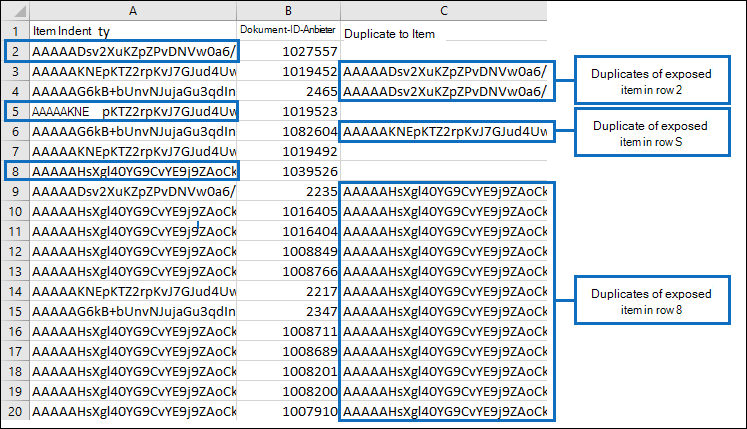

# Deduplizierung in eDiscovery-Suchergebnissen

In diesem Artikel wird die Funktionsweise der Deduplizierung von eDiscovery-Suchergebnissen beschrieben und die Einschränkungen des Deduplizierungsalgorithmus erläutert.
  
Wenn Sie eDiscovery-Tools zum Exportieren der Ergebnisse einer eDiscovery-Suche verwenden, haben Sie die Möglichkeit, die exportierten Ergebnisse zu deduplizieren. Szenario Wenn Sie die Deduplizierung aktivieren (standardmäßig ist die Deduplizierung nicht aktiviert), wird nur eine Kopie einer E-Mail-Nachricht exportiert, obwohl in den durchsuchten Postfächern möglicherweise mehrere Instanzen derselben Nachricht gefunden wurden. Die Deduplizierung hilft Ihnen, Zeit zu sparen, indem Sie die Anzahl der Elemente reduzieren, die Sie überprüfen und analysieren müssen, nachdem die Suchergebnisse exportiert wurden. Es ist jedoch wichtig, zu verstehen, wie die Deduplizierung funktioniert, und beachten Sie, dass es Einschränkungen für den Algorithmus gibt, die dazu führen können, dass ein eindeutiges Element während des Exportvorgangs als Duplikat gekennzeichnet wird.
  
## Identifizieren doppelter Nachrichten

eDiscovery-Tools verwenden eine Kombination der folgenden E-Mail-Eigenschaften, um zu bestimmen, ob es sich bei einer Nachricht um ein Duplikat handelt:
  
- **InternetMessageId** – Diese Eigenschaft gibt den Internetnachrichtenbezeichner einer E-Mail-Nachricht an, bei der es sich um einen global eindeutigen Bezeichner handelt, der auf eine bestimmte Version einer bestimmten Nachricht verweist. Diese ID wird vom E-Mail-Clientprogramm des Absenders oder vom Host-E-Mail-System generiert, das die Nachricht sendet. Wenn eine Person eine Nachricht an mehrere Empfänger sendet, ist die Internetnachrichten-ID für jede Instanz der Nachricht identisch. Nachfolgende Überarbeitungen der ursprünglichen Nachricht erhalten einen anderen Nachrichtenbezeichner. 

- **ConversationTopic** – Diese Eigenschaft gibt den Betreff des Unterhaltungsthreads einer Nachricht an. Der Wert der **ConversationTopic-Eigenschaft** ist die Zeichenfolge, die das allgemeine Thema der Unterhaltung beschreibt. Eine Erhaltung besteht aus einer anfänglichen Nachricht und allen Nachrichten, die als Antwort auf die ursprüngliche Nachricht gesendet werden. Nachrichten innerhalb derselben Unterhaltung haben denselben Wert für die **ConversationTopic-Eigenschaft.** Der Wert dieser Eigenschaft ist in der Regel die Betreffzeile aus der anfänglichen Nachricht, die die Unterhaltung gezeitet hat. 

- **BodyTagInfo** – Dies ist eine interne Exchange Store-Eigenschaft. Der Wert dieser Eigenschaft wird durch Überprüfen verschiedener Attribute im Nachrichtentext berechnet. Diese Eigenschaft wird verwendet, um Unterschiede im Nachrichtentext zu identifizieren. 

Während des eDiscovery-Exportprozesses werden diese drei Eigenschaften für jede Nachricht verglichen, die den Suchkriterien entspricht. Wenn diese Eigenschaften für zwei (oder mehr) Nachrichten identisch sind, werden diese Nachrichten als Duplikate bestimmt, und das Ergebnis ist, dass nur eine Kopie der Nachricht exportiert wird, wenn die Deduplizierung aktiviert ist. Die exportierte Nachricht wird als "Quellelement" bezeichnet. Informationen zu doppelten Nachrichten  sind in denResults.csvund **Manifest.xml** enthalten, die in den exportierten Suchergebnissen enthalten sind. In der **Results.csv** wird eine doppelte Nachricht durch einen Wert in der Spalte Duplizieren in **Element** identifiziert. Der Wert in dieser Spalte entspricht dem Wert in der **Spalte Elementidentität** für die exportierte Nachricht. 
  
Die folgenden Grafiken zeigen, wie doppelte  Nachrichten in  denResults.csvundManifest.xmlangezeigt werden, die mit den Suchergebnissen exportiert werden. Diese Berichte enthalten nicht die zuvor beschriebenen E-Mail-Eigenschaften, die im Deduplizierungsalgorithmus verwendet werden. Stattdessen enthalten die Berichte die **Item Identity-Eigenschaft,** die Elementen vom Exchange wird. 
  
 ### Results.csv (in der Excel)
  

  
 ### Manifest.xml (in der Excel)
  

  
Darüber hinaus sind andere Eigenschaften aus doppelten Nachrichten in den Exportberichten enthalten. Dies umfasst das Postfach, in dem sich die doppelte Nachricht befindet, ob die Nachricht an eine Verteilergruppe gesendet wurde und ob die Nachricht Cc'd oder Bcc'd an einen anderen Benutzer war.
  
## Einschränkungen des Deduplizierungsalgorithmus

Es gibt einige bekannte Einschränkungen des Deduplizierungsalgorithmus, die dazu führen können, dass eindeutige Elemente als Duplikate markiert werden. Es ist wichtig, diese Einschränkungen zu verstehen, damit Sie entscheiden können, ob Sie das optionale Deduplizierungsfeature verwenden möchten.
  
Es gibt eine Situation, in der das Deduplizierungsfeature eine Nachricht fälschlicherweise als Duplikat identifiziert und nicht exportiert (aber dennoch als Duplikat in den Exportberichten zitiert). Dies sind Nachrichten, die ein Benutzer bearbeitet, aber nicht sendet. Angenommen, ein Benutzer wählt eine Nachricht in Outlook aus, kopiert den Inhalt der Nachricht und fügt sie dann in eine neue Nachricht ein. Anschließend ändert der Benutzer eine der Kopien, indem er eine Anlage entfernt oder hinzufügungen oder die Betreffzeile oder den Textkörper selbst ändert. Wenn diese beiden Nachrichten mit der Abfrage einer eDiscovery-Suche übereinstimmen, wird nur eine der Nachrichten exportiert, wenn die Deduplizierung aktiviert ist, wenn die Suchergebnisse exportiert werden. Obwohl also die ursprüngliche Nachricht oder die kopierte Nachricht geändert wurde, wurden keine der überarbeiteten Nachrichten gesendet, und daher wurden die Werte der **Eigenschaften InternetMessageId,** **ConversationTopic** und **BodyTagInfo** nicht aktualisiert. Wie bereits erläutert, werden beide Nachrichten jedoch in den Exportberichten aufgeführt. 
  
Eindeutige Nachrichten können auch als Duplikate markiert werden, wenn das Feature zum Schutz von Seiten zum Kopieren bei Schreibzugriff aktiviert ist, wie im Fall eines Postfachs, das sich im Prozesssicherungsverfahren befindet oder In-Place wird. Das Feature Copy-on-Write kopiert die ursprüngliche Nachricht (und speichert sie im Ordner Versionen des Ordners "Wiederherstellbare Elemente") des Benutzers, bevor die Überarbeitung des ursprünglichen Elements gespeichert wird. In diesem Fall können die überarbeitete Kopie und die ursprüngliche Nachricht (im Ordner "Wiederherstellbare Elemente") als doppelte Nachrichten betrachtet werden, und daher würde nur eine davon exportiert.
  
> [!IMPORTANT]
> Wenn sich die Einschränkungen des Deduplizierungsalgorithmus auf die Qualität Ihrer Suchergebnisse auswirken können, sollten Sie beim Exportieren von Elementen keine Deduplizierung aktivieren. Wenn die in diesem Abschnitt beschriebenen Situationen wahrscheinlich kein Faktor in ihren Suchergebnissen sind und Sie die Anzahl der Elemente verringern möchten, die wahrscheinlich Duplikate sind, sollten Sie die Deduplizierung aktivieren. 
  
## Weitere Informationen

- Die Informationen in diesem Artikel gelten beim Exportieren von Suchergebnissen mit einem der folgenden eDiscovery-Tools:

  - Inhaltssuche im Compliance Center in Office 365

  - Compliance-eDiscovery in Exchange Online

  - Das eDiscovery Center in SharePoint Online

- Weitere Informationen zum Exportieren von Suchergebnissen finden Sie unter:

  - [Exportieren der Inhaltssuche](export-search-results.md)

  - [Exportieren eines Inhaltssuchberichts](export-a-content-search-report.md)

  - [Exportieren In-Place eDiscovery-Suchergebnisse in eine PST-Datei](/exchange/security-and-compliance/in-place-ediscovery/export-search-results)

  - [Exportieren von Inhalten und Erstellen von Berichten im eDiscovery Center](/SharePoint/governance/export-content-and-create-reports-in-the-ediscovery-center)