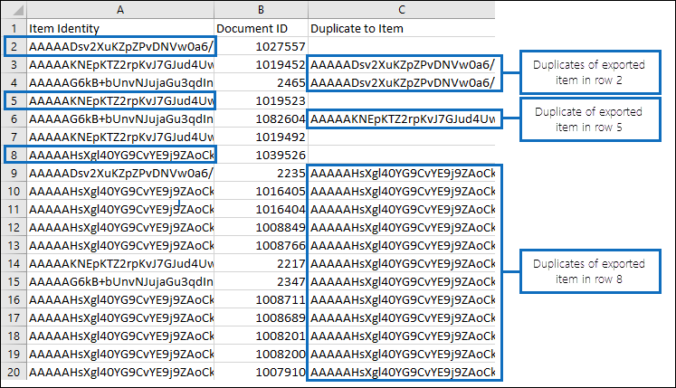
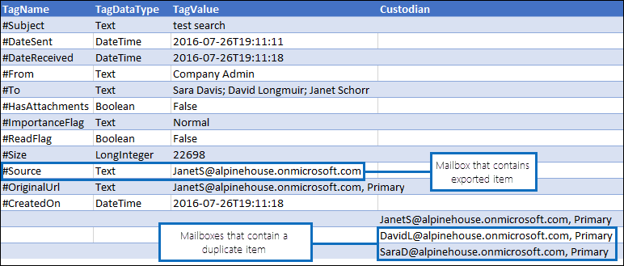

# Deduplizierung in eDiscovery-SuchergebnissenDe-duplication in eDiscovery search results

In diesem Artikel wird die Funktionsweise der Deduplizierung von eDiscovery-Suchergebnissen beschrieben und die Einschränkungen des Deduplizierungsalgorithmus erläutert.This article describes how de-duplication of eDiscovery search results works and explains the limitations of the de-duplication algorithm.
  
Wenn Sie eDiscovery-Tools zum Exportieren der Ergebnisse einer eDiscovery-Suche verwenden, haben Sie die Möglichkeit, die exportierten Ergebnisse zu deduplizieren.When using eDiscovery tools to export the results of an eDiscovery search, you have the option to de-duplicate the results that are exported. SzenarioWhat does this mean? Wenn Sie die Deduplizierung aktivieren (standardmäßig ist die Deduplizierung nicht aktiviert), wird nur eine Kopie einer E-Mail-Nachricht exportiert, obwohl in den durchsuchten Postfächern möglicherweise mehrere Instanzen derselben Nachricht gefunden wurden.When you enable de-duplication (by default, de-duplication isn't enabled), only one copy of an email message is exported even though multiple instances of the same message might have been found in the mailboxes that were searched. Die Deduplizierung hilft Ihnen, Zeit zu sparen, indem Sie die Anzahl der Elemente reduzieren, die Sie überprüfen und analysieren müssen, nachdem die Suchergebnisse exportiert wurden.De-duplication helps you save time by reducing the number of items that you have to review and analyze after the search results are exported. Es ist jedoch wichtig, zu verstehen, wie die Deduplizierung funktioniert, und beachten Sie, dass es Einschränkungen für den Algorithmus gibt, die dazu führen können, dass ein eindeutiges Element während des Exportvorgangs als Duplikat gekennzeichnet wird.But it's important to understand how de-duplication works and be aware that there are limitations to the algorithm that might cause a unique item to be marked as a duplicate during the export process.
  
## Identifizieren doppelter NachrichtenHow duplicate messages are identified

eDiscovery-Tools verwenden eine Kombination der folgenden E-Mail-Eigenschaften, um zu bestimmen, ob es sich bei einer Nachricht um ein Duplikat handelt:eDiscovery tools use a combination of the following email properties to determine whether a message is a duplicate:
  
- **InternetMessageId** – Diese Eigenschaft gibt den Internetnachrichtenbezeichner einer E-Mail-Nachricht an, bei der es sich um einen global eindeutigen Bezeichner handelt, der auf eine bestimmte Version einer bestimmten Nachricht verweist.**InternetMessageId** - This property specifies the Internet message identifier of an email message, which is a globally unique identifier that refers to a specific version of a specific message. Diese ID wird vom E-Mail-Clientprogramm des Absenders oder vom Host-E-Mail-System generiert, das die Nachricht sendet.This ID is generated by the sender's email client program or host email system that sends the message. Wenn eine Person eine Nachricht an mehrere Empfänger sendet, ist die Internetnachrichten-ID für jede Instanz der Nachricht identisch.If a person sends a message to more than one recipient, the Internet message ID will be the same for each instance of the message. Nachfolgende Überarbeitungen der ursprünglichen Nachricht erhalten einen anderen Nachrichtenbezeichner.Subsequent revisions to the original message will receive a different message identifier. 

- **ConversationTopic** – Diese Eigenschaft gibt den Betreff des Unterhaltungsthreads einer Nachricht an.**ConversationTopic** - This property specifies the subject of the conversation thread of a message. Der Wert der **ConversationTopic-Eigenschaft** ist die Zeichenfolge, die das allgemeine Thema der Unterhaltung beschreibt.The value of the **ConversationTopic** property is the string that describes the overall topic of the conversation. Eine Erhaltung besteht aus einer anfänglichen Nachricht und allen Nachrichten, die als Antwort auf die ursprüngliche Nachricht gesendet werden.A conservation consists of an initial message and all messages sent in reply to the initial message. Nachrichten innerhalb derselben Unterhaltung haben denselben Wert für die **ConversationTopic-Eigenschaft.**Messages within the same conversation have the same value for the **ConversationTopic** property. Der Wert dieser Eigenschaft ist in der Regel die Betreffzeile aus der anfänglichen Nachricht, die die Unterhaltung gezeitet hat.The value of this property is typically the Subject line from the initial message that spawned the conversation. 

- **BodyTagInfo** – Dies ist eine interne Exchange Store-Eigenschaft.**BodyTagInfo** - This is an internal Exchange store property. Der Wert dieser Eigenschaft wird durch Überprüfen verschiedener Attribute im Nachrichtentext berechnet.The value of this property is calculated by checking various attributes in the body of the message. Diese Eigenschaft wird verwendet, um Unterschiede im Nachrichtentext zu identifizieren.This property is used to identify differences in the body of messages. 

Während des eDiscovery-Exportprozesses werden diese drei Eigenschaften für jede Nachricht verglichen, die den Suchkriterien entspricht.During the eDiscovery export process, these three properties are compared for every message that matches the search criteria. Wenn diese Eigenschaften für zwei (oder mehr) Nachrichten identisch sind, werden diese Nachrichten als Duplikate bestimmt, und das Ergebnis ist, dass nur eine Kopie der Nachricht exportiert wird, wenn die Deduplizierung aktiviert ist.If these properties are identical for two (or more) messages, those messages are determined to be duplicates and the result is that only one copy of the message will be exported if de-duplication is enabled. Die exportierte Nachricht wird als "Quellelement" bezeichnet.The message that is exported is known as the "source item". Informationen zu doppelten Nachrichten  sind in denResults.csvund **Manifest.xml** enthalten, die in den exportierten Suchergebnissen enthalten sind.Information about duplicate messages is included in the **Results.csv** and **Manifest.xml** reports that are included with the exported search results. In der **Results.csv** wird eine doppelte Nachricht durch einen Wert in der Spalte Duplizieren in **Element** identifiziert.In the **Results.csv** file, a duplicate message is identified by having a value in the **Duplicate to Item** column. Der Wert in dieser Spalte entspricht dem Wert in der **Spalte Elementidentität** für die exportierte Nachricht.The value in this column matches the value in the **Item Identity** column for the message that was exported. 
  
Die folgenden Grafiken zeigen, wie doppelte  Nachrichten in  denResults.csvundManifest.xmlangezeigt werden, die mit den Suchergebnissen exportiert werden.The following graphics show how duplicate messages are displayed in the **Results.csv** and **Manifest.xml** reports that are exported with the search results. Diese Berichte enthalten nicht die zuvor beschriebenen E-Mail-Eigenschaften, die im Deduplizierungsalgorithmus verwendet werden.These reports don't include the email properties previously described, which are used in the de-duplication algorithm. Stattdessen enthalten die Berichte die **Item Identity-Eigenschaft,** die Elementen vom Exchange wird.Instead, the reports include the **Item Identity** property that is assigned to items by the Exchange store. 
  
 ### Results.csv (in der Excel)Results.csv report (viewed in Excel)
  

  
 ### Manifest.xml (in der Excel)Manifest.xml report (viewed in Excel)
  

  
Darüber hinaus sind andere Eigenschaften aus doppelten Nachrichten in den Exportberichten enthalten.Additionally, other properties from duplicate messages are included in the export reports. Dies umfasst das Postfach, in dem sich die doppelte Nachricht befindet, ob die Nachricht an eine Verteilergruppe gesendet wurde und ob die Nachricht Cc'd oder Bcc'd an einen anderen Benutzer war.This includes the mailbox the duplicate message is located in, whether the message was sent to a distribution group, and whether the message was Cc'd or Bcc'd to another user.
  
## Einschränkungen des DeduplizierungsalgorithmusLimitations of the de-duplication algorithm

Es gibt einige bekannte Einschränkungen des Deduplizierungsalgorithmus, die dazu führen können, dass eindeutige Elemente als Duplikate markiert werden.There are some known limitations of the de-duplication algorithm that might cause unique items to get marked as duplicates. Es ist wichtig, diese Einschränkungen zu verstehen, damit Sie entscheiden können, ob Sie das optionale Deduplizierungsfeature verwenden möchten.It's important to understand these limitations so you can decide whether or not to use the optional de-duplication feature.
  
Es gibt eine Situation, in der das Deduplizierungsfeature eine Nachricht fälschlicherweise als Duplikat identifiziert und nicht exportiert (aber dennoch als Duplikat in den Exportberichten zitiert).There's one situation where the de-duplication feature might mistakenly identify a message as a duplicate and not export it (but still cite it as a duplicate in the export reports). Dies sind Nachrichten, die ein Benutzer bearbeitet, aber nicht sendet.These are messages that a user edits but doesn't send. Angenommen, ein Benutzer wählt eine Nachricht in Outlook aus, kopiert den Inhalt der Nachricht und fügt sie dann in eine neue Nachricht ein.For example, let's say a user selects a message in Outlook, copies the contents of the message, and then pastes it in a new message. Anschließend ändert der Benutzer eine der Kopien, indem er eine Anlage entfernt oder hinzufügungen oder die Betreffzeile oder den Textkörper selbst ändert.Then the user changes one of the copies by removing or adding an attachment, or changing the subject line or the body itself. Wenn diese beiden Nachrichten mit der Abfrage einer eDiscovery-Suche übereinstimmen, wird nur eine der Nachrichten exportiert, wenn die Deduplizierung aktiviert ist, wenn die Suchergebnisse exportiert werden.If these two messages match the query of an eDiscovery search, only one of the messages will be exported if de-duplication is enabled when the search results are exported. Obwohl also die ursprüngliche Nachricht oder die kopierte Nachricht geändert wurde, wurden keine der überarbeiteten Nachrichten gesendet, und daher wurden die Werte der **Eigenschaften InternetMessageId,** **ConversationTopic** und **BodyTagInfo** nicht aktualisiert.So even though the original message or the copied message was changed, neither of the revised messages were sent and therefore the values of **InternetMessageId**, **ConversationTopic** and **BodyTagInfo** properties weren't updated. Wie bereits erläutert, werden beide Nachrichten jedoch in den Exportberichten aufgeführt.But as previously explained, both messages will be listed in the export reports 
  
Eindeutige Nachrichten können auch als Duplikate markiert werden, wenn das Feature zum Schutz von Seiten zum Kopieren bei Schreibzugriff aktiviert ist, wie im Fall eines Postfachs, das sich im Prozesssicherungsverfahren befindet oder In-Place wird.Unique messages can also be marked as duplicates when the Copy-on-Write page protection feature is enabled, as in the case of a mailbox being on Litigation Hold or In-Place Hold. Das Feature Copy-on-Write kopiert die ursprüngliche Nachricht (und speichert sie im Ordner Versionen des Ordners "Wiederherstellbare Elemente") des Benutzers, bevor die Überarbeitung des ursprünglichen Elements gespeichert wird.The Copy-on-Write feature copies the original message (and saves it in the Versions folder of the user's Recoverable Items folder) before the revision to original item is saved. In diesem Fall können die überarbeitete Kopie und die ursprüngliche Nachricht (im Ordner "Wiederherstellbare Elemente") als doppelte Nachrichten betrachtet werden, und daher würde nur eine davon exportiert.In this case, the revised copy and the original message (in the Recoverable Items folder) might be considered as duplicate messages and therefore only one of them would be exported.
  
> [!IMPORTANT]
> Wenn sich die Einschränkungen des Deduplizierungsalgorithmus auf die Qualität Ihrer Suchergebnisse auswirken können, sollten Sie beim Exportieren von Elementen keine Deduplizierung aktivieren.If the limitations of the de-duplication algorithm might impact the quality of your search results, then you shouldn't enable de-duplication when you export items. Wenn die in diesem Abschnitt beschriebenen Situationen wahrscheinlich kein Faktor in ihren Suchergebnissen sind und Sie die Anzahl der Elemente verringern möchten, die wahrscheinlich Duplikate sind, sollten Sie die Deduplizierung aktivieren.If the situations described in this section are unlikely to be a factor in your search results, and you want to reduce the number of items most likely to be duplicates, then you should consider enabling de-duplication. 
  
## Weitere InformationenMore information

- Die Informationen in diesem Artikel gelten beim Exportieren von Suchergebnissen mit einem der folgenden eDiscovery-Tools:The information in this article is applicable when exporting search results using one of the following eDiscovery tools:

  - Inhaltssuche im Compliance Center in Office 365Content search in compliance center in Office 365

  - Compliance-eDiscovery in Exchange OnlineIn-Place eDiscovery in Exchange Online

  - Das eDiscovery Center in SharePoint OnlineThe eDiscovery Center in SharePoint Online

- Weitere Informationen zum Exportieren von Suchergebnissen finden Sie unter:For more information about exporting search results, see:

  - [Exportieren der InhaltssucheExport Content Search](export-search-results.md)

  - [Exportieren eines InhaltssuchberichtsExport a Content Search report](export-a-content-search-report.md)

  - [Exportieren In-Place eDiscovery-Suchergebnisse in eine PST-DateiExport In-Place eDiscovery search results to a PST file](/exchange/security-and-compliance/in-place-ediscovery/export-search-results)

  - [Exportieren von Inhalten und Erstellen von Berichten im eDiscovery CenterExport content and create reports in the eDiscovery Center](/SharePoint/governance/export-content-and-create-reports-in-the-ediscovery-center)