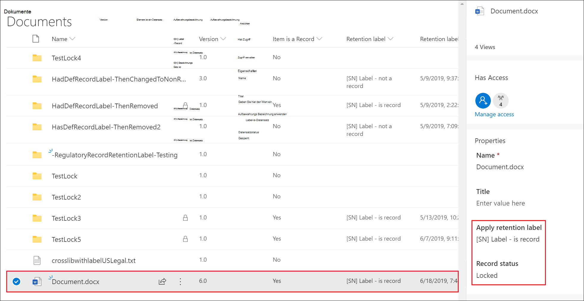

# <a name="declare-records-by-using-retention-labels"></a><span data-ttu-id="a42c0-103">Datensätzen mithilfe von Aufbewahrungsbezeichnungen deklarieren</span><span class="sxs-lookup"><span data-stu-id="a42c0-103">Declare records by using retention labels</span></span>

><span data-ttu-id="a42c0-104">*[Microsoft 365-Lizenzierungsleitfaden für Sicherheit und Compliance](https://aka.ms/ComplianceSD).*</span><span class="sxs-lookup"><span data-stu-id="a42c0-104">*[Microsoft 365 licensing guidance for security & compliance](https://aka.ms/ComplianceSD).*</span></span>

<span data-ttu-id="a42c0-105">Um Dokumente und E-Mails als [Datensatz](records-management.md#records) zu deklarieren, verwenden Sie [Aufbewahrungsbezeichnungen](retention.md#retention-labels), die Elemente als **Datensatz** oder **regulatorischen Datensatz** markieren.</span><span class="sxs-lookup"><span data-stu-id="a42c0-105">To declare documents and emails as [records](records-management.md#records), you use [retention labels](retention.md#retention-labels) that mark the content as a **record** or a **regulatory record**.</span></span>

<span data-ttu-id="a42c0-106">Wenn Sie nicht sicher sind, ob Sie einen Datensatz oder regulatorischen Datensatz verwenden sollen, lesen Sie [Vergleichen von Einschränkungen für zulässige und blockierte Aktionen](records-management.md#compare-restrictions-for-what-actions-are-allowed-or-blocked).</span><span class="sxs-lookup"><span data-stu-id="a42c0-106">If you're not sure whether to use a record or a regulatory record, see [Compare restrictions for what actions are allowed or blocked](records-management.md#compare-restrictions-for-what-actions-are-allowed-or-blocked).</span></span> <span data-ttu-id="a42c0-107">Wenn Sie regulatorischen Datensatz verwenden müssen, müssen Sie zuerst einen PowerShell-Befehl ausführen, wie im nächsten Abschnitt beschrieben.</span><span class="sxs-lookup"><span data-stu-id="a42c0-107">If you need to use regulatory records, you must first run a PowerShell command, as described in the next section.</span></span>

<span data-ttu-id="a42c0-108">Danach können Sie diese Bezeichnungen entweder in einer Aufbewahrungsrichtlinie veröffentlichen (sodass Benutzer und Administratoren diese manuell auf Inhalte anwenden können) oder für Bezeichnungen, mit denen Elemente als Datensätze markiert werden. Wenden Sie diese Bezeichnungen automatisch auf Inhalte an, die Sie als Datensatz deklarieren möchten.</span><span class="sxs-lookup"><span data-stu-id="a42c0-108">You can then either publish those labels in a retention label policy so that users and administrators can apply them to content, or for labels that mark items as records (but not regulatory records), auto-apply those labels to content that you want to declare a record.</span></span>

## <a name="how-to-display-the-option-to-mark-content-as-a-regulatory-record"></a><span data-ttu-id="a42c0-109">So zeigen Sie die Option zum Markieren von Inhalten als regulatorischen Datensatz an</span><span class="sxs-lookup"><span data-stu-id="a42c0-109">How to display the option to mark content as a regulatory record</span></span>

>[!NOTE] 
> <span data-ttu-id="a42c0-110">Bei dem folgenden Verfahren handelt es sich um eine überwachbare Aktion, die Protokollierung **Option für die Festlegung von Auflagen für Aufbewahrungsbezeichnungen** im Abschnitt [Aufbewahrungsrichtlinie und Aufbewahrungsaktivitäten](search-the-audit-log-in-security-and-compliance.md#retention-policy-and-retention-label-activities) des Überwachungsprotokolls.</span><span class="sxs-lookup"><span data-stu-id="a42c0-110">The following procedure is an auditable action, logging **Enabled regulatory record option for retention labels** in the [Retention policy and retention label activities](search-the-audit-log-in-security-and-compliance.md#retention-policy-and-retention-label-activities) section of the audit log.</span></span>

<span data-ttu-id="a42c0-111">Standardmäßig wird die Aufbewahrungsbezeichnungsoption zum Markieren von Inhalten als regulatorischer Datensatz im Aufbewahrungsbezeichnungs-Assistenten nicht angezeigt.</span><span class="sxs-lookup"><span data-stu-id="a42c0-111">By default, the retention label option to mark content as a regulatory record isn't displayed in the retention label wizard.</span></span> <span data-ttu-id="a42c0-112">Wenn Sie diese Option anzeigen möchten, müssen Sie zuerst einen PowerShell-Befehl ausführen:</span><span class="sxs-lookup"><span data-stu-id="a42c0-112">To display this option, you must first run a PowerShell command:</span></span>

1. <span data-ttu-id="a42c0-113">[Herstellen einer Verbindung mit der Office 365 Security & Compliance Center PowerShell](https://docs.microsoft.com/powershell/exchange/office-365-scc/connect-to-scc-powershell/connect-to-scc-powershell).</span><span class="sxs-lookup"><span data-stu-id="a42c0-113">[Connect to the Office 365 Security & Compliance Center Powershell](https://docs.microsoft.com/powershell/exchange/office-365-scc/connect-to-scc-powershell/connect-to-scc-powershell).</span></span>

2. <span data-ttu-id="a42c0-114">Führen Sie das folgende Cmdlet aus:</span><span class="sxs-lookup"><span data-stu-id="a42c0-114">Run the following cmdlet:</span></span>
    
    ```powershell
    Set-RegulatoryComplianceUI -Enabled $true
    ````
    <span data-ttu-id="a42c0-115">Es wird keine Bestätigung angezeigt, und die Einstellung wird sofort wirksam.</span><span class="sxs-lookup"><span data-stu-id="a42c0-115">There is no prompt to confirm and the setting takes effect immediately.</span></span>

<span data-ttu-id="a42c0-116">Wenn Sie es sich anders überlegen, können Sie sie erneut ausblenden, indem Sie dasselbe Cmdlet mit dem Wert **false** ausführen: `Set-RegulatoryComplianceUI -Enabled $false`</span><span class="sxs-lookup"><span data-stu-id="a42c0-116">If you change your mind about seeing this option in the retention label wizard, you can hide it again by running the same cmdlet with the **false** value: `Set-RegulatoryComplianceUI -Enabled $false`</span></span> 

## <a name="configuring-retention-labels-to-declare-records"></a><span data-ttu-id="a42c0-117">Aufbewahrungsbezeichnugen zum Deklarieren von Datensätzen konfigurieren</span><span class="sxs-lookup"><span data-stu-id="a42c0-117">Configuring retention labels to declare records</span></span>

<span data-ttu-id="a42c0-118">Wenn Sie eine Aufbewahrungsbezeichnung aus der **Datensatzverwaltung** s-Lösung im Microsoft 365 Compliance Center erstellen oder bearbeiten, haben Sie die Möglichkeit, Elemente als Datensatz zu kennzeichnen.</span><span class="sxs-lookup"><span data-stu-id="a42c0-118">When you create or edit a retention label from the **Records Management** solution in the Microsoft 365 compliance center, you have the option to mark items as a record.</span></span> <span data-ttu-id="a42c0-119">Wenn Sie den PowerShell-Befehl aus dem vorherigen Abschnitt ausgeführt haben, können Sie alternativ Elemente als regulatorischen Datensatz festlegen.</span><span class="sxs-lookup"><span data-stu-id="a42c0-119">If you ran the PowerShell command from the previous section, you can alternatively mark items as a regulatory record.</span></span>

<span data-ttu-id="a42c0-120">Zum Beispiel:</span><span class="sxs-lookup"><span data-stu-id="a42c0-120">For example:</span></span>


<span data-ttu-id="a42c0-122">Wenden Sie die Aufbewahrungsbezeichnung nach Bedarf auf Microsoft Office SharePoint Online oder OneDrive-Dokumente und Exchange-E-Mails an.</span><span class="sxs-lookup"><span data-stu-id="a42c0-122">Using this retention label, you can now apply it to SharePoint or OneDrive documents and Exchange emails, as needed.</span></span> 

<span data-ttu-id="a42c0-123">Vollständige Anweisungen:</span><span class="sxs-lookup"><span data-stu-id="a42c0-123">For full instructions:</span></span>

- [<span data-ttu-id="a42c0-124">Erstellen von Aufbewahrungsbezeichnungen und Anwenden in Apps</span><span class="sxs-lookup"><span data-stu-id="a42c0-124">Create retention labels and apply them in apps</span></span>](create-apply-retention-labels.md)

- <span data-ttu-id="a42c0-125">[Automatisches Anwenden einer Aufbewahrungsbezeichnung auf Inhalte](apply-retention-labels-automatically.md) (wird bei regulatorischen Datensätzen nicht unterstützt)</span><span class="sxs-lookup"><span data-stu-id="a42c0-125">[Apply a retention label to content automatically](apply-retention-labels-automatically.md) (not supported for regulatory records)</span></span>


## <a name="applying-the-configured-retention-label-to-content"></a><span data-ttu-id="a42c0-126">Anwenden der konfigurierten Aufbewahrungsbezeichnung auf Inhalte</span><span class="sxs-lookup"><span data-stu-id="a42c0-126">Applying the configured retention label to content</span></span>

<span data-ttu-id="a42c0-127">Wenn Aufbewahrungsbezeichnungen, die Inhalte als Datensatz oder regulatorischen Datensatz markieren, Benutzern zur Verfügung gestellt werden, um sie in Apps anzuwenden:</span><span class="sxs-lookup"><span data-stu-id="a42c0-127">When retention labels that mark items as a record or regulatory record are made available for users to apply them in apps:</span></span>

- <span data-ttu-id="a42c0-128">Bei Exchange kann jeder Benutzer mit Schreibzugriff auf das Postfach diese Bezeichnung anwenden.</span><span class="sxs-lookup"><span data-stu-id="a42c0-128">For Exchange, any user with write-access to the mailbox can apply these labels.</span></span> 
- <span data-ttu-id="a42c0-129">Bei SharePoint und OneDrive kann jeder Benutzer in der Standardgruppe "Mitglieder" (Berechtigungsstufe "Beitrag") diese Bezeichnung anwenden.</span><span class="sxs-lookup"><span data-stu-id="a42c0-129">For SharePoint and OneDrive, any user in the default Members group (the Contribute permission level) can apply these labels.</span></span>

<span data-ttu-id="a42c0-130">Beispiel für ein Dokument, das mithilfe einer Aufbewahrungsbezeichnung als Datensatz markiert wurde:</span><span class="sxs-lookup"><span data-stu-id="a42c0-130">Example of a document marked as record by using a retention label:</span></span>



## <a name="next-steps"></a><span data-ttu-id="a42c0-132">Weitere Schritte</span><span class="sxs-lookup"><span data-stu-id="a42c0-132">Next steps</span></span>

<span data-ttu-id="a42c0-133">Eine Liste von Szenarios, die von der Datensatzverwaltung unterstützt werden, finden Sie unter [Häufige Szenarios für die Datensatzverwaltung](get-started-with-records-management.md#common-scenarios-for-records-management).</span><span class="sxs-lookup"><span data-stu-id="a42c0-133">For a list of scenarios supported by records management, see [Common scenarios for records management](get-started-with-records-management.md#common-scenarios-for-records-management).</span></span>
