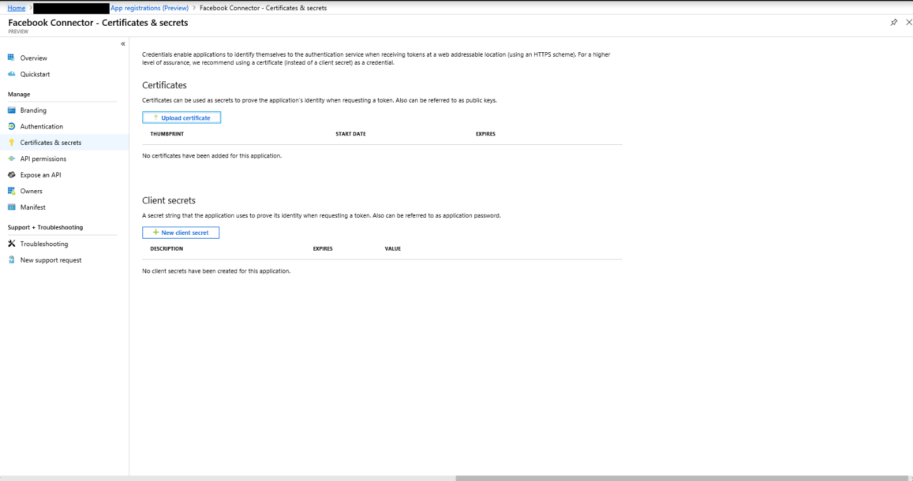
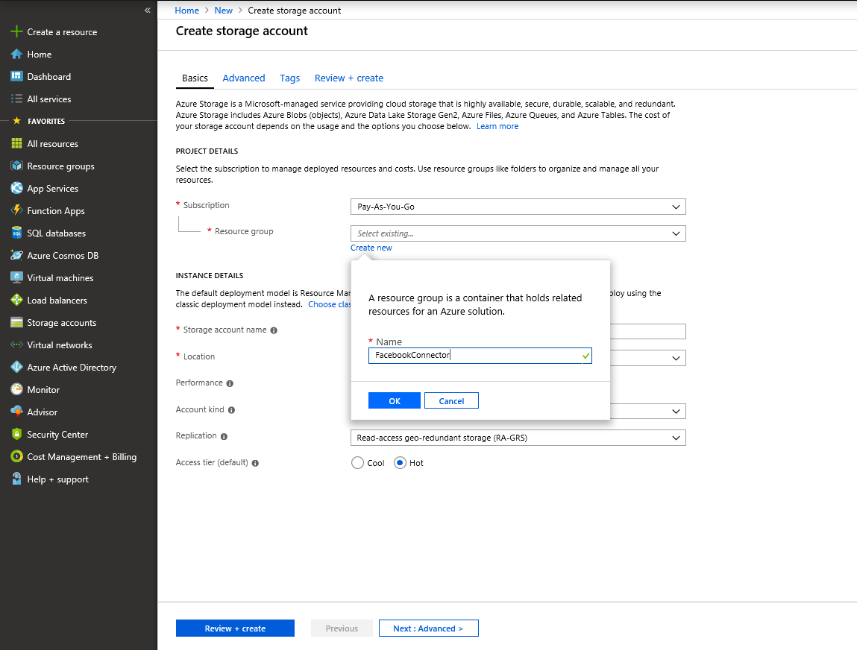
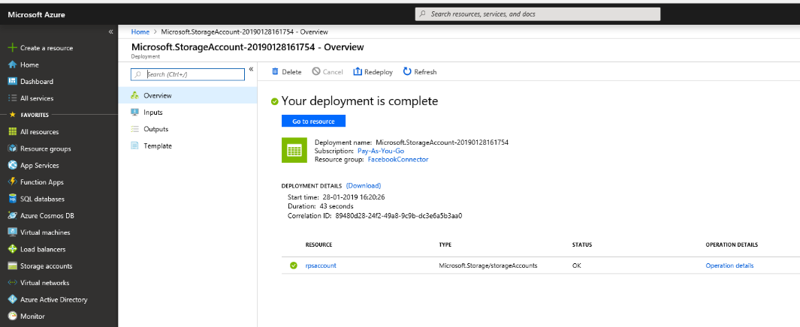
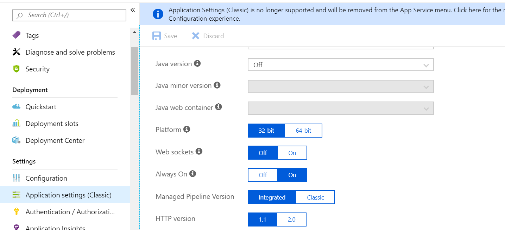
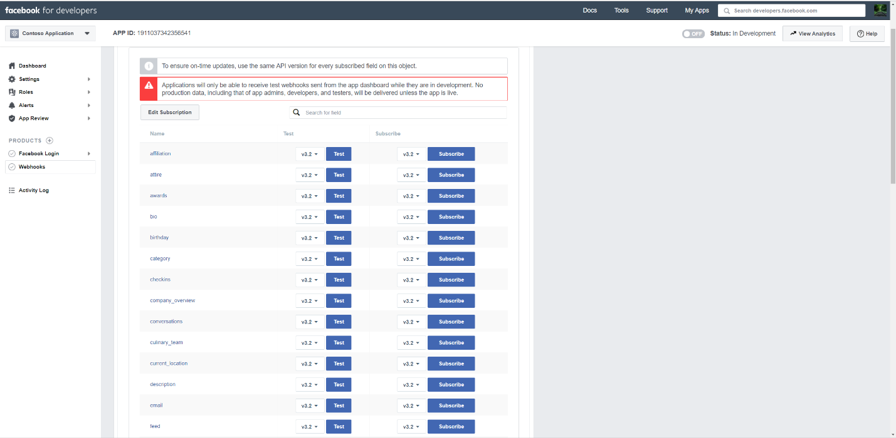
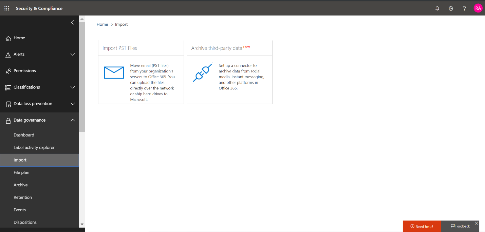
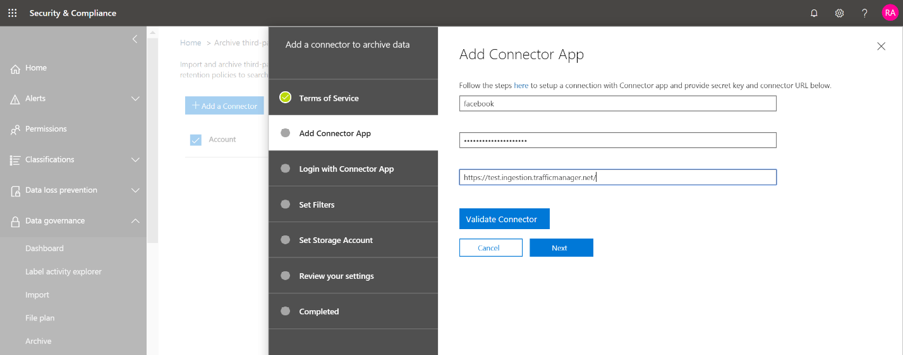

# Bereitstellen eines Connectors zum Archivieren von Facebook-DatenDeploy a connector to archive Facebook data

Dieser Artikel enthält den schrittweisen Prozess zur Bereitstellungeines Connectors, der den Office 365 Import Dienst verwendet, um Daten von Facebook-Geschäfts Seiten in Office 365 zu importieren.This article contains the step-by-step process to deploy a connector that uses the Office 365 Import service to import data from Facebook Business pages to Office 365. Eine allgemeine Übersicht über diesen Prozess und eine Liste der erforderlichen Voraussetzungen für die Bereitstellungeines Facebook-Konnektors finden Sie unter [Verwenden eines Beispiel-Konnektors zum Archivieren von Facebook-Daten in Office 365 (Preview)](archive-facebook-data-with-sample-connector.md).For a high-level overview of this process and a list of prerequisites required to deploy a Facebook connector, see [Use a sample connector to archive Facebook data in Office 365 (Preview)](archive-facebook-data-with-sample-connector.md). 

## Schritt 1: Herunterladen des PaketsStep 1: Download the package

Laden Sie das vorgefertigte Paket aus dem Abschnitt Release im GitHub-Repository unter <https://github.com/Microsoft/m365-sample-connector-csharp-aspnet/releases>herunter.Download the prebuilt package from the Release section in the GitHub repository at <https://github.com/Microsoft/m365-sample-connector-csharp-aspnet/releases>. Laden Sie die ZIP-Datei mit dem Namen **SampleConnector. zip**unter der neuesten Version herunter.Under the latest release, download the zip file named **SampleConnector.zip**. Sie laden diese ZIP-Datei in Schritt 4 in Azure hoch.You upload this zip file to Azure in Step 4.

## Schritt 2: Erstellen einer APP in Azure Active DirectoryStep 2: Create an app in Azure Active Directory

1. Wechseln Sie <https://portal.azure.com> zu, und melden Sie sich mit den Anmeldeinformationen eines Office 365 globalen Administratorkontos an.Go to <https://portal.azure.com> and sign in using the credentials of an Office 365 global admin account.

    

2. Klicken Sie im linken Navigationsbereich auf **Azure Active Directory**.In the left navigation pane, click **Azure Active Directory**.

    

3. Klicken Sie im linken Navigationsbereich auf **App-Registrierungen (Vorschau)** , und klicken Sie dann auf **neue Registrierung**.In the left navigation pane, click **App registrations (Preview)** and then click **New registration**.

    

4. Registrieren Sie die Anwendung.Register the application. Wählen Sie unter Umleitungs-URI die Option Webin der Dropdownliste <https://portal.azure.com> Anwendungstyp aus, und geben Sie dann in das Feld für den URI ein.Under Redirect URI, select Web in the application type dropdown list and then type <https://portal.azure.com> in the box for the URI.

   

5. Kopieren Sie die Anwendungs-ID **(Client) ID** und **Verzeichnis (Mandanten)** , und speichern Sie Sie in einer Textdatei oder an einem anderen sicheren Ort.Copy the **Application (client) ID** and **Directory (tenant) ID** and save them to a text file or other safe location. Sie verwenden diese IDs in späteren Schritten.You use these IDs in later steps.

   

6. Wechseln Sie zu **Zertifikaten #a0 Geheimnisse für die neue APP.**Go to **Certificates & secrets for the new app.**

   

7. Klicken Sie auf **neuer geheimer Client Schlüssel**Click **New client secret**

   

8. Erstellen Sie einen neuen geheimen Schlüssel.Create a new secret. Geben Sie im Feld Beschreibung den geheimen Schlüssel ein, und wählen Sie dann einen Ablaufzeitraum aus.In the description box, type the secret and then choose an expiration period. 

    

9. Kopieren Sie den Wert des geheimen Schlüssels, und speichern Sie ihn in einer Textdatei oder an einem anderen Speicherort.Copy the value of the secret and save it to a text file or other storage location. Dies ist der geheime Aad-Anwendungsschlüssel, den Sie in späteren Schritten verwenden.This is the AAD application secret that you use in later steps.

   

10. Wechseln Sie zu **Manifest** , und kopieren Sie die identifierUris (die auch als Aad Application URI bezeichnet wird) wie im folgenden Screenshot hervorgehoben.Go to **Manifest** and copy the identifierUris (which is also called the AAD application Uri) as highlighted in the following screenshot. Kopieren Sie den Aad-Anwendungs-URI in eine Textdatei oder einen anderen Speicherort.Copy the AAD application Uri to a text file or other storage location. Sie verwenden Sie in Schritt 6.You use it in Step 6.

   

## Schritt 3: Erstellen eines Azure-speicherkontosStep 3: Create an Azure storage account

1. Wechseln Sie zur Azure-Startseite für Ihre Organisation.Go to the Azure home page for your organization.

    

2. Klicken Sie auf **Ressource erstellen** , und geben Sie dann **Speicherkonto** in das Suchfeld ein.Click **Create a resource** and then type **storage account** in the search box.

    

3. Klicken Sie auf **Speicher**, und klicken Sie dann auf **Speicherkonto**.Click **Storage**, and then click **Storage account**.

    

4. Wählen Sie auf der Seite **Speicherkonto erstellen** im Feld Abonnement die Option **Pay-as-you-go** oder **Kostenlose Testversion** je nach Typ des Azure-Abonnements aus.On the **Create storage account** page, in the Subscription box, select **Pay-As-You-Go** or **Free Trial** depending on which type of Azure subscription you have. Wählen Sie dann eine Ressourcengruppe aus, oder erstellen Sie eine.Then select or create a resource group.

    

5. Geben Sie einen Namen für das Speicherkonto ein.Type a name for the storage account.

    

6. Überprüfen Sie, und klicken Sie dann auf **Erstellen** , um das Speicherkonto zu erstellen.Review and then click **Create** to create the storage account.

    

7. Klicken Sie nach einigen Momenten auf **Aktualisieren** , und klicken Sie dann auf **Ressource wechseln** , um zum Speicherkonto zu navigieren.After a few moments, click **Refresh** and then click **Go to resource** to navigate to the storage account.

    

8. Klicken Sie im linken Navigationsbereich auf **Zugriffstasten** .Click **Access keys** in the left navigation pane.

    

9. Kopieren Sie eine **Verbindungszeichenfolge** , und speichern Sie Sie in einer Textdatei oder an einem anderen Speicherort.Copy a **Connection string** and save it to a text file or other storage location. Verwenden Sie diese Option, wenn Sie eine Webanwendungs Ressource erstellen.You use this when creating a web app resource.

    

## Schritt 4: Erstellen einer neuen webapp-Ressource in AzureStep 4: Create a new web app resource in Azure

1. Klicken Sie auf der **Start** Seite im Azure-Portal auf **Ressource \> : alles \> -Webanwendung erstellen**.On the **Home** page in the Azure portal, click **Create a resource \> Everything \> Web app**. Klicken Sie auf der Seite **Webanwendung** auf **Erstellen**.On the **Web app** page, click **Create**. 

   

2. Geben Sie die Details ein (wie unten dargestellt), und erstellen Sie dann die Webanwendung.Fill in the details (as shown below) and then create the Web app. Beachten Sie, dass der Name, den Sie im Feld **App-Name** eingeben, zum Erstellen der Azure-App-Dienst-URL verwendet wird. Beispiel: FBconnector.azurewebsites.net.Note that the name that you enter in the **App name** box is used to create the Azure app service URL; for example, fbconnector.azurewebsites.net.

   

3. Wechseln Sie zur neu erstellten Webanwendungs-Ressource, und klicken Sie im linken Navigationsbereich auf **Anwendungseinstellungen** .Go to the newly created web app resource, click **Application Settings** in the left navigation pane. Klicken Sie unter Anwendungseinstellungen auf neue Einstellung hinzufügen, und fügen Sie die folgenden drei Einstellungen hinzu: Verwenden Sie die Werte (die Sie in die Textdatei aus den vorherigen Schritten kopiert haben):Under Application settings, click Add new setting and add the following three settings: Use the values (that you copied to the text file from the previous steps): 

    - **APISecretKey** – Sie können einen beliebigen Wert als geheimen Schlüssel eingeben.**APISecretKey** – You can type any value as the secret. Dieser wird für den Zugriff auf die Connector-Webanwendung in Schritt 7 verwendet.This is used to access the connector web app in Step 7.

    - **StorageAccountConnectionString** – der Verbindungszeichenfolgen-URI, den Sie nach dem Erstellen des Azure-speicherkontos in Schritt 3 kopiert haben.**StorageAccountConnectionString** — The connection string Uri that you copied after creating the Azure storage account in Step 3.

    - **Mandanten** Kennung – die Mandanten-ID Ihrer Office 365 Organisation, die Sie nach dem Erstellen der Facebook-Connector-app in Azure Active Directory in Schritt 2 kopiert haben.**tenantId** – The tenant ID of your Office 365 organization that you copied after creating the Facebook connector app in Azure Active Directory in Step 2.

    

4. Klicken Sie unter **Allgemeine Einstellungen** **auf neben** dem **immer ein**.Under **General settings**, click **On** next to the **Always On**. Klicken Sie oben auf der Seite auf **Speichern** , um die Anwendungseinstellungen zu speichern.Click **Save** at the top of the page to save the application settings.

   

5. Der letzte Schritt besteht darin, den Quellcode der Connector-app in Azure hochzuladen, den Sie in Schritt 1 heruntergeladen haben.The final step is to upload the connector app source code to Azure that you downloaded in Step 1. Wechseln Sie in einem Webbrowser zu https://<AzureAppResourceName>. SCM.azurewebsites.net/ZipDeployUi.In a web browser, go to https://<AzureAppResourceName>.scm.azurewebsites.net/ZipDeployUi. Wenn beispielsweise der Name Ihrer Azure-App-Ressource (die Sie in Schritt 2 in diesem Abschnitt genannt haben) **FBconnector**lautet, gehen Sie zu https://fbconnector.scm.azurewebsites.net/ZipDeployUi.For example, if the name of your Azure app resource (which you named in step 2 in this section) is **fbconnector**, then you would go to https://fbconnector.scm.azurewebsites.net/ZipDeployUi. 

6. Ziehen Sie das SampleConnector. zip-Menü (das Sie in Schritt 1 heruntergeladen haben) auf diese Seite.Drag and drop the SampleConnector.zip (that you downloaded in Step 1) to this page. Nachdem die Dateien hochgeladen wurden und die Bereitstellung erfolgreich war, sieht die Seite wie im folgenden Screenshot aus:After the files are uploaded and the deployment is successful, the page will look similar to the following screenshot:

   

## Schritt 5: Registrieren der Facebook-AppStep 5: Register the Facebook app

1. Wechseln Sie <https://developers.facebook.com>zu, melden Sie sich mit den Anmeldeinformationen für das Konto für die Facebook-Geschäfts Seiten Ihrer Organisation an, und klicken Sie dann auf **neue APP hinzufügen**.Go to <https://developers.facebook.com>, log in using the credentials for the account for your organization’s Facebook Business pages, and then click **Add New App**.

   

2. Erstellen Sie eine neue APP-ID.Create a new app ID.

   

3. Klicken Sie im linken Navigationsbereich auf **Produkte hinzufügen** , und klicken Sie dann auf der **Facebook-Anmelde** Kachel auf **Einrichten** .In the left navigation pane, click **Add Products** and then click **Set Up** in the **Facebook Login** tile.

   

4. Klicken Sie auf der Seite Facebook-Anmeldung einbinden auf **Website**.On the Integrate Facebook Login page, click **Web**.

   

5. Hinzufügen der Azure-App-Dienst-URL zum Beispiel `https://fbconnector.azurewebsites.net`.Add the Azure app service URL; for example `https://fbconnector.azurewebsites.net`.

   

6. Schließen Sie den Abschnitt Quick Start im Facebook-Anmelde Setup ab.Complete the QuickStart section of the Facebook Login setup.

   

7. Klicken Sie im linken Navigationsbereich unter **Facebook-Anmeldung**auf **Einstellungen**, und fügen Sie den OAuth-Umleitungs-URI im Feld **gültige OAuth-Umleitungs-URIs** hinzu.In the left navigation pane under **Facebook Login**, click **Settings**, and add the OAuth redirect URI in the **Valid OAuth Redirect URIs** box. Verwenden Sie das Format \*\* \<connectorserviceuri>/views/facebookoauth\*\*, wobei der Wert für connectorserviceuri die Azure-App-Dienst-URL für Ihre Organisation ist. Beispiel: `https://fbconnector.azurewebsites.net`.Use the format **\<connectorserviceuri>/Views/FacebookOAuth**, where the value for connectorserviceuri is the Azure app service URL for your organization; for example, `https://fbconnector.azurewebsites.net`.

   

8. Klicken Sie im linken Navigationsbereich auf **Produkte hinzufügen** , und klicken Sie dann auf **webhooks.**In the left navigation pane, click **Add Products** and then click **Webhooks.** Klicken Sie im Pulldown-Menü **Seite** auf **Seite**.In the **Page** pull-down menu, click **Page**. 

   

9. Fügen Sie die webhooks-Rückruf-URL hinzu, und fügen Sie ein Verify-Token hinzu.Add Webhooks Callback URL and add a verify token. Das Format der Rückruf-URL, verwenden Sie das Format \*\* <connectorserviceuri>/API/FbPageWebhook\*\*, wobei der Wert für connectorserviceuri die Azure-App-Dienst-URL für Ihre Organisation ist. zum Beispiel `https://fbconnector.azurewebsites.net`.The format of the callback URL, use the format **<connectorserviceuri>/api/FbPageWebhook**, where the value for connectorserviceuri is the Azure app service URL for your organization; for example `https://fbconnector.azurewebsites.net`. 

    Das Verify-Token sollte einem starken Kennwort ähneln.The verify token should similar to a strong password. Kopieren Sie das Verify-Token in eine Textdatei oder einen anderen Speicherort.Copy the verify token to a text file or other storage location.

        

10. Testen und Abonnieren des Endpunkts für Feeds.Test and subscribe to the endpoint for feed.

    

11. Fügen Sie eine Datenschutz-URL, ein App-Symbol und eine geschäftliche Verwendung hinzu.Add a privacy URL, app icon, and business use. Kopieren Sie außerdem die APP-ID und den App-Schlüssel in eine Textdatei oder einen anderen Speicherort.Also, copy the app ID and app secret to a text file or other storage location.

    

12. Machen Sie die APP öffentlich.Make the app public.

    

13. Fügen Sie der Administrator-oder Tester-Rolle einen Benutzer hinzu.Add user to the admin or tester role.

    

14. Fügen Sie die **Seite öffentliche Inhalts Zugriffs** Berechtigung hinzu.Add the **Page Public Content Access** permission.

    

15. Berechtigung zum Hinzufügen von Seiten verwalten.Add Manage Pages permission.

    

16. Holen Sie sich die Anwendung von Facebook überprüft.Get the application reviewed by Facebook.

    

## Schritt 6: Konfigurieren der Connector-WebanwendungStep 6: Configure the connector web app

1. Wechseln Sie zu\<https://AzureAppResourceName>. azurewebsites.net (wobei AzureAppResourceName der Name Ihrer Azure-App-Ressource ist, die Sie in Schritt 4 benannt haben) Wenn beispielsweise der Name **FBconnector**lautet `https://fbconnector.azurewebsites.net`, wechseln Sie zu.Go to https://\<AzureAppResourceName>.azurewebsites.net (where AzureAppResourceName is the name of your Azure app resource that you named in Step 4) For example, if the name is **fbconnector**, go to `https://fbconnector.azurewebsites.net`. Die Startseite der APP sieht wie im folgenden Screenshot aus:The home page of the app will look like the following screenshot:

   

2. Klicken Sie auf **Konfigurieren** , um eine Anmeldeseite anzuzeigen.Click **Configure** to display a sign in page.
 
   

3. Geben Sie in das Feld Mandanten-ID die Mandanten-ID ein, die Sie in Schritt 2 erhalten haben, oder fügen Sie Sie ein.In the Tenant Id box, type or paste your tenant Id (that you obtained in Step 2). Geben Sie in das Feld Kennwort den APISecretKey (den Sie in Schritt 2 erhalten haben) ein, oder fügen Sie ihn ein, und klicken Sie dann auf **Konfigurationseinstellungen festlegen** , um die Seite **Konfigurations Details** anzuzeigen.In the password box, type or paste the APISecretKey (that you obtained in Step 2), and then click **Set Configuration Settings** to display the **Configuration Details** page.

    

4. Geben Sie unter **Konfigurations Details**die folgenden Konfigurationseinstellungen ein:Under **Configuration Details**, enter the following configuration settings 

   - **Facebook-Anwendungs-ID** – die APP-ID für die Facebook-Anwendung, die Sie in Schritt 5 erhalten haben.**Facebook application ID** – The app ID for the Facebook application that you obtained in Step 5.
   - **Facebook-Anwendungs Geheimnis** – der APP-Schlüssel für die Facebook-Anwendung, die Sie in Schritt 5 erhalten haben.**Facebook application secret** – The app secret for the Facebook application that you obtained in Step 5.
   - **Facebook webhooks Überprüfen des Tokens** – das Überprüfen-Token, das Sie in Schritt 5 erstellt haben.**Facebook webhooks verify token** – The verify token that you created in Step 5.
   - **Aad-Anwendungs-ID** – die Anwendungs-ID für die Azure Active Directory-APP, die Sie in Schritt 2 erstellt haben.**AAD application ID** – The application ID for the Azure Active Directory app that you created in Step 2.
   - **Aad-Anwendungs Geheimnis** – der Wert für den geheimen Schlüssel "APISecretKey", den Sie in Schritt 4 erstellt haben.**AAD application secret** – The value for the APISecretKey secret that you created in Step 4.
   - **Aad-Anwendungs-URI** – der in Schritt 2 abgerufene Aad-Anwendungs-URI; Beispiel: `https://microsoft.onmicrosoft.com/2688yu6n-12q3-23we-e3ee-121111123213`.**AAD application Uri** – The AAD application Uri obtained in Step 2; for example, `https://microsoft.onmicrosoft.com/2688yu6n-12q3-23we-e3ee-121111123213`.
   - **App Insights Instrumentation Key** – lassen Sie dieses Feld leer.**App insights instrumentation key** – Leave this box blank.

5. Klicken Sie auf **Speichern** , um die Verbindungseinstellungen zu speichern.Click **Save** to save the connector settings.

## Schritt 7: Einrichten eines benutzerdefinierten Connectors im Security #a0 Compliance CenterStep 7: Set up a custom connector in the Security & Compliance Center

1. Wechseln Sie <https://protection.office.com> zu, und klicken Sie dann auf **Information Governance \> Import \> Archivieren von drittanbieterdaten**.Go to <https://protection.office.com> and then click **Information governance \> Import \> Archive third-party data**.

   

2.  Klicken Sie auf **Connector hinzufügen** , und klicken Sie dann auf **Facebook-Seiten**.Click **Add a connector** and then click **Facebook pages**.

    

3.  Geben Sie auf der Seite " **Connector-app hinzufügen** " die folgenden Informationen ein, und klicken Sie dann auf **Connector überprüfen**.On the **Add Connector App** page, enter the following information and then click **Validate connector**.

    - Geben Sie im ersten Feld einen Namen für den Connector ein, beispielsweise **Facebook**.In the first box, type a name for the connector, such as **Facebook**.
    - Geben Sie im zweiten Feld den Wert des APISecretKey ein, den Sie in Schritt 4 hinzugefügt haben, oder fügen Sie ihn ein.In the second box, type or paste the value of the APISecretKey that you added in Step 4.
    - Geben Sie im dritten Feld die Azure-App-Dienst-URL ein, oder fügen Sie Sie ein. zum Beispiel `https://fbconnector.azurewebsites.net`.In the third box, type or paste the Azure app service URL; for example `https://fbconnector.azurewebsites.net`.
 
    Nachdem der Connector erfolgreich überprüft wurde, klicken Sie auf **weiter**.After the connector is successfully validated, click **Next**.
    
    

4.  Klicken Sie auf **Anmeldung mit der Connector-App**.Click **Login with Connector App**.

    

5. Geben Sie den APISecretKey erneut ein, oder fügen Sie ihn ein, und klicken Sie dann auf **Login to Connector Service**.Type or paste the APISecretKey again and then click  **Login to Connector Service**.

   

6. Klicken Sie auf **Anmelden bei Facebook**.Click **Login with Facebook**.

   

7. Melden Sie sich auf der Seite **Anmelden bei Facebook** mit den Anmeldeinformationen für das Konto für die Facebook-Geschäfts Seiten Ihrer Organisation an.On the **Log in to Facebook** page, log in using the credentials for the account for your organization’s Facebook Business pages. Stellen Sie sicher, dass das Facebook-Konto, an dem Sie sich angemeldet haben, der Administratorrolle für die Facebook-Geschäfts Seiten Ihrer Organisation zugewiesen ist.Make sure the Facebook account that you logged in to is assigned the admin role for your organization’s Facebook Business pages

   

8. Klicken Sie auf **Seiten auswählen** , um die Geschäfts Seiten Ihrer Organisation auszuwählen, die Sie in Office 365 archivieren möchten.Click **Select Pages** to choose your organization’s business pages that you want to archive in Office 365.

   

9. Eine Liste der Geschäfts Seiten, die von dem Facebook-Konto verwaltet werden, in dem Sie sich angemeldet haben, wird angezeigt.A list of the Business pages managed by the Facebook account that you logged in to is displayed. Wählen Sie die zu archivierende Seite aus, und klicken Sie dann auf **Speichern**.Select the page to archive and then click **Save**.

    

10. Klicken Sie auf **Fertig stellen** , um das Setup der Connector-Dienst-APP zu beenden.Click **Finish** to exit the setup of the connector service app.

    

11. Auf der Seite **Filter festlegen** können Sie einen Filter anwenden, um Elemente zu importieren (und archivieren), die ein bestimmtes Alter aufweisen.On the **Set Filters** page, you can apply a filter to import (and archive) items that are a certain age. Klicken Sie auf **Weiter**.Click **Next**.

    

12. Wählen Sie auf der Seite **Speicherkonto festlegen** das Office 365 Postfach aus, in das die Elemente der Facebook-Geschäfts Seiten importiert werden, die Sie zuvor ausgewählt haben.On the **Set Storage Account** page, select the Office 365 mailbox that the items from the Facebook Business pages that you previously selected will be imported to.

    

13. Überprüfen Sie Ihre Einstellungen, und klicken Sie dann auf **Fertig stellen** , um das Connector-Setup im Security #a0 Compliance Center abzuschließen.Review your settings and then click **Finish** to complete the connector setup in the Security & Compliance Center.

    

14. Wechseln Sie zur Seite **Archivieren von drittanbieterdaten** , um den Fortschritt des Importvorgangs anzuzeigen.Go to the **Archive third-party data** page to see the progress of the import process.

    
