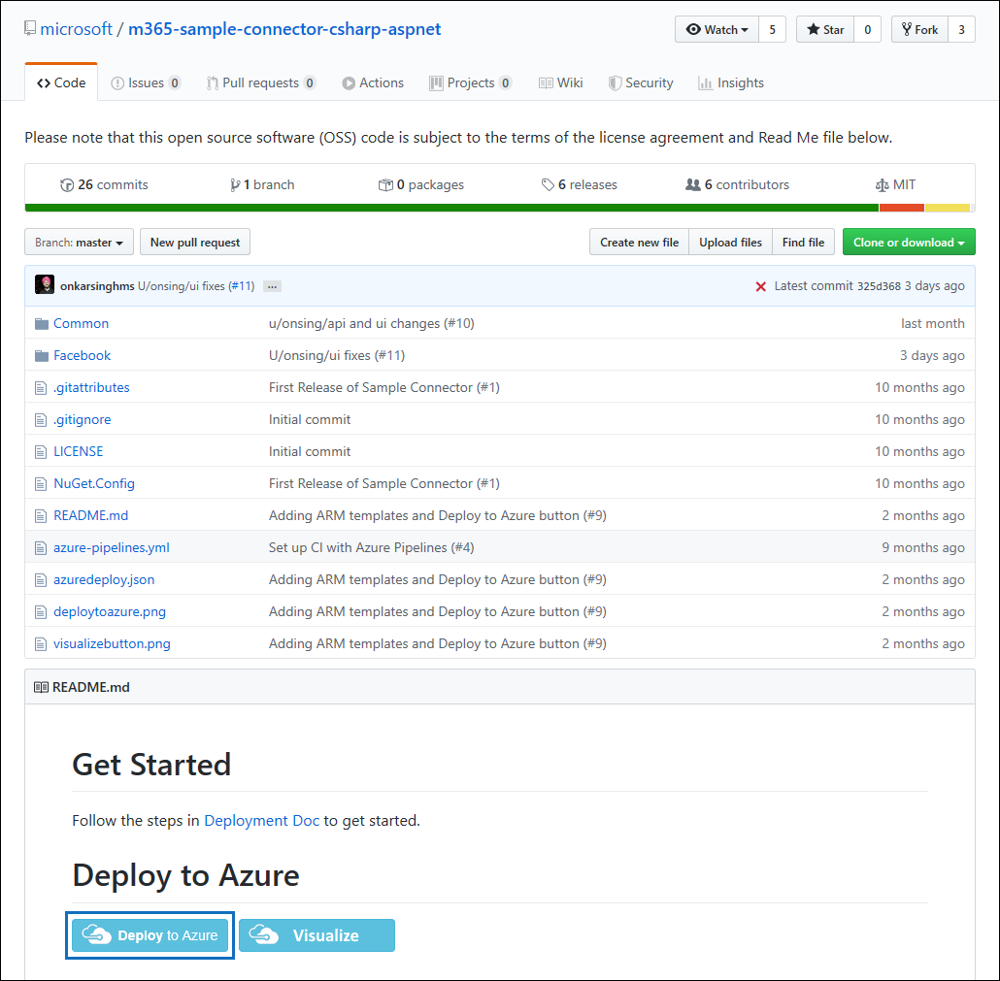
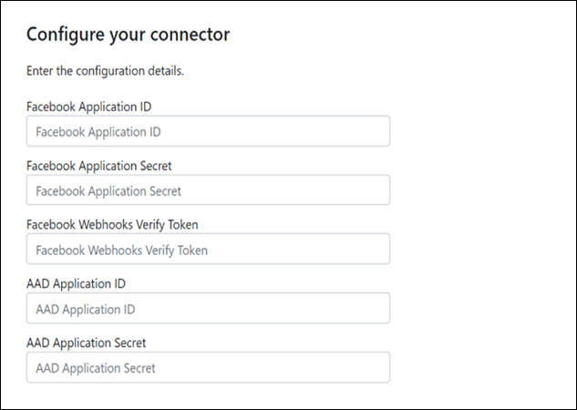
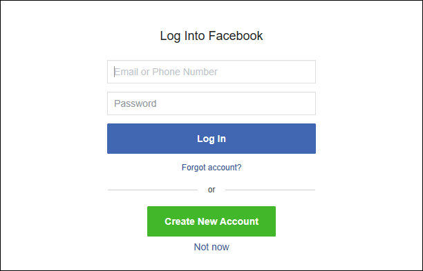

# Bereitstellen eines Connectors zum Archivieren von Facebook-Geschäfts Seiten Daten

Dieser Artikel enthält den schrittweisen Prozess zur Bereitstellungeines Connectors, der den Office 365-Import Dienst verwendet, um Daten von Facebook-Geschäfts Seiten nach Microsoft 365 zu importieren. Eine allgemeine Übersicht über diesen Prozess und eine Liste der Voraussetzungen, die für die Bereitstellungeines Facebook-Konnektors erforderlich sind, finden Sie unter [Einrichten eines Connectors zum Archivieren von Facebook-Daten](archive-facebook-data-with-sample-connector.md).

## Schritt 1: Erstellen einer APP in Azure Active Directory

1. Wechseln Sie zu, <https://portal.azure.com> und melden Sie sich mit den Anmeldeinformationen eines globalen Administratorkontos an.

    

2. Klicken Sie im linken Navigationsbereich auf **Azure Active Directory**.

    

3. Klicken Sie im linken Navigationsbereich auf **App-Registrierungen (Vorschau)** , und klicken Sie dann auf **neue Registrierung**.

    

4. Registrieren Sie die Anwendung. Wählen Sie unter Umleitungs-URI die Option Webin der Dropdownliste Anwendungstyp aus, und geben Sie dann <https://portal.azure.com> in das Feld für den URI ein.

   

5. Kopieren Sie die Anwendungs-ID **(Client) ID** und **Verzeichnis (Mandanten)** , und speichern Sie Sie in einer Textdatei oder an einem anderen sicheren Ort. Sie verwenden diese IDs in späteren Schritten.

   

6. Wechseln Sie zu **Zertifikaten & Geheimnisse für die neue APP.**

   

7. Klicken Sie auf **neuer geheimer Client Schlüssel**

   

8. Erstellen Sie einen neuen geheimen Schlüssel. Geben Sie im Feld Beschreibung den geheimen Schlüssel ein, und wählen Sie dann einen Ablaufzeitraum aus.

    

9. Kopieren Sie den Wert des geheimen Schlüssels, und speichern Sie ihn in einer Textdatei oder an einem anderen Speicherort. Dies ist der geheime Aad-Anwendungsschlüssel, den Sie in späteren Schritten verwenden.

   

## Schritt 2: Bereitstellen des Connector-Webdiensts von GitHub in Ihrem Azure-Konto

1. Wechseln Sie zu [dieser GitHub-Website](https://github.com/microsoft/m365-sample-connector-csharp-aspnet) , und klicken Sie auf **in Azure bereitstellen**.

    

2. Nachdem Sie auf **in Azure bereitstellen**klicken, werden Sie zu einem Azure-Portal mit einer benutzerdefinierten Vorlagenseite umgeleitet. Füllen Sie die Details **Grundlagen** und **Einstellungen** aus, und klicken Sie dann auf **kaufen**.

   - **Abonnement:** Wählen Sie Ihr Azure-Abonnement aus, für das Sie den Facebook Business Pages-Connector-Webdienst bereitstellen möchten.

   - **Ressourcengruppe:** Wählen oder erstellen Sie eine neue Ressourcengruppe. Eine Ressourcengruppe ist ein Container, der verwandte Ressourcen für eine Azure-Lösung bereit hält.

   - **Speicherort:** Wählen Sie einen Speicherort aus.

   - **Name der Webanwendung:** Geben Sie einen eindeutigen Namen für die Connector-Webanwendung an. Th Name muss zwischen 3 und 18 Zeichen lang sein. Dieser Name wird zum Erstellen der Azure-App-Dienst-URL verwendet. Wenn Sie beispielsweise den Namen der Webanwendung von **FBconnector** angeben, wird die Azure-App-Dienst-URL **FBconnector.azurewebsites.net**.

   - **Mandanten** -Nr: Die Mandanten-ID Ihrer Microsoft 365-Organisation, die Sie nach dem Erstellen der Facebook-Connector-app in Azure Active Directory in Schritt 1 kopiert haben.

   - **APISecretKey:** Sie können einen beliebigen Wert als geheimen Schlüssel eingeben. Dies wird verwendet, um in Schritt 5 auf die Connector-Webanwendung zuzugreifen.

     

3. Nachdem die Bereitstellung erfolgreich war, sieht die Seite ähnlich wie der folgende Screenshot aus:

   

## Schritt 3: Registrieren der Facebook-App

1. Wechseln <https://developers.facebook.com> Sie zu, melden Sie sich mit den Anmeldeinformationen für das Konto für die Facebook-Geschäfts Seiten Ihrer Organisation an, und klicken Sie dann auf **neue APP hinzufügen**.

   

2. Erstellen Sie eine neue APP-ID.

   

3. Klicken Sie im linken Navigationsbereich auf **Produkte hinzufügen** , und klicken Sie dann auf der **Facebook-Anmelde** Kachel auf **Einrichten** .

   

4. Klicken Sie auf der Seite Facebook-Anmeldung einbinden auf **Website**.

   

5. Hinzufügen der Azure-App-Dienst-URL zum Beispiel `https://fbconnector.azurewebsites.net` .

   

6. Schließen Sie den Abschnitt Quick Start im Facebook-Anmelde Setup ab.

   

7. Klicken Sie im linken Navigationsbereich unter **Facebook-Anmeldung**auf **Einstellungen**, und fügen Sie den OAuth-Umleitungs-URI im Feld **gültige OAuth-Umleitungs-URIs** hinzu. Verwenden Sie das Format ** \<connectorserviceuri> /views/FacebookOAuth**, wobei der Wert für connectorserviceuri die Azure-App-Dienst-URL für Ihre Organisation ist, beispielsweise `https://fbconnector.azurewebsites.net` .

   

8. Klicken Sie im linken Navigationsbereich auf **Produkte hinzufügen** , und klicken Sie dann auf **webhooks.** Klicken Sie im Pulldown-Menü **Seite** auf **Seite**.

   

9. Fügen Sie die webhooks-Rückruf-URL hinzu, und fügen Sie ein Verify-Token hinzu. Das Format der Rückruf-URL, verwenden Sie das Format ** <connectorserviceuri> /API/FbPageWebhook**, wobei der Wert für connectorserviceuri die Azure-App-Dienst-URL für Ihre Organisation ist, zum Beispiel `https://fbconnector.azurewebsites.net` .

   Das Verify-Token sollte einem starken Kennwort ähneln. Kopieren Sie das Verify-Token in eine Textdatei oder einen anderen Speicherort.

   

10. Testen und Abonnieren des Endpunkts für Feeds.

    

11. Fügen Sie eine Datenschutz-URL, ein App-Symbol und eine geschäftliche Verwendung hinzu. Kopieren Sie außerdem die APP-ID und den App-Schlüssel in eine Textdatei oder einen anderen Speicherort.

    

12. Machen Sie die APP öffentlich.

    

13. Fügen Sie der Administrator-oder Tester-Rolle einen Benutzer hinzu.

    

14. Fügen Sie die **Seite öffentliche Inhalts Zugriffs** Berechtigung hinzu.

    

15. Berechtigung zum Hinzufügen von Seiten verwalten.

    

16. Holen Sie sich die Anwendung von Facebook überprüft.

    

## Schritt 4: Konfigurieren der Connector-Webanwendung

1. Wechseln `https://<AzureAppResourceName>.azurewebsites.net` Sie zu (wobei AzureAppResourceName der Name Ihrer Azure-App-Ressource ist, die Sie in Schritt 4 benannt haben). Wenn der Name beispielsweise **FBconnector**lautet, wechseln Sie zu `https://fbconnector.azurewebsites.net` . Die Startseite der APP sieht wie im folgenden Screenshot aus:

   

2. Klicken Sie auf **Konfigurieren** , um eine Anmeldeseite anzuzeigen.

   

3. Geben Sie in das Feld Mandanten-ID die Mandanten-ID ein, die Sie in Schritt 2 erhalten haben, oder fügen Sie Sie ein. Geben Sie in das Feld Kennwort den APISecretKey (den Sie in Schritt 2 erhalten haben) ein, oder fügen Sie ihn ein, und klicken Sie dann auf **Konfigurationseinstellungen festlegen** , um die Seite Konfigurationsdetails anzuzeigen.

    

4. Geben Sie die folgenden Konfigurationseinstellungen ein:

   - **Facebook-Anwendungs-ID:** Die APP-ID für die Facebook-Anwendung, die Sie in Schritt 3 erhalten haben.

   - **Geheime Facebook-Anwendung:** Der APP-Schlüssel für die Facebook-Anwendung, die Sie in Schritt 3 erhalten haben.

   - **Facebook webhooks überprüfen Token:** Das Überprüfen-Token, das Sie in Schritt 3 erstellt haben.

   - **Aad-Anwendungs-ID:** Die Anwendungs-ID für die Azure Active Directory-APP, die Sie in Schritt 1 erstellt haben.

   - **Aad-Anwendungsschlüssel:** Der Wert für den geheimen APISecretKey, den Sie in Schritt 1 erstellt haben.

5. Klicken Sie auf **Speichern** , um die Verbindungseinstellungen zu speichern.

## Schritt 5: Einrichten eines Facebook-Connectors im Microsoft 365 Compliance Center

1. Wechseln Sie zu, [https://compliance.microsoft.com](https://compliance.microsoft.com) und klicken Sie dann im linken Navigationsbereich auf **Datenverbindungen** .

2. Klicken Sie auf der Seite **Daten Konnektoren (Vorschau)** unter **Facebook Business Pages**auf **Ansicht**.

3. Klicken Sie auf der Seite **Facebook-Geschäfts Seiten** auf **Connector hinzufügen**.

4. Klicken Sie auf der Seite **Nutzungsbedingungen** auf **annehmen**.

5. Geben Sie auf der Seite **Anmeldeinformationen für ihre Connector-app hinzufügen** die folgenden Informationen ein, und klicken Sie dann auf **Verbindung überprüfen**.

   

   - Geben Sie im Feld **Name** einen Namen für den Connector ein, beispielsweise **Facebook-Nachrichtenseite**.

   - Geben Sie im Feld **Verbindungs-URL** die Azure-App-Dienst-URL ein, oder fügen Sie Sie ein. zum Beispiel `https://fbconnector.azurewebsites.net` .

   - Geben Sie in das Feld **Kennwort** den Wert des APISecretKey ein, den Sie in Schritt 2 hinzugefügt haben, oder fügen Sie ihn ein.

   - Geben Sie in das Feld **Azure-APP-ID** den Wert der Anwendungs-ID Application (Client) ein, die auch als Aad-Anwendungs-ID bezeichnet wird, die Sie in Schritt 1 erstellt haben, oder fügen Sie ihn ein.

6. Nachdem die Verbindung erfolgreich überprüft wurde, klicken Sie auf **weiter**.

7. Geben Sie auf der Seite **Microsoft 365 zum Importieren von Daten autorisieren** den APISecretKey erneut ein, oder fügen Sie ihn ein, und klicken Sie dann auf **Login-webapp**.

8. Klicken Sie auf der Seite **Facebook Connector-App konfigurieren** auf **Anmeldung bei Facebook** , und melden Sie sich mit den Anmeldeinformationen für das Konto für die Facebook-Geschäfts Seiten Ihrer Organisation an. Stellen Sie sicher, dass das Facebook-Konto, an dem Sie sich angemeldet haben, der Administratorrolle für die Facebook-Geschäfts Seiten Ihrer Organisation zugewiesen ist.

   

9. Eine Liste der Geschäfts Seiten, die von dem Facebook-Konto verwaltet werden, in dem Sie sich angemeldet haben, wird angezeigt. Wählen Sie die zu archivierende Seite aus, und klicken Sie dann auf **weiter**.

   

10. Klicken Sie auf **weiter** , um das Setup der Connector-Dienst-APP zu beenden.

11. Auf der Seite **Filter festlegen** können Sie einen Filter anwenden, um Elemente anfänglich zu importieren, die ein bestimmtes Alter aufweisen. Wählen Sie ein Alter aus, und klicken Sie dann auf **weiter**.

12. Geben Sie auf der Seite Speicherort **auswählen** die e-Mail-Adresse des Microsoft 365-Postfachs ein, in das die Facebook-Elemente importiert werden sollen, und klicken Sie dann auf **weiter**.

13. Klicken Sie im die **Zustimmung des Administrators bereit**stellen auf **Zustimmung erteilen** , und führen Sie dann die Schritte aus. Sie müssen ein globaler Administrator sein, um die Zustimmung des Office 365-Import Diensts für den Zugriff auf Daten in Ihrer Organisation zu geben.

14. Klicken Sie auf **weiter** , um die Connectoreinstellungen zu überprüfen, und klicken Sie dann auf **Fertig stellen** , um das Connector-Setup abzuschließen.

15. Wechseln Sie im Compliance Center zur Seite **Daten Konnektoren** , und klicken Sie auf die Registerkarte **Connectors** , um den Status des Importvorgangs anzuzeigen.
