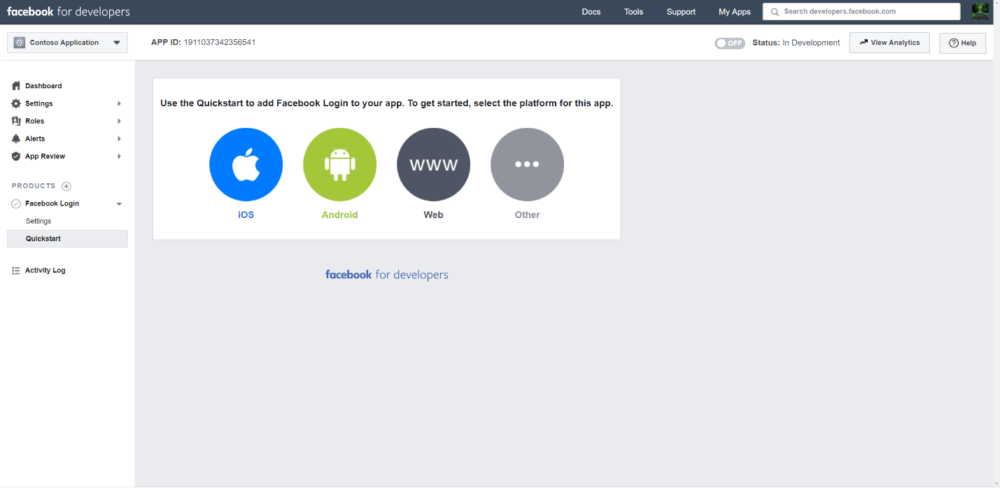

# Bereitstellen eines Connectors zum Archivieren von Daten von Facebook Business-SeitenDeploy a connector to archive Facebook Business pages data

Dieser Artikel enthält den schrittweisen Prozess zum Bereitstellen eines Connectors, der den Office 365 Import-Dienst zum Importieren von Daten von Facebook Business-Seiten in Microsoft 365.This article contains the step-by-step process to deploy a connector that uses the Office 365 Import service to import data from Facebook Business pages to Microsoft 365. Eine übersicht über diesen Prozess und eine Liste der erforderlichen Voraussetzungen für die Bereitstellung eines Facebook-Connectors finden Sie unter Einrichten eines Connectors zum Archivieren von [Facebook-Daten.](archive-facebook-data-with-sample-connector.md)For a high-level overview of this process and a list of prerequisites required to deploy a Facebook connector, see [Set up a connector to archive Facebook data](archive-facebook-data-with-sample-connector.md).

## Schritt 1: Erstellen einer App in Azure Active DirectoryStep 1: Create an app in Azure Active Directory

1. Wechseln Sie zu, und melden Sie <https://portal.azure.com> sich mit den Anmeldeinformationen eines globalen Administratorkontos an.Go to <https://portal.azure.com> and sign in using the credentials of a global admin account.

    

2. Klicken Sie im linken Navigationsbereich auf **Azure Active Directory**.In the left navigation pane, click **Azure Active Directory**.

    

3. Klicken Sie im linken Navigationsbereich auf **App-Registrierungen (Vorschau)** und dann **auf Neue Registrierung**.In the left navigation pane, click **App registrations (Preview)** and then click **New registration**.

    

4. Registrieren Sie die Anwendung.Register the application. Wählen Sie unter Umleitungs-URI die Option Web in der Dropdownliste anwendungstyp aus, und geben Sie dann in das Feld <https://portal.azure.com> für den URI ein.Under Redirect URI, select Web in the application type dropdown list and then type <https://portal.azure.com> in the box for the URI.

   

5. Kopieren Sie **die Anwendungs-ID (Client-)ID** und die **Verzeichnis-ID (Mandant),** und speichern Sie sie in einer Textdatei oder an einem anderen sicheren Speicherort.Copy the **Application (client) ID** and **Directory (tenant) ID** and save them to a text file or other safe location. Sie verwenden diese IDs in späteren Schritten.You use these IDs in later steps.

   

6. Wechseln Sie **zu Zertifikate & für die neue App.**Go to **Certificates & secrets for the new app.**

   

7. Klicken Sie **auf Neuer Geheimer Clientgeheimnis**Click **New client secret**

   

8. Erstellen Sie einen neuen geheimen Schlüssel.Create a new secret. Geben Sie in das Feld Beschreibung den geheimen Schlüssel ein, und wählen Sie dann einen Ablaufzeitraum aus.In the description box, type the secret and then choose an expiration period.

    

9. Kopieren Sie den Wert des geheimen Schlüssels, und speichern Sie ihn in einer Textdatei oder einem anderen Speicherort.Copy the value of the secret and save it to a text file or other storage location. Dies ist der geheime AAD-Anwendungsgeheimnis, den Sie in späteren Schritten verwenden.This is the AAD application secret that you use in later steps.

   

## Schritt 2: Bereitstellen des Connectorwebdiensts GitHub Ihrem Azure-KontoStep 2: Deploy the connector web service from GitHub to your Azure account

1. Wechseln Sie [zu GitHub Website,](https://github.com/microsoft/m365-sample-connector-csharp-aspnet) und klicken Sie **auf Bereitstellen in Azure**.Go to [this GitHub site](https://github.com/microsoft/m365-sample-connector-csharp-aspnet) and click **Deploy to Azure**.

    

2. Nachdem Sie auf **Bereitstellen in Azure** geklickt haben, werden Sie zu einem Azure-Portal mit einer benutzerdefinierten Vorlagenseite umgeleitet.After you click **Deploy to Azure**, you will be redirected to an Azure portal with a custom template page. Füllen Sie die **Grundlagen und** **Einstellungen** aus, und klicken Sie dann auf **Kaufen**.Fill in the **Basics** and **Settings** details and then click **Purchase**.

   - **Abonnement:** Wählen Sie Ihr Azure-Abonnement aus, für das Sie den Connectorwebdienst für Facebook Business-Seiten bereitstellen möchten.**Subscription:** Select your Azure subscription that you want to deploy the Facebook Business pages connector web service to.

   - **Ressourcengruppe:** Wählen oder erstellen Sie eine neue Ressourcengruppe.**Resource group:** Choose or create a new resource group. Eine Ressourcengruppe ist ein Container, der verwandte Ressourcen für eine Azure-Lösung enthält.A resource group is a container that holds related resources for an Azure solution.

   - **Speicherort:** Wählen Sie einen Speicherort aus.**Location:** Choose a location.

   - **Web-App-Name:** Geben Sie einen eindeutigen Namen für die Connector-Web-App an.**Web App Name:** Provide a unique name for the connector web app. Der Name Th muss zwischen 3 und 18 Zeichen lang sein.Th name must be between 3 and 18 characters in length. Dieser Name wird zum Erstellen der Azure-App-Dienst-URL verwendet. Wenn Sie z. B. den Web-App-Namen **fbconnector** angeben, wird die Azure-App-Dienst-URL **fbconnector.azurewebsites.net.**This name is used to create the Azure app service URL; for example, if you provide the Web app name of **fbconnector** then the Azure app service URL  will be **fbconnector.azurewebsites.net**.

   - **tenantId:** Die Mandanten-ID Ihrer Microsoft 365, die Sie nach dem Erstellen der Facebook-Connector-App in Azure Active Directory Schritt 1 kopiert haben.**tenantId:** The tenant ID of your Microsoft 365 organization that you copied after creating the Facebook connector app in Azure Active Directory in Step 1.

   - **APISecretKey:** Sie können einen beliebigen Wert als geheimen Wert eingeben.**APISecretKey:** You can type any value as the secret. Dies wird für den Zugriff auf die Connectorweb-App in Schritt 5 verwendet.This is used to access the connector web app in Step 5.

     

3. Nachdem die Bereitstellung erfolgreich war, sieht die Seite ähnlich dem folgenden Screenshot aus:After the deployment is successful, the page will look similar to the following screenshot:

   

## Schritt 3: Registrieren der Facebook-AppStep 3: Register the Facebook app

1. Wechseln Sie zu , melden Sie sich mit den Anmeldeinformationen für das Konto für die Facebook Business-Seiten Ihrer Organisation an, und klicken Sie dann <https://developers.facebook.com> **auf Neue App hinzufügen.**Go to <https://developers.facebook.com>, log in using the credentials for the account for your organization's Facebook Business pages, and then click **Add New App**.

   

2. Erstellen Sie eine neue App-ID.Create a new app ID.

   

3. Klicken Sie im linken Navigationsbereich auf **Produkte hinzufügen,** und klicken Sie dann **in** der Kachel **Facebook-Anmeldung** auf Einrichten.In the left navigation pane, click **Add Products** and then click **Set Up** in the **Facebook Login** tile.

   

4. Klicken Sie auf der Seite Facebook-Anmeldung integrieren auf **Web**.On the Integrate Facebook Login page, click **Web**.

   

5. Fügen Sie die Azure-App-Dienst-URL hinzu. beispiel: `https://fbconnector.azurewebsites.net` .Add the Azure app service URL; for example `https://fbconnector.azurewebsites.net`.

   

6. Schließen Sie den Abschnitt Schnellstart des Setups für die Facebook-Anmeldung ab.Complete the QuickStart section of the Facebook Login setup.

   

7. Klicken Sie im linken Navigationsbereich unter **Facebook-Anmeldung** **auf Einstellungen**, und fügen Sie den OAuth-Umleitungs-URI im Feld Gültige **OAuth-Umleitungs-URIs** hinzu.In the left navigation pane under **Facebook Login**, click **Settings**, and add the OAuth redirect URI in the **Valid OAuth Redirect URIs** box. Verwenden Sie das **\<connectorserviceuri> Format /Views/FacebookOAuth**, wobei der Wert für connectorserviceuri die Azure-App-Dienst-URL für Ihre Organisation ist, z. B. `https://fbconnector.azurewebsites.net` .Use the format **\<connectorserviceuri>/Views/FacebookOAuth**, where the value for connectorserviceuri is the Azure app service URL for your organization; for example, `https://fbconnector.azurewebsites.net`.

   

8. Klicken Sie im linken Navigationsbereich auf **Produkte hinzufügen,** und klicken Sie dann auf **Webhooks.**In the left navigation pane, click **Add Products** and then click **Webhooks.** Klicken Sie **im** Pull-Down-Menü Seite auf **Seite**.In the **Page** pull-down menu, click **Page**.

   

9. Fügen Sie die Webhooks-Rückruf-URL hinzu, und fügen Sie ein Überprüfungstoken hinzu.Add Webhooks Callback URL and add a verify token. Verwenden Sie im Format der Rückruf-URL das Format **<connectorserviceuri> /api/FbPageWebhook**, wobei der Wert für connectorserviceuri die Azure-App-Dienst-URL für Ihre Organisation ist, z. B. `https://fbconnector.azurewebsites.net` .The format of the callback URL, use the format **<connectorserviceuri>/api/FbPageWebhook**, where the value for connectorserviceuri is the Azure app service URL for your organization; for example `https://fbconnector.azurewebsites.net`.

   Das Überprüfungstoken sollte einem starken Kennwort ähnlich sein.The verify token should similar to a strong password. Kopieren Sie das Überprüfungstoken in eine Textdatei oder einen anderen Speicherort.Copy the verify token to a text file or other storage location.

   

10. Testen und abonnieren Sie den Endpunkt für feed.Test and subscribe to the endpoint for feed.

    

11. Fügen Sie eine Datenschutz-URL, ein App-Symbol und eine Unternehmensnutzung hinzu.Add a privacy URL, app icon, and business use. Kopieren Sie außerdem die App-ID und den geheimen App-Schlüssel in eine Textdatei oder einen anderen Speicherort.Also, copy the app ID and app secret to a text file or other storage location.

    

12. Machen Sie die App öffentlich.Make the app public.

    

13. Hinzufügen eines Benutzers zur Rolle "Administrator" oder "Tester".Add user to the admin or tester role.

    

14. Fügen Sie die **Berechtigung Page Public Content Access** hinzu.Add the **Page Public Content Access** permission.

    

15. Hinzufügen der Berechtigung Seiten verwalten.Add Manage Pages permission.

    

16. Die Anwendung wird von Facebook überprüft.Get the application reviewed by Facebook.

    

## Schritt 4: Konfigurieren der Connectorweb-AppStep 4: Configure the connector web app

1. Wechseln Sie `https://<AzureAppResourceName>.azurewebsites.net` zu (wobei AzureAppResourceName der Name Ihrer Azure-App-Ressource ist, die Sie in Schritt 4 benannt haben).Go to `https://<AzureAppResourceName>.azurewebsites.net` (where AzureAppResourceName is the name of your Azure app resource that you named in Step 4). Wenn der Name beispielsweise **fbconnector ist,** wechseln Sie zu `https://fbconnector.azurewebsites.net` .For example, if the name is **fbconnector**, go to `https://fbconnector.azurewebsites.net`. Die Startseite der App sieht wie der folgende Screenshot aus:The home page of the app will look like the following screenshot:

   

2. Klicken **Sie auf Konfigurieren,** um eine Anmeldeseite anzeigen zu können.Click **Configure** to display a sign in page.

   

3. Geben Sie im Feld Mandanten-ID Ihre Mandanten-ID ein oder fügen Sie sie ein (die Sie in Schritt 2 erhalten haben).In the Tenant Id box, type or paste your tenant Id (that you obtained in Step 2). Geben Sie im Feld Kennwort den APISecretKey (den Sie in Schritt 2 erhalten haben) ein, oder fügen Sie ihn ein, und klicken Sie dann auf Konfigurationseinstellungen **festlegen Einstellungen,** um die Seite konfigurationsdetails anzuzeigen.In the password box, type or paste the APISecretKey (that you obtained in Step 2), and then click **Set Configuration Settings** to display the configuration details page.

    

4. Geben Sie die folgenden Konfigurationseinstellungen einEnter the following configuration settings

   - **Facebook-Anwendungs-ID:** Die App-ID für die Facebook-Anwendung, die Sie in Schritt 3 erhalten haben.**Facebook application ID:** The app ID for the Facebook application that you obtained in Step 3.

   - **Geheimer Facebook-Anwendungsgeheimnis:** Der geheime App-Schlüssel für die Facebook-Anwendung, die Sie in Schritt 3 erhalten haben.**Facebook application secret:** The app secret for the Facebook application that you obtained in Step 3.

   - **Facebook-Webhooks überprüfen Token:** Das in Schritt 3 erstellte Überprüfungstoken.**Facebook webhooks verify token:** The verify token that you created in Step 3.

   - **AAD-Anwendungs-ID:** Die Anwendungs-ID für Azure Active Directory App, die Sie in Schritt 1 erstellt haben.**AAD application ID:** The application ID for the Azure Active Directory app that you created in Step 1.

   - **Geheimer AAD-Anwendungsgeheimnis:** Der Wert für den geheimen APISecretKey-Schlüssel, den Sie in Schritt 1 erstellt haben.**AAD application secret:** The value for the APISecretKey secret that you created in Step 1.

5. Klicken Sie **auf Speichern,** um die Connectoreinstellungen zu speichern.Click **Save** to save the connector settings.

## Schritt 5: Einrichten eines Facebook-Connectors im Microsoft 365 Compliance CenterStep 5: Set up a Facebook connector in the Microsoft 365 compliance center

1. Wechseln Sie [https://compliance.microsoft.com](https://compliance.microsoft.com) zu,  und klicken Sie dann im linken Navigations navi auf Datenconnectors.Go to [https://compliance.microsoft.com](https://compliance.microsoft.com) and then click **Data connectors** in the left nav.

2. Klicken Sie **auf der Seite** Datenconnectors unter Facebook **Business-Seiten** auf **Anzeigen**.On the **Data connectors** page under **Facebook Business pages**, click **View**.

3. Klicken Sie **auf der Seite Facebook-Geschäftsseiten** auf **Connector hinzufügen.**On the **Facebook business pages** page, click **Add connector**.

4. Klicken Sie **auf der Seite Nutzungsbedingungen** auf **Akzeptieren**.On the **Terms of service** page, click **Accept**.

5. Geben Sie **auf der Seite Anmeldeinformationen für Ihre Connector-App** hinzufügen die folgenden Informationen ein, und klicken Sie dann **auf Verbindung überprüfen.**On the **Add credentials for your connector app** page, enter the following information and then click **Validate connection**.

   

   - Geben Sie **im Feld Name** einen Namen für den Connector ein, z. B. facebook news **page**.In the **Name** box, type a name for the connector, such as **Facebook news page**.

   - Geben Sie **im Feld Verbindungs-URL** die Azure-App-Dienst-URL ein oder fügen Sie sie ein. beispiel: `https://fbconnector.azurewebsites.net` .In the **Connection URL** box, type or paste the Azure app service URL; for example `https://fbconnector.azurewebsites.net`.

   - Geben Sie **im Feld Kennwort** den Wert des APISecretKey ein, den Sie in Schritt 2 hinzugefügt haben, oder fügen Sie ihn ein.In the **Password** box, type or paste the value of the APISecretKey that you added in Step 2.

   - Geben Sie **im Feld Azure App ID** den Wert der Anwendungs-ID (Client-ID) ein, die auch als AAD-Anwendungs-ID bezeichnet wird, die Sie in Schritt 1 erstellt haben.In the **Azure App ID** box, type or paste the value of the Application (client) ID also called as AAD Application ID that you created in Step 1.

6. Nachdem die Verbindung erfolgreich überprüft wurde, klicken Sie auf **Weiter**.After the connection is successfully validated, click **Next**.

7. Geben Sie **auf Microsoft 365 Seite** Zum Importieren von Daten autorisieren den APISecretKey erneut ein, oder fügen Sie ihn ein, und klicken Sie dann auf **Anmeldeweb-App**.On the **Authorize Microsoft 365 to import data** page, type or paste the APISecretKey again and then click **Login web app**.

8. Klicken Sie auf der Seite **Facebook-Connector-App** konfigurieren auf Anmelden bei **Facebook,** und melden Sie sich mit den Anmeldeinformationen für das Konto für die Facebook Business-Seiten Ihrer Organisation an.On the **Configure Facebook connector app** page, click **Login with Facebook** and log in using the credentials for the account for your organization's Facebook Business pages. Stellen Sie sicher, dass dem Facebook-Konto, bei dem Sie sich angemeldet haben, die Administratorrolle für die Facebook Business-Seiten Ihrer Organisation zugewiesen ist.Make sure the Facebook account that you logged in to is assigned the admin role for your organization's Facebook Business pages.

   

9. Eine Liste der Geschäftsseiten, die von dem Facebook-Konto verwaltet werden, bei dem Sie sich angemeldet haben, wird angezeigt.A list of the business pages managed by the Facebook account that you logged in to is displayed. Wählen Sie die zu archivierende Seite aus, und klicken Sie dann auf **Weiter**.Select the page to archive and then click **Next**.

   

10. Klicken **Sie auf Weiter,** um das Setup der Connectordienst-App zu beenden.Click **Continue** to exit the setup of the connector service app.

11. Auf der **Seite Filter festlegen** können Sie einen Filter anwenden, um elemente zu importieren, die ein bestimmtes Alter haben.On the **Set filters** page, you can apply a filter to initially import items that are a certain age. Wählen Sie ein Alter aus, und klicken Sie dann auf **Weiter**.Select an age, and then click **Next**.

12. Geben Sie **auf der** Seite Speicherort auswählen die E-Mail-Adresse des Microsoft 365 ein, in das die Facebook-Elemente importiert werden sollen, und klicken Sie dann auf **Weiter**.On the **Choose storage location** page, type the email address of Microsoft 365 mailbox that the Facebook items will be imported to, and then click **Next**.

13. Klicken **Sie auf Weiter,** um die Connectoreinstellungen zu überprüfen, und klicken Sie dann auf **Fertig** stellen, um die Connectoreinrichtung abzuschließen.Click **Next** to review the connector settings and then click **Finish** to complete the connector setup.

14. Wechseln Sie im Compliance  Center zur Seite Datenconnectors, und klicken Sie auf die Registerkarte **Connectors,** um den Fortschritt des Importvorgangs zu sehen.In the compliance center, go to the **Data connectors** page, and click the **Connectors** tab to see the progress of the import process.
