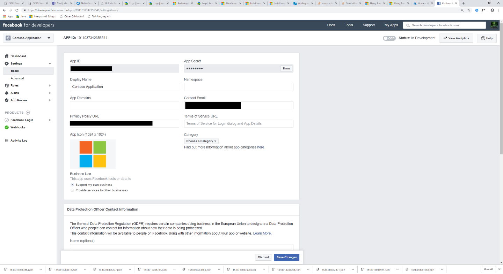

# Bereitstellen eines Connectors zum Archivieren von Facebook-Geschäfts Seiten DatenDeploy a connector to archive Facebook Business pages data

Dieser Artikel enthält den schrittweisen Prozess zur Bereitstellungeines Connectors, der den Microsoft 365-Import Dienst verwendet, um Daten von Facebook-Geschäfts Seiten nach Microsoft 365 zu importieren.This article contains the step-by-step process to deploy a connector that uses the Microsoft 365 Import service to import data from Facebook Business pages to Microsoft 365. Eine allgemeine Übersicht über diesen Prozess und eine Liste der Voraussetzungen, die für die Bereitstellungeines Facebook-Konnektors erforderlich sind, finden Sie unter [Einrichten eines Connectors zum Archivieren von Facebook-Daten](archive-facebook-data-with-sample-connector.md).For a high-level overview of this process and a list of prerequisites required to deploy a Facebook connector, see [Set up a connector to archive Facebook data](archive-facebook-data-with-sample-connector.md). 

## Schritt 1: Erstellen einer APP in Azure Active DirectoryStep 1: Create an app in Azure Active Directory

1. Wechseln Sie <https://portal.azure.com> zu, und melden Sie sich mit den Anmeldeinformationen eines Office 365 globalen Administratorkontos an.Go to <https://portal.azure.com> and sign in using the credentials of an Office 365 global admin account.

    

2. Klicken Sie im linken Navigationsbereich auf **Azure Active Directory**.In the left navigation pane, click **Azure Active Directory**.

    

3. Klicken Sie im linken Navigationsbereich auf **App-Registrierungen (Vorschau)** , und klicken Sie dann auf **neue Registrierung**.In the left navigation pane, click **App registrations (Preview)** and then click **New registration**.

    

4. Registrieren Sie die Anwendung.Register the application. Wählen Sie unter Umleitungs-URI die Option Webin der Dropdownliste <https://portal.azure.com> Anwendungstyp aus, und geben Sie dann in das Feld für den URI ein.Under Redirect URI, select Web in the application type dropdown list and then type <https://portal.azure.com> in the box for the URI.

   

5. Kopieren Sie die Anwendungs-ID **(Client) ID** und **Verzeichnis (Mandanten)** , und speichern Sie Sie in einer Textdatei oder an einem anderen sicheren Ort.Copy the **Application (client) ID** and **Directory (tenant) ID** and save them to a text file or other safe location. Sie verwenden diese IDs in späteren Schritten.You use these IDs in later steps.

   

6. Wechseln Sie zu **Zertifikaten & Geheimnisse für die neue APP.**Go to **Certificates & secrets for the new app.**

   

7. Klicken Sie auf **neuer geheimer Client Schlüssel**Click **New client secret**

   

8. Erstellen Sie einen neuen geheimen Schlüssel.Create a new secret. Geben Sie im Feld Beschreibung den geheimen Schlüssel ein, und wählen Sie dann einen Ablaufzeitraum aus.In the description box, type the secret and then choose an expiration period. 

    

9. Kopieren Sie den Wert des geheimen Schlüssels, und speichern Sie ihn in einer Textdatei oder an einem anderen Speicherort.Copy the value of the secret and save it to a text file or other storage location. Dies ist der geheime Aad-Anwendungsschlüssel, den Sie in späteren Schritten verwenden.This is the AAD application secret that you use in later steps.

   

## Schritt 2: Bereitstellen des Connector-Webdiensts von GitHub in Ihrem Azure-KontoStep 2: Deploy the connector web service from GitHub to your Azure account

1. Wechseln Sie zu [dieser GitHub-Website](https://github.com/microsoft/m365-sample-connector-csharp-aspnet) , und klicken Sie auf **in Azure bereitstellen**.Go to [this GitHub site](https://github.com/microsoft/m365-sample-connector-csharp-aspnet) and click **Deploy to Azure**.

    

2. Nachdem Sie auf **in Azure bereitstellen**klicken, werden Sie zu einem Azure-Portal mit einer benutzerdefinierten Vorlagenseite umgeleitet.After you click **Deploy to Azure**, you will be redirected to an Azure portal with a custom template page. Füllen Sie die Details **Grundlagen** und **Einstellungen** aus, und klicken Sie dann auf **kaufen**.Fill in the **Basics** and **Settings** details and then click **Purchase**.

    - **Abonnement:** Wählen Sie Ihr Azure-Abonnement aus, für das Sie den Facebook Business Pages-Connector-Webdienst bereitstellen möchten.**Subscription:** Select your Azure subscription that you want to deploy the Facebook Business pages connector web service to.
    
    - **Ressourcengruppe:** Wählen oder erstellen Sie eine neue Ressourcengruppe.**Resource group:** Choose or create a new resource group. Eine Ressourcengruppe ist ein Container, der verwandte Ressourcen für eine Azure-Lösung bereit hält.A resource group is a container that holds related resources for an Azure solution.

    - **Speicherort:** Wählen Sie einen Speicherort aus.**Location:** Choose a location.

    - **Name der Webanwendung:** Geben Sie einen eindeutigen Namen für die Connector-Webanwendung an.**Web App Name:** Provide a unique name for the connector web app. Th Name muss zwischen 3 und 18 Zeichen lang sein.Th name must be between 3 and 18 characters in length. Dieser Name wird zum Erstellen der Azure-App-Dienst-URL verwendet. Wenn Sie beispielsweise den Namen der Webanwendung von **FBconnector** angeben, wird die Azure-App-Dienst-URL **FBconnector.azurewebsites.net**.This name is used to create the Azure app service URL; for example, if you provide the Web app name of **fbconnector** then the Azure app service URL  will be **fbconnector.azurewebsites.net**.
    
    - **Mandanten** -Nr: Die Mandanten-ID Ihrer Microsoft 365-Organisation, die Sie nach dem Erstellen der Facebook-Connector-app in Azure Active Directory in Schritt 1 kopiert haben.**tenantId:** The tenant ID of your Microsoft 365 organization that you copied after creating the Facebook connector app in Azure Active Directory in Step 1.
    
   - **APISecretKey:** Sie können einen beliebigen Wert als geheimen Schlüssel eingeben.**APISecretKey:** You can type any value as the secret. Dies wird verwendet, um in Schritt 5 auf die Connector-Webanwendung zuzugreifen.This is used to access the connector web app in Step 5.
   
     

3. Nachdem die Bereitstellung erfolgreich war, sieht die Seite ähnlich wie der folgende Screenshot aus:After the deployment is successful, the page will look similar to the following screenshot:

     

## Schritt 3: Registrieren der Facebook-AppStep 3: Register the Facebook app

1. Wechseln Sie <https://developers.facebook.com>zu, melden Sie sich mit den Anmeldeinformationen für das Konto für die Facebook-Geschäfts Seiten Ihrer Organisation an, und klicken Sie dann auf **neue APP hinzufügen**.Go to <https://developers.facebook.com>, log in using the credentials for the account for your organization’s Facebook Business pages, and then click **Add New App**.

   

2. Erstellen Sie eine neue APP-ID.Create a new app ID.

   

3. Klicken Sie im linken Navigationsbereich auf **Produkte hinzufügen** , und klicken Sie dann auf der **Facebook-Anmelde** Kachel auf **Einrichten** .In the left navigation pane, click **Add Products** and then click **Set Up** in the **Facebook Login** tile.

   

4. Klicken Sie auf der Seite Facebook-Anmeldung einbinden auf **Website**.On the Integrate Facebook Login page, click **Web**.

   

5. Hinzufügen der Azure-App-Dienst-URL zum Beispiel `https://fbconnector.azurewebsites.net`.Add the Azure app service URL; for example `https://fbconnector.azurewebsites.net`.

   

6. Schließen Sie den Abschnitt Quick Start im Facebook-Anmelde Setup ab.Complete the QuickStart section of the Facebook Login setup.

   

7. Klicken Sie im linken Navigationsbereich unter **Facebook-Anmeldung**auf **Einstellungen**, und fügen Sie den OAuth-Umleitungs-URI im Feld **gültige OAuth-Umleitungs-URIs** hinzu.In the left navigation pane under **Facebook Login**, click **Settings**, and add the OAuth redirect URI in the **Valid OAuth Redirect URIs** box. Verwenden Sie das Format \*\* \<connectorserviceuri>/views/facebookoauth\*\*, wobei der Wert für connectorserviceuri die Azure-App-Dienst-URL für Ihre Organisation ist. Beispiel: `https://fbconnector.azurewebsites.net`.Use the format **\<connectorserviceuri>/Views/FacebookOAuth**, where the value for connectorserviceuri is the Azure app service URL for your organization; for example, `https://fbconnector.azurewebsites.net`.

   

8. Klicken Sie im linken Navigationsbereich auf **Produkte hinzufügen** , und klicken Sie dann auf **webhooks.**In the left navigation pane, click **Add Products** and then click **Webhooks.** Klicken Sie im Pulldown-Menü **Seite** auf **Seite**.In the **Page** pull-down menu, click **Page**. 

   

9. Fügen Sie die webhooks-Rückruf-URL hinzu, und fügen Sie ein Verify-Token hinzu.Add Webhooks Callback URL and add a verify token. Das Format der Rückruf-URL, verwenden Sie das Format \*\* <connectorserviceuri>/API/FbPageWebhook\*\*, wobei der Wert für connectorserviceuri die Azure-App-Dienst-URL für Ihre Organisation ist. zum Beispiel `https://fbconnector.azurewebsites.net`.The format of the callback URL, use the format **<connectorserviceuri>/api/FbPageWebhook**, where the value for connectorserviceuri is the Azure app service URL for your organization; for example `https://fbconnector.azurewebsites.net`. 

    Das Verify-Token sollte einem starken Kennwort ähneln.The verify token should similar to a strong password. Kopieren Sie das Verify-Token in eine Textdatei oder einen anderen Speicherort.Copy the verify token to a text file or other storage location.

        

10. Testen und Abonnieren des Endpunkts für Feeds.Test and subscribe to the endpoint for feed.

    

11. Fügen Sie eine Datenschutz-URL, ein App-Symbol und eine geschäftliche Verwendung hinzu.Add a privacy URL, app icon, and business use. Kopieren Sie außerdem die APP-ID und den App-Schlüssel in eine Textdatei oder einen anderen Speicherort.Also, copy the app ID and app secret to a text file or other storage location.

    

12. Machen Sie die APP öffentlich.Make the app public.

    

13. Fügen Sie der Administrator-oder Tester-Rolle einen Benutzer hinzu.Add user to the admin or tester role.

    

14. Fügen Sie die **Seite öffentliche Inhalts Zugriffs** Berechtigung hinzu.Add the **Page Public Content Access** permission.

    

15. Berechtigung zum Hinzufügen von Seiten verwalten.Add Manage Pages permission.

    

16. Holen Sie sich die Anwendung von Facebook überprüft.Get the application reviewed by Facebook.

    

## Schritt 4: Konfigurieren der Connector-WebanwendungStep 4: Configure the connector web app

1. Wechseln Sie zu\<https://AzureAppResourceName>. azurewebsites.net (wobei AzureAppResourceName der Name Ihrer Azure-App-Ressource ist, die Sie in Schritt 4 benannt haben) Wenn beispielsweise der Name **FBconnector**lautet `https://fbconnector.azurewebsites.net`, wechseln Sie zu.Go to https://\<AzureAppResourceName>.azurewebsites.net (where AzureAppResourceName is the name of your Azure app resource that you named in Step 4) For example, if the name is **fbconnector**, go to `https://fbconnector.azurewebsites.net`. Die Startseite der APP sieht wie im folgenden Screenshot aus:The home page of the app will look like the following screenshot:

   

2. Klicken Sie auf **Konfigurieren** , um eine Anmeldeseite anzuzeigen.Click **Configure** to display a sign in page.
 
   

3. Geben Sie in das Feld Mandanten-ID die Mandanten-ID ein, die Sie in Schritt 2 erhalten haben, oder fügen Sie Sie ein.In the Tenant Id box, type or paste your tenant Id (that you obtained in Step 2). Geben Sie in das Feld Kennwort den APISecretKey (den Sie in Schritt 2 erhalten haben) ein, oder fügen Sie ihn ein, und klicken Sie dann auf **Konfigurationseinstellungen festlegen** , um die Seite Konfigurationsdetails anzuzeigen.In the password box, type or paste the APISecretKey (that you obtained in Step 2), and then click **Set Configuration Settings** to display the configuration details page.

    

4. Geben Sie die folgenden Konfigurationseinstellungen ein:Enter the following configuration settings 

   - **Facebook-Anwendungs-ID:** Die APP-ID für die Facebook-Anwendung, die Sie in Schritt 3 erhalten haben.**Facebook application ID:** The app ID for the Facebook application that you obtained in Step 3.
   
   - **Geheime Facebook-Anwendung:** Der APP-Schlüssel für die Facebook-Anwendung, die Sie in Schritt 3 erhalten haben.**Facebook application secret:** The app secret for the Facebook application that you obtained in Step 3.
   
   - **Facebook webhooks überprüfen Token:** Das Überprüfen-Token, das Sie in Schritt 3 erstellt haben.**Facebook webhooks verify token:** The verify token that you created in Step 3.
   
   - **Aad-Anwendungs-ID:** Die Anwendungs-ID für die Azure Active Directory-APP, die Sie in Schritt 1 erstellt haben.**AAD application ID:** The application ID for the Azure Active Directory app that you created in Step 1.
   
   - **Aad-Anwendungsschlüssel:** Der Wert für den geheimen APISecretKey, den Sie in Schritt 1 erstellt haben.**AAD application secret:** The value for the APISecretKey secret that you created in Step 1.

5. Klicken Sie auf **Speichern** , um die Verbindungseinstellungen zu speichern.Click **Save** to save the connector settings.

## Schritt 5: Einrichten eines Facebook-Connectors im Microsoft 365 Compliance CenterStep 5: Set up a Facebook connector in the Microsoft 365 compliance center

1. Wechseln Sie [https://compliance.microsoft.com](https://compliance.microsoft.com) zu, und klicken Sie dann im linken Navigationsbereich auf **Datenverbindungen** .Go to [https://compliance.microsoft.com](https://compliance.microsoft.com) and then click **Data connectors** in the left nav.

2. Klicken Sie auf der Seite **Daten Konnektoren (Vorschau)** unter **Facebook Business Pages**auf **Ansicht**.On the **Data connectors (preview)** page under **Facebook Business pages**, click **View**.

3. Klicken Sie auf der Seite **Facebook-Geschäfts Seiten** auf **Connector hinzufügen**.On the **Facebook business pages** page, click **Add connector**.

4. Klicken Sie auf der Seite **Nutzungsbedingungen** auf **annehmen**.On the **Terms of service** page, click **Accept**.

5.  Geben Sie auf der Seite **Anmeldeinformationen für ihre Connector-app hinzufügen** die folgenden Informationen ein, und klicken Sie dann auf **Verbindung überprüfen**.On the **Add credentials for your connector app** page, enter the following information and then click **Validate connection**.

    

    - Geben Sie im Feld **Name** einen Namen für den Connector ein, beispielsweise **Facebook-Nachrichtenseite**.In the **Name** box, type a name for the connector, such as **Facebook news page**.
    
    - Geben Sie im Feld **Verbindungs-URL** die Azure-App-Dienst-URL ein, oder fügen Sie Sie ein. zum Beispiel `https://fbconnector.azurewebsites.net`.In the **Connection URL** box, type or paste the Azure app service URL; for example `https://fbconnector.azurewebsites.net`.
    
    - Geben Sie in das Feld **Kennwort** den Wert des APISecretKey ein, den Sie in Schritt 2 hinzugefügt haben, oder fügen Sie ihn ein.In the **Password** box, type or paste the value of the APISecretKey that you added in Step 2.
    
    - Geben Sie in das Feld **Azure-APP-ID** den Wert der Anwendungs-ID Application (Client) ein, die auch als Aad-Anwendungs-ID bezeichnet wird, die Sie in Schritt 1 erstellt haben, oder fügen Sie ihn ein.In the **Azure App ID** box, type or paste the value of the Application (client) ID also called as AAD Application ID that you created in Step 1.
 
6. Nachdem die Verbindung erfolgreich überprüft wurde, klicken Sie auf **weiter**.After the connection is successfully validated, click **Next**.

7. Geben Sie auf der Seite **Microsoft 365 zum Importieren von Daten autorisieren** den APISecretKey erneut ein, oder fügen Sie ihn ein, und klicken Sie dann auf **Login-webapp**.On the **Authorize Microsoft 365 to import data** page, type or paste the APISecretKey again and then click **Login web app**.

8. Klicken Sie auf der Seite **Facebook Connector-App konfigurieren** auf **Anmeldung bei Facebook** , und melden Sie sich mit den Anmeldeinformationen für das Konto für die Facebook-Geschäfts Seiten Ihrer Organisation an.On the **Configure Facebook connector app** page, click **Login with Facebook** and log in using the credentials for the account for your organization's Facebook Business pages. Stellen Sie sicher, dass das Facebook-Konto, an dem Sie sich angemeldet haben, der Administratorrolle für die Facebook-Geschäfts Seiten Ihrer Organisation zugewiesen ist.Make sure the Facebook account that you logged in to is assigned the admin role for your organization's Facebook Business pages.

   

9. Eine Liste der Geschäfts Seiten, die von dem Facebook-Konto verwaltet werden, in dem Sie sich angemeldet haben, wird angezeigt.A list of the business pages managed by the Facebook account that you logged in to is displayed. Wählen Sie die zu archivierende Seite aus, und klicken Sie dann auf **weiter**.Select the page to archive and then click **Next**.

    

10. Klicken Sie auf **weiter** , um das Setup der Connector-Dienst-APP zu beenden.Click **Continue** to exit the setup of the connector service app.

11. Auf der Seite **Filter festlegen** können Sie einen Filter anwenden, um Elemente anfänglich zu importieren, die ein bestimmtes Alter aufweisen.On the **Set filters** page, you can apply a filter to initially import items that are a certain age. Wählen Sie ein Alter aus, und klicken Sie dann auf **weiter**.Select an age, and then click **Next**.

12. Geben Sie auf der Seite Speicherort **auswählen** die e-Mail-Adresse des Microsoft 365-Postfachs ein, in das die Facebook-Elemente importiert werden sollen, und klicken Sie dann auf **weiter**.On the **Choose storage location** page, type the email address of Microsoft 365 mailbox that the Facebook items will be imported to, and then click **Next**.

13. Klicken Sie im die **Zustimmung des Administrators bereit**stellen auf **Zustimmung erteilen** , und führen Sie dann die Schritte aus.On the **Provide admin consent**, click **Provide consent** and then follow the steps. Sie müssen ein globaler Administrator sein, um die Zustimmung des Office 365-Import Diensts für den Zugriff auf Daten in Ihrer Organisation zu geben.You must be a global admin to provide consent for the Office 365 Import service to access data in your organization.

14. Klicken Sie auf **weiter** , um die Connectoreinstellungen zu überprüfen, und klicken Sie dann auf **Fertig stellen** , um das Connector-Setup abzuschließen.Click **Next** to review the connector settings and then click **Finish** to complete the connector setup.

15. Wechseln Sie im Compliance Center zur Seite **Daten Konnektoren** , und klicken Sie auf die Registerkarte **Connectors** , um den Status des Importvorgangs anzuzeigen.In the compliance center, go to the **Data connectors** page, and click the **Connectors** tab to see the progress of the import process.
