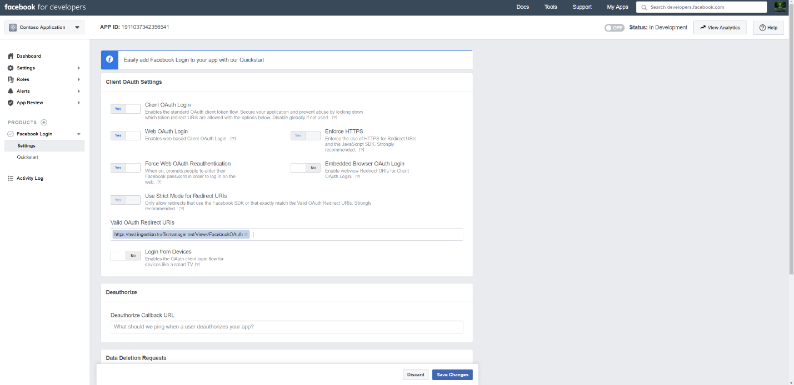

# Bereitstellen eines Connectors zum Archivieren von Daten von Facebook Business-Seiten

Dieser Artikel enthält den schrittweisen Prozess zum Bereitstellen eines Connectors, der den Office 365 Import-Dienst zum Importieren von Daten von Facebook Business-Seiten in Microsoft 365. Eine übersicht über diesen Prozess und eine Liste der erforderlichen Voraussetzungen für die Bereitstellung eines Facebook-Connectors finden Sie unter Einrichten eines Connectors zum Archivieren von [Facebook-Daten.](archive-facebook-data-with-sample-connector.md)

## Schritt 1: Erstellen einer App in Azure Active Directory

1. Wechseln Sie zu, und melden Sie <https://portal.azure.com> sich mit den Anmeldeinformationen eines globalen Administratorkontos an.

    

2. Klicken Sie im linken Navigationsbereich auf **Azure Active Directory**.

    

3. Klicken Sie im linken Navigationsbereich auf **App-Registrierungen (Vorschau)** und dann **auf Neue Registrierung**.

    

4. Registrieren Sie die Anwendung. Wählen Sie unter Umleitungs-URI die Option Web in der Dropdownliste anwendungstyp aus, und geben Sie dann in das Feld <https://portal.azure.com> für den URI ein.

   

5. Kopieren Sie **die Anwendungs-ID (Client-)ID** und die **Verzeichnis-ID (Mandant),** und speichern Sie sie in einer Textdatei oder an einem anderen sicheren Speicherort. Sie verwenden diese IDs in späteren Schritten.

   

6. Wechseln Sie **zu Zertifikate & für die neue App.**

   

7. Klicken Sie **auf Neuer Geheimer Clientgeheimnis**

   

8. Erstellen Sie einen neuen geheimen Schlüssel. Geben Sie in das Feld Beschreibung den geheimen Schlüssel ein, und wählen Sie dann einen Ablaufzeitraum aus.

    

9. Kopieren Sie den Wert des geheimen Schlüssels, und speichern Sie ihn in einer Textdatei oder einem anderen Speicherort. Dies ist der geheime AAD-Anwendungsgeheimnis, den Sie in späteren Schritten verwenden.

   

## Schritt 2: Bereitstellen des Connectorwebdiensts GitHub Ihrem Azure-Konto

1. Wechseln Sie [zu GitHub Website,](https://github.com/microsoft/m365-sample-connector-csharp-aspnet) und klicken Sie **auf Bereitstellen in Azure**.

    

2. Nachdem Sie auf **Bereitstellen in Azure** geklickt haben, werden Sie zu einem Azure-Portal mit einer benutzerdefinierten Vorlagenseite umgeleitet. Füllen Sie die **Grundlagen und** **Einstellungen** aus, und klicken Sie dann auf **Kaufen**.

   - **Abonnement:** Wählen Sie Ihr Azure-Abonnement aus, für das Sie den Connectorwebdienst für Facebook Business-Seiten bereitstellen möchten.

   - **Ressourcengruppe:** Wählen oder erstellen Sie eine neue Ressourcengruppe. Eine Ressourcengruppe ist ein Container, der verwandte Ressourcen für eine Azure-Lösung enthält.

   - **Speicherort:** Wählen Sie einen Speicherort aus.

   - **Web-App-Name:** Geben Sie einen eindeutigen Namen für die Connector-Web-App an. Der Name Th muss zwischen 3 und 18 Zeichen lang sein. Dieser Name wird zum Erstellen der Azure-App-Dienst-URL verwendet. Wenn Sie z. B. den Web-App-Namen **fbconnector** angeben, wird die Azure-App-Dienst-URL **fbconnector.azurewebsites.net.**

   - **tenantId:** Die Mandanten-ID Ihrer Microsoft 365, die Sie nach dem Erstellen der Facebook-Connector-App in Azure Active Directory Schritt 1 kopiert haben.

   - **APISecretKey:** Sie können einen beliebigen Wert als geheimen Wert eingeben. Dies wird für den Zugriff auf die Connectorweb-App in Schritt 5 verwendet.

     

3. Nachdem die Bereitstellung erfolgreich war, sieht die Seite ähnlich dem folgenden Screenshot aus:

   

## Schritt 3: Registrieren der Facebook-App

1. Wechseln Sie zu , melden Sie sich mit den Anmeldeinformationen für das Konto für die Facebook Business-Seiten Ihrer Organisation an, und klicken Sie dann <https://developers.facebook.com> **auf Neue App hinzufügen.**

   

2. Erstellen Sie eine neue App-ID.

   

3. Klicken Sie im linken Navigationsbereich auf **Produkte hinzufügen,** und klicken Sie dann **in** der Kachel **Facebook-Anmeldung** auf Einrichten.

   

4. Klicken Sie auf der Seite Facebook-Anmeldung integrieren auf **Web**.

   

5. Fügen Sie die Azure-App-Dienst-URL hinzu. beispiel: `https://fbconnector.azurewebsites.net` .

   

6. Schließen Sie den Abschnitt Schnellstart des Setups für die Facebook-Anmeldung ab.

   

7. Klicken Sie im linken Navigationsbereich unter **Facebook-Anmeldung** **auf Einstellungen**, und fügen Sie den OAuth-Umleitungs-URI im Feld Gültige **OAuth-Umleitungs-URIs** hinzu. Verwenden Sie das **\<connectorserviceuri> Format /Views/FacebookOAuth**, wobei der Wert für connectorserviceuri die Azure-App-Dienst-URL für Ihre Organisation ist, z. B. `https://fbconnector.azurewebsites.net` .

   

8. Klicken Sie im linken Navigationsbereich auf **Produkte hinzufügen,** und klicken Sie dann auf **Webhooks.** Klicken Sie **im** Pull-Down-Menü Seite auf **Seite**.

   

9. Fügen Sie die Webhooks-Rückruf-URL hinzu, und fügen Sie ein Überprüfungstoken hinzu. Verwenden Sie im Format der Rückruf-URL das Format **<connectorserviceuri> /api/FbPageWebhook**, wobei der Wert für connectorserviceuri die Azure-App-Dienst-URL für Ihre Organisation ist, z. B. `https://fbconnector.azurewebsites.net` .

   Das Überprüfungstoken sollte einem starken Kennwort ähnlich sein. Kopieren Sie das Überprüfungstoken in eine Textdatei oder einen anderen Speicherort.

   

10. Testen und abonnieren Sie den Endpunkt für feed.

    

11. Fügen Sie eine Datenschutz-URL, ein App-Symbol und eine Unternehmensnutzung hinzu. Kopieren Sie außerdem die App-ID und den geheimen App-Schlüssel in eine Textdatei oder einen anderen Speicherort.

    

12. Machen Sie die App öffentlich.

    

13. Hinzufügen eines Benutzers zur Rolle "Administrator" oder "Tester".

    

14. Fügen Sie die **Berechtigung Page Public Content Access** hinzu.

    

15. Hinzufügen der Berechtigung Seiten verwalten.

    

16. Die Anwendung wird von Facebook überprüft.

    

## Schritt 4: Konfigurieren der Connectorweb-App

1. Wechseln Sie `https://<AzureAppResourceName>.azurewebsites.net` zu (wobei AzureAppResourceName der Name Ihrer Azure-App-Ressource ist, die Sie in Schritt 4 benannt haben). Wenn der Name beispielsweise **fbconnector ist,** wechseln Sie zu `https://fbconnector.azurewebsites.net` . Die Startseite der App sieht wie der folgende Screenshot aus:

   

2. Klicken **Sie auf Konfigurieren,** um eine Anmeldeseite anzeigen zu können.

   

3. Geben Sie im Feld Mandanten-ID Ihre Mandanten-ID ein oder fügen Sie sie ein (die Sie in Schritt 2 erhalten haben). Geben Sie im Feld Kennwort den APISecretKey (den Sie in Schritt 2 erhalten haben) ein, oder fügen Sie ihn ein, und klicken Sie dann auf Konfigurationseinstellungen **festlegen Einstellungen,** um die Seite konfigurationsdetails anzuzeigen.

    

4. Geben Sie die folgenden Konfigurationseinstellungen ein

   - **Facebook-Anwendungs-ID:** Die App-ID für die Facebook-Anwendung, die Sie in Schritt 3 erhalten haben.

   - **Geheimer Facebook-Anwendungsgeheimnis:** Der geheime App-Schlüssel für die Facebook-Anwendung, die Sie in Schritt 3 erhalten haben.

   - **Facebook-Webhooks überprüfen Token:** Das in Schritt 3 erstellte Überprüfungstoken.

   - **AAD-Anwendungs-ID:** Die Anwendungs-ID für Azure Active Directory App, die Sie in Schritt 1 erstellt haben.

   - **Geheimer AAD-Anwendungsgeheimnis:** Der Wert für den geheimen APISecretKey-Schlüssel, den Sie in Schritt 1 erstellt haben.

5. Klicken Sie **auf Speichern,** um die Connectoreinstellungen zu speichern.

## Schritt 5: Einrichten eines Facebook-Connectors im Microsoft 365 Compliance Center

1. Wechseln Sie [https://compliance.microsoft.com](https://compliance.microsoft.com) zu,  und klicken Sie dann im linken Navigations navi auf Datenconnectors.

2. Klicken Sie **auf der Seite** Datenconnectors unter Facebook **Business-Seiten** auf **Anzeigen**.

3. Klicken Sie **auf der Seite Facebook-Geschäftsseiten** auf **Connector hinzufügen.**

4. Klicken Sie **auf der Seite Nutzungsbedingungen** auf **Akzeptieren**.

5. Geben Sie **auf der Seite Anmeldeinformationen für Ihre Connector-App** hinzufügen die folgenden Informationen ein, und klicken Sie dann **auf Verbindung überprüfen.**

   

   - Geben Sie **im Feld Name** einen Namen für den Connector ein, z. B. facebook news **page**.

   - Geben Sie **im Feld Verbindungs-URL** die Azure-App-Dienst-URL ein oder fügen Sie sie ein. beispiel: `https://fbconnector.azurewebsites.net` .

   - Geben Sie **im Feld Kennwort** den Wert des APISecretKey ein, den Sie in Schritt 2 hinzugefügt haben, oder fügen Sie ihn ein.

   - Geben Sie **im Feld Azure App ID** den Wert der Anwendungs-ID (Client-ID) ein, die auch als AAD-Anwendungs-ID bezeichnet wird, die Sie in Schritt 1 erstellt haben.

6. Nachdem die Verbindung erfolgreich überprüft wurde, klicken Sie auf **Weiter**.

7. Geben Sie **auf Microsoft 365 Seite** Zum Importieren von Daten autorisieren den APISecretKey erneut ein, oder fügen Sie ihn ein, und klicken Sie dann auf **Anmeldeweb-App**.

8. Klicken Sie auf der Seite **Facebook-Connector-App** konfigurieren auf Anmelden bei **Facebook,** und melden Sie sich mit den Anmeldeinformationen für das Konto für die Facebook Business-Seiten Ihrer Organisation an. Stellen Sie sicher, dass dem Facebook-Konto, bei dem Sie sich angemeldet haben, die Administratorrolle für die Facebook Business-Seiten Ihrer Organisation zugewiesen ist.

   

9. Eine Liste der Geschäftsseiten, die von dem Facebook-Konto verwaltet werden, bei dem Sie sich angemeldet haben, wird angezeigt. Wählen Sie die zu archivierende Seite aus, und klicken Sie dann auf **Weiter**.

   

10. Klicken **Sie auf Weiter,** um das Setup der Connectordienst-App zu beenden.

11. Auf der **Seite Filter festlegen** können Sie einen Filter anwenden, um elemente zu importieren, die ein bestimmtes Alter haben. Wählen Sie ein Alter aus, und klicken Sie dann auf **Weiter**.

12. Geben Sie **auf der** Seite Speicherort auswählen die E-Mail-Adresse des Microsoft 365 ein, in das die Facebook-Elemente importiert werden sollen, und klicken Sie dann auf **Weiter**.

13. Klicken **Sie auf Weiter,** um die Connectoreinstellungen zu überprüfen, und klicken Sie dann auf **Fertig** stellen, um die Connectoreinrichtung abzuschließen.

14. Wechseln Sie im Compliance  Center zur Seite Datenconnectors, und klicken Sie auf die Registerkarte **Connectors,** um den Fortschritt des Importvorgangs zu sehen.
