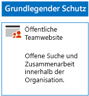
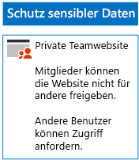
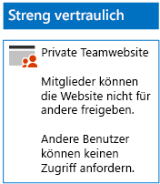

# Bereitstellen von SharePoint Online-Websites für drei SchutzebenenDeploy SharePoint Online sites for three tiers of protection

Verwenden Sie die Schritte in diesem Artikel, um Richtlinien für grundlegende, vertrauliche und streng vertrauliche SharePoint Online-Teamwebsites zu entwerfen. Weitere Informationen zu diesen drei Schutzebenen finden Sie unter [Sichern von SharePoint Online-Websites und -Dateien](../security/office-365-security/secure-sharepoint-online-sites-and-files.md).Use the steps in this article to design and deploy baseline, sensitive, and highly confidential SharePoint Online team sites. For more information about these three tiers of protection, see [Secure SharePoint Online sites and files](../security/office-365-security/secure-sharepoint-online-sites-and-files.md).
  
## Grundlegende SharePoint Online-TeamwebsitesBaseline SharePoint Online team sites

Der grundlegende Schutz enthält jeweils öffentliche und private Teamwebsites. Öffentliche Teamwebsites können von allen Benutzern in der Organisation ermittelt werden und alle haben Zugriff auf diese. Nur Mitglieder der Office 365-Gruppe, die mit der Teamwebsite verknüpft sind, können die privaten Websites ermitteln und auf diese zugreifen. Diese beiden Arten von Teamwebsites erlauben Mitgliedern, die Website für andere Personen freizugeben.Baseline protection includes both public and private team sites. Public team sites can be discovered and accessed by anybody in the organization. Private sites can only be discovered and accessed by members of the Office 365 group associated with the team site. Both of these types of team sites allow members to share the site with others.
  
### Public (Öffentlich)Public

Um eine grundlegende SharePoint Online-Teamwebsite mit öffentlichem Zugriff und Berechtigungen zu erstellen, befolgen Sie bitte [diese Anweisungen](https://support.office.com/article/create-a-team-site-in-sharepoint-ef10c1e7-15f3-42a3-98aa-b5972711777d).To create a baseline SharePoint Online team site with public access and permissions, follow [these instructions](https://support.office.com/article/create-a-team-site-in-sharepoint-ef10c1e7-15f3-42a3-98aa-b5972711777d).

Nachfolgend sehen Sie die daraus resultierende Konfiguration.Here is your resulting configuration.
  

  
### PrivatPrivate

Um eine grundlegende SharePoint Online-Teamwebsite mit privatem Zugriff und Berechtigungen zu erstellen, befolgen Sie bitte [diese Anweisungen](https://support.office.com/article/create-a-team-site-in-sharepoint-ef10c1e7-15f3-42a3-98aa-b5972711777d).To create a baseline SharePoint Online team site with private access and permissions, follow [these instructions](https://support.office.com/article/create-a-team-site-in-sharepoint-ef10c1e7-15f3-42a3-98aa-b5972711777d).
  
Nachfolgend sehen Sie die daraus resultierende Konfiguration.Here is your resulting configuration.
  

  
## Vertrauliche SharePoint Online-TeamwebsitesSensitive SharePoint Online team sites

Eine sensible SharePoint Online-Teamwebsite wird zunächst als private Teamwebsite erstellt.A sensitive SharePoint Online team site starts as a private team site.
  
Erstellen Sie zuerst die private SharePoint Online-Teamwebsite laut den [folgenden Anweisungen](https://support.office.com/article/create-a-team-site-in-sharepoint-ef10c1e7-15f3-42a3-98aa-b5972711777d).First, create the private SharePoint Online team site with [these instructions](https://support.office.com/article/create-a-team-site-in-sharepoint-ef10c1e7-15f3-42a3-98aa-b5972711777d).

Konfigurieren Sie als daraufhin auf der neuen SharePoint Online-Teamwebsite die gewünschten Berechtigungen anhand der folgenden Schritte.Next, from the new SharePoint Online team site, configure additional permission settings with these steps.

1.  Klicken Sie in der Symbolleiste der SharePoint-Teamwebsite auf das Symbol "Einstellungen" und anschließend auf **Websiteberechtigungen**.In the tool bar of the SharePoint team site, click the settings icon, and then click **Site permissions**.
2.  Klicken Sie im Bereich **Websiteberechtigungen** unter **Freigabeeinstellungen** auf **Freigabeeinstellungen ändern**.In the **Site permissions** pane, under **Sharing Settings**, click **Change sharing settings**.
3.  Wählen Sie unter **Freigabeberechtigungen** die Option **Nur Websitebesitzer können Dateien, Ordner und die Website teilen** aus, und klicken Sie dann auf **Speichern**.Under **Sharing permissions**, choose **Only site owners can share files, folders, and the site**, and then click **Save**.

Die Ergebnisse dieser Berechtigungseinstellungen sehen folgendermaßen aus:The results of these permission settings are:

- Die Möglichkeit, dass Mitglieder Inhalte mit anderen Mitgliedern teilen, ist deaktiviert.The ability for members to share with other members is disabled.
- Die Möglichkeit, dass Nicht-Mitglieder Zugriff anfordern, ist aktiviert.The ability for non-members to request access is enabled.

Nachfolgend sehen Sie die daraus resultierende Konfiguration.Here is your resulting configuration.
  

  
Die Mitglieder der Website können nun über Gruppenmitgliedschaft in einer der Zugriffsgruppen sicher an den Ressourcen der Website zusammenarbeiten.The members of the site, through group membership in one of the access groups, can now securely collaborate on the resources of the site.
  
## Streng vertrauliche SharePoint Online-TeamwebsitesHighly confidential SharePoint Online team sites

Bei einer streng vertraulichen SharePoint Online-Teamwebsite handelt es sich um eine private Teamwebsite mit zusätzlichen Berechtigungseinstellungen.A highly confidential SharePoint Online team site is a private team site with additional permissions settings.

Erstellen Sie zuerst die private SharePoint Online-Teamwebsite laut den [folgenden Anweisungen](https://support.office.com/article/create-a-team-site-in-sharepoint-ef10c1e7-15f3-42a3-98aa-b5972711777d).First, create the private SharePoint Online team site with [these instructions](https://support.office.com/article/create-a-team-site-in-sharepoint-ef10c1e7-15f3-42a3-98aa-b5972711777d).

Konfigurieren Sie als daraufhin auf der neuen SharePoint Online-Teamwebsite die gewünschten Berechtigungen anhand der folgenden Schritte.Next, from the new SharePoint Online team site, configure additional permission settings with these steps.

1.  Klicken Sie in der Symbolleiste der SharePoint-Teamwebsite auf das Symbol "Einstellungen" und anschließend auf **Websiteberechtigungen**.In the tool bar of the SharePoint team site, click the settings icon, and then click **Site permissions**.
2.  Klicken Sie im Bereich **Websiteberechtigungen** unter **Freigabeeinstellungen** auf **Freigabeeinstellungen ändern**.In the **Site permissions** pane, under **Sharing Settings**, click **Change sharing settings**.
3.  Wählen Sie unter **Freigabeberechtigungen** die Option **Nur Websitebesitzer können Dateien, Ordner und die Website teilen** aus.Under **Sharing permissions**, choose **Only site owners can share files, folders, and the site**.
4. Deaktivieren Sie **Zugriffsanforderungen zulassen**, und klicken Sie dann auf **Speichern**.Turn off **Allow access requests**, and then click **Save**.

Die Ergebnisse dieser Berechtigungseinstellungen sehen folgendermaßen aus:The results of these permission settings are:

- Die Möglichkeit, dass Mitglieder Inhalte mit anderen Mitgliedern teilen, ist deaktiviert.The ability for members to share with other members is disabled.
- Die Möglichkeit, dass Nicht-Mitglieder Zugriff anfordern, ist deaktiviert.The ability for non-members to request access is disabled.

Nachfolgend sehen Sie die daraus resultierende Konfiguration.Here is your resulting configuration.
  

  
Die Mitglieder der Website können nun über Gruppenmitgliedschaft in einer der Zugriffsgruppen sicher an den Ressourcen der Website zusammenarbeiten.The members of the site, through group membership in one of the access groups, can now securely collaborate on the resources of the site.
  
## Nächster SchrittNext step

[Schützen von SharePoint Online-Dateien mit Office 365-Bezeichnungen und Verhindern von DatenverlustProtect SharePoint Online files with Office 365 labels and DLP](protect-sharepoint-online-files-with-office-365-labels-and-dlp.md)

## Siehe auchSee also

[Microsoft-Sicherheitsleitfaden für politische Kampagnen, gemeinnützigen Organisationen und andere agile OrganisationenMicrosoft Security Guidance for Political Campaigns, Nonprofits, and Other Agile Organizations](../security/office-365-security/microsoft-security-guidance-for-political-campaigns-nonprofits-and-other-agile-o.md)
  
[Cloudakzeptanz und HybridlösungenCloud adoption and hybrid solutions](https://docs.microsoft.com/office365/enterprise/cloud-adoption-and-hybrid-solutions)
