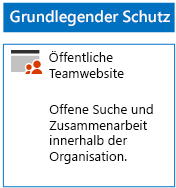
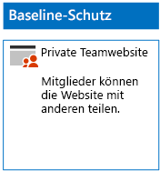
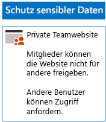
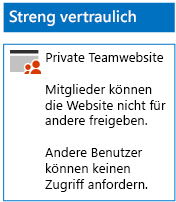

# Bereitstellen von SharePoint Online-Websites für drei Schutzebenen

Verwenden Sie die Schritte in diesem Artikel, um Richtlinien für grundlegende, vertrauliche und streng vertrauliche SharePoint Online-Teamwebsites zu entwerfen. Weitere Informationen zu diesen drei Schutzebenen finden Sie unter [Sichern von SharePoint Online-Websites und -Dateien](../security/office-365-security/secure-sharepoint-online-sites-and-files.md).
  
## Grundlegende SharePoint Online-Teamwebsites

Der grundlegende Schutz enthält jeweils öffentliche und private Teamwebsites. Öffentliche Teamwebsites können von allen Benutzern in der Organisation ermittelt werden und alle haben Zugriff auf diese. Nur Mitglieder der Office 365-Gruppe, die mit der Teamwebsite verknüpft sind, können die privaten Websites ermitteln und auf diese zugreifen. Diese beiden Arten von Teamwebsites erlauben Mitgliedern, die Website für andere Personen freizugeben.
  
### Public (Öffentlich)

Um eine grundlegende SharePoint Online-Teamwebsite mit öffentlichem Zugriff und Berechtigungen zu erstellen, befolgen Sie bitte [diese Anweisungen](https://support.office.com/article/create-a-team-site-in-sharepoint-ef10c1e7-15f3-42a3-98aa-b5972711777d).

Nachfolgend sehen Sie die daraus resultierende Konfiguration.
  

  
### Privat

Um eine grundlegende SharePoint Online-Teamwebsite mit privatem Zugriff und Berechtigungen zu erstellen, befolgen Sie bitte [diese Anweisungen](https://support.office.com/article/create-a-team-site-in-sharepoint-ef10c1e7-15f3-42a3-98aa-b5972711777d).
  
Nachfolgend sehen Sie die daraus resultierende Konfiguration.
  

  
## Vertrauliche SharePoint Online-Teamwebsites

Eine sensible SharePoint Online-Teamwebsite wird zunächst als private Teamwebsite erstellt.
  
Erstellen Sie zuerst die private SharePoint Online-Teamwebsite laut den [folgenden Anweisungen](https://support.office.com/article/create-a-team-site-in-sharepoint-ef10c1e7-15f3-42a3-98aa-b5972711777d).

Konfigurieren Sie als daraufhin auf der neuen SharePoint Online-Teamwebsite die gewünschten Berechtigungen anhand der folgenden Schritte.

1.  Klicken Sie in der Symbolleiste der SharePoint-Teamwebsite auf das Symbol "Einstellungen" und anschließend auf **Websiteberechtigungen**.
2.  Klicken Sie im Bereich **Websiteberechtigungen** unter **Freigabeeinstellungen** auf **Freigabeeinstellungen ändern**.
3.  Wählen Sie unter **Freigabeberechtigungen** die Option **Nur Websitebesitzer können Dateien, Ordner und die Website teilen** aus, und klicken Sie dann auf **Speichern**.

Die Ergebnisse dieser Berechtigungseinstellungen sehen folgendermaßen aus:

- Die Möglichkeit, dass Mitglieder Inhalte mit anderen Mitgliedern teilen, ist deaktiviert.
- Die Möglichkeit, dass Nicht-Mitglieder Zugriff anfordern, ist aktiviert.

Nachfolgend sehen Sie die daraus resultierende Konfiguration.
  

  
Die Mitglieder der Website können nun über Gruppenmitgliedschaft in einer der Zugriffsgruppen sicher an den Ressourcen der Website zusammenarbeiten.
  
## Streng vertrauliche SharePoint Online-Teamwebsites

Bei einer streng vertraulichen SharePoint Online-Teamwebsite handelt es sich um eine private Teamwebsite mit zusätzlichen Berechtigungseinstellungen.

Erstellen Sie zuerst die private SharePoint Online-Teamwebsite laut den [folgenden Anweisungen](https://support.office.com/article/create-a-team-site-in-sharepoint-ef10c1e7-15f3-42a3-98aa-b5972711777d).

Konfigurieren Sie als daraufhin auf der neuen SharePoint Online-Teamwebsite die gewünschten Berechtigungen anhand der folgenden Schritte.

1.  Klicken Sie in der Symbolleiste der SharePoint-Teamwebsite auf das Symbol "Einstellungen" und anschließend auf **Websiteberechtigungen**.
2.  Klicken Sie im Bereich **Websiteberechtigungen** unter **Freigabeeinstellungen** auf **Freigabeeinstellungen ändern**.
3.  Wählen Sie unter **Freigabeberechtigungen** die Option **Nur Websitebesitzer können Dateien, Ordner und die Website teilen** aus.
4. Deaktivieren Sie **Zugriffsanforderungen zulassen**, und klicken Sie dann auf **Speichern**.

Die Ergebnisse dieser Berechtigungseinstellungen sehen folgendermaßen aus:

- Die Möglichkeit, dass Mitglieder Inhalte mit anderen Mitgliedern teilen, ist deaktiviert.
- Die Möglichkeit, dass Nicht-Mitglieder Zugriff anfordern, ist deaktiviert.

Nachfolgend sehen Sie die daraus resultierende Konfiguration.
  

  
Die Mitglieder der Website können nun über Gruppenmitgliedschaft in einer der Zugriffsgruppen sicher an den Ressourcen der Website zusammenarbeiten.
  
## Nächster Schritt

[Schützen von SharePoint Online-Dateien mit Office 365-Bezeichnungen und Verhindern von Datenverlust](protect-sharepoint-online-files-with-office-365-labels-and-dlp.md)

## Siehe auch

[Microsoft-Sicherheitsleitfaden für politische Kampagnen, gemeinnützigen Organisationen und andere agile Organisationen](../security/office-365-security/microsoft-security-guidance-for-political-campaigns-nonprofits-and-other-agile-o.md)
  
[Cloudakzeptanz und Hybridlösungen](https://docs.microsoft.com/office365/enterprise/cloud-adoption-and-hybrid-solutions)
