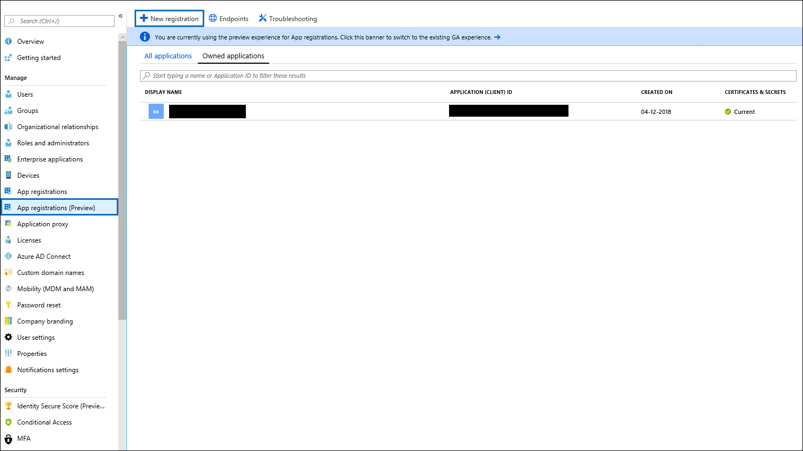
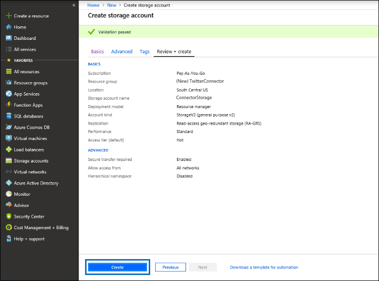
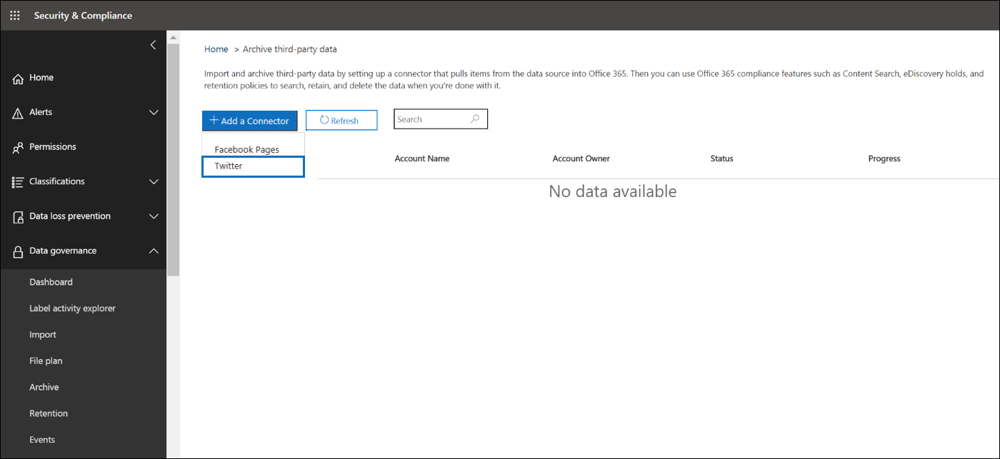
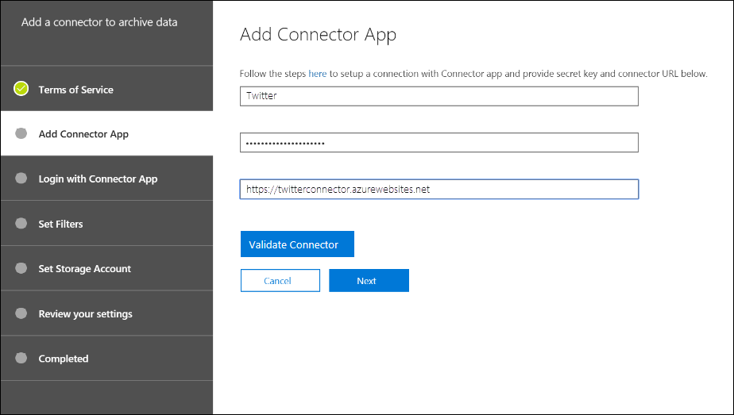

# Bereitstellen eines Connectors zum Archivieren von Twitter-Daten

Dieser Artikel enthält den schrittweisen Prozess zur Bereitstellungeines Connectors, der den Office 365 Import Dienst verwendet, um Daten aus dem Twitter-Konto Ihrer Organisation in Office 365 zu importieren. Eine allgemeine Übersicht über diesen Prozess und eine Liste der erforderlichen Voraussetzungen für die Bereitstellungeines Twitter-Konnektors finden Sie unter [Verwenden eines Connectors zum Archivieren von Twitter-Daten in Office 365 (Preview)](archive-twitter-data-with-sample-connector.md). 

## Schritt 1: Herunterladen des Pakets

Laden Sie das vorgefertigte Paket aus dem Abschnitt Release im GitHub-Repository unter [https://github.com/microsoft/m365-sample-twitter-connector-csharp-aspnet/releases](https://github.com/microsoft/m365-sample-twitter-connector-csharp-aspnet/releases)herunter. Laden Sie die ZIP-Datei mit dem Namen **SampleConnector. zip**unter der neuesten Version herunter. Sie laden diese ZIP-Datei in Schritt 4 in Azure hoch.

## Schritt 2: Erstellen einer APP in Azure Active Directory

1. Wechseln Sie <https://portal.azure.com> zu, und melden Sie sich mit den Anmeldeinformationen eines Office 365 globalen Administratorkontos an.

   

2. Klicken Sie im linken Navigationsbereich auf **Azure Active Directory**.

   

3. Klicken Sie im linken Navigationsbereich auf **App-Registrierungen (Vorschau)** , und klicken Sie dann auf **neue Registrierung**.

   

4. Registrieren Sie die Anwendung. Wählen Sie unter **Umleitungs-URI (optional)** in der Dropdownliste Anwendungstyp die `https://portal.azure.com` Option **Webseite** aus, und geben Sie dann in das Feld für den URI ein.

   

5. Kopieren Sie die Anwendungs-ID **(Client) ID** und **Verzeichnis (Mandanten)** , und speichern Sie Sie in einer Textdatei oder an einem anderen sicheren Ort. Sie verwenden diese IDs in späteren Schritten.

    

6. Wechseln Sie zu **Zertifikaten #a0 Geheimnisse für die neue APP** und unter **Client Secrets** auf **neuen geheimen Client Schlüssel**.

   

7. Erstellen Sie einen neuen geheimen Schlüssel. Geben Sie im Feld Beschreibung den geheimen Schlüssel ein, und wählen Sie dann einen Ablaufzeitraum aus. 

   

8. Kopieren Sie den Wert des geheimen Schlüssels, und speichern Sie ihn in einer Textdatei oder an einem anderen Speicherort. Dies ist der geheime Aad-Anwendungsschlüssel, den Sie in späteren Schritten verwenden.

   

9. Wechseln Sie zu **Manifest** , und kopieren Sie die identifierUris (die auch als Aad Application URI bezeichnet wird) wie im folgenden Screenshot hervorgehoben. Kopieren Sie den Aad-Anwendungs-URI in eine Textdatei oder einen anderen Speicherort. Sie verwenden Sie in Schritt 6.

    

## Schritt 3: Erstellen eines Azure-speicherkontos

1.  Wechseln Sie zur Azure-Startseite für Ihre Organisation.

    

2. Klicken Sie auf **Ressource erstellen** , und geben Sie **Speicherkonto** in das Suchfeld ein.

   

3. Klicken Sie auf **Speicher**, und klicken Sie dann auf **Speicherkonto**.

   

4. Wählen Sie auf der Seite **Speicherkonto erstellen** im Feld Abonnement die Option **Pay-as-you-go** oder **Kostenlose Testversion** je nach Typ des Azure-Abonnements aus. 

   

5. Wählen oder erstellen Sie eine Ressourcengruppe.

   

6. Geben Sie einen Namen für das Speicherkonto ein.

   

7. Überprüfen Sie, und klicken Sie dann auf **Erstellen** , um das Speicherkonto zu erstellen.

   

8. Klicken Sie nach einigen Momenten auf **Aktualisieren** , und klicken Sie dann auf **Ressource wechseln** , um zum Speicherkonto zu navigieren.

   

9. Klicken Sie im linken Navigationsbereich auf **Zugriffstasten** .

   

10. Kopieren Sie eine **Verbindungszeichenfolge** , und speichern Sie Sie in einer Textdatei oder an einem anderen Speicherort. Verwenden Sie diese Option, wenn Sie in Schritt 4 eine Webanwendungs Ressource erstellen.

    

## Schritt 4: Erstellen einer neuen webapp-Ressource in Azure

1. Klicken Sie auf der **Start** Seite im Azure-Portal auf **Ressource \> : alles \> -Webanwendung erstellen**. Klicken Sie auf der Seite **Webanwendung** auf **Erstellen**.

   

2. Geben Sie die Details ein (wie unten dargestellt), und erstellen Sie dann die Webanwendung. Der Name, den Sie im Feld **App-Name** eingeben, wird verwendet, um die Azure-App-Dienst-URL zu erstellen. Beispiel: twitterconnector.azurewebsites.net.

   

3. Wechseln Sie zur neu erstellten Ressource für Webanwendungen, und klicken Sie im linken Navigationsbereich auf **Anwendungseinstellungen** . Klicken Sie unter **Anwendungseinstellungen**auf **neue Einstellung hinzufügen** , und fügen Sie die folgenden drei Einstellungen hinzu. Verwenden Sie die Werte (die Sie in die Textdatei aus den vorherigen Schritten kopiert haben): 

    - **APISecretKey** – Sie können einen beliebigen Wert als geheimen Schlüssel eingeben. Dieser wird für den Zugriff auf die Connector-Webanwendung in Schritt 7 verwendet.

    - **StorageAccountConnectionString** – der Verbindungszeichenfolgen-URI, den Sie nach dem Erstellen des Azure-speicherkontos in Schritt 3 kopiert haben.

    - **Mandanten** Kennung – die Mandanten-ID Ihrer Office 365 Organisation, die Sie nach dem Erstellen der Twitter Connector-app in Azure Active Directory in Schritt 2 kopiert haben.

    

4. Klicken Sie unter **Allgemeine Einstellungen** **auf neben** dem **immer ein**. Klicken Sie oben auf der Seite auf **Speichern** , um die Anwendungseinstellungen zu speichern.

   

5. Der letzte Schritt besteht darin, den Quellcode der Connector-app in Azure hochzuladen, den Sie in Schritt 1 heruntergeladen haben. Wechseln Sie in einem Webbrowser zu https://<AzureAppResourceName>. SCM.azurewebsites.net/ZipDeployUi. Wenn beispielsweise der Name Ihrer Azure-App-Ressource (die Sie in Schritt 2 in diesem Abschnitt genannt haben) **twitterconnector**lautet, gehen Sie zu https://twitterconnector.scm.azurewebsites.net/ZipDeployUi.

6. Ziehen Sie das SampleConnector. zip-Menü (das Sie in Schritt 1 heruntergeladen haben) auf diese Seite. Nachdem die Dateien hochgeladen wurden und die Bereitstellung erfolgreich war, sieht die Seite wie im folgenden Screenshot aus:

   

## Schritt 5: Erstellen der Twitter-APP

1. Wechseln Sie https://developer.twitter.comzu, melden Sie sich mit den Anmeldeinformationen für das Entwicklerkonto für Ihre Organisation an, und klicken Sie dann auf **apps**.

   
2. Klicken Sie auf **app erstellen**.
   
   

3. Fügen Sie unter **App-Details**Informationen zur Anwendung hinzu.

   

4. Wählen Sie im Twitter Developer Dashboard die soeben erstellte App aus, und kopieren Sie die angezeigte APP-ID, und speichern Sie Sie in einer Textdatei oder an einem anderen Speicherort. Klicken Sie dann auf **Details**.
   
   

5. Kopieren Sie auf der Registerkarte **Schlüssel und Token** unter **Consumer-API-Schlüssel** den geheimen Schlüssel der API, und speichern Sie ihn in einer Textdatei oder an einem anderen Speicherort. Klicken Sie dann auf **Erstellen** , um ein Zugriffstoken und einen Zugriffstoken Schlüssel zu generieren, und kopieren Sie diese in eine Textdatei oder einen anderen Speicherort.
   
   

   Klicken Sie dann auf **Erstellen** , um ein Zugriffstoken und einen Zugriffstoken Schlüssel zu generieren, und kopieren Sie diese in eine Textdatei oder einen anderen Speicherort.

6. Klicken Sie auf die Registerkarte **Berechtigungen** , und konfigurieren Sie die Berechtigungen wie im folgenden Screenshot dargestellt:

   

7. Nachdem Sie die Berechtigungseinstellungen gespeichert haben, klicken Sie auf die Registerkarte **App-Details** , und klicken Sie dann auf **Bearbeiten #a0 bearbeiten von Details**.

   

8. Führen Sie die folgenden Aufgaben aus:

   - Aktivieren Sie das Kontrollkästchen, damit sich die Connector-App bei Twitter anmelden kann.
   
   - Fügen Sie den OAuth-Umleitungs-URI mit dem folgenden Format hinzu: ** \<connectorserviceuri>/views/twitteroauth**, wobei der Wert von *connectorserviceuri* die Azure-App-Dienst-URL für Ihre Organisation ist. Beispiel: https://twitterconnector.azurewebsites.net/Views/TwitterOAuth.

    

Die Twitter-Entwickler-App ist jetzt einsatzfähig.

## Schritt 6: Konfigurieren der Connector-Webanwendung 

1. Wechseln Sie zu\<https://AzureAppResourceName>. azurewebsites.net (wobei **AzureAppResourceName** der Name Ihrer Azure-App-Ressource ist, die Sie in Schritt 4 benannt haben). Wenn der Name beispielsweise **twitterconnector**lautet, wechseln Sie zu https://twitterconnector.azurewebsites.net. Die Startseite der APP sieht wie im folgenden Screenshot aus:

   

2. Klicken Sie auf **Konfigurieren** , um eine Anmeldeseite anzuzeigen.

   

3. Geben Sie in das Feld Mandanten-ID die Mandanten-ID ein, die Sie in Schritt 2 erhalten haben, oder fügen Sie Sie ein. Geben Sie in das Feld Kennwort den APISecretKey (den Sie in Schritt 2 erhalten haben) ein, oder fügen Sie ihn ein, und klicken Sie dann auf **Konfigurationseinstellungen festlegen** , um die Seite **Konfigurations Details** anzuzeigen.

   

4. Geben Sie unter **Konfigurations Details**die folgenden Konfigurationseinstellungen ein: 

   - **Twitter-API-Schlüssel** – die APP-ID für die Twitter-Anwendung, die Sie in Schritt 5 erstellt haben.
   - **Twitter-API-geheimer Schlüssel** – der geheime API-Schlüssel für die Twitter-Anwendung, die Sie in Schritt 5 erstellt haben.
   - **Twitter-Zugriffstoken** – das Zugriffstoken, das Sie in Schritt 5 erstellt haben.
   - **Twitter-Zugriffstoken Secret** – der geheime Zugriffstoken-Schlüssel, den Sie in Schritt 5 erstellt haben.
   - **Aad-Anwendungs-ID** – die Anwendungs-ID für die Azure Active Directory-APP, die Sie in Schritt 2 erstellt haben
   - **Aad-Anwendungs Geheimnis** – der Wert für den geheimen Schlüssel "APISecretKey", den Sie in Schritt 4 erstellt haben.
   - **Aad-Anwendungs-URI** – der in Schritt 2 abgerufene Aad-Anwendungs-URI; Beispiel: `https://microsoft.onmicrosoft.com/2688yu6n-12q3-23we-e3ee-121111123213`.
   - **App Insights Instrumentation Key** – lassen Sie dieses Feld leer.

5. Klicken Sie auf **Speichern** , um die Verbindungseinstellungen zu speichern.

## Schritt 7: Einrichten eines benutzerdefinierten Connectors im Security and Compliance Center

1.  Wechseln Sie <https://protection.office.com> zu, und klicken Sie dann auf **Information Governance \> Import \> Archivieren von drittanbieterdaten**.

    

2. Klicken Sie auf **Connector hinzufügen** , und klicken Sie dann auf **Twitter**.

   

3. Geben Sie auf der Seite " **Connector-app hinzufügen** " die folgenden Informationen ein, und klicken Sie dann auf **Connector überprüfen**.

    - Geben Sie im ersten Feld einen Namen für den Connector ein, beispielsweise **Twitter**.
    - Geben Sie im zweiten Feld den Wert des APISecretKey ein, den Sie in Schritt 4 hinzugefügt haben, oder fügen Sie ihn ein.
    - Geben Sie im dritten Feld die Azure-App-Dienst-URL ein, oder fügen Sie Sie ein. Beispiel: **https://twitterconnector.azurewebsites.net**.

   Nachdem der Connector erfolgreich überprüft wurde, klicken Sie auf **weiter**.

   

4. Klicken Sie auf **Anmeldung mit der Connector-App**.

   

5. Geben Sie den APISecretKey erneut ein, oder fügen Sie ihn ein, und klicken Sie dann auf **Login to Connector Service**.

   

6. Klicken Sie auf **weiter mit Twitter**.

7. Melden Sie sich auf der Twitter-Anmeldeseite mit den Anmeldeinformationen für das Konto für das Twitter-Konto Ihrer Organisation an.

   

   Nachdem Sie sich angemeldet haben, wird auf der Twitter-Seite die folgende Meldung angezeigt: "Twitter Connector-Auftrag erfolgreich eingerichtet."

8. Klicken Sie auf **Fertig stellen** , um die Einrichtung des Twitter-Konnektors abzuschließen.

9. Auf der Seite **Filter festlegen** können Sie einen Filter anwenden, um Elemente zu importieren (und archivieren), die ein bestimmtes Alter aufweisen. Klicken Sie auf **Weiter**.

   

10. Geben Sie auf der Seite **Speicherkonto festlegen** die e-Mail-Adresse eines Office 365 Postfachs ein, in das die Twitter-Elemente importiert werden.

    

11. Überprüfen Sie Ihre Einstellungen, und klicken Sie dann auf **Fertig stellen** , um das Connector-Setup im Security #a0 Compliance Center abzuschließen.

    

    

12. Wechseln Sie zur Seite **Archivieren von drittanbieterdaten** , um den Fortschritt des Importvorgangs anzuzeigen.

    
