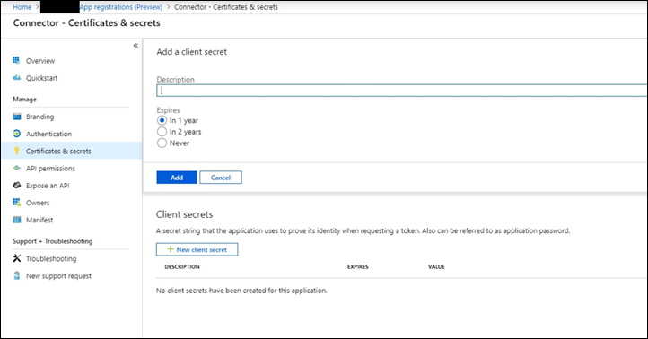
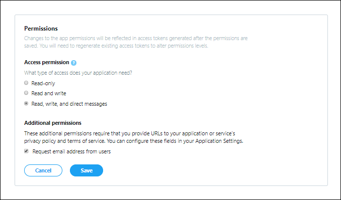

# Bereitstellen eines Connectors zum Archivieren von Twitter-DatenDeploy a connector to archive Twitter data

Dieser Artikel enthält den schrittweisen Prozess zum Bereitstellen eines Connectors, der den Office 365 Importdienst verwendet, um Daten aus dem Twitter-Konto Ihrer Organisation in Microsoft 365 zu importieren.This article contains the step-by-step process to deploy a connector that uses the Office 365 Import service to import data from your organization's Twitter account to Microsoft 365. Eine allgemeine Übersicht über diesen Prozess und eine Liste der erforderlichen Komponenten für die Bereitstellung eines Twitter-Connectors finden Sie unter ["Einrichten eines Connectors zum Archivieren von Twitter-Daten". ](archive-twitter-data-with-sample-connector.md)For a high-level overview of this process and a list of prerequisites required to deploy a Twitter connector, see [Set up a connector to archive Twitter data ](archive-twitter-data-with-sample-connector.md).

## Schritt 1: Erstellen einer App in Azure Active DirectoryStep 1: Create an app in Azure Active Directory

1. Rufen Sie <https://portal.azure.com> die Anmeldeinformationen eines globalen Administratorkontos auf, und melden Sie sich an.Go to <https://portal.azure.com> and sign in using the credentials of a global admin account.

   

2. Klicken Sie im linken Navigationsbereich auf **Azure Active Directory**.In the left navigation pane, click **Azure Active Directory**.

   

3. Klicken Sie im linken Navigationsbereich auf **App-Registrierungen (Vorschau),** und klicken Sie dann auf **"Neue Registrierung".**In the left navigation pane, click **App registrations (Preview)** and then click **New registration**.

   

4. Registrieren Sie die Anwendung.Register the application. Wählen Sie unter **Umleitungs-URI (optional)** in der Dropdownliste für den Anwendungstyp **"Web"** aus, und geben Sie dann `https://portal.azure.com` das Feld für den URI ein.Under **Redirect URI (optional)**, select **Web** in the application type dropdown list and then type `https://portal.azure.com` in the box for the URI.

   

5. Kopieren Sie die **Anwendungs-ID (Client)-ID** und **die Verzeichnis-ID (Mandanten-ID),** und speichern Sie sie in einer Textdatei oder an einem anderen sicheren Speicherort.Copy the **Application (client) ID** and **Directory (tenant) ID** and save them to a text file or other safe location. Sie verwenden diese IDs in späteren Schritten.You use these IDs in later steps.

    

6. Wechseln Sie zu **Zertifikate & geheimen Schlüssel für die neue App,** und klicken Sie unter **"Geheime Clientschlüssel"** auf **"Neuer geheimer Clientschlüssel".**Go to **Certificates & secrets for the new app** and under **Client secrets** click **New client secret**.

   

7. Erstellen Sie einen neuen geheimen Schlüssel.Create a new secret. Geben Sie im Beschreibungsfeld den geheimen Schlüssel ein, und wählen Sie dann einen Ablaufzeitraum aus.In the description box, type the secret and then choose an expiration period.

   

8. Kopieren Sie den Wert des geheimen Schlüssels, und speichern Sie ihn in einer Textdatei oder an einem anderen Speicherort.Copy the value of the secret and save it to a text file or other storage location. Dies ist der geheime AAD-Anwendungsschlüssel, den Sie in späteren Schritten verwenden.This is the AAD application secret that you use in later steps.

   

## Schritt 2: Bereitstellen des Connectorwebdiensts von GitHub auf Ihrem Azure-KontoStep 2: Deploy the connector web service from GitHub to your Azure account

1. Wechseln Sie zu [dieser GitHub Website,](https://github.com/microsoft/m365-sample-twitter-connector-csharp-aspnet) und klicken Sie auf **"Bereitstellen in Azure".**Go to [this GitHub site](https://github.com/microsoft/m365-sample-twitter-connector-csharp-aspnet) and click **Deploy to Azure**.

    

2. Nachdem Sie auf **"Bereitstellen in Azure"** geklickt haben, werden Sie mit einer benutzerdefinierten Vorlagenseite zu einem Azure-Portal umgeleitet.After you click **Deploy to Azure**, you will be redirected to an Azure portal with a custom template page. Geben Sie die **Grundlagen** und **Einstellungen** Details ein, und klicken Sie dann auf **"Kaufen".**Fill in the **Basics** and **Settings** details and then click **Purchase**.

   

    - **Abonnement:** Wählen Sie Ihr Azure-Abonnement aus, in dem Sie den Twitter Connector-Webdienst bereitstellen möchten.**Subscription:** Select your Azure subscription that you want to deploy the Twitter connector web service to.

    - **Ressourcengruppe:** Wählen Oder erstellen Sie eine neue Ressourcengruppe.**Resource group:** Choose or create a new resource group. Eine Ressourcengruppe ist ein Container, der verwandte Ressourcen für eine Azure-Lösung enthält.A resource group is a container that holds related resources for an Azure solution.

    - **Speicherort:** Wählen Sie einen Speicherort aus.**Location:** Choose a location.

    - **Name der Web-App:** Geben Sie einen eindeutigen Namen für die Connector-Web-App an.**Web App Name:** Provide a unique name for the connector web app. Der Name muss zwischen 3 und 18 Zeichen lang sein.Th name must be between 3 and 18 characters in length. Dieser Name wird zum Erstellen der Azure-App-Dienst-URL verwendet. Wenn Sie beispielsweise den Web-App-Namen von **twitterconnector** angeben, wird die URL des Azure-App-Diensts **twitterconnector.azurewebsites.net.**This name is used to create the Azure app service URL; for example, if you provide the Web app name of **twitterconnector** then the Azure app service URL  will be **twitterconnector.azurewebsites.net**.

    - **tenantId:** Die Mandanten-ID Ihrer Microsoft 365 Organisation, die Sie nach dem Erstellen der Facebook-Connector-App in Azure Active Directory in Schritt 1 kopiert haben.**tenantId:** The tenant ID of your Microsoft 365 organization that you copied after creating the Facebook connector app in Azure       Active Directory in Step 1.

   - **APISecretKey:** Sie können einen beliebigen Wert als geheimen Schlüssel eingeben.**APISecretKey:** You can type any value as the secret. Dies wird verwendet, um auf die Connector-Web-App in Schritt 5 zuzugreifen.This is used to access the connector web app in Step 5.

3. Nachdem die Bereitstellung erfolgreich war, sieht die Seite ähnlich wie im folgenden Screenshot aus:After the deployment is successful, the page will look similar to the following screenshot:

    

## Schritt 3: Erstellen der Twitter-AppStep 3: Create the Twitter app

1. Wechseln Sie zu https://developer.twitter.com , melden Sie sich mit den Anmeldeinformationen für das Entwicklerkonto für Ihre Organisation an, und klicken Sie dann auf **"Apps".**Go to https://developer.twitter.com, log in using the credentials for the developer account for your organization, and then click **Apps**.

   
2. Klicken Sie auf **"App erstellen".**Click **Create an app**.

   

3. Fügen Sie unter **App-Details** Informationen zur Anwendung hinzu.Under **App details**, add information about the application.

   

4. Wählen Sie im Twitter-Entwicklerdashboard die App aus, die Sie soeben erstellt haben, und klicken Sie dann auf **"Details".**On the Twitter developer dashboard, select the app that you just created and then click **Details**.

   

5. Kopieren Sie auf der Registerkarte **"Schlüssel und Token"** unter **"Consumer-API-Schlüssel"** sowohl den API-Schlüssel als auch den geheimen API-Schlüssel, und speichern Sie sie in einer Textdatei oder an einem anderen Speicherort.On the **Keys and tokens** tab, under **Consumer API keys** copy both the API Key and the API secret key and save them to a text file or other storage location. Klicken Sie dann auf **"Erstellen",** um ein Zugriffstoken und einen geheimen Zugriffstokenschlüssel zu generieren und diese in eine Textdatei oder einen anderen Speicherort zu kopieren.Then click **Create** to generate an access token and access token secret and copy these to a text file or other storage location.

   

   Klicken Sie dann auf **"Erstellen",** um ein Zugriffstoken und einen geheimen Zugriffstokenschlüssel zu generieren, und kopieren Sie diese in eine Textdatei oder einen anderen Speicherort.Then click **Create** to generate an access token and an access token secret, and copy these to a text file or other storage location.

6. Klicken Sie auf die Registerkarte **"Berechtigungen",** und konfigurieren Sie die Berechtigungen wie im folgenden Screenshot dargestellt:Click the **Permissions** tab and configure the permissions as shown in the following screenshot:

   

7. Klicken Sie nach dem Speichern der Berechtigungseinstellungen auf die Registerkarte **"App-Details"** und dann auf **"Bearbeiten > Details bearbeiten".**After you save the permission settings, click the **App details** tab, and then click **Edit > Edit details**.

   

8. Führen Sie die folgenden Aufgaben aus:Do the following tasks:

   - Aktivieren Sie das Kontrollkästchen, damit sich die Connector-App bei Twitter anmelden kann.Select the checkbox to allow the connector app to sign in to Twitter.

   - Fügen Sie den OAuth-Umleitungs-URI mit dem folgenden Format hinzu: **\<connectorserviceuri> /Views/TwitterOAuth**, wobei der Wert von *connectorserviceuri* die AZURE-App-Dienst-URL für Ihre Organisation ist, z. https://twitterconnector.azurewebsites.net/Views/TwitterOAuth B. .Add the OAuth redirect Uri using the following format: **\<connectorserviceuri>/Views/TwitterOAuth**, where the value of *connectorserviceuri* is the Azure app service URL for your organization; for example, https://twitterconnector.azurewebsites.net/Views/TwitterOAuth.

    

Die Twitter-Entwickler-App kann jetzt verwendet werden.The Twitter developer app is now ready to use.

## Schritt 4: Konfigurieren der Connector-Web-AppStep 4: Configure the connector web app

1. Wechseln Sie zu https:// \<AzureAppResourceName> .azurewebsites.net (wobei **AzureAppResourceName** der Name Ihrer Azure-App-Ressource ist, die Sie in Schritt 4 benannt haben).Go to https://\<AzureAppResourceName>.azurewebsites.net (where **AzureAppResourceName** is the name of your Azure app resource that you named in Step 4). Wenn der Name z. B. **twitterconnector** ist, wechseln Sie zu https://twitterconnector.azurewebsites.net .For example, if the name is **twitterconnector**, go to https://twitterconnector.azurewebsites.net. Die Startseite der App sieht wie im folgenden Screenshot aus:The home page of the app looks like the following screenshot:

   

2. Klicken Sie auf **"Konfigurieren",** um eine Anmeldeseite anzuzeigen.Click **Configure** to display a sign in page.

   

3. Geben Sie im Feld "Mandanten-ID" Ihre Mandanten-ID (die Sie in Schritt 2 abgerufen haben) ein, oder fügen Sie sie ein.In the Tenant Id box, type or paste your tenant Id (that you obtained in Step 2). Geben Sie im Kennwortfeld den APISecretKey (den Sie in Schritt 2 erhalten haben) ein, oder fügen Sie ihn ein, und klicken Sie dann auf **"Konfiguration festlegen" Einstellungen,** um die Seite mit den Konfigurationsdetails anzuzeigen.In the password box, type or paste the APISecretKey (that you obtained in Step 2), and then click **Set Configuration Settings** to display the configuration details page.

   

4. Geben Sie die folgenden Konfigurationseinstellungen ein:Enter the following configuration settings

   - **Twitter-API-Schlüssel:** Der API-Schlüssel für die Twitter-Anwendung, die Sie in Schritt 3 erstellt haben.**Twitter Api Key:** The API key for the Twitter application that you created in Step 3.

   - **Geheimer Twitter-Api-Schlüssel:** Der geheime API-Schlüssel für die Twitter-Anwendung, die Sie in Schritt 3 erstellt haben.**Twitter Api Secret Key:** The API secret key for the Twitter application that you created in Step 3.

   - **Twitter-Zugriffstoken:** Das Zugriffstoken, das Sie in Schritt 3 erstellt haben.**Twitter Access Token:** The access token that you created in Step 3.

   - **Geheimer Twitter-Zugriffstokenschlüssel:** Der geheime Zugriffstokenschlüssel, den Sie in Schritt 3 erstellt haben.**Twitter Access Token Secret:** The access token secret that you created in Step 3.

   - **AAD-Anwendungs-ID:** Die Anwendungs-ID für die Azure Active Directory App, die Sie in Schritt 1 erstellt haben**AAD Application ID:** The application ID for the Azure Active Directory app that you created in Step 1

   - **Geheimer AAD-Anwendungsschlüssel:** Der Wert für den geheimen APISecretKey-Schlüssel, den Sie in Schritt 1 erstellt haben.**AAD Application Secret:** The value for the APISecretKey secret that you created in Step 1.

5. Klicken Sie auf **"Speichern",** um die Connectoreinstellungen zu speichern.Click **Save** to save the connector settings.

## Schritt 5: Einrichten eines Twitter-Connectors im Microsoft 365 Compliance CenterStep 5: Set up a Twitter connector in the Microsoft 365 compliance center

1. Wechseln Sie zu [https://compliance.microsoft.com](https://compliance.microsoft.com) und klicken Sie dann im linken Navigationsbereich auf **Datenconnectors.**Go to [https://compliance.microsoft.com](https://compliance.microsoft.com) and then click **Data connectors** in the left nav.

2. Klicken Sie auf der Seite **"Datenconnectors"** unter **Twitter** auf **"Anzeigen".**On the **Data connectors** page under **Twitter**, click **View**.

3. Klicken Sie auf der **Twitter-Seite** auf **Connector hinzufügen.**On the **Twitter** page, click **Add connector**.

4. Klicken Sie auf der Seite **"Nutzungsbedingungen"** auf **"Annehmen".**On the **Terms of service** page, click **Accept**.

5. Geben Sie auf der Seite **"Anmeldeinformationen für Ihre Connector-App hinzufügen"** die folgenden Informationen ein, und klicken Sie dann auf **"Verbindung überprüfen".**On the **Add credentials for your connector app** page, enter the following information and then click **Validate connection**.

   

    - Geben Sie im **Feld "Name"** einen Namen für den Connector ein, **z. B. die Twitter-Hilfebehandlung.**In the **Name** box, type a name for the connector, such as **Twitter help handle**.

    - Geben Sie im **Feld "Connector-URL"** die URL des Azure-App-Diensts ein, oder fügen Sie sie ein. Beispiel: `https://twitterconnector.azurewebsites.net` .In the **Connector URL** box, type or paste the Azure app service URL; for example `https://twitterconnector.azurewebsites.net`.

    - Geben Sie im **Feld "Kennwort"** den Wert des APISecretKey ein, den Sie in Schritt 2 erstellt haben, oder fügen Sie ihn ein.In the **Password** box, type or paste the value of the APISecretKey that you created in Step 2.

    - Geben Sie im **Feld "Azure-App-ID"** den Wert der Azure-Anwendungs-App-ID (auch *client-ID* genannt) ein, die Sie in Schritt 1 abgerufen haben, oder fügen Sie ihn ein.In the **Azure App ID** box, type or paste the value of the Azure Application App Id (also called the *client ID*) that you obtained in Step 1.

6. Nachdem die Verbindung erfolgreich überprüft wurde, klicken Sie auf **"Weiter".**After the connection is successfully validated, click **Next**.

7. Geben Sie auf der **Seite "Autorisieren Microsoft 365 zum Importieren** von Daten" den APISecretKey erneut ein, oder fügen Sie ihn ein, und klicken Sie dann auf **"Web-App anmelden".**On the **Authorize Microsoft 365 to import data** page, type or paste the APISecretKey again and then click  **Login web app**.

8. Klicken Sie auf **"Mit Twitter anmelden".**Click **Login with Twitter**.

9. Melden Sie sich auf der Twitter-Anmeldeseite mit den Anmeldeinformationen für das Twitter-Konto Ihrer Organisation an.On the Twitter sign in page, sign in using the credentials for your organization's Twitter account.

   

   Nach der Anmeldung wird auf der Twitter-Seite die folgende Meldung angezeigt: "Twitter Connector Job Successfully set up".After you sign in, the Twitter page will display the following message, "Twitter Connector Job Successfully set up."

10. Klicken Sie auf **"Weiter",** um die Einrichtung des Twitter-Connectors abzuschließen.Click **Continue** to complete setting up the Twitter connector.

11. Auf der Seite **"Filter festlegen"** können Sie einen Filter anwenden, um zunächst Elemente mit einem bestimmten Alter zu importieren.On the **Set filters** page, you can apply a filter to initially import items that are a certain age. Wählen Sie ein Alter aus, und klicken Sie dann auf **"Weiter".**Select an age, and then click **Next**.

12. Geben Sie auf der Seite **"Speicherort auswählen"** die E-Mail-Adresse Microsoft 365 Postfach ein, in das die Twitter-Elemente importiert werden, und klicken Sie dann auf **"Weiter".**On the **Choose storage location** page, type the email address of Microsoft 365 mailbox that the Twitter items will be imported to, and then click **Next**.

13. Klicken Sie auf **"Weiter",** um die Connectoreinstellungen zu überprüfen, und klicken Sie dann auf **"Fertig stellen",** um die Connectoreinrichtung abzuschließen.Click **Next** to review the connector settings and then click **Finish** to complete the connector setup.

14. Wechseln Sie im Compliance Center zur Seite **"Datenconnectors",** und klicken Sie auf die Registerkarte **"Connectors",** um den Fortschritt des Importvorgangs anzuzeigen.In the compliance center, go to the **Data connectors** page, and click the **Connectors** tab to see the progress of the import process.
