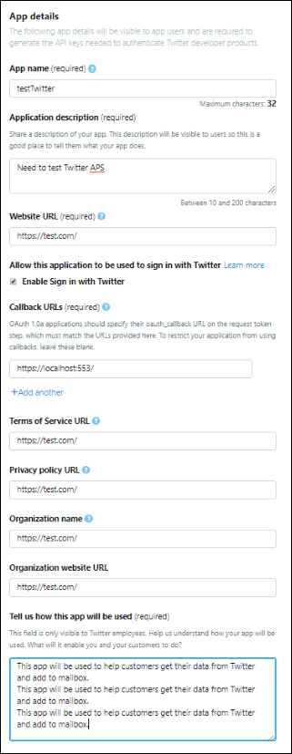

# Bereitstellen eines Connectors zum Archivieren von Twitter-Daten

Dieser Artikel enthält den schrittweisen Prozess zum Bereitstellen eines Connectors, der den Office 365 Import-Dienst zum Importieren von Daten aus dem Twitter-Konto Ihrer Organisation in Microsoft 365. Eine übersicht über diesen Prozess und eine Liste der erforderlichen Voraussetzungen für die Bereitstellung eines Twitter-Connectors finden Sie unter Einrichten eines Connectors zum Archivieren von [Twitter-Daten. ](archive-twitter-data-with-sample-connector.md) 

## Schritt 1: Erstellen einer App in Azure Active Directory

1. Wechseln Sie zu, und melden Sie <https://portal.azure.com> sich mit den Anmeldeinformationen eines globalen Administratorkontos an.

   

2. Klicken Sie im linken Navigationsbereich auf **Azure Active Directory**.

   

3. Klicken Sie im linken Navigationsbereich auf **App-Registrierungen (Vorschau)** und dann **auf Neue Registrierung**.

   

4. Registrieren Sie die Anwendung. Wählen **Sie unter Umleitungs-URI (optional)** **web** in der Dropdownliste Anwendungstyp aus, und geben Sie dann in das Feld für `https://portal.azure.com` den URI ein.

   

5. Kopieren Sie **die Anwendungs-ID (Client-)ID** und die **Verzeichnis-ID (Mandant),** und speichern Sie sie in einer Textdatei oder an einem anderen sicheren Speicherort. Sie verwenden diese IDs in späteren Schritten.

    

6. Wechseln Sie **zu Zertifikate & für die neue App,** und klicken Sie unter **Geheime Clientgeheimnisse** auf **Neuer Geheimer Clientgeheimnis**.

   

7. Erstellen Sie einen neuen geheimen Schlüssel. Geben Sie in das Feld Beschreibung den geheimen Schlüssel ein, und wählen Sie dann einen Ablaufzeitraum aus. 

   

8. Kopieren Sie den Wert des geheimen Schlüssels, und speichern Sie ihn in einer Textdatei oder einem anderen Speicherort. Dies ist der geheime AAD-Anwendungsgeheimnis, den Sie in späteren Schritten verwenden.

   

## Schritt 2: Bereitstellen des Connectorwebdiensts GitHub Ihrem Azure-Konto

1. Wechseln Sie [zu GitHub Website,](https://github.com/microsoft/m365-sample-twitter-connector-csharp-aspnet) und klicken Sie **auf Bereitstellen in Azure**.

    

2. Nachdem Sie auf **Bereitstellen in Azure** geklickt haben, werden Sie zu einem Azure-Portal mit einer benutzerdefinierten Vorlagenseite umgeleitet. Füllen Sie die **Grundlagen und** **Einstellungen** aus, und klicken Sie dann auf **Kaufen**.

   

    - **Abonnement:** Wählen Sie Ihr Azure-Abonnement aus, für das Sie den Twitter-Connector-Webdienst bereitstellen möchten.
    
    - **Ressourcengruppe:** Wählen oder erstellen Sie eine neue Ressourcengruppe. Eine Ressourcengruppe ist ein Container, der verwandte Ressourcen für eine Azure-Lösung enthält.

    - **Speicherort:** Wählen Sie einen Speicherort aus.

    - **Web-App-Name:** Geben Sie einen eindeutigen Namen für die Connector-Web-App an. Der Name Th muss zwischen 3 und 18 Zeichen lang sein. Dieser Name wird zum Erstellen der Azure-App-Dienst-URL verwendet. Wenn Sie z. B. den Web-App-Namen **von twitterconnector** angeben, wird die Azure-App-Dienst-URL **twitterconnector.azurewebsites.net**.
    
    - **tenantId:** Die Mandanten-ID Ihrer Microsoft 365, die Sie nach dem Erstellen der Facebook-Connector-App in Azure Active Directory in Schritt 1 kopiert haben.
    
   - **APISecretKey:** Sie können einen beliebigen Wert als geheimen Wert eingeben. Dies wird für den Zugriff auf die Connectorweb-App in Schritt 5 verwendet.

3. Nachdem die Bereitstellung erfolgreich war, sieht die Seite ähnlich dem folgenden Screenshot aus:

    

## Schritt 3: Erstellen der Twitter-App

1. Wechseln Sie zu , melden Sie sich mit den Anmeldeinformationen für das Entwicklerkonto für Ihre Organisation an, und klicken https://developer.twitter.com Sie dann auf **Apps**.

   
2. Klicken Sie **auf App erstellen.**
   
   

3. Fügen **Sie unter App-Details** Informationen zur Anwendung hinzu.

   

4. Wählen Sie im Twitter-Entwicklerdashboard die App aus, die Sie gerade erstellt haben, und klicken Sie dann auf **Details**.
   
   

5. Kopieren Sie **auf** der Registerkarte Schlüssel und Token unter **Consumer-API-Schlüssel** sowohl den API-Schlüssel als auch den geheimen API-Schlüssel, und speichern Sie sie in einer Textdatei oder einem anderen Speicherort. Klicken Sie dann auf **Erstellen,** um ein Zugriffstoken und einen geheimen Zugriffstoken zu generieren und diese in eine Textdatei oder einen anderen Speicherort zu kopieren.
   
   

   Klicken Sie dann auf **Erstellen,** um ein Zugriffstoken und einen geheimen Zugriffstoken zu generieren, und kopieren Sie diese in eine Textdatei oder einen anderen Speicherort.

6. Klicken Sie **auf die** Registerkarte Berechtigungen, und konfigurieren Sie die Berechtigungen wie im folgenden Screenshot dargestellt:

   

7. Nachdem Sie die Berechtigungseinstellungen gespeichert haben, klicken Sie auf die Registerkarte **App-Details,** und klicken Sie dann auf Bearbeiten > Bearbeiten details . 

   

8. Gehen Sie wie folgt vor:

   - Aktivieren Sie das Kontrollkästchen, damit sich die Connector-App bei Twitter anmelden kann.
   
   - Fügen Sie den #A0 im folgenden Format hinzu: **\<connectorserviceuri> /Views/TwitterOAuth**, wobei der Wert von *connectorserviceuri* die Azure-App-Dienst-URL für Ihre Organisation ist, z. B. https://twitterconnector.azurewebsites.net/Views/TwitterOAuth .

    

Die Twitter-Entwickler-App ist jetzt einsatzbereit.

## Schritt 4: Konfigurieren der Connectorweb-App 

1. Wechseln Sie zu https:// \<AzureAppResourceName> .azurewebsites.net (wobei **AzureAppResourceName** der Name Ihrer Azure-App-Ressource ist, die Sie in Schritt 4 benannt haben). Wenn der Name z. B. **twitterconnector ist,** wechseln Sie zu https://twitterconnector.azurewebsites.net . Die Startseite der App sieht wie der folgende Screenshot aus:

   

2. Klicken **Sie auf Konfigurieren,** um eine Anmeldeseite anzeigen zu können.

   

3. Geben Sie im Feld Mandanten-ID Ihre Mandanten-ID ein oder fügen Sie sie ein (die Sie in Schritt 2 erhalten haben). Geben Sie im Feld Kennwort den APISecretKey (den Sie in Schritt 2 erhalten haben) ein, oder fügen Sie ihn ein, und klicken Sie dann auf Konfigurationseinstellungen **festlegen Einstellungen,** um die Seite konfigurationsdetails anzuzeigen.

   

4. Geben Sie die folgenden Konfigurationseinstellungen ein 

   - **Twitter-Api-Schlüssel:** Der API-Schlüssel für die Twitter-Anwendung, die Sie in Schritt 3 erstellt haben.
   
   - **Geheimer Twitter-Api-Schlüssel:** Der geheime API-Schlüssel für die Twitter-Anwendung, die Sie in Schritt 3 erstellt haben.
   
   - **Twitter-Zugriffstoken:** Das Zugriffstoken, das Sie in Schritt 3 erstellt haben.
   
   - **Geheimer Twitter-Zugriffstoken:** Der geheime Zugriffstokengeheimnis, den Sie in Schritt 3 erstellt haben.
   
   - **AAD-Anwendungs-ID:** Die Anwendungs-ID für Azure Active Directory App, die Sie in Schritt 1 erstellt haben
   
   - **Geheimer AAD-Anwendungsgeheimnis:** Der Wert für den geheimen APISecretKey-Schlüssel, den Sie in Schritt 1 erstellt haben.

5. Klicken Sie **auf Speichern,** um die Connectoreinstellungen zu speichern.

## Schritt 5: Einrichten eines Twitter-Connectors im Microsoft 365 Compliance Center

1. Wechseln Sie [https://compliance.microsoft.com](https://compliance.microsoft.com) zu,  und klicken Sie dann im linken Navigations navi auf Datenconnectors.

2. Klicken Sie **auf der** Seite Datenconnectors unter **Twitter** auf **Anzeigen**.

3. Klicken Sie **auf der Seite Twitter** auf Connector **hinzufügen.**

4. Klicken Sie **auf der Seite Nutzungsbedingungen** auf **Akzeptieren**.

5. Geben Sie **auf der Seite Anmeldeinformationen für Ihre Connector-App** hinzufügen die folgenden Informationen ein, und klicken Sie dann **auf Verbindung überprüfen.**

   

    - Geben Sie **im Feld Name** einen Namen für den Connector ein, z. B. Die Hilfe von **Twitter.**
    
    - Geben Sie **im Feld Connector-URL** die Azure-App-Dienst-URL ein oder fügen Sie sie ein. beispiel: `https://twitterconnector.azurewebsites.net` .
    
    - Geben Sie **im Feld Kennwort** den Wert des APISecretKey ein, den Sie in Schritt 2 erstellt haben.
    
    - Geben Sie **im Feld Azure App ID** den Wert der Azure-Anwendungs-App-ID (auch Client-ID genannt) ein, den Sie in Schritt 1 erhalten haben. 

6. Nachdem die Verbindung erfolgreich überprüft wurde, klicken Sie auf **Weiter**.

7. Geben Sie **auf Microsoft 365 Seite** Zum Importieren von Daten autorisieren den APISecretKey erneut ein, oder fügen Sie ihn ein, und klicken Sie dann auf **Anmeldeweb-App**.

8. Klicken Sie **auf Anmelden mit Twitter**.

9. Melden Sie sich auf der Twitter-Anmeldeseite mit den Anmeldeinformationen für das Twitter-Konto Ihrer Organisation an.

   

   Nach der Anmeldung wird auf der Twitter-Seite die folgende Meldung angezeigt: "Twitter Connector-Auftrag wurde erfolgreich eingerichtet".

10. Klicken **Sie auf Weiter,** um die Einrichtung des Twitter-Connectors zu abschließen.

11. Auf der **Seite Filter festlegen** können Sie einen Filter anwenden, um elemente zu importieren, die ein bestimmtes Alter haben. Wählen Sie ein Alter aus, und klicken Sie dann auf **Weiter**.

12. Geben Sie **auf der** Seite Speicherort auswählen die E-Mail-Adresse des Microsoft 365 ein, in das die Twitter-Elemente importiert werden sollen, und klicken Sie dann auf **Weiter**.

13. Klicken **Sie auf Weiter,** um die Connectoreinstellungen zu überprüfen, und klicken Sie dann auf **Fertig** stellen, um die Connectoreinrichtung abzuschließen.

14. Wechseln Sie im Compliance  Center zur Seite Datenconnectors, und klicken Sie auf die Registerkarte **Connectors,** um den Fortschritt des Importvorgangs zu sehen.
