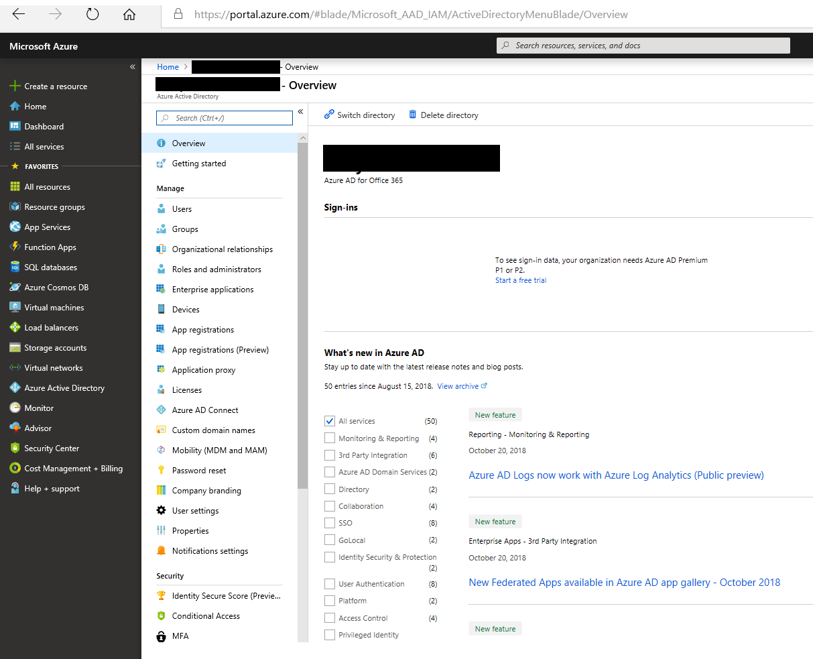
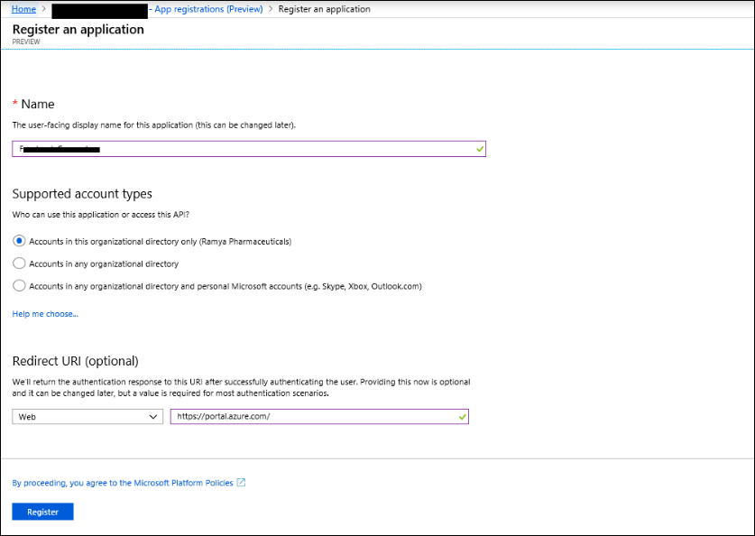

# Bereitstellen eines Connectors zum Archivieren von Twitter-Daten

Dieser Artikel enthält den schrittweisen Prozess zum Bereitstellen eines Connectors, der den Office 365 Importdienst verwendet, um Daten aus dem Twitter-Konto Ihrer Organisation in Microsoft 365 zu importieren. Eine allgemeine Übersicht über diesen Prozess und eine Liste der erforderlichen Komponenten für die Bereitstellung eines Twitter-Connectors finden Sie unter ["Einrichten eines Connectors zum Archivieren von Twitter-Daten". ](archive-twitter-data-with-sample-connector.md)

## Schritt 1: Erstellen einer App in Azure Active Directory

1. Rufen Sie <https://portal.azure.com> die Anmeldeinformationen eines globalen Administratorkontos auf, und melden Sie sich an.

   

2. Klicken Sie im linken Navigationsbereich auf **Azure Active Directory**.

   

3. Klicken Sie im linken Navigationsbereich auf **App-Registrierungen (Vorschau),** und klicken Sie dann auf **"Neue Registrierung".**

   

4. Registrieren Sie die Anwendung. Wählen Sie unter **Umleitungs-URI (optional)** in der Dropdownliste für den Anwendungstyp **"Web"** aus, und geben Sie dann `https://portal.azure.com` das Feld für den URI ein.

   

5. Kopieren Sie die **Anwendungs-ID (Client)-ID** und **die Verzeichnis-ID (Mandanten-ID),** und speichern Sie sie in einer Textdatei oder an einem anderen sicheren Speicherort. Sie verwenden diese IDs in späteren Schritten.

    

6. Wechseln Sie zu **Zertifikate & geheimen Schlüssel für die neue App,** und klicken Sie unter **"Geheime Clientschlüssel"** auf **"Neuer geheimer Clientschlüssel".**

   

7. Erstellen Sie einen neuen geheimen Schlüssel. Geben Sie im Beschreibungsfeld den geheimen Schlüssel ein, und wählen Sie dann einen Ablaufzeitraum aus.

   

8. Kopieren Sie den Wert des geheimen Schlüssels, und speichern Sie ihn in einer Textdatei oder an einem anderen Speicherort. Dies ist der geheime AAD-Anwendungsschlüssel, den Sie in späteren Schritten verwenden.

   

## Schritt 2: Bereitstellen des Connectorwebdiensts von GitHub auf Ihrem Azure-Konto

1. Wechseln Sie zu [dieser GitHub Website,](https://github.com/microsoft/m365-sample-twitter-connector-csharp-aspnet) und klicken Sie auf **"Bereitstellen in Azure".**

    

2. Nachdem Sie auf **"Bereitstellen in Azure"** geklickt haben, werden Sie mit einer benutzerdefinierten Vorlagenseite zu einem Azure-Portal umgeleitet. Geben Sie die **Grundlagen** und **Einstellungen** Details ein, und klicken Sie dann auf **"Kaufen".**

   

    - **Abonnement:** Wählen Sie Ihr Azure-Abonnement aus, in dem Sie den Twitter Connector-Webdienst bereitstellen möchten.

    - **Ressourcengruppe:** Wählen Oder erstellen Sie eine neue Ressourcengruppe. Eine Ressourcengruppe ist ein Container, der verwandte Ressourcen für eine Azure-Lösung enthält.

    - **Speicherort:** Wählen Sie einen Speicherort aus.

    - **Name der Web-App:** Geben Sie einen eindeutigen Namen für die Connector-Web-App an. Der Name muss zwischen 3 und 18 Zeichen lang sein. Dieser Name wird zum Erstellen der Azure-App-Dienst-URL verwendet. Wenn Sie beispielsweise den Web-App-Namen von **twitterconnector** angeben, wird die URL des Azure-App-Diensts **twitterconnector.azurewebsites.net.**

    - **tenantId:** Die Mandanten-ID Ihrer Microsoft 365 Organisation, die Sie nach dem Erstellen der Facebook-Connector-App in Azure Active Directory in Schritt 1 kopiert haben.

   - **APISecretKey:** Sie können einen beliebigen Wert als geheimen Schlüssel eingeben. Dies wird verwendet, um auf die Connector-Web-App in Schritt 5 zuzugreifen.

3. Nachdem die Bereitstellung erfolgreich war, sieht die Seite ähnlich wie im folgenden Screenshot aus:

    

## Schritt 3: Erstellen der Twitter-App

1. Wechseln Sie zu https://developer.twitter.com , melden Sie sich mit den Anmeldeinformationen für das Entwicklerkonto für Ihre Organisation an, und klicken Sie dann auf **"Apps".**

   
2. Klicken Sie auf **"App erstellen".**

   

3. Fügen Sie unter **App-Details** Informationen zur Anwendung hinzu.

   

4. Wählen Sie im Twitter-Entwicklerdashboard die App aus, die Sie soeben erstellt haben, und klicken Sie dann auf **"Details".**

   

5. Kopieren Sie auf der Registerkarte **"Schlüssel und Token"** unter **"Consumer-API-Schlüssel"** sowohl den API-Schlüssel als auch den geheimen API-Schlüssel, und speichern Sie sie in einer Textdatei oder an einem anderen Speicherort. Klicken Sie dann auf **"Erstellen",** um ein Zugriffstoken und einen geheimen Zugriffstokenschlüssel zu generieren und diese in eine Textdatei oder einen anderen Speicherort zu kopieren.

   

   Klicken Sie dann auf **"Erstellen",** um ein Zugriffstoken und einen geheimen Zugriffstokenschlüssel zu generieren, und kopieren Sie diese in eine Textdatei oder einen anderen Speicherort.

6. Klicken Sie auf die Registerkarte **"Berechtigungen",** und konfigurieren Sie die Berechtigungen wie im folgenden Screenshot dargestellt:

   

7. Klicken Sie nach dem Speichern der Berechtigungseinstellungen auf die Registerkarte **"App-Details"** und dann auf **"Bearbeiten > Details bearbeiten".**

   

8. Führen Sie die folgenden Aufgaben aus:

   - Aktivieren Sie das Kontrollkästchen, damit sich die Connector-App bei Twitter anmelden kann.

   - Fügen Sie den OAuth-Umleitungs-URI mit dem folgenden Format hinzu: **\<connectorserviceuri> /Views/TwitterOAuth**, wobei der Wert von *connectorserviceuri* die AZURE-App-Dienst-URL für Ihre Organisation ist, z. https://twitterconnector.azurewebsites.net/Views/TwitterOAuth B. .

    

Die Twitter-Entwickler-App kann jetzt verwendet werden.

## Schritt 4: Konfigurieren der Connector-Web-App

1. Wechseln Sie zu https:// \<AzureAppResourceName> .azurewebsites.net (wobei **AzureAppResourceName** der Name Ihrer Azure-App-Ressource ist, die Sie in Schritt 4 benannt haben). Wenn der Name z. B. **twitterconnector** ist, wechseln Sie zu https://twitterconnector.azurewebsites.net . Die Startseite der App sieht wie im folgenden Screenshot aus:

   

2. Klicken Sie auf **"Konfigurieren",** um eine Anmeldeseite anzuzeigen.

   

3. Geben Sie im Feld "Mandanten-ID" Ihre Mandanten-ID (die Sie in Schritt 2 abgerufen haben) ein, oder fügen Sie sie ein. Geben Sie im Kennwortfeld den APISecretKey (den Sie in Schritt 2 erhalten haben) ein, oder fügen Sie ihn ein, und klicken Sie dann auf **"Konfiguration festlegen" Einstellungen,** um die Seite mit den Konfigurationsdetails anzuzeigen.

   

4. Geben Sie die folgenden Konfigurationseinstellungen ein:

   - **Twitter-API-Schlüssel:** Der API-Schlüssel für die Twitter-Anwendung, die Sie in Schritt 3 erstellt haben.

   - **Geheimer Twitter-Api-Schlüssel:** Der geheime API-Schlüssel für die Twitter-Anwendung, die Sie in Schritt 3 erstellt haben.

   - **Twitter-Zugriffstoken:** Das Zugriffstoken, das Sie in Schritt 3 erstellt haben.

   - **Geheimer Twitter-Zugriffstokenschlüssel:** Der geheime Zugriffstokenschlüssel, den Sie in Schritt 3 erstellt haben.

   - **AAD-Anwendungs-ID:** Die Anwendungs-ID für die Azure Active Directory App, die Sie in Schritt 1 erstellt haben

   - **Geheimer AAD-Anwendungsschlüssel:** Der Wert für den geheimen APISecretKey-Schlüssel, den Sie in Schritt 1 erstellt haben.

5. Klicken Sie auf **"Speichern",** um die Connectoreinstellungen zu speichern.

## Schritt 5: Einrichten eines Twitter-Connectors im Microsoft 365 Compliance Center

1. Wechseln Sie zu [https://compliance.microsoft.com](https://compliance.microsoft.com) und klicken Sie dann im linken Navigationsbereich auf **Datenconnectors.**

2. Klicken Sie auf der Seite **"Datenconnectors"** unter **Twitter** auf **"Anzeigen".**

3. Klicken Sie auf der **Twitter-Seite** auf **Connector hinzufügen.**

4. Klicken Sie auf der Seite **"Nutzungsbedingungen"** auf **"Annehmen".**

5. Geben Sie auf der Seite **"Anmeldeinformationen für Ihre Connector-App hinzufügen"** die folgenden Informationen ein, und klicken Sie dann auf **"Verbindung überprüfen".**

   

    - Geben Sie im **Feld "Name"** einen Namen für den Connector ein, **z. B. die Twitter-Hilfebehandlung.**

    - Geben Sie im **Feld "Connector-URL"** die URL des Azure-App-Diensts ein, oder fügen Sie sie ein. Beispiel: `https://twitterconnector.azurewebsites.net` .

    - Geben Sie im **Feld "Kennwort"** den Wert des APISecretKey ein, den Sie in Schritt 2 erstellt haben, oder fügen Sie ihn ein.

    - Geben Sie im **Feld "Azure-App-ID"** den Wert der Azure-Anwendungs-App-ID (auch *client-ID* genannt) ein, die Sie in Schritt 1 abgerufen haben, oder fügen Sie ihn ein.

6. Nachdem die Verbindung erfolgreich überprüft wurde, klicken Sie auf **"Weiter".**

7. Geben Sie auf der **Seite "Autorisieren Microsoft 365 zum Importieren** von Daten" den APISecretKey erneut ein, oder fügen Sie ihn ein, und klicken Sie dann auf **"Web-App anmelden".**

8. Klicken Sie auf **"Mit Twitter anmelden".**

9. Melden Sie sich auf der Twitter-Anmeldeseite mit den Anmeldeinformationen für das Twitter-Konto Ihrer Organisation an.

   

   Nach der Anmeldung wird auf der Twitter-Seite die folgende Meldung angezeigt: "Twitter Connector Job Successfully set up".

10. Klicken Sie auf **"Weiter",** um die Einrichtung des Twitter-Connectors abzuschließen.

11. Auf der Seite **"Filter festlegen"** können Sie einen Filter anwenden, um zunächst Elemente mit einem bestimmten Alter zu importieren. Wählen Sie ein Alter aus, und klicken Sie dann auf **"Weiter".**

12. Geben Sie auf der Seite **"Speicherort auswählen"** die E-Mail-Adresse Microsoft 365 Postfach ein, in das die Twitter-Elemente importiert werden, und klicken Sie dann auf **"Weiter".**

13. Klicken Sie auf **"Weiter",** um die Connectoreinstellungen zu überprüfen, und klicken Sie dann auf **"Fertig stellen",** um die Connectoreinrichtung abzuschließen.

14. Wechseln Sie im Compliance Center zur Seite **"Datenconnectors",** und klicken Sie auf die Registerkarte **"Connectors",** um den Fortschritt des Importvorgangs anzuzeigen.
