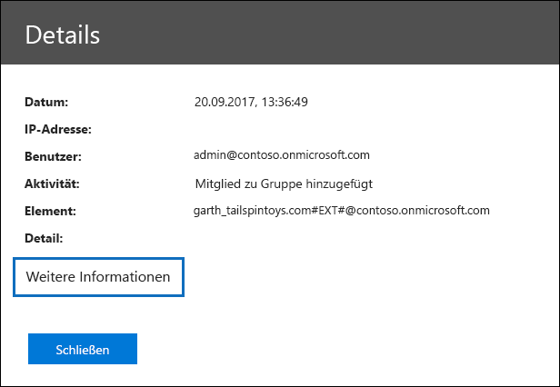

# Detaillierte Eigenschaften im ÜberwachungsprotokollDetailed properties in the audit log

Wenn Sie die Ergebnisse einer Überwachungsprotokoll Suche aus dem Security & Compliance Center exportieren, haben Sie die Möglichkeit, alle Ergebnisse herunterzuladen, die Ihren Suchkriterien entsprechen.When you export the results of an audit log search from the Security & Compliance Center, you have the option to download all the results that meet your search criteria. Wählen Sie dazu **Export Ergebnisse** \> **alle Ergebnisse herunterladen** auf der Seite **Überwachungsprotokoll Suche** aus.You do this by selecting **Export results** \> **Download all results** on the **Audit log search** page. Weitere Informationen finden Sie unter [Durchsuchen des Überwachungsprotokolls](search-the-audit-log-in-security-and-compliance.md).For more information, see [Search the audit log](search-the-audit-log-in-security-and-compliance.md).
  
 Wenn Sie alle Ergebnisse für eine Überwachungsprotokoll Suche exportieren, werden die Rohdaten aus dem vereinheitlichten Überwachungsprotokoll in eine CSV-Datei (Comma-Separated Value) kopiert, die auf den lokalen Computer heruntergeladen wird.When your export all results for an audit log search, the raw data from the unified audit log is copied to a comma-separated value (CSV) file that is downloaded to your local computer. Diese Datei enthält zusätzliche Informationen aus jedem Überwachungseintrag in einer Spalte mit dem Namen **Auditdata**.This file contains additional information from each audit record in a column named **AuditData**. Diese Spalte enthält eine mehrwertige Eigenschaft für mehrere Eigenschaften aus dem Überwachungsprotokolleintrag.This column contains a multi-value property for multiple properties from the audit log record. Jedes der **Eigenschaft: Wert** -Paare in dieser mehrwertigen Eigenschaft werden durch ein Komma getrennt.Each of the **property: value** pairs in this multi-value property are separated by a comma. 
  
In der folgenden Tabelle werden die Eigenschaften beschrieben, die (je nach Dienst, in dem ein Ereignis auftritt) in der **Auditdata** -Spalte mit mehreren Eigenschaften enthalten sind.The following table describes the properties that are included (depending on the service in which an event occurs) in the multi-property **AuditData** column. Der **Office 365 Dienst mit dieser Eigenschafts** Spalte gibt den Dienst und den Aktivitätstyp (Benutzer oder Administrator) an, der die Eigenschaft enthält.The **Office 365 service that has this property** column indicates the service and type of activity (user or admin) that includes the property. Ausführlichere Informationen zu diesen Eigenschaften oder zu Eigenschaften, die in diesem Thema möglicherweise nicht aufgeführt sind, finden Sie unter [Management Activity API Schema](https://go.microsoft.com/fwlink/p/?LinkId=717993).For more detailed information about these properties or about properties that may not be listed in this topic, see [Management Activity API Schema](https://go.microsoft.com/fwlink/p/?LinkId=717993).
  
> [!TIP]
> Sie können das JSON-Transformations Feature in Power Query in Excel verwenden, um die **Auditdata** -Spalte in mehrere Spalten aufzuteilen, sodass jede Eigenschaft eine eigene Spalte aufweist.You can use the JSON transform feature in Power Query in Excel to split the **AuditData** column into multiple columns so that each property has its own column. Dadurch können Sie nach einer oder mehreren dieser Eigenschaften sortieren und filtern.This lets you sort and filter on one or more of these properties. Weitere Informationen hierzu finden Sie unter [exportieren, konfigurieren und Anzeigen von Überwachungsprotokolldaten Sätzen](export-view-audit-log-records.md).To learn how to do this, see [Export, configure, and view audit log records](export-view-audit-log-records.md). 
  
|**Eigenschaft****Property**|**Beschreibung****Description**|**Microsoft 365-Dienst mit dieser Eigenschaft****Microsoft 365 service that has this property**|
|:-----|:-----|:-----|
|AkteurActor|Das Benutzer-oder Dienstkonto, das die Aktion ausgeführt hat.The user or service account that performed the action.|Azure Active DirectoryAzure Active Directory|
|AddOnNameAddOnName|Der Name eines Add-ons, das in einem Team hinzugefügt, entfernt oder aktualisiert wurde.The name of an add-on that was added, removed, or updated in a team. Der Typ von Add-ons in Microsoft Teams ist ein bot, ein Konnektor oder ein Tab.The type of add-ons in Microsoft Teams is a bot, a connector, or a tab.|Microsoft TeamsMicrosoft Teams|
|AddOnTypeAddOnType|Der Typ eines Add-ons, das in einem Team hinzugefügt, entfernt oder aktualisiert wurde.The type of an add-on that was added, removed, or updated in a team. Die folgenden Werte geben den Typ des Add-ons an.The following values indicate the type of add-on.    **1** – gibt einen bot an.**1** - Indicates a bot.  **2** – gibt einen Konnektor an.**2** - Indicates a connector.  **3** -gibt eine Registerkarte an.**3** - Indicates a tab.|Microsoft TeamsMicrosoft Teams|
|AzureActiveDirectoryEventTypeAzureActiveDirectoryEventType|Der Typ des Azure Active Directory-Ereignisses.The type of Azure Active Directory event. Die folgenden Werte geben den Typ des Ereignisses an.The following values indicate the type of event.    **0** -gibt ein Konto Anmeldeereignis an.**0** - Indicates an account login event.  **1** – gibt ein Azure-Anwendungs Sicherheitsereignis an.**1** - Indicates an Azure application security event.|Azure Active DirectoryAzure Active Directory|
|ChannelGuidChannelGuid|Die ID eines Microsoft Teams-Kanals.The ID of a Microsoft Teams channel. Das Team, in dem sich der Kanal befindet, wird durch die Eigenschaften **Teamname** und **TeamGuid** identifiziert.The team that the channel is located in is identified by the **TeamName** and **TeamGuid** properties.|Microsoft TeamsMicrosoft Teams|
|ChannelNameChannelName|Der Name eines Microsoft Teams-Kanals.The name of a Microsoft Teams channel. Das Team, in dem sich der Kanal befindet, wird durch die Eigenschaften **Teamname** und **TeamGuid** identifiziert.The team that the channel is located in is identified by the **TeamName** and **TeamGuid** properties.|Microsoft TeamsMicrosoft Teams|
|ClientClient|Das Clientgerät, das Gerätebetriebssystem und der für das Anmeldeereignis verwendete Gerätebrowser (beispielsweise Nokia 920; Windows Phone 8; IE Mobile 11).The client device, the device OS, and the device browser used for the login event (for example, Nokia Lumia 920; Windows Phone 8; IE Mobile 11).|Azure Active DirectoryAzure Active Directory|
|ClientInfoStringClientInfoString|Informationen zum e-Mail-Client, der zum Ausführen des Vorgangs verwendet wurde, beispielsweise eine Browserversion, Outlook-Version und Informationen zu mobilen GerätenInformation about the email client that was used to perform the operation, such as a browser version, Outlook version, and mobile device information|Exchange (Post Fach Aktivität)Exchange (mailbox activity)|
|ClientIPClientIP|Die IP-Adresse des Geräts, das verwendet wurde, als die Aktivität protokolliert wurde. Die IP-Adresse wird entweder im Format IPv4 oder im Format IPv6 angezeigt.The IP address of the device that was used when the activity was logged. The IP address is displayed in either an IPv4 or IPv6 address format.   Bei einigen Diensten ist der in dieser Eigenschaft angezeigte Wert möglicherweise die IP-Adresse einer vertrauenswürdigen Anwendung (z. B. Office in den Web-Apps), die sich anstelle eines Benutzers in den Dienst einwählt, und nicht die IP-Adresse des Geräts, das von der Person, die die Aktivität ausgeführt hat, verwendet wird.For some services, the value displayed in this property might be the IP address for a trusted application (for example, Office on the web apps) calling into the service on behalf of a user and not the IP address of the device used by person who performed the activity.   Für Administratoraktivitäten (oder Aktivitäten, die von einem Systemkonto ausgeführt werden) bei Azure-Active Directory bezogenen Ereignissen wird die IP-Adresse nicht protokolliert, und der Wert für die ClientIP-Eigenschaft lautet `null` .Also, for admin activity (or activity performed by a system account) for Azure Active Directory-related events, the IP address isn't logged and the value for the ClientIP property is `null`. |Azure Active Directory, Exchange, SharePointAzure Active Directory, Exchange, SharePoint|
|CreationTimeCreationTime|Das Datum und die Uhrzeit in koordinierter Weltzeit (UTC), wann der Benutzer die Aktivität ausgeführt hat.The date and time in Coordinated Universal Time (UTC) when the user performed the activity.|AlleAll|
|DestinationFileExtensionDestinationFileExtension|Der Erweiterung der Datei, die kopiert oder verschoben wurde.The file extension of a file that is copied or moved. Diese Eigenschaft wird nur für die Aktivitäten filecopied und filemigrationed User angezeigt.This property is displayed only for the FileCopied and FileMoved user activities.|SharePointSharePoint|
|DestinationFileNameDestinationFileName|Der Name der Datei wird kopiert oder verschoben.The name of the file is copied or moved. Diese Eigenschaft wird nur für die filecopied-und fileactions-Aktionen angezeigt.This property is displayed only for the FileCopied and FileMoved actions.|SharePointSharePoint|
|DestinationRelativeUrlDestinationRelativeUrl|Die URL des Zielordners, in den eine Datei kopiert oder verschoben wurde.The URL of the destination folder where a file is copied or moved. Die Kombination der Werte für die **SiteUrl**, die **DestinationRelativeURL** und die **destinationFileName** -Eigenschaft ist identisch mit dem Wert für die **objectID** -Eigenschaft, bei der es sich um den vollständigen Pfadnamen für die kopierte Datei handelt.The combination of the values for the **SiteURL**, the **DestinationRelativeURL**, and the **DestinationFileName** property is the same as the value for the **ObjectID** property, which is the full path name for the file that was copied. Diese Eigenschaft wird nur für die Aktivitäten filecopied und filemigrationed User angezeigt.This property is displayed only for the FileCopied and FileMoved user activities.|SharePointSharePoint|
|EventSourceEventSource|Gibt an, dass ein Ereignis in SharePoint eingetreten ist.Identifies that an event occurred in SharePoint. Mögliche Werte sind **SharePoint** und **ObjectModel**.Possible values are **SharePoint** and **ObjectModel**.|SharePointSharePoint|
|ExternalAccessExternalAccess|Gibt für Exchange-Administratoraktivitäten an, ob das Cmdlet von einem Benutzer in Ihrer Organisation, von Mitarbeitern des Microsoft-Rechenzentrums oder von einem Rechenzentrum-Dienstkonto oder von einem Delegierten Administrator ausgeführt wurde.For Exchange admin activity, specifies whether the cmdlet was run by a user in your organization, by Microsoft datacenter personnel or a datacenter service account, or by a delegated administrator. Der Wert **False** gibt an, dass das Cmdlet von einer Person in Ihrer Organisation ausgeführt wurde.The value **False** indicates that the cmdlet was run by someone in your organization. Der Wert **True** gibt an, dass das Cmdlet von Mitarbeiter des Rechenzentrums, einem Rechenzentrum-Dienstkonto oder einem delegierten Administrator ausgeführt wurde.The value **True** indicates that the cmdlet was run by datacenter personnel, a datacenter service account, or a delegated administrator.    Gibt für Exchange-Post Fach Aktivität an, ob ein Benutzer außerhalb Ihrer Organisation auf ein Postfach zugegriffen hat.For Exchange mailbox activity, specifies whether a mailbox was accessed by a user outside your organization.|ExchangeExchange|
|ExtendedPropertiesExtendedProperties|Die erweiterten Eigenschaften für ein Azure Active Directory-Ereignis.The extended properties for an Azure Active Directory event.|Azure Active DirectoryAzure Active Directory|
|IDID|Die ID des Berichts Eintrags.The ID of the report entry. Die ID identifiziert den Berichtseintrag eindeutig.The ID uniquely identifies the report entry.|AlleAll|
|InternalLogonTypeInternalLogonType|Für die interne Verwendung reserviert.Reserved for internal use.|Exchange (Post Fach Aktivität)Exchange (mailbox activity)|
|ItemTypeItemType|Der Typ des Objekts, auf das zugegriffen bzw. das geändert wurde.The type of object that was accessed or modified. Mögliche Werte sind **File**-, **Folder**-, **Web**-, **Site**-, **Mandanten**-und **DocumentLibrary**.Possible values include **File**, **Folder**, **Web**, **Site**, **Tenant**, and **DocumentLibrary**.|SharePointSharePoint|
|LoginStatusLoginStatus|Identifiziert Anmeldefehler, die möglicherweise aufgetreten sind.Identifies login failures that might have occurred.|Azure Active DirectoryAzure Active Directory|
|LogonTypeLogonType|Der Typ des Postfachzugriffs.The type of mailbox access. Die folgenden Werte geben den Typ des Benutzers an, der auf das Postfach zugegriffen hat.The following values indicate the type of user who accessed the mailbox.     **0** – gibt einen Postfachbesitzer an.**0** - Indicates a mailbox owner.  **1** – gibt einen Administrator an.**1** - Indicates an administrator.  **2** – gibt einen Delegaten an.**2** - Indicates a delegate.  **3** – gibt den Transportdienst im Microsoft-Datencenter an.**3** - Indicates the transport service in the Microsoft datacenter.  **4** – gibt ein Dienstkonto im Microsoft-Datencenter an.**4** - Indicates a   service account in the Microsoft datacenter.  **6** – gibt einen delegierten Administrator an.**6** - Indicates a delegated administrator.|Exchange (Post Fach Aktivität)Exchange (mailbox activity)|
|MailboxGuidMailboxGuid|Die Exchange-GUID des Postfachs, auf das zugegriffen wurde.The Exchange GUID of the mailbox that was accessed.|Exchange (Post Fach Aktivität)Exchange (mailbox activity)|
|MailboxOwnerUPNMailboxOwnerUPN|Die E-Mail-Adresse der Person, die das Postfach besitzt, auf das zugegriffen wurde.The email address of the person who owns the mailbox that was accessed.|Exchange (Post Fach Aktivität)Exchange (mailbox activity)|
|MembersMembers|Listet die Benutzer auf, die einem Team hinzugefügt oder daraus entfernt wurden.Lists the users that have been added or removed from a team. Die folgenden Werte geben den Rollentyp an, der dem Benutzer zugewiesen wurde.The following values indicate the Role type assigned to the user.     **1** – gibt die Besitzerrolle an.**1** - Indicates  the Owner role.  **2** - Gibt die Mitgliedsrolle an.**2** - Indicates the Member role.  **3** - Gibt die Gastrolle an.**3** - Indicates the Guest role.   Die Eigenschaft „Mitglieder“ enthält auch den Namen Ihrer Organisation und die E-Mail-Adresse des Mitglieds.The Members property also includes the name of your organization, and the member's email address.|Microsoft TeamsMicrosoft Teams|
|ModifiedProperties (Name, Neuwert, oldValue)ModifiedProperties (Name, NewValue, OldValue)|Diese Eigenschaft wird für Administratorereignisse einbezogen, wie z. B. das Hinzufügen eines Benutzers als Mitglied einer Website oder der Administratorgruppe einer Websitesammlung.The property is included for admin events, such as adding a user as a member of a site or a site collection admin group. Die Eigenschaft enthält den Namen der Eigenschaft, die geändert wurde (beispielsweise die Websiteadministratorgruppe), den neuen Wert der geänderten Eigenschaft (beispielsweise den Benutzer, der als Websiteadministrator hinzugefügt wurde, und den vorherigen Wert des geänderten Objekts).The property includes the name of the property that was modified (for example, the Site Admin group) the new value of the modified property (such the user who was added as a site admin, and the previous value of the modified object.|All (Administrator Aktivität)All (admin activity)|
|ObjectIdObjectId|Für Exchange-Verwaltungsüberwachungsprotokolle der Name des Objekts, das vom Cmdlet geändert wurde.For Exchange admin audit logging, the name of the object that was modified by the cmdlet.    Für SharePoint-Aktivitäten der vollständige URL-Pfadname der Datei oder des Ordners, auf die ein Benutzer zugegriffen hat.For SharePoint activity, the full URL path name of the file or folder accessed by a user.    Für Azure AD Aktivität der Name des Benutzerkontos, das geändert wurde.For Azure AD activity, the name of the user account that was modified.|AlleAll|
|VorgangOperation|Der Name der Benutzer- oder Verwaltungsaktivität.The name of the user or admin activity. Der Wert dieser Eigenschaft entspricht dem Wert, der in der Dropdownliste **Aktivitäten** ausgewählt wurde.The value of this property corresponds to the value that was selected in the **Activities** drop down list. Wenn **Ergebnisse für alle Aktivitäten anzeigen** ausgewählt wurde, enthält der Bericht Einträge für alle Benutzer-und Administratoraktivitäten für alle Dienste.If **Show results for all activities** was selected, the report will included entries for all user and admin activities for all services. Eine Beschreibung der Vorgänge/Aktivitäten, die im Überwachungsprotokoll protokolliert werden, finden Sie auf der Registerkarte über **wachte Aktivitäten** unter [Durchsuchen des Überwachungsprotokolls im Office 365](search-the-audit-log-in-security-and-compliance.md).For a description of the operations/activities that are logged in the audit log, see the **Audited activities** tab in [Search the audit log in the Office 365](search-the-audit-log-in-security-and-compliance.md).    Für Exchange-Administratoraktivitäten gibt diese Eigenschaft den Namen des Cmdlets an, das ausgeführt wurde.For Exchange admin activity, this property identifies the name of the cmdlet that was run.|AlleAll|
|OrganizationIdOrganizationId|Die GUID für Ihre Organisation.The GUID for your organization.|AlleAll|
|PfadPath|Der Name des Postfachordners, in dem sich die Nachricht, auf die zugegriffen wurde, befindet.The name of the mailbox folder where the message that was accessed is located. Diese Eigenschaft identifiziert auch den Ordner a, in dem eine Nachricht erstellt oder kopiert/verschoben wird.This property also identifies the folder a where a message is created in or copied/moved to.|Exchange (Post Fach Aktivität)Exchange (mailbox activity)|
|ParameterParameters|Für die Exchange-Administrator Aktivität der Name und der Wert für alle Parameter, die mit dem Cmdlet verwendet wurden, das in der Operation-Eigenschaft angegeben ist.For Exchange admin activity, the name and value for all parameters that were used with the cmdlet that is identified in the Operation property.|Exchange (Administrator Aktivität)Exchange (admin activity)|
|RecordTypeRecordType|Der vom Datensatz angegebene Vorgangstyp.The type of operation indicated by the record. Diese Eigenschaft gibt den Dienst oder das Feature an, in dem der Vorgang ausgelöst wurde.This property indicates the service or feature that the operation was triggered in. Eine Liste der Datensatztypen und der dazugehörigen Enumerationswerte (Dies ist der Wert, der in der **RecordType** -Eigenschaft in einem Überwachungseintrag angezeigt wird) finden Sie unter [Audit Log Record Type](https://docs.microsoft.com/office/office-365-management-api/office-365-management-activity-api-schema#auditlogrecordtype).For a list of record types and their corresponding ENUM value (which is the value displayed in the **RecordType** property in an audit record), see [Audit log record type](https://docs.microsoft.com/office/office-365-management-api/office-365-management-activity-api-schema#auditlogrecordtype).| 
|ResultStatusResultStatus|Gibt an, ob die Aktion (in der **Operation** -Eigenschaft angegeben) erfolgreich war oder nicht.Indicates whether the action (specified in the **Operation** property) was successful or not.    Für die Exchange-Administrator Aktivität ist der Wert entweder **true** (erfolgreich) oder **false** (fehlerhaft).For Exchange admin activity, the value is either **True** (successful) or **False** (failed).|AlleAll   |
|SecurityComplianceCenterEventTypeSecurityComplianceCenterEventType|Gibt an, dass es sich bei der Aktivität um ein Sicherheits & Compliance Center-Ereignis handelt.Indicates that the activity was a Security & Compliance Center event. Alle Aktivitäten des Security & Compliance Center haben für diese Eigenschaft den Wert " **0** ".All Security & Compliance Center activities will have a value of **0** for this property.|Security & Compliance CenterSecurity & Compliance Center|
|SharingTypeSharingType|Der Typ der Freigabeberechtigungen, die dem Benutzer zugewiesen wurden, für den die Ressource freigegeben wurde.The type of sharing permissions that was assigned to the user that the resource was shared with. Dieser Benutzer wird in der **UserSharedWith** -Eigenschaft angegeben.This user is identified in the **UserSharedWith** property.|SharePointSharePoint|
|WebsiteSite|Die GUID der Website, auf der sich die Datei oder der Ordner, auf die bzw. den der Benutzer zugegriffen hat, befindet.The GUID of the site where the file or folder accessed by the user is located.|SharePointSharePoint|
|SiteUrlSiteUrl|Die URL der Website, auf der sich die Datei oder der Ordner, auf die bzw. den der Benutzer zugegriffen hat, befindet.The URL of the site where the file or folder accessed by the user is located.|SharePointSharePoint|
|SourceFileExtensionSourceFileExtension|Die Erweiterung der Datei, auf die der Benutzer zugegriffen hat.The file extension of the file that was accessed by the user. Diese Eigenschaft ist leer, wenn das Objekt, auf das zugegriffen wurde, ein Ordner ist.This property is blank if the object that was accessed is a folder.|SharePointSharePoint|
|SourceFileNameSourceFileName|Der Name der Datei oder des Ordners, auf die der Benutzer zugegriffen hat.The name of the file or folder accessed by the user.|SharePointSharePoint|
|SourceRelativeUrlSourceRelativeUrl|Die URL des Ordners, der die Datei enthält, auf die der Benutzer zugegriffen hat.The URL of the folder that contains the file accessed by the user. Die Kombination der Werte für die **SiteUrl**, die **SourceRelativeURL** und die **sourceFileName** -Eigenschaft ist identisch mit dem Wert für die **objectID** -Eigenschaft, bei der es sich um den vollständigen Pfadnamen für die Datei handelt, auf die der Benutzer zugegriffen hat.The combination of the values for the **SiteURL**, the **SourceRelativeURL**, and the **SourceFileName** property is the same as the value for the **ObjectID** property, which is the full path name for the file accessed by the user.|SharePointSharePoint|
|BetreffSubject|Die Betreffzeile der Nachricht, auf die zugegriffen wurde.The subject line of the message that was accessed.|Exchange (Post Fach Aktivität)Exchange (mailbox activity)|
|TabTypeTabType| Der Typ der Registerkarte, die in einem Team hinzugefügt, entfernt oder aktualisiert wurde.The type of tab added, removed, or updated in a team. Gültige Werte für diese Eigenschaft sind:The possible values for this property are:     **Excel-Pin** – eine Excel-Registerkarte.**Excel pin** - An Excel tab.    **Erweiterung** – alle apps für Erstanbieter und Drittanbieter; wie Klassen Zeitplan, VSTS und Formulare.**Extension** - All first-party and third-party apps; such as Class Schedule, VSTS, and Forms.    **Notizen** – OneNote-Registerkarte.**Notes** - OneNote tab.    **Pdfpin** – eine PDF-Registerkarte.**Pdfpin** - A PDF tab.    **Powerbi** -eine Power BI-Registerkarte.**Powerbi** - A Power BI tab.    **Powerpointpin** -eine PowerPoint-Registerkarte.**Powerpointpin** - A PowerPoint tab.    **Sharepointfiles** – eine SharePoint-Registerkarte.**Sharepointfiles** - A SharePoint tab.    **Webseite** – eine angeheftete Website-Registerkarte.**Webpage** - A pinned website tab.    **Wiki-Tab** – eine wiki-Registerkarte.**Wiki-tab** - A wiki tab.    **Wordpin** -eine Word-Registerkarte.**Wordpin** - A Word tab.|Microsoft TeamsMicrosoft Teams|
|ZielTarget|Der Benutzer, für den die Aktion (in der Eigenschaft " **Operation** " bezeichnet) ausgeführt wurde.The user that the action (identified in the **Operation** property) was performed on. Wenn beispielsweise ein Gastbenutzer SharePoint oder einem Microsoft-Team hinzugefügt wird, wird dieser Benutzer in dieser Eigenschaft aufgeführt.For example, if a guest user is added to SharePoint or a Microsoft Team, that user would be listed in this property.|Azure Active DirectoryAzure Active Directory|
|TeamGuidTeamGuid|Die ID eines Teams in Microsoft Teams.The ID of a team in Microsoft Teams.|Microsoft TeamsMicrosoft Teams|
|TeamNameTeamName|Der Name eines Teams in Microsoft Teams.The name of a team in Microsoft Teams.|Microsoft TeamsMicrosoft Teams|
|UserAgentUserAgent|Informationen zum Browser des Benutzers.Information about the user's browser. Diese Informationen werden vom Browser bereitgestellt.This information is provided by the browser.|SharePointSharePoint|
|UserDomainUserDomain|Identitätsinformationen über die mandantenorganisation des Benutzers (Akteur), der die Aktion ausgeführt hat.Identity information about the tenant organization of the user (actor) who performed the action.|Azure Active DirectoryAzure Active Directory|
|UserIdUserId|Der Benutzer, der die Aktion (in der Eigenschaft " **Operation** " angegeben) ausgeführt hat, die dazu geführt hat, dass der Datensatz protokolliert wurde.The user who performed the action (specified in the **Operation** property) that resulted in the record being logged. Überwachungseinträge für von Systemkonten ausgeführte Aktivitäten (wie SHAREPOINT\system oder NT AUTHORITY\SYSTEM) sind ebenfalls im Überwachungsprotokoll enthalten.Audit records for activity performed by system accounts (such as SHAREPOINT\system or NT AUTHORITY\SYSTEM) are also included in the audit log. Ein anderer allgemeiner Wert für die UserID-Eigenschaft ist APP@SharePoint.Another common value for the UserId property is app@sharepoint. Dies zeigt an, dass es sich bei dem "Benutzer", der die Aktivität ausgeführt hat, um eine Anwendung handelt, die in SharePoint über die erforderlichen Berechtigungen verfügt, organisationsweite Aktionen (z. B. das Durchsuchen einer SharePoint-Website oder eines OneDrive-Kontos) im Auftrag eines Benutzers, Administrators oder Diensts auszuführen.This indicates that the "user" who performed the activity was an application that has the necessary permissions in SharePoint to perform organization-wide actions (such as search a SharePoint site or OneDrive account) on behalf of a user, admin, or service. Weitere Informationen finden Sie unter [Der "app\@sharepoint"-Benutzer in Überwachungsdatensätzen](search-the-audit-log-in-security-and-compliance.md#the-appsharepoint-user-in-audit-records).For more information, see [The app\@sharepoint user in audit records](search-the-audit-log-in-security-and-compliance.md#the-appsharepoint-user-in-audit-records). |AlleAll|
|UserKeyUserKey|Eine Alternative ID für den in der **UserID** -Eigenschaft angegebenen Benutzer.An alternative ID for the user identified in the **UserID** property. Beispielsweise wird diese Eigenschaft mit der eindeutigen Passport-ID (PUID) für Ereignisse aufgefüllt, die von Benutzern in SharePoint ausgeführt werden.For example, this property is populated with the passport unique ID (PUID) for events performed by users in SharePoint. Diese Eigenschaft kann auch denselben Wert wie die **UserID** -Eigenschaft für Ereignisse angeben, die in anderen Diensten und Ereignissen auftreten, die von Systemkonten ausgeführt werden.This property also might specify the same value as the **UserID** property for events occurring in other services and events performed by system accounts.|AlleAll|
|UserSharedWithUserSharedWith|Der Benutzer, für den eine Ressource freigegeben wurde.The user that a resource was shared with. Diese Eigenschaft ist enthalten, wenn der Wert für die **Operation** -Eigenschaft **sharingset** ist.This property is included if the value for the **Operation** property is **SharingSet**. Dieser Benutzer wird auch in der Spalte **Shared with** im Bericht aufgeführt.This user is also listed in the **Shared with** column in the report.|SharePointSharePoint|
|UserTypeUserType|Der Typ des Benutzers, der den Vorgang ausgeführt hat.The type of user that performed the operation. Die folgenden Werte geben den Benutzertyp an.The following values indicate the user type.     **0** -ein regulärer Benutzer.**0** - A regular user.  **2** -ein Administrator in Ihrer Microsoft 365-Organisation. 1**2** - An administrator in your Microsoft 365 organization.1  **3** -ein Microsoft Datacenter-Administrator-oder Datacenter-Systemkonto.**3** - A Microsoft datacenter administrator or datacenter system account.  **4** – ein Systemkonto.**4** - A system account.  **5** – eine Anwendung.**5** - An application.  **6** -ein Dienstprinzipal.**6** - A service principal. **7** – eine benutzerdefinierte Richtlinie.**7** - A custom policy. **8** – eine Systemrichtlinie.**8** - A system policy.|AlleAll|
|VersionVersion|Gibt die Versionsnummer der Aktivität an (identifiziert durch die **Operation** -Eigenschaft), die protokolliert wird.Indicates the version number of the activity (identified by the **Operation** property) that's logged.|AlleAll|
|WorkloadWorkload|Der Microsoft 365-Dienst, auf dem die Aktivität aufgetreten ist.The Microsoft 365 service where the activity occurred.|AlleAll|
||||

> [!NOTE]
>1 bei Azure-Active Directory bezogenen Ereignissen wird der Wert für einen Administrator nicht in einem Überwachungsdatensatz verwendet.1 For Azure Active Directory-related events, the value for an administrator isn't used in an audit record. Überwachungseinträge für von Administratoren ausgeführte Aktivitäten geben an, dass ein normaler Benutzer (beispielsweise **usertype: 0**) die Aktivität ausgeführt hat.Audit records for activities performed by administrators will indicate that a regular user (for example, **UserType: 0**) performed the activity. Mit der **UserID** -Eigenschaft wird die Person (normaler Benutzer oder Administrator) identifiziert, die die Aktivität ausgeführt hat.The **UserID** property will identify the person (regular user or administrator) who performed the activity. 

Die oben beschriebenen Eigenschaften werden auch angezeigt, wenn Sie beim Anzeigen der Details eines bestimmten Ereignisses auf **Weitere Informationen** klicken.The properties described above are also displayed when you click **More information** when viewing the details of a specific event.
  

