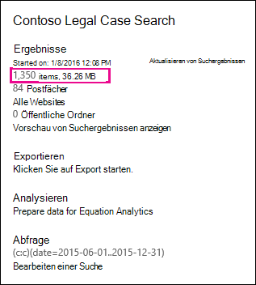
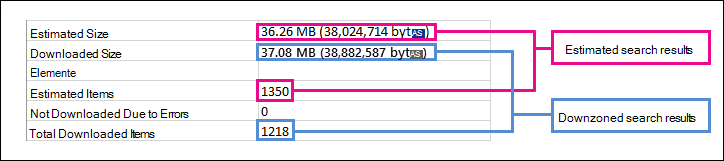

# Unterschiede zwischen geschätzten und tatsächlichen eDiscovery-SuchergebnissenDifferences between estimated and actual eDiscovery search results

Dieses Thema bezieht sich auf Suchvorgänge, die Sie mit einem der folgenden Microsoft 365-eDiscovery-Tools ausführen können:This topic applies to searches that you can run using one of the following Microsoft 365 eDiscovery tools: 

- InhaltssucheContent search
- Core eDiscoveryCore eDiscovery 
   
Wenn Sie eine eDiscovery-Suche ausführen, gibt das Tool, das Sie verwenden, eine Schätzung der Anzahl von Elementen (und deren Gesamtgröße) zurück, die den Suchkriterien entsprechen.When you run an eDiscovery search, the tool you're using will return an estimate of the number of items (and their total size) that meet the search criteria. Wenn Sie beispielsweise eine Suche im Microsoft 365 Compliance Center ausführen, werden die geschätzten Suchergebnisse auf der Flyout-Seite für die ausgewählte Suche angezeigt.For example, when you run a search in the Microsoft 365 compliance center, the estimated search results are displayed on the flyout page for the selected search.
  

  
Dies ist die gleiche Schätzung der Gesamtgröße und der Anzahl von Elementen, die im eDiscovery-Export Tool angezeigt wird, wenn Sie Ergebnisse auf einen lokalen Computer und im Export Zusammenfassungsbericht exportieren, der mit den Suchergebnissen heruntergeladen wird.This is the same estimate of total size and number of items that is displayed in the eDiscovery Export Tool when you export results to a local computer and in the Export Summary report that's downloaded with the search results.
  
**Geschätzte Ergebnisse im eDiscovery-Export Tool****Estimated results in the eDiscovery Export tool**

  
**Geschätzte Ergebnisse im Export Zusammenfassungsbericht****Estimated results in Export Summary report**

  
Wie Sie jedoch im vorherigen Screenshot des Export Zusammenfassungsberichts bemerken, unterscheiden sich die Größe und Anzahl der tatsächlichen Suchergebnisse, die heruntergeladen werden, von der Größe und Anzahl der geschätzten Suchergebnisse.However, as you'll notice in the previous screenshot of the Export Summary report, the size and number of actual search results that are downloaded are different than the size and number of estimated search results.
  

  
Hier sind einige Gründe für diese Unterschiede:Here are some reasons for these differences:
  
- **Die Art und Weise, wie Ergebnisse geschätzt werden**.**The way results are estimated**. Eine Schätzung der Suchergebnisse ist lediglich eine Schätzung (und keine tatsächliche Anzahl) der Elemente, die den Suchabfrage Kriterien entsprechen.An estimate of the search results is just that, an estimate (and not an actual count) of the items that meet the search query criteria. Um die Schätzung von Exchange-Elementen zu kompilieren, wird eine Liste der Nachrichten-IDs, die die Suchkriterien erfüllen, von der Exchange-Datenbank nach dem von Ihnen verwendeten eDiscovery-Tool angefordert.To compile the estimate of Exchange items, a list of the message IDs that meet the search criteria is requested from the Exchange database by the eDiscovery tool you're using. Wenn Sie die Suchergebnisse exportieren, wird die Suche jedoch erneut ausgeführt, und die tatsächlichen Nachrichten werden aus der Exchange-Datenbank abgerufen.But when you export the search results, the search is rerun and the actual messages are retrieved from the Exchange database. Diese Unterschiede können daher dadurch entstehen, dass die geschätzte Anzahl von Elementen und die tatsächliche Anzahl von Elementen bestimmt werden.So these differences might result because of how the estimated number of items and the actual number of items are determined.

- **Änderungen, die zwischen dem Zeitpunkt der Schätzung und dem Export von Suchergebnissen auftreten**.**Changes that happen between the time when estimating and exporting search results**. Wenn Sie Suchergebnisse exportieren, wird die Suche neu gestartet, um die letzten Elemente im Suchindex zu erfassen, die den Suchkriterien entsprechen.When you export search results, the search is restarted to collect that most recent items in the search index that meet the search criteria. Es ist möglich, dass zusätzliche Elemente erstellt, gesendet oder empfangen wurden, die die Suchkriterien in dem Zeitraum erfüllen, in dem die geschätzten Suchergebnisse gesammelt wurden und die Suchergebnisse exportiert wurden.It's possible there are additional items were created, sent, or received that meet the search criteria in the time between when the estimated search results were collected and when the search results were exported. Es ist auch möglich, dass Elemente, die sich im Suchindex befanden, als die Suchergebnisse geschätzt wurden, nicht mehr vorhanden sind, da Sie vom Inhaltsspeicherort gelöscht wurden, bevor die Suchergebnisse exportiert wurden.It's also possible that items that were in the search index when the search results were estimated are no longer there because they were purged from the content location before the search results are exported. Eine Möglichkeit zur Minderung dieses Problems besteht darin, einen Datumsbereich für eine eDiscovery-Suche anzugeben.One way to mitigate this issue is to specify a date range for an eDiscovery search. Eine andere Möglichkeit besteht darin, inhaltsspeicherorte so einzuhalten, dass Elemente beibehalten werden und nicht gelöscht werden können.Another way is to place a hold on content locations so that items are preserved and can't be purged. 

   Obwohl selten, selbst im Fall, wenn ein Haltebereich angewendet wird, kann die Wartung von integrierten Kalenderelementen (die nicht vom Benutzer bearbeitet werden, aber in vielen Suchergebnissen enthalten sind) möglicherweise von Zeit zu Zeit entfernt werden.Although rare, even in the case when a hold is applied, maintenance of built-in calendar items (which aren't editable by the user, but are included in many search results) may be removed from time to time. Durch diese regelmäßige Entfernung von Kalenderelementen werden weniger Elemente exportiert.This periodic removal of calendar items will result in fewer items that are exported.

- Nicht **indizierte Elemente**.**Unindexed items**. Elemente, die für die Suche nicht indiziert sind, können Unterschiede zwischen geschätzten und tatsächlichen Suchergebnissen verursachen.Items that are unindexed for search can cause differences between estimated and actual search results. Sie können nicht indizierte Elemente einschließen, wenn Sie die Suchergebnisse exportieren.You can include unindexed items when you export the search results. Wenn Sie nicht indizierte Elemente beim Exportieren von Suchergebnissen einbeziehen, werden möglicherweise weitere Elemente exportiert.If you include unindexed items when exporting search results, there might be more items that are exported. Dies führt zu einem Unterschied zwischen den geschätzten und den exportierten Suchergebnissen.This will cause a difference between the estimated and exported search results.

    Wenn Sie das Inhalts Such Tool verwenden, haben Sie die Möglichkeit, nicht indizierte Elemente in die Such Schätzung einzubeziehen.When using the Content search tool, you have the option to include unindexed items in the search estimate. Die Anzahl der nicht indizierten Elemente, die von der Suche zurückgegeben werden, wird auf der Flyout-Seite zusammen mit den anderen geschätzten Suchergebnissen aufgeführt.The number of unindexed items returned by the search is listed on the flyout page together with the other estimated search results. Alle nicht indizierten Elemente wären auch in der Gesamtgröße der geschätzten Suchergebnisse enthalten.Any unindexed items would also be included in the total size of the estimated search results. Wenn Sie Suchergebnisse exportieren, haben Sie die Möglichkeit, nicht indizierte Elemente einzubeziehen oder nicht einzubeziehen.When you export search results, you have the option to include or not include unindexed items. Die Art und Weise, wie Sie diese Optionen konfigurieren, kann zu Unterschieden zwischen den geschätzten und den tatsächlichen Suchergebnissen führen, die heruntergeladen werden.How you configure these options might result in differences between estimated and the actual search results that are downloaded.

- **Exportieren der Ergebnisse einer Inhaltssuche, die alle inhaltsspeicherorte enthält**.**Exporting the results of a Content Search that includes all content locations**. Wenn es sich bei der Suche, aus der Sie Ergebnisse exportieren, um die Suche aller inhaltsspeicherorte in Ihrer Organisation handelt, werden nur die nicht indizierten Elemente aus Inhaltsspeicherorten exportiert, die Elemente enthalten, die mit den Suchkriterien übereinstimmen.If the search that you're exporting results from was a search of all content locations in your organization, then only the unindexed items from content locations that contain items that match the search criteria will be exported. In other words, if no search results are found in a mailbox or site, then any unindexed items in that mailbox or site won't be exported.In other words, if no search results are found in a mailbox or site, then any unindexed items in that mailbox or site won't be exported. Nicht indizierte Elemente aller inhaltsspeicherorte (auch solche, die keine Elemente enthalten, die mit der Suchabfrage übereinstimmen) werden in die geschätzten Suchergebnisse aufgenommen.However, unindexed items from all content locations (even those that don't contain items that match the search query) will be included in the estimated search results.

    Wenn die Suche, die Sie exportieren, aus bestimmten Inhaltsspeicherorten stammt, werden auch nicht indizierte Elemente (die nicht von den Suchkriterien ausgeschlossen werden) aus allen in der Suche angegebenen Inhaltsspeicherorten exportiert.Alternatively, if the search that you're exporting results from included specific content locations, then unindexed items (that aren't excluded by the search criteria) from all the content locations specified in the search will be exported. In diesem Fall sollte die geschätzte Anzahl nicht indexierter Elemente und die Anzahl der exportierten nicht indizierten Elemente identisch sein.In this case, the estimated number of unindexed items and the number of unindexed items that are exported should be the same.

    Der Grund für das nicht exportieren von nicht indizierten Elementen von allen Standorten in der Organisation liegt darin, dass es möglicherweise die Wahrscheinlichkeit von Exportfehlern erhöht und die Zeit für das Exportieren und Herunterladen der Suchergebnisse erhöht.The reason for not exporting unindexed items from every location in the organization is because it might increase the likelihood of export errors and increase the time it takes to export and download the search results.

- **RAW-Dateiformate im Vergleich zu exportierten Dateiformaten**.**Raw file formats versus exported file formats**. Für Exchange-Elemente wird die geschätzte Größe der Suchergebnisse mithilfe der rohen Exchange-Nachrichtengrößen berechnet.For Exchange items, the estimated size of the search results is calculated by using the raw Exchange message sizes. E-Mail-Nachrichten werden jedoch in einer PST-Datei oder als einzelne Nachrichten (die als EML-Dateien formatiert sind) exportiert.However, email messages are exported in a PST file or as individual messages (which are formatted as EML files). Beide Exportoptionen verwenden ein anderes Dateiformat als rohe Exchange-Nachrichten, was dazu führt, dass die Gesamtgröße der exportierten Datei von der geschätzten Dateigröße abweicht.Both of these export options use a different file format than raw Exchange messages, which results in the total exported file size being different than the estimated file size.

- **Dokumentversionen**.**Document versions**. Für SharePoint-Dokumente sind mehrere Versionen eines Dokuments nicht in den geschätzten Suchergebnissen enthalten.For SharePoint documents, multiple versions of a document aren't included in the estimated search results. Sie haben jedoch die Möglichkeit, beim Exportieren der Suchergebnisse alle Dokumentversionen einzubeziehen, wodurch die tatsächliche Zahl (und Gesamtgröße) der exportierten Dokumente erhöht wird.But you have the option to include all document versions when you export the search results, which will increase the actual number (and total size) of the exported documents. 

- **Datendeduplizierung.****De-duplication**. Bei Exchange-Elementen reduziert die Deduplizierung die Anzahl der exportierten Elemente.For Exchange items, de-duplication reduces the number of items that are exported. Sie haben die Möglichkeit, die Suchergebnisse beim Exportieren zu deduplizieren.You have the option to de-duplicate the search results when you export them. Bei Exchange-Nachrichten bedeutet dies, dass nur eine einzige Instanz einer Nachricht exportiert wird, obwohl diese Nachricht in mehreren Postfächern gefunden werden kann.For Exchange messages, this means that only a single instance of a message is exported, even though that message might be found in multiple mailboxes. Die geschätzten Suchergebnisse enthalten jede Instanz einer Nachricht.The estimated search results include every instance of a message. Wenn Sie also die Option "Deduplizierung" beim Exportieren von Suchergebnissen auswählen, ist die tatsächliche Anzahl der exportierten Elemente möglicherweise erheblich kleiner als die geschätzte Anzahl von Elementen.So if you choose the de-duplication option when exporting search results, the actual number of items that are exported might be considerably less than the estimated number of items.

    Beachten Sie beim Auswählen der Option für die Deduplizierung, dass alle Exchange-Elemente in einer einzigen PST-Datei exportiert werden und die Ordnerstruktur aus den Quellpostfächern nicht beibehalten wird.Another thing to keep in mind if you choose the de-duplication option is that all Exchange items are exported in a single PST file and the folder structure from the source mailboxes isn't preserved. Die exportierte PST-Datei enthält nur die e-Mail-Elemente.The exported PST file just contains the email items. Ein Suchergebnisbericht enthält jedoch einen Eintrag für jede exportierte Nachricht, die das Quellpostfach identifiziert, in dem sich die Nachricht befindet.However, a search results report contains an entry for each exported message that identifies the source mailbox where the message is located. Auf diese Weise können Sie alle Postfächer identifizieren, die eine doppelte Nachricht enthalten.This helps you identify all mailboxes that contain a duplicate message. Wenn Sie Deduplizierung nicht aktivieren, wird für jedes durchsuchte Postfach eine separate PST-Datei exportiert.If you don't enable de-duplication, a separate PST file is exported for each mailbox included in the search. 
 
> [!NOTE]
> Wenn Sie beim Exportieren von Suchergebnissen oder einfach nur zum Herunterladen der Berichte die Option **Elemente einschließen, die verschlüsselt sind oder nicht erkannt** sind, nicht auswählen, werden die Indexfehler Berichte heruntergeladen, aber keine Einträge.If you don't select the **Include items that are encrypted or have an unrecognized format** option when you export search results or just download the reports, the index error reports are downloaded but they don't have any entries. Dies bedeutet nicht, dass keine Indizierungsfehler vorliegen.This doesn't mean there aren't any indexing errors. Dies bedeutet nur, dass nicht indizierte Elemente nicht in den Export eingeschlossen wurden.It just means that unindexed items weren't included in the export. 
