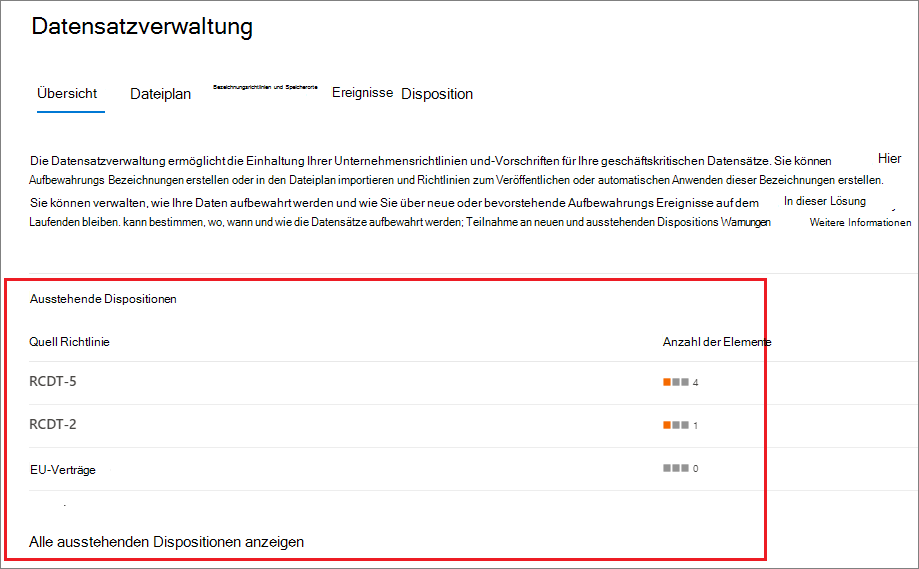
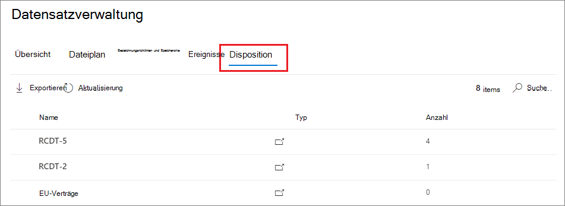
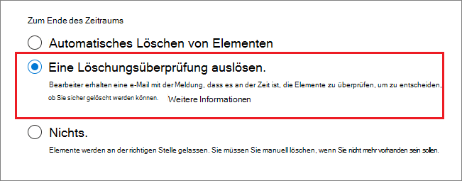
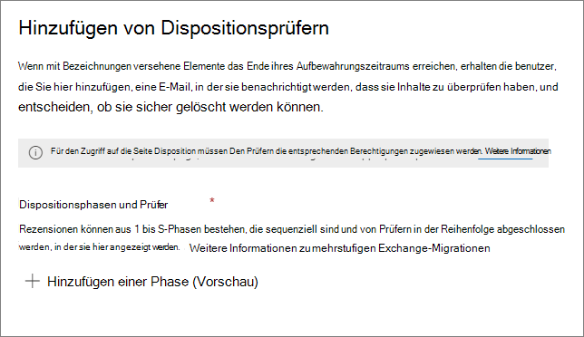
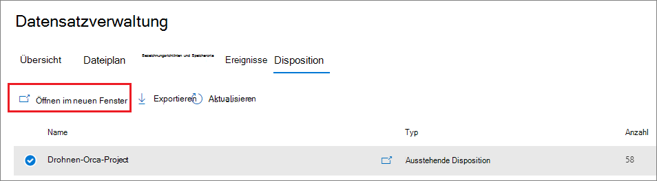
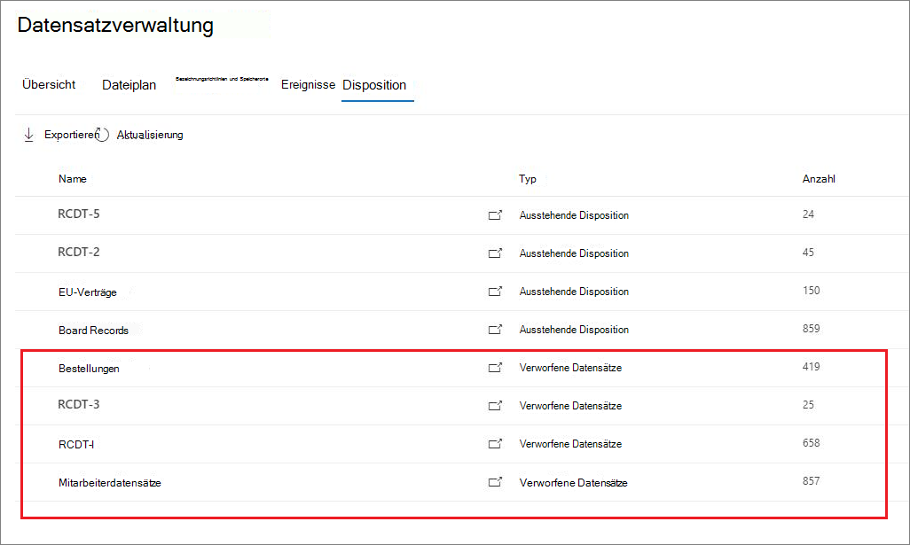

# <a name="disposition-of-content"></a>Disposition von Inhalten

>*[Microsoft 365-Lizenzierungsleitfaden für Sicherheit und Compliance](/office365/servicedescriptions/microsoft-365-service-descriptions/microsoft-365-tenantlevel-services-licensing-guidance/microsoft-365-security-compliance-licensing-guidance).*

Verwenden Sie die Seite **Löschung** aus der **Datensatzverwaltung** im Microsoft 365 Compliance Center, um die Löschungsprüfungen zu verwalten und die Metadaten von [Datensätzen](records-management.md#records) anzuzeigen, die am Ende des Aufbewahrungszeitraums automatisch gelöscht wurden.

> [!NOTE]
> Bereitstellung in der Vorschau: **mehrstufige Löschungsprüfung**
> 
> Ein Administrator kann jetzt bis zu fünf aufeinanderfolgende Stufen der Löschungsprüfung zu einer Aufbewahrungsbezeichnung hinzufügen, und Prüfer können andere Benutzer zu ihrer Löschungsprüfungsstufe hinzufügen. Sie können auch die E-Mail-Benachrichtigungen und -Erinnerungen anpassen. Die folgenden Abschnitte enthalten weitere Informationen zu den Änderungen in dieser Vorschau.

## <a name="prerequisites-for-viewing-content-dispositions"></a>Voraussetzungen für die Anzeige von Inhaltsdispositionen

Zum Verwalten von Löschungsprüfungen und zum bestätigen, dass Datensätze gelöscht wurden, müssen Sie über ausreichende Berechtigungen verfügen, und die Überwachung muss aktiviert sein.

### <a name="permissions-for-disposition"></a>Berechtigungen für Dispositionen

Um im Microsoft 365 Compliance Center erfolgreich auf die Registerkarte **Löschung** zugreifen zu können, müssen die Benutzer über die Rolle **Löschungsverwaltung** verfügen. Seit Dezember 2020 ist diese Rolle nun in der Standardrollengruppe **Datensatzverwaltung** enthalten.

> [!NOTE]
> Die Rolle **Löschungsverwaltung** wird einem globalen Administrator standardmäßig nicht zugewiesen. 

Um Benutzern nur die Berechtigungen zu gewähren, die sie für Löschungsprüfungen benötigen, ohne ihnen Berechtigungen zum Anzeigen und Konfigurieren anderer Features für die Aufbewahrung und die Datensatzverwaltung zu gewähren, erstellen Sie eine benutzerdefinierte Rollengruppe (z. B. mit dem Namen „Löschungsprüfer“) und gewähren dieser Gruppe die Rolle **Löschungsverwaltung**.

Anweisungen zum Konfigurieren dieser Berechtigungen finden Sie unter [Gewähren des Benutzerzugriffs auf das Office 365 Security & Compliance Center](../security/office-365-security/grant-access-to-the-security-and-compliance-center.md).

Zusätzlich:

- Um den Inhalt von Elementen während des Löschvorgangs anzuzeigen, fügen Sie Benutzer zur Rollengruppen **Inhaltsbetrachter im Inhalts-Explorer** hinzu. Wenn Benutzer nicht über die Berechtigungen dieser Rollengruppe verfügen, können sie trotzdem eine Aktion zum Abschluss der Löschungsprüfung auswählen, müssen dies aber tun, ohne den Inhalt des Elements im Minivorschaubereich des Compliance Centers sehen zu können.

- In Vorschau: Standardmäßig sieht jede Person, welche auf die Seite **Löschung** zugreift, nur die Elemente, die ihnen zur Überprüfung zugewiesen sind. Damit ein Datensatzverwaltungsadministrator alle Elemente sieht, die allen Benutzern zugewiesen sind, und alle Aufbewahrungsbezeichnungen, welche für die Löschungsprüfung konfiguriert sind, navigiert er zu **Datensatzverwaltungseinstellungen** > **Allgemein** > **Datensatzverwalter-Sicherheitsgruppe**, um eine E-Mail-aktivierte Sicherheitsgruppe auszuwählen und dann zu aktivieren, welche die Administratorkonten enthält.
    
    Microsoft 365-Gruppen und -Sicherheitsgruppen, welche nicht E-Mail-aktiviert sind, unterstützten dieses Feature nicht und würden in der Liste nicht zur Auswahl angezeigt. Wenn Sie eine neue E-Mail-aktivierte Sicherheitsgruppe erstellen müssen, verwenden Sie den Link zum Microsoft 365 Admin Center, um eine neue Gruppe zu erstellen. 
    
    > [!IMPORTANT]
    > Sie können diese Berechtigung nicht deaktivieren oder die Gruppe ersetzen, die Sie aus dem Compliance Center aktiviert haben. Sie können jedoch eine andere E-Mail-aktivierte Sicherheitsgruppe aktivieren, indem Sie das Cmdlet [Enable-ComplianceTagStorage](/powershell/module/exchange/enable-compliancetagstorage) verwenden.
    > 
    > Beispiel: `Enable-ComplianceTagStorage -RecordsManagementSecurityGroupEmail dispositionreviewers@contosoi.com`

- In Vorschau: Die Option **Datensatzverwaltungseinstellungen** ist nur für Datensatzverwaltungsadministratoren sichtbar. 

### <a name="enable-auditing"></a>Überwachung aktivieren

Vergewissern Sie sich, dass die Überwachung mindestens einen Tag vor der ersten Dispositionsaktion aktiviert ist. Weitere Informationen finden Sie unter [Durchsuchen des Überwachungsprotokolls im Office 365 Security &amp; Compliance Center](search-the-audit-log-in-security-and-compliance.md). 

## <a name="disposition-reviews"></a>Löschungsprüfungen

Wenn Inhalte das Ende des Aufbewahrungszeitraums erreichen, können Sie aus mehreren Gründen überprüfen und bestätigen, ob sie dauerhaft gelöscht ("verworfen") werden können. Anstatt den Inhalt zu löschen, müssen Sie möglicherweise Folgendes:
  
- Aussetzen der Löschung relevanter Inhalte für Rechtsstreitigkeiten oder ein Audit.

- Zuweisen eines anderen Aufbewahrungszeitraums für die Inhalte, vielleicht, weil die ursprünglichen Aufbewahrungseinstellungen eine vorübergehende oder vorläufige Lösung waren.

- Verschieben des Inhalts von seinem bisherigen Speicherort an einen Archivspeicherort, z. B. wenn dieser Inhalt von wissenschaftlichem oder historischem Wert ist.

Wenn am Ende des Aufbewahrungszeitraums eine Löschungsprüfung ausgelöst wird:
  
- Die von Ihnen ausgewählten Prüfer erhalten eine E-Mail-Benachrichtigung, dass für sie Inhalte zur Überprüfung bereitstehen. Bei diesen Prüfern kann es sich um einzelne Benutzer oder E-Mail-aktivierte Sicherheitsgruppen handeln. Neu in der Vorschau:
   - Sie können die E-Mail anpassen, welche sie erhalten, einschließlich Anweisungen in verschiedenen Sprachen. Für mehrsprachige Unterstützung müssen Sie die Übersetzungen selber erstellen, und dieser benutzerdefinierte Text wird allen Prüfern angezeigt, unabhängig von ihrem Gebietsschema.
   - Benutzer erhalten eine anfängliche E-Mail-Benachrichtigung pro Bezeichnung am Ende des Aufbewahrungszeitraums des Elements, mit einer wöchentlichen Erinnerung pro Bezeichnung für alle Löschungsprüfungen, die ihnen zugewiesen sind. Sie können auf den Link in den E-Mails für Benachrichtigungen und Erinnerungen klicken, um zur Seite **Löschung** im Microsoft 365 Compliance Center zu gehen und die Inhalte zu überprüfen und Aktionen einzuleiten. Die Prüfer können alternativ auch direkt zur Seite **Löschung** im Compliance Center gehen.
   - Prüfer sehen nur die Löschungsprüfungen, die ihnen zugewiesen sind, während Administratoren, welche der ausgewählten Datensatzverwalter-Sicherheitsgruppe hinzugefügt sind, alle Löschungsprüfungen sehen.
   - Prüfer können neue Benutzer für die gleiche Löschungsprüfung hinzufügen. Derzeit gewährt diese Aktion den hinzugefügten Benutzern nicht automatisch die [erforderlichen Berechtigungen](#permissions-for-disposition).
   - Ein Miniprüfbereich für den Löschungsprüfungsprozess zeigt für jedes Element eine Vorschau des Inhalts an, wenn sie die Berechtigungen zum anzeigen haben. Wenn sie nicht über diese Berechtigungen verfügen, können Sie den Inhaltslink auswählen und Berechtigungen anfordern. Dieser Miniprüfbereich verfügt ebenfalls über Registerkarten für zusätzliche Informationen über den Inhalt:
       - **Details** zum anzeigen indizierter Eigenschaften, wo sich das Element befindet, wer es erstellt hat und wann, und wer es zuletzt geändert hat und wann.
       - **Verlauf** zeigt den Verlauf sämtlicher bisheriger Löschungsprüfungsaktionen an, mit Prüferkommentaren, wenn verfügbar.

Eine Löschungsprüfung kann Inhalte in Exchange-Postfächern, SharePoint-Websites und OneDrive-Konten umfassen. Inhalte, für welche an diesen Speicherorten eine Löschungsprüfung ansteht, werden erst dann dauerhaft gelöscht, wenn ein Prüfer für die letzte Stufe der Löschung entscheidet, den Inhalt dauerhaft zu löschen.

> [!NOTE]
> Ein Postfach muss mindestens 10 MB Daten aufweisen, um Löschungsprüfungen zu unterstützen.

Administratoren können einen Überblick über alle ausstehenden Löschungen in der Registerkarte **Überblick** sehen. Prüfer sehen nur ihre eigenen Elemente, für die eine Löschung ausstehend ist. Beispiel:



Wenn Sie **Alle ausstehenden Löschungen anzeigen** auswählen, werden Sie zur Seite **Disposition** geleitet. Beispiel:




### <a name="workflow-for-a-disposition-review"></a>Workflow für die Löschungsprüfung

Das folgende Diagramm zeigt den grundlegenden Arbeitsablauf einer Löschungsprüfung, wenn eine Aufbewahrungsbezeichnung veröffentlicht und dann manuell von einem Benutzer angewendet wird. Alternativ kann eine für eine Löschungsprüfung konfigurierte Aufbewahrungsbezeichnung automatisch auf Inhalte angewendet werden.
  


### <a name="how-to-configure-a-retention-label-for-disposition-review"></a>So konfigurieren Sie eine Aufbewahrungsbezeichnung für die Löschungsprüfung

Das Auslösen einer Löschungsprüfung am Ende des Aufbewahrungszeitraums ist eine Konfigurationsoption, die nur mit einer Aufbewahrungsbezeichnung verfügbar ist. Die Löschungsprüfung ist für eine Aufbewahrungsrichtlinie nicht verfügbar. Weitere Informationen zu diesen beiden Aufbewahrungslösungen finden Sie unter [Informationen zu Aufbewahrungsrichtlinien und Aufbewahrungsbezeichnungen](retention.md).

Von der Seite **Aufbewahrungseinstellungen definieren** für eine Aufbewahrungsbezeichnung:


 
Nachdem Sie die Option **Löschungsprüfung auslösen** ausgewählt haben, geben Sie auf der nächsten Seite des Assistenten an, wie viele aufeinanderfolgende Stufen der Löschungsprüfung Sie wollen, sowie die Löschungsprüfer für jede Stufe:

 

Wählen Sie **Eine Stufe hinzufügen** aus, und benennen Sie Ihre Stufe für Identifikationszwecke. Legen Sie dann die Prüfer für diese Stufe fest.

Legen Sie als Prüfer einen Benutzer oder eine E-Mail-aktivierte Sicherheitsgruppe fest. Microsoft 365-Gruppen ([vormals Office 365-Gruppen](https://techcommunity.microsoft.com/t5/microsoft-365-blog/office-365-groups-will-become-microsoft-365-groups/ba-p/1303601)) werden für diese Option derzeit nicht unterstützt.

Wenn Sie mehr als eine Person benötigen, um ein Element am Ende seines Aufbewahrungszeitraums zu überprüfen, wählen Sie **Eine Stufe hinzufügen** aus, und wiederholen Sie den Konfigurationsprozess für die Anzahl der von Ihnen benötigten Stufen, mit einem Maximum von fünf Stufen. 

Innerhalb jeder einzelnen Stufe der Löschung ist jeder Benutzer, den Sie für diese Stufe angeben, berechtigt, am Ende des Aufbewahrungszeitraums die nächste Aktion für das Element durchzuführen. Diese Benutzer können auch weitere Benutzer zu ihrer Stufe der Löschungsprüfung hinzufügen.

> [!NOTE]
> Bestehende Aufbewahrungsbezeichnungen, welche für die Löschungsprüfung konfiguriert sind, können durch Konfiguration der Bezeichnung hochgestuft werden, um eine mehrstufige Löschungsprüfung zu verwenden. Wählen Sie im Bezeichnungsassistenten **Eine Stufe hinzufügen** aus, oder ändern Sie die bestehenden Prüfer, oder fügen Sie neue Prüfer hinzu.

Während der Konfigurationsphase können Sie jede angegebene Stufe umbenennen, sie neu anordnen oder entfernen, indem Sie die Option für Stufenaktionen (**...**) auswählen: 


Sie können jedoch eine Stufe nicht neu anordnen oder entfernen, nachdem Sie die Aufbewahrungsbezeichnung erstellt haben.

Denken Sie daran, dass Sie nach dem Festlegen Ihrer Prüfer die Rollenberechtigung **Löschungsverwaltung** zuweisen müssen. Weitere Informationen hierzu finden Sie auf dieser Seite im Abschnitt [Berechtigungen für die Löschung](#permissions-for-disposition).

### <a name="how-to-customize-email-messages-for-disposition-review"></a>So passen Sie E-Mail-Nachrichten für die Löschungsprüfung an

Ebenfalls in der Vorschau können Sie die E-Mail-Nachrichten anpassen, welche den Löschungsprüfern für die anfängliche Benachrichtigung und danach für die Erinnerungen zugestellt werden.

Wählen Sie auf einer beliebigen Löschungsseite im Compliance Center die Option **Datensatzverwaltungseinstellungen** aus:  


Wählen Sie dann die Registerkarte **E-Mail-Vorlagen** aus, und geben Sie an, ob Sie nur die Standard-E-Mail-Vorlagen verwenden, oder Ihren eigenen Text der Standardvorlage hinzufügen wollen. Ihr benutzerdefinierter Text wird den E-Mail-Anweisungen nach den Informationen über die Aufbewahrungsbezeichnung und vor den Anweisungen für die nächsten Schritte hinzugefügt.

Text kann für alle Sprachen hinzugefügt werden, aber Formatierung und Bilder sind derzeit nicht unterstützt. URLs und E-Mail-Adressen können als Text eingegeben werden und werden abhängig vom E-Mail-Client als Hyperlinks oder unformatierter Text in der angepassten E-Mail angezeigt.

Beispieltext für die Anpassung:

```console
If you need additional information, visit the helpdesk website (https://support.contoso.com) or send them an email (helpdesk@contoso.com).
```

Wählen Sie **Speichern** aus, um Änderungen zu speichern.

### <a name="viewing-and-disposing-of-content"></a>Anzeigen und Verwerfen von Inhalten

Wenn ein Prüfer per E-Mail benachrichtigt wird, dass Inhalte zur Überprüfung bereitstehen, wechseln sie zur Registerkarte **Disposition** aus der **Datensatzverwaltung** im Microsoft 365 Compliance Center. Die Prüfer können sehen, wie viele Elemente für jede Aufbewahrungsbezeichnung auf die Löschung warten, wenn der **Typ** **Ausstehende Löschung** anzeigt. Sie wählen dann eine Aufbewahrungsbezeichnung aus und **Öffnen in einem neuen Fenster**, um alle Inhalte mit dieser Bezeichnung zu sehen:



Auf der Seite **Ausstehende Löschungen** sehen sie alle ausstehenden Löschungen für diese Bezeichnung. Wenn mindestens ein Element ausgewählt ist, können Sie den Minivorschaubereich und die Registerkarten **Quelle**, **Details** und **Verlauf** verwenden, um den Inhalt zu untersuchen, bevor Aktionen darauf angewendet werden:


Wenn Sie die horizontale Bildlaufleiste verwenden oder den Miniprüfbereich schließen, sehen Sie weitere Spalten, die das Ablaufdatum und den Namen der Stufe der Löschungsprüfung enthalten.

Wie Sie im gezeigten Beispiel sehen können, sind dies die unterstützten Aktionen: 
  
- **Entsorgung genehmigen**:
    - Wenn diese Aktion für eine Zwischenstufe der Löschungsprüfung ausgewählt wird (Sie haben mehrere Stufen konfiguriert): Das Element wird in die nächste Löschungsstufe verschoben.
    - Wenn diese Aktion für die letzte Stufe der Löschungsprüfung ausgewählt wird, oder wenn es nur eine Stufe der Löschung gibt: Das Element wird als für die dauerhafte Löschung berechtigt markiert. Der genaue Zeitpunkt für diese Löschung hängt vom Workload ab. Weitere Informationen finden Sie unter [Funktionsweise von Aufbewahrungseinstellungen bei vorhandenem Inhalt](retention.md#how-retention-settings-work-with-content-in-place).
- **Neu bezeichnen**:
    - Wenn diese Aktion ausgewählt wird, verlässt das Element den Löschungsprüfungsprozess für die ursprüngliche Bezeichnung. Das Element unterliegt dann den Aufbewahrungseinstellungen der neu gewählten Aufbewahrungsbezeichnung.
- **Verlängern**:
    - Wenn diese Aktion ausgewählt ist, wird die Löschungsprüfung bis zum Ende des verlängerten Zeitraums effektiv ausgesetzt, und dann wird die Löschungsprüfung ab der ersten Stufe erneut ausgelöst.
- **Prüfer hinzufügen**:
    - Wenn diese Aktion ausgewählt ist, wird der Benutzer aufgefordert, weitere Benutzer für die Überprüfung anzugeben und hinzuzufügen.
    
    > [!NOTE]
    > Diese Aktion gewährt den Benutzern, die hinzugefügt werden, nicht automatisch die [erforderlichen Berechtigungen](#permissions-for-disposition). Wenn sie diese Berechtigungen nicht haben, können Sie an der Löschungsprüfung nicht teilnehmen.

Jede durchgeführte Aktion wird gesichert und gespeichert, obwohl Sie im Überwachungsprotokoll noch nicht danach suchen können.

Während einer Löschungsprüfung wird der Inhalt niemals von seinem ursprünglichen Speicherort verschoben und erst dann zum dauerhaften Löschen markiert, wenn diese Aktion von einem Prüfer für die letzte oder einzige Löschungsstufe ausgewählt wurde.

## <a name="disposition-of-records"></a>Disposition von Datensätzen

Verwenden Sie die Registerkarte **Löschung** von der Seite **Datensatzverwaltung** zur Identifikation von:

- Elemente, die als Ergebnis einer Löschungsprüfung gelöscht wurden.
- Elemente, die als Datensatz oder behördlicher Eintrag gekennzeichnet sind und am Ende ihres Aufbewahrungszeitraums automatisch gelöscht wurden.

Diese Elemente zeigen **Verworfene Datensätze** in der Spalte **Typ** an. Beispiel:



Elemente, die in der Registerkarte **Verworfene Elemente** angezeigt werden, werden bis zu sieben Jahre nach der Verwerfung des Elements gespeichert, und es wird ein Limit von 1 Million Elementen pro Datensatz für diesen Zeitraum angezeigt. Wenn sich die **Anzahl** dem Limit von 1 Million nähert und Sie einen Dispositionsnachweis benötigen, wenden Sie sich an [Microsoft-Support](../business-video/get-help-support.md).

> [!NOTE]
> Diese Funktionalität verwendet Informationen aus dem [einheitlichen Überwachungsprotokoll](search-the-audit-log-in-security-and-compliance.md) und erfordert daher, dass die Überwachung [aktiviert und durchsuchbar ist](turn-audit-log-search-on-or-off.md) damit die entsprechenden Ereignisse erfasst werden.

Um gelöschte Elemente zu überwachen, die als Datensätze oder behördliche Einträge gekennzeichnet wurden, suchen Sie **Gelöschte Datei, die als Datensatz gekennzeichnet ist** in der Kategorie **Datei- und Seitenaktivitäten**. Dieses Überwachungsereignis gilt für Dokumente und E-Mails.

## <a name="filter-and-export-the-views"></a>Filtern und Exportieren von Ansichten

Wenn Sie auf der Seite **Disposition** eine Aufbewahrungsbezeichnung auswählen, können Sie mit der Registerkarte **Ausstehende Löschung** (sofern zutreffend) und der Registerkarte **Verworfene Elemente** die Ansichten filtern, damit Sie Elemente leichter finden können.

Bei ausstehenden Löschungen basiert der Zeitraum auf dem Ablaufdatum. Bei verworfenen Elementen basiert der Zeitraum auf dem Löschdatum.
  
Sie können Informationen zu den Elementen beider Ansichten als CSV-Datei exportieren, die Sie dann mithilfe von Excel sortieren und verwalten können.
