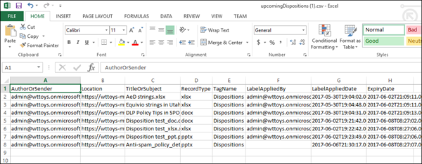

# Disposition von Inhalten

>*[Microsoft 365-Lizenzierungsleitfaden für Sicherheit und Compliance](https://aka.ms/ComplianceSD).*

Verwenden Sie die Registerkarte **Disposition** aus der **Datensatzverwaltung** im Microsoft 365 Compliance Center, um Dispositions Überprüfungen zu verwalten und [Datensätze](records-management.md#records) anzuzeigen, die am Ende des Aufbewahrungszeitraums automatisch gelöscht wurden. 

## Voraussetzungen für das Anzeigen von Inhalts Abstellungen

Zum Verwalten von Dispositions Überprüfungen und zum bestätigen, dass Datensätze gelöscht wurden, müssen Sie über ausreichende Berechtigungen verfügen und die Überwachung muss aktiviert sein.

### Berechtigungen für die Disposition

Um erfolgreich auf die Registerkarte **Disposition** im Microsoft 365 Compliance Center zugreifen zu können, müssen die Benutzer über die **Verwaltungs** Rolle "Disposition" und die Rolle " **Überwachungsprotokolle nur anzeigen** " verfügen. Obwohl standardmäßig Benutzer zu den Standardrollengruppen hinzugefügt werden sollen, empfehlen wir Ihnen, in diesem Fall eine neue Rollengruppe mit dem Namen **Dispositions Prüfer** mit diesen beiden Rollen zu erstellen und Benutzer dieser Gruppe nach Bedarf hinzuzufügen. Eine einzelne Rollengruppe für die Disposition reduziert die Verwaltungskosten und erleichtert Benutzern die benötigten kombinierten Berechtigungen.

> [!NOTE]
> Selbst einem globalen Administrator muss die **Dispositions Verwaltungs** Rolle erteilt werden. Wenn also globale Administratoren auf die Registerkarte "Disposition" zugreifen müssen, werden Sie als Mitglieder der Rollengruppe " **Dispositions Prüfer** " angezeigt. 

Spezifisch für die Rolle " **nur Ansichts Überwachungsprotokolle** ":

- Da es sich bei dem zugrunde liegenden Cmdlet, das zum Durchsuchen des Überwachungsprotokolls verwendet wird, um ein Exchange Online-Cmdlet handelt, müssen Sie Benutzer diese Rolle mithilfe des [Exchange Admin Center in Exchange Online](https://docs.microsoft.com/Exchange/exchange-admin-center)anstatt mithilfe der Seite **Berechtigungen** im Security & Compliance Center zuweisen. Anweisungen finden Sie unter [Verwalten von Rollengruppen in Exchange Online](https://docs.microsoft.com/Exchange/permissions-exo/role-groups).

- Microsoft 365-Gruppen ([früher Office 365 Gruppen](https://techcommunity.microsoft.com/t5/microsoft-365-blog/office-365-groups-will-become-microsoft-365-groups/ba-p/1303601)) werden für diese Rolle nicht unterstützt. Weisen Sie stattdessen Benutzerpostfächer, e-Mail-Benutzer oder e-Mail-aktivierte Sicherheitsgruppen zu.

Anweisungen zum Erteilen von Benutzern der **Dispositions Verwaltungs** Rolle und zum Erstellen Ihrer neuen Funktion " **Dispositions Prüfer** " finden Sie unter [Erteilen von Benutzern den Zugriff auf das Office 365 Security &amp; Compliance Center](../security/office-365-security/grant-access-to-the-security-and-compliance-center.md).

### Aktivieren der Überwachung

Stellen Sie sicher, dass die Überwachung mindestens einen Tag vor der ersten Dispositionsaktion aktiviert ist. Weitere Informationen finden Sie unter [Durchsuchen des Überwachungsprotokolls im Office 365 Security &amp; Compliance Center](search-the-audit-log-in-security-and-compliance.md). 

## Dispositionsüberprüfungen

Wenn der Inhalt das Ende seines Aufbewahrungszeitraums erreicht, gibt es mehrere Gründe, warum Sie diesen Inhalt möglicherweise überprüfen möchten, um zu entscheiden, ob er sicher gelöscht werden kann ("verworfen"). Beispielsweise müssen Sie Folgendes tun:
  
- Das Löschen relevanter Inhalte im Fall eines Rechtsstreits oder einer Überwachung anhalten.
    
- Entfernen Sie Inhalte aus der Dispositionsliste, die in einem Archiv gespeichert werden sollen, wenn diese Inhalte Forschungs-oder Verlaufswerte aufweisen.
    
- Weisen Sie dem Inhalt eine andere Beibehaltungsdauer zu, möglicherweise weil die ursprünglichen Aufbewahrungseinstellungen eine vorübergehende oder provisorische Lösung waren.
    
- Zurückgeben der Inhalte an Clients oder übertragen an eine andere Organisation.

Wenn eine Dispositions Überprüfung am Ende des Aufbewahrungszeitraums ausgelöst wird:
  
- Die Personen, die Sie auswählen, erhalten eine e-Mail-Benachrichtigung, dass Sie Inhalte zur Überprüfung haben. Bei diesen Prüfern kann es sich um einzelne Benutzer, Verteilungs-oder Sicherheitsgruppen oder Microsoft 365-Gruppen ([früher Office 365 Gruppen](https://techcommunity.microsoft.com/t5/microsoft-365-blog/office-365-groups-will-become-microsoft-365-groups/ba-p/1303601)) handeln. Beachten Sie, dass Benachrichtigungen auf wöchentlicher Basis gesendet werden.
    
- Die Bearbeiter wechseln zur Registerkarte " **Disposition** " im Microsoft 365 Compliance Center, um die Inhalte zu überprüfen und zu entscheiden, ob Sie sie dauerhaft löschen, den Aufbewahrungszeitraum verlängern oder eine andere Aufbewahrungs Bezeichnung anwenden möchten.

Eine Dispositions Überprüfung kann Inhalte in Exchange-Postfächern, SharePoint-Websites, OneDrive-Konten und Microsoft 365-Gruppen umfassen. Inhalte, die auf eine Dispositions Überprüfung an diesen Speicherorten warten, werden erst gelöscht, nachdem ein Prüfer die Inhalte endgültig gelöscht hat.

> [!NOTE]
> Ein Postfach muss mindestens 10 MB Daten zur Unterstützung von Dispositions Prüfungen aufweisen.

Sie können eine Übersicht über alle ausstehenden Dispositionen auf der Registerkarte **Übersicht** sehen. Zum Beispiel:

Wenn Sie die Option **alle ausstehenden Dispositionen anzeigen**auswählen, werden Sie zur Seite **Disposition** geleitet. Zum Beispiel:

### Workflow für eine Dispositions Überprüfung

Das folgende Diagramm zeigt den grundlegenden Workflow für eine Dispositions Überprüfung, wenn eine Aufbewahrungs Bezeichnung veröffentlicht und anschließend manuell von einem Benutzer angewendet wird. Alternativ kann eine für eine Dispositions Überprüfung konfigurierte Aufbewahrungs Bezeichnung automatisch auf Inhalte angewendet werden.
  

  
Das Auslösen einer Dispositions Überprüfung am Ende des Aufbewahrungszeitraums ist eine Konfigurationsoption, die nur mit einer Aufbewahrungs Bezeichnung verfügbar ist. Diese Option ist für eine Aufbewahrungsrichtlinie nicht verfügbar. Weitere Informationen zu diesen beiden aufbewahrungslösungen finden Sie unter Informationen [zu Aufbewahrungsrichtlinien und Aufbewahrungs Bezeichnungen](retention.md).
  

 
> [!NOTE]
> Wenn Sie die Option **diese Personen Benachrichtigen auswählen, wenn Elemente zur Überarbeitung verfügbar sind**, geben Sie einen Benutzer oder eine e-Mail-aktivierte Sicherheitsgruppe an. Microsoft 365-Gruppen ([früher Office 365 Gruppen](https://techcommunity.microsoft.com/t5/microsoft-365-blog/office-365-groups-will-become-microsoft-365-groups/ba-p/1303601)) werden für diese Option nicht unterstützt.

### Anzeigen und Freigeben von Inhalten

Wenn ein Prüfer per e-Mail benachrichtigt wird, dass der Inhalt überprüft werden kann, wechseln Sie zur Registerkarte " **Disposition** " von der **Datensatzverwaltung** im Microsoft 365 Compliance Center. Die Bearbeiter können sehen, wie viele Elemente für jede Aufbewahrungs Bezeichnung auf die Disposition warten, und wählen dann eine Aufbewahrungs Bezeichnung aus, um den gesamten Inhalt mit dieser Bezeichnung anzuzeigen.

Nachdem Sie eine Aufbewahrungs Bezeichnung ausgewählt haben, werden auf der Registerkarte **ausstehende Disposition** alle ausstehenden Dispositionen für diese Bezeichnung angezeigt. Wählen Sie ein oder mehrere Elemente aus, in denen Sie eine Aktion auswählen und einen Ausrichtungs Kommentar eingeben können:

Wie Sie aus dem Bild sehen können, werden die folgenden Aktionen unterstützt: 
  
- Dauerhaftes Löschen des Elements
- Verlängern des Aufbewahrungszeitraums
- Anwenden einer anderen Aufbewahrungs Bezeichnung

Wenn Sie über Berechtigungen für den Speicherort und den Inhalt verfügen, können Sie den Link in der Spalte **Speicherort** verwenden, um Dokumente an Ihrem ursprünglichen Speicherort anzuzeigen. Während einer Dispositions Überprüfung werden die Inhalte nie von Ihrem ursprünglichen Speicherort verschoben, und Sie werden erst gelöscht, wenn sich der Bearbeiter dafür entscheidet.

Die e-Mail-Benachrichtigungen werden wöchentlich automatisch an Prüfer gesendet. Dieser geplante Vorgang bedeutet, dass beim Erreichen des Endes des Aufbewahrungszeitraums durch Inhalte bis zu sieben Tage dauern kann, bis die Bearbeiter die e-Mail-Benachrichtigung erhalten, dass der Inhalt die Disposition wartet.
  
Alle Dispositionsaktionen können überwacht werden, und der vom Bearbeiter eingegebene Begründungstext wird gespeichert und in der Spalte **Kommentar** auf der Seite **verworfene Elemente** angezeigt.
  
### Wie lange, bis verworfene Inhalte endgültig gelöscht werden

Inhalte, die auf eine Dispositions Überprüfung warten, werden erst gelöscht, nachdem ein Prüfer die Inhalte endgültig gelöscht hat. Wenn der Bearbeiter diese Option auswählt, wird der Inhalt der SharePoint-Website oder des OneDrive-Kontos für den standardmäßigen Cleanupprozess in Betracht gezogen, der unter [How Retention Settings with Content in Place](retention.md#how-retention-settings-work-with-content-in-place)beschrieben wird.

## Disposition von Datensätzen

> [!NOTE]
> Der Rollout für den Nachweis der Verfügung für Datensätze in SharePoint und OneDrive ist abgeschlossen. Die Liste der Aufbewahrungs Bezeichnungen, die Inhalte als Datensätze für SharePoint und OneDrive markiert haben, wird im Abschnitt Disposition der Seite Datensatzverwaltung im Microsoft 365 Compliance Center angezeigt. Unter diesen Bezeichnungen können Sie die Liste der Elemente in SharePoint und OneDrive anzeigen, die automatisch oder nach einer Dispositions Überprüfung verworfen wurden.
>
> Der Nachweis der Verfügung für Datensätze in Exchange ist noch nicht aktiv. Wenn dieser Rollout beginnt und wenn er abgeschlossen ist, werden wir diesen Hinweis aktualisieren.

Verwenden Sie die Registerkarte **Disposition** auf der Seite **Datensatzverwaltung** , um Datensätze zu identifizieren, die automatisch gelöscht werden. Diese Elemente zeigen **Datensätze** an, die in der Spalte **Typ** angeordnet sind. Zum Beispiel:

Elemente, die auf der Registerkarte " **verworfene Elemente** " für Daten Satzbezeichnungen angezeigt werden, werden bis zu sieben Jahre nach der Freigabe des Elements mit einem Grenzwert von 1 Million Elementen pro Datensatz für diesen Zeitraum aufbewahrt. Wenn die **Zähl** Nummer, die diesem Grenzwert von 1 Million nähert, angezeigt wird und Sie einen Nachweis der Disposition für Ihre Datensätze benötigen, wenden Sie sich an den [Microsoft-Support](https://docs.microsoft.com/office365/admin/contact-support-for-business-products).

> [!NOTE]
> Diese Funktion basiert auf Informationen aus dem [vereinheitlichten Überwachungsprotokoll](search-the-audit-log-in-security-and-compliance.md) und erfordert daher die Überwachung, um [aktiviert und durchsuchbar](turn-audit-log-search-on-or-off.md) zu sein, damit die entsprechenden Ereignisse erfasst werden.
    
## Filtern und Exportieren der Ansichten

Wenn Sie auf der Seite **Disposition** eine Aufbewahrungs Bezeichnung auswählen, können Sie auf der Registerkarte **ausstehende Disposition** (falls zutreffend) und auf der Registerkarte **verworfene Elemente** die Ansichten filtern, damit Sie leichter nach Elementen suchen können. 

Für ausstehende Dispositionen basiert der Zeitbereich auf dem Ablaufdatum. Bei freigestellten Elementen basiert der Zeitbereich auf dem Löschdatum.
  
Sie können Informationen zu den Elementen in beiden Ansichten als CSV-Datei exportieren, die Sie dann mithilfe von Excel sortieren und verwalten können:

  

