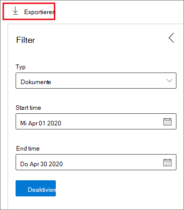

# Disposition von InhaltenDisposition of content

>*[Microsoft 365-Lizenzierungsleitfaden für Sicherheit und Compliance](https://aka.ms/ComplianceSD).**[Microsoft 365 licensing guidance for security & compliance](https://aka.ms/ComplianceSD).*

Verwenden Sie die Registerkarte **Disposition** aus der **Datensatzverwaltung** im Microsoft 365 Compliance Center, um Dispositions Überprüfungen zu verwalten und [Datensätze](records-management.md#records) anzuzeigen, die am Ende des Aufbewahrungszeitraums automatisch gelöscht wurden.Use the **Disposition** tab from **Records Management** in the Microsoft 365 compliance center to manage disposition reviews and view [records](records-management.md#records) that have been automatically deleted at the end of their retention period. 

## Voraussetzungen für das Anzeigen von Inhalts AbstellungenPrerequisites for viewing content dispositions

Zum Verwalten von Dispositions Überprüfungen und zum bestätigen, dass Datensätze gelöscht wurden, müssen Sie über ausreichende Berechtigungen verfügen und die Überwachung muss aktiviert sein.To manage disposition reviews and confirm that records have been deleted, you must have sufficient permissions and auditing must be enabled.

### Berechtigungen für die DispositionPermissions for disposition

Um erfolgreich auf die Registerkarte **Disposition** im Microsoft 365 Compliance Center zugreifen zu können, müssen die Benutzer über die **Verwaltungs** Rolle "Disposition" und die Rolle " **Überwachungsprotokolle nur anzeigen** " verfügen.To successfully access the **Disposition** tab in the Microsoft 365 compliance center, users must have the **Disposition Management** role and the **View-Only Audit Logs** role. Obwohl standardmäßig Benutzer zu den Standardrollengruppen hinzugefügt werden sollen, empfehlen wir Ihnen, in diesem Fall eine neue Rollengruppe mit dem Namen **Dispositions Prüfer** mit diesen beiden Rollen zu erstellen und Benutzer dieser Gruppe nach Bedarf hinzuzufügen.Although the standard advice is to add users to the default role groups, in this case, we recommend you create a new role group called **Disposition Reviewers** that has these two roles and add users to this group as needed. Eine einzelne Rollengruppe für die Disposition reduziert die Verwaltungskosten und erleichtert Benutzern die benötigten kombinierten Berechtigungen.A single role group for disposition reduces administration overheads and makes it easier for users have the combined permissions that they need.

> [!NOTE]
> Selbst einem globalen Administrator muss die **Dispositions Verwaltungs** Rolle erteilt werden.Even a global admin needs to be granted the **Disposition Management** role. Wenn also globale Administratoren auf die Registerkarte "Disposition" zugreifen müssen, werden Sie als Mitglieder der Rollengruppe " **Dispositions Prüfer** " angezeigt.So if global admins need to access the disposition tab, them as members of the **Disposition Reviewers** role group. 

Spezifisch für die Rolle " **nur Ansichts Überwachungsprotokolle** ":Specific to the **View-Only Audit Logs** role:

- Da es sich bei dem zugrunde liegenden Cmdlet, das zum Durchsuchen des Überwachungsprotokolls verwendet wird, um ein Exchange Online-Cmdlet handelt, müssen Sie Benutzer diese Rolle mithilfe des [Exchange Admin Center in Exchange Online](https://docs.microsoft.com/Exchange/exchange-admin-center)anstatt mithilfe der Seite **Berechtigungen** im Security & Compliance Center zuweisen.Because the underlying cmdlet used to search the audit log is an Exchange Online cmdlet, you must assign users this role by using the [Exchange admin center in Exchange Online](https://docs.microsoft.com/Exchange/exchange-admin-center), rather than by using the **Permissions** page in the Security & Compliance Center. Anweisungen finden Sie unter [Verwalten von Rollengruppen in Exchange Online](https://docs.microsoft.com/Exchange/permissions-exo/role-groups).For instructions, see [Manage role groups in Exchange Online](https://docs.microsoft.com/Exchange/permissions-exo/role-groups).

- Microsoft 365-Gruppen ([früher Office 365 Gruppen](https://techcommunity.microsoft.com/t5/microsoft-365-blog/office-365-groups-will-become-microsoft-365-groups/ba-p/1303601)) werden für diese Rolle nicht unterstützt.Microsoft 365 groups ([formerly Office 365 groups](https://techcommunity.microsoft.com/t5/microsoft-365-blog/office-365-groups-will-become-microsoft-365-groups/ba-p/1303601)) aren't supported for this role. Weisen Sie stattdessen Benutzerpostfächer, e-Mail-Benutzer oder e-Mail-aktivierte Sicherheitsgruppen zu.Instead, assign user mailboxes, mail users, or mail-enabled security groups.

Anweisungen zum Erteilen von Benutzern der **Dispositions Verwaltungs** Rolle und zum Erstellen Ihrer neuen Funktion " **Dispositions Prüfer** " finden Sie unter [Erteilen von Benutzern den Zugriff auf das Office 365 Security &amp; Compliance Center](../security/office-365-security/grant-access-to-the-security-and-compliance-center.md).For instructions to grant users the **Disposition Management** role and create your new **Disposition Reviewers** role, see [Give users access to the Office 365 Security &amp; Compliance Center](../security/office-365-security/grant-access-to-the-security-and-compliance-center.md).

### Aktivieren der ÜberwachungEnable auditing

Stellen Sie sicher, dass die Überwachung mindestens einen Tag vor der ersten Dispositionsaktion aktiviert ist.Make sure that auditing is enabled at least one day before the first disposition action. Weitere Informationen finden Sie unter [Durchsuchen des Überwachungsprotokolls im Office 365 Security &amp; Compliance Center](search-the-audit-log-in-security-and-compliance.md).For more information, see [Search the audit log in the Office 365 Security &amp; Compliance Center](search-the-audit-log-in-security-and-compliance.md). 

## DispositionsüberprüfungenDisposition reviews

Wenn der Inhalt das Ende seines Aufbewahrungszeitraums erreicht, gibt es mehrere Gründe, warum Sie diesen Inhalt möglicherweise überprüfen möchten, um zu entscheiden, ob er sicher gelöscht werden kann ("verworfen").When content reaches the end of its retention period, there are several reasons why you might want to review that content to decide whether it can be safely deleted ("disposed"). Beispielsweise müssen Sie Folgendes tun:For example, you might need to:
  
- Das Löschen relevanter Inhalte im Fall eines Rechtsstreits oder einer Überwachung anhalten.Suspend the deletion of relevant content in the event of litigation or an audit.
    
- Entfernen Sie Inhalte aus der Dispositionsliste, die in einem Archiv gespeichert werden sollen, wenn diese Inhalte Forschungs-oder Verlaufswerte aufweisen.Remove content from the disposition list to store in an archive, if that content has research or historical value.
    
- Weisen Sie dem Inhalt eine andere Beibehaltungsdauer zu, möglicherweise weil die ursprünglichen Aufbewahrungseinstellungen eine vorübergehende oder provisorische Lösung waren.Assign a different retention period to the content, perhaps because the original retention settings were a temporary or provisional solution.
    
- Zurückgeben der Inhalte an Clients oder übertragen an eine andere Organisation.Return the content to clients or transfer it to another organization.

Wenn eine Dispositions Überprüfung am Ende des Aufbewahrungszeitraums ausgelöst wird:When a disposition review is triggered at the end of the retention period:
  
- Die Personen, die Sie auswählen, erhalten eine e-Mail-Benachrichtigung, dass Sie Inhalte zur Überprüfung haben.The people you choose receive an email notification that they have content to review. Bei diesen Prüfern kann es sich um einzelne Benutzer, Verteilungs-oder Sicherheitsgruppen oder Microsoft 365-Gruppen ([früher Office 365 Gruppen](https://techcommunity.microsoft.com/t5/microsoft-365-blog/office-365-groups-will-become-microsoft-365-groups/ba-p/1303601)) handeln.These reviewers can be individual users, distribution or security groups, or Microsoft 365 groups ([formerly Office 365 groups](https://techcommunity.microsoft.com/t5/microsoft-365-blog/office-365-groups-will-become-microsoft-365-groups/ba-p/1303601)). Beachten Sie, dass Benachrichtigungen auf wöchentlicher Basis gesendet werden.Note that notifications are sent on a weekly basis.
    
- Die Bearbeiter wechseln zur Registerkarte " **Disposition** " im Microsoft 365 Compliance Center, um die Inhalte zu überprüfen und zu entscheiden, ob Sie sie dauerhaft löschen, den Aufbewahrungszeitraum verlängern oder eine andere Aufbewahrungs Bezeichnung anwenden möchten.The reviewers go to the **Disposition** tab in the Microsoft 365 compliance center to review the content and decide whether to permanently delete it, extend its retention period, or apply a different retention label.

Eine Dispositions Überprüfung kann Inhalte in Exchange-Postfächern, SharePoint-Websites, OneDrive-Konten und Microsoft 365-Gruppen umfassen.A disposition review can include content in Exchange mailboxes, SharePoint sites, OneDrive accounts, and Microsoft 365 groups. Inhalte, die auf eine Dispositions Überprüfung an diesen Speicherorten warten, werden erst gelöscht, nachdem ein Prüfer die Inhalte endgültig gelöscht hat.Content awaiting a disposition review in those locations is deleted only after a reviewer chooses to permanently delete the content.

> [!NOTE]
> Ein Postfach muss mindestens 10 MB Daten zur Unterstützung von Dispositions Prüfungen aufweisen.A mailbox must have at least 10 MB data to support disposition reviews.

Sie können eine Übersicht über alle ausstehenden Dispositionen auf der Registerkarte **Übersicht** sehen. Zum Beispiel:You can see an overview of all pending dispositions in the **Overview** tab. For example:

Wenn Sie die Option **alle ausstehenden Dispositionen anzeigen**auswählen, werden Sie zur Seite **Disposition** geleitet.When you select the **View all pending dispositions**, you're taken to the **Disposition** page. Zum Beispiel:For example:

### Workflow für eine Dispositions ÜberprüfungWorkflow for a disposition review

Das folgende Diagramm zeigt den grundlegenden Workflow für eine Dispositions Überprüfung, wenn eine Aufbewahrungs Bezeichnung veröffentlicht und anschließend manuell von einem Benutzer angewendet wird.The following diagram shows the basic workflow for a disposition review when a retention label is published and then manually applied by a user. Alternativ kann eine für eine Dispositions Überprüfung konfigurierte Aufbewahrungs Bezeichnung automatisch auf Inhalte angewendet werden.Alternatively, a retention label configured for a disposition review can be auto-applied to content.
  

  
Das Auslösen einer Dispositions Überprüfung am Ende des Aufbewahrungszeitraums ist eine Konfigurationsoption, die nur mit einer Aufbewahrungs Bezeichnung verfügbar ist.Triggering a disposition review at the end of the retention period is a configuration option that's available only with a retention label. Diese Option ist für eine Aufbewahrungsrichtlinie nicht verfügbar.This option is not available for a retention policy. Weitere Informationen zu diesen beiden aufbewahrungslösungen finden Sie unter Informationen [zu Aufbewahrungsrichtlinien und Aufbewahrungs Bezeichnungen](retention.md).For more information about these two retention solutions, see [Learn about retention policies and retention labels](retention.md).
  

 
> [!NOTE]
> Wenn Sie die Option **diese Personen Benachrichtigen auswählen, wenn Elemente zur Überarbeitung verfügbar sind**, geben Sie einen Benutzer oder eine e-Mail-aktivierte Sicherheitsgruppe an.When you select the option **Notify these people when there are items ready to review**, specify a user or mail-enabled security group. Microsoft 365-Gruppen ([früher Office 365 Gruppen](https://techcommunity.microsoft.com/t5/microsoft-365-blog/office-365-groups-will-become-microsoft-365-groups/ba-p/1303601)) werden für diese Option nicht unterstützt.Microsoft 365 groups ([formerly Office 365 groups](https://techcommunity.microsoft.com/t5/microsoft-365-blog/office-365-groups-will-become-microsoft-365-groups/ba-p/1303601)) are not supported for this option.

### Anzeigen und Freigeben von InhaltenViewing and disposing of content

Wenn ein Prüfer per e-Mail benachrichtigt wird, dass der Inhalt überprüft werden kann, wechseln Sie zur Registerkarte " **Disposition** " von der **Datensatzverwaltung** im Microsoft 365 Compliance Center.When a reviewer is notified by email that content is ready to review, they go to the **Disposition** tab from **Records Management** in the Microsoft 365 compliance center. Die Bearbeiter können sehen, wie viele Elemente für jede Aufbewahrungs Bezeichnung auf die Disposition warten, und wählen dann eine Aufbewahrungs Bezeichnung aus, um den gesamten Inhalt mit dieser Bezeichnung anzuzeigen.The reviewers can see how many items for each retention label are awaiting disposition, and then select a retention label to see all content with that label.

Nachdem Sie eine Aufbewahrungs Bezeichnung ausgewählt haben, werden auf der Registerkarte **ausstehende Disposition** alle ausstehenden Dispositionen für diese Bezeichnung angezeigt. Wählen Sie ein oder mehrere Elemente aus, in denen Sie eine Aktion auswählen und einen Ausrichtungs Kommentar eingeben können:After you select a retention label, you then see all pending dispositions for that label from the **Pending disposition** tab. Select one or more items where you can then choose an action and enter a justification comment:

Wie Sie aus dem Bild sehen können, werden die folgenden Aktionen unterstützt:As you can see from the picture, the actions supported are: 
  
- Dauerhaftes Löschen des ElementsPermanently delete the item
- Verlängern des AufbewahrungszeitraumsExtend the retention period
- Anwenden einer anderen Aufbewahrungs BezeichnungApply a different retention label

Wenn Sie über Berechtigungen für den Speicherort und den Inhalt verfügen, können Sie den Link in der Spalte **Speicherort** verwenden, um Dokumente an Ihrem ursprünglichen Speicherort anzuzeigen.Providing you have permissions to the location and the content, you can use the link in the **Location** column to view documents in their original location. Während einer Dispositions Überprüfung werden die Inhalte nie von Ihrem ursprünglichen Speicherort verschoben, und Sie werden erst gelöscht, wenn sich der Bearbeiter dafür entscheidet.During a disposition review, the content never moves from its original location, and it's never deleted until the reviewer chooses to do so.

Die e-Mail-Benachrichtigungen werden wöchentlich automatisch an Prüfer gesendet.The email notifications are sent automatically to reviewers on a weekly basis. Dieser geplante Vorgang bedeutet, dass beim Erreichen des Endes des Aufbewahrungszeitraums durch Inhalte bis zu sieben Tage dauern kann, bis die Bearbeiter die e-Mail-Benachrichtigung erhalten, dass der Inhalt die Disposition wartet.This scheduled process means that when content reaches the end of its retention period, it might take up to seven days for reviewers to receive the email notification that content is awaiting disposition.
  
Alle Dispositionsaktionen können überwacht werden, und der vom Bearbeiter eingegebene Begründungstext wird gespeichert und in der Spalte **Kommentar** auf der Seite **verworfene Elemente** angezeigt.All disposition actions can be audited and the justification text entered by the reviewer is saved and displayed in the **Comment** column on the **Disposed items** page.
  
### Wie lange, bis verworfene Inhalte endgültig gelöscht werdenHow long until disposed content is permanently deleted

Inhalte, die auf eine Dispositions Überprüfung warten, werden erst gelöscht, nachdem ein Prüfer die Inhalte endgültig gelöscht hat.Content awaiting a disposition review is deleted only after a reviewer chooses to permanently delete the content. Wenn der Bearbeiter diese Option auswählt, wird der Inhalt der SharePoint-Website oder des OneDrive-Kontos für den standardmäßigen Cleanupprozess in Betracht gezogen, der unter [How Retention Settings with Content in Place](retention.md#how-retention-settings-work-with-content-in-place)beschrieben wird.When the reviewer chooses this option, the content in the SharePoint site or OneDrive account becomes eligible for the standard cleanup process described in [How retention settings work with content in place](retention.md#how-retention-settings-work-with-content-in-place).

## Disposition von DatensätzenDisposition of records

> [!NOTE]
> Der Rollout für den Nachweis der Verfügung für Datensätze in SharePoint und OneDrive ist abgeschlossen.The rollout for proof of disposal for records in SharePoint and OneDrive is complete. Die Liste der Aufbewahrungs Bezeichnungen, die Inhalte als Datensätze für SharePoint und OneDrive markiert haben, wird im Abschnitt Disposition der Seite Datensatzverwaltung im Microsoft 365 Compliance Center angezeigt.You will see the list of retention labels that marked content as records for SharePoint and OneDrive in the Disposition section of the Records Management page in the Microsoft 365 compliance center. Unter diesen Bezeichnungen können Sie die Liste der Elemente in SharePoint und OneDrive anzeigen, die automatisch oder nach einer Dispositions Überprüfung verworfen wurden.Under these labels, you can see the list of items in SharePoint and OneDrive that were disposed automatically or after a disposition review.
>
> Der Nachweis der Verfügung für Datensätze in Exchange ist noch nicht aktiv.Proof of disposal for records in Exchange is not yet active. Wenn dieser Rollout beginnt und wenn er abgeschlossen ist, werden wir diesen Hinweis aktualisieren.When this rollout begins and when it is complete, we will update this note.

Verwenden Sie die Registerkarte **Disposition** auf der Seite **Datensatzverwaltung** , um Datensätze zu identifizieren, die automatisch gelöscht werden.Use the **Disposition** tab from the **Records Management** page to identify records that are automatically deleted. Diese Elemente zeigen **Datensätze** an, die in der Spalte **Typ** angeordnet sind.These items display **Records Disposed** in the **Type** column. Zum Beispiel:For example:

Elemente, die auf der Registerkarte " **verworfene Elemente** " für Daten Satzbezeichnungen angezeigt werden, werden bis zu sieben Jahre nach der Freigabe des Elements mit einem Grenzwert von 1 Million Elementen pro Datensatz für diesen Zeitraum aufbewahrt.Items that are shown in the **Disposed Items** tab for record labels are kept for up to seven years after the item was disposed, with a limit of one million items per record for that period. Wenn die **Zähl** Nummer, die diesem Grenzwert von 1 Million nähert, angezeigt wird und Sie einen Nachweis der Disposition für Ihre Datensätze benötigen, wenden Sie sich an den [Microsoft-Support](https://docs.microsoft.com/office365/admin/contact-support-for-business-products).If you see the **Count** number nearing this limit of one million, and you need proof of disposition for your records, contact [Microsoft Support](https://docs.microsoft.com/office365/admin/contact-support-for-business-products).

> [!NOTE]
> Diese Funktion basiert auf Informationen aus dem [vereinheitlichten Überwachungsprotokoll](search-the-audit-log-in-security-and-compliance.md) und erfordert daher die Überwachung, um [aktiviert und durchsuchbar](turn-audit-log-search-on-or-off.md) zu sein, damit die entsprechenden Ereignisse erfasst werden.This functionality is based on information from the [unified audit log](search-the-audit-log-in-security-and-compliance.md) and therefore requires auditing to be [enabled and searchable](turn-audit-log-search-on-or-off.md) so the corresponding events are captured.
    
## Filtern und Exportieren der AnsichtenFilter and export the views

Wenn Sie auf der Seite **Disposition** eine Aufbewahrungs Bezeichnung auswählen, können Sie auf der Registerkarte **ausstehende Disposition** (falls zutreffend) und auf der Registerkarte **verworfene Elemente** die Ansichten filtern, damit Sie leichter nach Elementen suchen können.When you select a retention label from the **Disposition** page, the **Pending disposition** tab (if applicable) and the **Disposed items** tab let you filter the views to help you more easily find items. 

Für ausstehende Dispositionen basiert der Zeitbereich auf dem Ablaufdatum.For pending dispositions, the time range is based on the expiration date. Bei freigestellten Elementen basiert der Zeitbereich auf dem Löschdatum.For disposed items, the time range is based on the deletion date.
  
Sie können Informationen zu den Elementen in beiden Ansichten als CSV-Datei exportieren, die Sie dann mithilfe von Excel sortieren und verwalten können:You can export information about the items in either view as a .csv file that you can then sort and manage using Excel:

  

