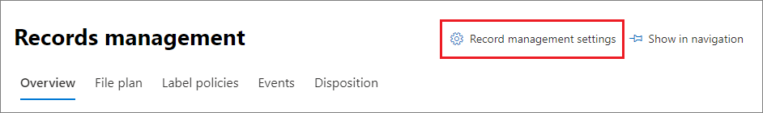

# <a name="disposition-of-content"></a><span data-ttu-id="18f23-103">Disposition von Inhalten</span><span class="sxs-lookup"><span data-stu-id="18f23-103">Disposition of content</span></span>

><span data-ttu-id="18f23-104">*[Microsoft 365-Lizenzierungsleitfaden für Sicherheit und Compliance](/office365/servicedescriptions/microsoft-365-service-descriptions/microsoft-365-tenantlevel-services-licensing-guidance/microsoft-365-security-compliance-licensing-guidance).*</span><span class="sxs-lookup"><span data-stu-id="18f23-104">*[Microsoft 365 licensing guidance for security & compliance](/office365/servicedescriptions/microsoft-365-service-descriptions/microsoft-365-tenantlevel-services-licensing-guidance/microsoft-365-security-compliance-licensing-guidance).*</span></span>

<span data-ttu-id="18f23-105">Verwenden Sie die Seite **Löschung** aus der **Datensatzverwaltung** im Microsoft 365 Compliance Center, um die Löschungsprüfungen zu verwalten und die Metadaten von [Datensätzen](records-management.md#records) anzuzeigen, die am Ende des Aufbewahrungszeitraums automatisch gelöscht wurden.</span><span class="sxs-lookup"><span data-stu-id="18f23-105">Use the **Disposition** page from **Records Management** in the Microsoft 365 compliance center to manage disposition reviews and view the metadata of [records](records-management.md#records) that have been automatically deleted at the end of their retention period.</span></span>

> [!NOTE]
> <span data-ttu-id="18f23-106">In der Vorschau: **mehrstufige Löschungsprüfung**</span><span class="sxs-lookup"><span data-stu-id="18f23-106">In preview: **multi-stage disposition review**</span></span>
> 
> <span data-ttu-id="18f23-107">Ein Administrator kann jetzt bis zu fünf aufeinanderfolgende Stufen der Löschungsprüfung zu einer Aufbewahrungsbezeichnung hinzufügen, und Prüfer können andere Benutzer zu ihrer Löschungsprüfungsstufe hinzufügen.</span><span class="sxs-lookup"><span data-stu-id="18f23-107">An administrator can now add up to five consecutive stages of disposition review in a retention label, and reviewers can add others users to their disposition review stage.</span></span> <span data-ttu-id="18f23-108">Sie können auch die E-Mail-Benachrichtigungen und -Erinnerungen anpassen.</span><span class="sxs-lookup"><span data-stu-id="18f23-108">You can also customize the email notifications and reminders.</span></span> <span data-ttu-id="18f23-109">Die folgenden Abschnitte enthalten weitere Informationen zu den Änderungen in dieser Vorschau.</span><span class="sxs-lookup"><span data-stu-id="18f23-109">The following sections have more information about the changes in this preview.</span></span>
>
> <span data-ttu-id="18f23-110">Informationen zur Veröffentlichungsankündigung finden Sie im Blogbeitrag [Ankündigung der mehrstufigen Löschung in der Microsoft-Datensatzverwaltung](https://techcommunity.microsoft.com/t5/security-compliance-and-identity/announcing-multi-stage-disposition-in-microsoft-records/ba-p/2361849).</span><span class="sxs-lookup"><span data-stu-id="18f23-110">To read the release announcement, see the blog post [Announcing Multi-Stage Disposition in Microsoft Records Management](https://techcommunity.microsoft.com/t5/security-compliance-and-identity/announcing-multi-stage-disposition-in-microsoft-records/ba-p/2361849).</span></span>

## <a name="prerequisites-for-viewing-content-dispositions"></a><span data-ttu-id="18f23-111">Voraussetzungen für die Anzeige von Inhaltsdispositionen</span><span class="sxs-lookup"><span data-stu-id="18f23-111">Prerequisites for viewing content dispositions</span></span>

<span data-ttu-id="18f23-112">Zum Verwalten von Löschungsprüfungen und zum bestätigen, dass Datensätze gelöscht wurden, müssen Sie über ausreichende Berechtigungen verfügen, und die Überwachung muss aktiviert sein.</span><span class="sxs-lookup"><span data-stu-id="18f23-112">To manage disposition reviews and confirm that records have been deleted, you must have sufficient permissions and auditing must be enabled.</span></span> <span data-ttu-id="18f23-113">Beachten Sie außerdem etwaige [Einschränkungen](retention-limits.md#maximum-number-of-items-for-disposition)für Anordnungen.</span><span class="sxs-lookup"><span data-stu-id="18f23-113">Also be aware of any [limitations](retention-limits.md#maximum-number-of-items-for-disposition) for disposition.</span></span>

### <a name="permissions-for-disposition"></a><span data-ttu-id="18f23-114">Berechtigungen für Dispositionen</span><span class="sxs-lookup"><span data-stu-id="18f23-114">Permissions for disposition</span></span>

<span data-ttu-id="18f23-115">Um im Microsoft 365 Compliance Center erfolgreich auf die Registerkarte **Löschung** zugreifen zu können, müssen die Benutzer über die Rolle **Löschungsverwaltung** verfügen.</span><span class="sxs-lookup"><span data-stu-id="18f23-115">To successfully access the **Disposition** tab in the Microsoft 365 compliance center, users must have the **Disposition Management** role.</span></span> <span data-ttu-id="18f23-116">Seit Dezember 2020 ist diese Rolle nun in der Standardrollengruppe **Datensatzverwaltung** enthalten.</span><span class="sxs-lookup"><span data-stu-id="18f23-116">From December 2020, this role is now included in the **Records Management** default role group.</span></span>

> [!NOTE]
> <span data-ttu-id="18f23-117">Die Rolle **Löschungsverwaltung** wird einem globalen Administrator standardmäßig nicht zugewiesen.</span><span class="sxs-lookup"><span data-stu-id="18f23-117">By default, a global admin isn't granted the **Disposition Management** role.</span></span> 

<span data-ttu-id="18f23-118">Um Benutzern nur die Berechtigungen zu gewähren, die sie für Löschungsprüfungen benötigen, ohne ihnen Berechtigungen zum Anzeigen und Konfigurieren anderer Features für die Aufbewahrung und die Datensatzverwaltung zu gewähren, erstellen Sie eine benutzerdefinierte Rollengruppe (z. B. mit dem Namen „Löschungsprüfer“) und gewähren dieser Gruppe die Rolle **Löschungsverwaltung**.</span><span class="sxs-lookup"><span data-stu-id="18f23-118">To grant users just the permissions they need for disposition reviews without granting them permissions to view and configure other features for retention and records management, create a custom role group (for example, named "Disposition Reviewers") and grant this group the **Disposition Management** role.</span></span>

<span data-ttu-id="18f23-119">Anweisungen zum Konfigurieren dieser Berechtigungen finden Sie unter [Gewähren des Benutzerzugriffs auf das Office 365 Security & Compliance Center](../security/office-365-security/grant-access-to-the-security-and-compliance-center.md).</span><span class="sxs-lookup"><span data-stu-id="18f23-119">For instructions to configure these permissions, see [Give users access to the Office 365 Security & Compliance Center](../security/office-365-security/grant-access-to-the-security-and-compliance-center.md).</span></span>

<span data-ttu-id="18f23-120">Zusätzlich:</span><span class="sxs-lookup"><span data-stu-id="18f23-120">Additionally:</span></span>

- <span data-ttu-id="18f23-121">Um den Inhalt von Elementen während des Löschvorgangs anzuzeigen, fügen Sie Benutzer zur Rollengruppen **Inhaltsbetrachter im Inhalts-Explorer** hinzu.</span><span class="sxs-lookup"><span data-stu-id="18f23-121">To view the contents of items during the disposition process, add users to the **Content Explorer Content Viewer** role group.</span></span> <span data-ttu-id="18f23-122">Wenn Benutzer nicht über die Berechtigungen dieser Rollengruppe verfügen, können sie trotzdem eine Aktion zum Abschluss der Löschungsprüfung auswählen, müssen dies aber tun, ohne den Inhalt des Elements im Minivorschaubereich des Compliance Centers sehen zu können.</span><span class="sxs-lookup"><span data-stu-id="18f23-122">If users don't have the permissions from this role group, they can still select a disposition review action to complete the disposition review, but must do so without being able to view the item's contents from the mini-preview pane in the compliance center.</span></span>

- <span data-ttu-id="18f23-123">In Vorschau: Standardmäßig sieht jede Person, welche auf die Seite **Löschung** zugreift, nur die Elemente, die ihnen zur Überprüfung zugewiesen sind.</span><span class="sxs-lookup"><span data-stu-id="18f23-123">In preview: By default, each person that accesses the **Disposition** page sees only items that they are assigned to review.</span></span> <span data-ttu-id="18f23-124">Damit ein Datensatzverwaltungsadministrator alle Elemente sieht, die allen Benutzern zugewiesen sind, und alle Aufbewahrungsbezeichnungen, welche für die Löschungsprüfung konfiguriert sind, navigiert er zu **Datensatzverwaltungseinstellungen** > **Allgemein** > **Datensatzverwalter-Sicherheitsgruppe**, um eine E-Mail-aktivierte Sicherheitsgruppe auszuwählen und dann zu aktivieren, welche die Administratorkonten enthält.</span><span class="sxs-lookup"><span data-stu-id="18f23-124">For a records management administrator to see all items assigned to all users, and all retention labels that are configured for disposition review: Navigate to **Records management settings** > **General** > **Security group for records manager** to select and then enable a mail-enabled security group that contains the administrator accounts.</span></span>
    
    <span data-ttu-id="18f23-125">Microsoft 365-Gruppen und -Sicherheitsgruppen, welche nicht E-Mail-aktiviert sind, unterstützten dieses Feature nicht und würden in der Liste nicht zur Auswahl angezeigt.</span><span class="sxs-lookup"><span data-stu-id="18f23-125">Microsoft 365 groups and security groups that aren't mail-enabled doesn't support this feature and wouldn't be displayed in the list to select.</span></span> <span data-ttu-id="18f23-126">Wenn Sie eine neue E-Mail-aktivierte Sicherheitsgruppe erstellen müssen, verwenden Sie den Link zum Microsoft 365 Admin Center, um eine neue Gruppe zu erstellen.</span><span class="sxs-lookup"><span data-stu-id="18f23-126">If you need to create a new mail-enabled security group, use the link to the Microsoft 365 admin center to create the new group.</span></span> 
    
    > [!IMPORTANT]
    > <span data-ttu-id="18f23-127">Nachdem Sie die Gruppe aktiviert haben, können Sie sie nicht mehr im Compliance Center ändern.</span><span class="sxs-lookup"><span data-stu-id="18f23-127">After you have enabled the group, you can't change it in the compliance center.</span></span> <span data-ttu-id="18f23-128">Informationen zum Aktivieren einer anderen Gruppe mithilfe von PowerShell finden Sie im nächsten Abschnitt.</span><span class="sxs-lookup"><span data-stu-id="18f23-128">See the next section for how to enable a different group by using PowerShell.</span></span>

- <span data-ttu-id="18f23-129">In Vorschau: Die Option **Datensatzverwaltungseinstellungen** ist nur für Datensatzverwaltungsadministratoren sichtbar.</span><span class="sxs-lookup"><span data-stu-id="18f23-129">In preview: The **Records management settings** option is visible only to record management administrators.</span></span> 

#### <a name="enabling-another-security-group-for-disposition"></a><span data-ttu-id="18f23-130">Aktivieren einer anderen Sicherheitsgruppe für die Löschung</span><span class="sxs-lookup"><span data-stu-id="18f23-130">Enabling another security group for disposition</span></span>

<span data-ttu-id="18f23-131">Nachdem Sie im Microsoft 365 Compliance Center eine Sicherheitsgruppe für die Löschung aus den **Einstellungen für die Datensatzverwaltung** aktiviert haben, können Sie diese Berechtigung für die Gruppe nicht deaktivieren oder die ausgewählte Gruppe im Compliance Center ersetzen.</span><span class="sxs-lookup"><span data-stu-id="18f23-131">After you have enabled a security group for disposition from the **Records management settings** in the Microsoft 365 compliance center, you can't disable this permission for the group or replace the selected group in the compliance center.</span></span> <span data-ttu-id="18f23-132">Sie können jedoch eine andere E-Mail-aktivierte Sicherheitsgruppe aktivieren, indem Sie das Cmdlet [Enable-ComplianceTagStorage](/powershell/module/exchange/enable-compliancetagstorage) verwenden.</span><span class="sxs-lookup"><span data-stu-id="18f23-132">However, you can enable another mail-enabled security group by using the [Enable-ComplianceTagStorage](/powershell/module/exchange/enable-compliancetagstorage) cmdlet.</span></span>

<span data-ttu-id="18f23-133">Beispiel:</span><span class="sxs-lookup"><span data-stu-id="18f23-133">For example:</span></span> 

```PowerShell
Enable-ComplianceTagStorage -RecordsManagementSecurityGroupEmail dispositionreviewers@contosoi.com
````

### <a name="enable-auditing"></a><span data-ttu-id="18f23-134">Überwachung aktivieren</span><span class="sxs-lookup"><span data-stu-id="18f23-134">Enable auditing</span></span>

<span data-ttu-id="18f23-135">Vergewissern Sie sich, dass die Überwachung mindestens einen Tag vor der ersten Dispositionsaktion aktiviert ist.</span><span class="sxs-lookup"><span data-stu-id="18f23-135">Make sure that auditing is enabled at least one day before the first disposition action.</span></span> <span data-ttu-id="18f23-136">Weitere Informationen finden Sie unter [Durchsuchen des Überwachungsprotokolls im Office 365 Security &amp; Compliance Center](search-the-audit-log-in-security-and-compliance.md).</span><span class="sxs-lookup"><span data-stu-id="18f23-136">For more information, see [Search the audit log in the Office 365 Security &amp; Compliance Center](search-the-audit-log-in-security-and-compliance.md).</span></span> 

## <a name="disposition-reviews"></a><span data-ttu-id="18f23-137">Löschungsprüfungen</span><span class="sxs-lookup"><span data-stu-id="18f23-137">Disposition reviews</span></span>

<span data-ttu-id="18f23-p110">Wenn Inhalte das Ende des Aufbewahrungszeitraums erreichen, können Sie aus mehreren Gründen überprüfen und bestätigen, ob sie dauerhaft gelöscht ("verworfen") werden können. Anstatt den Inhalt zu löschen, müssen Sie möglicherweise Folgendes:</span><span class="sxs-lookup"><span data-stu-id="18f23-p110">When content reaches the end of its retention period, there are several reasons why you might want to review that content and confirm whether it can be permanently deleted ("disposed"). For example, instead of deleting the content, you might need to:</span></span>
  
- <span data-ttu-id="18f23-140">Aussetzen der Löschung relevanter Inhalte für Rechtsstreitigkeiten oder ein Audit.</span><span class="sxs-lookup"><span data-stu-id="18f23-140">Suspend the deletion of relevant content for litigation or an audit.</span></span>

- <span data-ttu-id="18f23-141">Zuweisen eines anderen Aufbewahrungszeitraums für die Inhalte, vielleicht, weil die ursprünglichen Aufbewahrungseinstellungen eine vorübergehende oder vorläufige Lösung waren.</span><span class="sxs-lookup"><span data-stu-id="18f23-141">Assign a different retention period to the content, perhaps because the original retention settings were a temporary or provisional solution.</span></span>

- <span data-ttu-id="18f23-142">Verschieben des Inhalts von seinem bisherigen Speicherort an einen Archivspeicherort, z. B. wenn dieser Inhalt von wissenschaftlichem oder historischem Wert ist.</span><span class="sxs-lookup"><span data-stu-id="18f23-142">Move the content from its existing location to an archive location, for example, if that content has research or historical value.</span></span>

<span data-ttu-id="18f23-143">Wenn am Ende des Aufbewahrungszeitraums eine Löschungsprüfung ausgelöst wird:</span><span class="sxs-lookup"><span data-stu-id="18f23-143">When a disposition review is triggered at the end of the retention period:</span></span>
  
- <span data-ttu-id="18f23-144">Die von Ihnen ausgewählten Prüfer erhalten eine E-Mail-Benachrichtigung, dass für sie Inhalte zur Überprüfung bereitstehen.</span><span class="sxs-lookup"><span data-stu-id="18f23-144">The reviewers you choose receive an email notification that they have content to review.</span></span> <span data-ttu-id="18f23-145">Bei diesen Prüfern kann es sich um einzelne Benutzer oder E-Mail-aktivierte Sicherheitsgruppen handeln.</span><span class="sxs-lookup"><span data-stu-id="18f23-145">These reviewers can be individual users or mail-enabled security groups.</span></span> <span data-ttu-id="18f23-146">Neu in der Vorschau:</span><span class="sxs-lookup"><span data-stu-id="18f23-146">New in preview:</span></span>
   - <span data-ttu-id="18f23-147">Sie können die E-Mail anpassen, welche sie erhalten, einschließlich Anweisungen in verschiedenen Sprachen.</span><span class="sxs-lookup"><span data-stu-id="18f23-147">You can customize the email that they receive, including instructions in different languages.</span></span> <span data-ttu-id="18f23-148">Für mehrsprachige Unterstützung müssen Sie die Übersetzungen selber erstellen, und dieser benutzerdefinierte Text wird allen Prüfern angezeigt, unabhängig von ihrem Gebietsschema.</span><span class="sxs-lookup"><span data-stu-id="18f23-148">For multi-language support, you must specify the translations yourself and this custom text is displayed to all reviewers irrespective of their locale.</span></span>
   - <span data-ttu-id="18f23-149">Benutzer erhalten eine anfängliche E-Mail-Benachrichtigung pro Bezeichnung am Ende des Aufbewahrungszeitraums des Elements, mit einer wöchentlichen Erinnerung pro Bezeichnung für alle Löschungsprüfungen, die ihnen zugewiesen sind.</span><span class="sxs-lookup"><span data-stu-id="18f23-149">Users receive an initial email notification per label at the end of the item's retention period, with a reminder per label once a week of all disposition reviews that they are assigned.</span></span> <span data-ttu-id="18f23-150">Sie können auf den Link in den E-Mails für Benachrichtigungen und Erinnerungen klicken, um zur Seite **Löschung** im Microsoft 365 Compliance Center zu gehen und die Inhalte zu überprüfen und Aktionen einzuleiten.</span><span class="sxs-lookup"><span data-stu-id="18f23-150">They can click the link in the notification and reminder emails to go to the **Disposition** page in the Microsoft 365 compliance center to review the content and take an action.</span></span> <span data-ttu-id="18f23-151">Die Prüfer können alternativ auch direkt zur Seite **Löschung** im Compliance Center gehen.</span><span class="sxs-lookup"><span data-stu-id="18f23-151">Alternately, the reviewers can go directly to the **Disposition** page in the compliance center.</span></span>
   - <span data-ttu-id="18f23-152">Prüfer sehen nur die Löschungsprüfungen, die ihnen zugewiesen sind, während Administratoren, welche der ausgewählten Datensatzverwalter-Sicherheitsgruppe hinzugefügt sind, alle Löschungsprüfungen sehen.</span><span class="sxs-lookup"><span data-stu-id="18f23-152">Reviewers see only the disposition reviews that are assigned to them, whereas administrators who are added to the selected security group for records manager see all disposition reviews.</span></span>
   - <span data-ttu-id="18f23-153">Prüfer können neue Benutzer für die gleiche Löschungsprüfung hinzufügen.</span><span class="sxs-lookup"><span data-stu-id="18f23-153">Reviewers can add new users to the same disposition review.</span></span> <span data-ttu-id="18f23-154">Derzeit gewährt diese Aktion den hinzugefügten Benutzern nicht automatisch die [erforderlichen Berechtigungen](#permissions-for-disposition).</span><span class="sxs-lookup"><span data-stu-id="18f23-154">Currently, this action doesn't automatically grant these added users the [required permissions](#permissions-for-disposition).</span></span>
   - <span data-ttu-id="18f23-155">Ein Miniprüfbereich für den Löschungsprüfungsprozess zeigt für jedes Element eine Vorschau des Inhalts an, wenn sie die Berechtigungen zum anzeigen haben.</span><span class="sxs-lookup"><span data-stu-id="18f23-155">For the disposition review process, a mini-review pane for each item shows a preview of the content if they have permissions to see it.</span></span> <span data-ttu-id="18f23-156">Wenn sie nicht über diese Berechtigungen verfügen, können Sie den Inhaltslink auswählen und Berechtigungen anfordern.</span><span class="sxs-lookup"><span data-stu-id="18f23-156">If they don't have permissions, they can select the content link and request permissions.</span></span> <span data-ttu-id="18f23-157">Dieser Miniprüfbereich verfügt ebenfalls über Registerkarten für zusätzliche Informationen über den Inhalt:</span><span class="sxs-lookup"><span data-stu-id="18f23-157">This mini-review pane also has tabs for additional information about the content:</span></span>
       - <span data-ttu-id="18f23-158">**Details** zum anzeigen indizierter Eigenschaften, wo sich das Element befindet, wer es erstellt hat und wann, und wer es zuletzt geändert hat und wann.</span><span class="sxs-lookup"><span data-stu-id="18f23-158">**Details** to display indexed properties, where it's located, who created it and when, and who last modified it and when.</span></span>
       - <span data-ttu-id="18f23-159">**Verlauf** zeigt den Verlauf sämtlicher bisheriger Löschungsprüfungsaktionen an, mit Prüferkommentaren, wenn verfügbar.</span><span class="sxs-lookup"><span data-stu-id="18f23-159">**History** that shows the history of any disposition review actions to date, with reviewer comments if available.</span></span>

<span data-ttu-id="18f23-160">Eine Löschungsprüfung kann Inhalte in Exchange-Postfächern, SharePoint-Websites und OneDrive-Konten umfassen.</span><span class="sxs-lookup"><span data-stu-id="18f23-160">A disposition review can include content in Exchange mailboxes, SharePoint sites, and OneDrive accounts.</span></span> <span data-ttu-id="18f23-161">Inhalte, für welche an diesen Speicherorten eine Löschungsprüfung ansteht, werden erst dann dauerhaft gelöscht, wenn ein Prüfer für die letzte Stufe der Löschung entscheidet, den Inhalt dauerhaft zu löschen.</span><span class="sxs-lookup"><span data-stu-id="18f23-161">Content pending a disposition review in those locations is permanently deleted only after a reviewer for the final stage of disposition chooses to permanently delete the content.</span></span>

> [!NOTE]
> <span data-ttu-id="18f23-162">Ein Postfach muss mindestens 10 MB Daten aufweisen, um Löschungsprüfungen zu unterstützen.</span><span class="sxs-lookup"><span data-stu-id="18f23-162">A mailbox must have at least 10 MB data to support disposition reviews.</span></span>

<span data-ttu-id="18f23-163">Administratoren können einen Überblick über alle ausstehenden Löschungen in der Registerkarte **Überblick** sehen. Prüfer sehen nur ihre eigenen Elemente, für die eine Löschung ausstehend ist.</span><span class="sxs-lookup"><span data-stu-id="18f23-163">Administrators can see an overview of all pending dispositions in the **Overview** tab. Reviewers see only their items pending disposition.</span></span> <span data-ttu-id="18f23-164">Beispiel:</span><span class="sxs-lookup"><span data-stu-id="18f23-164">For example:</span></span>


<span data-ttu-id="18f23-166">Wenn Sie **Alle ausstehenden Löschungen anzeigen** auswählen, werden Sie zur Seite **Disposition** geleitet.</span><span class="sxs-lookup"><span data-stu-id="18f23-166">When you select the **View all pending dispositions**, you're taken to the **Disposition** page.</span></span> <span data-ttu-id="18f23-167">Beispiel:</span><span class="sxs-lookup"><span data-stu-id="18f23-167">For example:</span></span>


### <a name="workflow-for-a-disposition-review"></a><span data-ttu-id="18f23-169">Workflow für die Löschungsprüfung</span><span class="sxs-lookup"><span data-stu-id="18f23-169">Workflow for a disposition review</span></span>

<span data-ttu-id="18f23-170">Das folgende Diagramm zeigt den grundlegenden Arbeitsablauf einer Löschungsprüfung, wenn eine Aufbewahrungsbezeichnung veröffentlicht und dann manuell von einem Benutzer angewendet wird.</span><span class="sxs-lookup"><span data-stu-id="18f23-170">The following diagram shows the basic workflow for a disposition review when a retention label is published and then manually applied by a user.</span></span> <span data-ttu-id="18f23-171">Alternativ kann eine für eine Löschungsprüfung konfigurierte Aufbewahrungsbezeichnung automatisch auf Inhalte angewendet werden.</span><span class="sxs-lookup"><span data-stu-id="18f23-171">Alternatively, a retention label configured for a disposition review can be automatically applied to content.</span></span>
  


### <a name="how-to-configure-a-retention-label-for-disposition-review"></a><span data-ttu-id="18f23-173">So konfigurieren Sie eine Aufbewahrungsbezeichnung für die Löschungsprüfung</span><span class="sxs-lookup"><span data-stu-id="18f23-173">How to configure a retention label for disposition review</span></span>

<span data-ttu-id="18f23-174">Das Auslösen einer Löschungsprüfung am Ende des Aufbewahrungszeitraums ist eine Konfigurationsoption, die nur mit einer Aufbewahrungsbezeichnung verfügbar ist.</span><span class="sxs-lookup"><span data-stu-id="18f23-174">Triggering a disposition review at the end of the retention period is a configuration option that's available only with a retention label.</span></span> <span data-ttu-id="18f23-175">Die Löschungsprüfung ist für eine Aufbewahrungsrichtlinie nicht verfügbar.</span><span class="sxs-lookup"><span data-stu-id="18f23-175">Disposition review is not available for a retention policy.</span></span> <span data-ttu-id="18f23-176">Weitere Informationen zu diesen beiden Aufbewahrungslösungen finden Sie unter [Informationen zu Aufbewahrungsrichtlinien und Aufbewahrungsbezeichnungen](retention.md).</span><span class="sxs-lookup"><span data-stu-id="18f23-176">For more information about these two retention solutions, see [Learn about retention policies and retention labels](retention.md).</span></span>

<span data-ttu-id="18f23-177">Von der Seite **Aufbewahrungseinstellungen definieren** für eine Aufbewahrungsbezeichnung:</span><span class="sxs-lookup"><span data-stu-id="18f23-177">From the **Define retention settings** page for a retention label:</span></span>


 
<span data-ttu-id="18f23-179">Nachdem Sie die Option **Löschungsprüfung auslösen** ausgewählt haben, geben Sie auf der nächsten Seite des Assistenten an, wie viele aufeinanderfolgende Stufen der Löschungsprüfung Sie wollen, sowie die Löschungsprüfer für jede Stufe:</span><span class="sxs-lookup"><span data-stu-id="18f23-179">After you select this **Trigger a disposition review** option, on the next page of the wizard, you specify how many consecutive stages of disposition you want and the disposition reviewers for each stage:</span></span>

 

<span data-ttu-id="18f23-181">Wählen Sie **Eine Stufe hinzufügen** aus, und benennen Sie Ihre Stufe für Identifikationszwecke.</span><span class="sxs-lookup"><span data-stu-id="18f23-181">Select **Add a stage**, and name your stage for identification purposes.</span></span> <span data-ttu-id="18f23-182">Legen Sie dann die Prüfer für diese Stufe fest.</span><span class="sxs-lookup"><span data-stu-id="18f23-182">Then specify the reviewers for that stage.</span></span>

<span data-ttu-id="18f23-183">Legen Sie als Prüfer einen Benutzer oder eine E-Mail-aktivierte Sicherheitsgruppe fest.</span><span class="sxs-lookup"><span data-stu-id="18f23-183">For the reviewers, specify a user or a mail-enabled security group.</span></span> <span data-ttu-id="18f23-184">Microsoft 365-Gruppen ([vormals Office 365-Gruppen](https://techcommunity.microsoft.com/t5/microsoft-365-blog/office-365-groups-will-become-microsoft-365-groups/ba-p/1303601)) werden für diese Option derzeit nicht unterstützt.</span><span class="sxs-lookup"><span data-stu-id="18f23-184">Microsoft 365 groups ([formerly Office 365 groups](https://techcommunity.microsoft.com/t5/microsoft-365-blog/office-365-groups-will-become-microsoft-365-groups/ba-p/1303601)) are currently not supported for this option.</span></span>

<span data-ttu-id="18f23-185">Wenn Sie mehr als eine Person benötigen, um ein Element am Ende seines Aufbewahrungszeitraums zu überprüfen, wählen Sie **Eine Stufe hinzufügen** aus, und wiederholen Sie den Konfigurationsprozess für die Anzahl der von Ihnen benötigten Stufen, mit einem Maximum von fünf Stufen.</span><span class="sxs-lookup"><span data-stu-id="18f23-185">If you need more than one person to review an item at the end of its retention period, select **Add a stage** again and repeat the configuration process for the number of stages that you need, with a maximum of five stages.</span></span> 

<span data-ttu-id="18f23-p123">Innerhalb jeder einzelnen Stufe der Löschung ist jeder Benutzer, den Sie für diese Stufe angeben, berechtigt, am Ende des Aufbewahrungszeitraums die nächste Aktion für das Element durchzuführen. Diese Benutzer können auch weitere Benutzer zu ihrer Stufe der Löschungsprüfung hinzufügen.</span><span class="sxs-lookup"><span data-stu-id="18f23-p123">Within each individual stage of disposition, any of the users you specify for that stage are authorized to take the next action for the item at the end of its retention period. These users can also add other users to their disposition review stage.</span></span>

> [!NOTE]
> <span data-ttu-id="18f23-188">Bestehende Aufbewahrungsbezeichnungen, welche für die Löschungsprüfung konfiguriert sind, können durch Konfiguration der Bezeichnung hochgestuft werden, um eine mehrstufige Löschungsprüfung zu verwenden.</span><span class="sxs-lookup"><span data-stu-id="18f23-188">Existing retention labels that are configured for disposition review can be upgraded to use multi-staged disposition review by configuring the label.</span></span> <span data-ttu-id="18f23-189">Wählen Sie im Bezeichnungsassistenten **Eine Stufe hinzufügen** aus, oder ändern Sie die bestehenden Prüfer, oder fügen Sie neue Prüfer hinzu.</span><span class="sxs-lookup"><span data-stu-id="18f23-189">In the label wizard, select **Add a stage**, or edit the existing reviewers or add new reviewers.</span></span>

<span data-ttu-id="18f23-190">Während der Konfigurationsphase können Sie jede angegebene Stufe umbenennen, sie neu anordnen oder entfernen, indem Sie die Option für Stufenaktionen (**...**) auswählen:</span><span class="sxs-lookup"><span data-stu-id="18f23-190">During the configuration phase, for each stage specified, you can rename it, reorder it, or remove it by selecting the Stage actions option (**...**):</span></span> 


<span data-ttu-id="18f23-192">Sie können jedoch eine Stufe nicht neu anordnen oder entfernen, nachdem Sie die Aufbewahrungsbezeichnung erstellt haben.</span><span class="sxs-lookup"><span data-stu-id="18f23-192">However, you can't reorder or remove a stage after you have created the retention label.</span></span>

<span data-ttu-id="18f23-193">Denken Sie daran, dass Sie nach dem Festlegen Ihrer Prüfer die Rollenberechtigung **Löschungsverwaltung** zuweisen müssen.</span><span class="sxs-lookup"><span data-stu-id="18f23-193">After you have specified your reviewers, remember to grant them the **Disposition Management** role permission.</span></span> <span data-ttu-id="18f23-194">Weitere Informationen hierzu finden Sie auf dieser Seite im Abschnitt [Berechtigungen für die Löschung](#permissions-for-disposition).</span><span class="sxs-lookup"><span data-stu-id="18f23-194">For more information, see the [Permissions for disposition](#permissions-for-disposition) section on this page.</span></span>

### <a name="how-to-customize-email-messages-for-disposition-review"></a><span data-ttu-id="18f23-195">So passen Sie E-Mail-Nachrichten für die Löschungsprüfung an</span><span class="sxs-lookup"><span data-stu-id="18f23-195">How to customize email messages for disposition review</span></span>

<span data-ttu-id="18f23-196">Beispiel für eine standardmäßige E-Mail-Benachrichtigung, die an einen Prüfer gesendet wurde:</span><span class="sxs-lookup"><span data-stu-id="18f23-196">Example default email notification sent to a reviewer:</span></span>


<span data-ttu-id="18f23-198">Ebenfalls in der Vorschau können Sie die E-Mail-Nachrichten anpassen, welche den Löschungsprüfern für die anfängliche Benachrichtigung und danach für die Erinnerungen zugestellt werden.</span><span class="sxs-lookup"><span data-stu-id="18f23-198">Also in preview, you can customize the email messages that are sent to disposition reviewers for the initial notification and then reminders.</span></span>

<span data-ttu-id="18f23-199">Wählen Sie auf einer beliebigen Löschungsseite im Compliance Center die Option **Datensatzverwaltungseinstellungen** aus:</span><span class="sxs-lookup"><span data-stu-id="18f23-199">From any of the Disposition pages in the compliance center, select **Records management settings**:</span></span>  



<span data-ttu-id="18f23-201">Wählen Sie dann die Registerkarte **Benachrichtigungen zur Löschung** aus, und geben Sie an, ob Sie nur die Standard-E-Mail-Vorlagen verwenden oder Ihren eigenen Text der Standardvorlage hinzufügen wollen.</span><span class="sxs-lookup"><span data-stu-id="18f23-201">Then select the **Disposition notifications** tab, and specify whether you want to use just the default email message, or add your own text to the default message.</span></span> <span data-ttu-id="18f23-202">Ihr benutzerdefinierter Text wird den E-Mail-Anweisungen nach den Informationen über die Aufbewahrungsbezeichnung und vor den Anweisungen für die nächsten Schritte hinzugefügt.</span><span class="sxs-lookup"><span data-stu-id="18f23-202">Your custom text is added to the email instructions after the information about the retention label and before the next steps instructions.</span></span>

<span data-ttu-id="18f23-203">Text kann für alle Sprachen hinzugefügt werden, aber Formatierung und Bilder sind derzeit nicht unterstützt.</span><span class="sxs-lookup"><span data-stu-id="18f23-203">Text for all languages can be added, but formatting and images are currently unsupported.</span></span> <span data-ttu-id="18f23-204">URLs und E-Mail-Adressen können als Text eingegeben werden und werden abhängig vom E-Mail-Client als Hyperlinks oder unformatierter Text in der angepassten E-Mail angezeigt.</span><span class="sxs-lookup"><span data-stu-id="18f23-204">URLs and email addresses can be entered as text and depending on the email client, display as hyperlinks or unformatted text in the customized email.</span></span>

<span data-ttu-id="18f23-205">Beispieltext zum Hinzufügen:</span><span class="sxs-lookup"><span data-stu-id="18f23-205">Example text to add:</span></span>

```console
If you need additional information, visit the helpdesk website (https://support.contoso.com) or send them an email (helpdesk@contoso.com).
```

<span data-ttu-id="18f23-206">Wählen Sie **Speichern** aus, um Änderungen zu speichern.</span><span class="sxs-lookup"><span data-stu-id="18f23-206">Select **Save** to save any changes.</span></span>

### <a name="viewing-and-disposing-of-content"></a><span data-ttu-id="18f23-207">Anzeigen und Verwerfen von Inhalten</span><span class="sxs-lookup"><span data-stu-id="18f23-207">Viewing and disposing of content</span></span>

<span data-ttu-id="18f23-208">Wenn ein Prüfer per E-Mail benachrichtigt wird, dass Inhalte zur Überprüfung bereitstehen, kann er auf einen Link in der E-Mail klicken, wodurch er direkt zur Registerkarte **Löschung** aus der **Datensatzverwaltung** im Microsoft 365 Compliance Center wechseln wird.</span><span class="sxs-lookup"><span data-stu-id="18f23-208">When a reviewer is notified by email that content is ready to review, they can click a link in the email that takes them directly to the **Disposition** page from **Records management** in the Microsoft 365 compliance center.</span></span> <span data-ttu-id="18f23-209">Dort können die Prüfer sehen, wie viele Elemente für jede Aufbewahrungsbezeichnung auf die Löschung warten, wenn der **Typ** **Ausstehende Löschung** anzeigt.</span><span class="sxs-lookup"><span data-stu-id="18f23-209">There, the reviewers can see how many items for each retention label are waiting disposition with the **Type** displaying **Pending disposition**.</span></span> <span data-ttu-id="18f23-210">Sie wählen dann eine Aufbewahrungsbezeichnung aus und **Öffnen in einem neuen Fenster**, um alle Inhalte mit dieser Bezeichnung zu sehen:</span><span class="sxs-lookup"><span data-stu-id="18f23-210">They then select a retention label, and **Open in new window** to see all content with that label:</span></span>


<span data-ttu-id="18f23-212">Auf der Seite **Ausstehende Löschungen** sehen sie alle ausstehenden Löschungen für diese Bezeichnung.</span><span class="sxs-lookup"><span data-stu-id="18f23-212">From the **Pending dispositions** page, they see all pending dispositions for that label.</span></span> <span data-ttu-id="18f23-213">Wenn mindestens ein Element ausgewählt ist, können Sie den Minivorschaubereich und die Registerkarten **Quelle**, **Details** und **Verlauf** verwenden, um den Inhalt zu untersuchen, bevor Aktionen darauf angewendet werden:</span><span class="sxs-lookup"><span data-stu-id="18f23-213">When one or more items are selected, they can use the mini-preview pane and the **Source**, **Details**, and **History** tab to inspect the content before taking action on it:</span></span>


<span data-ttu-id="18f23-215">Wenn Sie die horizontale Bildlaufleiste verwenden oder den Miniprüfbereich schließen, sehen Sie weitere Spalten, die das Ablaufdatum und den Namen der Stufe der Löschungsprüfung enthalten.</span><span class="sxs-lookup"><span data-stu-id="18f23-215">If you use the horizontal scroll bar, or close the min-review pane, you see more columns that include the expiry date and the name of the disposition review stage.</span></span>

<span data-ttu-id="18f23-216">Wie Sie im gezeigten Beispiel sehen können, sind dies die unterstützten Aktionen:</span><span class="sxs-lookup"><span data-stu-id="18f23-216">As you can see from the example shown, the actions supported are:</span></span> 
  
- <span data-ttu-id="18f23-217">**Entsorgung genehmigen**:</span><span class="sxs-lookup"><span data-stu-id="18f23-217">**Approve disposal**:</span></span>
    - <span data-ttu-id="18f23-218">Wenn diese Aktion für eine Zwischenstufe der Löschungsprüfung ausgewählt wird (Sie haben mehrere Stufen konfiguriert): Das Element wird in die nächste Löschungsstufe verschoben.</span><span class="sxs-lookup"><span data-stu-id="18f23-218">When this action is selected for an interim stage of disposition review (you have configured multiple stages): The item moves to the next disposition stage.</span></span>
    - <span data-ttu-id="18f23-219">Wenn diese Aktion für die letzte Stufe der Löschungsprüfung ausgewählt wird, oder wenn es nur eine Stufe der Löschung gibt: Das Element wird als für die dauerhafte Löschung berechtigt markiert.</span><span class="sxs-lookup"><span data-stu-id="18f23-219">When this action is selected for the final stage of disposition review, or there is only one stage of disposition: The item is marked as eligible for permanent deletion.</span></span> <span data-ttu-id="18f23-220">Der genaue Zeitpunkt für diese Löschung hängt vom Workload ab.</span><span class="sxs-lookup"><span data-stu-id="18f23-220">The exact timing for that deletion depends on the workload.</span></span> <span data-ttu-id="18f23-221">Weitere Informationen finden Sie unter [Funktionsweise von Aufbewahrungseinstellungen bei vorhandenem Inhalt](retention.md#how-retention-settings-work-with-content-in-place).</span><span class="sxs-lookup"><span data-stu-id="18f23-221">For more information, see [How retention settings work with content in place](retention.md#how-retention-settings-work-with-content-in-place).</span></span>
- <span data-ttu-id="18f23-222">**Neu bezeichnen**:</span><span class="sxs-lookup"><span data-stu-id="18f23-222">**Relabel**:</span></span>
    - <span data-ttu-id="18f23-223">Wenn diese Aktion ausgewählt wird, verlässt das Element den Löschungsprüfungsprozess für die ursprüngliche Bezeichnung.</span><span class="sxs-lookup"><span data-stu-id="18f23-223">When this action is selected, the item exits the disposition review process for the original label.</span></span> <span data-ttu-id="18f23-224">Das Element unterliegt dann den Aufbewahrungseinstellungen der neu gewählten Aufbewahrungsbezeichnung.</span><span class="sxs-lookup"><span data-stu-id="18f23-224">The item is then subject to the retention settings of the newly selected retention label.</span></span>
- <span data-ttu-id="18f23-225">**Verlängern**:</span><span class="sxs-lookup"><span data-stu-id="18f23-225">**Extend**:</span></span>
    - <span data-ttu-id="18f23-226">Wenn diese Aktion ausgewählt ist, wird die Löschungsprüfung bis zum Ende des verlängerten Zeitraums effektiv ausgesetzt, und dann wird die Löschungsprüfung ab der ersten Stufe erneut ausgelöst.</span><span class="sxs-lookup"><span data-stu-id="18f23-226">When this action is selected, disposition review is effectively suspended until the end of the extended period and then disposition review is triggered again from the first stage.</span></span>
- <span data-ttu-id="18f23-227">**Prüfer hinzufügen**:</span><span class="sxs-lookup"><span data-stu-id="18f23-227">**Add reviewers**:</span></span>
    - <span data-ttu-id="18f23-228">Wenn diese Aktion ausgewählt ist, wird der Benutzer aufgefordert, weitere Benutzer für die Überprüfung anzugeben und hinzuzufügen.</span><span class="sxs-lookup"><span data-stu-id="18f23-228">When this action is selected, the user is prompted to specify and add other users for review.</span></span>
    
    > [!NOTE]
    > <span data-ttu-id="18f23-229">Diese Aktion gewährt den Benutzern, die hinzugefügt werden, nicht automatisch die [erforderlichen Berechtigungen](#permissions-for-disposition).</span><span class="sxs-lookup"><span data-stu-id="18f23-229">This action doesn't automatically grant the [required permissions](#permissions-for-disposition) to the users who are added.</span></span> <span data-ttu-id="18f23-230">Wenn sie diese Berechtigungen nicht haben, können Sie an der Löschungsprüfung nicht teilnehmen.</span><span class="sxs-lookup"><span data-stu-id="18f23-230">If they don't have these permissions, they won't be able to participate in the disposition review.</span></span>

<span data-ttu-id="18f23-231">Jede durchgeführte Aktion wird gesichert und gespeichert, obwohl Sie im Überwachungsprotokoll noch nicht danach suchen können.</span><span class="sxs-lookup"><span data-stu-id="18f23-231">Each action taken is saved and stored although you can't yet search for them in the audit log.</span></span>

<span data-ttu-id="18f23-232">Während einer Löschungsprüfung wird der Inhalt niemals von seinem ursprünglichen Speicherort verschoben und erst dann zum dauerhaften Löschen markiert, wenn diese Aktion von einem Prüfer für die letzte oder einzige Löschungsstufe ausgewählt wurde.</span><span class="sxs-lookup"><span data-stu-id="18f23-232">During a disposition review, the content never moves from its original location, and it's not marked for permanent deletion until this action is selected by a reviewer for the final or only disposition stage.</span></span>

## <a name="disposition-of-records"></a><span data-ttu-id="18f23-233">Disposition von Datensätzen</span><span class="sxs-lookup"><span data-stu-id="18f23-233">Disposition of records</span></span>

<span data-ttu-id="18f23-234">Verwenden Sie die Registerkarte **Löschung** von der Seite **Datensatzverwaltung** zur Identifikation von:</span><span class="sxs-lookup"><span data-stu-id="18f23-234">Use the **Disposition** tab from the **Records management** page to identify:</span></span>

- <span data-ttu-id="18f23-235">Elemente, die als Ergebnis einer Löschungsprüfung gelöscht wurden.</span><span class="sxs-lookup"><span data-stu-id="18f23-235">Items deleted as a result of a disposition review.</span></span>
- <span data-ttu-id="18f23-236">Elemente, die als Datensatz oder behördlicher Eintrag gekennzeichnet sind und am Ende ihres Aufbewahrungszeitraums automatisch gelöscht wurden.</span><span class="sxs-lookup"><span data-stu-id="18f23-236">Items marked as a record or regulatory record that were automatically deleted at the end of their retention period.</span></span>

<span data-ttu-id="18f23-237">Diese Elemente zeigen **Verworfene Datensätze** in der Spalte **Typ** an.</span><span class="sxs-lookup"><span data-stu-id="18f23-237">These items display **Records Disposed** in the **Type** column.</span></span> <span data-ttu-id="18f23-238">Beispiel:</span><span class="sxs-lookup"><span data-stu-id="18f23-238">For example:</span></span>


> [!NOTE]
> <span data-ttu-id="18f23-240">Diese Funktionalität verwendet Informationen aus dem [einheitlichen Überwachungsprotokoll](search-the-audit-log-in-security-and-compliance.md) und erfordert daher, dass die Überwachung [aktiviert und durchsuchbar ist](turn-audit-log-search-on-or-off.md) damit die entsprechenden Ereignisse erfasst werden.</span><span class="sxs-lookup"><span data-stu-id="18f23-240">This functionality uses information from the [unified audit log](search-the-audit-log-in-security-and-compliance.md) and therefore requires auditing to be [enabled and searchable](turn-audit-log-search-on-or-off.md) so the corresponding events are captured.</span></span>

<span data-ttu-id="18f23-241">Um gelöschte Elemente zu überwachen, die als Datensätze oder behördliche Einträge gekennzeichnet wurden, suchen Sie **Gelöschte Datei, die als Datensatz gekennzeichnet ist** in der Kategorie **Datei- und Seitenaktivitäten**.</span><span class="sxs-lookup"><span data-stu-id="18f23-241">For auditing of deleted items that were marked as records or regulatory records, search for **Deleted file marked as a record** in the **File and page activities** category.</span></span> <span data-ttu-id="18f23-242">Dieses Überwachungsereignis gilt für Dokumente und E-Mails.</span><span class="sxs-lookup"><span data-stu-id="18f23-242">This audit event is applicable to documents and emails.</span></span>

## <a name="filter-and-export-the-views"></a><span data-ttu-id="18f23-243">Filtern und Exportieren von Ansichten</span><span class="sxs-lookup"><span data-stu-id="18f23-243">Filter and export the views</span></span>

<span data-ttu-id="18f23-244">Wenn Sie auf der Seite **Disposition** eine Aufbewahrungsbezeichnung auswählen, können Sie mit der Registerkarte **Ausstehende Löschung** (sofern zutreffend) und der Registerkarte **Verworfene Elemente** die Ansichten filtern, damit Sie Elemente leichter finden können.</span><span class="sxs-lookup"><span data-stu-id="18f23-244">When you select a retention label from the **Disposition** page, the **Pending disposition** tab (if applicable) and the **Disposed items** tab let you filter the views to help you more easily find items.</span></span>

<span data-ttu-id="18f23-245">Bei ausstehenden Löschungen basiert der Zeitraum auf dem Ablaufdatum.</span><span class="sxs-lookup"><span data-stu-id="18f23-245">For pending dispositions, the time range is based on the expiration date.</span></span> <span data-ttu-id="18f23-246">Bei verworfenen Elementen basiert der Zeitraum auf dem Löschdatum.</span><span class="sxs-lookup"><span data-stu-id="18f23-246">For disposed items, the time range is based on the deletion date.</span></span>
  
<span data-ttu-id="18f23-247">Sie können Informationen zu den Elementen beider Ansichten als CSV-Datei exportieren, die Sie dann mithilfe von Excel sortieren und verwalten können.</span><span class="sxs-lookup"><span data-stu-id="18f23-247">You can export information about the items in either view as a .csv file that you can then sort and manage using Excel.</span></span>
