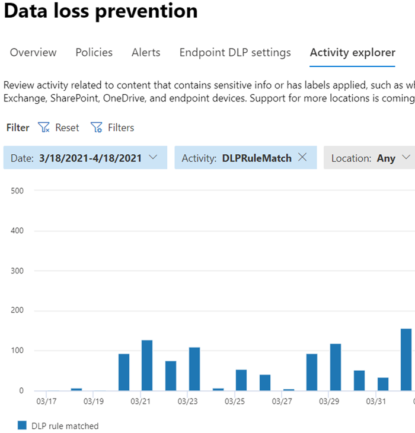

# Informationen zur Verhinderung von DatenverlustLearn about data loss prevention

Organisationen haben vertrauliche Informationen unter ihrer Kontrolle, z. B. Finanzdaten, proprietäre Daten, Kreditkartennummern, Gesundheitsdatensätze oder Sozialversicherungsnummern.Organizations have sensitive information under their control such as financial data, proprietary data, credit card numbers, health records, or social security numbers. Um diese vertraulichen Daten zu schützen und Risiken zu verringern, benötigen sie eine Möglichkeit, um zu verhindern, dass ihre Benutzer sie unangemessen an Personen weitergeben, die sie nicht haben sollten.To help protect this sensitive data and reduce risk, they need a way to prevent their users from inappropriately sharing it with people who shouldn't have it. Diese Vorgehensweise wird als Verhinderung von Datenverlust (Data Loss Prevention, DLP) bezeichnet.This practice is called data loss prevention (DLP).

In Microsoft 365 implementieren Sie die Verhinderung von Datenverlust, indem Sie DLP-Richtlinien definieren und anwenden.In Microsoft 365, you implement data loss prevention by defining and applying DLP policies. Mit einer DLP-Richtlinie können Sie vertrauliche Elemente in folgendem Bereich identifizieren, überwachen und automatisch schützen:With a DLP policy, you can identify, monitor, and automatically protect sensitive items across:

- Microsoft 365 Dienste wie Teams, Exchange, SharePoint und OneDriveMicrosoft 365 services such as Teams, Exchange, SharePoint, and OneDrive
- Office Anwendungen wie Word, Excel und PowerPointOffice applications such as Word, Excel, and PowerPoint
- Windows 10 EndpunkteWindows 10 endpoints
- Nicht von Microsoft stammende Cloud-Appsnon-Microsoft cloud apps
- Lokale Dateifreigaben und lokale SharePoint.on-premises file shares and on-premises SharePoint.

Microsoft 365 erkennt vertrauliche Elemente mithilfe einer umfassenden Inhaltsanalyse, nicht nur durch eine einfache Textüberprüfung.Microsoft 365 detects sensitive items by using deep content analysis, not by just a simple text scan. Der Inhalt wird auf primäre Datenüberstimmungen mit Schlüsselwörtern, durch die Auswertung regulärer Ausdrücke, durch interne Funktionsüberprüfung und durch sekundäre Datenüberstimmungen analysiert, die sich in der Nähe der primären Datenüberstimmung befinden.Content is analyzed for primary data matches to keywords, by the evaluation of regular expressions, by internal function validation, and by secondary data matches that are in proximity to the primary data match. Darüber hinaus verwendet DLP auch Machine Learning-Algorithmen und andere Methoden, um Inhalte zu erkennen, die Ihren DLP-Richtlinien entsprechen.Beyond that DLP also uses machine learning algorithms and other methods to detect content that matches your DLP policies.
  
## DLP ist Teil des größeren Microsoft 365 Compliance-AngebotsDLP is part of the larger Microsoft 365 Compliance offering

Microsoft 365 DLP ist nur eines der Microsoft 365 Compliance-Tools, mit denen Sie Ihre vertraulichen Elemente überall dort schützen können, wo sie sich befinden oder unterwegs sind.Microsoft 365 DLP is just one of the Microsoft 365 Compliance tools that you will use to help protect your sensitive items wherever they live or travel. Sie sollten die anderen Tools in den Microsoft 365 Compliance-Tools kennen, verstehen, wie sie miteinander interagieren und besser zusammenarbeiten.You should understand the other tools in the Microsoft 365 Compliance tools set, how they interrelate, and work better together.  Weitere Informationen zum Informationsschutzprozess finden Sie [unter Microsoft 365 Compliancetools.](protect-information.md)See, [Microsoft 365 compliance tools](protect-information.md) to learn more about the information protection process.

## Schutzaktionen von DLP-RichtlinienProtective actions of DLP policies

Microsoft 365 Mit DLP-Richtlinien überwachen Sie die Aktivitäten, die Benutzer für vertrauliche Elemente im Ruhezustand, vertrauliche Elemente während der Übertragung oder vertrauliche Elemente, die verwendet werden, und ergreifen Schutzmaßnahmen.Microsoft 365 DLP policies are how you monitor the activities that users take on sensitive items at rest, sensitive items in transit, or sensitive items in use and take protective actions. Wenn ein Benutzer beispielsweise versucht, eine unzulässige Aktion auszuführen, z. B. ein vertrauliches Element an einen nicht genehmigten Speicherort zu kopieren oder medizinische Informationen in einer E-Mail oder andere Bedingungen in einer Richtlinie freizugeben, kann DLP Folgendes tun:For example, when a user attempts to take a prohibited action, like copying a sensitive item to an unapproved location or sharing medical information in an email or other conditions laid out in a policy, DLP can:

- Zeigen Sie dem Benutzer einen Popup-Richtlinientipp an, der sie warnt, dass er möglicherweise versucht, ein vertrauliches Element unangemessen freizugeben.show a pop-up policy tip to the user that warns them that they may be trying to share a sensitive item inappropriately
- blockieren Sie die Freigabe, und ermöglichen Sie dem Benutzer über einen Richtlinientipp, die Blockierung außer Kraft zu setzen und die Begründung der Benutzer zu erfassen.block the sharing and, via a policy tip, allow the user to override the block and capture the users' justification
- Blockieren der Freigabe ohne Die Außerkraftsetzungsoptionblock the sharing without the override option
- für ruhenden Daten können vertrauliche Elemente gesperrt und an einen sicheren Quarantänespeicherort verschoben werden.for data at rest, sensitive items can be locked and moved to a secure quarantine location
- für Teams Chat werden die vertraulichen Informationen nicht angezeigt.for Teams chat, the sensitive information will not be displayed

Alle überwachten DLP-Aktivitäten werden standardmäßig im [Microsoft 365 Überwachungsprotokoll](search-the-audit-log-in-security-and-compliance.md) aufgezeichnet und an den [Aktivitäten-Explorer](data-classification-activity-explorer.md)weitergeleitet.All DLP monitored activities are recorded to the [Microsoft 365 Audit log](search-the-audit-log-in-security-and-compliance.md) by default and routed to [Activity explorer](data-classification-activity-explorer.md). Wenn ein Benutzer eine Aktion ausführt, die den Kriterien einer DLP-Richtlinie entspricht, und Sie Warnungen konfiguriert haben, stellt DLP Warnungen im [DLP-Warnungsverwaltungsdashboard](dlp-configure-view-alerts-policies.md)bereit.When a user performs an action that meets the criteria of a DLP policy, and you have alerts configured, DLP provides alerts in the [DLP alert management dashboard](dlp-configure-view-alerts-policies.md).

## DLP-LebenszyklusDLP lifecycle

Eine DLP-Implementierung folgt in der Regel diesen hauptphasen.A DLP implementation typically follows these major phases.

- [Plan für DLPPlan for DLP](#plan-for-dlp)
- [Vorbereiten von DLPPrepare for DLP](#prepare-for-dlp)
- [Bereitstellen ihrer Richtlinien in der ProduktionDeploy your policies in production](#deploy-your-policies-in-production)

<!--ADD DIAGRAM OF THE DLP LIFECYCLE WORK ON WITH MAS-->

### Plan für DLPPlan for DLP

Microsoft 365 DLP-Überwachung und -Schutz sind systemeigen für die Anwendungen, die Benutzer täglich verwenden.Microsoft 365 DLP monitoring and protection are native to the applications that users use every day. Dies trägt dazu bei, die vertraulichen Elemente Ihrer Organisation vor riskanten Aktivitäten zu schützen, auch wenn Ihre Benutzer nicht an das Denken und Vorgehen zur Verhinderung von Datenverlust angepasst sind.This helps to protect your organizations' sensitive items from risky activities even if your users are unaccustomed to data loss prevention thinking and practices. Wenn Ihre Organisation und Ihre Benutzer noch nicht mit den Methoden zur Verhinderung von Datenverlust in Verbindung stehen, kann die Einführung von DLP eine Änderung Ihrer Geschäftsprozesse erfordern, und es gibt einen Kulturwechsel für Ihre Benutzer.If your organization and your users are new to data loss prevention practices, the adoption of DLP may require a change to your business processes and there will be a culture shift for your users. Bei ordnungsgemäßer Planung, Tests und Optimierung schützen Ihre DLP-Richtlinien ihre vertraulichen Elemente, während potenzielle Geschäftsprozessunterbrechungen minimiert werden.But, with proper planning, testing and tuning, your DLP policies will protect your sensitive items while minimizing any potential business process disruptions.

**Technologieplanung für DLP****Technology planning for DLP**

Bedenken Sie, dass DLP als Technologie Ihre ruhenden Daten, die verwendeten Daten und daten in Bewegung über Microsoft 365 Dienste, Windows 10 Geräte, lokale Dateifreigaben und lokale SharePoint überwachen und schützen kann.Keep in mind that DLP as a technology can monitor and protect your data at rest, data in use and data in motion across Microsoft 365 services, Windows 10 devices, on-premises file shares, and on-premises SharePoint. Es gibt Planungsauswirkungen für die verschiedenen Speicherorte, den Typ der Daten, die Sie überwachen und schützen möchten, und die Aktionen, die ausgeführt werden sollen, wenn eine Richtlinienübersprechung auftritt.There are planning implications for the different locations, the type of data you want to monitor and protect, and the actions to be taken when a policy match occurs.  

**Planen von Geschäftsprozessen für DLP****Business processes planning for DLP**

DLP-Richtlinien können unzulässige Aktivitäten blockieren, z. B. unangemessene Freigabe vertraulicher Informationen per E-Mail.DLP policies can block prohibited activities, like inappropriate sharing of sensitive information via email. Bei der Planung Ihrer DLP-Richtlinien müssen Sie die Geschäftsprozesse identifizieren, die Ihre vertraulichen Elemente betreffen.As you plan your DLP policies, you must identify the business processes that touch your sensitive items. Die Besitzer von Geschäftsprozessen können Ihnen dabei helfen, geeignete Benutzerverhalten zu identifizieren, die zulässig sein sollten, und unangemessene Benutzerverhalten, vor denen geschützt werden sollte.The business process owners can help you identify appropriate user behaviors that should be allowed and inappropriate user behaviors that should be protected against. Sie sollten Ihre Richtlinien planen und im Testmodus bereitstellen und deren Auswirkungen zuerst über [den Aktivitäten-Explorer](data-classification-activity-explorer.md) auswerten, bevor Sie sie in restriktiveren Modi anwenden.You should plan your policies and deploy them in test mode, and evaluate their impact via [activity explorer](data-classification-activity-explorer.md) first, before applying them in more restrictive modes.

**Planung der Organisationskultur für DLP****Organizational culture planning for DLP**

Eine erfolgreiche DLP-Implementierung hängt ebenso davon ab, dass Ihre Benutzer geschult und an die Praktiken zur Verhinderung von Datenverlust angepasst werden, wie von gut geplanten und abgestimmten Richtlinien.A successful DLP implementation is as much dependent on getting your users trained and acclimated to data loss prevention practices as it is on well planned and tuned policies. Da Ihre Benutzer stark beteiligt sind, sollten Sie auch die Schulung für sie planen.Since your users are heavily involved, be sure to plan for training for them too. Sie können Richtlinientipps strategieweise verwenden, um die Aufmerksamkeit ihrer Benutzer zu erhöhen, bevor Sie die Richtlinienerzwingung vom Testmodus in restriktiveren Modus ändern.You can strategically use policy tips to raise awareness with your users before changing the policy enforcement from test mode to more restrictive modes.

<!--For more information on planning for DLP, including suggestions for deployment based on your needs and resources, see [Planning for Microsoft 365 data loss prevention](dlp-plan-for-dlp.md).-->

### Vorbereiten von DLPPrepare for DLP

Sie können DLP-Richtlinien auf Ruhedaten, verwendete Daten und Daten in Bewegung an Orten anwenden, z. B.:You can apply DLP policies to data at rest, data in use, and data in motion in locations, such as:

- Exchange Online E-MailExchange Online email
- SharePoint Online-SitesSharePoint Online sites
- OneDrive-KontenOneDrive accounts
- Teams-Chat- und Teams-KanalnachrichtenTeams chat and channel messages
- Microsoft Cloud App SecurityMicrosoft Cloud App Security
- Windows 10-GeräteWindows 10 devices
- Lokale RepositorysOn-premises repositories

Jede hat unterschiedliche Voraussetzungen.Each one has different pre-requisites. Vertrauliche Elemente an einigen Orten, z. B. Exchange online, können unter den DLP-Schirm gestellt werden, indem Sie einfach eine Richtlinie konfigurieren, die für sie gilt.Sensitive items in some locations, like Exchange online, can be brought under the DLP umbrella by just configuring a policy that applies to them. Andere, z. B. lokale Dateirepositorys, erfordern eine Bereitstellung des Azure Information Protection (AIP)-Scanners.Others, such as on-premises file repositories require a deployment of Azure Information Protection (AIP) scanner. Sie müssen Ihre Umgebung vorbereiten, Richtlinien entwerfen und sorgfältig testen, bevor Sie blockierende Aktionen aktivieren.You'll need to prepare your environment, code draft policies, and test them thoroughly before activating any blocking actions.

### Bereitstellen ihrer Richtlinien in der ProduktionDeploy your policies in production

#### Entwerfen Ihrer RichtlinienDesign your policies

Beginnen Sie mit der Definition Ihrer Steuerungsziele und deren Anwendung für die einzelnen Workloads.Start by defining your control objectives, and how they apply across each respective workload. Entwerfen Sie eine Richtlinie, die Ihre Ziele darstellt.Draft a policy that embodies your objectives. Sie können jederzeit mit einer Workload oder über alle Workloads hinweg beginnen – es gibt noch keine Auswirkungen.Feel free to start with one workload at a time, or across all workloads - there's no impact yet.

#### Implementieren von Richtlinien im TestmodusImplement policy in test mode

Bewerten Sie die Auswirkungen der Steuerelemente, indem Sie sie mit einer DLP-Richtlinie im Testmodus implementieren.Evaluate the impact of the controls by implementing them with a DLP policy in test mode. Es ist in Ordnung, die Richtlinie auf alle Workloads im Testmodus anzuwenden, damit Sie die vollständige Breite der Ergebnisse erhalten, aber Sie können bei Bedarf mit einer Workload beginnen.It's ok to apply the policy to all workloads in test mode, so that you can get the full breadth of results, but you can start with one workload if you need to.

#### Überwachen der Ergebnisse und Optimieren der RichtlinieMonitor outcomes and fine-tune the policy

Überwachen Sie im Testmodus die Ergebnisse der Richtlinie, und optimieren Sie sie so, dass sie Ihren Kontrollzielen entspricht und gleichzeitig sicherstellt, dass Sie sich nicht negativ oder versehentlich auf gültige Benutzerworkflows und die Produktivität auswirken.While in test mode, monitor the outcomes of the policy and fine-tune it so that it meets your control objectives while ensuring you aren't adversely or inadvertently impacting valid user workflows and productivity. Hier sind einige Beispiele für Dinge, die Sie optimieren müssen:Here are some examples of things to fine-tune:

- Anpassen der Speicherorte und Personen/Orte, die sich in oder außerhalb des Bereichs befindenadjusting the locations and people/places that are in or out of scope
- Optimieren der Bedingungen und Ausnahmen, die verwendet werden, um festzustellen, ob ein Element und was damit ausgeführt wird, der Richtlinie entsprichttune the conditions and exceptions that are used to determine if an item and what is being done with it matches the policy
- Die Definitionen vertraulicher Informationenthe sensitive information definition/s
- die Aktionenthe actions
- Das Maß an Einschränkungenthe level of restrictions
- Hinzufügen neuer Steuerelementeadd new controls
- Neue Personen hinzufügenadd new people
- Hinzufügen neuer eingeschränkter Appsadd new restricted apps
- Hinzufügen neuer eingeschränkter Websitesadd new restricted sites

#### Aktivieren des Steuerelements und Optimieren Ihrer RichtlinienEnable the control and tune your policies

Sobald die Richtlinie alle Ihre Ziele erfüllt, aktivieren Sie sie.Once the policy meets all your objectives, turn it on. Überwachen Sie weiterhin die Ergebnisse der Richtlinienanwendung, und optimieren Sie sie nach Bedarf.Continue to monitor the outcomes of the policy application and tune as needed. Im Allgemeinen werden Richtlinien etwa eine Stunde nach dem Aktivieren wirksam.In general, policies take effect about an hour after being turned on. 

<!--See, LINK TO topic for SLAs for location specific  details-->

## Übersicht über die DLP-RichtlinienkonfigurationDLP policy configuration overview

Sie haben Flexibilität bei der Erstellung und Konfiguration Ihrer DLP-Richtlinien.You have flexibility in how you create and configure your DLP policies. Sie können mit einer vordefinierten Vorlage beginnen und mit nur wenigen Klicks eine Richtlinie erstellen, oder Sie können Ihre eigene von Grund auf entwerfen.You can start from a predefined template and create a policy in just a few clicks or you can design your own from the ground up. Unabhängig davon, welcheN Sie auswählen, benötigen alle DLP-Richtlinien die gleichen Informationen von Ihnen.No matter which you choose, all DLP policies require the same information from you.

1. **Wählen Sie aus, was Sie überwachen möchten** – Microsoft 365 enthält viele vordefinierte Richtlinienvorlagen, die Ihnen bei den ersten Schritten helfen, oder Sie können eine benutzerdefinierte Richtlinie erstellen.**Choose what you want to monitor** - Microsoft 365 comes with many predefined policy templates to help you get started or you can create a custom policy.
    - Eine vordefinierte Richtlinienvorlage: Finanzdaten, Medizinische daten und Gesundheitsdaten, Datenschutzdaten für verschiedene Länder und Regionen.A predefined policy template: Financial data, Medical and health data, Privacy data all for various countries and regions.
    - Eine benutzerdefinierte Richtlinie, die die verfügbaren Typen vertraulicher Informationen, Aufbewahrungsbezeichnungen und Vertraulichkeitsbezeichnungen verwendet.A custom policy that uses the available sensitive information types, retention labels, and sensitivity labels.
2. **Wählen Sie aus, wo Sie überwachen möchten–** Wählen Sie einen oder mehrere Speicherorte aus, die DLP auf vertrauliche Informationen überwachen soll.**Choose where you want to monitor** - You pick one or more locations that you want DLP to monitor for sensitive information. Sie können Folgendes überwachen:You can monitor:
    
Speicherortlocation | einschließen/ausschließen nachinclude/exclude by|
|---------|---------|
|Exchange-E-MailExchange email| Verteilergruppendistribution groups|
|Microsoft Office SharePoint Online-WebsitesSharePoint sites |Websitessites |
|OneDrive-KontenOneDrive accounts |Konten oder Verteilergruppenaccounts or distribution groups |
|Teams-Chat- und Teams-KanalnachrichtenTeams chat and channel messages |Kontenaccounts |
|Windows 10-GeräteWindows 10 devices |Benutzer oder Gruppeuser or group |
|Microsoft Cloud App SecurityMicrosoft Cloud App Security |Instanzinstance |
|Lokale RepositorysOn-premises repositories| Repositorydateipfadrepository file path|

3. **Wählen Sie die Bedingungen aus, die erfüllt werden müssen, damit eine Richtlinie auf ein Element angewendet werden kann.** Sie können vorkonfigurierte Bedingungen akzeptieren oder benutzerdefinierte Bedingungen definieren.**Choose the conditions that must be matched for a policy to be applied to an item** - you can accept pre-configured conditions or define custom conditions. Einige Beispiele:Some examples are:

- enthält eine bestimmte Art vertraulicher Informationen, die in einem bestimmten Kontext verwendet werden.item contains a specified kind of sensitive information that is being used in a certain context. Beispielsweise werden 95 Sozialversicherungsnummern per E-Mail an Empfänger außerhalb Ihrer Organisation gesendet.For example, 95 social security numbers being emailed to recipient outside your org.
- Element hat eine angegebene Vertraulichkeitsbezeichnungitem has a specified sensitivity label
- Element mit vertraulichen Informationen wird entweder intern oder extern freigegebenitem with sensitive information is shared either internally or externally

4. **Wählen Sie die Aktion aus, die ausgeführt werden soll, wenn die Richtlinienbedingungen erfüllt sind** . Die Aktionen hängen vom Ort ab, an dem die Aktivität stattfindet.**Choose the action to take when the policy conditions are met** - The actions depend on the location where the activity is happening.  Einige Beispiele:Some examples are:

- SharePoint/Exchange/OneDrive: Personen außerhalb Ihres Organisationsformulars den Zugriff auf den Inhalt blockieren.SharePoint/Exchange/OneDrive: Block people who are outside your organization form accessing the content. Zeigen Sie dem Benutzer einen Tipp und senden Sie eine E-Mail-Benachrichtigung, dass er eine Aktion ausführt, die durch die DLP-Richtlinie verboten ist.Show the user a tip and send them an email notification that they are taking an action that is prohibited by the DLP policy.
- Teams Chat und Kanal: Blockieren der Freigabe vertraulicher Informationen im Chat oder KanalTeams Chat and Channel: Block sensitive information from being shared in the chat or channel
- Windows 10 Geräte: Überwachen oder Einschränken des Kopierens eines vertraulichen Elements auf ein usb-Gerät, das entfernt werden kannWindows 10 Devices: Audit or restrict copying a sensitive item to a removeable USB device 
- Office Apps: Zeigen Sie ein Popup an, in dem der Benutzer benachrichtigt wird, dass er ein riskantes Verhalten eingibt und die Außerkraftsetzung blockiert oder blockiert, aber die Außerkraftsetzung zulässt.Office Apps: Show a popup notifying the user that they are engaging in a risky behavior and block or block but allow override.
- Lokale Dateifreigaben: Verschieben der Datei von ihrem Speicherort in einen QuarantäneordnerOn-premises file shares: move the file from where it is stored to a quarantine folder

> [!NOTE]
> Die Bedingungen und die auszuführenden Aktionen werden in einem Objekt definiert, das als Regel bezeichnet wird.The conditions and the actions to take are defined in an object called a Rule.

<!--## Create a DLP policy

All DLP policies are created and maintained in the Microsoft 365 Compliance center. See, INSERT LINK TO ARTICLE THAT WILL START WALKING THEM THROUGH THE POLICY CREATION PROCEDURES for more information.-->

Nachdem Sie eine DLP-Richtlinie im Compliance Center erstellt haben, wird sie in einem zentralen Richtlinienspeicher gespeichert und dann mit den verschiedenen Inhaltsquellen synchronisiert, einschließlich:After you create a DLP policy in the Compliance Center, it's stored in a central policy store, and then synced to the various content sources, including:
  
- Exchange Online und von dort aus mit Outlook im Web und Outlook.Exchange Online, and from there to Outlook on the web and Outlook.
- OneDrive for Business-Websites.OneDrive for Business sites.
- SharePoint Online-Websites.SharePoint Online sites.
- Office-Desktopprogrammen (Excel, PowerPoint und Word).Office desktop programs (Excel, PowerPoint, and Word).
- Microsoft Teams-Kanälen und Chatnachrichten.Microsoft Teams channels and chat messages.
    
Nachdem die Richtlinie mit den richtigen Speicherorten synchronisiert wurde, werden Inhalte ausgewertet und Aktionen erzwungen.After the policy's synced to the right locations, it starts to evaluate content and enforce actions.

## Anzeigen von RichtlinienanwendungsergebnissenViewing policy application results

DLP meldet eine große Menge an Informationen in Microsoft 365 aus Überwachung, Richtlinienüberstimmungen und -aktionen sowie Benutzeraktivitäten.DLP reports a vast amount of information into Microsoft 365 from monitoring, policy matches and actions, and user activities. Sie müssen diese Informationen nutzen und darauf reagieren, um Ihre Richtlinien zu optimieren und Aktionen für vertrauliche Elemente zu selektieren.You'll need to consume and act on that information to tune your policies and triage actions taken on sensitive items. Die Telemetriedaten werden zuerst in das [Microsoft 365 Compliance Center Audit Logs](search-the-audit-log-in-security-and-compliance.md#search-the-audit-log-in-the-compliance-center) aufgenommen, verarbeitet und gelangen zu unterschiedlichen Berichterstellungstools.The telemetry goes into the [Microsoft 365 Compliance center Audit Logs](search-the-audit-log-in-security-and-compliance.md#search-the-audit-log-in-the-compliance-center) first, is processed, and makes its way to different reporting tools. Jedes Berichterstellungstool hat einen anderen Zweck.Each reporting tool has a different purpose.  

### Dashboard für DLP-WarnungenDLP Alerts Dashboard

Wenn DLP eine Aktion für ein vertrauliches Element ausführt, können Sie über eine konfigurierbare Warnung über diese Aktion benachrichtigt werden.When DLP takes an action on a sensitive item, you can be notified of that action via a configurable alert. Anstatt diese Warnungen in einem Postfach zu durchsuchen, stellt das Compliance Center sie im [Verwaltungsdashboard für DLP-Warnungen](dlp-configure-view-alerts-policies.md)zur Verfügung.Rather than having these alerts pile up in a mailbox for you to sift through, the Compliance center makes them available in the [DLP Alerts Management Dashboard](dlp-configure-view-alerts-policies.md). Verwenden Sie das Dashboard für DLP-Warnungen, um Warnungen zu konfigurieren, zu überprüfen, zu selektieren und die Auflösung von DLP-Warnungen nachzuverfolgen.Use the DLP Alerts dashboard to configure alerts, review them, triage them and track resolution of DLP Alerts. Hier ist ein Beispiel für Warnungen, die von Richtlinienüberstimmungen und Aktivitäten von Windows 10-Geräten generiert werden.Here's an example of alerts generated by policy matches and activities from Windows 10 devices.

> [!div class="mx-imgBorder"]
> 

Sie können ebenfalls Details des zugehörigen Ereignisses mit umfangreichen Metadaten im gleichen Dashboard anzeigen.You can also view details of the associated event with rich metadata in the same dashboard

> [!div class="mx-imgBorder"]
> 

### BerichteReports

Die [DLP-Berichte](view-the-dlp-reports.md#view-the-reports-for-data-loss-prevention) zeigen allgemeine Trends im Laufe der Zeit und geben spezifische Einblicke in:The [DLP reports](view-the-dlp-reports.md#view-the-reports-for-data-loss-prevention) show broad trends over time and give specific insights into:

- **DLP-Richtlinienüberstimmungen** im Laufe der Zeit und Filtern nach Datumsbereich, Speicherort, Richtlinie oder Aktion**DLP Policy Matches** over time and filter by date range, location, policy, or action
- **DLP-Vorfallübereinstimmungen** zeigen auch Übereinstimmungen im Laufe der Zeit an, aber Pivots für die Elemente und nicht für die Richtlinienregeln.**DLP incident matches** also shows matches over time, but pivots on the items rather than the policy rules.
- **Falsch positive DLP-Ergebnisse und Außerkraftsetzungen** zeigen die Anzahl falsch positiver Ergebnisse und, falls konfiguriert, Benutzerüberschreibungen zusammen mit der Benutzerausrichtung an.**DLP false positives and overrides** shows the count of false positives and, if configured, user-overrides along with the user justification.

### DLP-Aktivitäts-ExplorerDLP Activity Explorer

Auf der Registerkarte "Aktivitäten-Explorer" auf der DLP-Seite ist der *Aktivitätsfilter* auf *DLPRuleMatch* voreingestellt.The Activity explorer tab on the DLP page has the *Activity* filter preset to *DLPRuleMatch*. Verwenden Sie dieses Tool, um Aktivitäten im Zusammenhang mit Inhalten zu überprüfen, die vertrauliche Informationen enthalten oder Bezeichnungen angewendet haben, z. B. welche Bezeichnungen geändert wurden, Dateien geändert wurden und mit einer Regel übereinstimmten.Use this tool to review activity related to content that contains sensitive info or has labels applied, such as what labels were changed, files were modified, and matched a rule.

Weitere Informationen finden Sie unter [Erste Schritte mit dem Aktivitäten-Explorer](data-classification-activity-explorer.md)For more information, see [Get started with activity explorer](data-classification-activity-explorer.md)

Weitere Informationen zu Microsoft 365 DLP finden Sie unter:To learn more about Microsoft 365 DLP, see:

- [Informationen zu Microsoft 365 Endpunkt-DLP (Data Loss Prevention, Verhinderung von Datenverlust)Learn about Microsoft 365 Endpoint data loss prevention](endpoint-dlp-learn-about.md)
- [Weitere Informationen zur Standardrichtlinie zur Verhinderung von Datenverlust in Microsoft Teams (Vorschau)Learn about the default data loss prevention policy in Microsoft Teams (preview)](dlp-teams-default-policy.md)
- [Erfahren Sie mehr über den lokalen Microsoft 365-Scanner zur Verhinderung von Datenverlust (Vorschau)Learn about the Microsoft 365 data loss prevention on-premises scanner (preview)](dlp-on-premises-scanner-learn.md)
- [Erfahren Sie mehr über die Microsoft Compliance-Erweiterung (Vorschau)Learn about the Microsoft Compliance Extension (preview)](dlp-chrome-learn-about.md)
- [Informationen zum Dashboard zur Verhinderung von DatenverlustLearn about the data loss prevention Alerts dashboard](dlp-alerts-dashboard-learn.md)

Informationen zur Verwendung der Verhinderung von Datenverlust zur Einhaltung von Datenschutzbestimmungen finden Sie unter ["Bereitstellen des Informationsschutzes für Datenschutzbestimmungen mit Microsoft 365](../solutions/information-protection-deploy.md) (aka.ms/m365dataprivacy).To learn how to use data loss prevention to comply with data privacy regulations, see [Deploy information protection for data privacy regulations with Microsoft 365](../solutions/information-protection-deploy.md)  (aka.ms/m365dataprivacy).