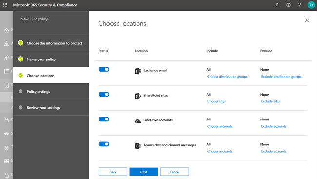

# Verhinderung von Datenverlust (DLP) und Microsoft Teams.Data loss prevention and Microsoft Teams

> [!NOTE]
> Funktionen zur Verhinderung von Datenverlust wurden kürzlich zu Microsoft Teams-Chat- und Kanalnachrichten für Benutzer hinzugefügt, die für Office 365 E5/A5, Microsoft 365 E5/A5, Microsoft 365 Information Protection and Governance oder Office 365 Advanced Compliance lizenziert sind.Data loss prevention capabilities were recently added to Microsoft Teams chat and channel messages for users licensed for Office 365 E5/A5, Microsoft 365 E5/A5, Microsoft 365 Information Protection and Governance or Office 365 Advanced Compliance. Office 365 und Microsoft 365 E3 enthalten DLP-Schutz für SharePoint Online, OneDrive und Exchange Online.Office 365 and Microsoft 365 E3 include DLP protection for SharePoint Online, OneDrive, and Exchange Online. Dies umfasst auch Dateien, die über Teams freigegeben werden, da Teams SharePoint Online und OneDrive zum Freigeben von Dateien verwendet.This also includes files that are shared through Teams because Teams uses SharePoint Online and OneDrive to share files.
Für die Unterstützung des DLP-Schutzes im Teams-Chat ist E5 erforderlich.Support for DLP protection in Teams Chat requires E5.
Weitere Informationen zu den Lizenzierungsanforderungen finden Sie unter [Microsoft 365-Dienste auf Mandantenebene – Leitfaden zur Lizenzierung](/office365/servicedescriptions/microsoft-365-service-descriptions/microsoft-365-tenantlevel-services-licensing-guidance).To learn more about licensing requirements, see [Microsoft 365 Tenant-Level Services Licensing Guidance](/office365/servicedescriptions/microsoft-365-service-descriptions/microsoft-365-tenantlevel-services-licensing-guidance).

## Übersicht über DLP für Microsoft TeamsOverview of DLP for Microsoft Teams

Vor kurzem wurden die Funktionen zur Verhinderung von Datenverlust (Data [Loss Prevention,](data-loss-prevention-policies.md) DLP) um Chat- und Kanalnachrichten von Microsoft Teams erweitert, einschließlich **Nachrichten im privaten Kanal.**Recently, [data loss prevention](data-loss-prevention-policies.md) (DLP) capabilities were extended to include Microsoft Teams chat and channel messages, **including private channel messages**. 

> [!IMPORTANT]
> DLP gilt derzeit nur für die tatsächlichen Nachrichten im Chat- oder Kanalthread.DLP currently applies only to the actual messages in the chat or channel thread. Aktivitätsbenachrichtigungen – die eine kurze Nachrichtenvorschau enthalten und basierend  auf den Benachrichtigungseinstellungen eines Benutzers angezeigt werden – sind derzeit nicht in Teams DLP enthalten.Activity notifications -- which include a short message preview and appear based on a user's notification settings -- are **not** included in Teams DLP at this time. Alle vertraulichen Informationen im Teil der Nachricht, der in der Vorschau angezeigt wird, bleiben in der Benachrichtigung sichtbar, auch nachdem die DLP-Richtlinie angewendet und die vertrauliche Inforamtion der Nachricht selbst entfernt wurde.Any sensitive information present in the part of the message that appears in the preview will remain visible in the notification even after the DLP policy has been applied and removed sensitive inforamtion the message itself.

Wenn Ihre Organisation über DLP verfügt, können Sie jetzt Richtlinien definieren, die verhindern, dass Personen vertrauliche Informationen in einem Microsoft Teams-Kanal oder einer Chatsitzung freigeben.If your organization has DLP, you can now define policies that prevent people from sharing sensitive information in a Microsoft Teams channel or chat session. Hier sind einige Beispiele für die Funktionsweise dieses Schutzes:Here are some examples of how this protection works:

- **Beispiel 1: Schützen vertraulicher Informationen in Nachrichten**.**Example 1: Protecting sensitive information in messages**. Angenommen, jemand versucht, vertrauliche Informationen in einem Teams-Chat oder -Kanal mit Gästen (externen Benutzern) zu teilen.Suppose that someone attempts to share sensitive information in a Teams chat or channel with guests (external users). Wenn Sie eine DLP-Richtlinie definiert haben, um dies zu verhindern, werden Nachrichten mit vertraulichen Informationen, die an externe Benutzer gesendet werden, gelöscht.If you have a DLP policy defined to prevent this, messages with sensitive information that are sent to external users are deleted. Dies geschieht automatisch und innerhalb von Sekunden, je nach Konfiguration Ihrer DLP-Richtlinie.This happens automatically, and within seconds, according to how your DLP policy is configured.

    > [!NOTE]
    > DLP für Microsoft Teams blockiert vertrauliche Inhalte, wenn sie für Microsoft Teams-Benutzer freigegeben werden, die über:DLP for Microsoft Teams blocks sensitive content when shared with Microsoft Teams users who have: - [Gastzugriff](/MicrosoftTeams/guest-access) in Teams und Kanälen; oder- [guest access](/MicrosoftTeams/guest-access) in teams and channels; or - [externer Zugriff](/MicrosoftTeams/manage-external-access) in Besprechungen und Chatsitzungen.- [external access](/MicrosoftTeams/manage-external-access) in meetings and chat sessions. 
DLP für externe Chatsitzungen funktioniert nur, wenn sich sowohl der Absender als auch der Empfänger im Modus "Nur Teams" befinden und den systemeigenen [Microsoft Teams-Verbund verwenden.](/microsoftteams/manage-external-access)DLP for external chat sessions will only work if both the sender and the receiver are in Teams Only mode and using [Microsoft Teams native federation](/microsoftteams/manage-external-access). DLP für Teams blockiert keine Nachrichten [in](/microsoftteams/teams-and-skypeforbusiness-coexistence-and-interoperability#interoperability-of-teams-and-skype-for-business) Interop mit Skype for Business oder nicht nativen Verbundchatsitzungen.DLP for Teams does not block messages in [interop](/microsoftteams/teams-and-skypeforbusiness-coexistence-and-interoperability#interoperability-of-teams-and-skype-for-business) with Skype for Business or non-native federated chat sessions.

- **Beispiel 2: Schützen vertraulicher Informationen in Dokumenten**.**Example 2: Protecting sensitive information in documents**. Angenommen, jemand versucht, ein Dokument für Gäste in einem Microsoft Teams-Kanal oder -Chat zu teilen, und das Dokument enthält vertrauliche Informationen.Suppose that someone attempts to share a document with guests in a Microsoft Teams channel or chat, and the document contains sensitive information. Wenn Sie eine DLP-Richtlinie definiert haben, um dies zu verhindern, wird das Dokument für diese Benutzer nicht geöffnet.If you have a DLP policy defined to prevent this, the document won't open for those users. Beachten Sie, dass ihre #A0 in diesem Fall SharePoint und OneDrive enthalten muss, damit der Schutz möglich ist.Note that in this case, your DLP policy must include SharePoint and OneDrive in order for protection to be in place. (Dies ist ein Beispiel für DLP für SharePoint, das in Microsoft Teams gezeigt wird und daher erfordert, dass Benutzer für Office 365 DLP (in Office 365 E3 enthalten) lizenziert sind, aber keine Lizenz für Office 365 Advanced Compliance benötigen.)(This is an example of DLP for SharePoint that shows up in Microsoft Teams, and therefore requires that users are licensed for Office 365 DLP (included in Office 365 E3), but does not require users to be licensed for Office 365 Advanced Compliance.)

## Richtlinientipps helfen Bei der Schulung von BenutzernPolicy tips help educate users

Ähnlich wie DLP in [Exchange, Outlook, Outlook](data-loss-prevention-policies.md#policy-evaluation-in-exchange-online-outlook-and-outlook-on-the-web)im Web, [SharePoint Online, OneDrive for #A0](data-loss-prevention-policies.md#policy-evaluation-in-onedrive-for-business-and-sharepoint-online-sites)und Office-Desktopclients funktioniert, werden Richtlinientipps angezeigt, wenn eine Aktion mit einer #A1 in Konflikt steht. Similar to how DLP works in [Exchange, Outlook, Outlook on the web](data-loss-prevention-policies.md#policy-evaluation-in-exchange-online-outlook-and-outlook-on-the-web), [SharePoint Online, OneDrive for Business sites](data-loss-prevention-policies.md#policy-evaluation-in-onedrive-for-business-and-sharepoint-online-sites), and [Office desktop clients](data-loss-prevention-policies.md#policy-evaluation-in-the-office-desktop-programs), policy tips appear when an action conflicts with a DLP policy. Hier ist ein Beispiel für einen Richtlinientipp:Here's an example of a policy tip:

In diesem Fall hat der Absender versucht, eine Sozialversicherungsnummer in einem Microsoft Teams-Kanal zu teilen.In this case, the sender attempted to share a social security number in a Microsoft Teams channel. Der **Link Was kann ich tun?** öffnet ein Dialogfeld, das Optionen zum Beheben des Problems für den Absender bietet.The **What can I do?** link opens a dialog box that provides options for the sender to resolve the issue. Beachten Sie, dass der Absender in diesem Fall die Richtlinie außer Kraft setzen oder einen Administrator benachrichtigen kann, um die Richtlinie zu überprüfen und zu beheben.Notice that in this case, the sender can opt to override the policy, or notify an admin to review and resolve it.

In Ihrer Organisation können Sie festlegen, dass Benutzer eine DLP-Richtlinie außer Kraft setzen können.In your organization, you can choose to allow users to override a DLP policy. Und wenn Sie Ihre DLP-Richtlinien konfigurieren, können Sie die Standardrichtlinientipps verwenden oder [Richtlinientipps](#to-customize-policy-tips) für Ihre Organisation anpassen.And, when you configure your DLP policies, you can use the default policy tips, or [customize policy tips](#to-customize-policy-tips) for your organization.

Kehren Sie zu unserem Beispiel zurück, in dem ein Absender eine Sozialversicherungsnummer in einem Teams-Kanal freigegeben hat, was der Empfänger gesehen hat:Returning to our example, where a sender shared a social security number in a Teams channel, here's what the recipient saw:

> [!div class="mx-imgBorder"]
> 

Der **Link What's this?** öffnet einen [Artikel](data-loss-prevention-policies.md) über DLP-Richtlinien, in dem erläutert wird, warum die Nachricht blockiert wurde.The **What's this?** link opens an [article](data-loss-prevention-policies.md) about DLP policies, which helps explain why the message was blocked.

### Anpassen von RichtlinientippsTo customize policy tips

Um diese Aufgabe ausführen zu können, muss Ihnen eine Rolle zugewiesen sein, die über Berechtigungen zum Bearbeiten von DLP-Richtlinien verfügt.To perform this task, you must be assigned a role that has permissions to edit DLP policies. Weitere Informationen hierzu finden Sie unter [Berechtigungen](data-loss-prevention-policies.md#permissions).To learn more, see [Permissions](data-loss-prevention-policies.md#permissions).

1. Wechseln Sie zum Security & Compliance Center ( [https://protection.office.com](https://protection.office.com) ) und melden Sie sich an.Go to the Security & Compliance Center ([https://protection.office.com](https://protection.office.com)) and sign in.

2. Wählen **Sie Richtlinie zur Verhinderung von Datenverlust**  >  **aus.**Choose **Data loss prevention** > **Policy**.

3. Wählen Sie eine Richtlinie aus, und wählen Sie **neben Richtlinieneinstellungen** bearbeiten **aus.**Select a policy, and next to **Policy settings**, choose **Edit**.

4. Erstellen Sie entweder eine neue Regel, oder bearbeiten Sie eine vorhandene Regel für die Richtlinie.Either create a new rule, or edit an existing rule for the policy.

    > [!div class="mx-imgBorder"]
    > 

5. Wählen Sie **auf der Registerkarte** Benutzerbenachrichtigungen die Option E-Mail-Text **anpassen** und/oder **Richtlinientipptextoptionen** anpassen aus.On the **User notifications** tab, select **Customize the email text** and/or **Customize the policy tip text** options.

    > [!div class="mx-imgBorder"]
    >    

6. Geben Sie den Text an, den Sie für E-Mail-Benachrichtigungen und/oder Richtlinientipps verwenden möchten, und wählen Sie dann **Speichern aus.**Specify the text you want to use for email notifications and/or policy tips, and then choose **Save**.

7. Wählen Sie **auf der** Registerkarte Richtlinieneinstellungen die Option **Speichern aus.**On the **Policy settings** tab, choose **Save**.

Lassen Sie ungefähr eine Stunde, bis Ihre Änderungen ihren Weg durch Ihr Rechenzentrum und die Synchronisierung mit Benutzerkonten finden.Allow approximately one hour for your changes to work their way through your data center and sync to user accounts.
 <!-- why are these syncing to user accounts? -->

## Hinzufügen von Microsoft Teams als Speicherort zu bestehenden DLP-RichtlinienAdd Microsoft Teams as a location to existing DLP policies

Um diese Aufgabe ausführen zu können, muss Ihnen eine Rolle zugewiesen sein, die über Berechtigungen zum Bearbeiten von DLP-Richtlinien verfügt.To perform this task, you must be assigned a role that has permissions to edit DLP policies. Weitere Informationen hierzu finden Sie unter [Berechtigungen](data-loss-prevention-policies.md#permissions).To learn more, see [Permissions](data-loss-prevention-policies.md#permissions).

1. Wechseln Sie zum Security & Compliance Center ( [https://protection.office.com](https://protection.office.com) ) und melden Sie sich an.Go to the Security & Compliance Center ([https://protection.office.com](https://protection.office.com)) and sign in.

2. Wählen **Sie Richtlinie zur Verhinderung von Datenverlust**  >  **aus.**Choose **Data loss prevention** > **Policy**.

3. Wählen Sie eine Richtlinie aus, und sehen Sie sich die Werte unter **Locations an.**Select a policy, and look at the values under **Locations**. Wenn **Teams-Chat- und Kanalnachrichten angezeigt werden,** sind sie alle festgelegt.If you see **Teams chat and channel messages**, you're all set. Klicken Sie auf Bearbeiten, falls **nicht.**If you don't, click **Edit**.

    > [!div class="mx-imgBorder"]
    > 

4. Aktivieren Sie **in der** Spalte Status die Richtlinie für **Teams-Chat- und Kanalnachrichten.**In the **Status** column, turn the policy on for **Teams chat and channel messages**.

    > [!div class="mx-imgBorder"]
    > 

5. Behalten Sie **auf der** Registerkarte Speicherorte auswählen die Standardeinstellung aller Konten bei, oder wählen Sie Let me choose **specific locations** aus.On the **Choose locations** tab, keep the default setting of all accounts, or select **Let me choose specific locations**. Sie können Folgendes angeben:You can specify:

    1. Bis zu 1.000 einzelne Konten zum Ein- oder Ausschließenup to 1000 individual accounts to include or exclude
    1. Verteilerlisten und Sicherheitsgruppen, die ein- oder ausgeschlossen werden.distribution lists and security groups to include or exclude. **Dies ist ein öffentliches Vorschaufeature.****This is a public preview feature.**
    <!-- 1. the shared mailbox of a shared channel. **This is a public preview feature.**--> 
    
6. Wählen Sie dann **Weiter** aus.Then choose **Next**.

7. Klicken Sie auf **Speichern**.Click **Save**.

Lassen Sie ungefähr eine Stunde, bis Ihre Änderungen ihren Weg durch Ihr Rechenzentrum und die Synchronisierung mit Benutzerkonten finden.Allow approximately one hour for your changes to work their way through your data center and sync to user accounts.
<!-- again, why user accounts? -->

## Definieren einer neuen DLP-Richtlinie für Microsoft TeamsDefine a new DLP policy for Microsoft Teams

Um diese Aufgabe ausführen zu können, muss Ihnen eine Rolle zugewiesen sein, die über Berechtigungen zum Bearbeiten von DLP-Richtlinien verfügt.To perform this task, you must be assigned a role that has permissions to edit DLP policies. Weitere Informationen hierzu finden Sie unter [Berechtigungen](data-loss-prevention-policies.md#permissions).To learn more, see [Permissions](data-loss-prevention-policies.md#permissions).

1. Wechseln Sie zum Security & Compliance Center ( [https://protection.office.com](https://protection.office.com) ) und melden Sie sich an.Go to the Security & Compliance Center ([https://protection.office.com](https://protection.office.com)) and sign in.

2. Wählen **Sie Richtlinie zur Verhinderung von**  >  **Datenverlust**  >  **+ Erstellen einer Richtlinie aus.**Choose **Data loss prevention** > **Policy** > **+ Create a policy**.

3. Wählen Sie [eine Vorlage](data-loss-prevention-policies.md#dlp-policy-templates)aus, und wählen Sie dann **Weiter aus.**Choose a [template](data-loss-prevention-policies.md#dlp-policy-templates), and then choose **Next**.

    In unserem Beispiel haben wir die Vorlage für personenbezogene Daten in den USA ausgewählt.In our example, we chose the U.S. Personally Identifiable Information Data template.

    > [!div class="mx-imgBorder"]
    >  

4. Geben Sie **auf der Registerkarte** Name Ihrer Richtlinie einen Namen und eine Beschreibung für die Richtlinie an, und wählen Sie dann Weiter **aus.**On the **Name your policy** tab, specify a name and description for the policy, and then choose **Next**.

5. Behalten Sie **auf der** Registerkarte Speicherorte auswählen die Standardeinstellung aller Konten bei, oder wählen Sie Let me choose **specific locations** aus.On the **Choose locations** tab, keep the default setting of all accounts, or select **Let me choose specific locations**. Sie können Folgendes angeben:You can specify:

    1. Bis zu 1.000 einzelne Konten zum Ein- oder Ausschließenup to 1000 individual accounts to include or exclude
    1. Verteilerlisten und Sicherheitsgruppen, die ein- oder ausgeschlossen werden.distribution lists and security groups to include or exclude. **Dies ist ein öffentliches Vorschaufeature.****This is a public preview feature.**
    <!-- 1. the shared mailbox of a shared channel. **This is a public preview feature.**-->  

    

    > [!NOTE]
    > Wenn Sie sicherstellen möchten, dass Dokumente, die vertrauliche Informationen enthalten, nicht unangemessen in Teams freigegeben werden, stellen Sie sicher, dass **#A0** und **#A1** sowie Chat- und Kanalnachrichten von Teams aktiviert **sind.**If you want to make sure documents that contain sensitive information are not shared inappropriately in Teams, make sure **SharePoint sites** and **OneDrive accounts** are turned on, along with **Teams chat and channel messages**.

6. Behalten Sie **auf** der Registerkarte Richtlinieneinstellungen unter Anpassen des Zu schützende Inhaltstyps die Standardeinstellungen für einfache Einstellungen bei, oder wählen Sie **Erweiterte** Einstellungen verwenden aus, und wählen Sie dann **Weiter aus.**On the **Policy settings** tab, under **Customize the type of content you want to protect**, keep the default simple settings, or choose **Use advanced settings**, and then choose **Next**. Wenn Sie erweiterte Einstellungen auswählen, können Sie Regeln für Ihre Richtlinie erstellen oder bearbeiten.If you choose advanced settings, you can create or edit rules for your policy. (Informationen dazu finden Sie unter [Einfache Einstellungen im Vergleich zu erweiterten Einstellungen](data-loss-prevention-policies.md#simple-settings-vs-advanced-settings).)(To get help with this, see [Simple settings vs. advanced settings](data-loss-prevention-policies.md#simple-settings-vs-advanced-settings).)

7.  Überprüfen Sie **auf der** Registerkarte Richtlinieneinstellungen unter Was möchten Sie tun, wenn vertrauliche Informationen erkannt **werden?** die Einstellungen.On the **Policy settings** tab, under **What do you want to do if we detect sensitive info?**, review the settings. (Hier können Sie standardrichtlinientipps und E-Mail-Benachrichtigungen behalten oder anpassen.)(Here's where you can choose to keep default [policy tips and email notifications](use-notifications-and-policy-tips.md), or customize them.)

    > [!div class="mx-imgBorder"]
    > 

    Wenn Sie die Einstellungen überprüft oder bearbeitet haben, wählen Sie **Weiter aus.**When you're finished reviewing or editing settings, choose **Next**.

8. Wählen  Sie auf der Registerkarte Richtlinieneinstellungen unter Möchten Sie die Richtlinie aktivieren oder dinge zuerst **testen?** [aus,](data-loss-prevention-policies.md#roll-out-dlp-policies-gradually-with-test-mode)ob die Richtlinie aktiviert werden soll, testen Sie sie zuerst, oder lassen Sie sie vorerst deaktiviert, und wählen Sie dann **Weiter** aus.On the **Policy settings** tab, under **Do you want to turn on the policy or test things out first?**, choose whether to turn the policy on, [test it first](data-loss-prevention-policies.md#roll-out-dlp-policies-gradually-with-test-mode), or keep it turned off for now, and then choose **Next**.

    > [!div class="mx-imgBorder"]
    > 

9. Überprüfen Sie **auf der Registerkarte** Einstellungen überprüfen die Einstellungen für Ihre neue Richtlinie.On the **Review your settings** tab, review the settings for your new policy. Wählen **Sie Bearbeiten** aus, um Änderungen vorzunehmen.Choose **Edit** to make changes. Wenn Sie fertig sind, wählen Sie **Erstellen aus.**When you're finished, choose **Create**.

Lassen Sie ungefähr eine Stunde zu, bis Ihre neue Richtlinie ihren Weg durch Ihr Rechenzentrum durcharbeiten und mit Benutzerkonten synchronisieren kann.Allow approximately one hour for your new policy to work its way through your data center and sync to user accounts.

## Verhindern des externen Zugriffs auf vertrauliche DokumentePrevent external access to sensitive documents

Wählen Sie Folgendes aus, um sicherzustellen, dass auf SharePoint- oder Teams-Dokumente, die vertrauliche Informationen enthalten, standardmäßig nicht von externen Gästen zugegriffen werden kann:To ensure that SharePoint documents that contain sensitive information cannot be accessed by external guests either from SharePoint or Teams by default, select the following:

- Sie können sicherstellen, dass Dokumente geschützt sind, bis DLP sie überprüft und als sicher für die Freigabe markiert, indem Sie neue Dateien standardmäßig als [vertraulich kennzeichnen.](/sharepoint/sensitive-by-default)You can ensure that documents are protected until DLP scans and marks them as safe to share by [marking new files as sensitive by default](/sharepoint/sensitive-by-default).

- Empfohlene DLP-RichtlinienstrukturRecommended DLP policy structure

    - **Bedingungen:****Conditions**
        - Inhalt enthält einen der folgenden Typen vertraulicher Informationen: [Alle gilt auswählen]Content contains any of these sensitive information types: [Select all that applies]
        
        - Inhalte werden von Microsoft 365 für Personen außerhalb meiner Organisation freigegebenContent is shared from Microsoft 365 with people outside my organization
        
          > [!div class="mx-imgBorder"]
          > 

    - **Aktionen****Actions**
        - Zugriff auf den Inhalt für externe Benutzer einschränkenRestrict access to the content for external users
        
        - Benutzer per E-Mail und mit Richtlinientipps benachrichtigenNotify users with email and policy tips
        
        - Vorfallberichte an den Administrator sendenSend incident reports to the Administrator
        
        > [!div class="mx-imgBorder"]
        > 

DLP-Richtlinie in Aktion beim Versuch, ein Dokument in SharePoint zu teilen, das vertrauliche Informationen für einen externen Gast enthält:DLP policy in action when attempting to share a document in SharePoint that contains sensitive information with an external guest:

> [!div class="mx-imgBorder"]
> 

DLP-Richtlinie in Aktion, wenn Gast versucht, ein Dokument in Teams mit externem Block zu öffnen:DLP policy in action when guest attempts to open a document in Teams with block external:

> [!div class="mx-imgBorder"]
> 

## Verwandte ArtikelRelated articles

[Erstellen, Testen und Optimieren einer DLP-RichtlinieCreate, test, and tune a DLP policy](create-test-tune-dlp-policy.md)

[Senden von E-Mail-Benachrichtigungen und Anzeigen von Richtlinientipps für DLP-RichtlinienSend email notifications and show policy tips for DLP policies](use-notifications-and-policy-tips.md)
