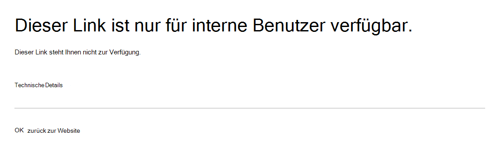

# Verhinderung von Datenverlust (DLP) und Microsoft Teams.

> [!NOTE]
> Funktionen zur Verhinderung von Datenverlust wurden kürzlich Microsoft Teams Chat- und Kanalnachrichten für Benutzer hinzugefügt, die für Office 365 E5/A5, Microsoft 365 E5/A5, Microsoft 365 Information Protection and Governance oder Office 365 Advanced Compliance lizenziert sind. Office 365 und Microsoft 365 E3 enthalten DLP-Schutz für SharePoint Online, OneDrive und Exchange Online. Dies umfasst auch Dateien, die über Teams freigegeben werden, Teams SharePoint Online und OneDrive zum Freigeben von Dateien verwendet.
Für die Unterstützung des DLP-Schutzes in Teams Chat ist E5 erforderlich.
Weitere Informationen zu den Lizenzierungsanforderungen finden Sie unter [Microsoft 365-Dienste auf Mandantenebene – Leitfaden zur Lizenzierung](/office365/servicedescriptions/microsoft-365-service-descriptions/microsoft-365-tenantlevel-services-licensing-guidance).

## Übersicht über DLP für Microsoft Teams

Kürzlich wurden [die Funktionen zur](dlp-learn-about-dlp.md) Verhinderung von Datenverlust erweitert, um Microsoft Teams Chat- und Kanalnachrichten, einschließlich Nachrichten des privaten **Kanals, zu umfassen.** 

> [!IMPORTANT]
> DLP gilt derzeit nur für die tatsächlichen Nachrichten im Chat- oder Kanalthread. Aktivitätsbenachrichtigungen – die eine kurze Nachrichtenvorschau enthalten und basierend  auf den Benachrichtigungseinstellungen eines Benutzers angezeigt werden – sind derzeit nicht in Teams DLP enthalten. Alle vertraulichen Informationen im Teil der Nachricht, der in der Vorschau angezeigt wird, bleiben in der Benachrichtigung sichtbar, auch nachdem die DLP-Richtlinie angewendet und vertrauliche Informationen entfernt wurde, die die Nachricht selbst enthält.

Wenn Ihre Organisation über DLP verfügt, können Sie jetzt Richtlinien definieren, die verhindern, dass Personen vertrauliche Informationen in einer Microsoft Teams oder Chatsitzung freigeben. Hier sind einige Beispiele für die Funktionsweise dieses Schutzes:

- **Beispiel 1: Schützen vertraulicher Informationen in Nachrichten**. Angenommen, jemand versucht, vertrauliche Informationen in einem Teams oder Kanal mit Gästen (externen Benutzern) zu teilen. Wenn Sie eine DLP-Richtlinie definiert haben, um dies zu verhindern, werden Nachrichten mit vertraulichen Informationen, die an externe Benutzer gesendet werden, gelöscht. Dies geschieht automatisch und innerhalb von Sekunden, je nach Konfiguration Ihrer DLP-Richtlinie.

    > [!NOTE]
    > DLP für Microsoft Teams blockiert vertrauliche Inhalte, wenn sie für Microsoft Teams freigegeben werden, die über: - [Gastzugriff](/MicrosoftTeams/guest-access) in Teams und Kanälen; oder - [externer Zugriff](/MicrosoftTeams/manage-external-access) in Besprechungen und Chatsitzungen. 
DLP für externe Chatsitzungen funktioniert nur, wenn sich sowohl der Absender als auch der Empfänger im Teams Nur-Modus befinden und Microsoft Teams [systemeigenen Verbund verwenden.](/microsoftteams/manage-external-access) DLP für Teams blockiert nachrichten nicht in [Interop](/microsoftteams/teams-and-skypeforbusiness-coexistence-and-interoperability#interoperability-of-teams-and-skype-for-business) mit Skype for Business oder nicht nativen Verbundchatsitzungen.

- **Beispiel 2: Schützen vertraulicher Informationen in Dokumenten**. Angenommen, jemand versucht, ein Dokument für Gäste in einem Microsoft Teams oder Chat zu teilen, und das Dokument enthält vertrauliche Informationen. Wenn Sie eine DLP-Richtlinie definiert haben, um dies zu verhindern, wird das Dokument für diese Benutzer nicht geöffnet. Beachten Sie, dass ihre DLP-Richtlinie in diesem Fall SharePoint und OneDrive, damit der Schutz möglich ist. (Dies ist ein Beispiel für DLP für SharePoint, das in Microsoft Teams gezeigt wird und daher erfordert, dass Benutzer für Office 365 DLP (in Office 365 E3 enthalten) lizenziert sind, aber keine Lizenz für Office 365 Advanced Compliance.)

## Richtlinientipps helfen Bei der Schulung von Benutzern

Ähnlich wie DLP in [Exchange-, Outlook-, Outlook](data-loss-prevention-policies.md#policy-evaluation-in-exchange-online-outlook-and-outlook-on-the-web)im Web, [SharePoint Online, OneDrive for Business-Websites](data-loss-prevention-policies.md#policy-evaluation-in-onedrive-for-business-and-sharepoint-online-sites)und Office-Desktopclients funktioniert, werden Richtlinientipps angezeigt, wenn eine Aktion mit einer DLP-Richtlinie in Konflikt steht.  Hier ist ein Beispiel für einen Richtlinientipp:

In diesem Fall hat der Absender versucht, eine Sozialversicherungsnummer in einem Microsoft Teams teilen. Der **Link Was kann ich tun?** öffnet ein Dialogfeld, das Optionen zum Beheben des Problems für den Absender bietet. Beachten Sie, dass der Absender in diesem Fall die Richtlinie außer Kraft setzen oder einen Administrator benachrichtigen kann, um die Richtlinie zu überprüfen und zu beheben.

In Ihrer Organisation können Sie festlegen, dass Benutzer eine DLP-Richtlinie außer Kraft setzen können. Und wenn Sie Ihre DLP-Richtlinien konfigurieren, können Sie die Standardrichtlinientipps verwenden oder [Richtlinientipps](#to-customize-policy-tips) für Ihre Organisation anpassen.

Kehren Sie zu unserem Beispiel zurück, in dem ein Absender eine Sozialversicherungsnummer in einem Teams freigegeben hat. Hier sehen Sie, was der Empfänger gesehen hat:

> [!div class="mx-imgBorder"]
> 

### Anpassen von Richtlinientipps

Um diese Aufgabe ausführen zu können, muss Ihnen eine Rolle zugewiesen sein, die über Berechtigungen zum Bearbeiten von DLP-Richtlinien verfügt. Weitere Informationen hierzu finden Sie unter [Berechtigungen](data-loss-prevention-policies.md#permissions).

1. Wechseln Sie zum Security & Compliance Center ( [https://protection.office.com](https://protection.office.com) ) und melden Sie sich an.

2. Wählen **Sie Richtlinie zur Verhinderung von Datenverlust**  >  **aus.**

3. Wählen Sie eine Richtlinie aus, und wählen Sie **neben Richtlinieneinstellungen** bearbeiten **aus.**

4. Erstellen Sie entweder eine neue Regel, oder bearbeiten Sie eine vorhandene Regel für die Richtlinie.

    > [!div class="mx-imgBorder"]
    > 

5. Wählen Sie **auf der Registerkarte** Benutzerbenachrichtigungen die Option E-Mail-Text **anpassen** und/oder **Richtlinientipptextoptionen** anpassen aus.

    > [!div class="mx-imgBorder"]
    >    

6. Geben Sie den Text an, den Sie für E-Mail-Benachrichtigungen und/oder Richtlinientipps verwenden möchten, und wählen Sie dann **Speichern aus.**

7. Wählen Sie **auf der** Registerkarte Richtlinieneinstellungen die Option **Speichern aus.**

Lassen Sie ungefähr eine Stunde, bis Ihre Änderungen ihren Weg durch Ihr Rechenzentrum und die Synchronisierung mit Benutzerkonten finden.
 <!-- why are these syncing to user accounts? -->

## Hinzufügen von Microsoft Teams als Speicherort zu bestehenden DLP-Richtlinien

Um diese Aufgabe ausführen zu können, muss Ihnen eine Rolle zugewiesen sein, die über Berechtigungen zum Bearbeiten von DLP-Richtlinien verfügt. Weitere Informationen hierzu finden Sie unter [Berechtigungen](data-loss-prevention-policies.md#permissions).

1. Wechseln Sie zum Security & Compliance Center ( [https://protection.office.com](https://protection.office.com) ) und melden Sie sich an.

2. Wählen **Sie Richtlinie zur Verhinderung von Datenverlust**  >  **aus.**

3. Wählen Sie eine Richtlinie aus, und sehen Sie sich die Werte unter **Locations an.** Wenn sie Teams **und Kanalnachrichten sehen,** sind Sie alle festgelegt. Klicken Sie auf Bearbeiten, falls **nicht.**

    > [!div class="mx-imgBorder"]
    > 

4. Aktivieren Sie **in** der Spalte Status die Richtlinie für Teams **Chat- und Kanalnachrichten**.

    > [!div class="mx-imgBorder"]
    > 

5. Behalten Sie **auf der** Registerkarte Speicherorte auswählen die Standardeinstellung aller Konten bei, oder wählen Sie Let me choose **specific locations** aus. Sie können Folgendes angeben:

    1. Bis zu 1.000 einzelne Konten zum Ein- oder Ausschließen
    1. Verteilerlisten und Sicherheitsgruppen, die ein- oder ausgeschlossen werden. 
    <!-- 1. the shared mailbox of a shared channel. **This is a public preview feature.**--> 
    
6. Wählen Sie dann **Weiter** aus.

7. Klicken Sie auf **Speichern**.

Lassen Sie ungefähr eine Stunde, bis Ihre Änderungen ihren Weg durch Ihr Rechenzentrum und die Synchronisierung mit Benutzerkonten finden.
<!-- again, why user accounts? -->

## Definieren einer neuen DLP-Richtlinie für Microsoft Teams

Um diese Aufgabe ausführen zu können, muss Ihnen eine Rolle zugewiesen sein, die über Berechtigungen zum Bearbeiten von DLP-Richtlinien verfügt. Weitere Informationen hierzu finden Sie unter [Berechtigungen](data-loss-prevention-policies.md#permissions).

1. Wechseln Sie zum Security & Compliance Center ( [https://protection.office.com](https://protection.office.com) ) und melden Sie sich an.

2. Wählen **Sie Richtlinie zur Verhinderung von**  >  **Datenverlust**  >  **+ Erstellen einer Richtlinie aus.**

3. Wählen Sie [eine Vorlage](data-loss-prevention-policies.md#dlp-policy-templates)aus, und wählen Sie dann **Weiter aus.**

    In unserem Beispiel haben wir die Vorlage für personenbezogene Daten in den USA ausgewählt.

    > [!div class="mx-imgBorder"]
    >  

4. Geben Sie **auf der Registerkarte** Name Ihrer Richtlinie einen Namen und eine Beschreibung für die Richtlinie an, und wählen Sie dann Weiter **aus.**

5. Behalten Sie **auf der** Registerkarte Speicherorte auswählen die Standardeinstellung aller Konten bei, oder wählen Sie Let me choose **specific locations** aus. Sie können Folgendes angeben:

    1. Bis zu 1.000 einzelne Konten zum Ein- oder Ausschließen
    1. Verteilerlisten und Sicherheitsgruppen, die ein- oder ausgeschlossen werden. **Dies ist ein öffentliches Vorschaufeature.**
    <!-- 1. the shared mailbox of a shared channel. **This is a public preview feature.**-->  

    

    > [!NOTE]
    > Wenn Sie sicherstellen möchten, dass Dokumente, die vertrauliche Informationen enthalten, in Teams nicht unangemessen freigegeben werden, stellen Sie sicher, dass **SharePoint-Websites** und **OneDrive-Konten** sowie Teams Chat- und Kanalnachrichten aktiviert **sind.**

6. Behalten Sie **auf** der Registerkarte Richtlinieneinstellungen unter Anpassen des Zu schützende Inhaltstyps die Standardeinstellungen für einfache Einstellungen bei, oder wählen Sie **Erweiterte** Einstellungen verwenden aus, und wählen Sie dann **Weiter aus.** Wenn Sie erweiterte Einstellungen auswählen, können Sie Regeln für Ihre Richtlinie erstellen oder bearbeiten. (Informationen dazu finden Sie unter [Einfache Einstellungen im Vergleich zu erweiterten Einstellungen](data-loss-prevention-policies.md#simple-settings-vs-advanced-settings).)

7.  Überprüfen Sie **auf der** Registerkarte Richtlinieneinstellungen unter Was möchten Sie tun, wenn vertrauliche Informationen erkannt **werden?** die Einstellungen. (Hier können Sie standardrichtlinientipps und E-Mail-Benachrichtigungen behalten oder anpassen.)

    > [!div class="mx-imgBorder"]
    > 

    Wenn Sie die Einstellungen überprüft oder bearbeitet haben, wählen Sie **Weiter aus.**

8. Wählen  Sie auf der Registerkarte Richtlinieneinstellungen unter Möchten Sie die Richtlinie aktivieren oder dinge zuerst **testen?** [aus,](data-loss-prevention-policies.md#roll-out-dlp-policies-gradually-with-test-mode)ob die Richtlinie aktiviert werden soll, testen Sie sie zuerst, oder lassen Sie sie vorerst deaktiviert, und wählen Sie dann **Weiter** aus.

    > [!div class="mx-imgBorder"]
    > 

9. Überprüfen Sie **auf der Registerkarte** Einstellungen überprüfen die Einstellungen für Ihre neue Richtlinie. Wählen **Sie Bearbeiten** aus, um Änderungen vorzunehmen. Wenn Sie fertig sind, wählen Sie **Erstellen aus.**

Lassen Sie ungefähr eine Stunde zu, bis Ihre neue Richtlinie ihren Weg durch Ihr Rechenzentrum durcharbeiten und mit Benutzerkonten synchronisieren kann.

## Verhindern des externen Zugriffs auf vertrauliche Dokumente

Wählen Sie Folgendes aus, um sicherzustellen, dass SharePoint, die vertrauliche Informationen enthalten, nicht von externen Gästen entweder von SharePoint oder Teams zugegriffen werden kann:

- Sie können sicherstellen, dass Dokumente geschützt sind, bis DLP sie überprüft und als sicher für die Freigabe markiert, indem Sie neue Dateien standardmäßig als [vertraulich kennzeichnen.](/sharepoint/sensitive-by-default)

- Empfohlene DLP-Richtlinienstruktur

    - **Bedingungen:**
        - Inhalt enthält einen der folgenden Typen vertraulicher Informationen: [Alle gilt auswählen]
        
        - Inhalte werden von Microsoft 365 für Personen außerhalb meiner Organisation freigegeben
        
          > [!div class="mx-imgBorder"]
          > 

    - **Aktionen**
        - Zugriff auf den Inhalt für externe Benutzer einschränken
        
        - Benutzer per E-Mail und mit Richtlinientipps benachrichtigen
        
        - Vorfallberichte an den Administrator senden
        
        > [!div class="mx-imgBorder"]
        > 

DLP-Richtlinie in Aktion beim Versuch, ein Dokument in SharePoint, das vertrauliche Informationen für einen externen Gast enthält:

> [!div class="mx-imgBorder"]
> 

DLP-Richtlinie in Aktion, wenn Gast versucht, ein Dokument in einem Teams mit externem Block zu öffnen:

> [!div class="mx-imgBorder"]
> 

## Verwandte Artikel

[Erstellen, Testen und Optimieren einer DLP-Richtlinie](create-test-tune-dlp-policy.md)

[Senden von E-Mail-Benachrichtigungen und Anzeigen von Richtlinientipps für DLP-Richtlinien](use-notifications-and-policy-tips.md)
